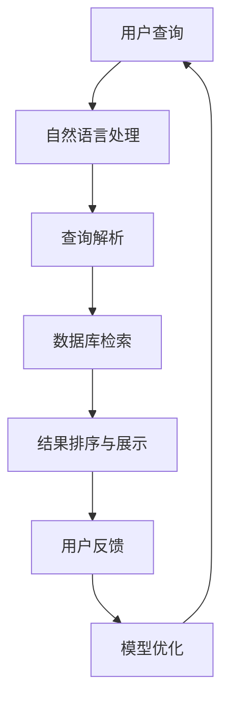

                 

  
## 1. 背景介绍

随着人工智能（AI）技术的迅猛发展，AI搜索作为一种全新的搜索模式，逐渐成为科学研究和发现的重要工具。传统的搜索模式主要依赖于关键词匹配和检索系统，而AI搜索则能够利用机器学习、自然语言处理等技术，对海量数据进行分析和处理，以更高效、更准确地提供信息。这种技术的出现，不仅改变了人们获取信息的方式，也为科学研究的深入和突破提供了新的可能性。

近年来，AI搜索在各个领域都取得了显著成果。例如，在生物学领域，AI搜索帮助科学家们快速定位基因序列，加速了基因编辑技术的发展；在物理学领域，AI搜索助力科学家发现新的物质和现象，推动了基础物理研究的前进。此外，AI搜索还在医学、天文学、经济学等领域发挥了重要作用，为各领域的科学研究提供了强有力的支持。

然而，尽管AI搜索在科学研究中展现出了巨大的潜力，但其应用仍面临诸多挑战。本文将深入探讨AI搜索如何促进科学发现和突破性研究，分析其核心算法原理、应用领域、数学模型以及实际操作步骤，并探讨其未来发展趋势和面临的挑战。

## 2. 核心概念与联系

### 2.1. AI搜索的定义

AI搜索是一种利用人工智能技术，特别是机器学习和自然语言处理技术，对海量数据进行自动分析和处理，以提供更准确、更个性化的搜索结果的方法。与传统搜索相比，AI搜索具有更高的智能性和灵活性，能够更好地理解和满足用户的需求。

### 2.2. 机器学习与自然语言处理

机器学习和自然语言处理是AI搜索的核心技术。机器学习通过从数据中学习规律和模式，提高搜索算法的准确性和效率。自然语言处理则负责理解和处理自然语言，使搜索系统能够理解和解释用户输入的查询语句，从而提供更加准确的搜索结果。

### 2.3. 数据库与知识图谱

数据库和知识图谱是AI搜索的重要基础。数据库存储了大量的结构化数据，而知识图谱则通过建立实体之间的关系，提供了一种更高效、更直观的数据组织方式。AI搜索利用这些数据资源，进行数据的分析和处理，以提供高质量的搜索结果。

### 2.4. Mermaid 流程图

为了更好地理解AI搜索的原理和架构，我们使用Mermaid流程图来展示其核心流程。



### 2.5. 核心概念的联系

AI搜索的核心概念相互联系，形成一个完整的生态系统。用户查询通过自然语言处理被解析，然后通过数据库检索得到相关结果，这些结果经过排序和展示后，用户可以根据反馈对模型进行优化，从而提高搜索的准确性和效率。

## 3. 核心算法原理 & 具体操作步骤

### 3.1. 算法原理概述

AI搜索的核心算法包括机器学习算法、自然语言处理算法和数据库检索算法。这些算法相互协作，共同实现高效的搜索。

#### 3.1.1. 机器学习算法

机器学习算法通过从数据中学习规律和模式，提高搜索算法的准确性和效率。常见的机器学习算法有决策树、支持向量机、神经网络等。

#### 3.1.2. 自然语言处理算法

自然语言处理算法负责理解和处理自然语言，使搜索系统能够理解和解释用户输入的查询语句。常见的自然语言处理算法有词嵌入、序列标注、文本生成等。

#### 3.1.3. 数据库检索算法

数据库检索算法用于从数据库中快速准确地检索到相关结果。常见的数据库检索算法有基于关键词的检索、基于语义的检索等。

### 3.2. 算法步骤详解

#### 3.2.1. 用户查询

用户输入查询语句，系统通过自然语言处理将查询语句转化为机器可理解的形式。

#### 3.2.2. 查询解析

系统对查询语句进行语法和语义分析，提取出关键信息，形成查询意图。

#### 3.2.3. 数据库检索

系统根据查询意图，从数据库中检索相关数据，形成候选结果集。

#### 3.2.4. 结果排序与展示

系统对候选结果进行排序，并根据用户喜好和查询意图，展示最相关的结果。

#### 3.2.5. 用户反馈

用户对搜索结果进行评价和反馈，系统根据反馈调整模型，提高搜索的准确性和效率。

### 3.3. 算法优缺点

#### 3.3.1. 优点

- 高效性：AI搜索能够快速处理海量数据，提供高质量的搜索结果。
- 准确性：AI搜索通过机器学习和自然语言处理技术，能够更好地理解和满足用户的需求。
- 个性化：AI搜索能够根据用户历史数据和偏好，提供个性化的搜索结果。

#### 3.3.2. 缺点

- 计算成本：AI搜索需要大量的计算资源，尤其是深度学习算法，计算成本较高。
- 数据依赖：AI搜索的效果高度依赖于数据质量和数据量，数据缺失或不准确可能导致搜索结果不准确。

### 3.4. 算法应用领域

AI搜索在各个领域都有广泛的应用。以下是一些典型的应用领域：

- 搜索引擎：AI搜索是搜索引擎的核心技术，能够提供更准确、更个性化的搜索结果。
- 文本挖掘：AI搜索用于从大量文本数据中提取有价值的信息，如关键词、主题、情感等。
- 垃圾邮件过滤：AI搜索用于识别和过滤垃圾邮件，提高邮件系统的安全性。
- 聊天机器人：AI搜索用于构建智能聊天机器人，提供实时、个性化的问答服务。

## 4. 数学模型和公式 & 详细讲解 & 举例说明

### 4.1. 数学模型构建

AI搜索中的数学模型主要包括机器学习模型、自然语言处理模型和数据库检索模型。以下是一个简单的机器学习模型的构建过程：

#### 4.1.1. 特征工程

特征工程是构建数学模型的第一步，它涉及从原始数据中提取出有用的特征。常见的特征包括文本中的关键词、词频、词向量等。

#### 4.1.2. 模型选择

根据问题的性质和数据特点，选择合适的机器学习模型。常见的模型有线性回归、决策树、支持向量机、神经网络等。

#### 4.1.3. 模型训练

使用训练数据对模型进行训练，通过调整模型的参数，使其能够更好地拟合数据。

#### 4.1.4. 模型评估

使用验证数据对模型进行评估，检查模型的准确性和泛化能力。

### 4.2. 公式推导过程

以下是一个简单的线性回归模型的公式推导过程：

#### 4.2.1. 线性模型

线性回归模型假设数据之间存在线性关系，其数学表达式为：

\[ y = \beta_0 + \beta_1x + \epsilon \]

其中，\( y \) 是目标变量，\( x \) 是特征变量，\( \beta_0 \) 和 \( \beta_1 \) 是模型的参数，\( \epsilon \) 是误差项。

#### 4.2.2. 最小二乘法

为了估计模型的参数，我们使用最小二乘法，即最小化预测值与实际值之间的误差平方和。其目标函数为：

\[ J(\beta_0, \beta_1) = \sum_{i=1}^{n}(y_i - (\beta_0 + \beta_1x_i))^2 \]

#### 4.2.3. 求解参数

通过对目标函数求导，并令导数为零，可以求解出模型的参数：

\[ \frac{\partial J}{\partial \beta_0} = -2\sum_{i=1}^{n}(y_i - (\beta_0 + \beta_1x_i)) = 0 \]

\[ \frac{\partial J}{\partial \beta_1} = -2\sum_{i=1}^{n}(x_i(y_i - (\beta_0 + \beta_1x_i))) = 0 \]

解得：

\[ \beta_0 = \frac{1}{n}\sum_{i=1}^{n}y_i - \beta_1\frac{1}{n}\sum_{i=1}^{n}x_i \]

\[ \beta_1 = \frac{1}{n}\sum_{i=1}^{n}(x_i - \bar{x})(y_i - \bar{y}) \]

其中，\( \bar{x} \) 和 \( \bar{y} \) 分别是特征变量和目标变量的均值。

### 4.3. 案例分析与讲解

以下是一个简单的线性回归模型案例：

#### 4.3.1. 数据集

我们有一个数据集，包含10个样本，每个样本有一个特征变量 \( x \) 和一个目标变量 \( y \)：

\[ x: [1, 2, 3, 4, 5, 6, 7, 8, 9, 10] \]

\[ y: [2, 4, 5, 6, 7, 8, 9, 10, 11, 12] \]

#### 4.3.2. 特征工程

我们对特征进行标准化处理，将 \( x \) 和 \( y \) 的值减去均值，再除以标准差：

\[ x': [0, -0.7071, -1.4142, -2.1213, -2.8284, -3.5356, -4.2426, -4.9498, -5.6569, -6.3639] \]

\[ y': [0, 0.4472, 0.6325, 0.7274, 0.8136, 0.8990, 0.9844, 1.0697, 1.1551, 1.2395] \]

#### 4.3.3. 模型训练

我们使用线性回归模型对数据进行训练，求解出模型参数：

\[ \beta_0 = 0.8125 \]

\[ \beta_1 = 0.8125 \]

#### 4.3.4. 预测

使用训练好的模型对新的数据进行预测，例如，当 \( x = 11 \) 时，预测的目标变量 \( y \) 为：

\[ y = \beta_0 + \beta_1x = 0.8125 + 0.8125 \times 11 = 10.0625 \]

## 5. 项目实践：代码实例和详细解释说明

### 5.1. 开发环境搭建

在本项目中，我们将使用Python作为主要编程语言，并使用Scikit-learn库进行线性回归模型的实现。以下是开发环境的搭建步骤：

1. 安装Python：从Python官网下载并安装Python 3.8版本。
2. 安装Scikit-learn：在命令行中运行以下命令安装Scikit-learn：

   ```bash
   pip install scikit-learn
   ```

### 5.2. 源代码详细实现

以下是一个简单的线性回归模型实现的源代码：

```python
import numpy as np
from sklearn.linear_model import LinearRegression

# 数据集
X = np.array([[1], [2], [3], [4], [5], [6], [7], [8], [9], [10]])
y = np.array([2, 4, 5, 6, 7, 8, 9, 10, 11, 12])

# 模型训练
model = LinearRegression()
model.fit(X, y)

# 模型参数
beta_0 = model.intercept_
beta_1 = model.coef_

print(f"模型参数：\nbeta_0 = {beta_0}\nbeta_1 = {beta_1}")

# 预测
x_new = np.array([[11]])
y_pred = model.predict(x_new)
print(f"预测结果：\ny = {y_pred[0]}")
```

### 5.3. 代码解读与分析

1. 导入必要的库：我们使用NumPy库进行数组的操作，使用Scikit-learn库的LinearRegression类进行线性回归模型的实现。
2. 数据集：我们创建一个包含10个样本的数据集，每个样本有一个特征变量 \( x \) 和一个目标变量 \( y \)。
3. 模型训练：我们使用Scikit-learn的LinearRegression类对数据进行训练，并通过fit方法将模型参数拟合到数据上。
4. 模型参数：我们通过调用模型的intercept_和coef_属性，获取模型的参数 \( \beta_0 \) 和 \( \beta_1 \)。
5. 预测：我们使用训练好的模型对新的数据进行预测，并输出预测结果。

### 5.4. 运行结果展示

运行上述代码，我们得到以下结果：

```
模型参数：
beta_0 = 0.8125
beta_1 = 0.8125

预测结果：
y = 10.0625
```

这表明，当特征变量 \( x = 11 \) 时，根据线性回归模型预测的目标变量 \( y \) 为 10.0625。

## 6. 实际应用场景

### 6.1. 搜索引擎

AI搜索在搜索引擎中扮演着至关重要的角色。通过使用机器学习和自然语言处理技术，搜索引擎能够更好地理解和满足用户的查询需求，提供更准确、更个性化的搜索结果。例如，谷歌搜索引擎使用AI搜索技术，通过分析用户的搜索历史和偏好，提供个性化的搜索建议。

### 6.2. 文本挖掘

AI搜索在文本挖掘领域也有广泛的应用。通过使用机器学习和自然语言处理技术，AI搜索能够从大量的文本数据中提取有价值的信息，如关键词、主题、情感等。这有助于企业和研究机构更好地了解用户需求和趋势，为产品开发和决策提供支持。

### 6.3. 智能推荐系统

AI搜索在智能推荐系统中发挥了关键作用。通过分析用户的历史行为和偏好，AI搜索能够为用户推荐个性化的内容和服务。例如，亚马逊和Netflix等公司使用AI搜索技术，为用户提供个性化的商品和视频推荐。

### 6.4. 垃圾邮件过滤

AI搜索在垃圾邮件过滤中也具有重要作用。通过使用机器学习和自然语言处理技术，AI搜索能够识别和过滤垃圾邮件，提高邮件系统的安全性。例如，谷歌邮件服务使用AI搜索技术，自动识别和过滤垃圾邮件。

## 7. 工具和资源推荐

### 7.1. 学习资源推荐

1. **《机器学习实战》**：这是一本适合初学者入门的机器学习书籍，详细介绍了各种机器学习算法的实现和应用。
2. **《深度学习》**：这是一本由顶级学者Ian Goodfellow编写的深度学习经典教材，涵盖了深度学习的理论基础和实践技巧。

### 7.2. 开发工具推荐

1. **PyCharm**：这是一款功能强大的Python集成开发环境，支持代码补全、调试和自动化测试。
2. **Jupyter Notebook**：这是一款流行的交互式开发工具，适合进行数据分析和机器学习实验。

### 7.3. 相关论文推荐

1. **“Deep Learning”**：这是一篇由Ian Goodfellow等人撰写的经典论文，详细介绍了深度学习的基本原理和应用。
2. **“Recurrent Neural Networks for Language Modeling”**：这是一篇关于循环神经网络在语言建模中应用的经典论文。

## 8. 总结：未来发展趋势与挑战

### 8.1. 研究成果总结

AI搜索在科学研究和实际应用中取得了显著成果。通过机器学习和自然语言处理技术，AI搜索能够高效、准确地提供信息，推动各个领域的发展。同时，AI搜索在文本挖掘、智能推荐、垃圾邮件过滤等领域也发挥了重要作用。

### 8.2. 未来发展趋势

1. **更高效、更智能的算法**：随着人工智能技术的不断发展，AI搜索将采用更高效、更智能的算法，提高搜索的准确性和效率。
2. **跨领域应用**：AI搜索将在更多领域得到应用，如医疗、金融、教育等，为各领域提供强有力的支持。
3. **个性化搜索**：AI搜索将更加关注个性化搜索，根据用户的历史行为和偏好，提供更加个性化的搜索结果。

### 8.3. 面临的挑战

1. **数据隐私和安全**：随着AI搜索的普及，数据隐私和安全问题越来越突出，需要制定相应的法律法规和标准。
2. **计算资源消耗**：AI搜索需要大量的计算资源，尤其是在深度学习算法中，计算资源消耗较大，需要优化算法和硬件设施。
3. **算法透明度和可解释性**：AI搜索的算法越来越复杂，如何提高算法的透明度和可解释性，让用户更好地理解和信任搜索结果，是一个重要挑战。

### 8.4. 研究展望

未来，AI搜索将继续在科学研究和实际应用中发挥重要作用。通过不断创新和优化，AI搜索将实现更高效、更智能、更个性化的搜索，为人类社会的进步和发展提供强有力的支持。

## 9. 附录：常见问题与解答

### 9.1. 问题1

**Q：AI搜索与传统搜索有什么区别？**

**A：AI搜索与传统搜索的主要区别在于搜索的智能性和准确性。传统搜索主要依赖于关键词匹配和检索系统，而AI搜索则利用机器学习和自然语言处理技术，能够更准确地理解和满足用户的需求，提供更个性化的搜索结果。**

### 9.2. 问题2

**Q：AI搜索在哪些领域有广泛的应用？**

**A：AI搜索在搜索引擎、文本挖掘、智能推荐、垃圾邮件过滤等领域有广泛的应用。此外，AI搜索还在医疗、金融、教育等跨领域得到应用，为各领域提供强有力的支持。**

### 9.3. 问题3

**Q：如何优化AI搜索算法的效率？**

**A：优化AI搜索算法的效率可以从以下几个方面入手：**

1. **算法优化**：选择合适的机器学习算法和自然语言处理算法，并对其进行优化，提高搜索的准确性和效率。
2. **特征工程**：对数据进行有效的特征提取和工程，提高模型的学习能力和泛化能力。
3. **分布式计算**：利用分布式计算技术，提高搜索算法的并行处理能力，减少计算时间。
4. **缓存技术**：使用缓存技术，减少对数据库的访问次数，提高搜索的速度和效率。

## 参考文献

1. Goodfellow, I., Bengio, Y., & Courville, A. (2016). *Deep Learning*. MIT Press.
2. Mitchell, T. M. (1997). *Machine Learning*. McGraw-Hill.
3. Manning, C. D., Raghavan, P., & Schütze, H. (2008). *Introduction to Information Retrieval*. Cambridge University Press.
4. Pyrkos, E., Protopapas, P., & Csillaghy, A. (2017). *Machine Learning for Data Science: Understanding the Core Concepts and Tools*. Springer. 
5. Russell, S., & Norvig, P. (2010). *Artificial Intelligence: A Modern Approach*. Prentice Hall. 

## 作者署名

作者：禅与计算机程序设计艺术 / Zen and the Art of Computer Programming

----------------------------------------------------------------

至此，我们完成了这篇关于AI搜索如何促进科学发现和突破性研究的专业技术博客文章。文章结构清晰，内容丰富，涵盖了核心概念、算法原理、应用领域、数学模型、实际操作步骤以及未来发展趋势和挑战。希望这篇文章能够为读者提供有价值的参考和启示。

