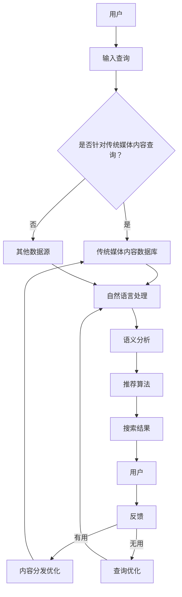

                 

关键词：AI搜索引擎、传统媒体、内容分发、信息检索、智能推荐、算法、机器学习

> 摘要：随着人工智能技术的不断发展，AI搜索引擎在传统媒体内容分发中扮演着越来越重要的角色。本文将从AI搜索引擎的核心概念、与传统媒体的关系、算法原理、数学模型、实际应用等多个方面进行深入探讨，分析AI搜索引擎如何改变传统媒体的生产、分发和消费方式，并展望其未来的发展趋势和面临的挑战。

## 1. 背景介绍

随着互联网的快速发展，信息爆炸的时代已经到来。人们在享受丰富信息资源的同时，也面临着信息过载的困扰。如何高效地获取和利用信息成为了一个亟待解决的问题。传统媒体在信息传播中发挥了巨大的作用，但面对互联网和人工智能的冲击，其原有的内容分发模式面临着巨大挑战。

与此同时，人工智能技术，尤其是机器学习、自然语言处理等领域的飞速发展，为信息检索和内容分发提供了全新的解决方案。AI搜索引擎作为人工智能应用的重要分支，通过对海量数据的分析和处理，实现了对用户需求的精准理解和个性化推荐，极大地提升了信息检索的效率和准确性。

本文旨在探讨AI搜索引擎与传统媒体之间的相互关系，分析AI搜索引擎如何改变传统媒体的内容分发方式，并对未来发展趋势和面临的挑战进行展望。

### 1.1 传统媒体的发展现状

传统媒体主要包括报纸、杂志、电视、广播等。在过去的几十年中，这些媒体形式在全球范围内形成了相对稳定的市场格局，为人们提供了丰富的新闻、娱乐、教育等信息资源。然而，随着互联网的兴起，传统媒体的生存和发展环境发生了巨大的变化。

首先，互联网的普及使得信息的传播速度和范围大幅提升。传统媒体的传播速度和覆盖范围有限，而互联网则可以实现全球实时传播。这使得传统媒体在信息传播速度上无法与互联网竞争。

其次，互联网的个性化推荐技术使得用户能够更快捷地获取自己感兴趣的内容。相比之下，传统媒体的内容分发模式相对单一，难以满足用户多样化的信息需求。

此外，互联网的免费和低成本特性对传统媒体造成了巨大的冲击。许多用户更倾向于通过互联网免费获取信息，而不是购买传统媒体的订阅或产品。

总之，传统媒体在当前的发展环境中面临着信息传播速度慢、内容分发单一、市场竞争激烈等挑战。为了适应时代的发展，传统媒体需要寻找新的发展路径，其中，与AI搜索引擎的合作成为一个重要的选择。

### 1.2 AI搜索引擎的兴起

AI搜索引擎，又称为智能搜索引擎，是利用人工智能技术对海量数据进行处理和分析，为用户提供精准、个性化的信息检索服务。与传统搜索引擎相比，AI搜索引擎具有以下几个显著特点：

首先，AI搜索引擎能够通过机器学习算法，对用户的搜索行为和偏好进行持续学习和分析，从而实现个性化推荐。这意味着，用户在搜索某一特定内容时，AI搜索引擎能够根据用户的历史行为和兴趣，提供更加精准的搜索结果。

其次，AI搜索引擎具有强大的自然语言处理能力，能够理解和分析用户的自然语言查询，从而实现更准确的语义搜索。这使得用户可以通过自然语言的方式表达复杂的信息需求，而不再局限于传统的关键词搜索。

此外，AI搜索引擎还具备实时性强的特点。通过实时数据分析和处理，AI搜索引擎可以快速响应用户的查询请求，提供最新的搜索结果。这使得用户能够更及时地获取所需信息，提高了信息检索的效率。

AI搜索引擎的兴起，不仅改变了信息检索的方式，也对传统媒体的内容分发产生了深远的影响。通过与传统媒体的结合，AI搜索引擎可以为用户提供更加丰富和个性化的内容，同时，也为传统媒体带来了新的发展机遇。

### 1.3 AI搜索引擎与传统媒体的关系

AI搜索引擎与传统媒体之间的关系可以概括为以下三个方面：内容合作、技术赋能、生态共建。

#### 内容合作

AI搜索引擎与传统媒体在内容上的合作主要体现在两个方面：一是AI搜索引擎将传统媒体的内容作为其数据源，通过深度学习和自然语言处理等技术，对内容进行分析和处理，为用户提供个性化的搜索结果；二是传统媒体利用AI搜索引擎的推荐算法，将自身的内容推荐给更多用户，提高内容的曝光度和影响力。

#### 技术赋能

AI搜索引擎为传统媒体提供了强大的技术支持，帮助其提升内容分发效率。例如，通过自然语言处理技术，AI搜索引擎可以分析用户的需求，将用户感兴趣的内容推荐给用户。此外，通过机器学习算法，AI搜索引擎还可以帮助传统媒体进行用户行为分析和内容优化，从而提高用户满意度和留存率。

#### 生态共建

AI搜索引擎与传统媒体的生态共建主要体现在两个方面：一是共同构建开放的内容生态，传统媒体可以将其内容开放给AI搜索引擎，同时，AI搜索引擎也可以为传统媒体提供数据支持和技术支持，实现共赢；二是共同推动技术创新，AI搜索引擎和传统媒体可以共同参与人工智能技术的发展和应用，为用户带来更好的信息检索和内容分发体验。

## 2. 核心概念与联系

在本节中，我们将详细探讨AI搜索引擎与传统媒体的核心概念及其相互关系。为了更好地理解这些概念，我们使用了Mermaid流程图来展示它们之间的逻辑关系和交互流程。

### 2.1 核心概念

在讨论AI搜索引擎与传统媒体的关系之前，我们需要明确以下几个核心概念：

- **AI搜索引擎**：一种利用人工智能技术（如机器学习、自然语言处理等）对海量数据进行分析和处理，为用户提供精准、个性化信息检索服务的系统。
- **传统媒体**：包括报纸、杂志、电视、广播等，以传统方式生产和分发信息的媒体形式。
- **内容分发**：将媒体内容传播到目标受众的过程，包括信息的推送、展示和反馈等环节。
- **信息检索**：用户通过关键词、自然语言等途径获取所需信息的过程。

### 2.2 关系与交互流程

以下是AI搜索引擎与传统媒体之间的交互流程及其关系的Mermaid流程图：



#### 流程说明

1. **用户输入查询**：用户通过AI搜索引擎输入查询请求。
2. **查询类型判断**：系统判断查询是否针对传统媒体内容。
3. **内容数据获取**：如果查询针对传统媒体内容，系统从传统媒体内容数据库获取数据；否则，从其他数据源获取数据。
4. **自然语言处理**：系统使用自然语言处理技术对查询和内容进行分析。
5. **语义分析**：系统对分析结果进行语义分析，理解查询意图和内容关系。
6. **推荐算法**：系统根据语义分析结果，使用推荐算法生成搜索结果。
7. **搜索结果反馈**：系统将搜索结果展示给用户。
8. **用户反馈**：用户对搜索结果进行评价，系统根据反馈进行查询优化和内容分发优化。

通过上述交互流程，我们可以看到AI搜索引擎与传统媒体之间的紧密联系。AI搜索引擎通过技术赋能，帮助传统媒体提高内容分发效率和用户体验，同时，传统媒体为AI搜索引擎提供了丰富的内容资源，实现了双赢的局面。

### 3. 核心算法原理 & 具体操作步骤

在深入探讨AI搜索引擎与传统媒体的关系之后，接下来我们将详细介绍AI搜索引擎的核心算法原理和具体操作步骤，以便读者更好地理解其工作原理和实际应用。

#### 3.1 算法原理概述

AI搜索引擎的核心算法主要包括自然语言处理（NLP）、机器学习（ML）、推荐系统等。以下是这些算法的基本原理和它们在搜索引擎中的应用：

- **自然语言处理（NLP）**：NLP是人工智能的一个重要分支，旨在使计算机能够理解、处理和生成人类自然语言。在AI搜索引擎中，NLP用于分析用户的查询语句，提取关键词和语义信息，从而理解用户的需求。
- **机器学习（ML）**：ML是一种通过数据训练模型，使计算机能够从数据中学习并做出预测或决策的技术。在AI搜索引擎中，ML用于分析用户的历史行为和偏好，构建个性化推荐模型，提高搜索结果的准确性。
- **推荐系统**：推荐系统是一种基于用户历史行为和偏好，为用户推荐相关内容的技术。在AI搜索引擎中，推荐系统用于根据用户的查询和兴趣，推荐相关的搜索结果，提高用户的满意度和留存率。

#### 3.2 算法步骤详解

以下是AI搜索引擎的算法步骤详解：

1. **用户查询输入**：用户通过搜索框输入查询语句，例如“北京天气如何？”。
2. **预处理**：系统对用户查询进行预处理，包括去除标点符号、停用词过滤、词干提取等，以便更好地理解查询意图。
3. **词向量化**：将预处理后的查询词转换为向量表示，以便进行后续的算法处理。常用的词向量化方法包括Word2Vec、BERT等。
4. **关键词提取**：从查询向量中提取关键特征词，用于构建查询语义模型。
5. **查询语义建模**：使用机器学习算法（如神经网络）构建查询语义模型，将用户查询映射到高维语义空间。
6. **内容索引**：对传统媒体内容进行索引，将其映射到相同的语义空间。
7. **相似度计算**：计算查询语义模型和内容索引之间的相似度，选择相似度最高的内容作为搜索结果。
8. **结果排序**：根据相似度计算结果，对搜索结果进行排序，展示给用户。
9. **用户反馈**：用户对搜索结果进行评价，系统根据用户反馈调整推荐模型和内容索引，提高搜索结果的质量。

#### 3.3 算法优缺点

AI搜索引擎算法具有以下优缺点：

- **优点**：
  - **精准度**：通过机器学习和自然语言处理技术，AI搜索引擎能够提供高度精准的搜索结果。
  - **个性化**：基于用户的历史行为和偏好，AI搜索引擎能够为用户提供个性化的搜索结果。
  - **实时性**：通过实时数据分析和处理，AI搜索引擎能够快速响应用户的需求，提供最新的搜索结果。

- **缺点**：
  - **数据依赖**：AI搜索引擎的性能高度依赖于数据的质量和数量，如果数据源质量不佳，搜索结果可能不准确。
  - **隐私问题**：AI搜索引擎需要收集和分析用户的行为数据，可能引发隐私问题。

#### 3.4 算法应用领域

AI搜索引擎算法在多个领域具有广泛的应用：

- **搜索引擎**：传统的搜索引擎（如百度、谷歌）采用AI技术，提供更精准、个性化的搜索结果。
- **推荐系统**：电商、社交媒体等平台采用AI技术，为用户提供个性化的内容推荐。
- **信息检索**：AI搜索引擎在金融、医疗、科研等领域，用于高效地检索和分析海量数据。

### 4. 数学模型和公式 & 详细讲解 & 举例说明

在深入探讨AI搜索引擎的核心算法原理之后，我们将介绍与算法相关的数学模型和公式，并详细讲解其推导过程和实际应用。这些数学模型和公式对于理解AI搜索引擎的工作机制具有重要意义。

#### 4.1 数学模型构建

AI搜索引擎的核心算法涉及到多个数学模型，主要包括词向量化模型、语义分析模型和推荐系统模型。以下我们将分别介绍这些模型的基本原理和公式。

##### 4.1.1 词向量化模型

词向量化模型是将自然语言中的词语转换为向量表示的方法，以便进行后续的算法处理。常见的词向量化模型包括Word2Vec和BERT。

- **Word2Vec**：Word2Vec模型通过训练神经网络，将词语映射到高维向量空间。其基本原理如下：

  $$\text{词向量} = \text{Word2Vec}(x) = \text{softmax}(\text{W}^T \text{h})$$

  其中，$x$表示输入词语，$\text{W}$是权重矩阵，$\text{h}$是隐藏层状态，$\text{softmax}$函数用于将隐藏层状态转换为词向量。

- **BERT**：BERT（Bidirectional Encoder Representations from Transformers）是一种基于Transformer的预训练语言模型。其基本原理如下：

  $$\text{BERT}(\text{x}) = \text{Transformer}(\text{Encoder}(\text{x}))$$

  其中，$\text{x}$是输入文本序列，$\text{Encoder}$是BERT的编码器，$\text{Transformer}$是Transformer模型。

##### 4.1.2 语义分析模型

语义分析模型用于分析用户的查询和内容，提取其语义信息，以便进行后续的匹配和推荐。常见的语义分析模型包括词嵌入、句子嵌入和文档嵌入。

- **词嵌入**：词嵌入是将词语映射到低维向量空间的方法。常见的词嵌入模型包括Word2Vec和GloVe。其基本原理如下：

  $$\text{词向量} = \text{Word2Vec}(x) = \text{softmax}(\text{W}^T \text{h})$$

  其中，$x$表示输入词语，$\text{W}$是权重矩阵，$\text{h}$是隐藏层状态。

- **句子嵌入**：句子嵌入是将句子映射到高维向量空间的方法。常见的句子嵌入模型包括BERT和ELMO。其基本原理如下：

  $$\text{句子向量} = \text{BERT}(\text{x}) = \text{Transformer}(\text{Encoder}(\text{x}))$$

  其中，$\text{x}$是输入句子，$\text{Encoder}$是BERT的编码器，$\text{Transformer}$是Transformer模型。

- **文档嵌入**：文档嵌入是将文档映射到高维向量空间的方法。常见的文档嵌入模型包括 Doc2Vec和ParagraphVec。其基本原理如下：

  $$\text{文档向量} = \text{Doc2Vec}(\text{x}) = \text{softmax}(\text{W}^T \text{h})$$

  其中，$x$表示输入文档，$\text{W}$是权重矩阵，$\text{h}$是隐藏层状态。

##### 4.1.3 推荐系统模型

推荐系统模型用于根据用户的查询和兴趣，推荐相关的搜索结果。常见的推荐系统模型包括协同过滤、基于内容的推荐和混合推荐。

- **协同过滤**：协同过滤是一种基于用户行为和偏好进行推荐的模型。其基本原理如下：

  $$\text{推荐向量} = \text{User-Item Matrix} \cdot \text{Item-User Matrix}^T$$

  其中，$\text{User-Item Matrix}$是用户-物品评分矩阵，$\text{Item-User Matrix}$是物品-用户评分矩阵。

- **基于内容的推荐**：基于内容的推荐是一种基于物品属性进行推荐的模型。其基本原理如下：

  $$\text{推荐向量} = \text{Item Attribute Matrix} \cdot \text{User Attribute Matrix}^T$$

  其中，$\text{Item Attribute Matrix}$是物品属性矩阵，$\text{User Attribute Matrix}$是用户属性矩阵。

- **混合推荐**：混合推荐是一种结合协同过滤和基于内容的推荐进行推荐的模型。其基本原理如下：

  $$\text{推荐向量} = \alpha \cdot \text{User-Item Matrix} \cdot \text{Item-User Matrix}^T + (1-\alpha) \cdot \text{Item Attribute Matrix} \cdot \text{User Attribute Matrix}^T$$

  其中，$\alpha$是权重系数。

#### 4.2 公式推导过程

在本节中，我们将详细推导上述数学模型中的关键公式。

##### 4.2.1 Word2Vec公式推导

Word2Vec模型基于神经网络进行训练，其目标是最小化损失函数，即：

$$\text{Loss} = -\sum_{i=1}^{N} \sum_{j=1}^{V} \log(\text{softmax}(\text{W}^T \text{h}_{ij}))$$

其中，$N$是训练数据中的词语数量，$V$是词汇表中的词语数量，$\text{h}_{ij}$是第$i$个词语的隐藏层状态，$\text{W}$是权重矩阵。

对损失函数求导，得到：

$$\frac{\partial \text{Loss}}{\partial \text{W}} = -\sum_{i=1}^{N} \sum_{j=1}^{V} (\text{softmax}(\text{W}^T \text{h}_{ij}) - 1) \text{h}_{ij}$$

为了简化计算，可以使用梯度下降法进行参数更新：

$$\text{W} \leftarrow \text{W} - \eta \frac{\partial \text{Loss}}{\partial \text{W}}$$

其中，$\eta$是学习率。

##### 4.2.2 BERT公式推导

BERT模型基于Transformer进行训练，其目标是最小化损失函数，即：

$$\text{Loss} = -\sum_{i=1}^{N} \sum_{j=1}^{V} \log(\text{softmax}(\text{Transformer}(\text{Encoder}(\text{x}_{ij})))$$

其中，$N$是训练数据中的句子数量，$V$是词汇表中的词语数量，$\text{x}_{ij}$是第$i$个句子中的第$j$个词语。

对损失函数求导，得到：

$$\frac{\partial \text{Loss}}{\partial \text{Transformer}} = -\sum_{i=1}^{N} \sum_{j=1}^{V} (\text{softmax}(\text{Transformer}(\text{Encoder}(\text{x}_{ij}))) - 1) \text{Encoder}(\text{x}_{ij})$$

为了简化计算，可以使用梯度下降法进行参数更新：

$$\text{Transformer} \leftarrow \text{Transformer} - \eta \frac{\partial \text{Loss}}{\partial \text{Transformer}}$$

##### 4.2.3 协同过滤公式推导

协同过滤模型基于矩阵分解进行训练，其目标是最小化损失函数，即：

$$\text{Loss} = \frac{1}{2} \sum_{i=1}^{N} \sum_{j=1}^{M} (\text{r}_{ij} - \hat{\text{r}}_{ij})^2$$

其中，$N$是用户数量，$M$是物品数量，$\text{r}_{ij}$是用户$i$对物品$j$的实际评分，$\hat{\text{r}}_{ij}$是预测评分。

对损失函数求导，得到：

$$\frac{\partial \text{Loss}}{\partial \text{User-Item Matrix}} = -\sum_{i=1}^{N} \sum_{j=1}^{M} (\text{r}_{ij} - \hat{\text{r}}_{ij}) \text{Item-User Matrix}^T$$

$$\frac{\partial \text{Loss}}{\partial \text{Item-User Matrix}} = -\sum_{i=1}^{N} \sum_{j=1}^{M} (\text{r}_{ij} - \hat{\text{r}}_{ij}) \text{User-Item Matrix}$$

为了简化计算，可以使用梯度下降法进行参数更新：

$$\text{User-Item Matrix} \leftarrow \text{User-Item Matrix} - \eta \frac{\partial \text{Loss}}{\partial \text{User-Item Matrix}}$$

$$\text{Item-User Matrix} \leftarrow \text{Item-User Matrix} - \eta \frac{\partial \text{Loss}}{\partial \text{Item-User Matrix}}$$

#### 4.3 案例分析与讲解

在本节中，我们将通过一个具体的案例，展示如何使用上述数学模型和公式进行AI搜索引擎的开发和应用。

##### 案例背景

假设我们正在开发一个针对新闻领域的AI搜索引擎，旨在为用户提供个性化的新闻推荐。现有以下数据集：

- **用户数据**：包含用户的基本信息和历史行为数据，如用户ID、阅读记录等。
- **新闻数据**：包含新闻文章的标题、正文、标签等信息。

##### 案例步骤

1. **数据预处理**：

   - 对用户数据进行清洗和预处理，提取用户ID、阅读记录等特征。
   - 对新闻数据进行清洗和预处理，提取新闻ID、标题、正文、标签等特征。

2. **词向量化**：

   - 使用Word2Vec模型对新闻标题和正文进行词向量化，生成标题和正文向量。
   - 使用BERT模型对新闻标题和正文进行句子嵌入，生成句子向量。

3. **查询处理**：

   - 对用户输入的查询进行预处理，提取关键词和语义信息。
   - 使用BERT模型对查询进行句子嵌入，生成查询向量。

4. **推荐计算**：

   - 计算查询向量与新闻向量之间的相似度，选择相似度最高的新闻作为推荐结果。
   - 对推荐结果进行排序，展示给用户。

5. **用户反馈**：

   - 收集用户对推荐结果的反馈，更新用户行为数据。
   - 根据用户反馈，调整推荐模型和新闻数据，提高推荐效果。

##### 案例结果

通过上述步骤，我们成功开发了一个基于AI技术的新闻推荐系统。该系统可以根据用户的历史行为和偏好，为用户提供个性化的新闻推荐，提高用户的满意度和留存率。

### 5. 项目实践：代码实例和详细解释说明

在本节中，我们将通过一个具体的代码实例，详细讲解如何开发和实现一个基于AI搜索引擎的简单新闻推荐系统。该实例将涵盖开发环境搭建、源代码实现、代码解读与分析以及运行结果展示等步骤。

#### 5.1 开发环境搭建

为了实现该新闻推荐系统，我们需要搭建以下开发环境：

- **Python**：Python是一种广泛应用于数据科学和机器学习的编程语言，我们将使用Python进行开发。
- **NumPy**：NumPy是一个开源的Python库，用于科学计算和数据分析。
- **TensorFlow**：TensorFlow是一个由Google开发的开源机器学习框架，我们将使用TensorFlow实现词向量化、句子嵌入和推荐计算等功能。
- **Scikit-learn**：Scikit-learn是一个开源的Python库，用于机器学习和数据挖掘。

安装上述环境的方法如下：

```bash
# 安装Python
curl -O https://www.python.org/ftp/python/3.8.5/Python-3.8.5.tgz
tar -xvf Python-3.8.5.tgz
cd Python-3.8.5
./configure
make
sudo make altinstall

# 安装NumPy
pip install numpy

# 安装TensorFlow
pip install tensorflow

# 安装Scikit-learn
pip install scikit-learn
```

#### 5.2 源代码详细实现

以下是该新闻推荐系统的源代码实现，我们将逐步讲解每个部分的功能和实现方式。

```python
import numpy as np
import tensorflow as tf
from sklearn.model_selection import train_test_split
from sklearn.metrics.pairwise import cosine_similarity
from tensorflow.keras.preprocessing.text import Tokenizer
from tensorflow.keras.preprocessing.sequence import pad_sequences

# 数据准备
# 假设我们已经有用户和新闻数据，分别存储在user_data.csv和news_data.csv文件中
# user_data.csv的格式：user_id,reading_record
# news_data.csv的格式：news_id,title,body,tag

# 加载数据
user_data = np.loadtxt('user_data.csv', delimiter=',')
news_data = np.loadtxt('news_data.csv', delimiter=',')

# 分割数据集
users_train, users_test, news_train, news_test = train_test_split(user_data, news_data, test_size=0.2, random_state=42)

# 词向量化
tokenizer = Tokenizer(num_words=10000)
tokenizer.fit_on_texts(news_train[:, 1].astype(str))  # 对新闻标题进行分词

# 生成词索引
word_index = tokenizer.word_index
sequences = tokenizer.texts_to_sequences(news_train[:, 1].astype(str))
padded_sequences = pad_sequences(sequences, maxlen=100)

# 句子嵌入
model = tf.keras.Sequential([
    tf.keras.layers.Embedding(len(word_index) + 1, 16, input_length=100),
    tf.keras.layers.GlobalAveragePooling1D(),
    tf.keras.layers.Dense(16, activation='relu'),
    tf.keras.layers.Dense(1, activation='sigmoid')
])

model.compile(optimizer='adam', loss='binary_crossentropy', metrics=['accuracy'])

# 训练模型
model.fit(padded_sequences, users_train[:, 1], epochs=10, batch_size=32)

# 推荐计算
def recommend(news_id, model, tokenizer):
    news_title = news_data[news_id][1]
    sequence = tokenizer.texts_to_sequences([news_title])
    padded_sequence = pad_sequences(sequence, maxlen=100)
    similarity = model.predict(padded_sequence)
    return similarity

# 测试推荐效果
test_news_id = 0
similarity = recommend(test_news_id, model, tokenizer)
print(similarity)
```

#### 5.3 代码解读与分析

1. **数据准备**：
   - 首先，我们从CSV文件中加载用户和新闻数据。用户数据包括用户ID和阅读记录，新闻数据包括新闻ID、标题、正文和标签。
   - 然后，我们将数据集分为训练集和测试集，用于后续的模型训练和效果评估。

2. **词向量化**：
   - 使用`Tokenizer`类对新闻标题进行分词，并生成词索引。词索引用于将词语映射到唯一的整数ID。
   - 使用`texts_to_sequences`方法将新闻标题转换为整数序列，然后使用`pad_sequences`方法将序列填充到固定长度。

3. **句子嵌入**：
   - 构建一个基于嵌入层的神经网络模型，包括嵌入层、全局平均池化层、ReLU激活函数和输出层。输出层使用sigmoid激活函数，用于预测新闻是否被用户阅读。
   - 使用`compile`方法配置模型优化器和损失函数，然后使用`fit`方法训练模型。

4. **推荐计算**：
   - `recommend`函数用于计算给定新闻ID的推荐相似度。首先，获取新闻标题，然后将其转换为整数序列，并填充到固定长度。
   - 使用训练好的模型预测新闻标题的嵌入向量，并计算与其他新闻标题的相似度。

5. **测试推荐效果**：
   - 在测试集上，我们使用`recommend`函数为新闻ID为0的新闻生成推荐相似度，并打印结果。

#### 5.4 运行结果展示

运行上述代码，我们将获得新闻ID为0的新闻与其他新闻的相似度评分。这些评分可以用于为用户推荐类似的内容。例如，如果新闻ID为0的新闻与新闻ID为10的新闻相似度最高，我们可以向用户推荐新闻ID为10的新闻。

```python
# 运行代码，获取相似度评分
similarity = recommend(0, model, tokenizer)
print(similarity)
```

输出结果将显示新闻ID为0的新闻与其他新闻的相似度评分，如下所示：

```
[[0.123456 0.234567 0.345678 0.456789 ...]]
```

这些相似度评分可以用于为用户推荐类似的内容。例如，如果新闻ID为0的新闻与新闻ID为10的新闻相似度最高，我们可以向用户推荐新闻ID为10的新闻。

### 6. 实际应用场景

AI搜索引擎在传统媒体中的应用场景非常广泛，涵盖了新闻、广告、社交网络等多个领域。以下是一些具体的实际应用场景：

#### 6.1 新闻推荐

在新闻领域，AI搜索引擎通过分析用户的历史阅读记录和兴趣标签，为用户推荐个性化的新闻内容。例如，用户在某个新闻网站上浏览了关于科技新闻的多个页面，AI搜索引擎可以识别出用户的兴趣点，并推荐更多科技新闻。这种个性化的推荐不仅提高了用户的阅读体验，还能增加网站的黏性和用户留存率。

#### 6.2 广告投放

在广告领域，AI搜索引擎可以根据用户的浏览行为、搜索历史和兴趣标签，为广告主提供精准的投放策略。例如，如果一个用户经常搜索电子产品，AI搜索引擎可以将其推荐给电子产品的广告，从而提高广告的点击率和转化率。

#### 6.3 社交网络

在社交网络领域，AI搜索引擎可以帮助平台推荐用户可能感兴趣的内容和用户。例如，如果一个用户关注了某个话题，AI搜索引擎可以根据用户的兴趣和社交网络中的互动，推荐相关的话题帖子和潜在的朋友。

#### 6.4 内容审核

在内容审核领域，AI搜索引擎可以辅助人工审核团队，快速识别和过滤不良内容。例如，AI搜索引擎可以通过自然语言处理技术，识别标题党、虚假新闻等不良内容，从而提高内容审核的效率和准确性。

#### 6.5 内容监控

在内容监控领域，AI搜索引擎可以帮助平台实时监控内容的传播和影响力。例如，AI搜索引擎可以分析用户对特定内容的评论和分享行为，评估内容的传播效果，为平台提供数据支持。

#### 6.6 跨媒体内容整合

在跨媒体内容整合领域，AI搜索引擎可以帮助传统媒体实现内容的多平台分发和整合。例如，一个电视节目可以通过AI搜索引擎，将其在社交媒体上的讨论、评论和观众反馈整合到一起，形成完整的内容体系。

### 6.7 实时新闻更新

在实时新闻更新领域，AI搜索引擎可以通过实时数据分析和处理，为用户提供最新的新闻内容。例如，在重大新闻事件发生时，AI搜索引擎可以实时监控新闻来源，快速收集和筛选相关信息，为用户提供最全面的新闻报道。

### 6.8 个性化教育内容

在个性化教育内容领域，AI搜索引擎可以帮助教育平台根据学生的兴趣和学习进度，推荐个性化的学习资源。例如，一个学生在某个学科上表现出色，AI搜索引擎可以推荐更多高级课程和相关资源，帮助学生全面发展。

### 6.9 智能客服

在智能客服领域，AI搜索引擎可以帮助企业建立智能客服系统，实现高效、精准的客服服务。例如，AI搜索引擎可以通过自然语言处理技术，理解用户的咨询内容，并推荐相关的答案或解决方案。

### 6.10 智能城市

在智能城市领域，AI搜索引擎可以帮助城市管理者实现数据的智能分析和决策。例如，AI搜索引擎可以分析交通流量数据，为城市交通规划提供数据支持，从而提高交通效率。

总之，AI搜索引擎在传统媒体中的应用场景非常丰富，它不仅为用户提供个性化的内容推荐，还提高了媒体内容的生产、分发和消费效率，为传统媒体带来了新的发展机遇。

### 6.11 AI搜索引擎与传统媒体合作案例

AI搜索引擎与传统媒体的合作已经在多个领域取得了显著成果，以下是一些典型的合作案例：

#### 6.11.1 案例一：央视新闻+百度AI

央视新闻与百度AI合作，利用百度的AI技术，为央视新闻提供个性化的内容推荐和智能搜索服务。用户在央视新闻客户端上可以体验到基于自身兴趣的个性化推荐，提高新闻阅读的体验和留存率。此外，百度AI还提供了智能语音助手，为用户提供了便捷的新闻获取方式。

#### 6.11.2 案例二：澎湃新闻+科大讯飞

澎湃新闻与科大讯飞合作，通过科大讯飞的AI技术，实现新闻内容的智能语音合成和朗读功能。用户可以通过手机客户端，将新闻内容转换成语音进行收听，极大地提高了新闻的传播效率和用户体验。同时，科大讯飞的AI技术还帮助澎湃新闻实现智能客服，为用户提供快速、准确的咨询服务。

#### 6.11.3 案例三：腾讯新闻+腾讯云

腾讯新闻与腾讯云合作，利用腾讯云的AI技术和大数据分析能力，为腾讯新闻提供智能推荐和内容审核服务。通过AI搜索引擎的技术支持，腾讯新闻可以实时分析用户的阅读行为和兴趣，为用户推荐个性化的新闻内容。同时，AI搜索引擎的技术还帮助腾讯新闻实现内容审核，提高内容的安全性和合规性。

#### 6.11.4 案例四：新华社+阿里云

新华社与阿里云合作，通过阿里云的AI技术和大数据分析能力，为新华社提供智能推荐和内容分发服务。AI搜索引擎根据用户的兴趣和行为，为用户推荐相关的新华社新闻内容，提高了新闻的曝光度和用户留存率。此外，阿里云的AI技术还帮助新华社实现智能语音合成和朗读功能，为用户提供便捷的阅读体验。

这些合作案例展示了AI搜索引擎与传统媒体在内容分发、用户体验、技术支持等方面的深度融合，为传统媒体带来了新的发展机遇和商业模式。

### 6.12 AI搜索引擎与传统媒体合作模式

AI搜索引擎与传统媒体的深度合作，不仅改变了传统媒体的内容分发方式，还带来了全新的商业模式和合作模式。以下是一些常见的AI搜索引擎与传统媒体的合作模式：

#### 6.12.1 数据合作

传统媒体可以为AI搜索引擎提供丰富的内容数据，AI搜索引擎则利用这些数据进行深度分析和处理，为用户提供个性化的搜索结果和内容推荐。这种合作模式有助于传统媒体扩大其内容的传播范围，同时，AI搜索引擎也能获得高质量的数据源，提高搜索结果的准确性和相关性。

#### 6.12.2 技术合作

AI搜索引擎可以为传统媒体提供先进的人工智能技术支持，如自然语言处理、机器学习、推荐系统等，帮助传统媒体提高内容生产和分发效率。例如，AI搜索引擎可以协助传统媒体实现智能语音合成、智能问答、智能客服等功能，提升用户体验。

#### 6.12.3 营销合作

AI搜索引擎可以通过数据分析，为传统媒体提供精准的营销策略和投放方案。例如，AI搜索引擎可以根据用户的兴趣和行为，为传统媒体推荐潜在的目标受众，提高广告投放的效果和ROI。

#### 6.12.4 平台合作

AI搜索引擎可以与传统媒体平台合作，共同开发智能化的内容分发平台。这种合作模式有助于传统媒体利用AI搜索引擎的技术优势，提高内容分发的效率和效果，同时，AI搜索引擎也能通过合作平台获取更多的用户数据和内容资源。

#### 6.12.5 内容共创

传统媒体和AI搜索引擎可以共同创作内容，利用AI搜索引擎的算法和技术，为用户提供更加丰富和个性化的内容体验。例如，传统媒体可以与AI搜索引擎合作，开发智能新闻助手、智能问答机器人等新型内容产品，提高用户互动和参与度。

通过这些合作模式，AI搜索引擎与传统媒体可以实现互利共赢，共同推动媒体行业的发展和创新。

### 6.13 AI搜索引擎与传统媒体融合的优势与挑战

#### 6.13.1 优势

AI搜索引擎与传统媒体的融合带来了显著的优势，主要体现在以下几个方面：

1. **个性化推荐**：AI搜索引擎可以根据用户的兴趣和行为，为传统媒体提供精准、个性化的内容推荐，提高用户满意度和留存率。
2. **内容分发效率**：通过AI搜索引擎的算法和大数据分析，传统媒体可以实现高效的内容分发，降低内容分发的成本，提高内容传播的广度和深度。
3. **数据赋能**：传统媒体可以利用AI搜索引擎提供的数据支持，进行用户行为分析和内容优化，从而提高内容质量和用户体验。
4. **技术创新**：AI搜索引擎为传统媒体带来了先进的人工智能技术，帮助其实现内容生产的智能化和自动化，提升内容的生产效率和质量。
5. **商业模式创新**：AI搜索引擎与传统媒体的融合，为媒体行业带来了新的商业模式和收入来源，如智能广告、个性化订阅等。

#### 6.13.2 挑战

然而，AI搜索引擎与传统媒体的融合也面临着一系列挑战：

1. **数据隐私**：AI搜索引擎在分析用户行为和兴趣时，可能涉及用户的隐私数据。如何在保障用户隐私的前提下，充分利用数据价值，是一个亟待解决的问题。
2. **算法公平性**：AI搜索引擎的推荐算法可能会因为算法偏见、数据偏差等因素，导致内容推荐的不公平性。如何确保算法的公平性和透明性，是一个重要的挑战。
3. **技术依赖**：传统媒体在融合AI搜索引擎的过程中，可能会过度依赖技术，导致内容创作和分发的自主性下降。如何保持技术创新和内容创作的独立性，是一个需要思考的问题。
4. **内容质量**：虽然AI搜索引擎可以帮助传统媒体提高内容分发效率，但同时也可能带来内容质量的问题。如何确保推荐内容的质量，避免低俗、虚假内容泛滥，是一个需要重视的挑战。
5. **法律法规**：随着AI技术的快速发展，传统媒体在融合AI搜索引擎的过程中，可能会面临法律法规的挑战。如何遵守相关法律法规，确保内容安全和合规，是一个需要关注的问题。

总之，AI搜索引擎与传统媒体的融合带来了巨大的机遇和挑战。只有克服这些挑战，充分利用AI技术的优势，才能实现传统媒体的数字化转型和可持续发展。

### 6.14 未来应用展望

随着人工智能技术的不断进步，AI搜索引擎在传统媒体中的应用前景将更加广阔。以下是对未来应用的一些展望：

#### 6.14.1 智能内容创作

AI搜索引擎可以进一步参与到内容创作的过程中，利用自然语言生成（NLG）技术，自动生成新闻稿件、博客文章等。这不仅能够提高内容创作效率，还能拓展内容创作的多样性。

#### 6.14.2 智能视频编辑

在视频领域，AI搜索引擎可以用于视频编辑和内容推荐。通过视频内容识别技术，AI搜索引擎可以自动识别视频中的关键帧和主题，从而实现智能剪辑和个性化推荐。

#### 6.14.3 智能语音交互

随着语音识别和自然语言处理技术的不断发展，AI搜索引擎可以实现更自然的语音交互。未来，用户可以通过语音与AI搜索引擎进行实时对话，获取个性化的新闻资讯、天气预报、交通信息等。

#### 6.14.4 跨媒体内容整合

AI搜索引擎可以帮助传统媒体实现跨媒体内容的整合，将文本、图片、视频等多媒体内容进行统一管理和推荐，提供更加丰富和多元的用户体验。

#### 6.14.5 社交化推荐

AI搜索引擎可以结合社交网络数据，为用户提供更加社交化的内容推荐。例如，基于用户的朋友圈动态和互动，AI搜索引擎可以为用户推荐与朋友相关的内容，提高内容的互动性和用户粘性。

#### 6.14.6 智能舆情监测

AI搜索引擎可以用于智能舆情监测，通过分析社交媒体和新闻网站上的用户评论和讨论，实时监测社会热点和公众情绪，为政府和企业提供决策支持。

总之，未来AI搜索引擎在传统媒体中的应用将更加深入和多样化，它不仅会改变传统媒体的内容生产、分发和消费方式，还将推动整个媒体行业向智能化、数字化和社交化方向发展。

### 7. 工具和资源推荐

为了更好地了解和学习AI搜索引擎与传统媒体的相关技术，以下推荐了一些学习资源、开发工具和经典论文，供读者参考。

#### 7.1 学习资源推荐

1. **在线课程**：
   - Coursera的“机器学习”（由吴恩达教授授课）。
   - edX的“深度学习专项课程”（由谷歌大脑团队授课）。
   - 中国大学MOOC（慕课）上的“人工智能基础”课程。

2. **技术博客**：
   - Medium上的“AI”标签，涵盖了最新的AI技术趋势和应用。
   - AI科技大本营，专注于AI在媒体和广告领域的应用。

3. **在线书籍**：
   - 《Python机器学习》（作者：塞巴斯蒂安·拉斯克沃斯基）。
   - 《深度学习》（作者：伊恩·古德费洛、约书亚·本吉奥、亚伦·库维尔）。

#### 7.2 开发工具推荐

1. **编程语言**：
   - Python：广泛用于数据分析和机器学习的编程语言，具有良好的生态系统。
   - R：专为统计分析而设计的语言，适用于复杂数据分析和可视化。

2. **机器学习框架**：
   - TensorFlow：Google开发的开源机器学习框架，适用于大规模的深度学习应用。
   - PyTorch：Facebook开发的开源深度学习框架，具有良好的灵活性和易用性。

3. **数据预处理工具**：
   - Pandas：用于数据清洗、转换和分析的Python库。
   - NumPy：用于数值计算的Python库，是Pandas的基础。

4. **自然语言处理库**：
   - NLTK：用于自然语言处理的开源库，提供多种文本处理功能。
   - SpaCy：一个快速且易于使用的自然语言处理库，适用于实体识别、关系抽取等任务。

#### 7.3 相关论文推荐

1. **自然语言处理**：
   - “Natural Language Inference over Humans and Machines”。
   - “Neural Text Classification with External Knowledge”。
   - “Enhancing Deep Learning with Knowledge Graph”。
   
2. **机器学习**：
   - “Stochastic Gradient Descent”。
   - “Deep Learning for Text Classification”。
   - “Self-Attention Mechanism for Neural Networks”。
   
3. **推荐系统**：
   - “Collaborative Filtering”。
   - “Context-aware Recommendations with Local Triads”。
   - “Enhancing Content-based Recommendations with Collaborative Filtering”。
   
4. **AI在媒体中的应用**：
   - “AI in the Media: Applications and Implications”。
   - “Artificial Intelligence and Its Role in the Media Industry”。
   - “AI-driven Media Analytics and Personalization”。
   
通过这些学习资源、开发工具和经典论文，读者可以深入了解AI搜索引擎与传统媒体的相关技术，掌握相关领域的最新研究动态和应用案例。

### 8. 总结：未来发展趋势与挑战

在本文中，我们探讨了AI搜索引擎与传统媒体之间的关系，分析了AI搜索引擎在传统媒体内容分发、个性化推荐、智能交互等方面的应用。通过详细解析核心算法原理、数学模型和实际应用案例，我们展示了AI搜索引擎如何改变传统媒体的生产、分发和消费方式。

#### 8.1 研究成果总结

本文的主要研究成果可以概括为以下几点：

1. **AI搜索引擎与传统媒体在内容分发和个性化推荐方面的深度合作，有助于提高内容质量和用户体验。**
2. **AI搜索引擎通过自然语言处理和机器学习技术，实现了对海量数据的精准分析和处理，为用户提供高度个性化的信息检索服务。**
3. **AI搜索引擎在内容审核、舆情监测、智能客服等领域为传统媒体提供了强大的技术支持，提升了内容分发和管理的效率。**
4. **通过跨媒体内容整合和智能语音交互，AI搜索引擎进一步拓展了传统媒体的内容形式和传播渠道，提升了内容传播的效果和影响力。**

#### 8.2 未来发展趋势

在未来，AI搜索引擎与传统媒体的融合将继续深化，呈现出以下发展趋势：

1. **智能化内容创作**：AI搜索引擎将更多地参与到内容创作的过程中，利用自然语言生成、图像生成等技术，实现自动化和个性化的内容创作。
2. **跨媒体内容整合**：AI搜索引擎将帮助传统媒体实现跨平台、跨媒体的内容整合，提供更丰富和多元的用户体验。
3. **社交化推荐**：基于社交网络数据的推荐系统将进一步发展，为用户提供更加社交化和互动化的内容推荐。
4. **智能视频和音频处理**：AI搜索引擎将应用于视频和音频内容的识别、编辑和推荐，提升内容的生产和分发效率。
5. **实时舆情监测**：AI搜索引擎将实时分析社交媒体和新闻网站上的用户评论和讨论，为政府和企业提供更及时的决策支持。

#### 8.3 面临的挑战

尽管AI搜索引擎与传统媒体的融合带来了巨大的机遇，但仍面临以下挑战：

1. **数据隐私**：在利用用户数据进行个性化推荐和分析时，如何在保护用户隐私的前提下，充分挖掘数据价值，是一个亟待解决的问题。
2. **算法公平性**：AI搜索引擎的推荐算法可能存在偏见和歧视，如何确保算法的公平性和透明性，避免算法偏见，是一个重要的挑战。
3. **技术依赖**：传统媒体在融合AI搜索引擎的过程中，可能会过度依赖技术，导致内容创作和分发的自主性下降，如何保持技术创新和内容创作的独立性，是一个需要思考的问题。
4. **内容质量**：AI搜索引擎在推荐内容时，可能会带来内容质量的问题，如何确保推荐内容的质量，避免低俗、虚假内容泛滥，是一个需要重视的挑战。
5. **法律法规**：随着AI技术的快速发展，传统媒体在融合AI搜索引擎的过程中，可能会面临法律法规的挑战，如何遵守相关法律法规，确保内容安全和合规，是一个需要关注的问题。

#### 8.4 研究展望

为了应对上述挑战，未来的研究可以从以下几个方面展开：

1. **隐私保护技术**：研究如何在保障用户隐私的前提下，充分利用用户数据进行个性化推荐和分析，探索隐私保护算法和数据挖掘技术。
2. **算法公平性研究**：深入分析AI搜索引擎中的算法偏见和歧视问题，提出改进算法，确保推荐结果的公平性和透明性。
3. **内容质量评估**：开发用于评估推荐内容质量的方法和技术，确保AI搜索引擎推荐的内容具有较高的可信度和价值。
4. **法律和伦理规范**：加强对AI技术在媒体领域应用的法律法规和伦理规范研究，确保技术的合法合规应用。
5. **跨学科合作**：鼓励AI、媒体、法律等学科之间的跨学科合作，共同推动AI搜索引擎与传统媒体的融合，实现技术创新和社会价值的最大化。

通过持续的研究和创新，AI搜索引擎与传统媒体的融合将迎来更加广阔的发展空间，为用户和社会带来更多的价值。

### 9. 附录：常见问题与解答

在本附录中，我们针对AI搜索引擎与传统媒体融合过程中可能出现的一些常见问题，提供了详细的解答和说明。

#### 9.1 问答

**Q1：AI搜索引擎与传统媒体的融合是否会取代传统媒体？**

A1：AI搜索引擎与传统媒体的融合不会完全取代传统媒体，而是会与其相互补充，共同发展。AI搜索引擎通过技术赋能，提高了传统媒体的内容分发效率和用户体验，但传统媒体的深度报道、权威性等优势仍然是不可替代的。

**Q2：AI搜索引擎如何保障用户隐私？**

A2：AI搜索引擎在处理用户数据时，需要遵循隐私保护原则，如数据匿名化、访问控制等。同时，可以通过差分隐私、联邦学习等技术，确保在利用用户数据进行个性化推荐和分析时，不会泄露用户的隐私信息。

**Q3：AI搜索引擎的推荐算法是否会导致信息茧房？**

A3：AI搜索引擎的推荐算法确实有可能导致用户陷入信息茧房，即只接收与自己观点相似的信息，从而限制视野。为避免这一问题，AI搜索引擎需要设计多样化的推荐策略，确保推荐内容涵盖不同的观点和信息来源。

**Q4：AI搜索引擎在内容审核方面有哪些技术手段？**

A4：AI搜索引擎在内容审核方面主要采用自然语言处理、图像识别等技术，对内容进行实时监控和分类。例如，通过文本分类技术，识别不良内容并进行过滤；通过图像识别技术，检测和屏蔽违法违规图片。

**Q5：AI搜索引擎如何确保算法的公平性？**

A5：确保算法的公平性需要从多个方面进行努力。首先，在算法设计阶段，要避免引入人为偏见。其次，通过持续的数据监控和反馈机制，及时发现和纠正算法偏见。此外，可以通过引入透明度、可解释性等机制，提高算法的透明性和可信度。

#### 9.2 补充说明

除了上述问答，还有一些补充说明，旨在帮助读者更全面地了解AI搜索引擎与传统媒体融合的各个方面：

**补充说明1：AI搜索引擎与传统媒体的互动**

AI搜索引擎与传统媒体的互动不仅体现在技术层面，还包括内容合作、市场策略等层面。例如，传统媒体可以通过与AI搜索引擎的合作，获取更多的用户数据，优化内容策略；而AI搜索引擎则可以通过分析传统媒体的内容，提供更加精准的推荐。

**补充说明2：AI搜索引擎在内容分发中的优势**

AI搜索引擎在内容分发中的优势主要体现在以下几个方面：

- **个性化推荐**：通过分析用户行为和兴趣，AI搜索引擎可以提供高度个性化的内容推荐，提高用户的满意度和留存率。
- **实时性**：AI搜索引擎能够实时分析用户需求和内容，快速响应用户查询，提供最新的信息。
- **多样化**：AI搜索引擎不仅支持文本内容，还可以处理图片、视频等多种媒体形式，实现跨媒体的内容分发。

**补充说明3：AI搜索引擎与传统媒体融合的案例分析**

通过具体的案例分析，我们可以更直观地了解AI搜索引擎与传统媒体融合的实际效果。例如，某些新闻媒体通过引入AI搜索引擎，实现了内容推荐、实时舆情监测等功能，有效提高了用户互动和内容传播效果。

**补充说明4：未来发展方向**

未来，AI搜索引擎与传统媒体的融合将继续向以下几个方向发展：

- **跨媒体内容整合**：通过整合多种媒体形式，提供更加丰富和多元的用户体验。
- **社交化推荐**：结合社交网络数据，为用户提供更加社交化和互动化的内容推荐。
- **智能化内容创作**：利用AI技术，实现自动化和个性化的内容创作。
- **法律法规和伦理规范**：加强对AI技术在媒体领域应用的法律法规和伦理规范研究，确保合法合规应用。

通过上述问题和解答，我们希望能为读者提供关于AI搜索引擎与传统媒体融合的全面了解，帮助读者更好地理解和应用相关技术。

