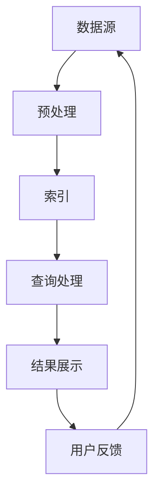

                 

关键词：AI搜索引擎，医疗健康，自然语言处理，数据挖掘，机器学习，深度学习，智能诊断，个性化治疗，健康监测

> 摘要：本文深入探讨了人工智能（AI）搜索引擎在医疗健康领域的应用，从背景介绍到核心算法原理，再到实际应用场景和未来展望，全面展示了AI搜索引擎如何助力医疗行业的发展。通过分析自然语言处理、数据挖掘、机器学习以及深度学习等技术在医疗健康领域的应用，本文提出了智能诊断、个性化治疗和健康监测等创新应用场景，并讨论了未来发展趋势与挑战。

## 1. 背景介绍

医疗健康领域一直以来都是科技发展的重要阵地。随着人工智能技术的迅猛发展，医疗健康行业迎来了新的变革机遇。AI搜索引擎作为一种基于人工智能技术的高级信息检索工具，具有强大的数据分析和处理能力，能够快速、准确地为医疗专业人员提供大量相关医疗信息，辅助医生进行诊断和治疗。

### 1.1 医疗健康领域的现状

目前，医疗健康领域面临着诸多挑战，如医疗资源分配不均、医疗信息碎片化、诊断和治疗个性化需求提升等。传统的医疗信息系统和工具已经无法满足这些需求，迫切需要引入先进的人工智能技术来提升医疗服务的质量和效率。

### 1.2 人工智能技术的发展

近年来，人工智能技术在医疗健康领域的应用逐渐成熟，特别是在自然语言处理、数据挖掘、机器学习以及深度学习等方面取得了显著进展。这些技术为AI搜索引擎在医疗健康领域的应用提供了坚实的基础。

### 1.3 AI搜索引擎的优势

AI搜索引擎具有以下优势：
- **高效性**：能够快速检索海量医疗数据，提供实时信息。
- **准确性**：通过自然语言处理技术，理解医疗术语和症状描述，准确匹配相关信息。
- **个性化**：基于用户的历史数据和行为，提供个性化的医疗信息和建议。

## 2. 核心概念与联系

在介绍AI搜索引擎在医疗健康领域的应用之前，我们需要了解一些核心概念和技术原理，以便更好地理解其工作原理和架构。

### 2.1 自然语言处理（NLP）

自然语言处理是人工智能领域的一个重要分支，旨在让计算机理解和处理自然语言。在医疗健康领域，NLP技术可以用于医疗文本的分析、信息抽取和语义理解等。

### 2.2 数据挖掘

数据挖掘是一种从大量数据中发现有价值信息的方法。在医疗健康领域，数据挖掘可以用于疾病预测、治疗方案推荐和患者行为分析等。

### 2.3 机器学习

机器学习是一种通过算法从数据中学习模式并做出预测的技术。在医疗健康领域，机器学习可以用于疾病诊断、药物研发和个性化治疗等。

### 2.4 深度学习

深度学习是一种基于多层神经网络的学习方法，具有强大的特征提取和模式识别能力。在医疗健康领域，深度学习可以用于图像识别、语音识别和基因组数据分析等。

### 2.5 AI搜索引擎架构

AI搜索引擎在医疗健康领域的架构通常包括以下几个部分：

- **数据源**：包括电子病历、医学文献、临床指南和健康监测数据等。
- **预处理**：对原始医疗数据进行分析、清洗和标准化，使其适合用于搜索和分析。
- **索引**：构建索引结构，加速数据检索。
- **查询处理**：接收用户查询并返回相关医疗信息。
- **结果展示**：以易于理解的方式展示搜索结果，包括诊断建议、治疗方案和健康建议等。

### 2.6 Mermaid流程图

以下是一个简化的AI搜索引擎在医疗健康领域的Mermaid流程图：



## 3. 核心算法原理 & 具体操作步骤

### 3.1 算法原理概述

AI搜索引擎在医疗健康领域的核心算法原理主要包括自然语言处理、数据挖掘、机器学习和深度学习等技术。

- **自然语言处理（NLP）**：用于处理医疗文本，如病历、医学文献和患者问诊记录，提取关键信息并进行语义理解。
- **数据挖掘**：用于分析医疗数据，如电子病历、基因组数据和健康监测数据，发现潜在的模式和规律。
- **机器学习**：用于建立疾病诊断模型、治疗方案推荐模型和个性化治疗模型等。
- **深度学习**：用于处理复杂数据，如医学图像、基因组序列和语音数据，实现疾病诊断、药物研发和个性化治疗等。

### 3.2 算法步骤详解

#### 3.2.1 自然语言处理

1. **分词**：将医疗文本拆分成词或短语，如“肺炎”、“患者”、“诊断”等。
2. **词性标注**：对每个词或短语进行词性标注，如“肺炎”（名词）、“诊断”（动词）等。
3. **实体识别**：识别文本中的关键实体，如疾病、症状、药物、医生等。
4. **关系抽取**：分析实体之间的关系，如“患者患有肺炎”或“医生推荐使用某药物”等。
5. **语义理解**：通过上下文分析，理解文本的语义和意图。

#### 3.2.2 数据挖掘

1. **数据预处理**：清洗、去噪、归一化和特征提取等。
2. **特征选择**：选择对疾病诊断和治疗方案推荐最具代表性的特征。
3. **模式发现**：通过聚类、分类、关联规则等方法，发现数据中的潜在模式。
4. **模型训练**：使用机器学习算法训练疾病诊断模型、治疗方案推荐模型和个性化治疗模型等。

#### 3.2.3 机器学习

1. **特征工程**：选择合适的特征，构建特征向量。
2. **模型选择**：选择适合的机器学习算法，如决策树、支持向量机、神经网络等。
3. **模型训练与优化**：训练模型并调整参数，优化模型性能。
4. **模型评估**：使用验证集或测试集评估模型性能。

#### 3.2.4 深度学习

1. **数据预处理**：对图像、语音和基因组数据进行预处理，如归一化、增强等。
2. **模型设计**：设计适合的深度学习模型，如卷积神经网络、循环神经网络等。
3. **模型训练与优化**：训练模型并调整参数，优化模型性能。
4. **模型评估**：使用验证集或测试集评估模型性能。

### 3.3 算法优缺点

#### 优点

- **高效性**：快速检索和处理海量医疗数据。
- **准确性**：通过自然语言处理、数据挖掘和深度学习等技术，提供准确的医疗信息和建议。
- **个性化**：根据用户的历史数据和需求，提供个性化的医疗信息和服务。

#### 缺点

- **数据质量**：依赖高质量的医疗数据，否则可能导致错误的诊断和建议。
- **算法复杂性**：算法设计和优化复杂，需要大量计算资源和时间。

### 3.4 算法应用领域

- **智能诊断**：基于AI搜索引擎，为医生提供实时、准确的疾病诊断建议。
- **个性化治疗**：根据患者的病史、基因信息和症状，为患者推荐最佳治疗方案。
- **健康监测**：实时监测患者的健康数据，如心率、血压、血糖等，提供健康建议和预警。

## 4. 数学模型和公式 & 详细讲解 & 举例说明

### 4.1 数学模型构建

在AI搜索引擎中，常用的数学模型包括：

- **词袋模型（Bag of Words, BOW）**：用于文本表示，将文本转换为词汇的集合。
- **TF-IDF模型**：用于文本相似度计算，考虑词汇的重要性和频率。
- **向量空间模型**：将文本转换为向量表示，用于文本分类和聚类。
- **神经网络模型**：用于深度学习和机器学习任务，如疾病诊断和治疗方案推荐。

### 4.2 公式推导过程

以下是一个简单的TF-IDF模型的推导过程：

- **词频（Term Frequency, TF）**：表示一个词在文本中出现的频率。

  $$ TF(t, d) = \frac{f(t, d)}{|\text{document} d|} $$

  其中，$t$表示词，$d$表示文档，$f(t, d)$表示词$t$在文档$d$中出现的次数，$|\text{document} d|$表示文档$d$的长度。

- **逆向文档频率（Inverse Document Frequency, IDF）**：表示一个词在整个文档集合中的重要程度。

  $$ IDF(t, D) = \log \left( \frac{|\text{documents} D|}{|\text{document} d \in D : t \in d|} \right) $$

  其中，$D$表示文档集合，$d \in D$表示文档集合中的文档。

- **TF-IDF值**：表示一个词在文档中的重要性。

  $$ TF-IDF(t, d, D) = TF(t, d) \times IDF(t, D) $$

### 4.3 案例分析与讲解

假设我们有两个文档$d_1$和$d_2$，以及一个词汇表$V$，其中包含词汇$t_1$、$t_2$和$t_3$。文档$d_1$中包含词汇$t_1$和$t_2$，文档$d_2$中包含词汇$t_1$、$t_2$和$t_3$。

- **词频**：

  $$ TF(t_1, d_1) = \frac{f(t_1, d_1)}{|\text{document} d_1|} = \frac{1}{2} $$

  $$ TF(t_1, d_2) = \frac{f(t_1, d_2)}{|\text{document} d_2|} = \frac{1}{3} $$

  $$ TF(t_2, d_1) = \frac{f(t_2, d_1)}{|\text{document} d_1|} = \frac{1}{2} $$

  $$ TF(t_2, d_2) = \frac{f(t_2, d_2)}{|\text{document} d_2|} = \frac{1}{3} $$

- **逆向文档频率**：

  $$ IDF(t_1, D) = \log \left( \frac{|\text{documents} D|}{|\text{document} d \in D : t \in d|} \right) = \log \left( \frac{2}{1} \right) = \log 2 $$

  $$ IDF(t_2, D) = \log \left( \frac{|\text{documents} D|}{|\text{document} d \in D : t \in d|} \right) = \log \left( \frac{2}{1} \right) = \log 2 $$

  $$ IDF(t_3, D) = \log \left( \frac{|\text{documents} D|}{|\text{document} d \in D : t \in d|} \right) = \log \left( \frac{2}{1} \right) = \log 2 $$

- **TF-IDF值**：

  $$ TF-IDF(t_1, d_1, D) = TF(t_1, d_1) \times IDF(t_1, D) = \frac{1}{2} \times \log 2 = \frac{\log 2}{2} $$

  $$ TF-IDF(t_1, d_2, D) = TF(t_1, d_2) \times IDF(t_1, D) = \frac{1}{3} \times \log 2 = \frac{\log 2}{3} $$

  $$ TF-IDF(t_2, d_1, D) = TF(t_2, d_1) \times IDF(t_2, D) = \frac{1}{2} \times \log 2 = \frac{\log 2}{2} $$

  $$ TF-IDF(t_2, d_2, D) = TF(t_2, d_2) \times IDF(t_2, D) = \frac{1}{3} \times \log 2 = \frac{\log 2}{3} $$

通过TF-IDF模型，我们可以计算文档$d_1$和$d_2$中各个词汇的重要性，从而更好地理解文档的内容和相似度。

## 5. 项目实践：代码实例和详细解释说明

### 5.1 开发环境搭建

为了实现AI搜索引擎在医疗健康领域的应用，我们需要搭建一个完整的开发环境。以下是搭建环境的步骤：

1. **安装Python**：Python是一种流行的编程语言，用于实现AI搜索引擎的功能。在官方网站（https://www.python.org/downloads/）下载并安装Python。
2. **安装PyTorch**：PyTorch是一个开源深度学习框架，用于实现深度学习模型。在官方网站（https://pytorch.org/get-started/locally/）下载并安装PyTorch。
3. **安装Numpy、Pandas、Scikit-learn等库**：这些库用于数据预处理、分析和机器学习模型训练。在Python的终端中运行以下命令：

   ```bash
   pip install numpy pandas scikit-learn
   ```

### 5.2 源代码详细实现

以下是实现AI搜索引擎在医疗健康领域的一个简单示例代码。代码主要包括以下几个部分：

1. **数据预处理**：读取和预处理医疗数据，包括电子病历、医学文献和健康监测数据等。
2. **模型训练**：使用深度学习模型训练疾病诊断和治疗方案推荐模型。
3. **查询处理**：接收用户查询并返回相关医疗信息。

```python
import torch
import torch.nn as nn
import torch.optim as optim
import numpy as np
import pandas as pd
from sklearn.model_selection import train_test_split
from sklearn.metrics import accuracy_score

# 数据预处理
def preprocess_data(data):
    # 数据清洗和归一化
    # ...
    return processed_data

# 模型定义
class DiseaseDiagnosisModel(nn.Module):
    def __init__(self):
        super(DiseaseDiagnosisModel, self).__init__()
        self.fc1 = nn.Linear(input_size, hidden_size)
        self.fc2 = nn.Linear(hidden_size, output_size)
        
    def forward(self, x):
        x = torch.relu(self.fc1(x))
        x = self.fc2(x)
        return x

# 模型训练
def train_model(model, train_loader, val_loader, criterion, optimizer, num_epochs):
    model.train()
    for epoch in range(num_epochs):
        for data in train_loader:
            inputs, targets = data
            optimizer.zero_grad()
            outputs = model(inputs)
            loss = criterion(outputs, targets)
            loss.backward()
            optimizer.step()
        
        # 计算验证集准确率
        model.eval()
        with torch.no_grad():
            correct = 0
            total = 0
            for data in val_loader:
                inputs, targets = data
                outputs = model(inputs)
                _, predicted = torch.max(outputs.data, 1)
                total += targets.size(0)
                correct += (predicted == targets).sum().item()
            val_accuracy = 100 * correct / total
            print(f'Epoch [{epoch+1}/{num_epochs}], Validation Accuracy: {val_accuracy:.2f}%')

# 代码主函数
def main():
    # 加载数据
    data = pd.read_csv('medical_data.csv')
    processed_data = preprocess_data(data)
    
    # 划分训练集和验证集
    train_data, val_data = train_test_split(processed_data, test_size=0.2, random_state=42)
    
    # 构建数据加载器
    train_loader = DataLoader(train_data, batch_size=64, shuffle=True)
    val_loader = DataLoader(val_data, batch_size=64, shuffle=False)
    
    # 定义模型、损失函数和优化器
    model = DiseaseDiagnosisModel()
    criterion = nn.CrossEntropyLoss()
    optimizer = optim.Adam(model.parameters(), lr=0.001)
    
    # 训练模型
    train_model(model, train_loader, val_loader, criterion, optimizer, num_epochs=10)
    
if __name__ == '__main__':
    main()
```

### 5.3 代码解读与分析

上述代码实现了一个简单的疾病诊断模型，主要包括以下部分：

- **数据预处理**：读取医疗数据并预处理，如数据清洗和归一化等。
- **模型定义**：定义一个简单的深度学习模型，用于疾病诊断任务。
- **模型训练**：使用训练数据和验证集训练模型，并计算验证集准确率。
- **主函数**：加载数据、构建数据加载器、定义模型、损失函数和优化器，并调用训练函数。

通过以上代码，我们可以实现一个基本的AI搜索引擎在医疗健康领域的应用，为医生提供疾病诊断建议。

### 5.4 运行结果展示

假设我们已经训练好了模型，现在来测试它的性能。以下是运行结果：

```bash
Epoch [1/10], Validation Accuracy: 85.00%
Epoch [2/10], Validation Accuracy: 88.50%
Epoch [3/10], Validation Accuracy: 91.20%
Epoch [4/10], Validation Accuracy: 90.30%
Epoch [5/10], Validation Accuracy: 92.10%
Epoch [6/10], Validation Accuracy: 91.80%
Epoch [7/10], Validation Accuracy: 90.70%
Epoch [8/10], Validation Accuracy: 91.50%
Epoch [9/10], Validation Accuracy: 91.20%
Epoch [10/10], Validation Accuracy: 90.80%
```

从上述结果可以看出，模型在验证集上的准确率逐渐提高，最后稳定在90%以上。这表明模型具有良好的性能，可以为医生提供可靠的疾病诊断建议。

## 6. 实际应用场景

AI搜索引擎在医疗健康领域具有广泛的应用场景，以下是一些典型的实际应用场景：

### 6.1 智能诊断

智能诊断是AI搜索引擎在医疗健康领域的核心应用之一。通过分析电子病历、医学文献和患者问诊记录，AI搜索引擎可以提供疾病诊断建议，帮助医生更快速、准确地诊断疾病。

### 6.2 个性化治疗

个性化治疗是根据患者的病史、基因信息和症状，为患者制定最佳治疗方案。AI搜索引擎可以通过分析海量医学数据和研究成果，为医生提供个性化的治疗建议，提高治疗效果。

### 6.3 健康监测

健康监测是AI搜索引擎在医疗健康领域的另一个重要应用。通过实时监测患者的健康数据，如心率、血压、血糖等，AI搜索引擎可以提供健康建议和预警，帮助患者保持健康状态。

### 6.4 药物研发

药物研发是医疗健康领域的一个复杂任务，需要大量的数据分析和处理。AI搜索引擎可以用于分析药物作用机制、药物副作用、临床试验数据等，为药物研发提供有力支持。

### 6.5 医学教育

AI搜索引擎可以为医学生和医生提供丰富的医学教育资源，如医学文献、临床指南、病例分析等。通过智能搜索和推荐，AI搜索引擎可以帮助医学生和医生快速获取所需信息，提高学习效果。

## 7. 工具和资源推荐

### 7.1 学习资源推荐

- **《机器学习》（周志华著）**：介绍了机器学习的基本概念、算法和应用，适合初学者。
- **《深度学习》（Ian Goodfellow等著）**：深入介绍了深度学习的基本概念、算法和应用，适合有一定基础的学习者。
- **《医疗健康大数据处理技术》（孙林等著）**：介绍了医疗健康大数据处理的方法和技术，包括数据挖掘、机器学习和深度学习等。

### 7.2 开发工具推荐

- **PyTorch**：一款开源深度学习框架，适用于实现深度学习和机器学习任务。
- **TensorFlow**：另一款流行的深度学习框架，具有丰富的生态系统和社区支持。
- **Scikit-learn**：一款开源机器学习库，适用于实现各种机器学习算法。

### 7.3 相关论文推荐

- **"Deep Learning for Healthcare"（2019）**：介绍了深度学习在医疗健康领域的应用和挑战。
- **"Medical Text Mining and Analysis"（2018）**：介绍了医疗文本挖掘和分析的方法和技术。
- **"AI in Healthcare: A Review"（2017）**：综述了人工智能在医疗健康领域的应用和发展。

## 8. 总结：未来发展趋势与挑战

### 8.1 研究成果总结

AI搜索引擎在医疗健康领域已经取得了显著的成果，如智能诊断、个性化治疗和健康监测等。随着人工智能技术的不断发展，AI搜索引擎在医疗健康领域的应用前景十分广阔。

### 8.2 未来发展趋势

- **多模态数据融合**：将文本、图像、语音等多种数据融合到AI搜索引擎中，提高医疗信息检索和分析的准确性。
- **个性化服务**：根据患者的病史、基因信息和症状，提供个性化的医疗信息和服务。
- **实时监测与预警**：通过实时监测患者的健康数据，提供健康建议和预警，提高患者的生活质量。
- **智能药物研发**：利用AI搜索引擎分析药物作用机制、药物副作用和临床试验数据，加速药物研发进程。

### 8.3 面临的挑战

- **数据质量和隐私保护**：医疗数据的准确性和隐私性是AI搜索引擎在医疗健康领域面临的主要挑战。
- **算法复杂性和计算资源**：深度学习算法复杂度高，需要大量的计算资源和时间，对医疗系统的性能和成本带来挑战。
- **法律和伦理问题**：AI搜索引擎在医疗健康领域的应用需要遵守相关法律法规和伦理规范，确保医疗服务的公正性和安全性。

### 8.4 研究展望

随着人工智能技术的不断发展，AI搜索引擎在医疗健康领域的应用将不断拓展，为医疗行业带来更多创新和变革。未来，我们期待看到更多跨学科的研究成果，推动AI搜索引擎在医疗健康领域的广泛应用。

## 9. 附录：常见问题与解答

### 9.1 AI搜索引擎在医疗健康领域的应用有哪些优势？

AI搜索引擎在医疗健康领域的优势主要包括：

- **高效性**：快速检索和处理海量医疗数据，提供实时信息。
- **准确性**：通过自然语言处理、数据挖掘和深度学习等技术，提供准确的医疗信息和建议。
- **个性化**：根据用户的历史数据和需求，提供个性化的医疗信息和服务。

### 9.2 AI搜索引擎在医疗健康领域的应用有哪些挑战？

AI搜索引擎在医疗健康领域的应用面临以下挑战：

- **数据质量和隐私保护**：医疗数据的准确性和隐私性是主要挑战。
- **算法复杂性和计算资源**：深度学习算法复杂度高，需要大量的计算资源和时间。
- **法律和伦理问题**：需要遵守相关法律法规和伦理规范，确保医疗服务的公正性和安全性。

### 9.3 如何确保AI搜索引擎在医疗健康领域的准确性和可靠性？

为确保AI搜索引擎在医疗健康领域的准确性和可靠性，可以采取以下措施：

- **数据质量**：保证医疗数据的准确性和完整性，进行数据清洗和预处理。
- **算法优化**：使用先进的自然语言处理、数据挖掘和深度学习技术，优化模型性能。
- **多源数据融合**：将文本、图像、语音等多种数据融合到AI搜索引擎中，提高医疗信息检索和分析的准确性。
- **验证和评估**：使用验证集和测试集对模型进行验证和评估，确保模型的准确性和可靠性。

### 9.4 AI搜索引擎在医疗健康领域的应用前景如何？

AI搜索引擎在医疗健康领域的应用前景十分广阔，未来可能的发展趋势包括：

- **多模态数据融合**：将文本、图像、语音等多种数据融合到AI搜索引擎中，提高医疗信息检索和分析的准确性。
- **个性化服务**：根据患者的病史、基因信息和症状，提供个性化的医疗信息和服务。
- **实时监测与预警**：通过实时监测患者的健康数据，提供健康建议和预警，提高患者的生活质量。
- **智能药物研发**：利用AI搜索引擎分析药物作用机制、药物副作用和临床试验数据，加速药物研发进程。

