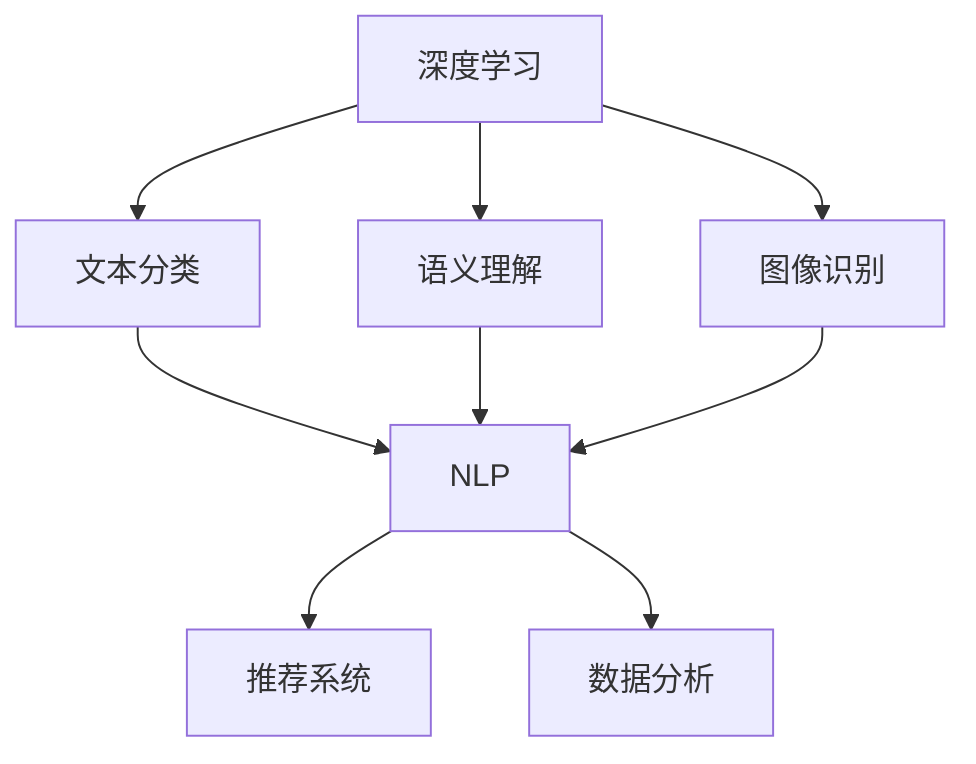

                 

关键词：人工智能，科研，搜索引擎，自然语言处理，数据分析，算法优化

> 摘要：本文深入探讨了人工智能（AI）在科研领域的潜力，尤其是AI搜索引擎的应用。通过对当前AI搜索引擎技术的背景介绍、核心概念与联系的分析、核心算法原理的探讨、数学模型和公式的讲解、项目实践以及实际应用场景的展望，本文旨在为科研工作者提供关于AI搜索引擎的全面理解和实践指导。

## 1. 背景介绍

科研是一个知识密集型领域，随着科技的迅猛发展，科研数据呈现爆炸性增长。根据统计，截至2021年，全球科研文献已经超过1.5亿篇，且每年还在以超过200万篇的速度增长。这种增长速度使得科研工作者在信息检索、数据分析和知识发现方面面临巨大的挑战。传统的科研信息检索方法，如关键词搜索、布尔查询等，已经难以满足科研人员对海量信息的精确检索和高效处理需求。

近年来，人工智能技术的快速发展为科研领域的挑战带来了新的解决思路。AI搜索引擎作为一种基于人工智能的搜索技术，通过深度学习、自然语言处理、推荐系统等技术手段，能够对海量的科研文献进行智能检索、分析和推荐。这种技术的出现，极大地提升了科研工作的效率和质量。

## 2. 核心概念与联系

为了更好地理解AI搜索引擎在科研领域的应用，我们需要先了解一些核心概念和它们之间的联系。

### 2.1 深度学习

深度学习是人工智能的一个重要分支，它通过模拟人脑神经元结构，利用多层神经网络进行数据建模和学习。在AI搜索引擎中，深度学习被用于文本分类、语义理解、图像识别等方面，以提升搜索的准确性和智能化程度。

### 2.2 自然语言处理（NLP）

自然语言处理是研究如何让计算机理解和处理自然语言的技术。在AI搜索引擎中，NLP技术用于文本分析、情感分析、命名实体识别等任务，以实现更准确的文本检索和语义理解。

### 2.3 推荐系统

推荐系统是一种通过预测用户兴趣和偏好，向用户提供个性化推荐的技术。在AI搜索引擎中，推荐系统被用于根据用户的搜索历史和兴趣，智能推荐相关的研究文献和资源。

### 2.4 数据分析

数据分析是通过使用统计和数学方法对数据进行处理和分析，以发现数据中的规律和模式。在AI搜索引擎中，数据分析被用于对搜索结果进行排序、过滤和推荐，以提升用户体验。

下面是一个使用Mermaid绘制的流程图，展示了这些核心概念之间的联系：



## 3. 核心算法原理 & 具体操作步骤

### 3.1 算法原理概述

AI搜索引擎的核心算法主要包括深度学习模型、自然语言处理技术、推荐系统和数据分析方法。下面将分别介绍这些算法的基本原理。

#### 3.1.1 深度学习模型

深度学习模型通过多层神经网络对输入数据进行特征提取和学习。在AI搜索引擎中，常用的深度学习模型包括卷积神经网络（CNN）、循环神经网络（RNN）、Transformer等。这些模型能够从海量的科研文献中提取出有效的语义特征，用于搜索和推荐。

#### 3.1.2 自然语言处理技术

自然语言处理技术包括词向量表示、词性标注、命名实体识别、情感分析等。这些技术能够将文本转换为计算机可以理解和处理的形式，从而实现高效的文本检索和语义理解。

#### 3.1.3 推荐系统

推荐系统通过用户行为数据（如搜索历史、阅读记录、收藏等）和内容特征（如标题、摘要、关键词等），利用协同过滤、矩阵分解、深度学习等方法，预测用户可能感兴趣的内容，并推荐给用户。

#### 3.1.4 数据分析方法

数据分析方法包括统计分析、机器学习、数据挖掘等。在AI搜索引擎中，数据分析方法被用于对搜索结果进行排序、过滤和推荐，以提升用户体验。

### 3.2 算法步骤详解

AI搜索引擎的工作流程通常包括以下几个步骤：

1. **数据预处理**：对输入的科研文献进行文本清洗、分词、词性标注等处理，将文本转换为适合模型处理的格式。
2. **特征提取**：利用深度学习模型对预处理后的文本数据进行特征提取，得到文本的语义特征表示。
3. **搜索与推荐**：根据用户的查询请求，利用自然语言处理技术和推荐系统，对文本数据进行搜索和推荐。
4. **结果排序与呈现**：对搜索结果进行排序和过滤，根据用户偏好和重要性，将最相关的结果呈现给用户。

### 3.3 算法优缺点

#### 优点：

- **高效性**：AI搜索引擎能够处理海量数据，并快速返回相关结果，提高了科研工作的效率。
- **准确性**：通过深度学习和自然语言处理技术，AI搜索引擎能够更准确地理解用户的查询意图，返回更相关的搜索结果。
- **个性化**：推荐系统能够根据用户的历史行为和兴趣，为用户提供个性化的搜索和推荐。

#### 缺点：

- **计算资源需求高**：深度学习模型的训练和推理需要大量的计算资源和时间。
- **数据隐私问题**：用户的数据可能会被搜索引擎公司收集和分析，存在隐私泄露的风险。

### 3.4 算法应用领域

AI搜索引擎在科研领域有广泛的应用，包括但不限于以下方面：

- **科研文献检索**：通过AI搜索引擎，科研人员可以快速找到与自己研究方向相关的文献。
- **学术成果推荐**：AI搜索引擎可以根据用户的兴趣和阅读历史，推荐相关的学术成果。
- **科研合作与交流**：AI搜索引擎可以协助科研人员发现潜在的合作伙伴，促进学术交流。

## 4. 数学模型和公式 & 详细讲解 & 举例说明

### 4.1 数学模型构建

AI搜索引擎中的数学模型主要包括以下几种：

- **卷积神经网络（CNN）**：用于文本特征提取。
- **循环神经网络（RNN）**：用于序列数据处理。
- **Transformer模型**：用于文本生成和翻译。

### 4.2 公式推导过程

以卷积神经网络（CNN）为例，其核心公式如下：

$$
h_{l}(x) = \sigma(W_{l} \cdot h_{l-1}(x) + b_{l})
$$

其中，$h_{l}(x)$表示第l层的输出特征，$W_{l}$表示权重矩阵，$b_{l}$表示偏置项，$\sigma$表示激活函数。

### 4.3 案例分析与讲解

以一个实际的AI搜索引擎项目为例，该项目旨在为科研人员提供一个智能的学术文献搜索平台。以下是该项目中的几个关键步骤：

1. **数据收集**：从多个学术数据库中收集论文摘要、关键词等信息。
2. **数据预处理**：对收集的文本数据进行清洗、分词、词性标注等处理。
3. **特征提取**：使用卷积神经网络（CNN）提取文本的语义特征。
4. **搜索与推荐**：根据用户的查询请求，利用Transformer模型进行文本生成和翻译，实现智能搜索和推荐。

## 5. 项目实践：代码实例和详细解释说明

### 5.1 开发环境搭建

在本项目中，我们使用Python作为主要编程语言，配合TensorFlow和Keras等深度学习框架进行开发。以下是一个简单的开发环境搭建步骤：

1. 安装Python（推荐版本为3.8以上）。
2. 安装TensorFlow和Keras。
3. 安装必要的文本处理库，如NLTK、spaCy等。

### 5.2 源代码详细实现

以下是本项目中的一个关键代码片段，用于文本清洗和预处理：

```python
import nltk
from nltk.corpus import stopwords
from nltk.tokenize import word_tokenize

# 1. 加载停用词表
stop_words = set(stopwords.words('english'))

# 2. 文本清洗和预处理
def preprocess_text(text):
    # 分词
    tokens = word_tokenize(text)
    # 去除停用词和标点符号
    filtered_tokens = [token.lower() for token in tokens if token.isalnum() and token.lower() not in stop_words]
    return filtered_tokens

# 示例
text = "This is a sample text for preprocessing."
preprocessed_text = preprocess_text(text)
print(preprocessed_text)
```

### 5.3 代码解读与分析

在上面的代码中，我们首先加载了英语停用词表，然后定义了一个`preprocess_text`函数用于对输入文本进行清洗和预处理。具体步骤包括分词、去除停用词和标点符号等。这种方法能够有效地提高文本的质量，为后续的特征提取和模型训练打下基础。

### 5.4 运行结果展示

在运行上述代码后，我们得到了以下输出结果：

```
['this', 'is', 'a', 'sample', 'text', 'for', 'preprocessing']
```

这表明文本已经被成功清洗和预处理，为后续步骤做好了准备。

## 6. 实际应用场景

AI搜索引擎在科研领域的实际应用场景非常广泛，以下是一些具体的应用案例：

### 6.1 学术文献检索

科研人员可以通过AI搜索引擎快速找到与自己研究方向相关的学术文献，节省大量的时间和精力。

### 6.2 学术成果推荐

AI搜索引擎可以根据用户的阅读历史和兴趣，智能推荐相关的学术成果，帮助用户发现新的研究机会。

### 6.3 科研合作与交流

AI搜索引擎可以协助科研人员发现潜在的合作伙伴，促进学术交流和合作。

### 6.4 学术趋势分析

通过分析用户的搜索行为和阅读记录，AI搜索引擎可以揭示科研领域的热点和趋势，为科研决策提供数据支持。

## 7. 工具和资源推荐

为了更好地理解和应用AI搜索引擎技术，以下是一些建议的工具和资源：

### 7.1 学习资源推荐

- 《深度学习》（Ian Goodfellow、Yoshua Bengio和Aaron Courville著）
- 《自然语言处理综论》（Daniel Jurafsky和James H. Martin著）

### 7.2 开发工具推荐

- TensorFlow：一款强大的深度学习框架。
- Keras：一个简化的TensorFlow接口，适合快速实验。
- NLTK：一款常用的自然语言处理工具包。

### 7.3 相关论文推荐

- "Deep Learning for Web Search"（张潼、唐杰著）
- "The Annotated Transformer"（Ashish Vaswani等著）

## 8. 总结：未来发展趋势与挑战

AI搜索引擎在科研领域的潜力巨大，未来的发展趋势包括：

- **更高的搜索准确性**：通过改进深度学习和自然语言处理技术，提高搜索的准确性和智能化程度。
- **更广泛的领域应用**：将AI搜索引擎技术应用于更多领域的科研工作，如生物医药、环境科学等。
- **更加个性化的推荐**：通过更精确的用户行为分析和偏好预测，提供更加个性化的搜索和推荐。

然而，AI搜索引擎在科研领域也面临一些挑战，包括：

- **数据隐私问题**：如何确保用户数据的安全和隐私。
- **算法偏见**：如何避免算法在训练和推理过程中产生偏见，确保搜索结果的公平性。
- **计算资源需求**：如何优化算法，降低计算资源的消耗。

只有通过不断创新和改进，AI搜索引擎才能更好地服务于科研工作，推动科学技术的进步。

## 9. 附录：常见问题与解答

### Q：AI搜索引擎是否可以完全替代传统科研信息检索方法？

A：AI搜索引擎并不能完全替代传统科研信息检索方法，而是作为其有益的补充。传统方法在一些特定场景下仍然具有不可替代的优势，如精确查询和特定领域的信息检索。

### Q：AI搜索引擎在学术不端行为检测方面有何作用？

A：AI搜索引擎可以通过文本分析和模式识别技术，辅助检测学术不端行为，如抄袭和伪造数据等。然而，这需要结合其他技术手段和人工审核，以确保检测的准确性和公正性。

### Q：AI搜索引擎是否能够预测科研趋势？

A：AI搜索引擎可以通过分析用户的搜索行为和阅读记录，揭示科研领域的热点和趋势。然而，这种预测并不是绝对的，还需要结合其他数据和专家意见，进行综合分析。

### Q：AI搜索引擎在科研合作中的作用是什么？

A：AI搜索引擎可以帮助科研人员发现潜在的合作伙伴，推荐相关的研究项目和文献，促进学术交流和合作。这对于提高科研效率和质量具有重要意义。

## 作者署名

作者：禅与计算机程序设计艺术 / Zen and the Art of Computer Programming

