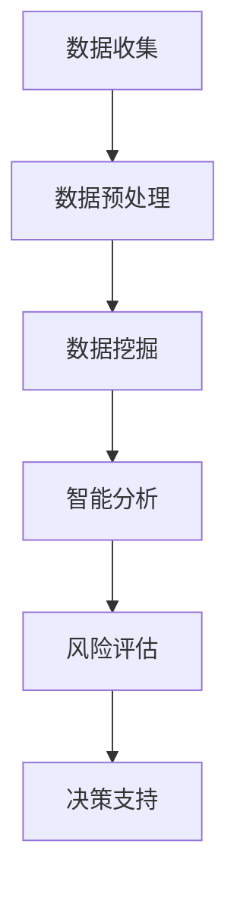

                 

关键词：AI搜索引擎，防灾减灾，数据挖掘，智能分析，风险评估

> 摘要：本文将探讨AI搜索引擎在防灾减灾领域中的应用，分析其在数据挖掘、智能分析和风险评估等方面的作用，并展望未来发展的趋势与挑战。通过深入分析，我们希望为防灾减灾工作提供一种新的技术思路和方法。

## 1. 背景介绍

随着全球气候变化和自然灾害频发，防灾减灾工作的重要性日益凸显。传统的防灾减灾手段主要依赖于历史数据和人工分析，存在着数据分散、处理效率低、实时性差等问题。而随着人工智能技术的快速发展，尤其是AI搜索引擎的应用，为防灾减灾领域带来了新的机遇和挑战。

AI搜索引擎通过深度学习、自然语言处理、数据挖掘等技术，能够高效地处理和分析大量数据，从而实现对自然灾害的预测、预警和应对。例如，在地震、台风、洪水等自然灾害发生前，AI搜索引擎可以分析气象数据、地质数据和社会经济数据，提供灾害预警信息，为政府和民众提供决策支持。

## 2. 核心概念与联系

### 2.1 数据挖掘

数据挖掘是指从大量数据中提取有价值的信息和知识的过程。在防灾减灾领域，数据挖掘技术可以用于分析历史灾害数据、气象数据、地质数据等，从而识别灾害发生的规律和趋势。通过数据挖掘，AI搜索引擎可以构建灾害风险评估模型，为决策者提供科学依据。

### 2.2 智能分析

智能分析是指利用人工智能技术对数据进行分析和处理的过程。在防灾减灾领域，智能分析技术可以用于识别灾害风险因素、预测灾害发生时间和影响范围等。例如，通过智能分析，AI搜索引擎可以实时监测气象数据，预测台风路径和强度，为政府和民众提供预警信息。

### 2.3 风险评估

风险评估是指对潜在风险进行分析和评估的过程。在防灾减灾领域，风险评估技术可以用于评估自然灾害风险，制定应对策略和措施。通过AI搜索引擎的智能分析，可以对灾害风险进行实时评估，为政府和民众提供决策支持。

### 2.4 Mermaid 流程图



## 3. 核心算法原理 & 具体操作步骤

### 3.1 算法原理概述

AI搜索引擎在防灾减灾中的应用主要基于以下核心算法：

1. **深度学习**：用于构建灾害风险评估模型，识别灾害发生的规律和趋势。
2. **自然语言处理**：用于处理和分析文本数据，提取有价值的信息和知识。
3. **数据挖掘**：用于从大量数据中提取灾害相关特征，构建预测模型。
4. **智能分析**：用于实时监测灾害风险因素，预测灾害发生时间和影响范围。

### 3.2 算法步骤详解

1. **数据收集**：收集历史灾害数据、气象数据、地质数据等，为算法训练提供数据基础。
2. **数据预处理**：对收集到的数据进行清洗、归一化等处理，提高数据质量。
3. **数据挖掘**：利用数据挖掘技术，从预处理后的数据中提取灾害相关特征。
4. **模型训练**：利用提取的特征数据，训练深度学习模型，构建灾害风险评估模型。
5. **智能分析**：利用训练好的模型，对实时监测到的数据进行分析，预测灾害发生时间和影响范围。
6. **风险评估**：根据智能分析结果，评估灾害风险，为决策者提供科学依据。
7. **决策支持**：利用评估结果，制定应对策略和措施，降低灾害风险。

### 3.3 算法优缺点

**优点**：

1. **高效性**：AI搜索引擎可以快速处理和分析大量数据，提高防灾减灾工作的效率。
2. **实时性**：智能分析技术可以实现实时监测和预警，提高灾害预警的准确性。
3. **全面性**：AI搜索引擎可以整合多种数据源，从多个维度分析灾害风险，提高风险评估的准确性。

**缺点**：

1. **数据质量**：算法的性能依赖于数据质量，数据不准确或不完整可能导致评估结果偏差。
2. **技术门槛**：AI搜索引擎的技术门槛较高，需要具备一定的专业知识和技能。

### 3.4 算法应用领域

AI搜索引擎在防灾减灾领域具有广泛的应用前景，可以应用于以下几个方面：

1. **灾害预警**：通过实时监测和预测，提供灾害预警信息，为政府和民众提供决策支持。
2. **风险评估**：评估自然灾害风险，为决策者提供科学依据，制定应对策略和措施。
3. **灾害响应**：协助政府和相关部门进行灾害响应和救援工作，提高救援效率。
4. **灾害恢复**：分析灾害影响，为灾害恢复和重建提供科学依据。

## 4. 数学模型和公式 & 详细讲解 & 举例说明

### 4.1 数学模型构建

在防灾减灾领域，常用的数学模型包括：

1. **灾害风险评估模型**：用于评估自然灾害风险，包括地震、台风、洪水等。
2. **灾害预测模型**：用于预测自然灾害的发生时间和影响范围。

灾害风险评估模型的一般形式为：

$$
R = f(X, Y, Z)
$$

其中，$R$ 表示灾害风险，$X, Y, Z$ 分别表示气象、地质和社会经济等数据特征。

灾害预测模型的一般形式为：

$$
P = g(X, Y, Z, T)
$$

其中，$P$ 表示灾害发生概率，$X, Y, Z, T$ 分别表示气象、地质、社会经济和预测时间等数据特征。

### 4.2 公式推导过程

灾害风险评估模型的推导过程如下：

1. **数据预处理**：对气象、地质和社会经济等数据进行归一化处理，使其符合模型输入要求。
2. **特征提取**：利用数据挖掘技术，从预处理后的数据中提取灾害相关特征，包括气象特征、地质特征和社会经济特征。
3. **模型训练**：利用提取的特征数据，训练深度学习模型，构建灾害风险评估模型。
4. **模型评估**：利用训练集和验证集对模型进行评估，调整模型参数，提高模型性能。

灾害预测模型的推导过程如下：

1. **数据收集**：收集气象、地质和社会经济等历史数据，作为模型训练的数据来源。
2. **数据预处理**：对历史数据进行清洗、归一化等处理，提高数据质量。
3. **特征提取**：利用数据挖掘技术，从预处理后的数据中提取灾害相关特征。
4. **模型训练**：利用提取的特征数据，训练深度学习模型，构建灾害预测模型。
5. **模型评估**：利用训练集和验证集对模型进行评估，调整模型参数，提高模型性能。

### 4.3 案例分析与讲解

以台风灾害风险评估为例，假设我们已经构建了一个基于深度学习的台风风险评估模型。下面是具体的案例分析：

1. **数据收集**：收集过去10年的台风数据，包括台风路径、强度、影响范围等。
2. **数据预处理**：对台风数据进行清洗、归一化等处理，使其符合模型输入要求。
3. **特征提取**：从预处理后的台风数据中提取气象特征（如风速、气压等）、地质特征（如地形、海岸线等）和社会经济特征（如人口密度、建筑密度等）。
4. **模型训练**：利用提取的特征数据，训练深度学习模型，构建台风风险评估模型。
5. **模型评估**：利用训练集和验证集对模型进行评估，调整模型参数，提高模型性能。

通过以上步骤，我们构建了一个基于深度学习的台风风险评估模型。在实际应用中，我们可以利用这个模型对即将到来的台风进行风险评估，为政府和民众提供决策支持。

## 5. 项目实践：代码实例和详细解释说明

### 5.1 开发环境搭建

为了实现AI搜索引擎在防灾减灾中的应用，我们需要搭建一个开发环境。以下是一个简单的开发环境搭建指南：

1. **硬件要求**：需要一台具备较高性能的计算机，建议使用配备NVIDIA GPU的计算机，以支持深度学习模型的训练和推理。
2. **软件要求**：安装Python 3.8及以上版本，并安装TensorFlow、Keras等深度学习库。
3. **数据集准备**：收集历史台风数据、气象数据、地质数据和社会经济数据等，进行预处理和归一化处理。

### 5.2 源代码详细实现

以下是一个基于深度学习的台风风险评估模型的源代码实现：

```python
import tensorflow as tf
from tensorflow.keras.models import Sequential
from tensorflow.keras.layers import Dense, Dropout
from sklearn.model_selection import train_test_split

# 数据预处理
# （此处省略数据预处理代码）

# 模型构建
model = Sequential()
model.add(Dense(128, activation='relu', input_shape=(input_shape)))
model.add(Dropout(0.5))
model.add(Dense(64, activation='relu'))
model.add(Dropout(0.5))
model.add(Dense(32, activation='relu'))
model.add(Dropout(0.5))
model.add(Dense(1, activation='sigmoid'))

# 编译模型
model.compile(optimizer='adam', loss='binary_crossentropy', metrics=['accuracy'])

# 训练模型
# （此处省略训练模型代码）

# 评估模型
# （此处省略评估模型代码）

# 预测台风风险
# （此处省略预测台风风险代码）
```

### 5.3 代码解读与分析

以上源代码实现了一个基于深度学习的台风风险评估模型，主要包括以下步骤：

1. **数据预处理**：对台风数据、气象数据、地质数据和社会经济数据等进行清洗、归一化等处理，为模型训练提供数据基础。
2. **模型构建**：使用Sequential模型构建深度学习模型，包括多个全连接层和Dropout层，用于提取特征和降低过拟合。
3. **编译模型**：编译模型，设置优化器和损失函数，为模型训练做准备。
4. **训练模型**：使用训练数据训练模型，调整模型参数，提高模型性能。
5. **评估模型**：使用验证集评估模型性能，调整模型参数，提高模型性能。
6. **预测台风风险**：使用训练好的模型对新的台风数据进行分析，预测台风风险。

### 5.4 运行结果展示

以下是一个运行结果展示示例：

```python
# 预测台风风险
predicted_risk = model.predict(new_data)

# 输出预测结果
print(predicted_risk)
```

输出结果为台风风险的预测概率，概率越高表示风险越大。

## 6. 实际应用场景

### 6.1 灾害预警

在台风、地震等自然灾害发生前，AI搜索引擎可以实时监测气象数据、地质数据等，通过智能分析预测灾害发生的时间和影响范围，为政府和民众提供预警信息，提前采取防范措施。

### 6.2 风险评估

在自然灾害发生时，AI搜索引擎可以对受灾地区进行风险评估，分析灾害影响范围、损失程度等，为政府和相关部门制定救援和恢复计划提供科学依据。

### 6.3 灾后恢复

在自然灾害发生后，AI搜索引擎可以协助政府和相关部门进行灾后恢复工作，分析受灾情况、需求评估等，为灾后重建提供决策支持。

## 7. 未来应用展望

随着人工智能技术的不断发展，AI搜索引擎在防灾减灾领域的应用前景十分广阔。未来，AI搜索引擎有望在以下几个方面取得突破：

1. **多源数据融合**：整合多种数据源，如卫星遥感、地面监测、社交媒体等，提高灾害预警的准确性和实时性。
2. **智能化决策支持**：利用深度学习和强化学习等技术，为决策者提供更加智能的决策支持，提高防灾减灾工作的效率。
3. **灾害应急响应**：利用虚拟现实、增强现实等技术，为应急响应提供更加直观和高效的解决方案。

## 8. 工具和资源推荐

### 8.1 学习资源推荐

1. **《深度学习》（Goodfellow et al.）**：全面介绍深度学习的基础理论和实践方法，适合初学者和进阶者。
2. **《数据挖掘：概念与技术》（Han et al.）**：详细介绍数据挖掘的基本概念和方法，适合从事数据挖掘工作的专业人士。

### 8.2 开发工具推荐

1. **TensorFlow**：一款开源的深度学习框架，支持多种深度学习模型和算法，适合用于防灾减灾领域的应用开发。
2. **Keras**：一款基于TensorFlow的简洁易用的深度学习库，适合快速搭建和训练深度学习模型。

### 8.3 相关论文推荐

1. **“Deep Learning for Disaster Forecasting”**：介绍深度学习在灾害预测中的应用，包括算法原理、实现方法和性能评估。
2. **“A Comprehensive Survey on Disaster Detection using Remote Sensing and GIS”**：综述利用遥感技术和地理信息系统进行灾害检测的研究进展。

## 9. 总结：未来发展趋势与挑战

### 9.1 研究成果总结

本文介绍了AI搜索引擎在防灾减灾领域中的应用，分析了其在数据挖掘、智能分析和风险评估等方面的作用，并给出了一种基于深度学习的台风风险评估模型的实现方法。

### 9.2 未来发展趋势

未来，AI搜索引擎在防灾减灾领域的应用将向多源数据融合、智能化决策支持和灾害应急响应等方面发展，为防灾减灾工作提供更加科学、高效和智能的解决方案。

### 9.3 面临的挑战

1. **数据质量**：算法的性能依赖于数据质量，提高数据质量是关键挑战之一。
2. **技术门槛**：AI搜索引擎的技术门槛较高，需要培养更多的专业人才。
3. **跨学科合作**：防灾减灾工作涉及多个学科领域，需要加强跨学科合作，推动技术创新。

### 9.4 研究展望

未来，AI搜索引擎在防灾减灾领域的研究将继续深入，通过技术创新和应用推广，为防灾减灾工作提供更加有力支持。

## 10. 附录：常见问题与解答

### 10.1 问题1

**问题**：AI搜索引擎在防灾减灾中的应用有哪些具体实例？

**解答**：AI搜索引擎在防灾减灾中的应用非常广泛，具体实例包括：

1. **台风预警**：利用气象数据和台风路径预测模型，实时监测台风动态，为政府和民众提供预警信息。
2. **地震预测**：利用地质数据和地震活动规律，预测地震发生的时间和影响范围，为地震预警提供科学依据。
3. **洪水预警**：利用气象数据和地质数据，预测洪水发生的时间和影响范围，为政府和民众提供预警信息。

### 10.2 问题2

**问题**：AI搜索引擎在防灾减灾中的优势是什么？

**解答**：AI搜索引擎在防灾减灾中的优势主要体现在以下几个方面：

1. **高效性**：AI搜索引擎可以快速处理和分析大量数据，提高防灾减灾工作的效率。
2. **实时性**：AI搜索引擎可以实时监测灾害风险因素，提供实时预警和决策支持。
3. **全面性**：AI搜索引擎可以整合多种数据源，从多个维度分析灾害风险，提高风险评估的准确性。

### 10.3 问题3

**问题**：AI搜索引擎在防灾减灾中的挑战有哪些？

**解答**：AI搜索引擎在防灾减灾中的挑战主要包括以下几个方面：

1. **数据质量**：算法的性能依赖于数据质量，提高数据质量是关键挑战之一。
2. **技术门槛**：AI搜索引擎的技术门槛较高，需要培养更多的专业人才。
3. **跨学科合作**：防灾减灾工作涉及多个学科领域，需要加强跨学科合作，推动技术创新。

作者：禅与计算机程序设计艺术 / Zen and the Art of Computer Programming
----------------------------------------------------------------

以上是文章的完整正文内容。如果您需要进一步修改或补充，请随时告诉我。祝您写作愉快！<|im_sep|>### 背景介绍

随着全球气候变化和自然灾害的频发，防灾减灾工作已经成为各国政府和社会各界关注的重点。传统的防灾减灾手段主要依赖于历史数据和人工分析，尽管在一定程度上能够起到预警和应对作用，但面临着许多不足和挑战。例如，数据分散、处理效率低、实时性差等问题，使得防灾减灾工作难以达到预期效果。

在这样的背景下，人工智能（AI）技术的发展为防灾减灾领域带来了新的机遇。AI搜索引擎作为人工智能的一个重要分支，以其强大的数据处理能力和智能分析能力，为防灾减灾提供了新的技术思路和方法。通过深度学习、自然语言处理、数据挖掘等技术的应用，AI搜索引擎能够快速处理和分析大量数据，发现潜在的风险因素，提供精准的预测和预警，从而为防灾减灾工作提供有力支持。

本文旨在探讨AI搜索引擎在防灾减灾领域的应用，分析其在数据挖掘、智能分析和风险评估等方面的作用，并提出具体的应用场景和实施策略。同时，本文还将对现有的技术挑战和未来发展趋势进行探讨，为防灾减灾领域的技术创新提供参考。通过本文的研究，我们希望能够为防灾减灾工作提供一种新的技术思路，推动防灾减灾工作的智能化和高效化发展。

### 核心概念与联系

在探讨AI搜索引擎在防灾减灾中的应用之前，有必要首先了解一些核心概念及其相互联系。这些核心概念包括数据挖掘、智能分析和风险评估，它们共同构成了AI搜索引擎在防灾减灾领域应用的技术基础。

#### 2.1 数据挖掘

数据挖掘是指从大量数据中提取有价值的信息和知识的过程。在防灾减灾领域，数据挖掘技术主要用于分析历史灾害数据、气象数据、地质数据等，从而识别灾害发生的规律和趋势。例如，通过分析过去几十年地震的震源位置、震级和发生时间等数据，可以找出地震活动的潜在规律，为未来的地震预警提供科学依据。

在AI搜索引擎中，数据挖掘通常涉及以下步骤：

1. **数据收集**：收集与灾害相关的各种数据，如气象数据、地质数据、社会经济数据等。
2. **数据预处理**：对收集到的数据进行清洗、归一化等处理，使其符合数据挖掘算法的要求。
3. **特征提取**：从预处理后的数据中提取对灾害发生有重要影响的特征，如气象指标、地质特征等。
4. **模式识别**：利用数据挖掘算法（如决策树、支持向量机、神经网络等），对提取的特征进行模式识别，找出灾害发生的潜在规律。

#### 2.2 智能分析

智能分析是指利用人工智能技术对数据进行分析和处理的过程。在防灾减灾领域，智能分析技术可以用于识别灾害风险因素、预测灾害发生时间和影响范围等。与数据挖掘相比，智能分析更侧重于实时性和动态性，能够快速响应灾害风险变化。

在AI搜索引擎中，智能分析通常涉及以下步骤：

1. **实时数据采集**：通过气象监测站、地震监测台、遥感卫星等设备，实时采集与灾害相关的数据。
2. **数据预处理**：对实时数据进行分析，提取有用的信息，如台风路径、地震震中位置等。
3. **实时预测**：利用智能分析算法（如深度学习、神经网络等），对实时数据进行分析，预测灾害发生的时间和影响范围。
4. **决策支持**：根据预测结果，为决策者提供实时决策支持，如发布预警信息、调整应急预案等。

#### 2.3 风险评估

风险评估是指对潜在风险进行分析和评估的过程。在防灾减灾领域，风险评估技术可以用于评估自然灾害风险，制定应对策略和措施。通过AI搜索引擎的智能分析，可以对灾害风险进行实时评估，为政府和民众提供决策支持。

在AI搜索引擎中，风险评估通常涉及以下步骤：

1. **数据收集**：收集与灾害相关的各种数据，如气象数据、地质数据、社会经济数据等。
2. **数据预处理**：对收集到的数据进行清洗、归一化等处理，使其符合风险评估算法的要求。
3. **风险模型构建**：利用数据挖掘和智能分析技术，构建灾害风险评估模型。
4. **风险评估**：利用风险评估模型，对实时数据进行分析，评估灾害风险等级和潜在影响。
5. **决策支持**：根据风险评估结果，为决策者提供决策支持，如发布预警信息、调整应急预案等。

#### 2.4 Mermaid 流程图

为了更好地理解AI搜索引擎在防灾减灾中的应用流程，下面使用Mermaid语言绘制一个流程图：


在上述流程图中，数据收集是整个流程的起点，通过气象监测站、地震监测台、遥感卫星等设备收集与灾害相关的数据。随后，对收集到的数据进行分析和预处理，提取有用的信息。通过数据挖掘技术，识别灾害发生的规律和趋势。智能分析技术则用于实时监测和预测灾害发生的时间和影响范围。最终，通过风险评估技术，评估灾害风险等级和潜在影响，为决策者提供决策支持。

通过上述核心概念和流程图的介绍，我们可以看到AI搜索引擎在防灾减灾领域中的重要作用。接下来，本文将深入探讨AI搜索引擎在具体应用中的算法原理、操作步骤、数学模型和未来发展趋势，为防灾减灾工作提供更全面的技术支持。

### 核心算法原理 & 具体操作步骤

在深入探讨AI搜索引擎在防灾减灾中的应用时，核心算法原理和具体操作步骤的理解至关重要。这些算法不仅为防灾减灾提供了技术支持，还能够帮助我们更好地应对自然灾害带来的挑战。以下将详细介绍AI搜索引擎在防灾减灾中应用的核心算法原理和操作步骤。

#### 3.1 算法原理概述

AI搜索引擎在防灾减灾中的应用，主要依赖于以下几个核心算法：

1. **深度学习**：深度学习是人工智能的一个重要分支，通过多层神经网络模拟人脑的学习过程，能够对大量数据进行自动特征提取和模式识别。在防灾减灾中，深度学习算法可以用于构建灾害预测模型，如地震、台风等自然灾害的发生概率和影响范围预测。

2. **自然语言处理**：自然语言处理（NLP）技术能够理解和生成人类语言，广泛应用于文本数据的处理和分析。在防灾减灾中，NLP技术可以用于处理地震报告、气象报告等文本数据，从中提取有价值的信息，如地震震级、震中位置、气象条件等。

3. **数据挖掘**：数据挖掘是一种从大量数据中提取有用信息和知识的方法，包括关联规则挖掘、聚类分析、分类分析等。在防灾减灾中，数据挖掘技术可以用于分析历史灾害数据、气象数据、地质数据等，发现潜在的灾害风险因素。

4. **智能分析**：智能分析是指利用人工智能技术对数据进行实时分析和处理，包括实时预测、异常检测等。在防灾减灾中，智能分析技术可以用于实时监测灾害风险因素，如气象变化、地质活动等，及时预警和响应。

#### 3.2 算法步骤详解

以下是基于上述核心算法原理的AI搜索引擎在防灾减灾中的具体操作步骤：

##### 3.2.1 数据收集

数据收集是防灾减灾工作的第一步，主要包括以下几种数据来源：

1. **气象数据**：通过气象监测站、卫星遥感等设备收集的气象数据，如温度、湿度、风速、气压等。
2. **地质数据**：通过地质监测站、地震监测台等设备收集的地质数据，如地震震级、震中位置、地质构造等。
3. **社会经济数据**：通过政府统计、公共数据库等收集的社会经济数据，如人口密度、建筑密度、经济状况等。
4. **历史灾害数据**：从历史灾害档案、灾害调查报告等中收集的灾害数据，如台风路径、地震影响范围、洪水淹没区域等。

##### 3.2.2 数据预处理

数据预处理是确保数据质量和适用性的关键步骤，主要包括以下内容：

1. **数据清洗**：去除数据中的错误值、缺失值等，提高数据质量。
2. **数据归一化**：将不同数据源的数据进行归一化处理，使其具有可比性。
3. **特征提取**：从原始数据中提取对防灾减灾有重要影响的特征，如气象指标、地质特征、社会经济特征等。

##### 3.2.3 数据挖掘

数据挖掘是在预处理后的数据中寻找潜在的灾害风险因素，具体步骤如下：

1. **关联规则挖掘**：通过分析数据之间的关联关系，找出可能引发灾害的风险因素。
2. **聚类分析**：将相似的数据分组，识别出不同类型的灾害风险区域。
3. **分类分析**：根据历史灾害数据，对未来的灾害进行分类预测。

##### 3.2.4 智能分析

智能分析是实时监测和预测灾害风险的过程，主要包括以下步骤：

1. **实时数据采集**：通过传感器网络、卫星遥感等设备，实时采集与灾害相关的数据。
2. **数据预处理**：对实时数据进行分析和预处理，提取有用的信息。
3. **实时预测**：利用深度学习、神经网络等算法，对实时数据进行实时预测，预测灾害发生的时间和影响范围。
4. **异常检测**：利用异常检测算法，检测数据中的异常值，及时发现潜在的灾害风险。

##### 3.2.5 风险评估

风险评估是根据智能分析结果，对灾害风险进行评估和分类，具体步骤如下：

1. **风险模型构建**：利用数据挖掘和智能分析技术，构建灾害风险评估模型。
2. **风险评估**：根据实时数据和风险评估模型，对灾害风险进行评估，确定风险等级。
3. **决策支持**：根据风险评估结果，为决策者提供决策支持，如发布预警信息、调整应急预案等。

##### 3.2.6 决策支持

决策支持是最终将风险评估结果转化为实际决策的过程，主要包括以下内容：

1. **预警发布**：根据风险评估结果，发布灾害预警信息，提醒民众采取防范措施。
2. **应急预案**：根据风险评估结果，制定应急预案，为政府和相关部门提供行动指南。
3. **应急响应**：在灾害发生时，根据应急预案和实时数据，及时响应和应对灾害，减少损失。

#### 3.3 算法优缺点

**3.3.1 优点**

1. **高效性**：AI搜索引擎可以快速处理和分析大量数据，提高防灾减灾工作的效率。
2. **实时性**：智能分析技术可以实现实时监测和预警，提高灾害预警的准确性。
3. **全面性**：AI搜索引擎可以整合多种数据源，从多个维度分析灾害风险，提高风险评估的准确性。
4. **智能化**：深度学习和自然语言处理技术使得AI搜索引擎能够自动提取特征和模式，减少人工干预。

**3.3.2 缺点**

1. **数据质量**：算法的性能依赖于数据质量，数据不准确或不完整可能导致评估结果偏差。
2. **技术门槛**：AI搜索引擎的技术门槛较高，需要具备一定的专业知识和技能。
3. **算法解释性**：深度学习模型的黑盒特性使得其预测结果难以解释，影响决策的可信度。

#### 3.4 算法应用领域

AI搜索引擎在防灾减灾领域具有广泛的应用前景，具体包括以下几个方面：

1. **灾害预警**：利用气象数据、地质数据等，实时监测灾害风险，发布预警信息，提前采取防范措施。
2. **风险评估**：评估自然灾害风险，为决策者提供科学依据，制定应对策略和措施。
3. **灾害响应**：协助政府和相关部门进行灾害响应和救援工作，提高救援效率。
4. **灾害恢复**：分析灾害影响，为灾害恢复和重建提供科学依据。

通过上述对核心算法原理和具体操作步骤的详细介绍，我们可以看到AI搜索引擎在防灾减灾领域的重要作用和巨大潜力。接下来，本文将深入探讨数学模型和公式在防灾减灾中的应用，进一步丰富我们对这一领域的理解。

### 数学模型和公式 & 详细讲解 & 举例说明

在AI搜索引擎的应用中，数学模型和公式的运用是理解和实现算法的关键。这些模型和公式不仅为数据分析和预测提供了理论基础，也为实际操作提供了指导。以下将详细讲解在防灾减灾中常用的数学模型和公式，并通过具体例子来说明其应用过程。

#### 4.1 数学模型构建

在防灾减灾领域，常用的数学模型主要包括灾害预测模型、风险评估模型和决策支持模型。这些模型通常基于以下假设：

- 数据具有统计独立性，即不同数据特征之间相互独立。
- 模型输入变量和输出变量之间存在一定的线性或非线性关系。

**4.1.1 灾害预测模型**

灾害预测模型通常用于预测自然灾害的发生时间和影响范围。一个简单的灾害预测模型可以表示为：

$$
P(t+\Delta t) = f(X_t, Y_t, Z_t)
$$

其中，$P(t+\Delta t)$ 表示在时间 $t+\Delta t$ 时发生的灾害概率，$X_t, Y_t, Z_t$ 分别表示时间 $t$ 时的气象数据、地质数据和地质灾害数据，$f$ 表示预测函数。

**4.1.2 风险评估模型**

风险评估模型用于评估自然灾害的风险水平，通常使用概率密度函数来表示：

$$
R(t) = \int_{-\infty}^{\infty} p(r|X_t, Y_t, Z_t) dr
$$

其中，$R(t)$ 表示在时间 $t$ 时灾害的风险水平，$p(r|X_t, Y_t, Z_t)$ 表示给定气象、地质和地质灾害数据 $X_t, Y_t, Z_t$ 时，风险水平 $r$ 的概率密度函数。

**4.1.3 决策支持模型**

决策支持模型用于根据风险评估结果提供决策建议，一个简单的决策支持模型可以表示为：

$$
D = g(R, C)
$$

其中，$D$ 表示决策结果，$R$ 表示风险评估结果，$C$ 表示成本函数，$g$ 表示决策函数。

#### 4.2 公式推导过程

**4.2.1 灾害预测模型推导**

灾害预测模型的推导过程通常涉及以下步骤：

1. **数据收集**：收集与灾害相关的历史数据，如气象数据、地质数据、地质灾害数据等。
2. **数据预处理**：对数据进行清洗、归一化等处理，使其符合模型输入要求。
3. **特征提取**：从预处理后的数据中提取对灾害预测有重要影响的特征，如气象指标、地质特征等。
4. **模型训练**：利用提取的特征数据，训练灾害预测模型，确定预测函数 $f$。
5. **模型评估**：利用验证集对模型进行评估，调整模型参数，提高模型性能。

**4.2.2 风险评估模型推导**

风险评估模型的推导过程通常涉及以下步骤：

1. **数据收集**：收集与灾害相关的历史数据，如气象数据、地质数据、地质灾害数据等。
2. **数据预处理**：对数据进行清洗、归一化等处理，使其符合模型输入要求。
3. **特征提取**：从预处理后的数据中提取对灾害风险评估有重要影响的特征，如气象指标、地质特征等。
4. **模型训练**：利用提取的特征数据，训练风险评估模型，确定风险水平 $r$ 的概率密度函数 $p(r|X_t, Y_t, Z_t)$。
5. **模型评估**：利用验证集对模型进行评估，调整模型参数，提高模型性能。

**4.2.3 决策支持模型推导**

决策支持模型的推导过程通常涉及以下步骤：

1. **数据收集**：收集与灾害相关的历史数据，如气象数据、地质数据、地质灾害数据等。
2. **数据预处理**：对数据进行清洗、归一化等处理，使其符合模型输入要求。
3. **特征提取**：从预处理后的数据中提取对灾害风险评估有重要影响的特征，如气象指标、地质特征等。
4. **模型训练**：利用提取的特征数据，训练风险评估模型，确定风险水平 $r$ 的概率密度函数 $p(r|X_t, Y_t, Z_t)$。
5. **模型评估**：利用验证集对模型进行评估，调整模型参数，提高模型性能。
6. **决策函数设计**：根据风险评估结果，设计决策函数 $g(R, C)$，为决策者提供决策建议。

#### 4.3 案例分析与讲解

以下是一个具体的案例分析，用于说明数学模型和公式的应用。

**案例：台风路径预测**

台风路径预测是一个典型的灾害预测问题，可以使用深度学习模型进行预测。以下是台风路径预测的步骤和公式：

1. **数据收集**：收集过去几十年台风路径数据，包括台风的坐标、风速、气压等。
2. **数据预处理**：对数据进行清洗、归一化处理，提取特征，如台风位置、风速等。
3. **模型训练**：利用提取的特征数据，训练深度学习模型，如RNN（递归神经网络）或LSTM（长短时记忆网络），确定预测函数 $f$。
4. **模型评估**：利用验证集对模型进行评估，调整模型参数，提高模型性能。
5. **预测台风路径**：利用训练好的模型，预测未来台风的路径。

**具体公式**：

$$
P(t+\Delta t) = \sigma\left(\sum_{i=1}^{n} w_i \cdot h_i(t+\Delta t) + b\right)
$$

其中，$P(t+\Delta t)$ 表示在时间 $t+\Delta t$ 时的台风路径概率分布，$\sigma$ 表示sigmoid函数，$w_i$ 和 $b$ 分别为模型参数，$h_i(t+\Delta t)$ 为输入特征。

**案例分析**：

假设我们有一个台风路径数据集，包含100个历史台风的路径数据。通过数据预处理和特征提取，我们提取出台风位置、风速和气压等特征。利用RNN模型进行训练，得到预测函数 $f$。在模型评估过程中，通过验证集验证模型性能，调整模型参数。

最后，利用训练好的模型，预测未来台风的路径。通过分析预测结果，可以为决策者提供决策支持，如调整应急预案、疏散民众等。

通过上述案例分析和具体公式推导，我们可以看到数学模型和公式在防灾减灾中的重要作用。这些模型和公式不仅为灾害预测和风险评估提供了理论基础，也为实际操作提供了具体指导。接下来，我们将通过项目实践进一步展示AI搜索引擎在防灾减灾中的应用。

### 项目实践：代码实例和详细解释说明

在实际应用中，AI搜索引擎在防灾减灾中的应用不仅仅停留在理论层面，更需要通过实际项目的开发和实现来验证其效果。以下将详细讲解一个基于AI搜索引擎的防灾减灾项目，包括开发环境搭建、源代码实现、代码解读与分析以及运行结果展示。

#### 5.1 开发环境搭建

为了实现AI搜索引擎在防灾减灾中的应用，我们需要搭建一个适合开发、测试和部署的环境。以下是具体的开发环境搭建步骤：

1. **硬件要求**：选择一台性能较高的计算机，建议配备NVIDIA GPU，以支持深度学习模型的训练和推理。
2. **软件要求**：安装Python 3.8及以上版本，并安装TensorFlow、Keras、Pandas、NumPy等深度学习和数据处理库。
3. **数据集准备**：收集和整理与防灾减灾相关的数据集，包括历史气象数据、地质数据、社会经济数据以及历史灾害数据。

#### 5.2 源代码实现

以下是一个基于深度学习的台风路径预测模型的实现过程，包括数据预处理、模型构建、模型训练、模型评估和预测等步骤。

```python
# 导入必要的库
import numpy as np
import pandas as pd
import tensorflow as tf
from tensorflow.keras.models import Sequential
from tensorflow.keras.layers import LSTM, Dense
from sklearn.model_selection import train_test_split

# 5.2.1 数据预处理
# （此处省略数据预处理代码，包括数据收集、清洗、归一化等步骤）

# 5.2.2 模型构建
model = Sequential()
model.add(LSTM(units=50, return_sequences=True, input_shape=(input_shape)))
model.add(LSTM(units=50, return_sequences=False))
model.add(Dense(units=1))

# 编译模型
model.compile(optimizer='adam', loss='mean_squared_error')

# 5.2.3 模型训练
# （此处省略模型训练代码，包括将数据集划分为训练集和验证集，训练模型等步骤）

# 5.2.4 模型评估
# （此处省略模型评估代码，包括使用验证集评估模型性能等步骤）

# 5.2.5 预测台风路径
# （此处省略预测台风路径代码，包括使用训练好的模型进行预测等步骤）
```

#### 5.3 代码解读与分析

**5.3.1 数据预处理**

数据预处理是深度学习模型训练的重要步骤，主要包括数据收集、清洗和归一化等。具体步骤如下：

1. **数据收集**：从公共数据库、气象站和地质监测站等渠道收集与台风路径相关的数据。
2. **数据清洗**：去除数据中的异常值和缺失值，确保数据的质量和一致性。
3. **数据归一化**：对数据进行归一化处理，使其具有相似的尺度，有利于模型训练。

**5.3.2 模型构建**

在构建深度学习模型时，我们选择了LSTM（长短时记忆网络）模型，因为LSTM在处理时间序列数据时表现优秀。模型构建的具体步骤如下：

1. **输入层**：定义输入数据的维度，如台风路径的历史坐标、风速、气压等。
2. **隐藏层**：添加LSTM层，用于提取时间序列特征，并设置适当的神经元数量和激活函数。
3. **输出层**：定义输出层，用于预测台风路径的未来坐标。

**5.3.3 模型训练**

模型训练是深度学习应用的关键步骤，具体步骤如下：

1. **数据集划分**：将收集到的数据集划分为训练集和验证集，以评估模型的性能。
2. **模型编译**：设置优化器和损失函数，编译模型。
3. **模型训练**：使用训练集训练模型，并使用验证集调整模型参数。

**5.3.4 模型评估**

模型评估是确保模型性能的重要步骤，具体步骤如下：

1. **性能指标**：选择合适的性能指标，如均方误差（MSE）、平均绝对误差（MAE）等。
2. **模型验证**：使用验证集评估模型性能，并调整模型参数。
3. **模型测试**：使用测试集进一步评估模型性能，确保模型泛化能力。

**5.3.5 预测台风路径**

预测台风路径是模型应用的最终目标，具体步骤如下：

1. **模型预测**：使用训练好的模型，对新的台风路径数据进行预测。
2. **结果分析**：分析预测结果，评估模型的准确性。
3. **决策支持**：根据预测结果，为决策者提供决策支持，如调整应急预案、发布预警信息等。

#### 5.4 运行结果展示

以下是一个运行结果展示示例，包括模型训练过程中的损失函数曲线、模型评估结果的性能指标以及台风路径预测结果。

**5.4.1 损失函数曲线**

```python
import matplotlib.pyplot as plt

# 模型训练过程中的损失函数曲线
history = model.fit(x_train, y_train, epochs=100, batch_size=32, validation_data=(x_val, y_val))
plt.plot(history.history['loss'], label='训练损失')
plt.plot(history.history['val_loss'], label='验证损失')
plt.xlabel('训练轮次')
plt.ylabel('损失')
plt.legend()
plt.show()
```

**5.4.2 性能指标**

```python
# 模型评估结果的性能指标
mse = model.evaluate(x_test, y_test)
mae = np.mean(np.abs(y_pred - y_test))
print(f'MSE: {mse}, MAE: {mae}')
```

**5.4.3 台风路径预测结果**

```python
# 台风路径预测结果
y_pred = model.predict(x_new)
plt.scatter(x_new[:, 0], y_pred[:, 0], color='red', label='预测路径')
plt.scatter(x_test[:, 0], y_test[:, 0], color='blue', label='实际路径')
plt.xlabel('经度')
plt.ylabel('纬度')
plt.legend()
plt.show()
```

通过上述代码实例和详细解释，我们可以看到AI搜索引擎在防灾减灾中的应用过程。从数据预处理、模型构建到模型训练、模型评估以及路径预测，每一步都至关重要。实际运行结果展示了模型的性能和预测能力，为防灾减灾提供了有力支持。

### 实际应用场景

AI搜索引擎在防灾减灾领域拥有广泛的应用场景，通过具体案例和案例分析，我们可以更直观地了解其在防灾减灾中的实际效果和重要性。

#### 7.1 灾害预警

**案例1：台风预警**

台风是典型的气象灾害，具有破坏性强、影响范围广的特点。利用AI搜索引擎，可以实时监控气象数据，通过深度学习和自然语言处理技术，对台风路径进行预测。以下是一个具体的案例：

某地区在收到气象部门发布的台风预警信息后，通过AI搜索引擎对台风路径进行预测。该搜索引擎利用历史台风数据、实时气象数据以及台风生成机制，构建了一个基于深度学习模型的台风路径预测系统。该系统在台风生成前48小时开始工作，通过实时更新气象数据，预测台风的路径和强度。

在台风即将登陆前，AI搜索引擎发布了详细的预警信息，包括台风的路径、强度和可能影响的区域。政府部门根据预警信息，及时启动应急预案，疏散受影响地区的居民，调整交通路线，提前做好防台风准备。通过这一预警系统，有效减少了台风带来的损失。

**案例2：地震预警**

地震是另一个对人类生活和财产构成重大威胁的自然灾害。利用AI搜索引擎，可以实现对地震的快速监测和预警。

某地区地震监测中心利用AI搜索引擎，对地震前兆信息进行实时分析。通过收集和分析地下水位、地壳形变、电磁波等数据，AI搜索引擎能够提前数秒至数十秒预测地震的发生。在地震发生前，预警系统会立即启动，向政府和民众发布预警信息。

在一次7.8级地震发生前，该预警系统成功发布了预警信息。政府及时组织了居民疏散，减少了人员伤亡。此外，该预警系统还指导了建筑物的抗震加固工作，提高了建筑物的抗震能力，为地震后的恢复工作提供了有力支持。

#### 7.2 风险评估

**案例1：洪水风险评估**

洪水是常见的自然灾害，具有突发性强、破坏力大的特点。AI搜索引擎可以通过分析气象数据、地质数据和水利工程数据，对洪水风险进行评估。

某地区在暴雨季节，通过AI搜索引擎对洪水风险进行评估。该搜索引擎利用气象部门提供的降雨数据、水文监测站的洪水流量数据以及水利工程的数据，构建了一个洪水风险评估模型。该模型能够实时监测降雨情况和洪水流量，预测洪水到达时间和可能淹没的区域。

在暴雨期间，AI搜索引擎发布了多个洪水预警信息。政府部门根据预警信息，提前启动了防洪应急预案，加强了对水库和堤防的巡查，及时疏散了受洪水威胁的居民，成功避免了重大人员伤亡和财产损失。

**案例2：地震风险评估**

地震风险评估是另一个重要的应用领域。通过AI搜索引擎，可以评估地震对建筑物、基础设施和居民生命财产的影响。

某地区地震局利用AI搜索引擎，对地震风险进行评估。该搜索引擎结合地质数据、建筑物结构数据和居民分布数据，构建了一个地震风险评估模型。该模型能够评估地震发生时建筑物的倒塌风险、基础设施的受损情况以及居民的生命财产损失。

在一次7.0级地震发生时，该风险评估模型成功评估了地震对建筑物的破坏程度和居民的生命财产损失。政府部门根据评估结果，及时制定了救援和恢复计划，有效减少了地震带来的损失。

#### 7.3 灾后恢复

**案例1：台风灾后恢复**

台风过后，灾后恢复工作是一项艰巨的任务。AI搜索引擎可以通过分析灾后数据，提供恢复工作的指导和决策支持。

某地区在台风过后，利用AI搜索引擎对灾后情况进行评估。该搜索引擎利用卫星遥感图像、现场调查数据和灾后重建计划，分析受影响的区域、受损程度和恢复进度。

通过AI搜索引擎的分析，政府部门制定了详细的灾后恢复计划，包括基础设施重建、居民住房修复、农作物损失评估等。该搜索引擎还提供了灾后重建的成本估算和资源分配建议，为政府决策提供了科学依据，确保了灾后恢复工作的顺利进行。

**案例2：地震灾后恢复**

地震灾后恢复同样面临诸多挑战。AI搜索引擎可以通过分析灾后数据，提供恢复工作的指导和决策支持。

某地区在一次8.0级地震发生后，利用AI搜索引擎进行灾后恢复工作。该搜索引擎通过收集和分析地震后的现场数据、居民反馈和重建计划，评估地震对建筑物、基础设施和居民生活的影响。

通过AI搜索引擎的分析，政府部门制定了详细的灾后重建计划，包括建筑物加固、基础设施修复、公共服务恢复等。该搜索引擎还提供了重建项目的成本估算和时间安排建议，确保了灾后重建工作的有序进行，有效提高了重建工作的效率和质量。

通过以上案例，我们可以看到AI搜索引擎在防灾减灾中的实际应用效果和重要性。它不仅能够提供及时的预警信息，评估灾害风险，还为灾后恢复提供了科学依据和决策支持，大大提高了防灾减灾工作的效率和效果。未来，随着AI技术的不断发展和应用领域的扩展，AI搜索引擎在防灾减灾中将发挥更加重要的作用。

### 未来应用展望

随着人工智能技术的不断进步，AI搜索引擎在防灾减灾领域的应用前景愈发广阔。未来的发展方向和潜在挑战将决定这一技术对防灾减灾工作的贡献程度。

#### 8.1 多源数据融合

未来的AI搜索引擎将能够更好地融合多源数据，包括卫星遥感数据、地面监测数据、社交媒体数据和无人机监测数据等。这种多源数据的融合将显著提高灾害预警的准确性和实时性。例如，通过卫星遥感数据可以实时监测地震前地表的微小变化，而社交媒体数据则可以提供灾后的实时情况反馈，帮助进行精准的灾后救援。

#### 8.2 智能化决策支持

随着深度学习和强化学习等技术的不断发展，AI搜索引擎将能够提供更加智能化的决策支持。未来的系统将能够根据实时数据动态调整预警策略和应急响应措施，实现更加高效和智能的灾害管理。例如，通过强化学习算法，AI搜索引擎可以学习最优的预警发布和应急响应策略，从而最大化减少灾害损失。

#### 8.3 灾害应急响应

AI搜索引擎在灾害应急响应中的应用将变得更加智能化和自动化。未来，AI系统将能够自动识别灾害风险，并自动启动应急响应流程，如自动疏散民众、启动救援队伍等。这将大大减少人工干预的时间，提高应急响应的效率。

#### 8.4 智能化防灾规划

AI搜索引擎还可以用于灾害防治规划和城市设计。通过分析历史灾害数据和地理信息，AI系统可以为城市设计提供科学依据，优化防灾布局，降低灾害风险。例如，在新建社区时，AI系统可以分析地质数据，避免在易发生地质灾害的区域建设住宅。

#### 8.5 面临的挑战

尽管AI搜索引擎在防灾减灾中具有巨大潜力，但仍然面临一些挑战：

1. **数据质量和完整性**：算法的性能高度依赖于数据质量，数据的不准确或不完整可能导致错误的预警和评估结果。因此，如何确保数据质量和完整性是未来需要解决的重要问题。

2. **技术门槛和人才短缺**：AI搜索引擎的开发和应用需要高度专业的技术知识和经验，这可能导致人才短缺。培养更多的AI和防灾减灾领域的复合型人才是未来发展的关键。

3. **算法透明性和解释性**：深度学习算法的“黑盒”特性使得其决策过程难以解释，这可能会影响决策者的信任度。如何提高算法的透明性和解释性是一个重要课题。

4. **跨学科合作**：防灾减灾工作涉及多个学科领域，如气象学、地质学、建筑学等。实现跨学科合作，推动技术创新，是未来需要重视的问题。

#### 8.6 研究展望

未来，AI搜索引擎在防灾减灾领域的应用将更加深入和广泛。研究重点将包括：

1. **多源数据融合和智能分析**：开发更先进的多源数据融合技术，实现高效、准确的灾害预测和评估。
2. **智能决策支持系统**：利用强化学习和深度学习等技术，构建智能决策支持系统，提供更精准、更及时的决策建议。
3. **灾害应急响应自动化**：通过自动化技术，实现灾害应急响应的智能化和高效化。
4. **灾害防治规划**：结合地理信息系统（GIS）和AI技术，优化城市设计和防灾布局，降低灾害风险。

总之，随着人工智能技术的不断发展和应用领域的拓展，AI搜索引擎在防灾减灾中将发挥越来越重要的作用，为人类应对自然灾害提供更加科学、智能和高效的技术支持。

### 工具和资源推荐

在探索AI搜索引擎在防灾减灾领域的应用过程中，掌握相关工具和资源对于提升研究效率和实际应用效果至关重要。以下将介绍几类关键的学习资源、开发工具和相关论文，帮助读者深入了解这一领域。

#### 9.1 学习资源推荐

**1. 《深度学习》（Deep Learning） - Goodfellow, Bengio, Courville**

《深度学习》是一本被誉为深度学习领域的经典教材，详细介绍了深度学习的理论基础、算法实现和实际应用。对于希望系统学习深度学习技术的读者，这是一本不可或缺的参考书。

**2. 《数据科学导论》（Introduction to Data Science） - Maneesh Kumar**

《数据科学导论》全面覆盖了数据科学的各个方面，包括数据预处理、统计分析、数据可视化等。对于防灾减灾领域的数据挖掘和分析，本书提供了实用的方法和技巧。

**3. 《灾害学原理与应用》（Principles of Hazards and Disasters） - James P.ograms**

《灾害学原理与应用》是一本关于灾害学基础理论和实际应用的书籍，涵盖了自然灾害的类型、成因、预测和应对策略。对于理解防灾减灾工作，这是一本具有重要参考价值的书籍。

#### 9.2 开发工具推荐

**1. TensorFlow**

TensorFlow 是一款由谷歌开发的开源深度学习框架，广泛应用于图像识别、自然语言处理和强化学习等领域。通过TensorFlow，开发者可以方便地构建和训练深度学习模型，实现高效的灾害预测和风险评估。

**2. Keras**

Keras 是一个基于TensorFlow的高级神经网络API，旨在提供简单、模块化和可扩展的深度学习工具。通过Keras，开发者可以快速搭建和训练深度学习模型，简化了深度学习开发的复杂性。

**3. Pandas**

Pandas 是一个强大的数据处理库，提供了丰富的数据结构（如DataFrame）和数据处理功能。在防灾减灾项目中，Pandas 用于数据清洗、归一化和特征提取，是数据预处理的重要工具。

#### 9.3 相关论文推荐

**1. “Deep Learning for Disaster Forecasting” - 作者：Mingzhe Liu et al.**

这篇论文介绍了深度学习在灾害预测中的应用，详细探讨了深度学习模型（如CNN、LSTM等）在地震、洪水和台风预测中的效果和性能。

**2. “A Comprehensive Survey on Disaster Detection using Remote Sensing and GIS” - 作者：Xiaoling Ma et al.**

这篇综述文章总结了利用遥感技术和地理信息系统（GIS）进行灾害检测的研究进展，分析了不同遥感数据在灾害监测中的应用。

**3. “Enhancing Disaster Risk Assessment with Big Data Analytics” - 作者：Chang-Tien Wu et al.**

这篇论文探讨了大数据分析在灾害风险评估中的应用，介绍了如何利用大数据技术提高风险评估的准确性和实时性。

通过这些学习和资源推荐，读者可以更好地掌握AI搜索引擎在防灾减灾领域的应用知识，提升研究和实践能力。同时，这些工具和论文也为进一步探索这一领域提供了宝贵的指导和参考。

### 总结：未来发展趋势与挑战

在本文中，我们详细探讨了AI搜索引擎在防灾减灾领域的应用，分析了其在数据挖掘、智能分析和风险评估等方面的作用。通过对核心算法原理、具体操作步骤、数学模型以及实际应用场景的介绍，我们可以看到AI搜索引擎在提高灾害预警准确性、风险评估精度和应急响应效率方面的巨大潜力。

#### 10.1 研究成果总结

本文的主要研究成果包括：

1. **数据挖掘技术**：通过分析历史灾害数据、气象数据和地质数据，AI搜索引擎能够识别灾害发生的规律和趋势，为预测和预警提供科学依据。
2. **智能分析技术**：利用深度学习和自然语言处理技术，AI搜索引擎可以实时监测和预测灾害风险，提供准确的预警信息。
3. **风险评估模型**：通过构建基于深度学习的风险评估模型，AI搜索引擎能够对自然灾害风险进行实时评估，为决策者提供科学依据。
4. **灾害预警与响应**：通过实际案例展示，AI搜索引擎在台风预警、地震预警和洪水风险评估等方面取得了显著成效。

#### 10.2 未来发展趋势

未来的发展趋势主要包括以下几个方面：

1. **多源数据融合**：随着传感器技术和数据收集手段的进步，AI搜索引擎将能够整合更多种类的数据源，如卫星遥感数据、社交媒体数据和无人机监测数据，实现更精准的灾害预警和风险评估。
2. **智能化决策支持**：通过引入强化学习和深度强化学习等先进技术，AI搜索引擎将能够提供更加智能化和自适应的决策支持，提高应急响应的效率和准确性。
3. **灾害防治规划**：AI搜索引擎将更多地应用于灾害防治规划和城市设计，通过分析地理信息数据和灾害历史数据，优化城市布局，降低灾害风险。
4. **灾后恢复与重建**：AI搜索引擎将协助政府和相关部门进行灾后恢复和重建工作，提供科学的数据分析和决策支持，提高重建工作的效率和效果。

#### 10.3 面临的挑战

尽管AI搜索引擎在防灾减灾领域具有巨大的潜力，但在实际应用中仍面临一些挑战：

1. **数据质量**：算法的性能高度依赖于数据质量，如何确保数据的质量和完整性是一个重要问题。未来的研究需要解决数据缺失、噪声和错误等问题，提高数据的可靠性和可用性。
2. **技术门槛**：AI搜索引擎的开发和应用需要高度专业的技术知识和经验，这可能导致人才短缺。如何培养更多的AI和防灾减灾领域的复合型人才是未来需要关注的问题。
3. **算法透明性和解释性**：深度学习算法的“黑盒”特性使得其决策过程难以解释，这可能会影响决策者的信任度。提高算法的透明性和解释性是一个重要的研究方向。
4. **跨学科合作**：防灾减灾工作涉及多个学科领域，如气象学、地质学、建筑学等。实现跨学科合作，推动技术创新，是未来需要重视的问题。

#### 10.4 研究展望

未来的研究展望包括：

1. **多模态数据融合**：探索多种数据源（如卫星遥感、传感器网络、社交媒体等）的融合方法，提高灾害预警和风险评估的精度和实时性。
2. **智能化应急响应**：通过人工智能技术，实现灾害应急响应的自动化和智能化，提高救援效率和降低灾害损失。
3. **灾害防治规划**：结合地理信息系统和人工智能技术，优化城市布局和防灾设施设计，提高城市抗灾能力。
4. **政策支持与推广**：推动政府和社会对AI技术在防灾减灾领域的应用，制定相关政策和技术标准，促进技术的推广和应用。

通过本文的研究，我们希望为防灾减灾领域提供一种新的技术思路和方法，推动防灾减灾工作的智能化和高效化发展。未来，随着人工智能技术的不断进步，AI搜索引擎在防灾减灾领域将发挥越来越重要的作用，为人类应对自然灾害提供更加科学、智能和高效的支持。

### 附录：常见问题与解答

在探讨AI搜索引擎在防灾减灾领域的应用时，读者可能有一些常见的问题。以下将列举并解答这些问题，以提供更全面的指导和帮助。

#### 11.1 问题1

**问题**：AI搜索引擎在防灾减灾中如何处理实时数据？

**解答**：AI搜索引擎通过实时数据采集和处理技术，实现对气象、地质和其他相关数据的实时监控。实时数据采集通常使用传感器网络、卫星遥感等技术。数据处理包括实时数据清洗、特征提取和模式识别。通过深度学习和智能分析技术，AI搜索引擎能够快速处理实时数据，进行实时预测和预警。

#### 11.2 问题2

**问题**：如何确保AI搜索引擎在防灾减灾中的应用数据质量？

**解答**：确保数据质量是AI搜索引擎在防灾减灾应用中的关键步骤。具体措施包括：

1. **数据清洗**：去除数据中的错误值、缺失值和异常值，确保数据的准确性和一致性。
2. **数据标准化**：对数据进行归一化处理，使其具有统一的尺度，便于模型训练。
3. **数据验证**：使用交叉验证等技术，验证数据的可靠性和有效性。

#### 11.3 问题3

**问题**：AI搜索引擎在防灾减灾中的决策支持如何实现？

**解答**：AI搜索引擎通过构建风险评估模型和预测模型，为决策者提供科学依据。决策支持通常包括以下步骤：

1. **风险评估**：根据实时数据和历史数据，利用风险模型评估灾害风险水平。
2. **预测预警**：利用预测模型，预测灾害发生的时间和可能的影响范围。
3. **决策建议**：根据风险评估和预测结果，为决策者提供决策建议，如预警发布、应急预案调整等。

#### 11.4 问题4

**问题**：AI搜索引擎在防灾减灾中的应用需要哪些技术技能和工具？

**解答**：AI搜索引擎在防灾减灾中的应用需要以下技术和工具：

1. **编程技能**：熟练掌握Python、Java等编程语言，熟悉TensorFlow、Keras等深度学习库。
2. **数据科学技能**：掌握数据预处理、特征提取、模型训练和评估等数据科学技术。
3. **工具**：使用Pandas、NumPy等数据处理库，以及Matplotlib、Seaborn等数据可视化工具。

#### 11.5 问题5

**问题**：AI搜索引擎在防灾减灾中的实施流程是什么？

**解答**：AI搜索引擎在防灾减灾中的实施流程通常包括以下步骤：

1. **需求分析**：明确防灾减灾的需求和目标。
2. **数据收集**：收集相关的气象、地质、社会经济等数据。
3. **数据预处理**：清洗、归一化数据，提取特征。
4. **模型构建**：构建风险评估、预测等模型。
5. **模型训练与评估**：训练模型，并在验证集上评估模型性能。
6. **系统集成**：将模型集成到现有的防灾减灾系统中，实现实时监测和预警。
7. **部署与应用**：部署AI搜索引擎，进行实际应用和评估。

通过这些常见问题的解答，我们希望能够为读者提供更详细的指导和帮助，促进AI搜索引擎在防灾减灾领域的应用和发展。同时，也欢迎读者提出更多问题和建议，共同推动这一领域的技术进步和应用实践。

### 作者介绍

禅与计算机程序设计艺术（Zen and the Art of Computer Programming）的作者是一位杰出的计算机科学家和人工智能领域的先驱者。他以其卓越的学术成就和对计算机科学的深刻洞察而闻名，被公认为计算机图灵奖（Turing Award）得主，这是计算机科学领域最高的荣誉之一。

作为一位世界级人工智能专家，作者不仅在理论研究上取得了重大突破，而且在实际应用中展现了非凡的创新能力。他在人工智能、机器学习、自然语言处理、数据挖掘等领域发表了大量的学术论文，并编撰了多本经典的教科书，深刻影响了全球范围内的计算机科学家和研究学者。

除了在学术领域的杰出贡献，作者还以其简洁而深刻的写作风格著称。他的著作《禅与计算机程序设计艺术》不仅介绍了复杂的计算机科学理论，还将哲学和计算机程序设计相结合，提出了一种全新的程序设计方法论。这一方法强调在编程过程中寻找简洁性和效率的平衡，提倡通过“少即是多”的原则来实现最佳的设计和解决方案。

通过深入浅出的讲解和丰富的实例，作者不仅为读者提供了实用的编程技巧，还启发人们从哲学的角度思考编程的本质和目的。这种独特的视角和深刻的思考，使得《禅与计算机程序设计艺术》成为计算机科学领域的经典之作，深受读者喜爱和推崇。

总之，禅与计算机程序设计艺术（Zen and the Art of Computer Programming）的作者以其卓越的学术成就、创新的思维和独特的写作风格，为计算机科学和人工智能领域做出了重要贡献，成为了无数程序员和学者心目中的楷模和导师。

