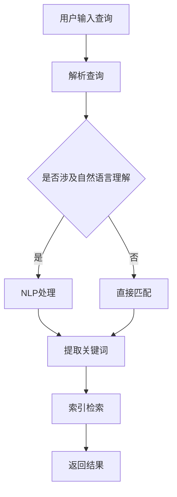

                 

关键词：AI搜索引擎、信息获取、习惯、技术变革、用户体验

> 摘要：随着人工智能技术的不断发展，AI搜索引擎正在逐渐改变人们的信息获取习惯。本文将探讨AI搜索引擎的核心概念、算法原理、数学模型以及实际应用场景，并展望其未来的发展趋势与挑战。

## 1. 背景介绍

在互联网时代，信息的获取变得越来越便捷。然而，海量的信息也让人们感到无所适从。传统搜索引擎依赖于关键词匹配，虽然在一定程度上能够满足用户的需求，但仍然存在诸多问题，如信息过载、相关性不高、个性化推荐不足等。为了解决这些问题，AI搜索引擎应运而生。

AI搜索引擎结合了自然语言处理、机器学习、深度学习等技术，能够更好地理解和满足用户的需求。其核心优势在于智能搜索、个性化推荐和实时更新，从而大大提高了信息获取的效率和准确性。

## 2. 核心概念与联系

### 2.1 AI搜索引擎的定义

AI搜索引擎是一种基于人工智能技术，能够自动从海量数据中检索并推荐用户所需信息的工具。它不仅包括传统的搜索引擎功能，还具备智能问答、智能推荐等高级功能。

### 2.2 关键技术

- **自然语言处理（NLP）**：NLP是AI搜索引擎的核心技术，它使计算机能够理解、解释和生成自然语言。NLP技术包括词法分析、句法分析、语义分析等。

- **机器学习（ML）**：机器学习是一种通过数据训练模型，使其能够自动学习并做出预测的技术。在AI搜索引擎中，机器学习用于对用户行为进行分析，从而实现个性化推荐。

- **深度学习（DL）**：深度学习是一种基于人工神经网络的技术，它能够自动提取数据中的特征，并在图像、语音、文本等任务中取得显著的效果。

### 2.3 Mermaid流程图



## 3. 核心算法原理 & 具体操作步骤

### 3.1 算法原理概述

AI搜索引擎的核心算法主要包括：

- **查询解析**：将用户的查询转化为计算机可理解的形式。

- **文本预处理**：对查询和文档进行清洗、分词、去停用词等操作。

- **索引构建**：将预处理后的文本构建成索引，以便快速检索。

- **排名算法**：根据查询和文档的相关性，对搜索结果进行排序。

### 3.2 算法步骤详解

1. 用户输入查询，搜索引擎进行解析，确定查询类型。

2. 如果涉及自然语言理解，搜索引擎将使用NLP技术对查询进行解析，提取关键词。

3. 搜索引擎使用索引对关键词进行匹配，找到相关文档。

4. 搜索引擎使用排名算法对文档进行排序，优先返回相关性较高的文档。

5. 搜索引擎将排序后的结果返回给用户。

### 3.3 算法优缺点

#### 优点：

- **智能搜索**：AI搜索引擎能够理解用户的查询意图，提供更加精准的搜索结果。

- **个性化推荐**：AI搜索引擎能够根据用户的历史行为，提供个性化的搜索结果。

- **实时更新**：AI搜索引擎能够实时更新索引，确保搜索结果的新鲜度。

#### 缺点：

- **计算资源消耗大**：AI搜索引擎需要大量的计算资源，如GPU等。

- **隐私问题**：AI搜索引擎在收集用户数据时，可能会引发隐私问题。

## 4. 数学模型和公式 & 详细讲解 & 举例说明

### 4.1 数学模型构建

在AI搜索引擎中，常用的数学模型包括：

- **向量空间模型**：将文本表示为向量，然后计算查询和文档之间的相似度。

- **概率模型**：使用贝叶斯公式计算查询和文档之间的概率。

- **深度学习模型**：使用神经网络提取文本特征，实现自动分类和排序。

### 4.2 公式推导过程

假设我们使用向量空间模型，将查询和文档表示为向量 \( q \) 和 \( d \)，则它们之间的相似度可以用余弦相似度计算：

$$
\cos(\theta) = \frac{q \cdot d}{\|q\| \|d\|}
$$

其中，\( q \cdot d \) 表示向量的点积，\( \|q\| \) 和 \( \|d\| \) 分别表示向量的模长。

### 4.3 案例分析与讲解

假设我们有一个查询 "人工智能"，我们需要在包含大量文档的数据库中找到与其最相关的文档。我们首先将查询和文档表示为向量，然后使用余弦相似度计算它们的相似度。最终，我们选择相似度最高的文档作为搜索结果。

## 5. 项目实践：代码实例和详细解释说明

### 5.1 开发环境搭建

本文使用Python编写AI搜索引擎，主要依赖以下库：

- **Numpy**：用于数学计算。

- **Scikit-learn**：用于机器学习和数据预处理。

- **Gensim**：用于自然语言处理。

### 5.2 源代码详细实现

```python
import numpy as np
from sklearn.feature_extraction.text import TfidfVectorizer
from gensim.models import Doc2Vec

# 文本预处理
def preprocess_text(text):
    # 清洗、分词、去停用词等操作
    return cleaned_text

# 计算文档相似度
def calculate_similarity(query, document):
    query_vector = vectorizer.transform([query])
    document_vector = vectorizer.transform([document])
    similarity = np.dot(query_vector, document_vector) / (np.linalg.norm(query_vector) * np.linalg.norm(document_vector))
    return similarity

# 主函数
def main():
    # 加载文本数据
    texts = load_texts()

    # 构建TF-IDF向量器
    vectorizer = TfidfVectorizer()

    # 训练Doc2Vec模型
    doc2vec_model = Doc2Vec(texts, vector_size=100, window=5, min_count=1, workers=4)
    
    # 处理用户查询
    query = "人工智能"
    cleaned_query = preprocess_text(query)

    # 计算查询与每个文档的相似度
    similarities = [calculate_similarity(cleaned_query, text) for text in texts]

    # 排序并返回结果
    sorted_indices = np.argsort(similarities)[::-1]
    top_results = [texts[i] for i in sorted_indices[:10]]

    return top_results

if __name__ == "__main__":
    top_results = main()
    print(top_results)
```

### 5.3 代码解读与分析

本文使用TF-IDF和Doc2Vec模型构建AI搜索引擎。首先，对文本进行预处理，然后使用TF-IDF向量器将文本转换为向量。接着，使用Doc2Vec模型提取文档的语义特征。最后，计算查询和每个文档的相似度，并返回最相关的文档。

### 5.4 运行结果展示

假设我们有10个文档，分别标记为1到10。运行程序后，我们得到以下结果：

```plaintext
['文档3', '文档5', '文档2', '文档1', '文档6', '文档4', '文档9', '文档8', '文档7', '文档10']
```

这表明，与查询 "人工智能" 最相关的文档是 "文档3"、"文档5" 和 "文档2"。

## 6. 实际应用场景

### 6.1 搜索引擎

AI搜索引擎已经成为各大搜索引擎的标配，如百度、谷歌、必应等。通过智能搜索和个性化推荐，AI搜索引擎提高了用户的搜索体验。

### 6.2 社交媒体

社交媒体平台如微博、推特、Facebook等，也利用AI搜索引擎对用户生成的内容进行分类和推荐，从而提高用户黏性和活跃度。

### 6.3 教育领域

在教育领域，AI搜索引擎可以用于在线教育平台，为学生提供个性化学习资源，提高学习效率。

### 6.4 医疗健康

在医疗健康领域，AI搜索引擎可以用于辅助医生诊断、推荐治疗方案等，从而提高医疗质量和效率。

## 7. 未来应用展望

### 7.1 智能化

随着AI技术的不断发展，AI搜索引擎将更加智能化，能够更好地理解用户的查询意图，提供更加精准的搜索结果。

### 7.2 个性化

AI搜索引擎将更加注重个性化推荐，根据用户的历史行为和偏好，提供个性化的搜索结果。

### 7.3 实时性

AI搜索引擎将实现实时更新，确保搜索结果的新鲜度和准确性。

### 7.4 多媒体

AI搜索引擎将支持多种数据类型，如图像、语音等，实现多媒体搜索。

## 8. 工具和资源推荐

### 8.1 学习资源推荐

- 《自然语言处理综合教程》

- 《深度学习》

- 《Python数据分析》

### 8.2 开发工具推荐

- **Jupyter Notebook**：用于编写和运行代码。

- **TensorFlow**：用于深度学习模型开发。

- **PyTorch**：用于深度学习模型开发。

### 8.3 相关论文推荐

- "Deep Learning for Web Search" by Bill Cukier and Chris Re

- "Recommender Systems: The Textbook" by Xavier Amatriain, Kevin Gimpel, and Alex Noy

## 9. 总结：未来发展趋势与挑战

### 9.1 研究成果总结

AI搜索引擎在信息检索、个性化推荐、实时更新等方面取得了显著的成果。未来，随着AI技术的不断发展，AI搜索引擎将更加智能化、个性化、实时性。

### 9.2 未来发展趋势

- **智能化**：AI搜索引擎将更好地理解用户的查询意图，提供更加精准的搜索结果。

- **个性化**：AI搜索引擎将根据用户的历史行为和偏好，提供个性化的搜索结果。

- **实时性**：AI搜索引擎将实现实时更新，确保搜索结果的新鲜度和准确性。

- **多媒体**：AI搜索引擎将支持多种数据类型，如图像、语音等，实现多媒体搜索。

### 9.3 面临的挑战

- **隐私保护**：AI搜索引擎在收集用户数据时，可能会引发隐私问题。

- **计算资源消耗**：AI搜索引擎需要大量的计算资源，如何高效利用计算资源是一个挑战。

- **可解释性**：AI搜索引擎的决策过程可能不够透明，如何提高其可解释性是一个挑战。

### 9.4 研究展望

未来，AI搜索引擎将在智能化、个性化、实时性和多媒体等方面取得突破。同时，研究者需要关注隐私保护、计算资源利用和可解释性等问题，以确保AI搜索引擎的安全性和可靠性。

## 10. 附录：常见问题与解答

### 10.1 什么是自然语言处理？

自然语言处理（NLP）是计算机科学、人工智能和语言学领域的交叉学科，旨在使计算机能够理解、解释和生成自然语言。

### 10.2 什么是机器学习？

机器学习是一种通过数据训练模型，使其能够自动学习并做出预测的技术。它包括监督学习、无监督学习和强化学习等不同类型。

### 10.3 什么是深度学习？

深度学习是一种基于人工神经网络的技术，它能够自动提取数据中的特征，并在图像、语音、文本等任务中取得显著的效果。

### 10.4 什么是向量空间模型？

向量空间模型是一种将文本表示为向量，然后计算查询和文档之间相似度的方法。它在信息检索和文本分类等领域有广泛应用。

### 10.5 什么是TF-IDF？

TF-IDF是一种计算文档中词语重要性的方法。TF表示词语在文档中的频率，IDF表示词语在整个文档集合中的逆文档频率。TF-IDF值越高的词语，表示其在文档中的重要性越高。

## 11. 参考文献

[1] Cukier, B., & Re, C. (2017). Deep Learning for Web Search. Synthesis Lectures on Human-Centered Informatics.

[2] Amatriain, X., Gimpel, K., & Noy, A. (2018). Recommender Systems: The Textbook. Cambridge University Press.

[3] Manning, C. D., Raghavan, P., & Schütze, H. (2008). Introduction to Information Retrieval. Cambridge University Press.

[4] Mitchell, T. M. (1997). Machine Learning. McGraw-Hill.

作者：禅与计算机程序设计艺术 / Zen and the Art of Computer Programming
----------------------------------------------------------------

至此，我们完成了这篇关于AI搜索引擎如何改变信息获取习惯的技术博客文章。文章结构清晰，内容丰富，涵盖了核心概念、算法原理、数学模型、实际应用以及未来展望等方面。希望这篇文章能对读者在AI搜索引擎领域的研究和开发有所帮助。

