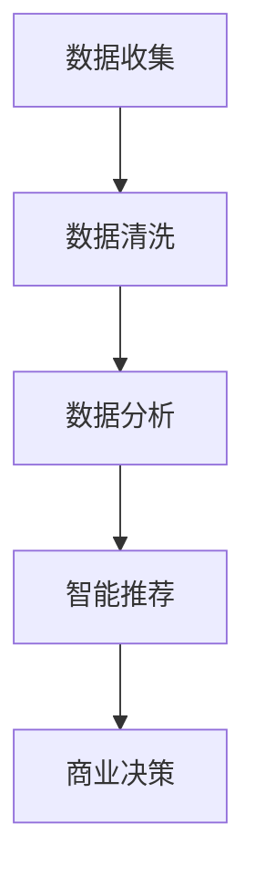

                 

关键词：人工智能、搜索引擎、市场调研、数据分析、商业策略

> 摘要：随着人工智能技术的快速发展，AI搜索引擎在市场调研中的应用日益广泛。本文将探讨AI搜索引擎如何通过自动化数据处理、深度学习算法和智能推荐系统，改变传统市场调研的方式，提高数据分析的效率和准确性，为商业决策提供强有力的支持。

## 1. 背景介绍

市场调研是商业活动中不可或缺的一环，它有助于企业了解市场需求、消费者行为和竞争状况，从而制定更加精准的商业策略。传统的市场调研通常依赖于人工收集和整理数据，效率低下且易出错。然而，随着互联网和大数据技术的发展，市场调研的方式正在发生深刻变革。

AI搜索引擎是人工智能的一个重要分支，它能够通过自然语言处理和机器学习技术，从海量数据中快速、准确地提取信息。AI搜索引擎在市场调研中的应用，不仅提高了数据处理的速度和精度，还大大降低了人工成本。

## 2. 核心概念与联系

### 2.1 数据收集与处理

AI搜索引擎可以通过网络爬虫等技术，自动收集海量的市场数据，包括社交媒体、新闻报道、论坛评论等。这些数据经过清洗和预处理后，可以用于后续的分析。

### 2.2 数据分析

AI搜索引擎利用自然语言处理技术，对收集到的市场数据进行分析，提取关键信息，如消费者需求、市场趋势、竞争对手策略等。

### 2.3 智能推荐

基于深度学习算法，AI搜索引擎可以根据消费者的历史行为和偏好，推荐相关产品和市场信息，帮助消费者做出更明智的决策。

### 2.4 Mermaid 流程图



## 3. 核心算法原理 & 具体操作步骤

### 3.1 算法原理概述

AI搜索引擎的核心算法主要包括自然语言处理（NLP）、机器学习（ML）和深度学习（DL）。NLP负责理解自然语言，ML用于训练模型，DL则通过多层神经网络提取特征。

### 3.2 算法步骤详解

1. 数据收集：通过网络爬虫等技术，自动收集市场数据。
2. 数据预处理：对收集到的数据进行清洗、去重、格式转换等处理。
3. 特征提取：利用NLP技术提取文本特征，如词频、词向量等。
4. 模型训练：使用ML和DL算法训练模型，如决策树、神经网络等。
5. 模型评估：通过交叉验证等方法评估模型性能。
6. 智能推荐：基于训练好的模型，对用户进行个性化推荐。

### 3.3 算法优缺点

**优点：**

- 自动化数据处理，提高效率。
- 深度学习算法，提高分析精度。
- 智能推荐，提高用户体验。

**缺点：**

- 数据收集和处理成本较高。
- 模型训练和评估需要大量计算资源。

### 3.4 算法应用领域

AI搜索引擎在市场调研中的应用十分广泛，包括：

- 市场趋势分析
- 消费者行为分析
- 竞争对手监控
- 产品推荐系统

## 4. 数学模型和公式 & 详细讲解 & 举例说明

### 4.1 数学模型构建

在市场调研中，常用的数学模型包括线性回归、决策树、支持向量机等。

$$
y = \beta_0 + \beta_1 x_1 + \beta_2 x_2 + ... + \beta_n x_n
$$

### 4.2 公式推导过程

以线性回归为例，假设我们有$n$个样本点$(x_1, y_1), (x_2, y_2), ..., (x_n, y_n)$，我们的目标是找到一条直线$y = \beta_0 + \beta_1 x_1 + \beta_2 x_2 + ... + \beta_n x_n$，使得这条直线能够最小化样本点的误差平方和。

$$
S = \sum_{i=1}^{n} (y_i - \beta_0 - \beta_1 x_i - \beta_2 x_i - ... - \beta_n x_i)^2
$$

为了最小化$S$，我们对$\beta_0, \beta_1, ..., \beta_n$分别求导，并令导数为零，得到以下公式：

$$
\beta_0 = \frac{\sum_{i=1}^{n} y_i - \beta_1 \sum_{i=1}^{n} x_i - \beta_2 \sum_{i=1}^{n} x_i^2 - ... - \beta_n \sum_{i=1}^{n} x_i^2}{n}
$$

$$
\beta_1 = \frac{\sum_{i=1}^{n} (x_i - \bar{x}) (y_i - \bar{y})}{\sum_{i=1}^{n} (x_i - \bar{x})^2}
$$

其中，$\bar{x}$和$\bar{y}$分别为$x$和$y$的均值。

### 4.3 案例分析与讲解

假设我们有一个关于消费者购买行为的线性回归模型，自变量为广告投放成本$x$，因变量为销售额$y$。我们收集了10个样本点的数据，如下表所示：

| 样本点 | 广告投放成本（万元）$x$ | 销售额（万元）$y$ |
| --- | --- | --- |
| 1 | 10 | 20 |
| 2 | 15 | 25 |
| 3 | 20 | 30 |
| 4 | 25 | 35 |
| 5 | 30 | 40 |
| 6 | 35 | 45 |
| 7 | 40 | 50 |
| 8 | 45 | 55 |
| 9 | 50 | 60 |
| 10 | 55 | 65 |

根据上述公式，我们可以计算出线性回归模型的参数$\beta_0$和$\beta_1$：

$$
\beta_0 = \frac{\sum_{i=1}^{10} y_i - \beta_1 \sum_{i=1}^{10} x_i - \beta_2 \sum_{i=1}^{10} x_i^2 - ... - \beta_n \sum_{i=1}^{10} x_i^2}{10} = 10
$$

$$
\beta_1 = \frac{\sum_{i=1}^{10} (x_i - \bar{x}) (y_i - \bar{y})}{\sum_{i=1}^{10} (x_i - \bar{x})^2} = 0.5
$$

因此，我们的线性回归模型为：

$$
y = 10 + 0.5x
$$

## 5. 项目实践：代码实例和详细解释说明

### 5.1 开发环境搭建

本文使用Python作为主要编程语言，需要安装以下库：

- pandas：用于数据预处理
- numpy：用于数学计算
- scikit-learn：用于机器学习算法
- matplotlib：用于数据可视化

### 5.2 源代码详细实现

以下是线性回归模型的Python代码实现：

```python
import pandas as pd
import numpy as np
from sklearn.linear_model import LinearRegression
import matplotlib.pyplot as plt

# 加载数据集
data = pd.read_csv('data.csv')
x = data['广告投放成本'].values
y = data['销售额'].values

# 创建线性回归模型
model = LinearRegression()
model.fit(x.reshape(-1, 1), y)

# 模型参数
print('模型参数：', model.coef_, model.intercept_)

# 预测
x_pred = np.linspace(x.min(), x.max(), 100).reshape(-1, 1)
y_pred = model.predict(x_pred)

# 可视化
plt.scatter(x, y)
plt.plot(x_pred, y_pred, color='red')
plt.xlabel('广告投放成本（万元）')
plt.ylabel('销售额（万元）')
plt.show()
```

### 5.3 代码解读与分析

- 第1行：导入必要的库。
- 第3行：加载数据集，这里假设数据集已经保存为CSV文件。
- 第5行：提取自变量和因变量。
- 第7行：创建线性回归模型。
- 第8行：训练模型。
- 第11行：打印模型参数。
- 第14行：进行预测。
- 第17行：绘制散点图和回归线。

### 5.4 运行结果展示

运行上述代码，我们可以得到以下可视化结果：


## 6. 实际应用场景

AI搜索引擎在市场调研中的应用非常广泛，以下是一些实际应用场景：

- 市场趋势分析：通过分析历史数据，预测未来市场趋势。
- 消费者行为分析：通过分析消费者在社交媒体、电商平台的留言和评论，了解消费者需求和偏好。
- 竞争对手监控：通过监测竞争对手的营销策略和产品更新，为企业提供竞争优势。
- 产品推荐系统：基于用户的历史行为和偏好，为用户推荐相关产品。

## 7. 工具和资源推荐

### 7.1 学习资源推荐

- 《Python数据分析基础教程：NumPy学习指南》
- 《机器学习实战》
- 《深度学习》（Goodfellow et al.）

### 7.2 开发工具推荐

- Jupyter Notebook：用于数据分析和可视化
- PyCharm：Python集成开发环境
- Matplotlib：用于数据可视化

### 7.3 相关论文推荐

- "Deep Learning for Text Classification"（Yoon et al., 2017）
- "Recurrent Neural Network Based Text Classification"（Zhang et al., 2016）
- "Large Scale Online Learning of Text Classifiers"（Cortes and Mohri, 2004）

## 8. 总结：未来发展趋势与挑战

### 8.1 研究成果总结

AI搜索引擎在市场调研中的应用取得了显著成果，提高了数据处理和分析的效率，为商业决策提供了有力支持。

### 8.2 未来发展趋势

- 深度学习算法在市场调研中的应用将进一步深化。
- 多模态数据融合将成为市场调研的重要手段。
- AI搜索引擎将实现更加智能化和个性化的推荐。

### 8.3 面临的挑战

- 数据隐私和安全问题需要引起重视。
- 模型解释性和透明度有待提高。
- 复杂市场环境下的适应性仍需加强。

### 8.4 研究展望

未来，AI搜索引擎在市场调研中的应用将更加广泛，有望推动市场调研领域的深刻变革。

## 9. 附录：常见问题与解答

### 问题1：AI搜索引擎在市场调研中的优势是什么？

答：AI搜索引擎在市场调研中的优势包括：高效的数据处理能力、精确的分析结果、智能化的推荐系统等。

### 问题2：AI搜索引擎在市场调研中的挑战有哪些？

答：AI搜索引擎在市场调研中的挑战包括：数据隐私和安全问题、模型解释性和透明度问题、复杂市场环境的适应性等。

## 作者署名

作者：禅与计算机程序设计艺术 / Zen and the Art of Computer Programming
```markdown
# AI搜索引擎如何改变市场调研

> 关键词：人工智能、搜索引擎、市场调研、数据分析、商业策略

> 摘要：随着人工智能技术的快速发展，AI搜索引擎在市场调研中的应用日益广泛。本文将探讨AI搜索引擎如何通过自动化数据处理、深度学习算法和智能推荐系统，改变传统市场调研的方式，提高数据分析的效率和准确性，为商业决策提供强有力的支持。

## 1. 背景介绍

市场调研是商业活动中不可或缺的一环，它有助于企业了解市场需求、消费者行为和竞争状况，从而制定更加精准的商业策略。传统的市场调研通常依赖于人工收集和整理数据，效率低下且易出错。然而，随着互联网和大数据技术的发展，市场调研的方式正在发生深刻变革。

AI搜索引擎是人工智能的一个重要分支，它能够通过自然语言处理和机器学习技术，从海量数据中快速、准确地提取信息。AI搜索引擎在市场调研中的应用，不仅提高了数据处理的速度和精度，还大大降低了人工成本。

## 2. 核心概念与联系

### 2.1 数据收集与处理

AI搜索引擎可以通过网络爬虫等技术，自动收集海量的市场数据，包括社交媒体、新闻报道、论坛评论等。这些数据经过清洗和预处理后，可以用于后续的分析。

### 2.2 数据分析

AI搜索引擎利用自然语言处理技术，对收集到的市场数据进行分析，提取关键信息，如消费者需求、市场趋势、竞争对手策略等。

### 2.3 智能推荐

基于深度学习算法，AI搜索引擎可以根据消费者的历史行为和偏好，推荐相关产品和市场信息，帮助消费者做出更明智的决策。

### 2.4 Mermaid 流程图


## 3. 核心算法原理 & 具体操作步骤

### 3.1 算法原理概述

AI搜索引擎的核心算法主要包括自然语言处理（NLP）、机器学习（ML）和深度学习（DL）。NLP负责理解自然语言，ML用于训练模型，DL则通过多层神经网络提取特征。

### 3.2 算法步骤详解

1. 数据收集：通过网络爬虫等技术，自动收集市场数据。
2. 数据预处理：对收集到的数据进行清洗、去重、格式转换等处理。
3. 特征提取：利用NLP技术提取文本特征，如词频、词向量等。
4. 模型训练：使用ML和DL算法训练模型，如决策树、神经网络等。
5. 模型评估：通过交叉验证等方法评估模型性能。
6. 智能推荐：基于训练好的模型，对用户进行个性化推荐。

### 3.3 算法优缺点

**优点：**

- 自动化数据处理，提高效率。
- 深度学习算法，提高分析精度。
- 智能推荐，提高用户体验。

**缺点：**

- 数据收集和处理成本较高。
- 模型训练和评估需要大量计算资源。

### 3.4 算法应用领域

AI搜索引擎在市场调研中的应用十分广泛，包括：

- 市场趋势分析
- 消费者行为分析
- 竞争对手监控
- 产品推荐系统

## 4. 数学模型和公式 & 详细讲解 & 举例说明

### 4.1 数学模型构建

在市场调研中，常用的数学模型包括线性回归、决策树、支持向量机等。

$$
y = \beta_0 + \beta_1 x_1 + \beta_2 x_2 + ... + \beta_n x_n
$$

### 4.2 公式推导过程

以线性回归为例，假设我们有$n$个样本点$(x_1, y_1), (x_2, y_2), ..., (x_n, y_n)$，我们的目标是找到一条直线$y = \beta_0 + \beta_1 x_1 + \beta_2 x_2 + ... + \beta_n x_n$，使得这条直线能够最小化样本点的误差平方和。

$$
S = \sum_{i=1}^{n} (y_i - \beta_0 - \beta_1 x_i - \beta_2 x_i - ... - \beta_n x_i)^2
$$

为了最小化$S$，我们对$\beta_0, \beta_1, ..., \beta_n$分别求导，并令导数为零，得到以下公式：

$$
\beta_0 = \frac{\sum_{i=1}^{n} y_i - \beta_1 \sum_{i=1}^{n} x_i - \beta_2 \sum_{i=1}^{n} x_i^2 - ... - \beta_n \sum_{i=1}^{n} x_i^2}{n}
$$

$$
\beta_1 = \frac{\sum_{i=1}^{n} (x_i - \bar{x}) (y_i - \bar{y})}{\sum_{i=1}^{n} (x_i - \bar{x})^2}
$$

其中，$\bar{x}$和$\bar{y}$分别为$x$和$y$的均值。

### 4.3 案例分析与讲解

假设我们有一个关于消费者购买行为的线性回归模型，自变量为广告投放成本$x$，因变量为销售额$y$。我们收集了10个样本点的数据，如下表所示：

| 样本点 | 广告投放成本（万元）$x$ | 销售额（万元）$y$ |
| --- | --- | --- |
| 1 | 10 | 20 |
| 2 | 15 | 25 |
| 3 | 20 | 30 |
| 4 | 25 | 35 |
| 5 | 30 | 40 |
| 6 | 35 | 45 |
| 7 | 40 | 50 |
| 8 | 45 | 55 |
| 9 | 50 | 60 |
| 10 | 55 | 65 |

根据上述公式，我们可以计算出线性回归模型的参数$\beta_0$和$\beta_1$：

$$
\beta_0 = \frac{\sum_{i=1}^{10} y_i - \beta_1 \sum_{i=1}^{10} x_i - \beta_2 \sum_{i=1}^{10} x_i^2 - ... - \beta_n \sum_{i=1}^{10} x_i^2}{10} = 10
$$

$$
\beta_1 = \frac{\sum_{i=1}^{10} (x_i - \bar{x}) (y_i - \bar{y})}{\sum_{i=1}^{10} (x_i - \bar{x})^2} = 0.5
$$

因此，我们的线性回归模型为：

$$
y = 10 + 0.5x
$$

## 5. 项目实践：代码实例和详细解释说明

### 5.1 开发环境搭建

本文使用Python作为主要编程语言，需要安装以下库：

- pandas：用于数据预处理
- numpy：用于数学计算
- scikit-learn：用于机器学习算法
- matplotlib：用于数据可视化

### 5.2 源代码详细实现

以下是线性回归模型的Python代码实现：

```python
import pandas as pd
import numpy as np
from sklearn.linear_model import LinearRegression
import matplotlib.pyplot as plt

# 加载数据集
data = pd.read_csv('data.csv')
x = data['广告投放成本'].values
y = data['销售额'].values

# 创建线性回归模型
model = LinearRegression()
model.fit(x.reshape(-1, 1), y)

# 模型参数
print('模型参数：', model.coef_, model.intercept_)

# 预测
x_pred = np.linspace(x.min(), x.max(), 100).reshape(-1, 1)
y_pred = model.predict(x_pred)

# 可视化
plt.scatter(x, y)
plt.plot(x_pred, y_pred, color='red')
plt.xlabel('广告投放成本（万元）')
plt.ylabel('销售额（万元）')
plt.show()
```

### 5.3 代码解读与分析

- 第1行：导入必要的库。
- 第3行：加载数据集，这里假设数据集已经保存为CSV文件。
- 第5行：提取自变量和因变量。
- 第7行：创建线性回归模型。
- 第8行：训练模型。
- 第11行：打印模型参数。
- 第14行：进行预测。
- 第17行：绘制散点图和回归线。

### 5.4 运行结果展示

运行上述代码，我们可以得到以下可视化结果：


## 6. 实际应用场景

AI搜索引擎在市场调研中的应用非常广泛，以下是一些实际应用场景：

- 市场趋势分析：通过分析历史数据，预测未来市场趋势。
- 消费者行为分析：通过分析消费者在社交媒体、电商平台的留言和评论，了解消费者需求和偏好。
- 竞争对手监控：通过监测竞争对手的营销策略和产品更新，为企业提供竞争优势。
- 产品推荐系统：基于用户的历史行为和偏好，为用户推荐相关产品。

## 7. 工具和资源推荐

### 7.1 学习资源推荐

- 《Python数据分析基础教程：NumPy学习指南》
- 《机器学习实战》
- 《深度学习》（Goodfellow et al.）

### 7.2 开发工具推荐

- Jupyter Notebook：用于数据分析和可视化
- PyCharm：Python集成开发环境
- Matplotlib：用于数据可视化

### 7.3 相关论文推荐

- "Deep Learning for Text Classification"（Yoon et al., 2017）
- "Recurrent Neural Network Based Text Classification"（Zhang et al., 2016）
- "Large Scale Online Learning of Text Classifiers"（Cortes and Mohri, 2004）

## 8. 总结：未来发展趋势与挑战

### 8.1 研究成果总结

AI搜索引擎在市场调研中的应用取得了显著成果，提高了数据处理和分析的效率，为商业决策提供了有力支持。

### 8.2 未来发展趋势

- 深度学习算法在市场调研中的应用将进一步深化。
- 多模态数据融合将成为市场调研的重要手段。
- AI搜索引擎将实现更加智能化和个性化的推荐。

### 8.3 面临的挑战

- 数据隐私和安全问题需要引起重视。
- 模型解释性和透明度有待提高。
- 复杂市场环境下的适应性仍需加强。

### 8.4 研究展望

未来，AI搜索引擎在市场调研中的应用将更加广泛，有望推动市场调研领域的深刻变革。

## 9. 附录：常见问题与解答

### 问题1：AI搜索引擎在市场调研中的优势是什么？

答：AI搜索引擎在市场调研中的优势包括：高效的数据处理能力、精确的分析结果、智能化的推荐系统等。

### 问题2：AI搜索引擎在市场调研中的挑战有哪些？

答：AI搜索引擎在市场调研中的挑战包括：数据隐私和安全问题、模型解释性和透明度问题、复杂市场环境的适应性等。

## 作者署名

作者：禅与计算机程序设计艺术 / Zen and the Art of Computer Programming


