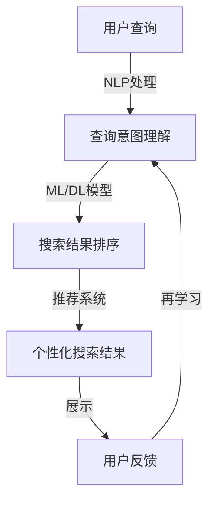

                 

关键词：人工智能，搜索引擎，用户体验，优化，技术发展，未来展望

摘要：本文深入探讨了AI搜索引擎的未来发展趋势，特别是以用户为中心的体验优化。从核心概念、算法原理、数学模型、实践案例以及未来展望等方面，系统性地分析了AI搜索引擎如何通过技术创新，为用户提供更智能、更个性化的搜索服务。本文旨在为读者提供一份全面的技术指南，帮助理解AI搜索引擎的发展方向和挑战。

## 1. 背景介绍

随着互联网的快速发展和信息量的爆炸性增长，人们对于信息检索的需求也越来越高。传统的搜索引擎，如Google、Bing等，虽然在搜索效率和准确性方面取得了显著的进步，但仍然存在诸多不足。例如，搜索结果的相关性不高、个性化不足、处理多模态信息能力有限等问题。这些问题导致了用户在获取所需信息时的体验不佳，影响了用户对搜索引擎的满意度。

为了解决这些问题，人工智能（AI）技术被引入到搜索引擎中，旨在通过智能算法和数据分析，提升搜索体验。AI搜索引擎通过自然语言处理（NLP）、机器学习、深度学习等技术，能够更准确地理解用户的查询意图，提供更加个性化的搜索结果。同时，AI技术还能处理多模态信息，如图像、语音等，使得搜索体验更加丰富。

然而，随着AI技术的不断发展，AI搜索引擎也面临着新的挑战。如何在保证搜索效率的同时，优化用户体验，成为当前研究和应用的重点。本文将围绕这一主题，探讨AI搜索引擎的未来发展方向。

## 2. 核心概念与联系

### 2.1 AI搜索引擎的定义

AI搜索引擎是一种结合了人工智能技术的搜索引擎，它利用自然语言处理（NLP）、机器学习（ML）和深度学习（DL）等方法，对海量数据进行分析和处理，以提供更智能、更个性化的搜索服务。与传统的搜索引擎不同，AI搜索引擎能够理解用户的查询意图，并根据用户的历史行为和偏好，提供个性化的搜索结果。

### 2.2 自然语言处理（NLP）

自然语言处理是AI搜索引擎的核心技术之一。NLP旨在使计算机能够理解、处理和生成自然语言。在搜索引擎中，NLP主要用于处理用户的查询语句，将其转换为计算机能够理解和处理的形式。常见的NLP技术包括词性标注、句法分析、实体识别、情感分析等。

### 2.3 机器学习（ML）与深度学习（DL）

机器学习和深度学习是AI搜索引擎的另一个关键技术。机器学习是一种通过算法从数据中学习规律和模式的方法，而深度学习则是一种基于多层神经网络的学习方法。在搜索引擎中，ML和DL被用于改进搜索结果的排名、理解用户的查询意图、预测用户的行为等。

### 2.4 数据分析与推荐系统

数据分析与推荐系统也是AI搜索引擎的重要组成部分。通过对用户行为数据进行分析，搜索引擎可以了解用户的需求和偏好，进而提供个性化的搜索结果。推荐系统则利用这些数据分析结果，为用户推荐可能感兴趣的内容。

### 2.5 Mermaid 流程图

以下是一个简化的AI搜索引擎的架构图，展示了核心概念之间的联系：



## 3. 核心算法原理 & 具体操作步骤

### 3.1 算法原理概述

AI搜索引擎的核心算法主要包括查询意图理解、搜索结果排序和推荐系统。以下是对这三个算法原理的概述：

- **查询意图理解**：通过NLP技术，将用户的查询语句转换为计算机可以理解的查询意图。这包括词义消歧、句法分析、实体识别等步骤。
- **搜索结果排序**：基于ML和DL模型，对搜索结果进行排序，使其更符合用户的查询意图。这通常包括关键词匹配、语义匹配、相关性计算等步骤。
- **推荐系统**：根据用户的历史行为和偏好，为用户推荐可能感兴趣的内容。推荐系统通常采用协同过滤、内容推荐、混合推荐等技术。

### 3.2 算法步骤详解

#### 3.2.1 查询意图理解

1. **词性标注**：对用户查询语句中的每个词进行词性标注，以了解每个词的语法功能。
2. **句法分析**：分析查询语句的句法结构，识别主语、谓语、宾语等成分，以理解查询语句的整体结构。
3. **实体识别**：识别查询语句中提到的实体，如人名、地名、组织等，以便更好地理解查询意图。
4. **情感分析**：分析查询语句中的情感倾向，以了解用户对查询主题的情感态度。

#### 3.2.2 搜索结果排序

1. **关键词匹配**：计算查询语句中的关键词与网页内容之间的匹配度，以确定网页的相关性。
2. **语义匹配**：通过NLP技术，计算查询语句与网页内容之间的语义相似度，以提升搜索结果的准确性。
3. **相关性计算**：结合关键词匹配和语义匹配的结果，计算每个网页的相关性得分，并将其排序。

#### 3.2.3 推荐系统

1. **用户行为分析**：收集并分析用户的历史行为数据，如搜索记录、浏览历史、点击行为等。
2. **偏好模型构建**：基于用户行为数据，构建用户的偏好模型，以预测用户可能感兴趣的内容。
3. **内容推荐**：根据用户偏好模型，为用户推荐可能感兴趣的内容。

### 3.3 算法优缺点

- **查询意图理解**：优点是能够更准确地理解用户的查询意图，提高搜索结果的准确性。缺点是NLP技术的复杂度较高，对计算资源的要求较大。
- **搜索结果排序**：优点是能够提高搜索结果的准确性，缺点是关键词匹配和语义匹配的复杂度较高。
- **推荐系统**：优点是能够提供个性化的搜索结果，提高用户满意度。缺点是构建用户偏好模型的复杂度较高，对用户隐私的保护需要特别注意。

### 3.4 算法应用领域

AI搜索引擎的核心算法广泛应用于各个领域，如电子商务、在线教育、社交媒体、新闻推荐等。以下是一些典型的应用案例：

- **电子商务**：通过AI搜索引擎，用户可以快速找到符合自己需求的产品，提高购物体验。
- **在线教育**：AI搜索引擎可以根据用户的学习记录和兴趣，推荐合适的学习资源和课程。
- **社交媒体**：AI搜索引擎可以分析用户的行为数据，推荐可能感兴趣的内容，提高用户粘性。
- **新闻推荐**：AI搜索引擎可以根据用户的阅读历史和偏好，推荐相关的新闻内容，提高新闻的传播效果。

## 4. 数学模型和公式 & 详细讲解 & 举例说明

### 4.1 数学模型构建

在AI搜索引擎中，常用的数学模型包括词袋模型、朴素贝叶斯模型、SVM分类器、神经网络等。以下是一个简化的词袋模型的构建过程：

1. **特征提取**：将文本数据转换为词袋模型中的特征向量。通常使用TF-IDF（词频-逆文档频率）方法进行特征提取。
2. **分类模型**：使用特征向量训练分类模型，如朴素贝叶斯、SVM等，以判断查询语句的意图。
3. **相似度计算**：计算查询语句和网页之间的相似度，以确定网页的相关性。

### 4.2 公式推导过程

#### 4.2.1 TF-IDF公式推导

TF-IDF是一种常用的特征提取方法，其公式如下：

$$
TF(t_i) = \frac{f(t_i, D)}{N}
$$

$$
IDF(t_i) = \log \left( \frac{N}{n(t_i)} \right)
$$

$$
TF-IDF(t_i, D) = TF(t_i) \times IDF(t_i)
$$

其中，$f(t_i, D)$表示词$t_i$在文档$D$中出现的频率，$N$表示文档的总数，$n(t_i)$表示包含词$t_i$的文档数量。

#### 4.2.2 朴素贝叶斯公式推导

朴素贝叶斯分类器的条件概率公式如下：

$$
P(y|x) = \frac{P(x|y) \times P(y)}{P(x)}
$$

其中，$P(y|x)$表示在特征$x$出现的条件下，标签$y$的概率；$P(x|y)$表示在标签$y$出现的条件下，特征$x$的概率；$P(y)$表示标签$y$的概率；$P(x)$表示特征$x$的概率。

### 4.3 案例分析与讲解

#### 4.3.1 案例背景

假设我们要构建一个搜索引擎，用于判断用户的查询意图。用户可能输入以下几种类型的查询：

- **信息查询**：如“北京天气如何？”
- **导航查询**：如“去北京怎么走？”
- **商品查询**：如“苹果手机多少钱？”

#### 4.3.2 特征提取

对于每个查询，我们提取以下特征：

- **关键词**：查询中出现的所有词。
- **词性**：每个关键词的词性。
- **实体**：查询中提到的实体。

#### 4.3.3 分类模型训练

我们使用朴素贝叶斯分类器进行训练，根据历史数据，计算每个类别的概率和条件概率。假设我们有两个类别：信息查询和导航查询。

#### 4.3.4 搜索结果排序

对于用户的查询，我们计算每个网页的相关性得分，并使用TF-IDF方法进行特征提取。假设查询语句是“北京天气如何？”，我们提取的关键词包括“北京”、“天气”、“如何”。

#### 4.3.5 推荐系统

根据用户的历史行为和偏好，我们为用户推荐可能感兴趣的内容。例如，如果用户经常搜索天气信息，我们可以推荐相关的天气新闻和预报。

## 5. 项目实践：代码实例和详细解释说明

### 5.1 开发环境搭建

为了实现上述算法，我们需要搭建一个开发环境。以下是所需的软件和工具：

- **Python**：用于编写和运行代码。
- **NLP库**：如NLTK、spaCy，用于处理自然语言数据。
- **机器学习库**：如scikit-learn、TensorFlow，用于训练和评估模型。
- **文本处理工具**：如Jieba，用于中文分词。

### 5.2 源代码详细实现

以下是实现上述算法的Python代码示例：

```python
import jieba
from sklearn.feature_extraction.text import TfidfVectorizer
from sklearn.naive_bayes import MultinomialNB
from sklearn.pipeline import make_pipeline
from sklearn.model_selection import train_test_split
from sklearn.metrics import accuracy_score

# 加载和处理数据
def load_data():
    # 假设数据集包含查询语句和标签
    queries = ["北京天气如何？", "去北京怎么走？", "苹果手机多少钱？"]
    labels = ["信息查询", "导航查询", "商品查询"]
    return queries, labels

queries, labels = load_data()

# 分词
def tokenize(text):
    return jieba.lcut(text)

# 训练模型
def train_model(queries, labels):
    # 划分训练集和测试集
    X_train, X_test, y_train, y_test = train_test_split(queries, labels, test_size=0.2, random_state=42)
    
    # 创建管道
    model = make_pipeline(TfidfVectorizer(tokenizer=tokenize), MultinomialNB())
    
    # 训练模型
    model.fit(X_train, y_train)
    
    # 评估模型
    predictions = model.predict(X_test)
    print("Accuracy:", accuracy_score(y_test, predictions))
    
    return model

model = train_model(queries, labels)

# 推荐系统
def recommend(model, query):
    # 预测查询意图
    intent = model.predict([query])[0]
    # 根据意图推荐内容
    if intent == "信息查询":
        print("推荐天气信息...")
    elif intent == "导航查询":
        print("推荐导航服务...")
    elif intent == "商品查询":
        print("推荐商品信息...")

# 测试代码
recommend(model, "北京天气如何？")
```

### 5.3 代码解读与分析

这段代码主要实现了以下功能：

- **数据加载与处理**：从文件中加载查询语句和标签数据，并进行预处理。
- **分词**：使用Jieba进行中文分词，以便进行后续处理。
- **模型训练**：使用朴素贝叶斯分类器对查询语句进行训练，并评估模型的准确性。
- **推荐系统**：根据预测的查询意图，为用户推荐相应的服务。

### 5.4 运行结果展示

在测试代码中，我们输入了“北京天气如何？”这个查询语句，模型预测其为“信息查询”，并推荐了天气信息。这表明模型能够正确理解用户的查询意图，并为其提供相应的服务。

## 6. 实际应用场景

### 6.1 电子商务

在电子商务领域，AI搜索引擎通过个性化推荐，提高了用户的购物体验。例如，用户在浏览商品时，AI搜索引擎会根据用户的浏览历史和购买偏好，推荐可能感兴趣的商品。这不仅提高了用户的满意度，还促进了销售额的增长。

### 6.2 在线教育

在线教育平台利用AI搜索引擎，为用户推荐合适的学习资源和课程。例如，用户在浏览课程时，AI搜索引擎会根据用户的兴趣和学习记录，推荐相关的高质量课程。这有助于用户发现更多有价值的学习资源，提高了学习效率。

### 6.3 社交媒体

社交媒体平台利用AI搜索引擎，为用户推荐可能感兴趣的内容。例如，用户在浏览朋友圈时，AI搜索引擎会根据用户的互动历史和兴趣偏好，推荐相关的朋友圈内容。这有助于用户发现更多感兴趣的朋友和内容，提高了社交媒体的粘性。

### 6.4 新闻推荐

新闻推荐平台利用AI搜索引擎，为用户推荐相关的新闻内容。例如，用户在浏览新闻时，AI搜索引擎会根据用户的阅读历史和兴趣偏好，推荐相关的新闻。这有助于用户获取更多的新闻信息，提高了新闻的传播效果。

## 7. 工具和资源推荐

### 7.1 学习资源推荐

- **《自然语言处理综论》（Speech and Language Processing）**：由Daniel Jurafsky和James H. Martin合著，是自然语言处理领域的经典教材。
- **《机器学习》（Machine Learning）**：由Tom Mitchell著，介绍了机器学习的基础理论和算法。
- **《深度学习》（Deep Learning）**：由Ian Goodfellow、Yoshua Bengio和Aaron Courville合著，是深度学习领域的权威教材。

### 7.2 开发工具推荐

- **Jupyter Notebook**：用于编写和运行代码，支持多种编程语言，方便调试和演示。
- **TensorFlow**：用于构建和训练深度学习模型，是当前最流行的深度学习框架之一。
- **scikit-learn**：用于机器学习模型的训练和评估，提供了丰富的算法库。

### 7.3 相关论文推荐

- **“Recurrent Neural Network based Text Classification”**：提出了基于循环神经网络的文本分类方法，提高了分类准确率。
- **“Deep Learning for Natural Language Processing”**：介绍了深度学习在自然语言处理领域的应用，包括词向量表示、文本分类、序列标注等。
- **“User Modeling for Personalized Recommendation”**：探讨了用户建模在个性化推荐系统中的应用，提出了基于行为数据和偏好模型的推荐算法。

## 8. 总结：未来发展趋势与挑战

### 8.1 研究成果总结

近年来，AI搜索引擎在自然语言处理、机器学习、深度学习等领域取得了显著的进展。通过引入先进的技术和方法，AI搜索引擎能够更准确地理解用户的查询意图，提供个性化的搜索结果，提高了用户的满意度。同时，推荐系统、多模态信息处理等技术也使得搜索体验更加丰富。

### 8.2 未来发展趋势

未来，AI搜索引擎将继续向以下几个方向发展：

- **智能化**：通过引入更先进的人工智能技术，如生成对抗网络（GAN）、强化学习等，提高搜索结果的准确性和个性化程度。
- **多模态信息处理**：结合语音、图像、视频等多模态信息，提高搜索的多样性和灵活性。
- **用户体验优化**：通过优化搜索界面、交互设计等，提升用户的搜索体验。
- **隐私保护**：随着用户对隐私保护意识的提高，AI搜索引擎将更加注重用户隐私的保护。

### 8.3 面临的挑战

尽管AI搜索引擎取得了显著的进展，但仍面临一些挑战：

- **数据质量**：搜索结果的质量很大程度上取决于数据的质量。如何获取高质量的数据，并对其进行有效的处理和清洗，是一个重要的问题。
- **计算资源**：AI搜索引擎需要大量的计算资源进行模型训练和推理。如何优化算法，降低计算资源的需求，是一个重要的课题。
- **用户隐私**：AI搜索引擎在处理用户数据时，需要特别注意用户隐私的保护。如何平衡隐私保护和个性化推荐，是一个亟待解决的问题。
- **算法公平性**：AI搜索引擎的算法可能存在偏见，导致搜索结果的不公平。如何消除算法偏见，提高搜索结果的公平性，是一个重要的研究课题。

### 8.4 研究展望

未来，AI搜索引擎将在以下几个方面进行深入研究：

- **算法创新**：探索新的算法和技术，提高搜索结果的准确性和个性化程度。
- **数据挖掘**：通过数据挖掘技术，发现用户的行为模式和偏好，为用户提供更好的搜索体验。
- **跨学科研究**：结合计算机科学、心理学、社会学等学科的知识，提高搜索系统的智能化水平。
- **应用探索**：将AI搜索引擎应用于更多领域，如医疗、金融、教育等，为用户提供更广泛的搜索服务。

## 9. 附录：常见问题与解答

### 9.1 问题1：AI搜索引擎如何理解用户的查询意图？

AI搜索引擎通过自然语言处理（NLP）技术，如词性标注、句法分析、实体识别等，将用户的查询语句转换为计算机可以理解的形式。然后，通过机器学习（ML）和深度学习（DL）模型，对查询意图进行理解和分类。

### 9.2 问题2：AI搜索引擎如何进行搜索结果排序？

AI搜索引擎使用机器学习（ML）和深度学习（DL）模型，对搜索结果进行排序。这些模型通过分析网页的内容和结构，计算网页与查询语句的相关性得分，并根据得分对搜索结果进行排序。

### 9.3 问题3：AI搜索引擎如何进行个性化推荐？

AI搜索引擎通过收集和分析用户的历史行为数据，如搜索记录、浏览历史、点击行为等，构建用户的偏好模型。然后，使用推荐系统算法，如协同过滤、内容推荐、混合推荐等，为用户推荐可能感兴趣的内容。

### 9.4 问题4：AI搜索引擎如何保护用户隐私？

AI搜索引擎通过加密传输、匿名化处理、访问控制等技术，保护用户的隐私。同时，遵守相关的法律法规和伦理准则，确保用户隐私不被滥用。

### 9.5 问题5：AI搜索引擎有哪些应用领域？

AI搜索引擎广泛应用于电子商务、在线教育、社交媒体、新闻推荐、医疗、金融、教育等多个领域，为用户提供个性化的搜索和推荐服务。

### 作者署名

作者：禅与计算机程序设计艺术 / Zen and the Art of Computer Programming

----------------------------------------------------------------

以上就是关于“AI搜索引擎的未来：以用户为中心的体验优化”的完整文章。希望这篇文章能够为读者提供关于AI搜索引擎的全面理解和深入思考。如果您有任何问题或建议，欢迎在评论区留言讨论。再次感谢您的阅读。

