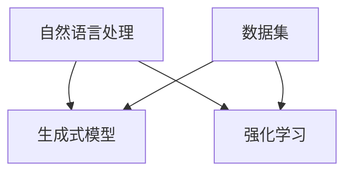

                 

关键词：人工智能，故事创作，算法，创意，碰撞

> 摘要：本文将探讨人工智能在故事创作领域中的应用，通过介绍核心算法原理、数学模型及具体实施步骤，分析人工智能与人类创意的相互作用，从而展望未来故事创作的发展趋势与挑战。

## 1. 背景介绍

随着人工智能技术的迅猛发展，越来越多的领域开始融入AI的元素，其中故事创作领域也不例外。传统的故事创作依赖于人类的创造力、情感和经验，而人工智能则通过算法和大量数据进行分析，模拟出人类的创作过程。这种人工智能与人类创意的碰撞，不仅推动了故事创作方式的变革，也为未来的创作提供了新的可能性。

### 1.1 故事创作的重要性

故事创作是人类文化传承的重要手段之一，它能够传递价值观、表达情感，激发思考。在文学、电影、电视剧、游戏等众多领域，故事创作都是核心元素。然而，随着时代的变迁，人们对于故事的需求也在不断变化，这要求创作者需要具备更高的创造力、更丰富的知识储备和更敏锐的洞察力。

### 1.2 人工智能在故事创作中的应用

人工智能在故事创作中的应用主要体现在以下几个方面：

- **数据分析**：通过分析大量的故事数据，挖掘故事趋势、主题和情感，为创作者提供灵感。

- **自动生成**：利用生成式算法，如GAN（生成对抗网络）、文本生成模型等，自动生成故事内容。

- **协作创作**：人工智能可以作为创作者的助手，协助完成故事构思、情节设计、角色塑造等任务。

- **个性化推荐**：根据用户偏好和历史数据，推荐个性化的故事内容，提升用户体验。

## 2. 核心概念与联系

### 2.1 核心概念

在人工智能故事创作中，以下几个核心概念至关重要：

- **自然语言处理（NLP）**：NLP是使计算机能够理解和处理人类语言的技术，是故事创作的基础。

- **生成式模型**：生成式模型能够生成新的文本、图像、音频等数据，是自动生成故事的核心。

- **强化学习**：通过学习用户的反馈，优化故事内容和质量，实现更好的创作效果。

- **数据集**：丰富的故事数据集是训练生成模型和NLP模型的关键。

### 2.2 架构联系

下面是一个简单的Mermaid流程图，展示了核心概念的关联：



## 3. 核心算法原理 & 具体操作步骤

### 3.1 算法原理概述

人工智能故事创作主要依赖于以下几个核心算法：

- **GPT-3**：一个基于Transformer的预训练语言模型，能够生成连贯、有创意的文本。

- **BERT**：一个基于Transformer的预训练语言模型，主要应用于文本分类和语义分析。

- **GAN**：一种生成式模型，用于生成高质量的故事文本。

- **强化学习**：通过学习用户的反馈，优化故事内容和质量。

### 3.2 算法步骤详解

#### 3.2.1 数据集准备

1. 收集大量的故事数据，包括小说、剧本、故事书等。
2. 对数据进行清洗和预处理，如去除噪声、统一格式等。
3. 划分训练集、验证集和测试集。

#### 3.2.2 模型训练

1. 使用预训练语言模型（如GPT-3或BERT）进行微调，以适应故事创作的需求。
2. 使用生成式模型（如GAN）生成故事文本。
3. 使用强化学习优化故事质量和用户体验。

#### 3.2.3 故事生成

1. 输入一个简单的起始文本或关键词。
2. 通过生成式模型生成一系列扩展文本。
3. 通过强化学习优化文本内容，使其更加符合用户需求。

### 3.3 算法优缺点

- **优点**：

  - 自动化故事生成，提高创作效率。

  - 融合大量数据，使故事内容更加丰富多样。

  - 可以根据用户反馈进行实时优化。

- **缺点**：

  - 创作质量受限于训练数据和模型能力。

  - 缺乏人类的情感和创造力。

  - 可能产生重复或不合理的内容。

### 3.4 算法应用领域

人工智能故事创作可以应用于多个领域：

- **文学创作**：自动生成小说、剧本、诗歌等。

- **影视制作**：自动生成电影、电视剧的剧情和剧本。

- **游戏开发**：自动生成游戏故事和角色背景。

- **教育**：生成个性化的学习材料和故事。

## 4. 数学模型和公式 & 详细讲解 & 举例说明

### 4.1 数学模型构建

在人工智能故事创作中，常用的数学模型包括：

- **Transformer**：一种基于自注意力机制的神经网络模型，用于文本生成。

- **GAN**：一种生成式模型，由生成器和判别器组成，用于生成高质量的故事文本。

- **强化学习**：通过优化策略函数，使故事生成更符合用户需求。

### 4.2 公式推导过程

以Transformer为例，其核心公式为：

$$
\text{Output}_{i} = \text{softmax}\left( \text{W}_\text{O} \cdot \text{Tanh}(\text{W}_\text{H} \cdot \text{Att}(\text{V}, \text{K}, \text{Q})) + \text{W}_\text{O}^{\prime} \cdot \text{H}_\text{t-1} + \text{b}_\text{O} \right)
$$

其中，$\text{V}, \text{K}, \text{Q}$分别为查询、键和值向量，$\text{H}_\text{t-1}$为前一个时间步的隐藏状态，$\text{W}_\text{O}, \text{W}_\text{H}, \text{W}_\text{O}^{\prime}, \text{b}_\text{O}$为权重和偏置。

### 4.3 案例分析与讲解

以生成式模型GAN为例，其训练过程如下：

1. 初始化生成器$G$和判别器$D$。
2. 随机生成一个噪声向量$z$，通过生成器$G$生成故事文本$G(z)$。
3. 将真实故事文本和生成的故事文本输入判别器$D$，计算判别器的损失函数。
4. 更新生成器$G$和判别器$D$的参数，使判别器的损失函数最小。

## 5. 项目实践：代码实例和详细解释说明

### 5.1 开发环境搭建

1. 安装Python环境（版本3.8以上）。
2. 安装TensorFlow和Keras库。
3. 准备训练数据集。

### 5.2 源代码详细实现

```python
# 示例代码：使用GPT-3生成故事文本
import openai

# 设置API密钥
openai.api_key = "your-api-key"

# 生成故事文本
def generate_story(prompt):
    response = openai.Completion.create(
        engine="text-davinci-002",
        prompt=prompt,
        max_tokens=100,
        n=1,
        stop=None,
        temperature=0.5,
    )
    return response.choices[0].text.strip()

# 示例：输入一个简单的起始文本
prompt = "在一个遥远的星球上，有一只聪明的小熊。"
story = generate_story(prompt)
print(story)
```

### 5.3 代码解读与分析

1. 导入openai库，设置API密钥。
2. 定义`generate_story`函数，用于生成故事文本。
3. 使用`openai.Completion.create`方法，传入起始文本和生成参数，生成故事文本。
4. 示例中，输入一个简单的起始文本，调用`generate_story`函数生成故事文本。

### 5.4 运行结果展示

运行示例代码，将输出一个基于起始文本生成的故事：

```
在一个遥远的星球上，有一只聪明的小熊。有一天，它决定离开家去探险。在它的旅途中，它遇到了各种各样的生物，学到了很多有趣的知识。最终，它带着满满的收获回到了家，和家人分享了它的经历。
```

## 6. 实际应用场景

### 6.1 文学创作

人工智能可以帮助作者快速生成小说、剧本等文学作品，提高创作效率。同时，通过不断优化算法和模型，生成的故事质量也可以得到提升。

### 6.2 影视制作

在影视制作过程中，人工智能可以自动生成剧本、剧情和角色背景，为导演和编剧提供参考。这不仅可以节省时间和成本，还可以激发新的创作灵感。

### 6.3 游戏开发

游戏开发者可以利用人工智能生成游戏故事、角色背景和任务情节，为玩家提供丰富的游戏体验。

### 6.4 教育

在教育领域，人工智能可以生成个性化的学习材料和故事，帮助学生更好地理解和掌握知识。

## 7. 工具和资源推荐

### 7.1 学习资源推荐

- 《深度学习》（Goodfellow、Bengio和Courville著）
- 《自然语言处理综合教程》（Daniel Jurafsky和James H. Martin著）
- 《人工智能：一种现代方法》（Stuart Russell和Peter Norvig著）

### 7.2 开发工具推荐

- TensorFlow：一个开源机器学习框架。
- Keras：一个基于TensorFlow的高级神经网络API。
- openai-gym：一个开源环境库，用于强化学习实验。

### 7.3 相关论文推荐

- **BERT: Pre-training of Deep Bidirectional Transformers for Language Understanding**
- **Generative Adversarial Nets**
- **Attention Is All You Need**

## 8. 总结：未来发展趋势与挑战

### 8.1 研究成果总结

近年来，人工智能在故事创作领域取得了显著进展，主要体现在算法的创新和应用的拓展。生成式模型和强化学习算法的应用，使得人工智能能够自动生成高质量的故事文本。

### 8.2 未来发展趋势

- **算法优化**：随着算法的不断优化，人工智能生成的故事质量将得到进一步提升。
- **多模态融合**：将文本、图像、音频等多种模态融合，创造更加丰富的故事体验。
- **个性化推荐**：根据用户偏好和兴趣，推荐个性化的故事内容。

### 8.3 面临的挑战

- **创作质量**：如何提高人工智能生成故事的质量，使其更加接近人类创作水平。
- **版权问题**：如何界定人工智能生成故事的法律地位，以及版权归属问题。
- **伦理道德**：如何确保人工智能在故事创作中不产生不良内容，遵守伦理道德规范。

### 8.4 研究展望

未来，人工智能在故事创作领域的应用将更加广泛，不仅会改变故事创作的模式，还会对文学、影视、游戏等领域产生深远的影响。同时，如何解决面临的挑战，将决定人工智能在故事创作领域的发展前景。

## 9. 附录：常见问题与解答

### 9.1 人工智能故事创作的主要算法有哪些？

主要算法包括GPT-3、BERT、GAN和强化学习等。

### 9.2 人工智能故事创作有哪些应用领域？

人工智能故事创作可以应用于文学创作、影视制作、游戏开发和教育等领域。

### 9.3 如何确保人工智能生成故事的质量？

可以通过不断优化算法、扩大数据集和提高训练时间来确保生成故事的质量。

### 9.4 人工智能故事创作有哪些法律和伦理问题？

主要涉及版权问题、内容审核和伦理道德问题。需要制定相关法律法规和伦理准则来规范人工智能故事创作。

作者：禅与计算机程序设计艺术 / Zen and the Art of Computer Programming
----------------------------------------------------------------

