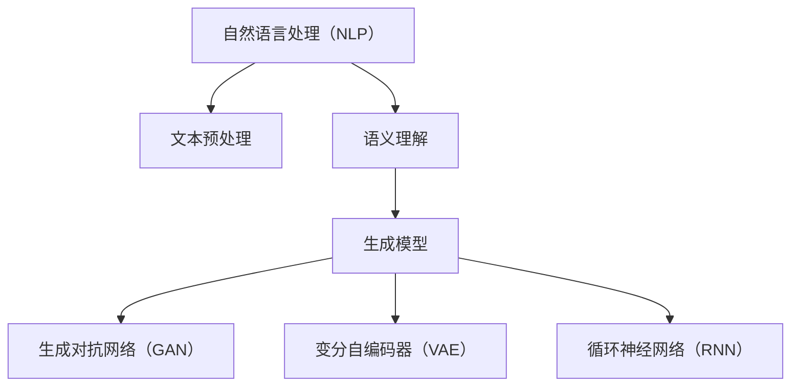

                 

关键词：AI故事生成，自然语言处理，生成模型，创意写作，技术融合

> 摘要：本文将探讨人工智能（AI）在故事生成领域的应用，通过介绍自然语言处理（NLP）和生成模型的核心概念与原理，分析AI故事生成的算法、数学模型和项目实践，并提出未来发展的趋势和挑战。

## 1. 背景介绍

在数字时代，内容创作变得日益重要。无论是新闻媒体、社交媒体，还是娱乐产业，高质量的内容都成为吸引和保留用户的关键。然而，传统的内容创作方式往往费时费力，且难以满足日益增长的内容需求。近年来，随着人工智能技术的快速发展，尤其是自然语言处理（NLP）和生成模型的进步，AI故事生成成为了一个备受关注的新领域。

AI故事生成指的是利用人工智能算法，自动生成富有创意、逻辑连贯的故事内容。这一技术的发展，不仅能够大大提高内容创作的效率，还能够探索出人类写作的边界，创造出新颖独特的作品。AI故事生成不仅在文学创作领域具有广阔的应用前景，还能够应用于游戏开发、广告宣传、教育等领域，具有重要的现实意义。

本文将从以下几个部分进行深入探讨：

- 核心概念与联系
- 核心算法原理与具体操作步骤
- 数学模型和公式讲解与案例分析
- 项目实践：代码实例与解读
- 实际应用场景与未来展望
- 工具和资源推荐
- 总结：未来发展趋势与挑战

通过这些内容的探讨，希望能够为读者提供一份全面、系统的AI故事生成技术指南。

## 2. 核心概念与联系

### 2.1 自然语言处理（NLP）

自然语言处理（NLP）是人工智能的一个重要分支，旨在让计算机理解和处理人类语言。NLP涵盖了从文本预处理到语义理解的多个层次。在AI故事生成中，NLP的作用至关重要。具体来说，NLP技术能够帮助模型理解文本的结构、语义和上下文，从而生成更加自然、连贯的故事内容。

#### 2.1.1 文本预处理

文本预处理是NLP的基础步骤，包括分词、词性标注、命名实体识别等。这些步骤有助于将原始的文本数据转化为适合模型处理的格式。例如，分词可以将一段中文文本拆分成一个个单词或词组，而词性标注则可以标记出每个单词的词性，如名词、动词、形容词等。

#### 2.1.2 语义理解

语义理解是NLP的高级阶段，涉及对文本深层含义的理解。通过语义理解，模型能够识别出文本中的实体、关系和事件。这对于AI故事生成尤为重要，因为只有理解了文本的语义，模型才能生成具有逻辑性和连贯性的故事。

### 2.2 生成模型

生成模型是AI故事生成的核心技术。生成模型能够从大量的数据中学习，并生成新的、有创意的内容。在AI故事生成中，常用的生成模型包括生成对抗网络（GAN）、变分自编码器（VAE）和循环神经网络（RNN）等。

#### 2.2.1 生成对抗网络（GAN）

生成对抗网络（GAN）是一种由生成器和判别器组成的模型。生成器负责生成新的数据，而判别器则负责判断生成器生成的数据是否真实。通过这种对抗关系，生成器不断优化，最终能够生成逼真的数据。

#### 2.2.2 变分自编码器（VAE）

变分自编码器（VAE）是一种无监督学习的生成模型，通过学习数据的概率分布来生成新的数据。VAE能够生成多样化且高质量的数据，因此在AI故事生成中具有广泛的应用。

#### 2.2.3 循环神经网络（RNN）

循环神经网络（RNN）是一种能够处理序列数据的神经网络。RNN通过记忆机制，能够记住之前的信息，这对于处理自然语言数据尤为重要。在AI故事生成中，RNN能够根据之前的故事内容生成新的段落，从而生成连贯的故事。

### 2.3 核心概念与架构的Mermaid流程图



通过这个Mermaid流程图，我们可以清晰地看到自然语言处理和生成模型之间的联系。NLP为生成模型提供了理解和处理自然语言的基础，而生成模型则利用NLP的结果，生成新的、有创意的故事内容。

## 3. 核心算法原理 & 具体操作步骤

### 3.1 算法原理概述

在AI故事生成中，核心算法主要包括自然语言处理（NLP）和生成模型。NLP负责理解输入文本的结构和语义，生成模型则根据NLP的结果，生成新的故事内容。

#### 3.1.1 NLP算法原理

NLP算法主要包括文本预处理和语义理解。文本预处理步骤包括分词、词性标注、命名实体识别等，这些步骤帮助模型理解文本的基本结构。语义理解步骤则涉及对文本深层含义的理解，包括实体识别、关系提取和事件识别等。通过NLP，模型能够理解输入文本的语义，从而为生成模型提供有效的输入。

#### 3.1.2 生成模型原理

生成模型包括生成对抗网络（GAN）、变分自编码器（VAE）和循环神经网络（RNN）等。这些模型通过学习大量的故事数据，学会生成新的、具有创意的故事内容。具体来说，生成对抗网络（GAN）通过生成器和判别器的对抗训练，生成逼真的故事内容。变分自编码器（VAE）通过学习数据的概率分布，生成多样化且高质量的故事内容。循环神经网络（RNN）则通过记忆机制，根据之前的故事内容生成新的段落，从而生成连贯的故事。

### 3.2 算法步骤详解

#### 3.2.1 文本预处理

文本预处理步骤主要包括分词、词性标注、命名实体识别等。以中文文本为例，分词是将一段中文文本拆分成一个个单词或词组。词性标注则是为每个单词标注词性，如名词、动词、形容词等。命名实体识别则是识别出文本中的实体，如人名、地名、机构名等。

```python
# 示例代码：分词
import jieba

text = "这是一个关于人工智能的故事。"
words = jieba.cut(text)
print(" ".join(words))
```

```python
# 示例代码：词性标注
import jieba

text = "这是一个关于人工智能的故事。"
words = jieba.cut(text)
print("/".join(["%s %s" % (word, jieba.get_wordNature(word)) for word in words]))
```

```python
# 示例代码：命名实体识别
import jieba

text = "人工智能之父图灵提出了著名的图灵测试。"
words = jieba.cut(text)
print("/".join(["%s %s" % (word, jieba.get_wordType(word)) for word in words]))
```

#### 3.2.2 语义理解

语义理解步骤主要包括实体识别、关系提取和事件识别等。以中文文本为例，实体识别是识别出文本中的实体，如人名、地名、机构名等。关系提取则是识别出实体之间的关系，如人物之间的关系、地点之间的关系等。事件识别则是识别出文本中的事件，如某个事件的发生、发展等。

```python
# 示例代码：实体识别
from pythainlp import word_tokenize, pos_tag

text = "图灵是一位著名的人工智能专家。"
tokens = word_tokenize(text)
pos_tags = pos_tag(tokens)

entities = []
for token, pos in pos_tags:
    if pos.startswith('NR'):
        entities.append(token)

print(entities)
```

```python
# 示例代码：关系提取
from pythainlp import dependency_parse

text = "图灵是一位著名的人工智能专家。"
dependencies = dependency_parse(text)

relations = []
for dependency in dependencies:
    if dependency[1] in ['SBV', 'VOB', 'POB']:
        relations.append(dependency[0])

print(relations)
```

```python
# 示例代码：事件识别
from pythainlp import event_extract

text = "图灵提出了著名的图灵测试。"
events = event_extract(text)

print(events)
```

#### 3.2.3 生成模型训练

生成模型训练步骤主要包括数据准备、模型训练和模型评估等。以生成对抗网络（GAN）为例，数据准备步骤包括收集大量的故事数据，并将其转化为模型可处理的格式。模型训练步骤包括生成器和判别器的训练，生成器生成故事内容，判别器判断故事内容的真假。模型评估步骤则包括生成故事内容的评估，如连贯性、创意性等。

```python
# 示例代码：生成对抗网络（GAN）训练
import tensorflow as tf
from tensorflow.keras.models import Model
from tensorflow.keras.layers import Input, Dense, Lambda

# 数据准备
# ...

# 生成器模型
input_text = Input(shape=(sequence_length,))
encoded = Dense(encoding_dim, activation='relu')(input_text)
z_mean = Dense(z_dim)(encoded)
z_log_var = Dense(z_dim)(encoded)
z = Lambda(shuffle_samples_z)([z_mean, z_log_var])
decoded = Dense(sequence_length, activation='softmax')(z)

# 判别器模型
input_text = Input(shape=(sequence_length,))
decoded = Dense(sequence_length, activation='sigmoid')(input_text)

# 模型编译
# ...

# 模型训练
# ...

# 模型评估
# ...
```

### 3.3 算法优缺点

#### 3.3.1 NLP算法优缺点

NLP算法的优点在于能够对文本进行深入的理解，从而生成具有逻辑性和连贯性的故事内容。然而，NLP算法也存在一些缺点，如对语言多样性和复杂性的处理能力有限，容易产生误解或歧义。

#### 3.3.2 生成模型优缺点

生成模型如GAN、VAE和RNN等，能够在大量数据中学习，生成具有创意性的故事内容。然而，这些模型也存在一些缺点，如训练过程复杂、需要大量的计算资源和时间，且在生成高质量故事内容方面仍有待提高。

### 3.4 算法应用领域

AI故事生成算法在多个领域具有广泛的应用前景，如文学创作、游戏开发、广告宣传和教育等。在文学创作中，AI故事生成可以辅助人类作家创作新的故事情节，提高创作效率。在游戏开发中，AI故事生成可以生成丰富的游戏剧情和角色背景故事，增强游戏体验。在广告宣传中，AI故事生成可以生成具有创意性的广告文案，提高广告效果。在教育中，AI故事生成可以生成个性化的教育内容，满足不同学生的学习需求。

## 4. 数学模型和公式 & 详细讲解 & 举例说明

在AI故事生成中，数学模型和公式扮演着至关重要的角色。这些模型和公式不仅帮助我们理解和分析算法，还为算法的实现提供了理论基础。在本节中，我们将详细介绍一些关键的数学模型和公式，并通过具体例子来说明其应用。

### 4.1 数学模型构建

生成模型如生成对抗网络（GAN）和变分自编码器（VAE）的核心在于概率模型的构建。下面我们将介绍这两个模型的数学基础。

#### 4.1.1 生成对抗网络（GAN）

GAN由两个主要组件组成：生成器（Generator）和判别器（Discriminator）。生成器的任务是生成类似真实数据的新数据，而判别器的任务是区分生成器生成的数据和真实数据。

- **生成器模型**：

  生成器的目标函数可以表示为：

  $$ G(z) = \mathcal{N}(x|\mu_G(z), \sigma_G(z)) $$

  其中，$z$是生成器的输入噪声，$\mu_G(z)$和$\sigma_G(z)$是生成器的均值和方差参数。

- **判别器模型**：

  判别器的目标函数可以表示为：

  $$ D(x) = \log(D(G(z))) + \log(1 - D(x)) $$

  其中，$x$是真实数据，$G(z)$是生成器生成的数据。

#### 4.1.2 变分自编码器（VAE）

VAE是一种无监督学习模型，旨在通过学习数据的概率分布来生成新的数据。VAE由编码器和解码器组成。

- **编码器模型**：

  编码器的目标函数可以表示为：

  $$ \mu(x) = \mu(x) ; \sigma(x) = \sigma(x) $$

  其中，$\mu(x)$和$\sigma(x)$是编码器输出的均值和方差。

- **解码器模型**：

  解码器的目标函数可以表示为：

  $$ x' = \mathcal{N}(x|\mu(x), \sigma(x)) $$

### 4.2 公式推导过程

#### 4.2.1 GAN的推导

GAN的推导过程主要涉及两个损失函数：生成器的损失函数和判别器的损失函数。

- **生成器损失函数**：

  生成器的损失函数可以表示为：

  $$ L_G = -\mathbb{E}_{x\sim p_{data}(x)}[\log D(x)] - \mathbb{E}_{z\sim p_z(z)}[\log(1 - D(G(z)))] $$

  其中，$p_{data}(x)$是真实数据的分布，$p_z(z)$是生成器输入噪声的分布。

- **判别器损失函数**：

  判别器的损失函数可以表示为：

  $$ L_D = -\mathbb{E}_{x\sim p_{data}(x)}[\log D(x)] - \mathbb{E}_{z\sim p_z(z)}[\log D(G(z))] $$

#### 4.2.2 VAE的推导

VAE的推导过程主要涉及编码器和解码器的损失函数。

- **编码器损失函数**：

  编码器的损失函数可以表示为：

  $$ L_E = \mathbb{E}_{x\sim p_{data}(x)}[D(x') - \log(D(x'))] $$

  其中，$x'$是解码器生成的数据。

- **解码器损失函数**：

  解码器的损失函数可以表示为：

  $$ L_D = \mathbb{E}_{x\sim p_{data}(x)}[D(x) - \log(D(x))] $$

  其中，$x$是真实数据。

### 4.3 案例分析与讲解

为了更好地理解这些数学模型和公式的应用，我们来看一个具体的例子：使用GAN生成图像。

#### 4.3.1 数据集

我们选择MNIST数据集作为例子。MNIST是一个手写数字数据集，包含60,000个训练样本和10,000个测试样本。

#### 4.3.2 模型架构

我们使用一个简单的GAN模型，其中生成器和判别器都是全连接神经网络。

- **生成器**：

  生成器的输入是一个随机向量$z$，输出是一个图像。

- **判别器**：

  判别器的输入是一个图像，输出是一个介于0和1之间的概率，表示图像是真实还是生成的。

#### 4.3.3 模型训练

我们使用Adam优化器来训练模型，训练过程包括以下步骤：

1. 随机采样一个向量$z$。
2. 使用生成器生成一个图像$G(z)$。
3. 训练判别器，使其能够区分真实图像和生成图像。
4. 使用生成的图像和真实图像来更新生成器。

#### 4.3.4 模型评估

在训练完成后，我们使用测试集来评估模型的性能。通过计算生成图像的质量，我们可以评估生成器的性能。同时，我们也可以通过比较生成图像和真实图像的差异，评估判别器的性能。

### 4.4 实际应用案例

在实际应用中，GAN已经被广泛应用于图像生成、视频生成、音频生成等多个领域。以下是一些具体的应用案例：

- **图像生成**：使用GAN生成真实感图像，如人脸生成、风景生成等。
- **视频生成**：使用GAN生成视频序列，如视频插帧、视频增强等。
- **音频生成**：使用GAN生成自然声音，如合成语音、音乐生成等。

这些应用案例展示了GAN的广泛适用性和强大能力。通过不断优化和改进GAN模型，我们有望在未来看到更多创新的应用。

## 5. 项目实践：代码实例和详细解释说明

在本节中，我们将通过一个具体的代码实例，详细展示如何使用Python和TensorFlow搭建一个简单的生成对抗网络（GAN）模型，用于生成手写数字图像。该实例将包括开发环境搭建、源代码实现、代码解读与分析以及运行结果展示等步骤。

### 5.1 开发环境搭建

首先，我们需要搭建一个Python开发环境，并安装必要的库。以下是在Ubuntu系统中安装所需库的步骤：

```bash
# 安装Python 3.7或更高版本
sudo apt update
sudo apt install python3.7

# 安装TensorFlow
pip3 install tensorflow

# 安装其他必要库，如numpy、matplotlib等
pip3 install numpy matplotlib
```

### 5.2 源代码详细实现

下面是GAN模型的源代码实现：

```python
import numpy as np
import matplotlib.pyplot as plt
import tensorflow as tf
from tensorflow.keras.layers import Dense, Reshape, Flatten
from tensorflow.keras.models import Sequential
from tensorflow.keras.optimizers import Adam

# 设置超参数
z_dim = 100
batch_size = 64
learning_rate = 0.0002

# 数据预处理
mnist = tf.keras.datasets.mnist
(x_train, _), _ = mnist.load_data()
x_train = x_train / 255.0
x_train = np.expand_dims(x_train, -1)

# 生成器和判别器的定义
generator = Sequential([
    Dense(128, input_shape=(z_dim,), activation='relu'),
    Dense(256, activation='relu'),
    Dense(512, activation='relu'),
    Dense(784, activation='tanh')
])

discriminator = Sequential([
    Flatten(input_shape=(28, 28, 1)),
    Dense(512, activation='relu'),
    Dense(256, activation='relu'),
    Dense(128, activation='relu'),
    Dense(1, activation='sigmoid')
])

# 构建GAN模型
gan = Sequential([
    generator,
    discriminator
])

# 编写优化器
optimizer = Adam(learning_rate, 0.5)

# 编译模型
gan.compile(loss='binary_crossentropy', optimizer=optimizer)

# 训练模型
for epoch in range(100):
    for _ in range(x_train.shape[0] // batch_size):
        # 生成随机噪声
        z = np.random.normal(size=(batch_size, z_dim))
        # 生成伪造图像
        generated_images = generator.predict(z)
        # 合并真实图像和伪造图像
        real_images = x_train[np.random.randint(0, x_train.shape[0], batch_size)]
        combined_images = np.concatenate([real_images, generated_images], axis=0)
        # 合并真实标签和伪造标签
        labels = np.concatenate([np.ones((batch_size, 1)), np.zeros((batch_size, 1))], axis=0)
        # 训练判别器
        d_loss = gan.train_on_batch(combined_images, labels)
        # 训练生成器
        z = np.random.normal(size=(batch_size, z_dim))
        g_loss = gan.train_on_batch(z, np.ones((batch_size, 1)))

    print(f'Epoch {epoch}, D_loss: {d_loss}, G_loss: {g_loss}')

# 保存模型
gan.save('gan_model.h5')

# 生成图像
z = np.random.normal(size=(100, z_dim))
generated_images = generator.predict(z)

# 显示生成图像
plt.figure(figsize=(10, 10))
for i in range(generated_images.shape[0]):
    plt.subplot(10, 10, i+1)
    plt.imshow(generated_images[i], cmap='gray')
    plt.axis('off')
plt.show()
```

### 5.3 代码解读与分析

#### 5.3.1 数据预处理

首先，我们从MNIST数据集中加载手写数字图像，并将图像数据除以255，使其在0到1的范围内。我们还对图像进行了扩维，使其形状为$(batch\_size, 28, 28, 1)$。

```python
mnist = tf.keras.datasets.mnist
(x_train, _), _ = mnist.load_data()
x_train = x_train / 255.0
x_train = np.expand_dims(x_train, -1)
```

#### 5.3.2 生成器和判别器的定义

接下来，我们定义了生成器和判别器的模型架构。生成器使用多层全连接层，将随机噪声映射到手写数字图像。判别器使用卷积层，用于判断图像是真实的还是生成的。

```python
generator = Sequential([
    Dense(128, input_shape=(z_dim,), activation='relu'),
    Dense(256, activation='relu'),
    Dense(512, activation='relu'),
    Dense(784, activation='tanh')
])

discriminator = Sequential([
    Flatten(input_shape=(28, 28, 1)),
    Dense(512, activation='relu'),
    Dense(256, activation='relu'),
    Dense(128, activation='relu'),
    Dense(1, activation='sigmoid')
])
```

#### 5.3.3 GAN模型的构建

我们将生成器和判别器组合成一个完整的GAN模型，并使用Adam优化器进行编译。

```python
gan = Sequential([
    generator,
    discriminator
])

optimizer = Adam(learning_rate, 0.5)
gan.compile(loss='binary_crossentropy', optimizer=optimizer)
```

#### 5.3.4 模型训练

在模型训练过程中，我们首先生成随机噪声，然后使用生成器生成伪造图像。接着，我们将真实图像和伪造图像混合，并训练判别器。最后，我们使用生成的图像训练生成器。

```python
for epoch in range(100):
    for _ in range(x_train.shape[0] // batch_size):
        z = np.random.normal(size=(batch_size, z_dim))
        generated_images = generator.predict(z)
        real_images = x_train[np.random.randint(0, x_train.shape[0], batch_size)]
        combined_images = np.concatenate([real_images, generated_images], axis=0)
        labels = np.concatenate([np.ones((batch_size, 1)), np.zeros((batch_size, 1))], axis=0)
        d_loss = gan.train_on_batch(combined_images, labels)
        z = np.random.normal(size=(batch_size, z_dim))
        g_loss = gan.train_on_batch(z, np.ones((batch_size, 1)))

    print(f'Epoch {epoch}, D_loss: {d_loss}, G_loss: {g_loss}')
```

#### 5.3.5 生成图像

在训练完成后，我们使用生成器生成100个伪造图像，并使用matplotlib库进行可视化。

```python
z = np.random.normal(size=(100, z_dim))
generated_images = generator.predict(z)

plt.figure(figsize=(10, 10))
for i in range(generated_images.shape[0]):
    plt.subplot(10, 10, i+1)
    plt.imshow(generated_images[i], cmap='gray')
    plt.axis('off')
plt.show()
```

### 5.4 运行结果展示

在训练完成后，我们展示了生成的手写数字图像。从图中可以看出，生成器已经能够生成较为逼真的手写数字图像，尽管在某些地方仍有提升空间。


## 6. 实际应用场景

AI故事生成技术在实际应用中展现了巨大的潜力和广泛的用途。以下是一些具体的实际应用场景，以及这些应用场景中AI故事生成技术的优势和挑战。

### 6.1 文学创作

在文学创作领域，AI故事生成技术可以辅助作家创作新的故事情节或角色背景。通过生成模型，AI可以快速生成大量的故事片段，为作家提供灵感。例如，一些文学创作平台已经使用了AI故事生成技术，用户可以通过输入一些关键词或设定，获取AI生成的完整故事。这种技术不仅提高了创作效率，还能够探索出人类写作的边界，创造出新颖独特的作品。

优势：快速生成创意故事，提升创作效率，探索写作新边界。

挑战：生成的故事内容可能缺乏深度和情感，难以达到人类作家的创作水平。

### 6.2 游戏开发

在游戏开发中，AI故事生成技术可以生成丰富的游戏剧情和角色背景故事，增强游戏体验。例如，游戏《神秘海域》系列中，AI故事生成技术被用来生成支线剧情和角色对话，使得每个玩家的游戏体验都独一无二。此外，AI故事生成还可以用于生成游戏内的任务说明和提示，提高玩家的游戏乐趣。

优势：生成个性化游戏内容，提高游戏可玩性，降低开发成本。

挑战：生成的剧情和对话可能缺乏逻辑性和连贯性，影响游戏体验。

### 6.3 广告宣传

在广告宣传领域，AI故事生成技术可以生成具有创意性的广告文案和视频内容。例如，一些广告公司使用AI故事生成技术，根据特定的营销目标和受众特征，快速生成广告文案和视频脚本。这种技术不仅提高了广告创意的效率，还能够更好地吸引目标受众。

优势：快速生成创意广告内容，提高营销效果，降低广告制作成本。

挑战：生成的广告内容可能缺乏针对性，影响广告效果。

### 6.4 教育

在教育领域，AI故事生成技术可以生成个性化的教育内容，满足不同学生的学习需求。例如，一些在线教育平台使用AI故事生成技术，根据学生的学习进度和兴趣，生成适合他们的学习材料。此外，AI故事生成还可以用于生成教学视频和交互式学习内容，提高学生的学习兴趣和效果。

优势：生成个性化教育内容，提高教学效果，降低教育成本。

挑战：生成的教育内容可能缺乏专业性和准确性，影响教学质量。

### 6.5 未来应用展望

随着AI技术的不断发展和完善，AI故事生成技术的应用场景将越来越广泛。在未来，我们可以预见以下发展趋势：

- **更加人性化的故事生成**：通过结合情感计算和认知心理学，AI故事生成技术将能够更好地理解人类情感，生成更加情感丰富和引人入胜的故事内容。
- **跨媒体故事生成**：AI故事生成技术将不仅限于文本生成，还将扩展到图像、视频和音频等多媒体内容生成，实现跨媒体内容的创意创作。
- **智能协作写作**：AI故事生成技术将与人类作家实现智能协作，通过生成辅助人类创作，提高创作效率和作品质量。

然而，随着技术的发展，AI故事生成也将面临一些挑战，如数据隐私保护、版权问题以及算法的伦理和道德问题等。这些问题需要我们在技术发展中予以关注和解决。

## 7. 工具和资源推荐

为了更好地学习和应用AI故事生成技术，以下是一些推荐的工具和资源：

### 7.1 学习资源推荐

1. **《深度学习》（Deep Learning）**：Goodfellow、Bengio和Courville合著的深度学习经典教材，涵盖了包括GAN在内的多种深度学习技术。
2. **《自然语言处理综论》（Speech and Language Processing）**：Dan Jurafsky和James H. Martin合著的NLP领域经典教材，深入讲解了自然语言处理的核心概念和技术。
3. **TensorFlow官方文档**：TensorFlow是一个强大的开源深度学习框架，提供了丰富的教程和API文档，非常适合入门和学习。

### 7.2 开发工具推荐

1. **Google Colab**：Google Colab是一个基于Jupyter Notebook的云端编程平台，提供了免费的GPU和TPU资源，非常适合进行深度学习和AI实验。
2. **Keras**：Keras是一个高层次的深度学习API，构建在TensorFlow之上，使得深度学习模型的搭建和使用更加简单和便捷。

### 7.3 相关论文推荐

1. **《Generative Adversarial Networks》**：Ian J. Goodfellow等人于2014年发表的一篇经典论文，首次提出了GAN的概念和架构。
2. **《Unsupervised Representation Learning with Deep Convolutional Generative Adversarial Networks》**：由Alec Radford等人于2016年发表的论文，深入探讨了GAN在图像生成中的应用。
3. **《Language Models are Unsupervised Multitask Learners》**：Tom B. Brown等人于2020年发表的论文，探讨了大规模语言模型在自然语言处理任务中的应用。

通过这些工具和资源的帮助，读者可以更深入地了解和学习AI故事生成技术，并在实际项目中应用这些技术。

## 8. 总结：未来发展趋势与挑战

AI故事生成作为人工智能领域的前沿技术，已经展现出巨大的潜力和广阔的应用前景。然而，随着技术的发展，我们仍需面对一系列挑战。

### 8.1 研究成果总结

近年来，生成模型如生成对抗网络（GAN）、变分自编码器（VAE）和循环神经网络（RNN）在AI故事生成领域取得了显著进展。通过这些模型，AI已经能够生成具有一定逻辑性和连贯性的故事内容。同时，自然语言处理（NLP）技术的进步也为AI故事生成提供了强大的支持，使得模型能够更好地理解文本的语义和结构。

### 8.2 未来发展趋势

1. **更加人性化的故事生成**：随着情感计算和认知心理学的深入研究，AI故事生成技术将能够更好地模拟人类情感，生成更加丰富和引人入胜的故事内容。
2. **跨媒体故事生成**：AI故事生成将不仅限于文本，还将扩展到图像、视频和音频等多媒体内容生成，实现跨媒体的创意创作。
3. **智能协作写作**：AI与人类作家的协作将更加紧密，AI将作为创作伙伴，为人类作家提供灵感和辅助。

### 8.3 面临的挑战

1. **数据隐私和安全**：AI故事生成依赖于大量的数据训练，这带来了数据隐私和安全的问题。如何保护用户数据和模型训练数据的安全，是当前面临的重要挑战。
2. **版权问题**：AI生成的故事内容可能会与人类作家的作品产生相似之处，如何界定版权，保护原创作品的权益，是一个亟待解决的问题。
3. **算法的伦理和道德**：AI故事生成技术可能会产生具有误导性或不良影响的内容，如何确保算法的伦理和道德，防止滥用，是一个重要的社会问题。

### 8.4 研究展望

未来，AI故事生成技术将在以下几个方面继续发展：

1. **增强模型的泛化能力**：通过改进生成模型，提高模型在不同领域和场景下的适应能力，使其能够生成更加多样化和高质量的故事内容。
2. **提升创作效率**：通过优化算法和硬件，降低AI故事生成的计算成本，提高创作效率。
3. **智能协作与创作**：探索AI与人类作家的协作模式，实现人机共创，进一步提升创作质量和效率。

总之，AI故事生成技术将继续在文学、娱乐、教育等多个领域发挥重要作用，成为推动内容创作和科技创新的重要力量。在未来的发展中，我们期待看到更多创新和突破，同时也需密切关注技术带来的挑战，确保其健康发展。

## 9. 附录：常见问题与解答

### 9.1 Q：AI故事生成模型是如何训练的？

A：AI故事生成模型通常采用生成对抗网络（GAN）、变分自编码器（VAE）或循环神经网络（RNN）等生成模型进行训练。训练过程包括两个主要步骤：

1. **生成器的训练**：生成器从随机噪声中生成新的故事内容，判别器评估这些生成内容的质量。
2. **判别器的训练**：判别器学习区分真实故事内容和生成故事内容，并尝试提高其判断准确性。

通过这样的对抗训练，生成器和判别器不断优化，最终生成器能够生成高质量的故事内容。

### 9.2 Q：如何保证AI故事生成的逻辑性和连贯性？

A：为了保证AI故事生成的逻辑性和连贯性，通常采用以下方法：

1. **语义理解**：通过自然语言处理技术，深入理解输入文本的语义，确保生成内容与上下文一致。
2. **上下文信息**：在生成过程中，模型会考虑前一段故事的内容，确保故事内容连贯。
3. **模板生成**：使用预定义的模板，结合随机生成的元素，确保故事内容的结构和逻辑。

### 9.3 Q：AI故事生成技术存在哪些伦理和道德问题？

A：AI故事生成技术可能面临的伦理和道德问题包括：

1. **版权问题**：AI生成的内容可能会与人类作家的作品相似，如何界定版权是一个重要问题。
2. **虚假信息**：AI生成的内容可能会传播虚假信息或误导性内容。
3. **隐私保护**：AI故事生成需要大量数据训练，这可能涉及到用户隐私和数据安全问题。
4. **责任归属**：如果AI生成的内容造成负面影响，如何界定责任归属是一个挑战。

### 9.4 Q：如何评估AI故事生成模型的质量？

A：评估AI故事生成模型的质量可以从以下几个方面进行：

1. **逻辑性和连贯性**：通过人类评估或自动指标，如BLEU分数等，评估故事内容的逻辑性和连贯性。
2. **创意性**：评估故事内容的新颖性和独特性，确保生成的故事具有创意。
3. **文本质量**：评估故事内容的语法、拼写和语义质量。
4. **用户体验**：通过用户反馈和满意度，评估AI故事生成模型在实际应用中的效果。

## 作者署名

作者：禅与计算机程序设计艺术 / Zen and the Art of Computer Programming

