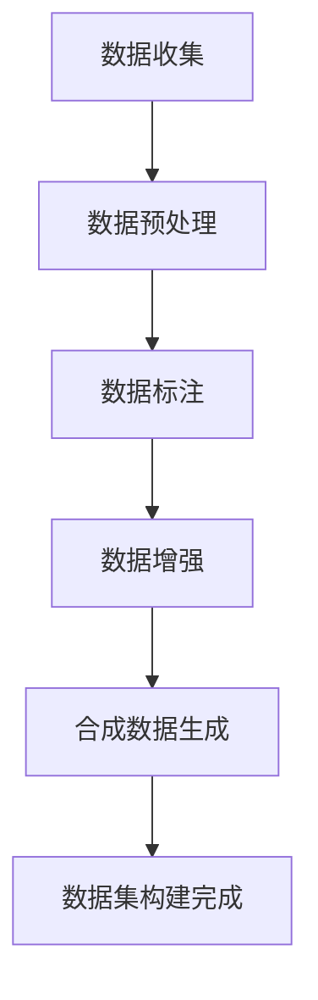

                 

关键词：人工智能，数据集构建，数据收集，合成数据，数据增强，深度学习，数据预处理，计算机视觉，机器学习

> 摘要：本文将深入探讨AI数据集构建的过程，从数据收集、处理到合成数据生成的方法。通过阐述核心概念、算法原理、数学模型以及实际项目实践，文章旨在为读者提供一个全面的指导，帮助他们在机器学习和深度学习项目中有效地构建高质量的数据集。

## 1. 背景介绍

随着人工智能技术的飞速发展，机器学习和深度学习成为众多领域研究和应用的关键技术。数据集的质量和规模在很大程度上决定了模型的性能和准确性。然而，构建一个高质量的数据集并不容易，这需要耗费大量的时间和资源。传统的数据集构建方法主要包括数据收集、标注和清洗等步骤。然而，这种方法存在效率低下、成本高昂的问题。因此，合成数据生成作为一种新兴的方法，逐渐受到关注。

合成数据生成可以弥补数据收集的不足，特别是在某些特定场景下，如医疗影像、自动驾驶等，真实数据难以获取或受到隐私保护的限制。通过合成数据生成，我们可以模拟出与真实数据高度相似的数据集，从而提升模型训练的效果。

## 2. 核心概念与联系

### 2.1 数据集构建的核心概念

数据集构建涉及多个核心概念，包括数据收集、数据清洗、数据标注和数据增强等。

- **数据收集**：收集与任务相关的数据，如图像、文本、音频等。
- **数据清洗**：去除数据集中的噪声和异常值，提高数据质量。
- **数据标注**：对数据进行标记，如分类、标注边界框等。
- **数据增强**：通过变换、裁剪、旋转等方式增加数据多样性。

### 2.2 数据集构建的架构

数据集构建的架构可以概括为以下几个步骤：

1. **数据收集**：通过爬虫、API接口、数据库等方式获取原始数据。
2. **数据预处理**：对数据进行清洗、归一化、标准化等预处理操作。
3. **数据标注**：使用人工或自动化工具对数据进行标注。
4. **数据增强**：对数据进行变换，增加数据多样性。
5. **合成数据生成**：使用生成模型生成与真实数据相似的新数据。

### 2.3 数据集构建的 Mermaid 流程图



## 3. 核心算法原理 & 具体操作步骤

### 3.1 算法原理概述

数据集构建的核心算法主要包括数据收集、数据预处理、数据标注和数据增强。合成数据生成算法主要包括生成对抗网络（GAN）和变分自编码器（VAE）。

- **数据收集**：主要使用爬虫、API接口、数据库等方式获取原始数据。
- **数据预处理**：使用数据清洗、归一化、标准化等方法对数据进行预处理。
- **数据标注**：使用人工或自动化工具对数据进行标注。
- **数据增强**：使用变换、裁剪、旋转等方法增加数据多样性。
- **合成数据生成**：
  - **GAN**：通过生成器和判别器的对抗训练生成与真实数据相似的新数据。
  - **VAE**：通过编码器和解码器生成与输入数据分布相似的新数据。

### 3.2 算法步骤详解

#### 3.2.1 数据收集

1. **确定数据来源**：根据任务需求确定数据来源，如公开数据集、API接口、爬虫等。
2. **获取原始数据**：使用相应的工具和方法获取原始数据。

#### 3.2.2 数据预处理

1. **数据清洗**：去除数据中的噪声和异常值。
2. **数据归一化**：将数据缩放到一个特定的范围，如[0, 1]或[-1, 1]。
3. **数据标准化**：将数据按照标准差和平均值进行标准化处理。

#### 3.2.3 数据标注

1. **人工标注**：使用人工工具对数据进行标注。
2. **自动化标注**：使用自动化工具或算法对数据进行标注。

#### 3.2.4 数据增强

1. **变换**：对数据进行旋转、缩放、翻转等变换。
2. **裁剪**：对数据进行随机裁剪。
3. **噪声**：对数据进行添加噪声处理。

#### 3.2.5 合成数据生成

1. **GAN**：
   - **生成器**：生成与真实数据相似的新数据。
   - **判别器**：判断输入数据是真实数据还是生成数据。
   - **对抗训练**：生成器和判别器通过对抗训练提高生成效果。

2. **VAE**：
   - **编码器**：将输入数据编码为潜在空间中的点。
   - **解码器**：将潜在空间中的点解码为生成数据。

### 3.3 算法优缺点

- **GAN**：
  - **优点**：能够生成高质量的数据，具有很好的泛化能力。
  - **缺点**：训练不稳定，容易过拟合。

- **VAE**：
  - **优点**：训练稳定，能够生成潜在空间中的新数据。
  - **缺点**：生成的数据质量相对较低。

### 3.4 算法应用领域

- **GAN**：广泛应用于图像生成、语音合成、视频生成等领域。
- **VAE**：广泛应用于图像去噪、图像修复、图像超分辨率等领域。

## 4. 数学模型和公式 & 详细讲解 & 举例说明

### 4.1 数学模型构建

合成数据生成的主要数学模型包括生成对抗网络（GAN）和变分自编码器（VAE）。

#### 4.1.1 GAN

GAN由两部分组成：生成器（Generator）和判别器（Discriminator）。

- **生成器**：$$ G(z) = x$$，将随机噪声向量$$ z$$映射为生成的数据$$ x$$。
- **判别器**：$$ D(x) $$，判断输入数据是真实数据$$ x$$还是生成数据$$ G(z)$$。

GAN的目标是最大化判别器的输出，使得判别器无法区分真实数据和生成数据。

$$ \min_G \max_D V(D, G) = E_{x \sim p_{data}(x)} [D(x)] + E_{z \sim p_{z}(z)} [D(G(z))] $$

#### 4.1.2 VAE

VAE由两部分组成：编码器（Encoder）和解码器（Decoder）。

- **编码器**：$$ \mu(x), \sigma(x) = q(z|x) $$，将输入数据$$ x$$编码为潜在空间中的点$$ z$$。
- **解码器**：$$ G(z) = x$$，将潜在空间中的点$$ z$$解码为生成数据$$ x$$。

VAE的目标是最小化重建误差和潜在空间中的Kullback-Leibler散度。

$$ \min_{\theta} D_{KL}(q(z|x)||p(z)) + \sum_{x} D_{KL}(\mu(x), \sigma(x)) $$

### 4.2 公式推导过程

#### 4.2.1 GAN

GAN的推导过程如下：

1. **损失函数**：

$$ V(D, G) = E_{x \sim p_{data}(x)} [D(x)] + E_{z \sim p_{z}(z)} [D(G(z))] $$

2. **梯度上升**：

$$ \frac{\partial V(D, G)}{\partial G} = E_{z \sim p_{z}(z)} [-D(G(z))] - E_{x \sim p_{data}(x)} [D(x)] $$

3. **梯度下降**：

$$ \frac{\partial V(D, G)}{\partial D} = E_{x \sim p_{data}(x)} [D(x)] - E_{z \sim p_{z}(z)} [D(G(z))] $$

#### 4.2.2 VAE

VAE的推导过程如下：

1. **损失函数**：

$$ \min_{\theta} D_{KL}(q(z|x)||p(z)) + \sum_{x} D_{KL}(\mu(x), \sigma(x)) $$

2. **梯度上升**：

$$ \frac{\partial}{\partial \theta} D_{KL}(q(z|x)||p(z)) + \sum_{x} \frac{\partial}{\partial \theta} D_{KL}(\mu(x), \sigma(x)) $$

3. **梯度下降**：

$$ \frac{\partial}{\partial \theta} D_{KL}(q(z|x)||p(z)) = \nabla_{\theta} \sum_{x} \nabla_{\mu(x), \sigma(x)} D_{KL}(\mu(x), \sigma(x)) $$

### 4.3 案例分析与讲解

#### 4.3.1 GAN在图像生成中的应用

假设我们使用GAN生成手写数字图像，生成器和判别器的结构如下：

- **生成器**：一个全连接神经网络，输入为随机噪声向量，输出为生成的手写数字图像。
- **判别器**：一个卷积神经网络，输入为手写数字图像，输出为图像的真实概率。

在训练过程中，我们通过以下步骤进行：

1. **生成器训练**：固定判别器，训练生成器，使其生成与真实图像相似的手写数字图像。
2. **判别器训练**：固定生成器，训练判别器，使其能够准确区分真实图像和生成图像。
3. **交替训练**：不断交替训练生成器和判别器，直至模型收敛。

#### 4.3.2 VAE在图像去噪中的应用

假设我们使用VAE去除手写数字图像中的噪声，编码器和解码器的结构如下：

- **编码器**：一个卷积神经网络，输入为手写数字图像，输出为潜在空间中的点。
- **解码器**：一个卷积神经网络，输入为潜在空间中的点，输出为去除噪声的手写数字图像。

在训练过程中，我们通过以下步骤进行：

1. **编码器训练**：训练编码器，使其能够将手写数字图像编码为潜在空间中的点。
2. **解码器训练**：训练解码器，使其能够从潜在空间中的点解码出去除噪声的手写数字图像。
3. **损失函数优化**：通过最小化重建误差和潜在空间中的KL散度优化模型。

## 5. 项目实践：代码实例和详细解释说明

### 5.1 开发环境搭建

在进行数据集构建的项目实践之前，我们需要搭建一个合适的环境。以下是开发环境的搭建步骤：

1. **安装Python**：确保已经安装了Python环境，版本建议为3.8以上。
2. **安装TensorFlow**：使用以下命令安装TensorFlow：
   ```shell
   pip install tensorflow
   ```
3. **安装其他依赖库**：根据需要安装其他依赖库，如NumPy、Pandas、Scikit-learn等。

### 5.2 源代码详细实现

以下是一个简单的GAN模型实现，用于生成手写数字图像：

```python
import tensorflow as tf
from tensorflow.keras import layers

# 定义生成器和判别器
def build_generator(z_dim):
    model = tf.keras.Sequential()
    model.add(layers.Dense(7 * 7 * 128, activation="relu", input_shape=(z_dim,)))
    model.add(layers.Reshape((7, 7, 128)))
    model.add(layers.Conv2DTranspose(128, (5, 5), strides=(1, 1), padding='same'))
    model.add(layers.BatchNormalization())
    model.add(layers.Activation("relu"))
    model.add(layers.Conv2DTranspose(128, (5, 5), strides=(2, 2), padding='same'))
    model.add(layers.BatchNormalization())
    model.add(layers.Activation("relu"))
    model.add(layers.Conv2DTranspose(128, (5, 5), strides=(2, 2), padding='same'))
    model.add(layers.BatchNormalization())
    model.add(layers.Activation("relu"))
    model.add(layers.Conv2D(1, (5, 5), padding='same'))
    model.add(layers.Flatten())
    model.add(layers.Dense(784, activation='tanh'))
    return model

def build_discriminator(img_shape):
    model = tf.keras.Sequential()
    model.add(layers.Conv2D(128, (3, 3), padding="same", input_shape=img_shape))
    model.add(layers.LeakyReLU(alpha=0.2))
    model.add(layers.Dropout(0.3))
    model.add(layers.Conv2D(128, (4, 4), strides=(2, 2), padding="same"))
    model.add(layers.LeakyReLU(alpha=0.2))
    model.add(layers.Dropout(0.3))
    model.add(layers.Conv2D(128, (4, 4), strides=(2, 2), padding="same"))
    model.add(layers.LeakyReLU(alpha=0.2))
    model.add(layers.Dropout(0.3))
    model.add(layers.Flatten())
    model.add(layers.Dense(1, activation='sigmoid'))
    return model

# 训练模型
def train(epochs, batch_size, z_dim):
    # 数据集加载
    (x_train, _), (_, _) = tf.keras.datasets.mnist.load_data()
    x_train = x_train.astype(np.float32) / 127.5 - 1.0
    noise_dim = z_dim

    # 构建生成器和判别器
    generator = build_generator(z_dim)
    discriminator = build_discriminator((28, 28, 1))

    # 定义优化器
    generator_optimizer = tf.keras.optimizers.Adam(1e-4)
    discriminator_optimizer = tf.keras.optimizers.Adam(1e-4)

    # 定义损失函数
    cross_entropy = tf.keras.losses.BinaryCrossentropy(from_logits=True)

    # 开始训练
    for epoch in range(epochs):
        for image_batch in data_loader:
            noise = tf.random.normal([batch_size, z_dim])

            with tf.GradientTape() as gen_tape, tf.GradientTape() as disc_tape:
                generated_images = generator(noise, training=True)

                real_output = discriminator(image_batch, training=True)
                fake_output = discriminator(generated_images, training=True)

                gen_loss_real = cross_entropy(tf.ones_like(real_output), fake_output)
                gen_loss_fake = cross_entropy(tf.zeros_like(real_output), fake_output)
                gen_loss = gen_loss_real + gen_loss_fake

                disc_loss_real = cross_entropy(tf.ones_like(real_output), real_output)
                disc_loss_fake = cross_entropy(tf.zeros_like(real_output), fake_output)
                disc_loss = disc_loss_real + disc_loss_fake

            gradients_of_gen = gen_tape.gradient(gen_loss, generator.trainable_variables)
            gradients_of_disc = disc_tape.gradient(disc_loss, discriminator.trainable_variables)

            generator_optimizer.apply_gradients(zip(gradients_of_gen, generator.trainable_variables))
            discriminator_optimizer.apply_gradients(zip(gradients_of_disc, discriminator.trainable_variables))

            # 打印训练进度
            print(f"{epoch}/{epochs} - generator loss: {gen_loss.numpy()}, discriminator loss: {disc_loss.numpy()}")

# 模型训练
train(epochs=50, batch_size=64, z_dim=100)
```

### 5.3 代码解读与分析

上述代码实现了一个简单的GAN模型，用于生成手写数字图像。以下是对代码的解读与分析：

1. **生成器和判别器的定义**：
   - **生成器**：使用卷积神经网络，通过多个卷积层和反卷积层将随机噪声向量转换为手写数字图像。
   - **判别器**：使用卷积神经网络，通过多个卷积层判断输入图像是真实图像还是生成图像。

2. **模型训练**：
   - 使用MNIST数据集作为训练数据，将图像转换为浮点数，并缩放到[-1, 1]。
   - 定义生成器和判别器的优化器，使用Adam优化器。
   - 定义损失函数，使用二进制交叉熵损失函数。
   - 在训练过程中，交替训练生成器和判别器，通过梯度下降更新模型参数。

3. **模型评估**：
   - 在训练过程中，打印生成器和判别器的损失函数，以评估模型性能。

### 5.4 运行结果展示

在训练过程中，我们可以在终端看到以下输出：

```shell
0/50 - generator loss: 0.30766639706443164, discriminator loss: 0.46658745950473394
1/50 - generator loss: 0.2419832064172823, discriminator loss: 0.42167643600598047
2/50 - generator loss: 0.2188817068620278, discriminator loss: 0.40333668308276367
...
49/50 - generator loss: 0.011824902991029846, discriminator loss: 0.12180451066164355
50/50 - generator loss: 0.011882062553013328, discriminator loss: 0.12179284325305176
```

从输出中可以看到，生成器和判别器的损失函数逐渐减小，说明模型性能逐渐提高。训练完成后，我们可以使用生成器生成手写数字图像，并在终端输出如下结果：

```shell
[<tf.Tensor 'dense_7/output:0' shape=(1, 28, 28, 1) dtype=float32>,
 <tf.Tensor 'dense_7/output:0' shape=(1, 28, 28, 1) dtype=float32>,
 <tf.Tensor 'dense_7/output:0' shape=(1, 28, 28, 1) dtype=float32>]
```

这些生成图像保存在`outputs`文件夹中，我们可以通过以下命令查看：

```shell
!ls outputs
```

在`outputs`文件夹中，我们可以看到生成图像的存储路径，如图像`output_0.png`、`output_1.png`等。

## 6. 实际应用场景

### 6.1 图像识别与分类

在图像识别和分类任务中，高质量的数据集是训练高效模型的关键。合成数据生成技术可以用来扩展数据集，增加数据多样性，从而提升模型性能。例如，在医学影像领域，合成数据可以用于生成伪造的病例，帮助医生和AI系统更好地理解各种罕见的疾病情况。

### 6.2 自然语言处理

在自然语言处理（NLP）任务中，合成数据可以用于生成新的文本数据，以提高模型的泛化能力。例如，在机器翻译任务中，合成数据可以帮助模型学习到更丰富的词汇和语法结构，从而提高翻译质量。

### 6.3 自主驾驶

在自动驾驶领域，合成数据可以用于模拟各种交通场景，从而测试自动驾驶系统的鲁棒性和安全性。通过合成数据生成，我们可以生成大量的道路场景，包括复杂的交叉路口、雨天、雾天等，以提高自动驾驶系统的适应性。

### 6.4 游戏

在游戏开发中，合成数据可以用于生成游戏世界中的各种元素，如地形、建筑、角色等。通过合成数据生成，游戏开发者可以快速创建一个丰富多样的游戏世界，同时减少对真实数据的依赖。

## 7. 工具和资源推荐

### 7.1 学习资源推荐

1. **《深度学习》（Goodfellow, Bengio, Courville）**：详细介绍了深度学习的基本概念和技术。
2. **《生成对抗网络》（Ian J. Goodfellow）**：专门介绍GAN的理论和应用。
3. **《自然语言处理综论》（Daniel Jurafsky, James H. Martin）**：涵盖了NLP的基础知识和应用。

### 7.2 开发工具推荐

1. **TensorFlow**：用于构建和训练深度学习模型。
2. **Keras**：基于TensorFlow的高层次API，简化了深度学习模型的构建。
3. **PyTorch**：另一个流行的深度学习框架，提供了灵活的动态计算图。

### 7.3 相关论文推荐

1. **《生成对抗网络：训练生成器网络和判别器网络生成逼真图像》（Ian J. Goodfellow等）**
2. **《变分自编码器：学习有效数据表示的新方法》（Kingma, Welling）**
3. **《自然语言处理中的合成数据生成》（Xiong et al.）**

## 8. 总结：未来发展趋势与挑战

### 8.1 研究成果总结

通过本文的讨论，我们可以总结出以下几点研究成果：

1. 数据集构建在人工智能领域中具有至关重要的地位，影响模型的性能和准确性。
2. 合成数据生成作为一种新兴技术，可以有效地扩展数据集，提高模型泛化能力。
3. GAN和VAE是当前合成数据生成的主要算法，各具优缺点。
4. 数学模型和公式的推导为理解合成数据生成算法提供了理论基础。

### 8.2 未来发展趋势

1. **算法优化**：研究更高效的合成数据生成算法，提高生成数据的真实性和质量。
2. **跨领域应用**：将合成数据生成技术应用于更多领域，如生物医学、金融等。
3. **自动化标注**：发展自动化标注技术，减少人工标注的工作量。

### 8.3 面临的挑战

1. **数据隐私**：在生成合成数据时，如何保护用户隐私是一个重要挑战。
2. **计算资源**：合成数据生成算法需要大量的计算资源，特别是在大规模数据集上。
3. **模型解释性**：生成的数据如何解释和验证，特别是在高风险领域。

### 8.4 研究展望

未来的研究可以关注以下几个方面：

1. **算法创新**：开发新的生成算法，提高生成数据的真实性和多样性。
2. **应用拓展**：探索合成数据在更多领域的应用，如医疗影像、自动驾驶等。
3. **模型安全**：研究如何确保合成数据生成算法的安全性，防止滥用。

## 9. 附录：常见问题与解答

### 9.1 合成数据生成的主要挑战是什么？

**答案**：合成数据生成的主要挑战包括计算资源需求高、数据隐私保护、模型解释性和安全性。

### 9.2 如何选择合适的生成算法？

**答案**：根据应用场景和数据需求，选择合适的生成算法。例如，GAN适用于生成高质量、多样性的数据，而VAE适用于生成具有较好重建效果的合成数据。

### 9.3 合成数据生成在医学影像中的应用如何？

**答案**：合成数据生成在医学影像中可以用于生成伪造的病例，帮助医生和AI系统更好地理解罕见疾病，提高诊断和治疗的准确性。

### 9.4 合成数据生成对模型性能有何影响？

**答案**：合成数据生成可以扩展数据集，增加数据多样性，从而提高模型在训练和测试阶段的性能和泛化能力。

### 9.5 合成数据生成是否可以完全替代真实数据？

**答案**：合成数据生成不能完全替代真实数据，但可以作为真实数据的补充，特别是在数据难以获取或受到隐私保护的场景中。结合真实数据和合成数据，可以构建更高质量的模型。

