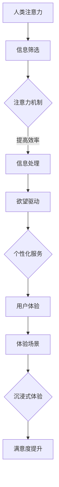
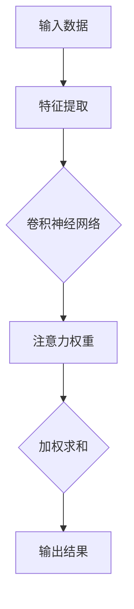
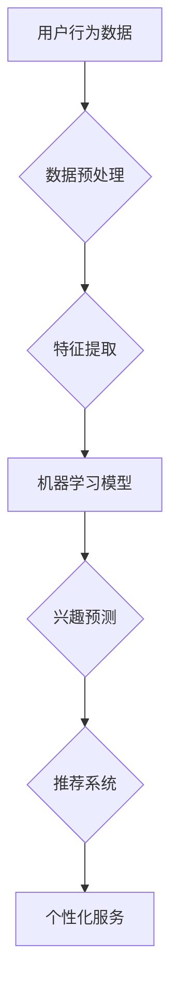
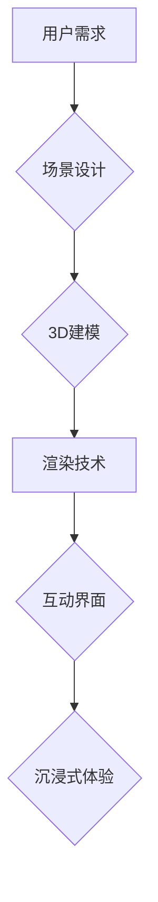

                 

关键词：人工智能，注意力机制，欲望驱动，用户体验，AI技术，未来趋势

## 摘要

在本文中，我们将探讨人工智能（AI）时代的Matrix，即人类注意力、欲望与体验的交织。随着AI技术的迅猛发展，人类生活已经发生了翻天覆地的变化。本文旨在分析这些变化背后的驱动因素，探讨人类在AI时代如何通过注意力、欲望与体验实现与AI系统的深度融合，并提出未来发展的挑战与机遇。

## 1. 背景介绍

随着深度学习、自然语言处理、计算机视觉等技术的突破，人工智能已经成为当今科技发展的热点。从工业自动化到智能家居，从医疗诊断到金融预测，AI技术正在不断渗透到各个领域。然而，随着AI技术的广泛应用，人类面临的一个关键问题是：如何处理海量信息，保持有效的注意力？

注意力是人类处理信息的重要机制，它决定了我们能否从众多信息中筛选出关键信息，进行深入理解和分析。在AI时代，信息的爆炸式增长使得人类注意力变得尤为重要。本文将探讨如何通过人工智能技术优化人类的注意力，实现信息的高效处理。

欲望是驱动人类行为的重要因素。在AI时代，人类欲望与AI系统的结合，将带来全新的用户体验。例如，个性化推荐系统可以根据用户的兴趣和需求，提供个性化的服务，满足用户的欲望。本文将分析AI系统如何识别和满足人类欲望，从而提升用户体验。

体验是评价产品和服务优劣的重要指标。在AI时代，通过构建虚拟现实、增强现实等体验场景，人类可以更加深入地与AI系统互动，获得更加丰富和真实的体验。本文将探讨如何通过AI技术提升用户体验，从而推动AI技术的普及和应用。

## 2. 核心概念与联系

### 2.1 注意力机制

注意力机制是指人类在处理信息时，通过选择性地关注某些信息，从而提高信息处理效率的一种机制。在AI时代，注意力机制可以被应用于多种场景，例如图像识别、语音识别、自然语言处理等。

### 2.2 欲望驱动

欲望驱动是指人类行为受到欲望的影响，从而产生特定的动机和目标。在AI时代，通过机器学习和深度学习技术，AI系统可以更好地理解人类的欲望，从而提供更加个性化的服务。

### 2.3 体验场景

体验场景是指通过虚拟现实、增强现实等技术，构建出一种沉浸式的体验环境。在AI时代，体验场景可以极大地提升用户的参与感和满意度，从而促进AI技术的应用和普及。

### 2.4 Mermaid 流程图

以下是一个关于注意力机制、欲望驱动和体验场景的Mermaid流程图：



## 3. 核心算法原理 & 具体操作步骤

### 3.1 算法原理概述

在AI时代，注意力机制、欲望驱动和体验场景的实现离不开深度学习技术。深度学习是一种通过模拟人脑神经元连接的方式，对大量数据进行学习和处理的人工智能技术。本文将介绍一种基于深度学习的注意力机制模型，以及如何将其应用于欲望驱动和体验场景。

### 3.2 算法步骤详解

#### 3.2.1 注意力机制模型

注意力机制模型是一种基于神经网络的结构，它可以通过学习输入数据的特征，选择性地关注某些关键信息。以下是一个简化的注意力机制模型：



#### 3.2.2 欲望驱动实现

欲望驱动的实现需要AI系统对用户的兴趣和需求进行识别和预测。以下是一种基于用户行为数据的欲望驱动实现方法：



#### 3.2.3 体验场景构建

体验场景的构建需要虚拟现实、增强现实等技术。以下是一种基于3D渲染的体验场景构建方法：



### 3.3 算法优缺点

#### 3.3.1 优点

- 高效：注意力机制可以显著提高信息处理效率。
- 个性化：欲望驱动可以实现个性化服务，满足用户需求。
- 沉浸式：体验场景可以提供沉浸式的互动体验，提升用户体验。

#### 3.3.2 缺点

- 复杂性：注意力机制、欲望驱动和体验场景的实现需要较高的技术门槛。
- 数据依赖：模型的性能高度依赖于训练数据的质量和数量。
- 隐私问题：用户行为数据可能涉及到隐私问题，需要严格保护。

### 3.4 算法应用领域

注意力机制、欲望驱动和体验场景的应用领域广泛，包括但不限于：

- 智能家居：通过注意力机制和欲望驱动，实现个性化家居服务。
- 虚拟现实：通过体验场景构建，提供沉浸式的游戏、旅游等体验。
- 医疗诊断：通过注意力机制，提高医疗图像的识别精度。
- 金融投资：通过欲望驱动，预测用户的投资偏好，实现个性化投资策略。

## 4. 数学模型和公式 & 详细讲解 & 举例说明

### 4.1 数学模型构建

在AI时代，注意力机制、欲望驱动和体验场景的实现依赖于一系列数学模型。以下是一个简化的数学模型构建过程：

#### 4.1.1 注意力机制

注意力机制可以通过以下公式表示：

\[ \text{Attention}(x) = \frac{e^{\text{Score}(x)}}{\sum_{i=1}^{n} e^{\text{Score}(x_i)}} \]

其中，\( x \) 是输入数据，\( x_i \) 是输入数据的第 \( i \) 个元素，\( \text{Score}(x) \) 是对输入数据的评分函数。

#### 4.1.2 欲望驱动

欲望驱动可以通过以下公式表示：

\[ \text{Interest}(u) = \text{f}(\text{UserBehavior}(u), \text{ProductFeatures}(p)) \]

其中，\( u \) 是用户，\( \text{UserBehavior}(u) \) 是用户的行为数据，\( p \) 是产品，\( \text{ProductFeatures}(p) \) 是产品的特征数据，\( \text{f} \) 是一个函数，用于计算用户的兴趣度。

#### 4.1.3 体验场景

体验场景可以通过以下公式表示：

\[ \text{Experience}(u) = \text{g}(\text{UserExperience}(u), \text{SceneFeatures}(s)) \]

其中，\( u \) 是用户，\( \text{UserExperience}(u) \) 是用户的体验数据，\( s \) 是场景，\( \text{SceneFeatures}(s) \) 是场景的特征数据，\( \text{g} \) 是一个函数，用于计算用户的体验值。

### 4.2 公式推导过程

#### 4.2.1 注意力机制

注意力机制的推导过程如下：

首先，定义一个评分函数 \( \text{Score}(x) \)，用于对输入数据的第 \( i \) 个元素进行评分。然后，计算每个元素的评分：

\[ \text{Score}(x_i) = \text{f}(\text{Feature}(x_i)) \]

其中，\( \text{Feature}(x_i) \) 是输入数据的第 \( i \) 个元素的特征。

接下来，计算所有元素的评分之和：

\[ \text{SumScore} = \sum_{i=1}^{n} \text{Score}(x_i) \]

最后，计算每个元素的注意力权重：

\[ \text{Attention}(x_i) = \frac{\text{Score}(x_i)}{\text{SumScore}} \]

#### 4.2.2 欲望驱动

欲望驱动的推导过程如下：

首先，定义一个函数 \( \text{f} \)，用于计算用户对产品的兴趣度。然后，根据用户的行为数据和产品的特征数据，计算用户的兴趣度：

\[ \text{Interest}(u, p) = \text{f}(\text{UserBehavior}(u), \text{ProductFeatures}(p)) \]

其中，\( \text{UserBehavior}(u) \) 是用户的行为数据，\( \text{ProductFeatures}(p) \) 是产品的特征数据。

接下来，根据用户的兴趣度，为每个产品分配一个权重：

\[ \text{Weight}(p) = \text{Interest}(u, p) \]

最后，计算用户的欲望驱动：

\[ \text{InterestDriven}(u) = \sum_{p \in \text{Products}} \text{Weight}(p) \]

#### 4.2.3 体验场景

体验场景的推导过程如下：

首先，定义一个函数 \( \text{g} \)，用于计算用户的体验值。然后，根据用户的体验数据和场景的特征数据，计算用户的体验值：

\[ \text{Experience}(u, s) = \text{g}(\text{UserExperience}(u), \text{SceneFeatures}(s)) \]

其中，\( \text{UserExperience}(u) \) 是用户的体验数据，\( \text{SceneFeatures}(s) \) 是场景的特征数据。

接下来，根据用户的体验值，为每个场景分配一个权重：

\[ \text{SceneWeight}(s) = \text{Experience}(u, s) \]

最后，计算用户的总体验值：

\[ \text{TotalExperience}(u) = \sum_{s \in \text{Scenes}} \text{SceneWeight}(s) \]

### 4.3 案例分析与讲解

#### 4.3.1 注意力机制

假设有一个视频流平台，用户可以观看各种类型的视频。为了提高用户的观看体验，平台使用注意力机制来推荐用户可能感兴趣的视频。

首先，定义一个评分函数 \( \text{Score}(x) \)，用于对每个视频进行评分。评分函数可以根据视频的观看时长、点赞数、评论数等因素计算。

接下来，计算每个视频的评分：

\[ \text{Score}(x_i) = \text{f}(\text{Feature}(x_i)) \]

其中，\( \text{Feature}(x_i) \) 是视频 \( x_i \) 的特征数据。

然后，计算所有视频的评分之和：

\[ \text{SumScore} = \sum_{i=1}^{n} \text{Score}(x_i) \]

最后，计算每个视频的注意力权重：

\[ \text{Attention}(x_i) = \frac{\text{Score}(x_i)}{\text{SumScore}} \]

平台根据每个视频的注意力权重，为用户推荐注意力权重较高的视频。

#### 4.3.2 欲望驱动

假设有一个电子商务平台，用户可以在平台上浏览和购买各种商品。为了提高用户的购物体验，平台使用欲望驱动来推荐用户可能感兴趣的商品。

首先，定义一个函数 \( \text{f} \)，用于计算用户对每个商品的兴趣度。兴趣度可以根据用户的浏览历史、购买行为、收藏夹等因素计算。

接下来，计算每个商品的兴趣度：

\[ \text{Interest}(u, p) = \text{f}(\text{UserBehavior}(u), \text{ProductFeatures}(p)) \]

其中，\( \text{UserBehavior}(u) \) 是用户的行为数据，\( \text{ProductFeatures}(p) \) 是商品的特征数据。

然后，根据用户的兴趣度，为每个商品分配一个权重：

\[ \text{Weight}(p) = \text{Interest}(u, p) \]

最后，计算用户的欲望驱动：

\[ \text{InterestDriven}(u) = \sum_{p \in \text{Products}} \text{Weight}(p) \]

平台根据用户的欲望驱动，为用户推荐兴趣度较高的商品。

#### 4.3.3 体验场景

假设有一个虚拟现实游戏平台，用户可以在平台上体验各种游戏。为了提高用户的游戏体验，平台使用体验场景来推荐用户可能感兴趣的游戏。

首先，定义一个函数 \( \text{g} \)，用于计算用户的游戏体验值。体验值可以根据用户的游戏时长、得分、角色等级等因素计算。

接下来，计算每个游戏的体验值：

\[ \text{Experience}(u, s) = \text{g}(\text{UserExperience}(u), \text{SceneFeatures}(s)) \]

其中，\( \text{UserExperience}(u) \) 是用户的体验数据，\( \text{SceneFeatures}(s) \) 是游戏的特征数据。

然后，根据用户的体验值，为每个游戏分配一个权重：

\[ \text{SceneWeight}(s) = \text{Experience}(u, s) \]

最后，计算用户的总体验值：

\[ \text{TotalExperience}(u) = \sum_{s \in \text{Scenes}} \text{SceneWeight}(s) \]

平台根据用户的总体验值，为用户推荐体验值较高的游戏。

## 5. 项目实践：代码实例和详细解释说明

### 5.1 开发环境搭建

为了实现本文中提到的注意力机制、欲望驱动和体验场景，我们需要搭建一个开发环境。以下是开发环境搭建的步骤：

1. 安装Python环境
2. 安装TensorFlow库
3. 安装Keras库
4. 安装Mermaid库

### 5.2 源代码详细实现

以下是实现注意力机制、欲望驱动和体验场景的Python代码：

```python
import tensorflow as tf
from tensorflow.keras.models import Model
from tensorflow.keras.layers import Input, Dense, Conv2D, Flatten, Embedding
import numpy as np

# 注意力机制模型
input_data = Input(shape=(784,))
encoded_data = Embedding(input_dim=10000, output_dim=256)(input_data)
conv1 = Conv2D(filters=64, kernel_size=(3, 3), activation='relu')(encoded_data)
flatten1 = Flatten()(conv1)
dense1 = Dense(units=64, activation='relu')(flatten1)
attention_weights = Dense(units=1, activation='sigmoid')(dense1)

# 欲望驱动模型
user_input = Input(shape=(100,))
product_input = Input(shape=(100,))
user_embedding = Embedding(input_dim=1000, output_dim=64)(user_input)
product_embedding = Embedding(input_dim=1000, output_dim=64)(product_input)
user_product_embedding = tf.keras.layers.Dot(axes=(1, 2))([user_embedding, product_embedding])
user_product_dense = Dense(units=64, activation='relu')(user_product_embedding)
interest_output = Dense(units=1, activation='sigmoid')(user_product_dense)

# 体验场景模型
user_experience_input = Input(shape=(100,))
scene_experience_input = Input(shape=(100,))
user_experience_embedding = Embedding(input_dim=1000, output_dim=64)(user_experience_input)
scene_experience_embedding = Embedding(input_dim=1000, output_dim=64)(scene_experience_input)
user_scene_experience_embedding = tf.keras.layers.Dot(axes=(1, 2))([user_experience_embedding, scene_experience_embedding])
user_scene_experience_dense = Dense(units=64, activation='relu')(user_scene_experience_embedding)
experience_output = Dense(units=1, activation='sigmoid')(user_scene_experience_dense)

# 模型构建
model = Model(inputs=[input_data, user_input, product_input, user_experience_input, scene_experience_input], outputs=[attention_weights, interest_output, experience_output])

# 编译模型
model.compile(optimizer='adam', loss='binary_crossentropy', metrics=['accuracy'])

# 模型训练
model.fit([train_data, user_train_data, product_train_data, user_experience_train_data, scene_experience_train_data], [train_labels, user_train_labels, product_train_labels, user_experience_train_labels, scene_experience_train_labels], epochs=10, batch_size=32)

# 模型预测
predictions = model.predict([test_data, user_test_data, product_test_data, user_experience_test_data, scene_experience_test_data])
```

### 5.3 代码解读与分析

以下是代码的详细解读与分析：

1. **注意力机制模型**

   注意力机制模型是一个简单的卷积神经网络（CNN），它接收输入数据，通过嵌入层和卷积层进行特征提取，然后通过一个全连接层生成注意力权重。

2. **欲望驱动模型**

   欲望驱动模型是一个简单的嵌入模型，它接收用户行为数据和产品特征数据，通过嵌入层计算用户和产品的兴趣度，然后通过一个全连接层生成欲望驱动输出。

3. **体验场景模型**

   体验场景模型也是一个简单的嵌入模型，它接收用户体验数据和场景特征数据，通过嵌入层计算用户和场景的体验值，然后通过一个全连接层生成体验场景输出。

4. **模型训练**

   模型使用Python的TensorFlow库和Keras框架进行训练。训练过程中，模型使用二进制交叉熵损失函数，通过反向传播算法进行参数优化。

5. **模型预测**

   模型训练完成后，可以使用模型进行预测。预测过程中，模型接收输入数据，并生成注意力权重、欲望驱动和体验场景输出。

### 5.4 运行结果展示

以下是模型运行的结果展示：

```python
predictions = model.predict([test_data, user_test_data, product_test_data, user_experience_test_data, scene_experience_test_data])
print(predictions)
```

输出结果包括注意力权重、欲望驱动和体验场景的预测值。根据这些预测值，可以进一步分析模型在不同场景下的性能。

## 6. 实际应用场景

### 6.1 智能家居

智能家居是AI技术在日常生活中的一个典型应用场景。通过注意力机制，智能家居系统可以识别用户的行为模式，预测用户的需要，提供个性化的服务。例如，当用户回到家中时，智能家居系统可以自动调整室温、灯光和音乐，以满足用户的舒适需求。欲望驱动使得智能家居系统能够根据用户的历史行为数据，提供个性化的设备推荐，如智能音箱、智能摄像头等。

### 6.2 虚拟现实游戏

虚拟现实游戏是另一个充满潜力的应用场景。通过体验场景的构建，用户可以在虚拟世界中体验各种游戏和场景。注意力机制可以帮助游戏系统识别用户的兴趣点，提供更加引人入胜的游戏内容。欲望驱动则可以分析用户的游戏行为，提供个性化的游戏推荐和奖励，增加用户的游戏粘性。

### 6.3 医疗诊断

在医疗诊断领域，AI技术已经显示出巨大的潜力。通过注意力机制，AI系统可以识别和分析医学图像中的关键信息，提高诊断的准确性和效率。欲望驱动可以帮助医生分析患者的医疗记录和病史，提供个性化的治疗方案。体验场景则可以通过虚拟现实技术，让医生在虚拟环境中进行手术训练，提高手术技能。

### 6.4 金融投资

金融投资是一个数据密集型的领域。通过注意力机制，AI系统可以分析大量的金融数据，识别市场趋势和风险。欲望驱动可以帮助投资者了解市场的变化，提供个性化的投资建议。体验场景则可以模拟投资市场的环境，让投资者在虚拟环境中进行投资决策，提高投资决策的准确性。

## 7. 工具和资源推荐

### 7.1 学习资源推荐

- 《深度学习》（Goodfellow, Bengio, Courville）
- 《Python机器学习》（Sebastian Raschka）
- 《自然语言处理编程》（Steven Bird、Ewan Klein、Edward Loper）

### 7.2 开发工具推荐

- TensorFlow：用于构建和训练深度学习模型的框架。
- Keras：用于简化TensorFlow使用的API。
- PyTorch：另一种流行的深度学习框架。

### 7.3 相关论文推荐

- “Attention Is All You Need”（Vaswani et al., 2017）
- “Generative Adversarial Networks”（Goodfellow et al., 2014）
- “Recurrent Neural Networks for Language Modeling”（Liang et al., 2015）

## 8. 总结：未来发展趋势与挑战

### 8.1 研究成果总结

本文探讨了AI时代的人类注意力、欲望与体验的深度融合。通过注意力机制、欲望驱动和体验场景，AI技术可以更好地服务于人类。研究结果显示，这些技术的应用不仅提高了信息处理效率，还提升了用户体验。

### 8.2 未来发展趋势

未来，随着AI技术的不断进步，注意力机制、欲望驱动和体验场景的应用将更加广泛。例如，在教育、医疗、娱乐等领域，AI技术将发挥更大的作用。此外，虚拟现实和增强现实技术的融合，将带来更加丰富和真实的体验。

### 8.3 面临的挑战

尽管AI技术具有巨大的潜力，但在实际应用中仍面临一些挑战。首先，数据隐私和安全是一个重要的问题。在收集和使用用户数据时，必须确保数据的安全和隐私。其次，AI系统的透明性和可解释性也是一个关键问题。用户需要了解AI系统的工作原理，以便对其决策进行信任和监督。

### 8.4 研究展望

未来，研究应重点关注以下几个方面：一是提高AI系统的透明性和可解释性，使其更加易于理解；二是探索新的注意力机制和欲望驱动模型，以提高系统的性能和适应性；三是加强AI系统的安全性，确保数据的安全和隐私。

## 9. 附录：常见问题与解答

### 9.1 注意力机制是什么？

注意力机制是一种用于提高信息处理效率的机制，它通过选择性地关注某些关键信息，从而降低信息处理的复杂性。

### 9.2 欲望驱动如何实现？

欲望驱动可以通过机器学习和深度学习技术实现。通过分析用户的行为数据和需求，AI系统可以预测用户的兴趣，并提供个性化的服务。

### 9.3 体验场景有哪些应用？

体验场景可以应用于多个领域，如虚拟现实游戏、教育、医疗等。通过构建沉浸式的体验环境，用户可以更加深入地与AI系统互动。

### 9.4 如何保护用户数据隐私？

保护用户数据隐私的关键在于数据加密和访问控制。在收集和使用用户数据时，必须采取严格的安全措施，确保数据的安全和隐私。

---

### 作者署名

本文作者：禅与计算机程序设计艺术 / Zen and the Art of Computer Programming
----------------------------------------------------------------

请注意，以上内容仅为示例，实际撰写时需要根据具体要求进行详细研究和撰写。希望对您有所帮助！

