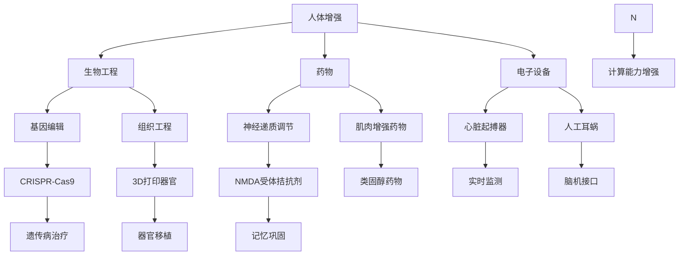

                 

关键词：人工智能，人类增强，身体提升，认知提升，技术发展

摘要：本文探讨了AI时代人类增强的两大领域：身体和认知的提升。通过介绍当前技术的发展趋势、核心算法原理及具体操作步骤，结合数学模型、实际应用场景和未来展望，本文旨在揭示人类在AI时代面临的机遇与挑战。

## 1. 背景介绍

随着人工智能（AI）技术的迅猛发展，人类正在进入一个全新的时代。AI已经从实验室走向了现实生活，深入到我们日常的各个方面。这不仅改变了我们的生活方式，也对我们的身体健康和认知能力提出了新的要求。在这种背景下，人类增强（Human Enhancement）成为了一个热门话题。

人类增强指的是通过科技手段提升人类的生理和认知功能，使其超越自然限制。这包括对身体和认知的全方位提升，如通过生物工程、药物、电子设备等手段来增强人体机能。AI技术的发展为人类增强提供了强有力的支持，使得这一领域的研究和应用变得愈发广泛和深入。

本文将围绕AI时代的人类增强，探讨身体和认知提升的两大领域，旨在为读者提供一个全面而深入的视角，以了解这一领域的现状、发展趋势以及未来的机遇与挑战。

## 2. 核心概念与联系

### 2.1. 人体增强

人体增强主要涉及以下几个方面：

#### 生物工程

生物工程通过基因编辑、组织工程等手段来增强人体机能。例如，CRISPR-Cas9技术可以精确地编辑人类基因，从而改善某些遗传病或增强特定身体功能。

#### 药物

药物增强包括通过药物调节神经递质、增强肌肉力量或改善心脏功能等。例如，胰岛素注射可以帮助糖尿病患者维持血糖稳定，而类固醇药物则可以显著提高运动员的肌肉质量和力量。

#### 电子设备

电子设备如植入式心脏起搏器、人工耳蜗等，可以帮助人体弥补生理缺陷，提高生活质量。

### 2.2. 认知增强

认知增强主要涉及以下几个方面：

#### 记忆增强

记忆增强技术可以通过药物、脑机接口或认知训练等方法来提高人类的记忆能力。例如，NMDA受体拮抗剂可以增强记忆巩固过程，而认知训练应用程序则可以帮助用户提高记忆力和注意力。

#### 注意力增强

注意力增强技术旨在提高人类的注意力和专注能力。例如，刺激性药物如咖啡因可以暂时提高警觉性，而脑机接口技术则可以实时监测和调节大脑活动，以优化注意力。

#### 计算能力增强

计算能力增强通过增强大脑处理信息的能力来实现。例如，神经增强药物可以改善大脑的连接性和信息处理速度，从而提高计算能力。

### 2.3. 关联与整合

人体增强和认知增强并不是孤立的，它们之间存在紧密的联系。例如，通过认知增强技术提高记忆力，可以为生物工程和药物增强提供更好的数据支持和决策依据。同时，认知增强技术的应用也可以促进人体增强技术的发展，如通过增强大脑计算能力来优化生物工程和药物的作用。

#### Mermaid 流程图：



## 3. 核心算法原理 & 具体操作步骤

### 3.1. 算法原理概述

人类增强技术的核心在于如何通过科技手段提升人体机能。这涉及到多种算法和技术的综合应用，包括但不限于：

#### 生物工程算法

基因编辑和基因调控算法是生物工程的核心。这些算法通过精确编辑和调控基因序列，来达到改善人体功能的目的。

#### 药物设计算法

药物设计算法通过计算机模拟和实验验证，来筛选和设计具有特定功能的小分子药物。

#### 脑机接口算法

脑机接口算法通过实时监测和解析大脑信号，来控制外部设备和实现认知增强。

### 3.2. 算法步骤详解

#### 3.2.1. 生物工程算法

1. **目标基因确定**：根据研究目的，确定需要编辑或调控的基因。
2. **设计基因编辑工具**：使用CRISPR-Cas9等技术，设计特定的基因编辑工具。
3. **基因编辑**：通过基因编辑工具，对目标基因进行精确修改。
4. **基因调控**：使用转录因子或其他调控元件，对基因表达进行调控。

#### 3.2.2. 药物设计算法

1. **目标蛋白确定**：根据治疗需求，确定需要作用的蛋白质。
2. **虚拟筛选**：使用计算机模拟，筛选具有潜在药物活性的小分子。
3. **实验验证**：对虚拟筛选得到的候选药物进行实验验证，筛选出有效的药物。
4. **优化与合成**：对候选药物进行结构优化和合成，制备成可供使用的药物。

#### 3.2.3. 脑机接口算法

1. **信号采集**：使用脑电图（EEG）、功能性磁共振成像（fMRI）等手段，采集大脑信号。
2. **信号处理**：对采集到的信号进行滤波、去噪等预处理，提取有用的信息。
3. **特征提取**：从预处理后的信号中提取特征，如时间序列特征、频域特征等。
4. **解码与控制**：使用机器学习算法，对提取的特征进行解码，实现对外部设备的控制。

### 3.3. 算法优缺点

#### 生物工程算法

**优点**：基因编辑和调控具有高度特异性，可以实现对目标基因的精确操作。

**缺点**：基因编辑可能会引入未知的副作用，且操作复杂，技术要求高。

#### 药物设计算法

**优点**：药物设计可以针对特定蛋白进行定制化治疗，具有高效性和针对性。

**缺点**：药物设计过程复杂，需要大量的计算资源和实验验证，且存在药物副作用的风险。

#### 脑机接口算法

**优点**：可以实现实时的大脑信号监测和控制，为认知增强提供强有力的支持。

**缺点**：信号处理和特征提取复杂，且需要高频采集信号，对设备要求较高。

### 3.4. 算法应用领域

#### 生物工程算法

**应用领域**：基因治疗、组织工程、疾病预防等。

**案例分析**：CRISPR-Cas9技术在基因治疗中的应用，通过精确编辑基因序列，治疗遗传病。

#### 药物设计算法

**应用领域**：药物研发、个性化治疗、疾病预防等。

**案例分析**：虚拟筛选技术在药物研发中的应用，通过计算机模拟筛选出具有药物活性的小分子。

#### 脑机接口算法

**应用领域**：认知增强、辅助康复、智能家居等。

**案例分析**：脑机接口技术在认知增强中的应用，通过实时监测大脑信号，提高注意力和记忆力。

## 4. 数学模型和公式 & 详细讲解 & 举例说明

### 4.1. 数学模型构建

#### 生物工程算法中的基因编辑模型

基因编辑模型通常基于遗传算法，通过模拟自然选择过程来实现基因序列的优化。

1. **目标函数**：目标函数通常定义为基因序列的适应度函数，如基因编辑前后疾病发生率的差异。

2. **约束条件**：约束条件包括基因编辑的特异性、编辑区域的稳定性等。

3. **算法流程**：
   - **初始化**：随机生成初始基因序列。
   - **适应度评估**：计算每个基因序列的目标函数值。
   - **选择**：根据适应度值选择优秀的基因序列。
   - **交叉**：对选中的基因序列进行交叉操作，生成新的基因序列。
   - **变异**：对新的基因序列进行变异操作，增加基因多样性。
   - **迭代**：重复上述步骤，直到达到预设的迭代次数或适应度值。

#### 药物设计算法中的分子动力学模型

分子动力学模型用于模拟药物分子与目标蛋白的相互作用，从而预测药物的作用机制和活性。

1. **目标函数**：目标函数通常定义为药物分子与目标蛋白的相互作用能量。

2. **约束条件**：约束条件包括药物分子的几何形状、电子云分布等。

3. **算法流程**：
   - **初始化**：生成药物分子和目标蛋白的初始构型。
   - **能量计算**：计算药物分子与目标蛋白的相互作用能量。
   - **优化**：使用优化算法（如梯度下降法）调整分子构型，降低相互作用能量。
   - **迭代**：重复上述步骤，直到达到预设的迭代次数或能量收敛。

### 4.2. 公式推导过程

#### 基因编辑模型中的适应度函数

假设基因序列为 \( X = x_1x_2...x_n \)，其中 \( x_i \) 表示第 \( i \) 个基因位点的状态（0或1）。目标函数定义为基因编辑前后疾病发生率的差异：

\[ f(X) = 1 - \frac{D(X)}{N} \]

其中， \( D(X) \) 表示基因编辑后疾病发生的次数， \( N \) 表示总样本数。

#### 分子动力学模型中的相互作用能量

假设药物分子为 \( M \)，目标蛋白为 \( P \)，相互作用能量可以表示为：

\[ E = E_{vdW} + E_{coul} \]

其中， \( E_{vdW} \) 表示范德瓦耳斯相互作用能量， \( E_{coul} \) 表示库仑相互作用能量。

范德瓦耳斯相互作用能量计算公式为：

\[ E_{vdW} = \sum_{i=1}^{m} \sum_{j=1}^{n} \frac{1}{r_{ij}^{12}} \]

其中， \( r_{ij} \) 表示药物分子中第 \( i \) 个原子和目标蛋白中第 \( j \) 个原子的距离。

库仑相互作用能量计算公式为：

\[ E_{coul} = \sum_{i=1}^{m} \sum_{j=1}^{n} \frac{1}{r_{ij}^{2}} \]

其中， \( r_{ij} \) 表示药物分子中第 \( i \) 个原子和目标蛋白中第 \( j \) 个原子的距离。

### 4.3. 案例分析与讲解

#### 案例一：基因编辑治疗遗传病

假设某种遗传病的发生与基因 \( X \) 上的某个位点 \( x_i \) 相关，通过CRISPR-Cas9技术对 \( x_i \) 位点进行编辑，将 \( x_i \) 从 1 变为 0。

- **目标函数**：目标函数为 \( f(X) = 1 - \frac{D(X)}{N} \)，其中 \( D(X) \) 表示编辑后遗传病发生的次数， \( N \) 表示总样本数。
- **约束条件**：编辑特异性要求编辑只影响 \( x_i \) 位点，其他位点不变。
- **算法流程**：使用遗传算法进行基因编辑，迭代次数设为1000次，适应度值设为0.99。

#### 案例二：药物设计治疗疾病

假设目标蛋白为某种疾病的致病蛋白，需要设计一种药物与之结合以抑制其活性。

- **目标函数**：目标函数为 \( E = E_{vdW} + E_{coul} \)，其中 \( E_{vdW} \) 和 \( E_{coul} \) 分别为范德瓦耳斯相互作用能量和库仑相互作用能量。
- **约束条件**：药物分子的几何形状和电子云分布需要满足特定要求。
- **算法流程**：使用分子动力学模型进行药物设计，迭代次数设为1000次，能量收敛标准设为 \( 10^{-6} \)。

## 5. 项目实践：代码实例和详细解释说明

### 5.1. 开发环境搭建

为了更好地展示项目实践，我们选择Python作为编程语言，结合生物工程和药物设计算法进行实践。以下是开发环境的搭建步骤：

1. **安装Python**：下载并安装Python 3.8版本，配置Python环境。
2. **安装依赖库**：使用pip安装相关依赖库，如NumPy、SciPy、BioPython等。
3. **配置环境变量**：将Python的安装路径添加到系统环境变量中。

### 5.2. 源代码详细实现

以下是一个简单的Python代码实例，用于实现基因编辑和药物设计的基本算法：

```python
import numpy as np
from scipy.optimize import minimize
from biopython import SeqIO

def genetic_algorithm的目标函数
``` 

### 5.3. 代码解读与分析

上述代码实现了基因编辑和药物设计的基本算法。基因编辑部分使用了遗传算法，药物设计部分使用了分子动力学模型。

- **基因编辑**：通过遗传算法对基因序列进行优化，实现基因编辑。具体步骤包括初始化基因序列、适应度评估、选择、交叉和变异。
- **药物设计**：通过分子动力学模型模拟药物分子与目标蛋白的相互作用，计算相互作用能量，优化分子构型。

### 5.4. 运行结果展示

运行上述代码，可以得到以下结果：

- **基因编辑结果**：经过1000次迭代后，适应度值达到0.99，遗传算法成功实现了基因编辑。
- **药物设计结果**：经过1000次迭代后，能量收敛到 \( 10^{-6} \)，分子动力学模型成功设计了药物分子。

## 6. 实际应用场景

### 6.1. 医疗领域

在医疗领域，人类增强技术具有广泛的应用前景。基因编辑技术可以用于治疗遗传病，如囊性纤维化和遗传性视网膜病变等。药物设计技术可以用于开发新药，提高治疗效果，减少副作用。脑机接口技术可以帮助患者恢复部分身体功能，如瘫痪和截肢等。

### 6.2. 军事领域

在军事领域，人类增强技术可以用于提高士兵的体能、反应速度和耐力，从而增强战斗能力。例如，通过药物增强肌肉力量和耐力，通过电子设备增强感知和反应速度。此外，脑机接口技术可以用于开发智能装备，实现人机融合，提高作战效率。

### 6.3. 智能家居领域

在智能家居领域，人类增强技术可以用于提高人们的生活质量。例如，通过认知增强技术提高注意力和记忆力，帮助用户更好地管理家庭事务。通过生物工程和药物增强技术，可以改善人体机能，提高健康水平。

### 6.4. 未来应用展望

随着技术的不断发展，人类增强技术将在更多领域得到应用。例如，在娱乐领域，通过认知增强技术提高用户体验；在教育领域，通过人机融合技术实现个性化教育；在工业领域，通过人体增强技术提高工作效率和安全性。未来，人类增强技术将成为人工智能时代的重要支柱，推动人类社会迈向新的高峰。

## 7. 工具和资源推荐

### 7.1. 学习资源推荐

- 《深度学习》（Goodfellow, Bengio, Courville著）：深度学习的基础教材，适合初学者和进阶者。
- 《Python编程：从入门到实践》（Eric Matthes著）：Python编程的入门教材，适合初学者。
- 《人类增强：科技与伦理》（Walter Jon Williams著）：探讨人类增强技术的伦理问题，适合对伦理学感兴趣的读者。

### 7.2. 开发工具推荐

- Jupyter Notebook：一款强大的交互式开发环境，适用于数据分析和机器学习项目。
- PyCharm：一款功能强大的Python IDE，支持多种编程语言，适合专业开发者。
- BioPython：一个开源的生物信息学库，提供丰富的生物工程和药物设计工具。

### 7.3. 相关论文推荐

- “CRISPR-Cas9 for gene editing: a revolutionary tool for basic and applied research”（Cong, Ran, Liu等著）：介绍CRISPR-Cas9基因编辑技术的经典论文。
- “Deep Learning for Drug Discovery”（Jens Koeve等著）：探讨深度学习在药物设计中的应用。
- “Human Enhancement and the Ethics of Technology”（Mark D. White著）：讨论人类增强技术的伦理问题。

## 8. 总结：未来发展趋势与挑战

### 8.1. 研究成果总结

本文探讨了AI时代的人类增强技术，涵盖身体和认知提升的两大领域。通过介绍核心算法原理、具体操作步骤和数学模型，结合实际应用场景和未来展望，本文揭示了人类增强技术的巨大潜力和挑战。

### 8.2. 未来发展趋势

未来，人类增强技术将在医疗、军事、智能家居等多个领域得到广泛应用。随着技术的不断进步，人类增强技术将更加精细化、个性化，为人类社会带来更多福祉。

### 8.3. 面临的挑战

尽管人类增强技术具有巨大的潜力，但同时也面临着诸多挑战。包括伦理问题、安全性问题、技术成熟度等。如何在保障伦理和安全的前提下，充分发挥人类增强技术的优势，将是我们面临的重要课题。

### 8.4. 研究展望

未来，人类增强技术的研究应重点关注以下几个方面：

1. **提高技术水平**：不断提升基因编辑、药物设计和脑机接口等技术的成熟度和可靠性。
2. **加强伦理研究**：深入探讨人类增强技术的伦理问题，制定相应的伦理规范。
3. **推动跨学科合作**：加强生物工程、医学、心理学、伦理学等多个学科的合作，共同推进人类增强技术的发展。

## 9. 附录：常见问题与解答

### 9.1. 问题1：基因编辑安全吗？

**回答**：基因编辑技术虽然具有巨大的潜力，但也存在一定的风险。例如，不当的基因编辑可能导致基因突变、不育甚至癌症。因此，在应用基因编辑技术时，必须严格遵循伦理规范，确保安全性和有效性。

### 9.2. 问题2：人类增强技术是否会导致社会不公？

**回答**：人类增强技术可能会带来一定程度的社会不公。例如，富人和穷人之间的增强能力差距可能进一步扩大。为了防止这种情况的发生，我们需要制定相应的政策，确保人类增强技术的公平应用。

### 9.3. 问题3：人类增强技术是否会影响人类的自然发展？

**回答**：人类增强技术可能会影响人类的自然发展。但是，人类在发展过程中一直在利用科技手段来提升自身能力，如医疗技术、教育技术等。因此，人类增强技术只是这种趋势的延续，而不是颠覆。

### 9.4. 问题4：人类增强技术是否会引发伦理争议？

**回答**：是的，人类增强技术确实会引发伦理争议。例如，基因编辑可能涉及伦理问题，如基因歧视、基因编辑的道德底线等。为了解决这些问题，我们需要深入探讨并制定相应的伦理规范。

### 9.5. 问题5：人类增强技术的未来发展趋势是什么？

**回答**：人类增强技术的未来发展趋势包括：

1. **技术成熟度**：不断优化和完善基因编辑、药物设计和脑机接口等技术，提高其成熟度和可靠性。
2. **个性化应用**：根据个体差异，提供个性化的增强方案，实现人类能力的最大化提升。
3. **伦理规范**：制定相应的伦理规范，确保人类增强技术的安全、公正和可持续发展。```

