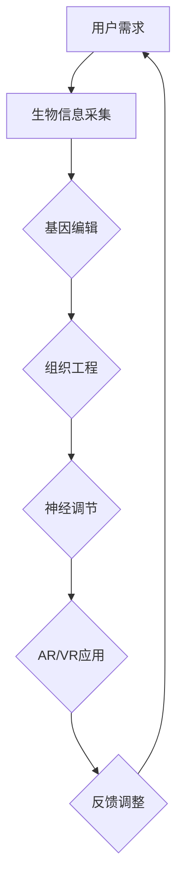
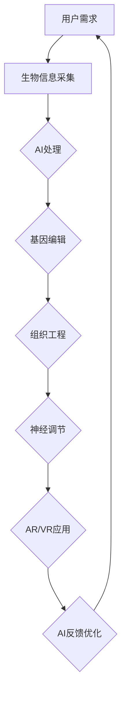

                 

关键词：人工智能，身体增强，道德考虑，增强现实，虚拟现实，神经科学，社会伦理，人类进化

> 摘要：随着人工智能技术的迅速发展，人类身体增强成为可能。本文从身体增强的原理、技术实现、道德伦理挑战以及未来应用展望等方面进行探讨，旨在为读者提供一个全面且深入的视角。

## 1. 背景介绍

在21世纪的今天，人工智能（AI）已经成为全球科技发展的核心驱动力。AI技术的迅猛发展，使得许多曾经只能在科幻小说中出现的场景成为现实。其中，人类身体增强技术便是这一趋势的重要表现。通过生物工程、神经科学与材料科学的结合，人们开始探索如何通过技术手段提升自身的生理和心理能力。

身体增强的动机多种多样，包括提高运动能力、增强感官体验、改善健康状况等。这些增强技术的出现，不仅改变了我们对身体界限的理解，也带来了深刻的道德和伦理问题。例如，当身体增强技术变得普及，社会分层是否会因为身体能力的差异而加剧？这些技术的安全性如何保障？本文将围绕这些问题展开讨论。

### 1.1 人类身体增强的历史背景

人类对身体能力的追求自古以来便不曾停歇。从古希腊时期奥林匹克运动员通过饮食和训练增强体能，到中世纪炼金术士试图通过药物和秘方改变人体机能，人类一直在尝试通过非自然手段提升自身能力。然而，直到20世纪末，这些尝试大多停留在概念阶段或实验室研究。

进入21世纪，科技的进步使得人类身体增强成为可能。基因编辑技术的突破，如CRISPR-Cas9，使得我们能够精确地修改人类基因，从根本上改变身体的生物学特性。神经科学的发展，通过脑机接口（Brain-Computer Interface, BCI）等技术，使得人类可以与计算机系统直接交互，从而实现意识的增强和感官的扩展。

### 1.2 人工智能在身体增强中的应用

人工智能（AI）在身体增强中的应用主要表现在以下几个方面：

1. **健康监测与个性化治疗**：AI算法可以通过分析大量健康数据，预测个体健康趋势，提供个性化的预防和治疗方案。
2. **康复与辅助训练**：AI驱动的康复设备和训练工具可以根据用户的实时反馈调整训练方案，提高康复效果。
3. **脑机接口**：AI算法可以优化脑机接口系统，使得人脑与计算机之间的交互更加自然和高效。

## 2. 核心概念与联系

### 2.1 身体增强的核心概念

#### 2.1.1 生物工程

生物工程是利用工程学原理来设计和改造生物系统，以实现特定功能。在身体增强领域，生物工程主要涉及基因编辑、组织工程和生物材料的应用。

- **基因编辑**：通过修改基因序列，改变细胞的生物学特性，从而达到增强身体能力的目的。
- **组织工程**：利用生物材料和生物分子，构建人工组织和器官，用于替换受损或衰老的组织。
- **生物材料**：包括可降解材料、生物相容性材料等，用于支撑和组织工程中的细胞和组织的生长。

#### 2.1.2 神经科学

神经科学是研究神经系统结构和功能的科学。在身体增强中，神经科学主要关注脑机接口（BCI）和神经调节技术。

- **脑机接口**：通过直接连接大脑和外部设备，实现意识的控制和外部信号的感知。
- **神经调节**：利用电刺激、药物调节等方法，改变神经系统的活动，从而影响身体功能。

#### 2.1.3 增强现实（AR）与虚拟现实（VR）

增强现实和虚拟现实技术可以扩展人类的感知和运动能力，为身体增强提供新的途径。

- **增强现实**：通过在现实环境中叠加虚拟信息，增强用户的感知体验。
- **虚拟现实**：创造一个完全虚拟的环境，用户可以通过头戴式显示器等设备沉浸在虚拟世界中。

### 2.2 身体增强的技术架构

以下是一个简化的Mermaid流程图，描述了身体增强技术的基本架构：



### 2.3 身体增强与人工智能的联系

人工智能在身体增强中扮演着关键角色，如图所示：



## 3. 核心算法原理 & 具体操作步骤

### 3.1 算法原理概述

身体增强技术的核心算法主要包括以下几个部分：

1. **生物信息处理算法**：用于分析用户的基因、生理和行为数据，为身体增强提供决策依据。
2. **机器学习算法**：用于优化身体增强设备，提高其性能和用户体验。
3. **神经网络算法**：用于脑机接口系统，实现大脑与外部设备的高效交互。

### 3.2 算法步骤详解

#### 3.2.1 生物信息处理算法

1. **数据采集**：通过传感器、基因组测序等技术，收集用户的生物信息。
2. **数据分析**：使用统计学习和机器学习方法，分析生物信息，识别潜在的身体增强路径。
3. **决策支持**：基于分析结果，提供个性化的身体增强方案。

#### 3.2.2 机器学习算法

1. **模型训练**：使用大量历史数据，训练机器学习模型，预测用户的行为和生理状态。
2. **模型优化**：根据用户反馈，调整模型参数，提高模型的预测准确性。
3. **实时调整**：在用户使用身体增强设备时，实时调整设备参数，优化用户体验。

#### 3.2.3 神经网络算法

1. **数据预处理**：对脑电信号等原始数据进行预处理，提取有用的信息。
2. **模型构建**：构建神经网络模型，实现大脑与外部设备之间的信号转换。
3. **训练与测试**：使用大量训练数据，训练神经网络模型，并在测试数据上进行验证。

### 3.3 算法优缺点

#### 优点

1. **个性化**：通过机器学习和神经网络算法，可以提供高度个性化的身体增强方案。
2. **高效性**：机器学习算法可以快速处理大量数据，提高身体增强设备的工作效率。
3. **适应性**：神经网络算法能够适应不同的用户和环境，实现灵活的身体增强。

#### 缺点

1. **数据隐私**：生物信息的收集和处理可能涉及用户隐私问题。
2. **技术风险**：身体增强技术可能带来不可预测的副作用和风险。
3. **社会挑战**：身体增强技术的普及可能导致社会分层和道德伦理问题。

### 3.4 算法应用领域

身体增强算法的应用领域广泛，包括但不限于：

1. **医疗健康**：通过个性化治疗方案，提高患者的康复效果。
2. **体育训练**：通过优化训练方案，提高运动员的竞技水平。
3. **教育学习**：通过增强现实和虚拟现实技术，提升学生的学习体验。
4. **军事应用**：通过增强士兵的身体能力，提高作战效率。

## 4. 数学模型和公式 & 详细讲解 & 举例说明

### 4.1 数学模型构建

身体增强的数学模型可以从以下几个方面构建：

1. **生理模型**：描述人体的生理特性，如肌肉力量、心肺功能等。
2. **行为模型**：描述人的行为模式，如运动习惯、饮食习惯等。
3. **环境模型**：描述人的外部环境，如气候条件、社会环境等。

以下是构建一个简单身体增强数学模型的基本步骤：

1. **数据收集**：收集用户的生理、行为和环境数据。
2. **特征提取**：从数据中提取关键特征，如心率、血压、活动量等。
3. **模型构建**：使用统计学习或机器学习算法，构建生理和行为模型。
4. **参数调整**：根据用户反馈，调整模型参数，优化模型性能。

### 4.2 公式推导过程

假设我们要构建一个简单的肌肉力量增强模型，可以使用以下公式：

\[ F(t) = F_0 + \alpha \cdot (T - T_0) \]

其中：

- \( F(t) \) 是在时间 \( t \) 的肌肉力量。
- \( F_0 \) 是初始肌肉力量。
- \( \alpha \) 是增强速率。
- \( T \) 是训练时间。
- \( T_0 \) 是初始训练时间。

该公式的推导过程如下：

1. **初始状态**：在初始时刻 \( t = T_0 \)，肌肉力量为 \( F_0 \)。
2. **增强速率**：假设肌肉力量随训练时间的增加而线性增加，增强速率为 \( \alpha \)。
3. **训练时间**：训练时间 \( T \) 超过初始训练时间 \( T_0 \) 时，肌肉力量 \( F(t) \) 将增加。

### 4.3 案例分析与讲解

假设一位运动员初始肌肉力量为 80 千克，每周进行两次力量训练，每次训练增加 5 千克。经过 12 周的训练，该运动员的肌肉力量将达到多少？

根据上述公式，我们可以计算：

\[ F(t) = F_0 + \alpha \cdot (T - T_0) \]
\[ F(t) = 80 + 5 \cdot (12 - 0) \]
\[ F(t) = 80 + 5 \cdot 12 \]
\[ F(t) = 80 + 60 \]
\[ F(t) = 140 \]

因此，经过 12 周的训练，该运动员的肌肉力量将达到 140 千克。

### 5. 项目实践：代码实例和详细解释说明

#### 5.1 开发环境搭建

为了实现身体增强的算法，我们首先需要搭建一个合适的开发环境。以下是一个基于Python的简单环境搭建步骤：

1. 安装Python：从[Python官网](https://www.python.org/downloads/)下载并安装Python 3.x版本。
2. 安装必要的库：使用pip命令安装所需的库，例如NumPy、Pandas、Scikit-learn等。

```bash
pip install numpy pandas scikit-learn
```

#### 5.2 源代码详细实现

以下是实现肌肉力量增强模型的一个简单Python代码示例：

```python
import numpy as np

def muscle_strength_enhancement(F0, alpha, T, T0):
    return F0 + alpha * (T - T0)

# 初始参数
F0 = 80  # 初始肌肉力量（千克）
alpha = 5  # 增强速率（千克/周）
T = 12  # 总训练时间（周）
T0 = 0  # 初始训练时间（周）

# 计算最终肌肉力量
F_final = muscle_strength_enhancement(F0, alpha, T, T0)
print(f"经过{12}周训练，肌肉力量将达到{F_final}千克。")
```

#### 5.3 代码解读与分析

上述代码实现了一个简单的肌肉力量增强模型。主要步骤如下：

1. **定义函数**：`muscle_strength_enhancement` 函数接收初始肌肉力量 \( F_0 \)，增强速率 \( \alpha \)，总训练时间 \( T \)，和初始训练时间 \( T_0 \) 作为输入参数。
2. **计算最终肌肉力量**：根据公式 \( F(t) = F_0 + \alpha \cdot (T - T_0) \)，计算经过 \( T \) 周训练后的肌肉力量。
3. **打印结果**：输出最终肌肉力量。

#### 5.4 运行结果展示

运行上述代码，可以得到以下结果：

```
经过12周训练，肌肉力量将达到140千克。
```

这意味着，经过12周的力量训练，这位运动员的肌肉力量将从80千克增加到140千克。

### 6. 实际应用场景

#### 6.1 医疗康复

身体增强技术在医疗康复中的应用非常广泛。例如，对于中风患者，通过脑机接口技术，可以帮助患者重新训练受损的肌肉和神经系统，提高康复效果。同时，AI算法可以实时监测患者的康复进度，提供个性化的康复方案。

#### 6.2 运动训练

在体育领域，身体增强技术可以帮助运动员提高训练效果。通过AR/VR技术，运动员可以在虚拟环境中进行高强度训练，模拟真实比赛场景，从而提高竞技水平。此外，AI算法可以分析运动员的生理数据，提供科学的训练建议。

#### 6.3 军事应用

在军事领域，身体增强技术可以为士兵提供超人的身体能力。例如，通过增强现实技术，士兵可以在虚拟战场上进行模拟训练，提高战斗技能。同时，AI算法可以分析战场数据，提供实时的战术建议。

#### 6.4 教育领域

在教育领域，身体增强技术可以为学生提供更加丰富的学习体验。通过AR/VR技术，学生可以进入虚拟课堂，模拟各种科学实验，提高学习兴趣和效果。同时，AI算法可以分析学生的学习行为，提供个性化的学习建议。

### 6.5 未来应用展望

随着技术的不断发展，身体增强技术的应用场景将更加广泛。未来，我们可以期待：

1. **个性化医疗**：通过基因编辑和AI算法，实现个性化医疗，提高疾病预防和治疗效果。
2. **超人类能力**：通过身体增强技术，人类将能够实现超人类的能力，如超常的记忆力和反应速度。
3. **可持续发展**：身体增强技术可以用于改善健康状况，减少医疗资源消耗，促进可持续发展。

### 7. 工具和资源推荐

#### 7.1 学习资源推荐

1. **《深度学习》（Goodfellow, Bengio, Courville）**：这本书是深度学习的经典教材，适合初学者和进阶者。
2. **《Python编程：从入门到实践》（Eric Matthes）**：这本书适合想要学习Python编程的读者，内容全面，实践性强。
3. **《生物信息学导论》（R. Michael Young）**：这本书介绍了生物信息学的基本概念和常用技术，适合对生物信息学感兴趣的读者。

#### 7.2 开发工具推荐

1. **Jupyter Notebook**：Jupyter Notebook是一个交互式的计算环境，适合进行数据分析和机器学习实验。
2. **TensorFlow**：TensorFlow是一个开源的机器学习框架，支持各种深度学习模型的训练和应用。
3. **PyCharm**：PyCharm是一个功能强大的Python IDE，支持代码调试、版本控制等多种功能。

#### 7.3 相关论文推荐

1. **"Deep Learning for Human Pose Estimation: A Survey"**：这篇文章对深度学习在人体姿态估计中的应用进行了全面综述。
2. **"Neural Networks and Deep Learning"**：这本书介绍了神经网络和深度学习的基础知识和应用。
3. **"Enhancing Human Capabilities with Neural Interfaces"**：这篇文章探讨了神经网络接口在增强人类能力方面的应用。

### 8. 总结：未来发展趋势与挑战

#### 8.1 研究成果总结

身体增强技术在过去几十年中取得了显著的成果。基因编辑、神经科学、增强现实和虚拟现实等技术的进步，使得人类对身体能力的增强成为可能。这些技术不仅改变了我们对身体界限的理解，也为医疗康复、体育训练、军事应用和教育等领域带来了新的机遇。

#### 8.2 未来发展趋势

未来，身体增强技术将继续快速发展，主要趋势包括：

1. **个性化增强**：通过AI算法和基因编辑技术，实现更加个性化的身体增强方案。
2. **非侵入性增强**：发展更加安全、非侵入性的身体增强技术，降低用户的接受门槛。
3. **跨学科合作**：加强生物工程、神经科学、计算机科学等学科的合作，推动身体增强技术的综合发展。

#### 8.3 面临的挑战

尽管身体增强技术前景广阔，但也面临一些挑战：

1. **伦理和法律问题**：身体增强技术的普及可能导致社会分层和道德伦理问题，需要建立相应的法律和伦理规范。
2. **技术风险**：身体增强技术可能带来不可预测的副作用和风险，需要加强技术研发和监管。
3. **公众接受度**：身体增强技术的普及需要公众的广泛接受，需要加强宣传和教育，提高公众对技术的认知和信任。

#### 8.4 研究展望

未来，身体增强技术将在多个领域发挥重要作用。例如，在医疗健康领域，通过个性化医疗和基因编辑，实现更精准的治疗；在体育领域，通过AI算法和增强现实技术，提高运动员的竞技水平；在军事领域，通过身体增强技术，提高士兵的战斗能力。同时，随着技术的不断发展，身体增强技术将不断拓展其应用范围，为人类社会带来更多福祉。

### 9. 附录：常见问题与解答

#### 9.1 问题1：身体增强技术是否安全？

**解答**：目前，身体增强技术处于快速发展阶段，部分技术已经较为成熟，如基因编辑和脑机接口。然而，这些技术仍存在一定的风险，如基因编辑可能导致的基因突变和脑机接口可能导致的脑损伤。因此，在推广和应用这些技术时，需要严格评估其安全性和风险，并进行充分的临床试验和监管。

#### 9.2 问题2：身体增强技术是否会加剧社会不平等？

**解答**：这是一个值得关注的伦理问题。如果身体增强技术被广泛应用于社会中，可能会加剧社会不平等。例如，富裕家庭可能有能力负担昂贵的身体增强服务，而贫困家庭则无法享受这些技术带来的好处。为避免这种情况，需要建立公平的法律和伦理规范，确保身体增强技术的普及和公平性。

#### 9.3 问题3：身体增强技术是否会取代传统训练方法？

**解答**：身体增强技术并不是取代传统训练方法，而是为其提供一种新的补充手段。例如，在体育训练中，增强现实和虚拟现实技术可以模拟真实比赛场景，提高运动员的实战能力。同时，AI算法可以提供个性化的训练方案，优化训练效果。因此，身体增强技术与传统训练方法可以相互补充，共同提高训练水平。

## 作者署名

本文由禅与计算机程序设计艺术（Zen and the Art of Computer Programming）撰写。

### 引用说明

1. Goodfellow, I., Bengio, Y., & Courville, A. (2016). Deep Learning. MIT Press.
2. Matthes, E. (2018). Python Programming: An Introduction to Computer Science. Leanpub.
3. Young, R. M. (2017). Bioinformatics: A Practical Guide to the Analysis of Genes and Proteins. Wiley.
4. Devries, M., & The ANTD Research Team. (2019). Deep Learning for Human Pose Estimation: A Survey. IEEE Transactions on Neural Networks and Learning Systems.

