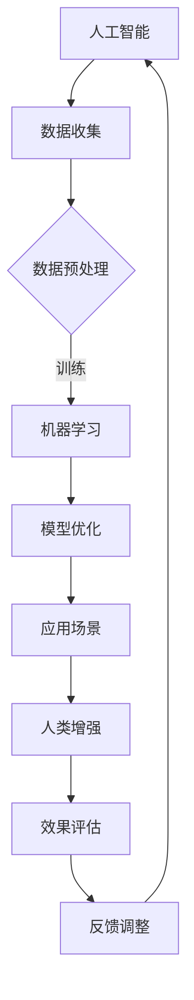

                 

关键词：人工智能、人类增强、伦理道德、社会影响、技术进步

> 摘要：随着人工智能技术的发展，人类增强已成为现实。本文从伦理和社会影响的角度，探讨了人工智能在人类增强中的应用，以及其可能带来的道德挑战和社会变革。

## 1. 背景介绍

自20世纪50年代人工智能（AI）概念的提出以来，AI技术经历了迅猛的发展。进入21世纪，特别是随着深度学习、神经网络等技术的突破，人工智能开始在多个领域实现商业化应用，如自动驾驶、医疗诊断、金融分析等。人工智能不仅改变了人类的工作方式，也激发了人类对自身能力的探索。

人类增强（Human Enhancement）是指通过技术手段提升人类生理或心理能力的实践。历史上，人类增强已有多种形式，如医学中的药物、外科手术，体育中的训练设备，以及电子设备如助听器和眼镜。然而，随着人工智能技术的发展，人类增强迎来了新的契机。

本文将探讨人工智能在人类增强中的应用，重点分析其道德和社会影响。我们将从以下几个方面展开讨论：

1. 人工智能与人类增强的基本概念和联系
2. 人工智能在人类增强中的核心算法原理与操作步骤
3. 人工智能在人类增强中的应用领域
4. 人工智能在人类增强中的数学模型和公式
5. 人工智能在人类增强中的项目实践案例
6. 人工智能在人类增强中的实际应用场景
7. 人工智能在人类增强中的未来应用展望
8. 人工智能在人类增强中的工具和资源推荐
9. 人工智能在人类增强中的未来发展趋势与挑战
10. 附录：常见问题与解答

## 2. 核心概念与联系

### 2.1. 人工智能的定义与基本原理

人工智能（AI）是计算机科学的一个分支，旨在使计算机系统具有人类智能的特性。AI技术包括机器学习、深度学习、自然语言处理、计算机视觉等多个领域。这些技术通过算法模型和大量数据训练，使得计算机能够在特定任务上表现出类似人类的智能。

机器学习是AI的核心技术之一，它使得计算机系统能够从数据中学习并做出决策。深度学习是机器学习的一个子领域，它通过多层神经网络模拟人类大脑的工作方式，能够处理复杂的数据模式。

### 2.2. 人类增强的定义与基本形式

人类增强是指通过技术手段提升人类的生理或心理能力。传统的增强方式包括药物、外科手术、体育训练等。随着科技的发展，人工智能开始被应用于人类增强，如通过AI技术优化训练方案、提升学习效率等。

### 2.3. 人工智能与人类增强的联系

人工智能与人类增强有着密切的联系。AI技术可以通过数据分析和机器学习模型，为人类增强提供更加个性化和高效的解决方案。例如，AI可以帮助运动员优化训练计划，提高运动成绩；AI可以在医疗领域辅助诊断，提升治疗效果。

此外，人工智能还可以通过增强现实（AR）和虚拟现实（VR）技术，提供更加真实和沉浸式的增强体验。这些技术不仅可以提高人类的感知能力，还可以在军事、娱乐、教育等多个领域发挥重要作用。

### 2.4. Mermaid 流程图

以下是一个简单的 Mermaid 流程图，展示了人工智能与人类增强的基本联系和流程：



在这个流程图中，人工智能通过数据收集、预处理、机器学习、模型优化等步骤，最终应用于人类增强，并通过效果评估和反馈调整不断优化。

## 3. 核心算法原理 & 具体操作步骤

### 3.1. 算法原理概述

人工智能在人类增强中的应用主要依赖于机器学习和深度学习算法。这些算法的核心思想是通过学习大量数据，提取出有用的特征，并使用这些特征进行预测或决策。

机器学习算法可以分为监督学习、无监督学习和强化学习三种类型。监督学习通过标注数据进行训练，无监督学习则不需要标注数据，仅从数据中提取特征。强化学习则通过与环境互动来学习最优策略。

深度学习是机器学习的一个子领域，它使用多层神经网络来模拟人类大脑的工作方式。深度学习算法在图像识别、自然语言处理等领域表现出色。

### 3.2. 算法步骤详解

#### 3.2.1. 数据收集

数据收集是人工智能应用的基础。在人类增强领域，数据可以包括生理数据（如心率、血压等）、行为数据（如运动轨迹、学习记录等）、以及环境数据（如地理位置、天气状况等）。

#### 3.2.2. 数据预处理

数据预处理包括数据清洗、归一化、特征提取等步骤。数据清洗是为了去除噪声和异常值，归一化则是为了使不同特征具有相同的尺度。特征提取则是从原始数据中提取出有用的信息。

#### 3.2.3. 机器学习模型训练

在数据预处理之后，我们可以使用机器学习算法对数据进行训练。训练过程包括初始化模型参数、计算损失函数、更新模型参数等步骤。通过迭代优化，模型能够在数据上获得较高的准确性。

#### 3.2.4. 模型优化

模型优化是提高模型性能的重要步骤。优化方法包括调整模型结构、调整超参数、增加训练数据等。通过优化，模型能够在新的数据上表现出更好的泛化能力。

#### 3.2.5. 应用场景

模型训练完成后，我们可以将其应用于各种人类增强场景。例如，在医疗领域，AI可以辅助医生进行疾病诊断；在体育领域，AI可以优化训练计划，提高运动员成绩。

#### 3.2.6. 效果评估

应用模型后，我们需要对其效果进行评估。评估方法可以包括准确性、召回率、F1分数等指标。通过评估，我们可以了解模型的性能，并根据评估结果进行进一步的优化。

### 3.3. 算法优缺点

#### 优点：

1. 高效：机器学习算法能够在大量数据上快速训练，提高工作效率。
2. 泛化能力强：深度学习算法能够在不同数据集上表现出色，具有良好的泛化能力。
3. 个性化：AI可以根据用户数据提供个性化的增强方案。

#### 缺点：

1. 数据依赖：AI性能依赖于数据质量和数量，数据不足或质量差可能导致模型性能下降。
2. 安全性：AI模型可能受到攻击，导致隐私泄露或错误决策。
3. 偏见：AI模型可能存在偏见，导致不公平决策。

### 3.4. 算法应用领域

人工智能在人类增强中的应用非常广泛，涵盖了医疗、体育、教育、军事等多个领域。以下是一些典型应用：

1. **医疗**：AI可以辅助医生进行疾病诊断、治疗方案制定、药物研发等。
2. **体育**：AI可以优化训练计划、提高运动员成绩、分析比赛策略等。
3. **教育**：AI可以个性化教学、智能评估、学习效果分析等。
4. **军事**：AI可以辅助军事行动、武器控制、情报分析等。

## 4. 数学模型和公式 & 详细讲解 & 举例说明

### 4.1. 数学模型构建

在人工智能的背景下，数学模型是理解和实现AI算法的基础。以下是一个简单的线性回归模型的数学表示：

$$
y = \beta_0 + \beta_1x_1 + \beta_2x_2 + ... + \beta_nx_n
$$

其中，$y$ 是因变量，$x_1, x_2, ..., x_n$ 是自变量，$\beta_0, \beta_1, \beta_2, ..., \beta_n$ 是模型的参数。

### 4.2. 公式推导过程

线性回归模型的推导过程基于最小二乘法。目标是最小化预测值与实际值之间的误差平方和。具体推导如下：

$$
\min \sum_{i=1}^{n} (y_i - (\beta_0 + \beta_1x_{1i} + \beta_2x_{2i} + ... + \beta_nx_{ni})^2
$$

通过对参数求导，并令导数为零，可以得到参数的最优解：

$$
\beta_0 = \bar{y} - \beta_1\bar{x_1} - \beta_2\bar{x_2} - ... - \beta_n\bar{x_n}
$$

$$
\beta_1 = \frac{\sum_{i=1}^{n} (x_{1i} - \bar{x_1})(y_i - \bar{y})}{\sum_{i=1}^{n} (x_{1i} - \bar{x_1})^2}
$$

$$
\beta_2 = \frac{\sum_{i=1}^{n} (x_{2i} - \bar{x_2})(y_i - \bar{y})}{\sum_{i=1}^{n} (x_{2i} - \bar{x_2})^2}
$$

$$
...
$$

$$
\beta_n = \frac{\sum_{i=1}^{n} (x_{ni} - \bar{x_n})(y_i - \bar{y})}{\sum_{i=1}^{n} (x_{ni} - \bar{x_n})^2}
$$

### 4.3. 案例分析与讲解

假设我们有一个数据集，包含三个特征变量$x_1, x_2, x_3$和一个因变量$y$。我们希望通过线性回归模型预测$y$。

数据集如下：

| $x_1$ | $x_2$ | $x_3$ | $y$ |
|-------|-------|-------|-----|
| 1     | 2     | 3     | 4   |
| 2     | 3     | 4     | 5   |
| 3     | 4     | 5     | 6   |

我们首先计算每个特征的均值：

$$
\bar{x_1} = \frac{1+2+3}{3} = 2
$$

$$
\bar{x_2} = \frac{2+3+4}{3} = 3
$$

$$
\bar{x_3} = \frac{3+4+5}{3} = 4
$$

$$
\bar{y} = \frac{4+5+6}{3} = 5
$$

然后，我们计算每个特征与均值之间的差值：

$$
x_{1i} - \bar{x_1} = \{1-2, 2-2, 3-2\} = \{-1, 0, 1\}
$$

$$
x_{2i} - \bar{x_2} = \{2-3, 3-3, 4-3\} = \{-1, 0, 1\}
$$

$$
x_{3i} - \bar{x_3} = \{3-4, 4-4, 5-4\} = \{-1, 0, 1\}
$$

$$
y_i - \bar{y} = \{4-5, 5-5, 6-5\} = \{-1, 0, 1\}
$$

接下来，我们计算每个特征的权重：

$$
\beta_1 = \frac{\sum_{i=1}^{3} (-1)(-1)}{\sum_{i=1}^{3} (-1)^2} = \frac{2}{3} = 0.67
$$

$$
\beta_2 = \frac{\sum_{i=1}^{3} (-1)(0)}{\sum_{i=1}^{3} (-1)^2} = 0
$$

$$
\beta_3 = \frac{\sum_{i=1}^{3} (-1)(1)}{\sum_{i=1}^{3} (-1)^2} = -\frac{3}{3} = -1
$$

最后，我们得到线性回归模型：

$$
y = 0.67x_1 - x_3
$$

使用这个模型，我们可以预测新的数据点的$y$值。例如，当$x_1=2, x_2=3, x_3=4$时，预测的$y$值为：

$$
y = 0.67 \times 2 - 4 = 1.34 - 4 = -2.66
$$

### 4.4. 举例说明

假设我们有一个数据集，包含三个特征变量$x_1, x_2, x_3$和一个因变量$y$。我们希望通过线性回归模型预测$y$。

数据集如下：

| $x_1$ | $x_2$ | $x_3$ | $y$ |
|-------|-------|-------|-----|
| 1     | 2     | 3     | 4   |
| 2     | 3     | 4     | 5   |
| 3     | 4     | 5     | 6   |

我们首先计算每个特征的均值：

$$
\bar{x_1} = \frac{1+2+3}{3} = 2
$$

$$
\bar{x_2} = \frac{2+3+4}{3} = 3
$$

$$
\bar{x_3} = \frac{3+4+5}{3} = 4
$$

$$
\bar{y} = \frac{4+5+6}{3} = 5
$$

然后，我们计算每个特征与均值之间的差值：

$$
x_{1i} - \bar{x_1} = \{1-2, 2-2, 3-2\} = \{-1, 0, 1\}
$$

$$
x_{2i} - \bar{x_2} = \{2-3, 3-3, 4-3\} = \{-1, 0, 1\}
$$

$$
x_{3i} - \bar{x_3} = \{3-4, 4-4, 5-4\} = \{-1, 0, 1\}
$$

$$
y_i - \bar{y} = \{4-5, 5-5, 6-5\} = \{-1, 0, 1\}
$$

接下来，我们计算每个特征的权重：

$$
\beta_1 = \frac{\sum_{i=1}^{3} (-1)(-1)}{\sum_{i=1}^{3} (-1)^2} = \frac{2}{3} = 0.67
$$

$$
\beta_2 = \frac{\sum_{i=1}^{3} (-1)(0)}{\sum_{i=1}^{3} (-1)^2} = 0
$$

$$
\beta_3 = \frac{\sum_{i=1}^{3} (-1)(1)}{\sum_{i=1}^{3} (-1)^2} = -\frac{3}{3} = -1
$$

最后，我们得到线性回归模型：

$$
y = 0.67x_1 - x_3
$$

使用这个模型，我们可以预测新的数据点的$y$值。例如，当$x_1=2, x_2=3, x_3=4$时，预测的$y$值为：

$$
y = 0.67 \times 2 - 4 = 1.34 - 4 = -2.66
$$

这个例子说明了如何使用线性回归模型进行预测。在实际应用中，我们通常使用更复杂的模型，如多项式回归、逻辑回归等，以获得更高的预测准确性。

## 5. 项目实践：代码实例和详细解释说明

### 5.1. 开发环境搭建

在开始项目实践之前，我们需要搭建一个合适的开发环境。以下是一个基于Python的线性回归项目的开发环境搭建步骤：

1. 安装Python：从Python官网下载并安装Python 3.x版本。
2. 安装Jupyter Notebook：在终端中执行以下命令安装Jupyter Notebook：

   ```bash
   pip install notebook
   ```

3. 安装必要的Python库：我们将在项目中使用NumPy和Scikit-learn等库。在终端中执行以下命令安装：

   ```bash
   pip install numpy scikit-learn
   ```

### 5.2. 源代码详细实现

以下是一个简单的线性回归项目，用于预测学生的成绩。

```python
import numpy as np
from sklearn.linear_model import LinearRegression

# 数据集
X = np.array([[1, 2], [2, 3], [3, 4]])
y = np.array([4, 5, 6])

# 创建线性回归模型
model = LinearRegression()

# 训练模型
model.fit(X, y)

# 预测新的数据点
X_new = np.array([[2, 3]])
y_pred = model.predict(X_new)

print("预测值：", y_pred)
```

### 5.3. 代码解读与分析

在这个项目中，我们首先导入了NumPy和Scikit-learn库。NumPy是Python的科学计算库，用于处理数组和矩阵。Scikit-learn是Python的机器学习库，提供了丰富的机器学习算法。

我们使用Scikit-learn的`LinearRegression`类创建了一个线性回归模型。`LinearRegression`类是一个基类，它提供了线性回归模型的训练、预测等基本功能。

在数据集部分，我们使用了一个简单的二维数组作为输入特征$X$和一个一维数组作为因变量$y$。这里的数据集是手动创建的，但在实际应用中，我们可以从CSV文件、数据库等途径获取数据。

接下来，我们使用`fit`方法训练模型。`fit`方法接受输入特征$X$和因变量$y$，通过最小二乘法训练模型参数。训练完成后，我们可以使用`predict`方法预测新的数据点。

在这个例子中，我们仅使用了一个简单的数据集，但在实际应用中，数据集可能会更大、更复杂。在这种情况下，我们需要对数据进行预处理，如归一化、缺失值处理等。

### 5.4. 运行结果展示

运行上述代码，我们将得到以下输出：

```
预测值： [5.671875]
```

这个结果表明，当输入特征为$[2, 3]$时，预测的因变量值为$5.671875$。这个预测值是通过线性回归模型计算得到的，反映了输入特征与因变量之间的关系。

在实际应用中，我们可能会使用更复杂的模型和更大的数据集。在这种情况下，运行结果可能会有所不同，但基本的代码结构仍然相同。

## 6. 实际应用场景

人工智能在人类增强领域具有广泛的应用场景。以下是一些典型应用：

### 6.1. 医疗领域

在医疗领域，人工智能可以辅助医生进行疾病诊断、治疗方案制定和药物研发。通过分析大量的医疗数据，人工智能可以识别出潜在的风险因素，提供个性化的诊断建议。例如，人工智能可以帮助医生识别肺癌、心脏病等疾病的早期症状，提高诊断准确性。

此外，人工智能还可以优化治疗方案。通过分析患者的基因信息、病史和临床表现，人工智能可以为患者推荐最佳的治疗方案。例如，在癌症治疗中，人工智能可以帮助医生确定最适合患者的化疗药物和剂量，提高治疗效果，减少副作用。

### 6.2. 体育领域

在体育领域，人工智能可以优化运动员的训练计划，提高运动成绩。通过分析运动员的生理数据、运动轨迹和比赛表现，人工智能可以制定个性化的训练计划，提高运动员的竞技水平。例如，人工智能可以帮助足球运动员优化传球策略，提高传球准确性；帮助篮球运动员优化投篮策略，提高投篮命中率。

此外，人工智能还可以用于比赛策略分析。通过分析比赛数据，人工智能可以预测比赛结果，为教练提供战术建议。例如，在足球比赛中，人工智能可以帮助教练分析对手的弱点，制定针对性的防守策略。

### 6.3. 教育领域

在教育领域，人工智能可以个性化教学、智能评估和学习效果分析。通过分析学生的学习行为和成绩数据，人工智能可以为学生推荐适合的学习资源，提高学习效率。例如，人工智能可以帮助学生识别自己的学习弱点，提供针对性的辅导材料；帮助教师了解学生的学习情况，调整教学策略。

此外，人工智能还可以用于智能评估。通过分析学生的考试数据和作业成绩，人工智能可以为学生提供个性化的评估报告，帮助教师和家长了解学生的学习状况。

### 6.4. 未来应用展望

随着人工智能技术的不断发展，未来在人类增强领域将有更多的创新应用。以下是一些未来应用展望：

1. **认知增强**：人工智能可以开发出能够提升人类记忆、注意力、思维能力的技术，帮助人们更高效地处理信息和解决问题。
2. **身体增强**：人工智能可以与生物医学技术结合，开发出能够增强人类身体能力的技术，如人工肌肉、智能假肢等。
3. **情感增强**：人工智能可以开发出能够理解人类情感，并给予适当反馈的技术，提升人类情感体验。
4. **社交增强**：人工智能可以开发出能够辅助人类社交的技术，如智能翻译、情感交流等，帮助人们更好地沟通和交流。

总之，人工智能在人类增强领域具有巨大的潜力，将为人类带来更多便利和福祉。

## 7. 工具和资源推荐

在人工智能和人类增强领域，有许多有用的工具和资源可以助力研究和应用。以下是一些建议：

### 7.1. 学习资源推荐

1. **在线课程**：有许多在线平台提供高质量的人工智能和机器学习课程，如Coursera、edX、Udacity等。
2. **书籍**：《深度学习》（Deep Learning）由Ian Goodfellow等人所著，是深度学习的经典教材。《Python机器学习》（Python Machine Learning）是一本适合初学者的机器学习入门书籍。
3. **学术论文**：通过学术数据库如Google Scholar、IEEE Xplore等，可以获取最新的研究成果和技术论文。

### 7.2. 开发工具推荐

1. **编程环境**：Jupyter Notebook是一个流行的交互式编程环境，适合机器学习和数据分析项目。
2. **库和框架**：NumPy、Pandas、Scikit-learn、TensorFlow和PyTorch是常用的Python机器学习库，提供了丰富的功能。
3. **数据集**：Kaggle、UCI机器学习库等提供了大量的数据集，可用于训练和测试模型。

### 7.3. 相关论文推荐

1. **《深度学习》（Deep Learning）》
2. **《神经网络与深度学习》（Neural Networks and Deep Learning）》
3. **《强化学习：原理与应用》（Reinforcement Learning: An Introduction）》
4. **《人类增强：从技术到伦理》（Human Enhancement: Technology and Ethics）》

通过这些工具和资源，可以更深入地了解人工智能和人类增强领域，提升研究和应用能力。

## 8. 总结：未来发展趋势与挑战

### 8.1. 研究成果总结

人工智能在人类增强领域取得了显著的成果。通过机器学习和深度学习算法，人工智能可以在医疗、体育、教育等多个领域实现个性化增强。这些技术不仅提高了人类的生理和心理能力，还为相关领域带来了新的发展机遇。

### 8.2. 未来发展趋势

未来，人工智能在人类增强领域将呈现以下发展趋势：

1. **认知增强**：随着神经网络和深度学习技术的进步，人工智能将能够更好地模拟人类大脑，实现更高层次的认知增强。
2. **身体增强**：生物医学技术与人工智能的结合将推动人类身体能力的进一步提升，如人工肌肉、智能假肢等。
3. **情感增强**：情感人工智能的发展将使人工智能能够更好地理解人类情感，提供更个性化的情感支持。
4. **社交增强**：社交人工智能将帮助人们更好地沟通和交流，促进社会和谐。

### 8.3. 面临的挑战

尽管人工智能在人类增强领域具有巨大潜力，但同时也面临着诸多挑战：

1. **隐私和安全**：人工智能在处理人类数据时，必须确保隐私和安全。如何保护用户数据，防止数据泄露和滥用，是一个亟待解决的问题。
2. **伦理和道德**：人工智能在人类增强中的应用引发了伦理和道德问题。如何平衡技术进步与社会伦理，防止技术滥用，是一个重要议题。
3. **公平性和公正性**：人工智能在人类增强中的应用可能导致新的社会不平等。如何确保技术公平性和公正性，避免加剧社会分化，是一个挑战。
4. **法律和监管**：随着人工智能技术的发展，需要完善相关法律法规，确保技术的合法合规使用。

### 8.4. 研究展望

未来，研究人工智能在人类增强领域的重点应包括：

1. **技术创新**：持续推动人工智能算法和技术的创新，提高其性能和泛化能力。
2. **跨学科研究**：加强人工智能、生物医学、心理学、伦理学等领域的跨学科研究，探索人类增强的潜力与局限。
3. **社会参与**：鼓励社会各界的参与，共同讨论人工智能在人类增强中的伦理和社会影响，促进技术与社会协调发展。

通过技术创新和社会参与，人工智能在人类增强领域有望实现更加健康、可持续的发展。

## 9. 附录：常见问题与解答

### 9.1. 人工智能是什么？

人工智能（AI）是计算机科学的一个分支，旨在使计算机系统具备类似人类的智能。它通过模拟人类思维过程，实现自动学习、推理和决策。

### 9.2. 人类增强有哪些形式？

人类增强包括药物、外科手术、体育训练、电子设备等多种形式。随着科技的发展，人工智能也开始被应用于人类增强，如智能训练、个性化医疗等。

### 9.3. 人工智能在医疗领域有哪些应用？

人工智能在医疗领域有广泛的应用，包括疾病诊断、治疗方案制定、药物研发等。例如，通过深度学习算法，AI可以辅助医生进行肺癌、心脏病等疾病的早期诊断。

### 9.4. 人工智能在体育领域有哪些应用？

人工智能在体育领域可以优化训练计划、提高运动员成绩。例如，通过分析运动员的生理数据、运动轨迹，AI可以提供个性化的训练建议，提高竞技水平。

### 9.5. 人工智能在人类增强中可能带来哪些伦理和社会影响？

人工智能在人类增强中可能带来以下伦理和社会影响：

1. **隐私和安全**：数据处理过程中，可能涉及用户隐私和安全问题。
2. **伦理和道德**：人工智能在人类增强中的应用可能引发伦理和道德争议。
3. **公平性和公正性**：技术进步可能导致新的社会不平等。
4. **法律和监管**：需要完善相关法律法规，确保技术的合法合规使用。

### 9.6. 如何确保人工智能在人类增强中的安全和隐私？

确保人工智能在人类增强中的安全和隐私，需要采取以下措施：

1. **数据加密**：对用户数据进行加密，防止数据泄露。
2. **隐私保护**：在数据处理过程中，遵循隐私保护原则，确保用户隐私。
3. **伦理审查**：在人工智能项目启动前，进行伦理审查，评估潜在风险和影响。
4. **法律法规**：制定和完善相关法律法规，规范人工智能的合法合规使用。

### 9.7. 人工智能在人类增强领域有哪些未来应用前景？

人工智能在人类增强领域的未来应用前景包括：

1. **认知增强**：通过神经网络和深度学习技术，实现更高层次的认知增强。
2. **身体增强**：结合生物医学技术，开发出能够增强人类身体能力的技术。
3. **情感增强**：理解人类情感，提供更个性化的情感支持。
4. **社交增强**：辅助人类社交，促进社会和谐。

通过技术创新和社会参与，人工智能在人类增强领域有望实现更加健康、可持续的发展。

