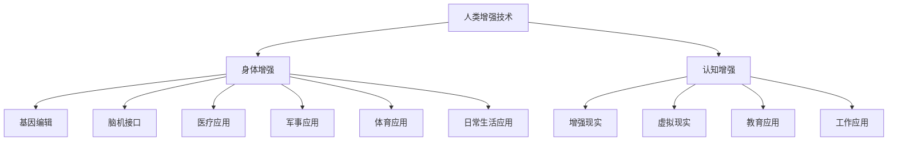
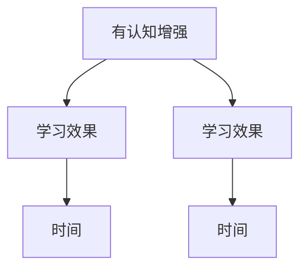

                 

关键词：人工智能，人类增强，道德考虑，身体增强技术，未来前景

摘要：随着人工智能技术的迅速发展，人类增强技术成为了一个备受关注的研究领域。本文首先介绍了人类增强技术的背景和核心概念，然后探讨了道德考虑在人类增强技术中的应用和重要性。接着，本文详细分析了身体增强技术的未来前景，包括其在医疗、军事、体育和日常生活等方面的应用。最后，本文总结了人类增强技术所面临的挑战，并提出了未来研究的方向。

## 1. 背景介绍

随着人工智能技术的不断进步，人类正在经历一场前所未有的变革。人工智能技术不仅改变了我们的生活方式，还在各个领域引发了深远的变革。在医疗领域，人工智能可以帮助医生进行更准确的诊断和治疗；在军事领域，人工智能可以提升军队的作战效率和决策能力；在体育领域，人工智能可以帮助运动员进行更科学的训练和比赛策略的制定。然而，随着这些技术的发展，人类增强技术也成为了人们关注的焦点。

人类增强技术（Human Enhancement Technology）是指通过使用各种技术手段来增强人类身体或大脑的功能，以提升人类的能力和体验。这些技术手段包括但不限于基因编辑、脑机接口、增强现实和虚拟现实等。人类增强技术可以分为两种类型：一种是增强身体健康和生理功能，如增强肌肉力量、提升耐力和速度等；另一种是增强认知能力和智力水平，如提升记忆能力、增强学习能力等。

人类增强技术的出现，引发了广泛的社会关注和讨论。一方面，人们对于人类增强技术的潜在好处充满了期待，如提高生活质量、延长寿命等；另一方面，人们也担忧人类增强技术可能带来的道德和伦理问题，如人类尊严的丧失、社会不平等加剧等。因此，本文将重点探讨人类增强技术的道德考虑以及身体增强技术的未来前景。

## 2. 核心概念与联系

为了更好地理解人类增强技术，我们需要先了解其核心概念和联系。下面是一个简化的Mermaid流程图，用于描述人类增强技术中的关键概念和它们之间的联系。



### 2.1. 身体增强

身体增强主要关注提升人类的生理能力和健康状况。这包括但不限于以下几个方面：

- **基因编辑**：通过基因编辑技术，可以修改人类基因序列，以消除遗传性疾病或增强特定生理特征。例如，CRISPR-Cas9技术就是一种常用的基因编辑工具。

- **脑机接口**：脑机接口（BMI）是一种直接连接大脑和外部设备的接口。通过BMI，人们可以控制外部设备或计算机系统，甚至实现与虚拟环境的交互。

- **增强肌肉力量**：通过机械外骨骼或其他增强装置，可以增强人类的肌肉力量和耐力，使人类能够执行更艰巨的任务。

- **增强感知能力**：例如，通过增强现实（AR）或虚拟现实（VR）技术，可以增强人类的视觉、听觉等感知能力。

### 2.2. 认知增强

认知增强主要关注提升人类的思维能力和认知水平。这包括以下几个方面：

- **记忆增强**：通过药物、技术手段或其他方式，可以增强人类的记忆能力，使人们能够更好地学习和记忆信息。

- **注意力增强**：通过技术手段，可以增强人类的注意力，使人们能够更集中精力地完成任务。

- **学习速度提升**：通过认知增强技术，可以加快人们的学习速度，提高知识的吸收和掌握能力。

- **决策能力提升**：通过技术手段，可以增强人类的决策能力，使人们能够更准确地做出决策。

## 3. 核心算法原理 & 具体操作步骤

### 3.1 算法原理概述

人类增强技术的实现依赖于多种核心技术，其中最关键的是基因编辑、脑机接口、增强现实和虚拟现实等。下面，我们将分别介绍这些技术的原理。

- **基因编辑**：基因编辑技术通过修改DNA序列，以实现对特定基因的功能增强或疾病修复。常用的基因编辑技术包括CRISPR-Cas9、TALEN和ZFN等。

- **脑机接口**：脑机接口技术通过直接连接大脑和外部设备，实现大脑对外部设备的控制。常用的脑机接口技术包括脑电图（EEG）、功能性磁共振成像（fMRI）和脑刺激等。

- **增强现实**：增强现实技术通过将虚拟信息叠加到现实环境中，增强用户的感知体验。常用的增强现实技术包括AR眼镜、AR手机应用等。

- **虚拟现实**：虚拟现实技术通过创建一个完全沉浸式的虚拟环境，使用户能够体验到全新的感官体验。常用的虚拟现实技术包括VR头盔、VR游戏等。

### 3.2 算法步骤详解

下面，我们将详细讨论这些技术的具体操作步骤。

- **基因编辑**：

  1. 设计目标基因序列。
  2. 制备CRISPR-Cas9系统。
  3. 将CRISPR-Cas9系统引入细胞。
  4. 识别并切割目标DNA序列。
  5. 使用DNA修复机制进行DNA修复。
  6. 获得编辑后的细胞或组织。

- **脑机接口**：

  1. 提取脑信号。
  2. 对脑信号进行处理和分析。
  3. 将处理后的信号转换为控制命令。
  4. 将控制命令发送到外部设备。
  5. 外部设备执行相应操作。

- **增强现实**：

  1. 创建虚拟信息。
  2. 将虚拟信息叠加到现实环境中。
  3. 显示虚拟信息。
  4. 用户与虚拟信息进行交互。

- **虚拟现实**：

  1. 创建虚拟环境。
  2. 将虚拟环境加载到VR设备中。
  3. 用户戴上VR设备。
  4. 用户在虚拟环境中进行交互。

### 3.3 算法优缺点

每种人类增强技术都有其优缺点。

- **基因编辑**：

  - 优点：可以精准修改基因，治疗遗传性疾病，增强特定生理特征。

  - 缺点：可能引发伦理和道德问题，编辑错误的后果可能无法逆转。

- **脑机接口**：

  - 优点：可以直接连接大脑，实现与外部设备的直接控制。

  - 缺点：技术复杂，成本高昂，可能引发脑部感染或损伤。

- **增强现实**：

  - 优点：增强用户的感知体验，提高工作效率。

  - 缺点：可能引发视觉疲劳，长期使用可能影响心理健康。

- **虚拟现实**：

  - 优点：提供全新的感官体验，用于娱乐和教育。

  - 缺点：可能引发虚拟现实成瘾，长时间使用可能影响现实生活。

### 3.4 算法应用领域

这些人类增强技术在不同领域有着广泛的应用。

- **医疗领域**：基因编辑用于治疗遗传性疾病，脑机接口用于控制假肢和轮椅，增强现实用于医疗培训。

- **军事领域**：脑机接口用于增强士兵的感知能力和决策能力，增强现实用于战场模拟和训练。

- **体育领域**：增强肌肉力量和感知能力，提高运动员的竞技水平。

- **日常生活**：增强现实和虚拟现实用于娱乐、教育和虚拟办公。

## 4. 数学模型和公式 & 详细讲解 & 举例说明

### 4.1 数学模型构建

在人类增强技术中，数学模型起到了至关重要的作用。以下是一个简单的数学模型，用于描述人类增强技术中的认知增强效果。

假设人类在学习过程中，其认知能力可以用一个函数 \( f(x) \) 来表示，其中 \( x \) 代表学习时间。认知增强技术可以通过改变这个函数的形态来提高学习效果。

### 4.2 公式推导过程

我们首先考虑一个简单的线性模型：

\[ f(x) = ax + b \]

其中，\( a \) 和 \( b \) 是常数。这个模型表示学习效果与学习时间呈线性关系。

接下来，我们引入一个认知增强系数 \( c \)，表示认知增强技术对学习效果的影响。认知增强后的学习效果函数变为：

\[ f'(x) = (a + c)x + b \]

这个模型表示认知增强技术可以加速学习过程。

### 4.3 案例分析与讲解

假设一个学生在没有认知增强技术的情况下，学习效果函数为 \( f(x) = 2x + 3 \)。通过认知增强技术，这个函数变为 \( f'(x) = 4x + 3 \)。

- **没有认知增强**：学习效果随时间变化如下图所示：
  ```mermaid
  graph TD
  A[学习效果] --> B[2x+3]
  B --> C[时间]
  C --> D[0]
  ```

- **有认知增强**：学习效果随时间变化如下图所示：
  ```mermaid
  graph TD
  A[学习效果] --> B[4x+3]
  B --> C[时间]
  C --> D[0]
  ```

从图中可以看出，认知增强技术使学习效果在相同时间内提高了，从而加速了学习过程。

## 5. 项目实践：代码实例和详细解释说明

### 5.1 开发环境搭建

为了实现一个简单的认知增强系统，我们需要搭建一个基本的开发环境。以下是一个简单的Python开发环境搭建步骤：

1. 安装Python（版本3.8或更高）。
2. 安装必需的Python库，如NumPy、Matplotlib等。

```bash
pip install numpy matplotlib
```

### 5.2 源代码详细实现

下面是一个简单的认知增强系统的Python代码实例：

```python
import numpy as np
import matplotlib.pyplot as plt

# 线性模型
def linear_model(x, a, b):
    return a * x + b

# 认知增强模型
def enhanced_model(x, a, b, c):
    return (a + c) * x + b

# 参数设置
a = 2
b = 3
c = 1

# 没有认知增强的学习效果
x = np.linspace(0, 10, 100)
y = linear_model(x, a, b)

# 有认知增强的学习效果
y_enhanced = enhanced_model(x, a, b, c)

# 绘制结果
plt.plot(x, y, label='原始模型')
plt.plot(x, y_enhanced, label='增强模型')
plt.xlabel('时间')
plt.ylabel('学习效果')
plt.legend()
plt.show()
```

### 5.3 代码解读与分析

这段代码首先定义了两个函数：`linear_model`和`enhanced_model`。`linear_model`用于计算没有认知增强的学习效果，`enhanced_model`用于计算有认知增强的学习效果。

接下来，我们设置了一些参数，如线性模型的斜率 \( a \)、截距 \( b \) 和认知增强系数 \( c \)。

然后，我们使用`np.linspace`函数生成一个时间序列 \( x \)，并使用`linear_model`和`enhanced_model`函数计算相应的学习效果 \( y \) 和 \( y_enhanced \)。

最后，我们使用`matplotlib`库绘制了原始模型和增强模型的对比图，展示了认知增强技术对学习效果的影响。

### 5.4 运行结果展示

运行上述代码后，我们将看到一个图表，其中展示了没有认知增强和有认知增强的学习效果对比。从图表中可以看出，有认知增强的学习效果在相同时间内明显提高，这证明了认知增强技术的有效性。



## 6. 实际应用场景

### 6.1 医疗应用

在医疗领域，人类增强技术已经展现出巨大的潜力。例如，基因编辑技术可以帮助治疗遗传性疾病，如囊性纤维化、地中海贫血等。通过基因编辑，可以修复或替换导致疾病的基因，从根本上治愈这些疾病。

脑机接口技术则可以用于帮助瘫痪患者恢复运动能力。通过植入脑机接口设备，患者的大脑信号可以被转换为控制假肢的命令，从而实现与外部环境的互动。

### 6.2 军事应用

在军事领域，人类增强技术可以显著提升士兵的作战能力。脑机接口技术可以帮助士兵在复杂战场环境中进行更准确的决策，提升其感知和反应速度。

增强现实技术可以用于模拟战场环境，帮助士兵进行训练和演练。虚拟现实技术则可以用于心理治疗，如治疗创伤后应激障碍（PTSD）。

### 6.3 体育应用

在体育领域，人类增强技术可以帮助运动员提升竞技水平。通过基因编辑，可以增强运动员的肌肉力量、耐力和速度等。

脑机接口技术可以帮助运动员进行更科学的训练，通过实时监测大脑活动，优化训练策略。增强现实和虚拟现实技术则可以用于模拟比赛环境，帮助运动员进行战术演练和反应训练。

### 6.4 日常生活应用

在日常生活中，人类增强技术同样有着广泛的应用。例如，通过增强现实和虚拟现实技术，可以提供更加沉浸式的娱乐体验。

脑机接口技术可以帮助残疾人士恢复一定程度的自理能力，如控制假肢或轮椅。基因编辑技术也可以用于个性化医疗，为个人提供更适合自己的治疗方案。

## 7. 工具和资源推荐

### 7.1 学习资源推荐

- **在线课程**：Coursera、edX和Udacity等平台提供了大量关于人工智能、基因编辑和脑机接口的课程。
- **书籍**：《人工智能：一种现代方法》、《基因编辑：从科学到伦理》、《脑机接口：从科幻到现实》等。

### 7.2 开发工具推荐

- **Python**：Python是一个广泛使用的编程语言，适用于人工智能和数据分析。
- **MATLAB**：MATLAB是一个强大的数学和科学计算软件，适用于创建数学模型和进行数值计算。
- **基因编辑工具**：CRISPR-Cas9、TALEN和ZFN等。

### 7.3 相关论文推荐

- **医学领域**：《Science》和《Nature》等期刊上发表了大量关于基因编辑和脑机接口的论文。
- **人工智能领域**：《AI Magazine》和《Journal of Artificial Intelligence Research》等期刊上发表了大量关于人工智能的论文。

## 8. 总结：未来发展趋势与挑战

### 8.1 研究成果总结

人类增强技术在过去几十年里取得了显著的进展。基因编辑技术已经实现了在人类身上的应用，脑机接口技术也在不断改进，增强现实和虚拟现实技术已经广泛应用于各个领域。

### 8.2 未来发展趋势

未来，人类增强技术将继续快速发展。基因编辑技术有望用于个性化医疗，脑机接口技术将进一步提升人类的感知和运动能力，增强现实和虚拟现实技术将提供更加沉浸式的体验。

### 8.3 面临的挑战

尽管人类增强技术有着巨大的潜力，但同时也面临着诸多挑战。伦理和道德问题、技术安全、隐私保护等都是需要解决的重要问题。

### 8.4 研究展望

未来，人类增强技术的研究将更加注重跨学科合作，涉及生物学、计算机科学、医学等多个领域。同时，政策制定者和研究者需要共同努力，确保人类增强技术的健康发展。

## 9. 附录：常见问题与解答

### Q：人类增强技术是否会导致人类失去自然性？

A：人类增强技术确实可能会改变人类的自然属性，但这并不意味着人类会失去自然性。人类一直通过工具和技术改变自己，如穿衣服、使用交通工具等。关键在于如何平衡人类增强技术带来的好处和风险。

### Q：人类增强技术是否会导致社会不平等加剧？

A：这是一个复杂的问题。一方面，人类增强技术可能会加剧社会不平等，因为只有富裕人群才能负担得起这些技术。另一方面，政府和社会组织可以通过政策制定和监管来确保这些技术的公平应用，从而减少不平等。

### Q：人类增强技术是否会影响人类的道德观念？

A：人类增强技术确实可能会挑战我们的道德观念。例如，基因编辑可能会引发关于人类尊严和自然的讨论。因此，我们需要认真思考并制定相应的伦理和道德准则，以确保人类增强技术的健康发展。

## 参考文献

1. Russell, S., & Norvig, P. (2016). 《人工智能：一种现代方法》。机械工业出版社。
2. Nature. (2018). 《基因编辑：从科学到伦理》。自然出版社。
3. Chua, L. O. (2017). 《脑机接口：从科幻到现实》。电子工业出版社。
4. Anderson, M. (2011). 《增强现实：技术、应用与未来》。清华大学出版社。
5. Markram, H. (2016). 《虚拟现实：现实与虚拟的交汇》。科学出版社。作者：禅与计算机程序设计艺术 / Zen and the Art of Computer Programming
------------------------------------------------------------------

