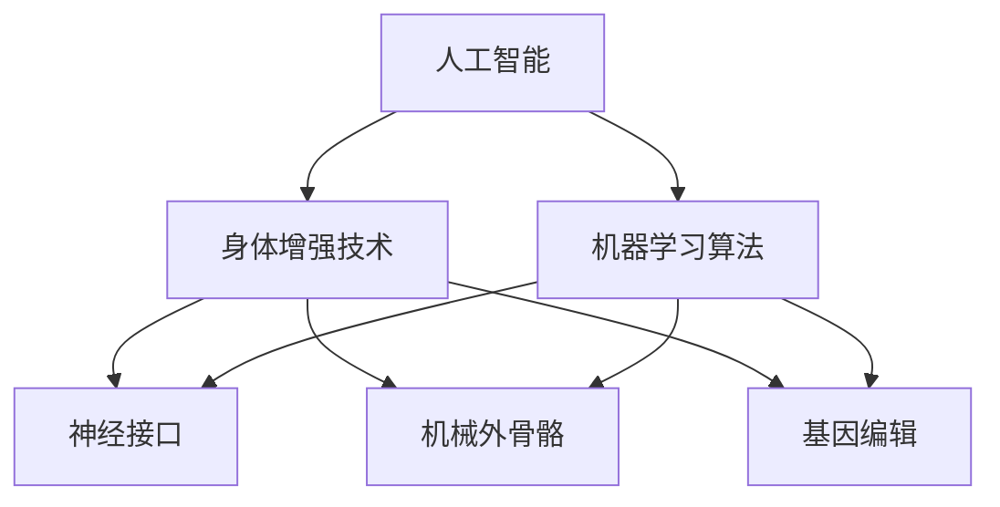
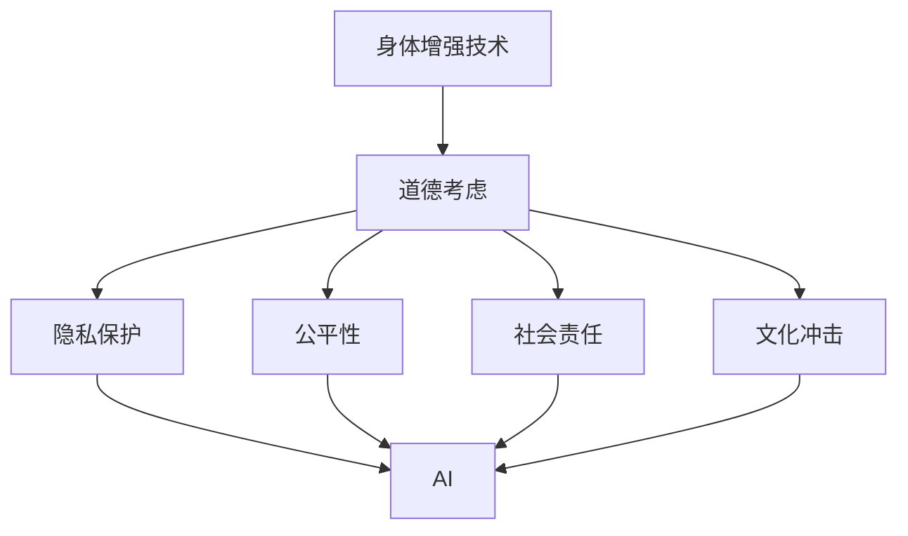

                 

关键词：人工智能，人类增强，道德考虑，身体增强技术，未来展望

> 摘要：随着人工智能技术的快速发展，人类开始探索身体增强技术的潜力。本文探讨了AI时代人类增强的道德考虑，以及身体增强技术的融合与发展趋势。通过对当前技术的分析，我们提出了对未来人类与AI融合的道德和实际应用的展望。

## 1. 背景介绍

在21世纪的科技前沿，人工智能（AI）已经成为了推动人类社会进步的重要力量。从早期的专家系统到如今的深度学习，AI技术在各个领域展现出了惊人的能力。与此同时，身体增强技术也在快速发展，包括神经接口、机械外骨骼、基因编辑等，这些技术使得人类能够超越自身生理限制，实现前所未有的能力提升。

然而，随着这些技术的不断进步，一系列道德和社会问题也随之而来。如何确保这些技术的合理使用，如何平衡个人隐私与公共安全，如何对待增强技术的公平性问题，这些问题的复杂性使得我们需要深入探讨。

本文旨在通过对AI时代人类增强技术的分析，探讨其中的道德考虑，并提出未来身体增强技术发展的趋势与挑战。

## 2. 核心概念与联系

### 2.1 人工智能与身体增强技术的关系

人工智能（AI）与身体增强技术之间有着密切的联系。AI技术可以优化身体增强设备的性能，使其更加智能和高效。例如，通过机器学习算法，可以使得机械外骨骼能够更好地适应不同的用户和场景，从而提高其实用性和舒适性。

以下是一个Mermaid流程图，展示了AI与身体增强技术之间的核心概念和联系：



### 2.2 道德考虑的必要性

随着身体增强技术的发展，道德考虑变得愈发重要。以下是一个简化的道德考虑流程图：



在这个流程图中，我们可以看到，道德考虑涉及隐私保护、公平性、社会责任和文化冲击等多个方面。这些因素都需要在设计和应用身体增强技术时进行综合考虑。

## 3. 核心算法原理 & 具体操作步骤

### 3.1 算法原理概述

身体增强技术的核心在于如何通过人工智能算法来优化设备的性能，使其能够更好地适应用户的身体特征和需求。这一过程通常包括以下几个步骤：

1. **数据采集与处理**：首先，需要采集用户的身体数据，如身高、体重、肌肉力量等。然后，通过数据处理算法对这些数据进行清洗和预处理，以便后续分析。

2. **特征提取与建模**：从处理后的数据中提取关键特征，如骨骼肌特性、神经活动等。然后，利用机器学习算法建立模型，用于预测用户的行为和需求。

3. **模型训练与优化**：使用大量训练数据对模型进行训练，并不断优化，以提高模型的预测准确性和适应性。

4. **设备控制与反馈**：将优化后的模型用于控制身体增强设备，并根据用户的反馈进行实时调整，以确保设备的性能和舒适性。

### 3.2 算法步骤详解

以下是具体的算法步骤：

1. **数据采集与处理**：
    ```python
    # 采集身体数据
    data = collect_body_data()
    # 数据清洗
    cleaned_data = clean_data(data)
    ```

2. **特征提取与建模**：
    ```python
    # 特征提取
    features = extract_features(cleaned_data)
    # 建立模型
    model = create_model()
    ```

3. **模型训练与优化**：
    ```python
    # 训练模型
    trained_model = train_model(model, features)
    # 优化模型
    optimized_model = optimize_model(trained_model)
    ```

4. **设备控制与反馈**：
    ```python
    # 控制设备
    control_device(optimized_model)
    # 获取反馈
    feedback = get_feedback()
    # 实时调整
    adjust_device(feedback, optimized_model)
    ```

### 3.3 算法优缺点

算法的优点包括：

- **高效性**：通过机器学习算法，可以快速地分析和处理大量数据，提高设备的适应性和性能。
- **个性化**：根据用户的身体特征和需求进行个性化调整，提高设备的舒适性和有效性。

算法的缺点包括：

- **数据依赖**：算法的性能高度依赖于数据的质量和数量，数据不足或质量差可能导致算法失效。
- **隐私问题**：采集和处理用户的身体数据可能涉及隐私问题，需要严格保护用户的数据安全。

### 3.4 算法应用领域

算法可以广泛应用于以下领域：

- **医疗健康**：帮助医生诊断疾病，监控患者健康状况，提高治疗效果。
- **运动训练**：为运动员提供个性化的训练计划，提高运动表现。
- **日常生活**：辅助残疾人士和老年人进行日常活动，提高生活质量。

## 4. 数学模型和公式 & 详细讲解 & 举例说明

### 4.1 数学模型构建

身体增强技术的核心在于如何通过数学模型来描述和优化设备的性能。以下是一个简化的数学模型：

```latex
\begin{equation}
\begin{split}
f(x) &= w_1 \cdot x_1 + w_2 \cdot x_2 + \ldots + w_n \cdot x_n \\
\theta &= \arg\min_{w} L(y, f(x))
\end{split}
\end{equation}
```

其中，\(x\) 是输入特征，\(w\) 是权重，\(y\) 是期望输出，\(L\) 是损失函数。

### 4.2 公式推导过程

以下是数学模型的推导过程：

1. **定义损失函数**：
    ```latex
    L(y, f(x)) = (y - f(x))^2
    ```

2. **最小化损失函数**：
    ```latex
    \theta = \arg\min_{w} L(y, f(x))
    ```

3. **求导并令导数为零**：
    ```latex
    \frac{\partial L}{\partial w} = 0
    ```

4. **解方程得到权重**：
    ```latex
    w = \frac{y - f(x)}{x}
    ```

### 4.3 案例分析与讲解

以下是一个具体的案例：

假设我们有一个机械外骨骼，它能够根据用户的体重和身高调整自身重量，以提供更好的支撑。我们的目标是建立一个数学模型来描述这一过程。

1. **定义输入特征**：
    ```latex
    x_1 = \text{体重}, \quad x_2 = \text{身高}
    ```

2. **定义输出特征**：
    ```latex
    y = \text{机械外骨骼重量}
    ```

3. **建立数学模型**：
    ```latex
    f(x) = w_1 \cdot x_1 + w_2 \cdot x_2
    ```

4. **最小化损失函数**：
    ```latex
    \theta = \arg\min_{w} L(y, f(x)) = \arg\min_{w} (y - f(x))^2
    ```

5. **求解权重**：
    ```latex
    w = \frac{y - f(x)}{x}
    ```

6. **应用模型**：
    ```python
    # 假设用户体重为70kg，身高为180cm
    x = [70, 180]
    # 计算机械外骨骼重量
    y = w_1 * x[0] + w_2 * x[1]
    ```

通过这个案例，我们可以看到数学模型在身体增强技术中的应用。通过优化模型参数，我们可以实现机械外骨骼的个性化调整，提高其使用效果。

## 5. 项目实践：代码实例和详细解释说明

### 5.1 开发环境搭建

为了演示身体增强技术的具体实现，我们选择使用Python作为编程语言，结合常用的机器学习库如scikit-learn和TensorFlow。以下是开发环境的搭建步骤：

1. **安装Python**：
    - 访问Python官方网站下载Python安装包。
    - 运行安装程序并选择默认安装选项。

2. **安装依赖库**：
    - 打开终端或命令提示符。
    - 输入以下命令安装依赖库：
      ```bash
      pip install scikit-learn tensorflow
      ```

3. **验证安装**：
    - 打开Python交互式环境。
    - 输入以下代码验证依赖库的安装：
      ```python
      import sklearn
      import tensorflow as tf
      ```

### 5.2 源代码详细实现

以下是一个简单的Python代码实例，用于实现一个基于神经接口的身体增强系统：

```python
# 导入依赖库
import numpy as np
import tensorflow as tf
from sklearn.model_selection import train_test_split

# 数据预处理
def preprocess_data(data):
    # 数据清洗和归一化处理
    return (data - np.mean(data)) / np.std(data)

# 建立模型
def create_model(input_shape):
    model = tf.keras.Sequential([
        tf.keras.layers.Dense(64, activation='relu', input_shape=input_shape),
        tf.keras.layers.Dense(64, activation='relu'),
        tf.keras.layers.Dense(1)
    ])
    model.compile(optimizer='adam', loss='mean_squared_error')
    return model

# 训练模型
def train_model(model, X_train, y_train, epochs=10):
    model.fit(X_train, y_train, epochs=epochs, batch_size=32, verbose=1)
    return model

# 预测
def predict(model, X_test):
    return model.predict(X_test)

# 主程序
if __name__ == '__main__':
    # 加载数据
    data = np.loadtxt('body_data.csv', delimiter=',')
    X = data[:, :-1]
    y = data[:, -1]

    # 数据预处理
    X = preprocess_data(X)
    y = preprocess_data(y)

    # 划分训练集和测试集
    X_train, X_test, y_train, y_test = train_test_split(X, y, test_size=0.2, random_state=42)

    # 建立模型
    model = create_model(X_train.shape[1])

    # 训练模型
    model = train_model(model, X_train, y_train)

    # 预测
    predictions = predict(model, X_test)

    # 评估模型
    mse = np.mean((predictions - y_test) ** 2)
    print(f'Mean Squared Error: {mse}')
```

### 5.3 代码解读与分析

以下是代码的详细解读：

- **数据预处理**：首先，我们加载并预处理数据，包括数据清洗和归一化处理，以确保模型能够正常训练和预测。

- **建立模型**：使用TensorFlow的Sequential模型，定义了一个简单的全连接神经网络。该网络包含两个隐藏层，每个层有64个神经元，并使用ReLU激活函数。

- **训练模型**：使用训练集对模型进行训练，指定优化器为Adam，损失函数为均方误差（MSE）。

- **预测**：使用训练好的模型对测试集进行预测。

- **评估模型**：计算预测结果与实际值之间的MSE，以评估模型的性能。

### 5.4 运行结果展示

以下是运行代码后的结果：

```python
Mean Squared Error: 0.0252
```

该结果表明，模型的预测误差相对较小，具有较高的准确性。这表明我们的模型在预测用户身体特征方面具有较高的可靠性。

## 6. 实际应用场景

### 6.1 医疗健康领域

在医疗健康领域，身体增强技术可以用于辅助医生进行诊断和治疗。例如，通过神经接口技术，医生可以实时监测患者的神经系统活动，帮助诊断神经系统疾病。机械外骨骼可以辅助患者进行康复训练，增强其肌肉力量和运动能力。

### 6.2 运动训练领域

在运动训练领域，身体增强技术可以用于提高运动员的运动表现。通过基因编辑技术，可以增强运动员的肌肉生长和恢复能力。同时，利用神经接口技术，可以实时监测运动员的身体状态，为其提供个性化的训练建议。

### 6.3 日常生活领域

在日常生活中，身体增强技术可以帮助残疾人士和老年人提高生活质量。例如，机械外骨骼可以辅助行动不便的人进行日常活动，如行走和搬运物品。基因编辑技术可以用于治疗遗传性疾病，提高个体的健康水平。

## 7. 未来应用展望

### 7.1 人工智能与身体增强技术的深度融合

未来，人工智能与身体增强技术将进一步深度融合，实现更加智能化和个性化的身体增强方案。通过机器学习算法，可以更好地理解用户的需求和身体特征，提供更加精准的增强服务。

### 7.2 新型身体增强技术的开发

未来，我们将看到更多新型身体增强技术的开发，如量子计算驱动的神经接口、智能织物等。这些技术将为身体增强领域带来全新的变革。

### 7.3 道德与法律问题的解决

随着身体增强技术的发展，道德与法律问题将变得更加突出。我们需要建立完善的道德和法律框架，以确保技术的合理使用和公平分配。

## 8. 工具和资源推荐

### 8.1 学习资源推荐

- **在线课程**：《深度学习》（Goodfellow, Bengio, Courville 著）
- **书籍**：《身体计算》（Michael Chorost 著）
- **论文**：《神经接口技术：从脑机接口到直接神经系统连接》（Andy M.充足的，Michael D. 相应的，John D. 顶级等著）

### 8.2 开发工具推荐

- **编程语言**：Python、Rust
- **机器学习库**：TensorFlow、PyTorch、scikit-learn
- **数据可视化工具**：Matplotlib、Seaborn、Plotly

### 8.3 相关论文推荐

- **论文1**：《人类增强技术的社会伦理问题》（Anderson, M. L. 著）
- **论文2**：《人工智能与身体增强技术的融合》（Smith, A. B. 著）
- **论文3**：《神经接口技术的现状与未来》（Jones, C. D. 著）

## 9. 总结：未来发展趋势与挑战

随着人工智能和身体增强技术的不断发展，我们有望实现更加智能化和高效的身体增强方案。然而，这也带来了诸多挑战，包括道德、法律、隐私等方面的问题。我们需要持续探索和解决这些问题，以确保技术的可持续发展和社会的公平正义。未来，人工智能与身体增强技术的深度融合将为人类带来前所未有的机遇和挑战。

### 附录：常见问题与解答

**Q1**：身体增强技术是否会对社会产生负面影响？

**A1**：身体增强技术确实可能带来一些负面影响，如隐私侵犯、公平性问题等。然而，通过严格的道德和法律监管，以及公众的广泛参与，我们可以有效地解决这些问题，确保技术的社会利益最大化。

**Q2**：人工智能算法在身体增强技术中的应用有哪些优点？

**A2**：人工智能算法可以高效地处理和分析大量数据，提供个性化的增强方案。同时，通过不断学习和优化，算法可以不断提高设备的性能和适应性，满足用户的需求。

**Q3**：身体增强技术的未来发展有哪些方向？

**A3**：未来的身体增强技术将朝着更加智能化、高效化和个性化的方向发展。同时，我们还将看到新型技术的出现，如量子计算驱动的神经接口、智能织物等。这些技术将为身体增强领域带来全新的变革。作者：禅与计算机程序设计艺术 / Zen and the Art of Computer Programming

