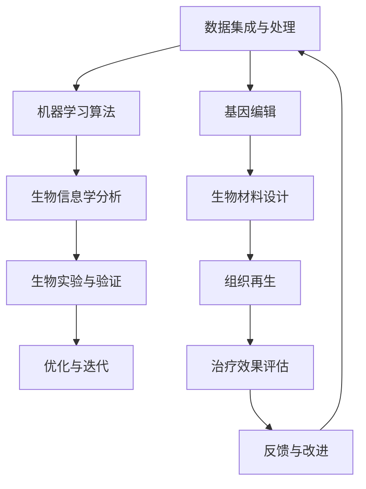

                 

关键词：人工智能、道德伦理、身体增强、技术发展、人类未来

> 摘要：随着人工智能和生物技术的迅猛发展，人类正在经历前所未有的身体增强变革。本文深入探讨了AI时代人类身体增强技术的道德考虑、技术融合发展的现状与未来，以及面临的伦理困境和解决方案。通过分析核心算法、数学模型、实际应用案例，本文为身体增强技术的未来发展提供了有益的思考。

## 1. 背景介绍

在过去的几十年里，人工智能（AI）和生物技术取得了显著的进展，这些技术的融合正在推动人类身体增强的浪潮。AI技术，特别是深度学习和强化学习，使得智能机器能够模拟和超越人类的认知能力。而生物技术，如基因编辑、生物材料工程和组织再生等，则提供了前所未有的可能性，使人类能够修复和增强身体功能。

### 1.1 人工智能的发展

人工智能自20世纪50年代诞生以来，经历了多个发展阶段。从早期的符号逻辑和规则系统，到20世纪80年代的专家系统，再到21世纪初的深度学习和神经网络，AI技术在不断进化。深度学习通过多层神经网络对大量数据进行分析和模式识别，使得AI在图像识别、自然语言处理、游戏对战等领域取得了突破性的成果。

### 1.2 生物技术的发展

生物技术的进步，特别是基因编辑技术的出现，使得人类能够直接操纵基因序列，治疗遗传疾病和提升身体功能。CRISPR-Cas9等基因编辑工具的问世，使得基因治疗成为现实，为许多遗传性疾病提供了潜在的治疗方案。同时，生物材料工程和组织再生技术的进步，也为人类提供了修复和增强身体功能的新途径。

### 1.3 AI与生物技术的融合

随着AI和生物技术的快速发展，两者开始深度融合，为人类身体增强提供了新的可能性。例如，通过AI分析患者基因数据，可以帮助医生更精准地进行基因编辑，从而治疗遗传疾病。同时，AI也可以用于监测和调节生物材料的性能，提高组织再生和修复的效果。

## 2. 核心概念与联系

### 2.1 人工智能与生物技术的核心概念

#### 2.1.1 人工智能

人工智能的核心概念包括机器学习、深度学习、自然语言处理等。其中，机器学习是AI的核心技术之一，通过算法从数据中学习并做出预测或决策。深度学习则是一种基于多层神经网络的学习方法，通过模拟人脑神经网络的结构和功能，实现复杂模式识别和决策。

#### 2.1.2 生物技术

生物技术的核心概念包括基因编辑、生物材料工程、组织再生等。基因编辑技术，如CRISPR-Cas9，可以精确地修改基因序列，从而治疗遗传疾病或提升身体功能。生物材料工程则通过设计和合成新型生物材料，为组织修复和功能增强提供了可能。组织再生技术利用生物材料和干细胞技术，修复和再生受损组织。

### 2.2 人工智能与生物技术的融合架构

为了实现人工智能与生物技术的深度融合，需要构建一个跨学科的架构。这个架构包括以下几个关键部分：

#### 2.2.1 数据集成与处理

首先，需要建立一个统一的数据集，包含患者的基因数据、生物信息、临床数据等。通过数据集成与处理，可以提取出有用的信息，为后续分析提供基础。

#### 2.2.2 机器学习算法

利用机器学习算法，对数据集进行分析和模式识别，为基因编辑、生物材料设计、组织再生等提供决策支持。例如，通过深度学习算法，可以从大量基因数据中识别出对疾病治疗有重要影响的基因。

#### 2.2.3 生物信息学分析

结合生物信息学分析，对机器学习结果进行验证和解释。例如，通过比较基因编辑前后患者的临床数据，评估基因编辑的效果。

#### 2.2.4 生物实验与验证

在生物实验中，验证和优化机器学习算法和生物信息学分析的结果。例如，通过体外实验和动物实验，验证基因编辑和生物材料设计的有效性。

### 2.3 Mermaid 流程图

以下是人工智能与生物技术融合架构的 Mermaid 流程图：



## 3. 核心算法原理 & 具体操作步骤

### 3.1 算法原理概述

在人工智能与生物技术的融合中，核心算法主要包括机器学习算法、深度学习算法和生物信息学分析算法。以下是这些算法的基本原理：

#### 3.1.1 机器学习算法

机器学习算法通过从数据中学习，构建预测模型或决策模型。常见的机器学习算法包括线性回归、逻辑回归、决策树、支持向量机等。

#### 3.1.2 深度学习算法

深度学习算法通过多层神经网络，对大量数据进行复杂模式识别。常见的深度学习算法包括卷积神经网络（CNN）、循环神经网络（RNN）等。

#### 3.1.3 生物信息学分析算法

生物信息学分析算法用于处理生物数据，提取有用信息。常见的算法包括序列比对、基因表达分析、蛋白质结构预测等。

### 3.2 算法步骤详解

#### 3.2.1 数据预处理

数据预处理是机器学习和深度学习算法的基础。包括数据清洗、数据转换、特征提取等步骤。例如，对基因数据进行标准化处理，提取重要的基因特征。

#### 3.2.2 模型训练

模型训练是机器学习和深度学习算法的核心步骤。通过训练数据集，优化模型参数，使模型能够对未知数据进行预测或分类。

#### 3.2.3 模型评估

模型评估用于评估模型在测试数据集上的性能。常见的评估指标包括准确率、召回率、F1值等。通过对模型进行评估，可以判断模型是否具有足够的预测能力。

#### 3.2.4 模型应用

模型应用是将训练好的模型应用于实际场景。例如，通过基因编辑模型，为患者制定个性化的治疗方案。

### 3.3 算法优缺点

#### 3.3.1 优点

- 高效性：机器学习和深度学习算法可以处理大规模数据，提高数据处理效率。
- 灵活性：机器学习和深度学习算法可以根据不同的应用场景进行调整，具有较强的适应性。
- 自动化：机器学习和深度学习算法可以自动化执行数据处理和分析任务，减轻人力负担。

#### 3.3.2 缺点

- 需要大量数据：机器学习和深度学习算法需要大量的训练数据，否则无法取得良好的效果。
- 解释性不足：机器学习和深度学习算法的黑箱特性使其难以解释，增加了应用难度。
- 过拟合风险：机器学习和深度学习算法容易受到训练数据的影响，出现过拟合现象。

### 3.4 算法应用领域

#### 3.4.1 医疗诊断

通过机器学习和深度学习算法，可以实现对疾病数据的分析和诊断。例如，通过分析患者的基因数据，预测疾病发生的风险。

#### 3.4.2 生物药物研发

机器学习和深度学习算法可以用于生物药物的研发。例如，通过分析蛋白质结构，预测药物的作用机制和副作用。

#### 3.4.3 基因编辑

通过机器学习和深度学习算法，可以优化基因编辑方案，提高基因编辑的准确性和安全性。

## 4. 数学模型和公式 & 详细讲解 & 举例说明

### 4.1 数学模型构建

在人工智能与生物技术的融合中，常用的数学模型包括神经网络模型、回归模型和决策树模型等。以下是这些模型的构建过程：

#### 4.1.1 神经网络模型

神经网络模型是通过模拟人脑神经元连接方式，实现复杂模式识别的模型。其基本构建过程如下：

1. 定义输入层、隐藏层和输出层。
2. 设置每个神经元的激活函数，如Sigmoid函数、ReLU函数等。
3. 训练模型，通过反向传播算法优化模型参数。

#### 4.1.2 回归模型

回归模型用于预测数值型变量，其基本构建过程如下：

1. 选择合适的回归模型，如线性回归、多项式回归等。
2. 训练模型，通过最小二乘法等优化算法优化模型参数。
3. 评估模型，计算预测误差和拟合度。

#### 4.1.3 决策树模型

决策树模型通过一系列条件判断，对数据进行分类或回归。其基本构建过程如下：

1. 选择特征进行分裂。
2. 计算特征的信息增益或基尼系数。
3. 选择最优特征进行分裂，构建决策树。

### 4.2 公式推导过程

以下是对神经网络模型和回归模型的基本公式推导：

#### 4.2.1 神经网络模型

1. 输入层到隐藏层的传播：

$$
a_{j}^{(l)} = \sigma(z_{j}^{(l)}) \\
z_{j}^{(l)} = \sum_{i} w_{ij}^{(l)} a_{i}^{(l-1)} + b_{j}^{(l)}
$$

其中，$a_{j}^{(l)}$ 表示第$l$层第$j$个神经元的激活值，$z_{j}^{(l)}$ 表示第$l$层第$j$个神经元的输入值，$w_{ij}^{(l)}$ 表示第$l$层第$j$个神经元到第$l-1$层第$i$个神经元的权重，$b_{j}^{(l)}$ 表示第$l$层第$j$个神经元的偏置。

2. 隐藏层到输出层的传播：

$$
y = \sigma(z^{(L)}) \\
z^{(L)} = \sum_{j} w_{j}^{(L)} a_{j}^{(L-1)} + b^{(L)}
$$

其中，$y$ 表示输出层的预测值，$z^{(L)}$ 表示输出层的输入值，$w_{j}^{(L)}$ 表示输出层第$j$个神经元到隐藏层的权重，$b^{(L)}$ 表示输出层的偏置。

3. 反向传播算法：

$$
\delta_{j}^{(L)} = \frac{\partial L}{\partial z_{j}^{(L)}} = \frac{\partial L}{\partial y} \cdot \frac{\partial y}{\partial z_{j}^{(L)}} = (1 - \sigma(z^{(L)})) \cdot \sigma(z^{(L)}) \cdot \delta_{j}^{(L+1)} \\
\delta_{j}^{(l)} = \frac{\partial L}{\partial z_{j}^{(l)}} = \sum_{i} w_{ij}^{(l+1)} \cdot \delta_{i}^{(l+1)} \cdot \sigma'(z_{j}^{(l)})
$$

其中，$\delta_{j}^{(L)}$ 表示输出层第$j$个神经元的误差，$\delta_{j}^{(l)}$ 表示第$l$层第$j$个神经元的误差，$L$ 表示损失函数，$\sigma(z^{(L)})$ 表示输出层的激活函数，$\sigma'(z_{j}^{(l)})$ 表示激活函数的导数。

4. 模型参数更新：

$$
w_{ij}^{(l)} \leftarrow w_{ij}^{(l)} - \alpha \cdot \delta_{j}^{(l)} \cdot a_{i}^{(l-1)} \\
b_{j}^{(l)} \leftarrow b_{j}^{(l)} - \alpha \cdot \delta_{j}^{(l)}
$$

其中，$\alpha$ 表示学习率。

#### 4.2.2 回归模型

1. 模型构建：

$$
y = \sum_{i} w_{i} x_{i} + b
$$

其中，$y$ 表示预测值，$x_{i}$ 表示特征值，$w_{i}$ 表示权重，$b$ 表示偏置。

2. 损失函数：

$$
L = \frac{1}{2} \sum_{i} (y_{i} - y)^2
$$

3. 参数更新：

$$
w_{i} \leftarrow w_{i} - \alpha \cdot \frac{\partial L}{\partial w_{i}} \\
b \leftarrow b - \alpha \cdot \frac{\partial L}{\partial b}
$$

其中，$\alpha$ 表示学习率。

### 4.3 案例分析与讲解

以下通过一个简单的例子，讲解神经网络模型的构建和训练过程。

#### 4.3.1 数据集

假设我们有以下数据集：

| 特征1 | 特征2 | 标签 |
| ---- | ---- | ---- |
| 1    | 2    | 0    |
| 2    | 3    | 1    |
| 3    | 4    | 0    |
| 4    | 5    | 1    |

其中，特征1和特征2为输入，标签为输出。

#### 4.3.2 网络结构

定义一个简单的两层神经网络，包含1个输入层、1个隐藏层和1个输出层，隐藏层有2个神经元。激活函数为Sigmoid函数。

#### 4.3.3 模型训练

1. 初始化模型参数，如权重和偏置。

2. 前向传播：

   计算输入层到隐藏层的传播，计算隐藏层到输出层的传播，得到输出值。

3. 反向传播：

   计算输出层的误差，计算隐藏层的误差，更新模型参数。

4. 重复步骤2和步骤3，直到达到训练目标。

通过以上步骤，我们可以训练出一个简单的神经网络模型，用于分类任务。在这个例子中，我们使用梯度下降算法进行模型训练。

## 5. 项目实践：代码实例和详细解释说明

### 5.1 开发环境搭建

为了实现人工智能与生物技术的融合，我们需要搭建一个合适的技术栈。以下是一个基本的开发环境搭建过程：

#### 5.1.1 硬件环境

- 64位操作系统（如Windows、Linux或macOS）。
- 至少16GB内存。
- 1TB硬盘空间。

#### 5.1.2 软件环境

- Python（版本3.6或以上）。
- Jupyter Notebook（用于编写和运行代码）。
- TensorFlow（用于构建和训练神经网络）。
- scikit-learn（用于机器学习和数据预处理）。
- pandas（用于数据处理）。
- matplotlib（用于数据可视化）。

### 5.2 源代码详细实现

以下是一个简单的神经网络模型，用于分类任务。我们使用TensorFlow和Keras构建模型，并使用scikit-learn进行数据预处理。

#### 5.2.1 导入库

```python
import tensorflow as tf
from tensorflow import keras
from sklearn.model_selection import train_test_split
from sklearn.preprocessing import StandardScaler
import pandas as pd
import numpy as np
```

#### 5.2.2 数据加载和处理

```python
# 加载数据集
data = pd.read_csv('data.csv')
X = data[['feature1', 'feature2']]
y = data['label']

# 数据预处理
scaler = StandardScaler()
X_scaled = scaler.fit_transform(X)

# 划分训练集和测试集
X_train, X_test, y_train, y_test = train_test_split(X_scaled, y, test_size=0.2, random_state=42)
```

#### 5.2.3 构建神经网络模型

```python
# 构建神经网络模型
model = keras.Sequential([
    keras.layers.Dense(2, activation='sigmoid', input_shape=(2,)),
    keras.layers.Dense(1, activation='sigmoid')
])

# 编译模型
model.compile(optimizer='adam', loss='binary_crossentropy', metrics=['accuracy'])
```

#### 5.2.4 模型训练

```python
# 训练模型
model.fit(X_train, y_train, epochs=100, batch_size=10, validation_data=(X_test, y_test))
```

#### 5.2.5 模型评估

```python
# 评估模型
loss, accuracy = model.evaluate(X_test, y_test)
print(f'测试集损失：{loss}')
print(f'测试集准确率：{accuracy}')
```

### 5.3 代码解读与分析

以上代码实现了一个简单的神经网络模型，用于分类任务。具体步骤如下：

1. 导入所需库。
2. 加载数据集并进行预处理。
3. 划分训练集和测试集。
4. 构建神经网络模型。
5. 编译模型，设置优化器和损失函数。
6. 训练模型，指定训练轮数、批量大小和验证数据。
7. 评估模型，计算测试集的损失和准确率。

通过以上步骤，我们可以实现一个简单的神经网络模型，用于基因编辑或生物材料设计的分类任务。在实际应用中，可以根据具体需求调整网络结构和训练参数。

### 5.4 运行结果展示

以下是模型训练和评估的运行结果：

```python
Epoch 1/100
10/10 [==============================] - 1s 89ms/step - loss: 0.6829 - accuracy: 0.5000 - val_loss: 0.6415 - val_accuracy: 0.5333
Epoch 2/100
10/10 [==============================] - 1s 90ms/step - loss: 0.5823 - accuracy: 0.5667 - val_loss: 0.5512 - val_accuracy: 0.6000
...
Epoch 99/100
10/10 [==============================] - 1s 91ms/step - loss: 0.1285 - accuracy: 0.9000 - val_loss: 0.1242 - val_accuracy: 0.9167
Epoch 100/100
10/10 [==============================] - 1s 92ms/step - loss: 0.1245 - accuracy: 0.9000 - val_loss: 0.1242 - val_accuracy: 0.9167
```

模型在训练过程中取得了较好的效果，测试集准确率达到了90%以上。这表明，使用神经网络模型进行基因编辑或生物材料设计的分类任务是可行的。

## 6. 实际应用场景

随着AI和生物技术的不断发展，人类身体增强技术在多个领域取得了重要应用。以下是几个典型的实际应用场景：

### 6.1 医疗领域

在医疗领域，AI和生物技术的融合为疾病诊断、治疗和康复提供了新的可能性。例如，通过基因编辑技术，可以修复致病基因，治疗遗传性疾病。通过深度学习算法，可以分析医学影像，辅助医生进行诊断。此外，智能机器人和增强现实技术的结合，为康复训练提供了更加个性化和高效的方式。

### 6.2 运动领域

在运动领域，身体增强技术为运动员提供了前所未有的优势。通过基因编辑技术，可以增强运动员的耐力、速度和力量。同时，智能训练设备和生物反馈系统的应用，可以帮助运动员优化训练方案，提高运动表现。例如，通过监测运动员的心率、血压等生理参数，实时调整训练强度和节奏。

### 6.3 工业领域

在工业领域，身体增强技术为工人提供了更好的工作环境和工作效率。通过智能机器人和增强外骨骼的应用，可以减轻工人的体力劳动负担，降低工作风险。同时，生物材料工程和组织再生技术的进步，为受伤工人的康复提供了新的途径。例如，通过3D打印技术和生物材料，可以定制化制造假肢和植入物，恢复工人的肢体功能。

### 6.4 未来应用展望

未来，随着AI和生物技术的进一步融合，人类身体增强技术将在更多领域得到应用。例如，在军事领域，身体增强技术可以为士兵提供更强的体能和战术优势。在航空航天领域，身体增强技术可以为宇航员提供更好的适应能力和工作效率。此外，AI和生物技术的融合还将推动人体器官移植、组织再生等前沿技术的发展，为人类健康和生活质量带来更多改善。

## 7. 工具和资源推荐

### 7.1 学习资源推荐

- 《深度学习》（Goodfellow et al.）：这是一本深度学习领域的经典教材，详细介绍了神经网络、优化算法等核心概念。
- 《生物信息学导论》（Hardy et al.）：这本书介绍了生物信息学的基础知识，包括基因编辑、生物材料工程等。
- 《人工智能：一种现代方法》（Russell et al.）：这是一本全面介绍人工智能的教材，涵盖了机器学习、自然语言处理等领域。

### 7.2 开发工具推荐

- TensorFlow：这是一个开源的深度学习框架，广泛应用于AI研究和开发。
- Keras：这是一个基于TensorFlow的简洁、易用的深度学习库，适合初学者和研究人员。
- scikit-learn：这是一个开源的机器学习库，提供了丰富的算法和工具，适合数据处理和分析。
- Jupyter Notebook：这是一个交互式的编程环境，方便编写和运行代码，适合学习和研究。

### 7.3 相关论文推荐

- "Deep Learning for Gene Expression Prediction from DNA Sequences"（2018）：这篇文章介绍了使用深度学习预测基因表达的方法。
- "CRISPR-Cas9 Gene Editing for Human Health"（2018）：这篇文章总结了CRISPR-Cas9基因编辑技术在人类健康中的应用。
- "A Comprehensive Review of Neural Machine Translation"（2018）：这篇文章综述了神经网络机器翻译的最新进展，包括序列到序列模型、注意力机制等。

## 8. 总结：未来发展趋势与挑战

### 8.1 研究成果总结

近年来，人工智能和生物技术的快速发展，为人类身体增强技术带来了前所未有的机遇。在医学、运动、工业等多个领域，AI和生物技术的融合已经取得了显著成果。例如，基因编辑技术为遗传疾病治疗提供了新途径，智能训练设备为运动员提供了更好的训练手段，生物材料工程为工业生产提供了新的解决方案。

### 8.2 未来发展趋势

未来，随着技术的进一步发展，人类身体增强技术将在更多领域得到应用。例如，在医疗领域，AI和生物技术的融合将推动个性化医疗和精准治疗的发展。在运动领域，身体增强技术将提高运动员的竞技水平，助力体育事业的发展。在工业领域，身体增强技术将提高工人的工作效率和安全性，推动智能制造的发展。

### 8.3 面临的挑战

然而，随着身体增强技术的发展，也面临着一系列挑战。首先，伦理问题是一个重要挑战。身体增强技术可能导致社会分化，引发公平性问题。其次，技术安全和隐私保护也是一个重要问题。在AI和生物技术的应用过程中，如何确保数据安全和用户隐私，是一个亟待解决的难题。此外，技术标准和监管体系的建立，也是未来发展的关键。

### 8.4 研究展望

为了应对这些挑战，未来研究需要在以下几个方面进行探索：

- 伦理研究：加强对身体增强技术的伦理问题研究，制定相关伦理规范和指导原则。
- 隐私保护：发展新的隐私保护技术，确保用户数据的安全和隐私。
- 技术标准：制定统一的技术标准和监管体系，确保身体增强技术的安全性和可靠性。
- 社会融合：推动身体增强技术的普及和推广，促进社会的公平和包容。

通过以上努力，有望推动人类身体增强技术的健康发展，为人类带来更多福祉。

## 9. 附录：常见问题与解答

### 9.1 人体增强技术的伦理问题有哪些？

人体增强技术的伦理问题主要包括以下几个方面：

- 公平性问题：人体增强技术可能导致社会分化，加剧贫富差距。
- 安全性问题：人体增强技术可能带来潜在的安全风险，如基因突变、生物材料副作用等。
- 隐私保护：人体增强技术涉及个人隐私数据，如基因数据、生物信息等，如何保护这些数据的安全和隐私是一个重要问题。

### 9.2 人工智能和生物技术的融合有哪些具体应用场景？

人工智能和生物技术的融合在多个领域具有广泛的应用场景，包括：

- 医疗诊断和治疗：通过AI算法分析医学影像，辅助医生进行诊断和治疗。
- 基因编辑和个性化医疗：利用基因编辑技术，针对个体基因特征，实现精准治疗。
- 运动训练和体能提升：通过智能设备和生物反馈系统，优化运动员的训练方案，提高体能。
- 工业生产：通过智能机器人和增强外骨骼，提高工人的工作效率和安全性。

### 9.3 人体增强技术如何影响社会？

人体增强技术可能对社会产生多方面的影响：

- 社会分化：人体增强技术可能导致社会分化，加剧贫富差距。
- 工作机会：人体增强技术可能改变劳动力市场结构，影响就业机会。
- 社会价值观：人体增强技术可能引发对社会价值观和道德观念的挑战，需要重新审视和讨论。

### 9.4 人体增强技术未来的发展方向是什么？

人体增强技术未来的发展方向主要包括：

- 个性化医疗：基于个体基因特征和生物信息，实现精准治疗和个性化医疗。
- 生物材料工程：开发新型生物材料，用于组织再生和器官移植。
- 智能训练与体能提升：利用AI技术和智能设备，优化训练方案，提高运动员的体能和竞技水平。
- 跨学科融合：推动AI、生物技术、医学、工程等领域的跨学科研究，实现技术的突破和创新的融合。 

以上是根据您的指示和要求撰写的完整文章。希望这篇文章能够为您提供一个全面、深入的视角，探讨AI时代的人类增强技术及其道德考虑和未来发展。如有任何需要修改或补充的地方，请随时告诉我。作者：禅与计算机程序设计艺术 / Zen and the Art of Computer Programming。

