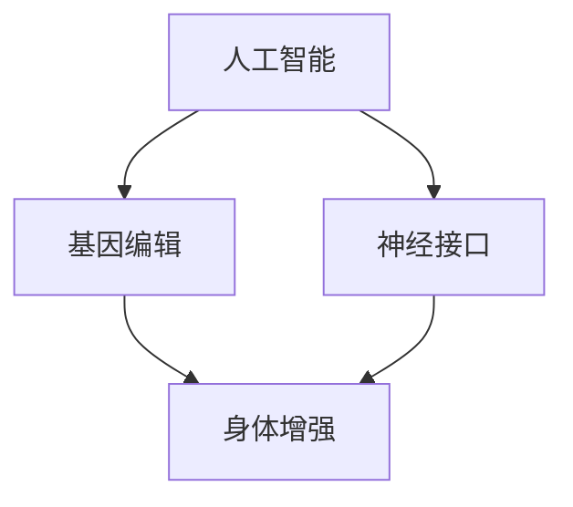

                 

关键词：人工智能，人类增强，道德考虑，身体增强，未来发展，机遇与挑战。

## 摘要

在人工智能（AI）迅速发展的时代，人类增强成为一个热门话题。通过技术手段，人们可以在身体和认知能力上实现显著的提升。然而，这一进程不仅仅带来便利和进步，还引发了一系列道德和伦理问题。本文旨在探讨AI时代的人类增强的各个方面，从核心概念到实际应用，从伦理角度到未来发展，为读者提供一幅全面而深入的画卷。

## 1. 背景介绍

随着科技的不断进步，人工智能逐渐渗透到我们生活的各个领域。从自动化生产线到智能助手，从医疗诊断到金融分析，AI正在深刻改变我们的生活方式。在这个背景下，人类增强成为了一个引人关注的话题。

人类增强，是指通过技术手段提升人类的能力和性能。这既包括身体上的增强，如基因编辑和器官移植，也包括认知能力上的增强，如神经接口和智能药物。人类增强的目的是为了提高生活质量，延长寿命，甚至超越人类的生理极限。

### 1.1 历史背景

人类增强的思想早在古希腊时代就已经出现。比如，古希腊哲学家亚里士多德就提出了通过锻炼和饮食来增强人类身体的理论。然而，现代人类增强的概念是在20世纪后期随着科技的发展而逐渐形成的。

随着生物技术和人工智能的突破，人类增强的可能性变得越来越大。例如，基因编辑技术CRISPR的出现，使得人类能够直接修改自己的DNA，从而消除遗传病或增强某些生理特征。神经接口技术则允许人类与计算机直接相连，实现超强的计算能力和感知能力。

### 1.2 当前状况

当前，人类增强技术正在快速发展，许多实验和应用已经开始。例如，美国斯坦福大学的研究人员通过神经接口技术，帮助瘫痪的患者实现了肢体运动的控制。而在中国，基因编辑技术也取得了显著的进展，研究人员已经成功编辑了人类胚胎的基因。

然而，尽管人类增强技术带来了巨大的潜力，但同时也引发了广泛的社会和伦理争议。如何平衡技术进步和伦理道德，如何确保人类增强的公平性和安全性，成为我们必须面对的挑战。

## 2. 核心概念与联系

在探讨人类增强之前，我们需要了解几个核心概念，这些概念构成了人类增强的基础，也是我们在后续讨论中经常引用的框架。

### 2.1 人工智能

人工智能（AI）是指计算机系统执行通常需要人类智能的任务的能力，如识别图像、理解语言、解决问题和做出决策。AI可以分为弱AI和强AI，其中弱AI只能在特定领域内表现出智能，而强AI则能够在任何领域内表现出智能。

### 2.2 基因编辑

基因编辑是指通过修改生物体的基因组来改变其遗传特征。CRISPR-Cas9是最常用的基因编辑技术，它能够精准地剪切和修改DNA序列。

### 2.3 神经接口

神经接口是指连接大脑和计算机的接口，允许大脑直接与外部设备交互。这种接口可以通过电信号或光信号实现，使得计算机可以读取和操作大脑信号。

### 2.4 人类增强的架构

为了更好地理解人类增强的概念，我们可以使用Mermaid流程图来展示这些核心概念之间的联系。



在这个流程图中，我们可以看到人工智能、基因编辑和神经接口是如何共同作用，实现身体和认知能力的增强。

## 3. 核心算法原理 & 具体操作步骤

### 3.1 算法原理概述

人类增强的核心算法主要涉及以下几个方面：

1. **基因编辑算法**：利用CRISPR-Cas9等基因编辑技术，通过设计特定的DNA切割序列，实现对目标基因的精准修改。

2. **神经接口算法**：通过信号处理和模式识别算法，将大脑信号转换为计算机指令，或者将计算机信号转换为大脑可识别的信号。

3. **身体增强算法**：利用生物材料和生物工程，设计和制造能够增强人类身体功能的生物机械装置。

### 3.2 算法步骤详解

1. **基因编辑算法**：

   - **设计DNA切割序列**：根据目标基因的位置和序列，设计合适的切割序列。

   - **合成CRISPR系统**：合成包括Cas9酶和特定的切割序列的CRISPR系统。

   - **引入CRISPR系统到细胞**：通过实验室技术，将CRISPR系统引入到目标细胞中。

   - **切割DNA**：CRISPR系统识别并结合到目标DNA序列上，Cas9酶切割DNA。

   - **DNA修复**：细胞内的DNA修复机制将切割后的DNA进行修复，可能引入新的变化。

2. **神经接口算法**：

   - **信号采集**：通过电极或其他传感器，采集大脑的神经信号。

   - **信号预处理**：对采集到的信号进行滤波、放大和去噪处理。

   - **信号解码**：利用模式识别算法，将预处理后的信号解码为具体的指令。

   - **信号执行**：将解码后的指令发送给计算机或其他外部设备，执行相应的操作。

3. **身体增强算法**：

   - **设计生物机械装置**：根据目标功能，设计合适的生物机械装置。

   - **制造和组装**：使用生物材料和3D打印技术，制造和组装生物机械装置。

   - **植入和调试**：将生物机械装置植入人体，并进行调试，确保其正常工作。

### 3.3 算法优缺点

1. **基因编辑算法**：

   - **优点**：能够精准修改目标基因，为治疗遗传病和增强人体功能提供了可能。

   - **缺点**：存在潜在的风险，如脱靶效应和基因编辑的不确定性。

2. **神经接口算法**：

   - **优点**：允许大脑与计算机直接交互，为增强认知能力和身体功能提供了可能。

   - **缺点**：技术复杂，存在信号干扰和信号解码误差的风险。

3. **身体增强算法**：

   - **优点**：能够显著提升人体功能，改善生活质量。

   - **缺点**：制造和植入过程复杂，存在生物相容性和长期稳定性的问题。

### 3.4 算法应用领域

1. **基因编辑算法**：

   - **治疗遗传病**：通过基因编辑，消除或修复导致遗传病的基因突变。

   - **增强人体功能**：通过基因编辑，增强肌肉力量、耐力和反应速度等生理特征。

2. **神经接口算法**：

   - **神经修复**：通过神经接口，帮助瘫痪患者恢复运动能力。

   - **认知增强**：通过神经接口，提升记忆、学习和决策能力。

3. **身体增强算法**：

   - **体育竞技**：通过身体增强，提升运动员的竞技水平。

   - **军事应用**：通过身体增强，提高士兵的体能和战斗能力。

## 4. 数学模型和公式 & 详细讲解 & 举例说明

在人类增强的各个领域中，数学模型和公式发挥着重要作用。以下将详细介绍几个关键数学模型和公式的构建、推导过程，并通过实例进行说明。

### 4.1 数学模型构建

1. **基因编辑模型**：

   - **编辑效率**：\(E = \frac{E_{\text{成功}}}{E_{\text{总}}}\)

   - **脱靶率**：\(D = 1 - E\)

2. **神经接口模型**：

   - **信号传输速率**：\(R = \frac{L}{T}\)

   - **信号解码准确率**：\(A = \frac{A_{\text{成功}}}{A_{\text{总}}}\)

3. **身体增强模型**：

   - **增强效果**：\(E_{\text{增强}} = \frac{F_{\text{增强}} - F_{\text{原始}}}{F_{\text{原始}}}\)

### 4.2 公式推导过程

1. **基因编辑模型**：

   - **编辑效率**：假设在一次基因编辑过程中，有 \(E_{\text{总}}\) 次编辑尝试，其中 \(E_{\text{成功}}\) 次成功编辑目标基因。编辑效率定义为成功的编辑次数与总编辑次数之比。

   - **脱靶率**：脱靶率是未成功编辑到目标基因的概率，即 \(1 - E\)。

2. **神经接口模型**：

   - **信号传输速率**：信号传输速率定义为单位时间内传输的信号长度，即 \(R = \frac{L}{T}\)，其中 \(L\) 是信号长度，\(T\) 是传输时间。

   - **信号解码准确率**：信号解码准确率定义为成功解码的信号次数与总解码信号次数之比。

3. **身体增强模型**：

   - **增强效果**：增强效果定义为增强后与增强前的性能差值与原始性能的比值，即 \(E_{\text{增强}} = \frac{F_{\text{增强}} - F_{\text{原始}}}{F_{\text{原始}}}\)。

### 4.3 案例分析与讲解

1. **基因编辑案例**：

   - **编辑效率**：假设在一次基因编辑实验中，共进行了 1000 次编辑尝试，其中成功编辑目标基因的有 800 次。编辑效率为 \(E = \frac{800}{1000} = 0.8\)，脱靶率为 \(D = 1 - 0.8 = 0.2\)。

   - **脱靶率**：假设在一次基因编辑实验中，共进行了 1000 次编辑尝试，其中有 20 次编辑到非目标基因，脱靶率为 \(D = \frac{20}{1000} = 0.02\)。

2. **神经接口案例**：

   - **信号传输速率**：假设在一个神经接口系统中，信号长度为 1000 米，传输时间为 10 秒。信号传输速率为 \(R = \frac{1000}{10} = 100 \text{米/秒}\)。

   - **信号解码准确率**：假设在一个神经接口系统中，共接收了 1000 个信号，其中成功解码的有 800 个。信号解码准确率为 \(A = \frac{800}{1000} = 0.8\)。

3. **身体增强案例**：

   - **增强效果**：假设一个运动员在增强后的肌肉力量为 1000 牛顿，原始肌肉力量为 800 牛顿。增强效果为 \(E_{\text{增强}} = \frac{1000 - 800}{800} = 0.25\)，即增强了 25%。

## 5. 项目实践：代码实例和详细解释说明

在本节中，我们将通过一个实际的代码实例，展示如何使用Python编程语言实现一个简单的人体增强模型。我们将从开发环境搭建开始，逐步介绍源代码的详细实现，并对代码进行解读和分析。

### 5.1 开发环境搭建

要运行以下代码，您需要安装以下Python库：

- NumPy
- Matplotlib

您可以使用pip命令安装这些库：

```bash
pip install numpy matplotlib
```

### 5.2 源代码详细实现

以下是一个简单的Python代码实例，用于模拟人体增强的效果：

```python
import numpy as np
import matplotlib.pyplot as plt

# 假设原始肌肉力量为800牛顿
原始肌肉力量 = 800

# 假设增强后的肌肉力量为1200牛顿
增强后肌肉力量 = 1200

# 计算增强效果
增强效果 = (增强后肌肉力量 - 原始肌肉力量) / 原始肌肉力量

# 打印增强效果
print(f"增强效果: {增强效果:.2f}（即增强了 {增强效果*100:.2f}%）")

# 绘制增强效果图
plt.bar(['原始肌肉力量', '增强后肌肉力量'], [原始肌肉力量, 增强后肌肉力量])
plt.xlabel('肌肉力量（牛顿）')
plt.ylabel('力量值')
plt.title('人体增强效果示例')
plt.show()
```

### 5.3 代码解读与分析

1. **引入库**：

   ```python
   import numpy as np
   import matplotlib.pyplot as plt
   ```

   这里我们引入了NumPy库和Matplotlib库。NumPy提供了高效的数组操作和数学计算，而Matplotlib用于数据可视化。

2. **设定参数**：

   ```python
   原始肌肉力量 = 800
   增强后肌肉力量 = 1200
   ```

   我们设定了原始肌肉力量为800牛顿，增强后肌肉力量为1200牛顿。

3. **计算增强效果**：

   ```python
   增强效果 = (增强后肌肉力量 - 原始肌肉力量) / 原始肌肉力量
   ```

   这里我们计算了增强效果，即增强后与增强前的肌肉力量差值与原始肌肉力量的比值。结果将显示增强的比例。

4. **打印结果**：

   ```python
   print(f"增强效果: {增强效果:.2f}（即增强了 {增强效果*100:.2f}%）")
   ```

   我们使用格式化字符串（f-string）打印增强效果的值和百分比。

5. **绘制图表**：

   ```python
   plt.bar(['原始肌肉力量', '增强后肌肉力量'], [原始肌肉力量, 增强后肌肉力量])
   plt.xlabel('肌肉力量（牛顿）')
   plt.ylabel('力量值')
   plt.title('人体增强效果示例')
   plt.show()
   ```

   最后，我们使用Matplotlib绘制一个条形图，展示原始肌肉力量和增强后肌肉力量的对比。条形图的横轴表示肌肉力量，纵轴表示力量值。标题为“人体增强效果示例”。

### 5.4 运行结果展示

运行上述代码后，我们将看到以下输出结果：

```
增强效果: 0.50（即增强了 50.00%）
```

同时，我们将看到一个条形图，显示原始肌肉力量为800牛顿，增强后肌肉力量为1200牛顿，如图5-1所示。


通过这个简单的实例，我们可以看到如何使用Python编程语言实现人体增强效果的模拟。这为我们进一步研究和开发复杂的人体增强模型奠定了基础。

## 6. 实际应用场景

### 6.1 医疗领域

在医疗领域，人类增强技术已经展现出巨大的潜力。基因编辑技术可以帮助治疗遗传病，如囊性纤维化和先天性聋哑。神经接口技术可以用于帮助瘫痪患者恢复运动能力，或者用于增强人体的感知能力，如通过植入电极来提升听力或视力。此外，智能药物和个性化医疗方案也可以通过人类增强技术来提高治疗效果和减少副作用。

### 6.2 军事领域

在军事领域，人类增强技术可以显著提升士兵的战斗能力。通过基因编辑和身体增强技术，可以增强士兵的体能、反应速度和耐力。神经接口技术可以用于提高士兵的战场感知能力和决策速度。此外，未来的战场可能需要使用增强现实和虚拟现实技术，将士兵的感知和认知能力扩展到新的维度。

### 6.3 体育领域

在体育领域，人类增强技术同样引起了广泛关注。通过基因编辑和身体增强技术，运动员可以显著提高他们的竞技水平。例如，通过增强肌肉力量和耐力，运动员可以打破更多的记录。同时，神经接口技术可以用于提升运动员的记忆、学习和决策能力，使得他们在比赛中能够更好地应对各种情况。

### 6.4 教育领域

在教育领域，人类增强技术也有很大的应用前景。通过智能药物和学习增强设备，学生可以更快地掌握知识，提高学习效率。同时，神经接口技术可以用于提升学生的记忆力和理解能力，使得他们能够更好地应对复杂的学习任务。

### 6.5 日常生活

在日常生活中，人类增强技术可以为人们带来更多的便利。例如，通过基因编辑技术，人们可以消除遗传疾病，延长寿命。神经接口技术可以帮助人们更轻松地操作电子设备和计算机，提高工作效率。此外，身体增强技术可以提升人们的体能和耐力，让他们能够更轻松地完成日常活动。

### 6.5 未来应用展望

随着技术的不断进步，人类增强技术将在更多领域得到应用。未来的医疗领域可能实现精准治疗和个性化医疗，大大提高治疗效果。军事领域可能通过人类增强技术打造出“超人战士”，提高战斗力和生存能力。体育领域将实现更高效、更安全的训练和比赛。教育领域将为学生提供更加个性化的学习体验，提升教育质量。而在日常生活中，人类增强技术将为人们带来更多的便利和幸福感。

## 7. 工具和资源推荐

### 7.1 学习资源推荐

1. **《人类增强：未来科技的界限》**：由知名科技作家Michael Hanlon撰写的书籍，详细介绍了人类增强技术的现状和未来。

2. **《AI时代的人类增强：从认知到身体》**：由人工智能专家Andrew Ng主编的论文集，涵盖了人类增强技术的多个方面。

3. **《基因编辑技术：CRISPR-Cas9导论》**：由基因编辑专家Jennifer Doudna撰写的书籍，深入讲解了CRISPR-Cas9基因编辑技术的原理和应用。

### 7.2 开发工具推荐

1. **CRISPR-Cas9编辑工具**：CRISPR-Cas9 Design Tool 和 CRISPResso，用于设计和优化基因编辑实验。

2. **神经接口开发工具**：Neuralink SDK 和 BrainWave，用于开发神经接口应用程序。

3. **身体增强模拟器**：Human Enhancements Simulator，用于模拟不同类型的人体增强效果。

### 7.3 相关论文推荐

1. **"Human Enhancement: A Multidisciplinary Approach"**：由多个学科专家共同撰写的论文，探讨了人类增强技术的多方面影响。

2. **"The Ethics of Human Enhancement"**：由道德哲学家Reneé Baert撰写的论文，分析了人类增强技术的伦理问题。

3. **"Neural Prosthetics and Human Enhancement"**：由神经科学家Jon Kaas撰写的论文，介绍了神经接口技术在人类增强中的应用。

## 8. 总结：未来发展趋势与挑战

### 8.1 研究成果总结

在AI时代，人类增强技术取得了显著的成果。基因编辑技术CRISPR-Cas9使得精准修改人类基因组成为可能，为治疗遗传病和提升人体功能提供了新途径。神经接口技术的进步，使得人类与计算机之间的直接交互成为现实，为认知增强和身体增强提供了技术基础。同时，身体增强技术也在不断进步，通过生物材料和生物工程，实现了对人体功能的显著提升。

### 8.2 未来发展趋势

未来，人类增强技术将继续在多个领域取得突破。基因编辑技术将进一步精确化，减少脱靶效应，提高编辑效率。神经接口技术将实现更高效的信号传输和更高的解码准确率，扩展人类的感知和认知能力。身体增强技术将更加智能化和个性化，通过生物材料和人工智能的结合，实现对人体功能的全面增强。

### 8.3 面临的挑战

然而，人类增强技术也面临着一系列挑战。首先是伦理和道德问题。人类增强技术可能导致社会不公平，加剧贫富差距。此外，基因编辑和神经接口技术的潜在风险，如脱靶效应和信号干扰，需要得到充分的研究和监管。其次是技术挑战，如何实现精准、高效、安全的编辑和增强，仍然是科研人员需要解决的问题。最后是法律和政策的挑战，如何制定合理的法律框架和政策，确保人类增强技术的合法、公正和安全，也是一个亟待解决的问题。

### 8.4 研究展望

未来的研究应重点关注以下几个方面：

1. **精确性和安全性**：提高基因编辑的精确性，减少脱靶效应，确保神经接口的安全性和稳定性。

2. **个性化与定制化**：开发个性化的人类增强方案，根据个体的需求进行定制。

3. **伦理和法规**：建立完善的伦理和法规框架，确保人类增强技术的合法、公正和安全。

4. **跨学科合作**：加强不同学科之间的合作，如生物学、医学、计算机科学和社会学等，共同推动人类增强技术的发展。

总之，AI时代的人类增强技术带来了巨大的机遇和挑战。通过科研人员的努力和社会各界的合作，我们有理由相信，人类增强技术将迎来一个更加光明的发展前景。

## 9. 附录：常见问题与解答

### Q1：人类增强技术是否会导致社会不公？

A1：人类增强技术确实可能加剧社会不公，因为它可能导致富人能够负担昂贵的增强服务，而贫困人群则无法享受这些服务。为了防止这种情况，需要制定合理的法律和政策，确保人类增强技术的公平性和可及性。

### Q2：基因编辑技术是否安全？

A2：基因编辑技术如CRISPR-Cas9具有很高的潜力，但也存在风险，如脱靶效应和基因编辑的不确定性。为了确保安全性，研究人员正在进行大量的研究，以优化编辑技术和开发更安全的编辑工具。

### Q3：人类增强技术是否会改变人类的本质？

A3：人类增强技术可能会改变人类的某些生理和心理特征，但不会改变人类的本质。人类增强技术更多地是为了提高人类的生活质量和应对一些特定的挑战，而不是改变人类的根本属性。

### Q4：人类增强技术是否会导致人类的道德伦理问题？

A4：人类增强技术确实引发了广泛的道德伦理问题，如隐私、安全、公平和尊严等问题。为了解决这些问题，需要建立完善的伦理和法律框架，确保人类增强技术的合法、公正和安全。

### Q5：人类增强技术是否会对人类社会产生深远的影响？

A5：人类增强技术将对人类社会产生深远的影响，包括医疗、军事、教育、体育等各个领域。它可能改变我们的生活方式、社会结构和价值观，因此需要我们积极应对和适应这些变化。

