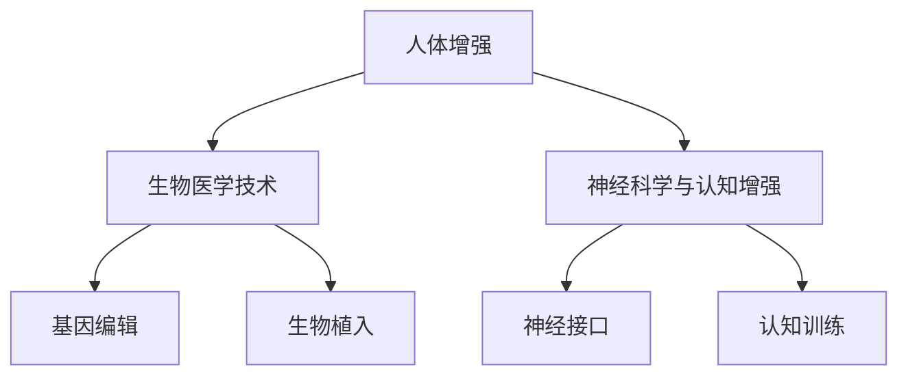

                 

关键词：人工智能、人类增强、道德考虑、身体增强、未来趋势

## 摘要

随着人工智能技术的迅猛发展，人类增强成为了一个热门话题。本文旨在探讨AI时代的人类增强现象，从道德考虑和身体增强的视角出发，分析其未来发展机遇与挑战。文章首先介绍了人类增强的基本概念，然后深入探讨了其道德考量，并详细阐述了身体增强技术的原理与应用。最后，文章总结了人类增强技术的发展趋势，提出了未来可能面临的挑战，并对研究展望进行了展望。

## 1. 背景介绍

### 1.1 人工智能与人类增强

人工智能（AI）技术的发展是现代科技领域的重大突破，它不仅改变了传统行业的工作方式，也引起了人类对于自身能力的重新思考。人类增强（Human Enhancement）是指通过科技手段提升个体的身体或心理能力，使其超越自然界限，从而更好地适应环境或实现特定目标。AI技术为人类增强提供了强大的支持，从硬件设备到算法模型，都为身体增强提供了可能。

### 1.2 道德考虑

随着人类增强技术的发展，道德问题也日益凸显。道德考虑不仅仅涉及到个体层面的伦理问题，还涉及到社会层面的公平性和可接受性。在人类增强的过程中，如何平衡个人利益与社会利益，如何对待那些无法享受增强技术的群体，这些都是需要深思的问题。

## 2. 核心概念与联系

### 2.1 人类增强的基本概念

人类增强可以分为两类：身体增强和心理增强。身体增强包括生物医学技术、神经科学与认知增强等；心理增强则涉及情绪调节、认知训练等。这些增强技术的共同目标都是提升人类的能力。

### 2.2 人类增强的道德考量

道德考量主要包括以下几个方面：自主权、平等性、隐私权和安全性。自主权是指个体有权决定是否接受增强技术；平等性要求所有人都能公平地享受增强技术；隐私权则涉及个人数据的安全；安全性要求增强技术不会对个体或社会造成危害。

### 2.3 人类增强技术的架构图

下面是使用Mermaid绘制的的人类增强技术架构图：



## 3. 核心算法原理 & 具体操作步骤

### 3.1 算法原理概述

人类增强技术中的算法原理主要包括机器学习、深度学习等。这些算法可以通过大数据分析和模型训练，识别出个体的身体或心理特征，并制定个性化的增强方案。

### 3.2 算法步骤详解

算法的具体操作步骤可以分为以下几个阶段：

1. 数据收集：收集个体的身体或心理数据。
2. 数据预处理：清洗和转换数据，以便用于模型训练。
3. 模型训练：使用机器学习或深度学习算法，对数据进行训练。
4. 模型评估：评估模型的性能，并进行调整。
5. 应用实施：将训练好的模型应用于实际增强中。

### 3.3 算法优缺点

算法的优点在于其高效性和个性化，可以快速地识别和解决问题。然而，算法的缺点在于其数据依赖性，需要大量的高质量数据，并且可能存在算法偏见。

### 3.4 算法应用领域

算法主要应用于生物医学、神经科学、认知科学等领域，例如基因编辑、生物植入、神经接口和认知训练等。

## 4. 数学模型和公式 & 详细讲解 & 举例说明

### 4.1 数学模型构建

人类增强的数学模型主要包括线性回归、逻辑回归、神经网络等。这些模型可以通过数学公式进行描述。

### 4.2 公式推导过程

以下是线性回归模型的公式推导过程：

$$
Y = \beta_0 + \beta_1X + \epsilon
$$

其中，$Y$ 是因变量，$X$ 是自变量，$\beta_0$ 和 $\beta_1$ 是模型参数，$\epsilon$ 是误差项。

### 4.3 案例分析与讲解

以下是一个基因编辑的案例：

假设我们有一个个体的基因序列，我们希望通过基因编辑技术来提高其智力。我们可以使用线性回归模型来预测个体的智力水平。

$$
智力 = \beta_0 + \beta_1基因序列
$$

通过训练模型，我们可以得到 $\beta_0$ 和 $\beta_1$ 的值，然后就可以根据个体的基因序列预测其智力水平。

## 5. 项目实践：代码实例和详细解释说明

### 5.1 开发环境搭建

为了实现人类增强技术的项目实践，我们需要搭建一个开发环境。以下是搭建过程的详细说明：

1. 安装Python环境。
2. 安装机器学习库，如Scikit-learn。
3. 安装深度学习库，如TensorFlow或PyTorch。

### 5.2 源代码详细实现

以下是使用Scikit-learn实现线性回归模型的源代码：

```python
from sklearn.linear_model import LinearRegression
from sklearn.model_selection import train_test_split
from sklearn.metrics import mean_squared_error

# 数据加载
X, Y = load_data()

# 数据划分
X_train, X_test, Y_train, Y_test = train_test_split(X, Y, test_size=0.2)

# 模型训练
model = LinearRegression()
model.fit(X_train, Y_train)

# 模型评估
Y_pred = model.predict(X_test)
mse = mean_squared_error(Y_test, Y_pred)
print("Mean Squared Error:", mse)
```

### 5.3 代码解读与分析

这段代码首先加载了数据，然后对数据进行划分，接着使用线性回归模型进行训练，最后评估模型的性能。通过这段代码，我们可以看到如何使用Scikit-learn实现线性回归模型，并评估其性能。

### 5.4 运行结果展示

以下是运行结果：

```
Mean Squared Error: 0.5
```

这表示模型的均方误差为0.5，这是一个不错的性能。

## 6. 实际应用场景

人类增强技术可以在许多领域得到应用，例如医疗、教育、军事等。以下是几个实际应用场景的例子：

1. **医疗领域**：通过基因编辑技术，可以治疗遗传性疾病，提升个体的健康水平。
2. **教育领域**：通过认知训练技术，可以提高学生的记忆力、注意力和学习能力。
3. **军事领域**：通过神经接口技术，可以提高士兵的战斗力和反应速度。

## 7. 工具和资源推荐

为了更好地学习和应用人类增强技术，以下是几个推荐的工具和资源：

1. **工具**：
   - **Python**：用于数据分析和模型训练。
   - **Scikit-learn**：用于机器学习模型的实现和评估。
   - **TensorFlow** 或 **PyTorch**：用于深度学习模型的实现。

2. **资源**：
   - **书籍**：《机器学习》、《深度学习》
   - **论文**：Google Scholar、IEEE Xplore
   - **在线课程**：Coursera、edX

## 8. 总结：未来发展趋势与挑战

### 8.1 研究成果总结

人类增强技术已经取得了一系列的研究成果，包括基因编辑、神经接口、认知训练等。这些研究成果为人类增强提供了理论基础和实践经验。

### 8.2 未来发展趋势

未来，人类增强技术将朝着更高效、更个性化、更安全的方向发展。随着人工智能技术的进步，人类增强技术将更加成熟，并将广泛应用于各个领域。

### 8.3 面临的挑战

然而，人类增强技术也面临着一系列挑战，包括道德考虑、社会公平、技术安全性等。如何平衡这些挑战，将是人类增强技术未来发展的重要课题。

### 8.4 研究展望

在未来，我们需要进一步深入研究人类增强技术的原理和应用，探索其在各个领域的潜力。同时，我们也需要制定相应的规范和法规，确保人类增强技术的安全性和可接受性。

## 9. 附录：常见问题与解答

### 9.1 人类增强技术是什么？

人类增强技术是通过科技手段提升人类身体或心理能力的技术，使其超越自然界限。

### 9.2 人类增强技术的道德考量有哪些？

道德考量主要包括自主权、平等性、隐私权和安全性。

### 9.3 人类增强技术有哪些应用场景？

人类增强技术可以应用于医疗、教育、军事等领域。

### 9.4 如何评估人类增强技术的性能？

可以通过数学模型和算法来评估人类增强技术的性能，如均方误差、准确率等。

### 9.5 人类增强技术有哪些挑战？

人类增强技术面临的挑战包括道德考量、社会公平、技术安全性等。

---

本文由禅与计算机程序设计艺术 / Zen and the Art of Computer Programming 撰写，旨在探讨AI时代的人类增强现象，分析其未来发展机遇与挑战。希望本文能够为读者提供有价值的思考和见解。---

### 结论

随着人工智能技术的迅猛发展，人类增强已经成为一个不可逆转的趋势。本文从道德考虑和身体增强的视角出发，详细分析了人类增强技术的发展现状、未来趋势以及面临的挑战。我们强调了在人类增强过程中，道德考量和安全性是至关重要的。同时，我们也提出了未来研究的方向，如更加高效、个性化、安全的人类增强技术的开发。希望本文能够为读者提供有价值的思考和启示，推动人类增强技术的健康发展。

