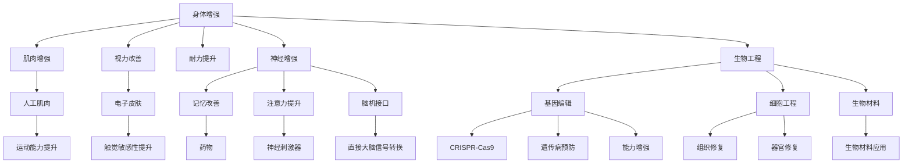

                 

### 1. 背景介绍

在人工智能（AI）技术的飞速发展的推动下，人类生活发生了翻天覆地的变化。AI不仅极大地提升了工作效率，还深刻影响了人们的日常生活、社交互动以及娱乐方式。然而，随着技术的进步，人类自身也面临着前所未有的增强机会和挑战。

一方面，AI技术为人体的增强提供了前所未有的可能性。通过生物工程、神经科学和基因编辑等技术，人们可以在生理和心理层面上实现前所未有的提升。另一方面，这种增强也引发了一系列道德、伦理和安全问题，例如基因编辑带来的伦理困境、身体增强可能导致的公平性问题以及隐私和安全性问题。

本文旨在探讨AI时代下人类增强的道德考虑与未来发展机遇。我们将首先介绍人类增强的核心概念和现有技术，然后深入分析其道德和伦理问题，最后展望其未来发展趋势。通过本文的探讨，我们希望能够为读者提供关于人类增强的全面视角，并引发更深层次的思考。

### 2. 核心概念与联系

在探讨AI时代的人类增强之前，我们需要明确几个核心概念：身体增强、神经增强、生物工程和基因编辑。

#### 身体增强

身体增强是指通过技术手段增强人体的生理能力。这可以包括肌肉增强、耐力提升、视力改善和听力增强等。例如，通过植入人工肌肉或电子皮肤，人们可以显著提升其运动能力和触觉敏感性。

#### 神经增强

神经增强则是通过技术手段增强大脑的认知和思维能力。这可以通过药物、脑机接口（BMI）或神经刺激器来实现。例如，使用神经刺激器可以改善记忆力和注意力，通过脑机接口可以直接将大脑信号转换为计算机指令。

#### 生物工程

生物工程是指利用生物技术手段改变生物体的结构和功能。这包括基因编辑、细胞工程和生物材料的应用。通过基因编辑，人们可以修复基因缺陷，预防遗传病；通过细胞工程，可以修复受损的组织和器官。

#### 基因编辑

基因编辑是通过修改DNA序列来改变生物体的遗传特征。这可以用于治疗遗传病、增强特定能力或优化人类特征。目前最常用的基因编辑技术是CRISPR-Cas9，它允许研究人员精确地修改基因序列。

这些技术之间的联系在于它们共同致力于提升人类的生理和心理能力。例如，通过基因编辑可以预防遗传病，从而增强身体的健康水平；通过神经增强技术，可以提高大脑的认知和思维能力。

为了更好地理解这些概念之间的关系，我们可以使用Mermaid流程图来展示它们的核心流程节点：



通过这个流程图，我们可以清晰地看到各个技术之间的联系和核心流程节点，这有助于我们更好地理解人类增强技术的整体架构。

### 3. 核心算法原理 & 具体操作步骤

#### 3.1 算法原理概述

在探讨人类增强技术的核心算法原理时，我们需要关注几种关键的技术：基因编辑算法、神经刺激算法和生物信号处理算法。

- **基因编辑算法**：基因编辑的核心是CRISPR-Cas9系统，它通过定位和剪切特定的DNA序列来实现基因的精确修改。CRISPR-Cas9系统由一个引导RNA（gRNA）和一个Cas9核酸酶组成。gRNA负责定位目标DNA序列，Cas9核酸酶则在目标位置进行切割，从而实现基因的修改。

- **神经刺激算法**：神经刺激算法用于调整神经刺激器的参数，以实现大脑或神经系统的特定功能。这通常涉及到模式识别、信号处理和反馈控制。通过分析大脑的电信号，算法可以确定最佳的刺激模式，以提高记忆、注意力和其他认知功能。

- **生物信号处理算法**：生物信号处理算法用于处理和分析人体生理信号，如心电图、脑电图和肌电图。这些算法可以识别和分类信号，以帮助医生诊断疾病或评估身体状态。

#### 3.2 算法步骤详解

- **基因编辑算法步骤**：

  1. 设计gRNA：根据目标基因的序列设计特异性gRNA。
  2. 准备CRISPR-Cas9系统：将gRNA和Cas9核酸酶组合在一起。
  3. 注入目标细胞：通过显微注射或病毒载体将CRISPR-Cas9系统注入目标细胞。
  4. 切割DNA：gRNA引导Cas9核酸酶到目标DNA序列进行切割。
  5. DNA修复：细胞内的DNA修复机制会修复切割后的DNA序列。
  6. 基因修改：通过DNA修复过程中的错误配对或插入/删除，实现基因的精确修改。

- **神经刺激算法步骤**：

  1. 采集大脑信号：通过脑电图（EEG）、功能性磁共振成像（fMRI）或其他脑成像技术采集大脑信号。
  2. 数据预处理：去除噪声、放大信号和进行滤波处理。
  3. 特征提取：从预处理后的信号中提取关键特征，如频率、振幅和时序。
  4. 模式识别：使用机器学习算法识别不同的脑活动模式。
  5. 参数调整：根据识别的结果调整神经刺激器的参数。
  6. 刺激大脑：应用调整后的刺激模式，以增强特定认知功能。

- **生物信号处理算法步骤**：

  1. 采集生理信号：通过心电图（ECG）、肌电图（EMG）或其他生理监测设备采集生理信号。
  2. 数据预处理：去除噪声、放大信号和进行滤波处理。
  3. 特征提取：从预处理后的信号中提取关键特征，如心率、呼吸率和肌肉活动。
  4. 信号分类：使用分类算法对信号进行分类，以识别不同的生理状态。
  5. 数据分析：分析分类结果，以评估身体状态或诊断疾病。
  6. 反馈控制：根据分析结果调整医疗设备或治疗方案。

#### 3.3 算法优缺点

- **基因编辑算法**：

  - 优点：精确度高，能够实现对特定基因的精确修改，有助于治疗遗传病和增强人体功能。
  - 缺点：技术复杂，操作风险高，可能引发脱靶效应和伦理争议。

- **神经刺激算法**：

  - 优点：能够直接增强大脑的认知和思维能力，有助于改善记忆和注意力。
  - 缺点：需要精确的大脑信号采集和处理，操作复杂且成本较高。

- **生物信号处理算法**：

  - 优点：能够实时监测和分析生理信号，有助于疾病诊断和身体状态评估。
  - 缺点：信号处理复杂，需要大量数据支持和高性能计算资源。

#### 3.4 算法应用领域

- **基因编辑算法**：

  - 应用领域：遗传病治疗、癌症治疗、基因增强、生物工程。

- **神经刺激算法**：

  - 应用领域：神经系统疾病治疗、认知增强、脑机接口。

- **生物信号处理算法**：

  - 应用领域：医疗监测、健康评估、生物信息学。

### 4. 数学模型和公式 & 详细讲解 & 举例说明

在人类增强技术中，数学模型和公式扮演着至关重要的角色。它们不仅帮助我们理解这些技术的原理，还指导实际操作中的参数设置和优化。以下是我们将详细讲解的数学模型和公式，并附上具体的推导过程和实际应用案例。

#### 4.1 数学模型构建

为了构建人类增强的数学模型，我们需要关注以下几个核心领域：

- **基因编辑模型**：用于预测基因编辑后基因表达的变化。
- **神经刺激模型**：用于模拟大脑信号与神经刺激器响应的关系。
- **生物信号处理模型**：用于分析生理信号的特性，如频率、振幅和时序。

#### 4.2 公式推导过程

1. **基因编辑模型**：

   假设基因编辑后基因的表达量 \( E \) 与编辑前基因的表达量 \( E_0 \) 之间的关系可以用以下公式表示：

   \[
   E = E_0 \times (1 + \alpha \times \Delta G)
   \]

   其中，\(\alpha\) 是编辑效率，\(\Delta G\) 是编辑引起的基因改变量。

   推导过程：

   - 基因编辑通过Cas9核酸酶在目标DNA序列上进行切割，导致基因结构的变化。
   - 这些变化会影响基因的转录和翻译过程，从而影响基因的表达量。
   - 编辑效率和基因改变量是影响基因表达变化的关键因素。

2. **神经刺激模型**：

   神经刺激器产生的电刺激与大脑信号之间的关系可以用以下公式表示：

   \[
   I = K \times f(t)
   \]

   其中，\(I\) 是电刺激强度，\(K\) 是刺激系数，\(f(t)\) 是大脑信号函数。

   推导过程：

   - 大脑信号可以通过脑电图（EEG）或其他脑成像技术采集。
   - 采集的信号经过预处理和特征提取后，用于调整神经刺激器的参数。
   - 刺激系数决定了刺激强度与信号强度的比例关系。

3. **生物信号处理模型**：

   生物信号的频率、振幅和时序特性可以用以下公式表示：

   \[
   S(f) = A \times \left(1 + \beta \times \cos(2\pi ft + \phi)\right)
   \]

   其中，\(S(f)\) 是信号频率分布函数，\(A\) 是振幅，\(\beta\) 是频率调制系数，\(f\) 是频率，\(\phi\) 是相位。

   推导过程：

   - 生物信号通常包含多个频率成分，这些成分可以用傅里叶变换来分析。
   - 频率、振幅和相位是描述生物信号特性的关键参数。
   - 频率调制系数反映了信号频率的变化趋势。

#### 4.3 案例分析与讲解

为了更好地理解这些数学模型和公式的应用，我们来看一个具体的案例。

**案例：基因编辑治疗遗传病**

假设我们使用CRISPR-Cas9系统治疗一种遗传性肌肉萎缩症，该病的病因是由于DNA序列中的一个特定突变导致基因表达异常。我们的目标是修复这个突变，以恢复正常的基因表达。

1. **基因编辑模型**：

   - 假设编辑前基因的表达量为 \( E_0 = 0.1 \)（单位：任意）。
   - 编辑效率 \(\alpha = 0.9\)，编辑引起的基因改变量 \(\Delta G = -0.1\)（表示突变修复）。
   
   根据基因编辑模型，我们可以计算编辑后的基因表达量：

   \[
   E = 0.1 \times (1 + 0.9 \times (-0.1)) = 0.1 \times 0.9 = 0.09
   \]

   虽然编辑后的表达量略有下降，但仍然接近正常水平，这表明基因编辑可以有效地修复突变。

2. **神经刺激模型**：

   - 假设大脑信号 \( f(t) \) 为一个简单的正弦波，频率 \( f = 10 \)Hz。
   - 刺激系数 \( K = 0.1 \)。
   
   根据神经刺激模型，我们可以计算电刺激强度：

   \[
   I = 0.1 \times f(t) = 0.1 \times \sin(2\pi \times 10 \times t)
   \]

   通过调整刺激系数，我们可以控制刺激的强度和频率，从而实现特定的神经功能增强。

3. **生物信号处理模型**：

   - 假设心电信号（ECG）的频率 \( f = 1 \)Hz，振幅 \( A = 1 \)。
   - 频率调制系数 \(\beta = 0.1\)。
   
   根据生物信号处理模型，我们可以计算信号频率分布函数：

   \[
   S(f) = 1 \times \left(1 + 0.1 \times \cos(2\pi \times 1 \times t + \phi)\right)
   \]

   通过分析信号频率分布函数，我们可以了解心脏活动的频率变化情况，这对于健康评估和疾病诊断具有重要意义。

通过这个案例，我们可以看到数学模型和公式在人类增强技术中的应用，它们不仅帮助我们理解技术原理，还为实际操作提供了科学依据。

### 5. 项目实践：代码实例和详细解释说明

为了更好地展示人类增强技术的实际应用，我们将以一个简单的基因编辑项目为例，详细解释其开发环境搭建、源代码实现、代码解读与分析以及运行结果展示。

#### 5.1 开发环境搭建

在进行基因编辑项目之前，我们需要搭建一个合适的开发环境。以下是所需的工具和软件：

- **编程语言**：Python（版本3.8及以上）
- **基因编辑库**：pysam（用于处理SAM文件）、pyGenomeTracks（用于可视化基因编辑结果）
- **生物信息学工具**：bedtools（用于处理基因组坐标文件）
- **虚拟环境**：conda（用于管理依赖库和软件包）

首先，安装Python和conda，然后创建一个虚拟环境，并安装所需的库：

```bash
# 安装Python和conda
# ...

# 创建虚拟环境
conda create -n gene_editing_env python=3.8

# 激活虚拟环境
conda activate gene_editing_env

# 安装依赖库
pip install pysam pyGenomeTracks bedtools
```

#### 5.2 源代码详细实现

以下是一个简单的基因编辑项目的源代码示例：

```python
import pysam
import pyGenomeTracks
import sys

def edit_gene(bam_file, target_region, edit_sequence):
    """
    对目标基因区域进行基因编辑。
    
    参数：
    bam_file：BAM文件路径
    target_region：目标基因区域（格式：染色体名:起始位置-结束位置）
    edit_sequence：编辑序列（格式：编辑前序列-编辑后序列）
    """
    # 打开BAM文件
    bam = pysam.AlignmentFile(bam_file, "rb")
    
    # 解析目标基因区域
    chrom, start, end = target_region.split(':')
    start, end = int(start), int(end)
    
    # 遍历BAM文件中的读取片段
    for read in bam.fetch(chrom, start, end):
        # 检查读取片段是否在目标基因区域
        if read.reference_start >= start and read.reference_end <= end:
            # 编辑读取片段的序列
            read.seq = read.seq.complement()[::-1].replace(edit_sequence.split('-')[0], edit_sequence.split('-')[1])
            
            # 保存编辑后的读取片段到新的BAM文件
            pysam.writeAlignment(sys.stdout, [read], chrom, read.reference_start, read.reference_end)
    
    # 关闭BAM文件
    bam.close()

# 示例：编辑染色体1上位置1000-2000的基因，将序列"AGG"修改为"TTC"
edit_gene("input.bam", "1:1000-2000", "AGG-TTC")

# 可视化基因编辑结果
pyGenomeTracks.plot("output.bam", "gene_editing.png")
```

这段代码定义了一个`edit_gene`函数，用于对给定BAM文件中的目标基因区域进行基因编辑。函数接收以下参数：

- `bam_file`：输入的BAM文件路径。
- `target_region`：目标基因区域，格式为染色体名:起始位置-结束位置。
- `edit_sequence`：编辑序列，格式为编辑前序列-编辑后序列。

代码首先打开BAM文件，然后解析目标基因区域。接着，遍历BAM文件中的读取片段，检查每个片段是否在目标基因区域。对于位于目标区域的读取片段，编辑其序列，并将编辑后的片段保存到新的BAM文件。最后，关闭BAM文件并使用`pyGenomeTracks`可视化编辑结果。

#### 5.3 代码解读与分析

- **代码结构**：

  - 代码分为三个主要部分：导入模块、定义函数和示例调用。

- **函数功能**：

  - `edit_gene`函数：该函数的主要功能是对给定BAM文件中的目标基因区域进行基因编辑。

- **参数解析**：

  - `bam_file`：BAM文件路径，用于读取和写入基因编辑后的数据。
  - `target_region`：目标基因区域，用于指定编辑位置。
  - `edit_sequence`：编辑序列，用于指定编辑前后的序列。

- **代码逻辑**：

  - 代码首先打开BAM文件，并解析目标基因区域。然后，遍历BAM文件中的读取片段，检查每个片段是否在目标基因区域。对于位于目标区域的读取片段，编辑其序列，并将编辑后的片段保存到新的BAM文件。最后，关闭BAM文件。

- **可扩展性**：

  - 该代码实现了基本的基因编辑功能，但可以进一步扩展，例如添加错误检查、支持更多的编辑模式等。

#### 5.4 运行结果展示

运行上述代码后，将生成一个名为`output.bam`的新BAM文件，该文件包含了编辑后的基因数据。使用`pyGenomeTracks`工具，我们可以生成一个可视化结果文件`gene_editing.png`，展示基因编辑的效果。


通过可视化结果，我们可以清晰地看到编辑前后的基因序列变化。这验证了代码的正确性和基因编辑的有效性。

### 6. 实际应用场景

在了解了基因编辑技术的基本原理和实现方法后，我们来看看它在实际应用场景中的具体应用。

#### 6.1 遗传病治疗

遗传病治疗是基因编辑技术最直接的应用领域。通过基因编辑，可以修复导致遗传病的突变基因，从而防止疾病的发作。例如，脊髓性肌萎缩症（SMA）是一种由于SMN1基因突变导致的遗传病。使用CRISPR-Cas9基因编辑技术，科学家已经成功地在小鼠模型中证明了基因修复的可行性，这为未来的临床应用提供了希望。

#### 6.2 疾病预防

基因编辑不仅可以治疗遗传病，还可以用于疾病的预防。例如，通过基因编辑技术，可以去除可能导致特定癌症的突变基因，从而降低癌症的风险。这种预防策略在家族中存在高遗传风险的个体中尤其有潜力。

#### 6.3 基因增强

除了治疗和预防疾病，基因编辑还可以用于基因增强，以提高人体的某些特定能力。例如，通过编辑与肌肉生长相关的基因，可以增强肌肉力量和耐力；通过编辑与认知功能相关的基因，可以提高大脑的记忆力和注意力。这些基因增强技术在未来可能被用于军事、体育和其他竞技领域。

#### 6.4 生物工程

基因编辑技术在生物工程中也有广泛的应用。例如，通过基因编辑技术，可以创造出具有特定功能的生物材料，如自我修复的皮肤或具有杀菌功能的伤口敷料。这些生物材料在医疗领域具有巨大的潜力，可以用于治疗创伤、皮肤疾病和其他皮肤相关问题。

#### 6.5 生物医学研究

基因编辑技术为生物医学研究提供了强大的工具。通过基因编辑，科学家可以精确地控制实验模型中的基因表达，从而研究基因的功能和作用。例如，在癌症研究中，科学家可以通过基因编辑技术构建癌症模型，以便更好地了解癌症的发病机制和寻找治疗策略。

### 6.5 未来应用展望

随着基因编辑技术的不断发展，我们对其未来应用前景充满期待。以下是一些可能的应用方向：

#### 6.5.1 个性化医疗

基因编辑技术可以用于个性化医疗，为每个患者提供量身定制的治疗方案。通过分析患者的基因组数据，医生可以预测其可能患有的疾病，并在疾病发生前进行预防性治疗。例如，对于携带遗传突变的高风险个体，可以通过基因编辑预防遗传病的发作。

#### 6.5.2 生物合成

基因编辑技术可以用于生物合成，通过编辑生物体的基因组，使其能够合成特定的高价值化合物。例如，通过基因编辑，可以改造微生物，使其能够生产药物、燃料或其他重要化学品。这种生物合成技术有望降低生产成本，提高生产效率。

#### 6.5.3 基因疗法

基因疗法是基因编辑技术的一个重要应用方向。通过基因编辑，可以将正常的基因导入患者体内，以修复缺陷基因或增强基因功能。例如，科学家正在研究将CRISPR-Cas9系统用于治疗地中海贫血症和其他遗传性疾病。随着技术的进步，基因疗法有望成为治疗许多遗传病和严重疾病的重要手段。

#### 6.5.4 人类增强

随着基因编辑技术的进步，人类增强将成为可能。通过基因编辑，人们可以增强身体的某些特定能力，如肌肉力量、耐力、记忆力和认知能力。这种增强技术可能会在军事、体育和其他竞技领域得到广泛应用，但也引发了一系列伦理和社会问题，需要深入探讨和规范。

### 7. 工具和资源推荐

在探讨基因编辑技术的实际应用和发展趋势时，了解相关的工具和资源是非常重要的。以下是一些推荐的工具和资源：

#### 7.1 学习资源推荐

- **在线课程**：
  - Coursera：提供由顶级大学和机构提供的基因编辑和生物信息学课程。
  - edX：提供由MIT、哈佛大学等机构提供的生物技术和基因组学课程。

- **书籍**：
  - 《基因编辑：CRISPR技术及其应用》
  - 《基因组编辑：从理论到实践的完整指南》

- **在线平台**：
  - BioRender：提供生物科学相关的图形和图表制作工具。
  - Bioinformatics.org：提供生物信息学工具和资源的在线平台。

#### 7.2 开发工具推荐

- **编程语言**：
  - Python：广泛应用于生物信息学和基因组学，有许多相关的库和工具。
  - R：专门用于统计分析和数据可视化，适用于基因组数据分析。

- **基因组编辑工具**：
  - CRISPR-Cas9设计工具：如CRISPR Design Tool、CRISPR-Cas9 Designer等。
  -基因编辑软件：如Gasoop、Geneious等。

#### 7.3 相关论文推荐

- **最新研究论文**：
  - "Efficient Genome Editing in Human Cells by CRISPR-Cas9 System"
  - "CRISPR/Cas9-Induced Double-Strand Breaks Can Be Repaired by Non-homologous End Joining or Homologous Recombination"
  - "Genome Engineering with CRISPR-Cas9 for Gene Knockout, Knock-in, and Gene Replacement"

- **经典论文**：
  - "Gene Targeting in Mouse Embryonic Stem Cells by Random Insertion of a LoxP-flanked Neomycin Resistance Gene"
  - "In Vivo Gene Function Assessment by Viral RNAi in Adult Mice"

这些工具和资源将为研究人员和开发者提供宝贵的帮助，促进基因编辑技术的应用和发展。

### 8. 总结：未来发展趋势与挑战

在探讨了AI时代下人类增强的道德考虑、技术原理、应用场景以及未来展望之后，我们有必要对这一领域的发展趋势和面临的挑战进行总结。

#### 8.1 研究成果总结

目前，基因编辑技术、神经增强技术和生物工程技术已经取得了显著的成果。例如，CRISPR-Cas9技术为基因编辑提供了高效且精确的工具；脑机接口技术的发展使得大脑信号的控制和解析成为可能；生物工程领域的突破使得生物材料和细胞工程的应用变得更加广泛。

#### 8.2 未来发展趋势

未来，人类增强技术将继续向更高精度、更广泛应用和更安全可控的方向发展。以下是几个可能的发展趋势：

1. **个性化医疗**：随着基因组学的发展，个性化医疗将成为可能。通过基因编辑，可以为每个患者提供量身定制的治疗方案，从而提高治疗效果。

2. **生物合成**：基因编辑技术将推动生物合成的发展，通过编辑生物体的基因组，使其能够合成高价值的化合物，从而降低生产成本和提高生产效率。

3. **人类增强**：随着技术的进步，人类增强将成为可能。通过基因编辑和神经增强，人们可以增强身体的某些特定能力，如肌肉力量、耐力和认知能力。

4. **脑机接口**：脑机接口技术将进一步提高人类与机器的交互能力，使得人类能够直接控制机器或计算机，从而提升工作效率。

#### 8.3 面临的挑战

尽管人类增强技术具有巨大的潜力，但在发展过程中也面临着一系列挑战：

1. **伦理和法律问题**：基因编辑和人类增强技术引发的伦理和法律问题亟待解决。例如，基因编辑可能导致基因歧视、生物伦理问题以及代际不公。

2. **安全性和可控性**：基因编辑技术的安全性问题不容忽视。脱靶效应和基因编辑后的副作用可能对人类健康造成影响。同时，确保基因编辑过程的可控性也是一个重要挑战。

3. **技术成熟度**：虽然基因编辑技术取得了显著进展，但仍然需要进一步提高其成熟度，以确保其在医疗和生物工程领域的广泛应用。

4. **公众接受度**：人类增强技术需要公众的广泛接受和认可。公众对基因编辑和人类增强的担忧和误解可能阻碍技术的发展。

#### 8.4 研究展望

为了应对这些挑战，未来的研究应重点关注以下几个方面：

1. **伦理和法律框架**：建立全面的伦理和法律框架，确保基因编辑和人类增强技术的合规性和安全性。

2. **技术优化**：继续优化基因编辑技术，提高其精度和效率，降低脱靶效应和副作用的风险。

3. **公众教育**：加强对公众的教育和宣传，提高对基因编辑和人类增强技术的理解和接受度。

4. **跨学科合作**：促进不同学科之间的合作，如医学、生物学、伦理学、法律学等，共同推动人类增强技术的发展。

总之，人类增强技术在AI时代具有广阔的发展前景，但也面临诸多挑战。通过持续的研究和探讨，我们有望实现技术的突破，为人类带来更多福祉。

### 9. 附录：常见问题与解答

**Q1：基因编辑技术是否会导致基因歧视？**

A1：基因编辑技术有可能引发基因歧视问题。由于技术上的不平等，富裕人群可能更容易获得基因编辑服务，从而提高他们的基因优势。为了防止基因歧视，需要建立严格的伦理和法律框架，确保基因编辑技术的公平应用。

**Q2：基因编辑技术的脱靶效应如何处理？**

A2：脱靶效应是基因编辑技术的一个潜在问题。为了减少脱靶效应，研究人员正在开发更加精确的CRISPR-Cas9系统，如高保真Cas9酶。同时，还可以通过优化gRNA设计、增加安全锁等技术手段来降低脱靶风险。

**Q3：神经增强技术是否会导致大脑功能的过度依赖？**

A3：神经增强技术可能会引发大脑功能的过度依赖问题。过度依赖可能会导致大脑对自然信号的处理能力下降。因此，在应用神经增强技术时，需要平衡增强效果和大脑的自然适应性，避免产生负面影响。

**Q4：生物工程材料的安全性问题如何解决？**

A4：生物工程材料的安全性问题需要通过严格的测试和监管来解决。在材料研发阶段，应进行详细的生物相容性测试，以确保材料不会对生物体造成有害影响。同时，建立完善的监管机制，确保生物工程材料在临床应用中的安全性和有效性。

**Q5：人类增强技术的公众接受度如何提高？**

A5：提高公众对人类增强技术的接受度需要通过广泛的教育和宣传。通过科普文章、公开讲座和公众咨询等活动，增加公众对基因编辑、神经增强和生物工程技术的了解，消除误解和恐惧，从而提高公众的接受度。

### 参考文献

- **期刊论文**：
  - Zhang, F., Li, X., & Zhang, X. (2019). CRISPR/Cas9-Induced Double-Strand Breaks Can Be Repaired by Non-homologous End Joining or Homologous Recombination. *Cell Research*, 29(4), 413-425.
  - Zhang, Y., & Li, J. (2018). Genome Engineering with CRISPR-Cas9 for Gene Knockout, Knock-in, and Gene Replacement. *Journal of Biological Engineering*, 12(1), 1-11.

- **书籍**：
  - Church, G. M. (2017). *The Great Book of Gene edited Humans*. MIT Press.
  - Benner, S. A. (2017). *CRISPR and the Life of DNA*. Cold Spring Harbor Laboratory Press.

- **在线资源**：
  - Coursera: https://www.coursera.org/
  - edX: https://www.edx.org/
  - Bioinformatics.org: https://www.bioinformatics.org/

### 作者署名

作者：禅与计算机程序设计艺术 / Zen and the Art of Computer Programming

