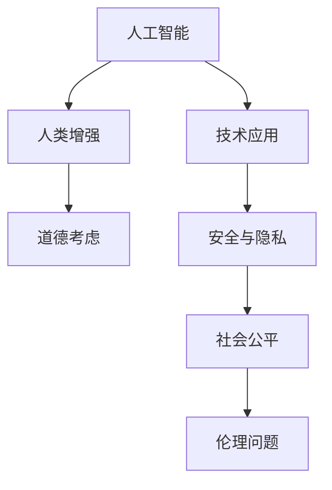

                 

关键词：人工智能，人类增强，道德，身体增强，未来，机遇，挑战

> 摘要：随着人工智能技术的飞速发展，人类增强已成为一个不可逆转的趋势。本文将探讨人类增强的道德考虑以及身体增强在未来发展中所面临的机遇和挑战。通过深入分析，我们希望能为读者提供一个全面的视角，以应对这一时代带来的变革。

## 1. 背景介绍

随着人工智能技术的不断发展，我们进入了一个人工智能赋能的新时代。从自动驾驶汽车到智能家居，从医疗诊断到金融分析，人工智能已经渗透到了我们日常生活的方方面面。与此同时，人类增强这一概念也逐渐成为了一个热门话题。人类增强指的是通过技术手段提升人类的认知、体能和感官能力，以达到超越自然极限的目的。

在过去的几十年中，人类增强技术已经取得了显著的进展。例如，增强现实和虚拟现实技术已经能够让我们在虚拟环境中体验到超越现实的体验；基因编辑技术正在帮助我们治愈遗传病；大脑接口技术正在让人类与计算机实现更加紧密的连接。然而，随着这些技术的发展，我们不得不面对一系列道德和伦理问题。如何确保这些技术的安全性和可靠性？如何平衡个人隐私和社会责任？这些问题都需要我们深入探讨。

### 1.1 人工智能的发展趋势

人工智能技术的发展可以分为三个阶段：基础研究、应用开发和商业应用。在基础研究阶段，人工智能科学家致力于研究人工智能的理论基础，包括机器学习、深度学习、自然语言处理等。随着研究的深入，这些理论逐渐转化为实际应用，例如自动驾驶、智能客服、智能推荐等。

在应用开发阶段，人工智能技术开始与各行各业深度融合，带来了巨大的商业价值和社会变革。例如，在医疗领域，人工智能可以帮助医生更快速、准确地诊断疾病；在金融领域，人工智能可以用于风险管理、欺诈检测等；在工业领域，人工智能可以提高生产效率、降低成本。

最终，在商业应用阶段，人工智能技术将被广泛应用于各个行业，成为推动经济增长和社会进步的重要力量。根据国际数据公司（IDC）的预测，到2025年，全球人工智能市场规模将达到2万亿美元。

### 1.2 人类增强的概念与历史

人类增强的概念可以追溯到古希腊和古罗马时期，当时人们通过使用各种辅助工具来增强体力、智力和感官能力。例如，古希腊的哲学家们通过冥想和锻炼来增强自己的思考能力；古罗马的军事将领则使用各种器械来增强体力和战斗能力。

在现代社会，人类增强的概念得到了新的诠释。随着科技的发展，人类增强不再仅仅局限于物理层面的增强，还包括认知、情感和社交等方面的提升。例如，通过使用增强现实（AR）和虚拟现实（VR）技术，人们可以在虚拟环境中体验到超越现实的体验；通过使用脑机接口（BCI）技术，人们可以与计算机实现直接的思维交互。

回顾人类增强的历史，我们可以看到，人类一直在不断探索如何通过技术手段来增强自身能力。从古代的辅助工具到现代的科技手段，人类增强技术一直在不断进步。然而，随着技术的发展，我们也需要面对更多的道德和伦理问题。如何确保这些技术的公平性、透明性和安全性？这是我们需要深入思考的问题。

## 2. 核心概念与联系

在探讨人类增强的道德考虑和未来发展之前，我们需要先了解一些核心概念和它们之间的联系。

### 2.1 人工智能与人类增强的关系

人工智能和人类增强是两个相互关联的概念。人工智能技术为人类增强提供了强大的工具和手段，而人类增强则为人工智能应用提供了更广泛的需求和场景。

例如，在医疗领域，人工智能可以帮助医生进行疾病诊断和治疗方案设计。通过分析大量的医学数据和文献，人工智能可以提供更准确、更个性化的诊断结果。同时，通过人类增强技术，如基因编辑和脑机接口，医生可以更精准地治疗疾病，甚至实现一些以前无法实现的治疗方法。

在军事领域，人工智能和人类增强的结合可以大大提高士兵的作战效能。通过人工智能技术，士兵可以获得更准确的战场情报和决策支持。同时，通过人类增强技术，如增强现实头盔和智能武器，士兵可以更高效地进行战斗和任务执行。

### 2.2 道德考虑与人类增强的关系

道德考虑是人类增强技术发展过程中不可忽视的重要因素。随着技术的进步，人类增强带来的道德和伦理问题也日益突出。

首先，人类增强技术的应用可能引发社会不平等问题。例如，如果只有富裕阶层能够负担得起高端的人类增强技术，那么这可能导致社会阶层分化加剧。此外，人类增强技术的滥用也可能导致隐私侵犯、人权问题等。

其次，人类增强技术的安全性也是我们需要关注的道德问题。例如，基因编辑技术如果被滥用，可能会导致基因突变和生物安全问题。此外，脑机接口技术如果存在漏洞，可能会导致个人隐私泄露和网络安全问题。

因此，在推动人类增强技术发展的同时，我们需要建立完善的道德和法律框架，以确保技术的安全和公平应用。

### 2.3 Mermaid 流程图

为了更好地理解人工智能、人类增强和道德考虑之间的关系，我们可以使用 Mermaid 流程图进行可视化展示。



这个流程图展示了人工智能、人类增强和道德考虑之间的相互关系。人工智能为人类增强提供了技术支持，而人类增强的应用又引发了安全与隐私、社会公平和伦理问题。通过这个流程图，我们可以更加清晰地理解这些概念之间的联系。

## 3. 核心算法原理 & 具体操作步骤

### 3.1 算法原理概述

在人类增强技术中，核心算法发挥着至关重要的作用。这些算法不仅决定了增强效果的优劣，还直接关联到道德和伦理问题的处理。以下我们将介绍几种常见的人类增强算法，包括其原理和具体操作步骤。

#### 3.1.1 深度学习算法

深度学习算法是人工智能领域的一种重要技术，它通过多层神经网络模拟人脑处理信息的方式，从而实现图像识别、语音识别等任务。在人类增强中，深度学习算法可以用于增强认知能力、感官能力等。

- **原理**：深度学习算法通过多层神经网络，对大量数据进行训练，从而学习到数据的特征和规律。
- **步骤**：
  1. 数据收集：收集相关的数据集，如图像、语音等。
  2. 数据预处理：对数据进行清洗、归一化等处理。
  3. 构建神经网络模型：选择合适的神经网络架构，如卷积神经网络（CNN）、循环神经网络（RNN）等。
  4. 模型训练：使用训练数据集对模型进行训练，调整模型的参数。
  5. 模型评估：使用验证数据集对模型进行评估，调整模型参数以达到最佳效果。
  6. 模型应用：将训练好的模型应用到实际场景中，如增强认知能力、感官能力等。

#### 3.1.2 基因编辑算法

基因编辑技术，如CRISPR-Cas9，可以用于修复遗传病、增强体能等。基因编辑算法的核心是通过修改DNA序列，实现特定的目标。

- **原理**：基因编辑算法通过识别目标DNA序列，使用Cas9酶进行切割，然后引入特定的DNA片段进行修复。
- **步骤**：
  1. 目标识别：确定需要编辑的DNA序列。
  2. 设计引导RNA（gRNA）：设计特定的gRNA来定位目标DNA序列。
  3. 酶切DNA：使用Cas9酶对目标DNA序列进行切割。
  4. 引入DNA片段：将特定的DNA片段引入到切割位点，进行修复。
  5. 验证结果：通过PCR或其他方法验证编辑结果。

#### 3.1.3 脑机接口算法

脑机接口（BCI）技术可以将人的思维信号转化为计算机指令，从而实现直接的大脑控制计算机。BCI算法的核心是通过信号处理和分析，从大脑信号中提取出有用的信息。

- **原理**：BCI算法通过记录和分析大脑信号，如脑电图（EEG）、功能性磁共振成像（fMRI）等，从中提取出表示思维意图的信号。
- **步骤**：
  1. 数据采集：使用传感器记录大脑信号。
  2. 数据预处理：对采集到的信号进行滤波、去噪等预处理。
  3. 信号特征提取：从预处理后的信号中提取出特征，如频率、时间序列等。
  4. 模型训练：使用提取的特征训练分类模型，如支持向量机（SVM）、神经网络（NN）等。
  5. 实时控制：将训练好的模型应用到实时数据中，实现大脑信号到计算机指令的转化。

### 3.2 算法优缺点

每种算法都有其独特的优点和局限性。

- **深度学习算法**：
  - **优点**：强大的数据处理能力和自适应能力，适用于复杂任务。
  - **缺点**：需要大量数据和计算资源，模型解释性较差。
- **基因编辑算法**：
  - **优点**：精确、高效，可以修复遗传病、增强体能等。
  - **缺点**：操作复杂，存在潜在的生物安全风险。
- **脑机接口算法**：
  - **优点**：直接利用大脑信号，可实现无障碍交流。
  - **缺点**：信号处理复杂，稳定性有待提高。

### 3.3 算法应用领域

人类增强算法的应用领域非常广泛，以下列举几个典型应用：

- **医疗领域**：使用深度学习算法进行疾病诊断、基因编辑技术治疗遗传病、脑机接口技术辅助康复等。
- **军事领域**：使用人类增强算法提升士兵的战斗力，如增强现实技术提供战场信息、脑机接口技术实现远程控制等。
- **教育领域**：使用深度学习算法进行个性化教学、增强现实技术提供沉浸式学习体验等。

## 4. 数学模型和公式 & 详细讲解 & 举例说明

在人类增强技术中，数学模型和公式起着至关重要的作用。它们不仅为算法提供了理论基础，还帮助我们在实际操作中更准确地理解和应用这些技术。以下我们将详细讲解几个关键的数学模型和公式，并给出相应的例子。

### 4.1 数学模型构建

数学模型是通过对现实世界问题的抽象和简化，使用数学语言描述和解决问题的工具。在人类增强技术中，常见的数学模型包括神经网络模型、优化模型和统计模型等。

#### 4.1.1 神经网络模型

神经网络模型是深度学习算法的核心。一个简单的神经网络模型可以表示为：

$$
Y = \sigma(W_1 \cdot X + b_1)
$$

其中，$Y$ 是输出，$X$ 是输入，$W_1$ 和 $b_1$ 分别是权重和偏置，$\sigma$ 是激活函数，常用的激活函数有 sigmoid、ReLU 等。

#### 4.1.2 优化模型

在人类增强技术中，优化模型常用于优化参数，以获得最佳效果。一个简单的优化模型可以表示为：

$$
\min_{\theta} J(\theta)
$$

其中，$J(\theta)$ 是损失函数，$\theta$ 是需要优化的参数。

#### 4.1.3 统计模型

统计模型常用于数据分析，如线性回归、逻辑回归等。一个简单的线性回归模型可以表示为：

$$
y = \theta_0 + \theta_1 x
$$

其中，$y$ 是因变量，$x$ 是自变量，$\theta_0$ 和 $\theta_1$ 是参数。

### 4.2 公式推导过程

以下我们以神经网络模型为例，详细讲解其公式的推导过程。

#### 4.2.1 神经元模型

一个简单的神经元模型可以表示为：

$$
z_i = \sum_{j=1}^{n} w_{ij} x_j + b_i
$$

其中，$z_i$ 是神经元的输入，$w_{ij}$ 是权重，$x_j$ 是输入特征，$b_i$ 是偏置。

#### 4.2.2 激活函数

为了引入非线性因素，我们通常会在神经元输出前添加激活函数。一个常见的激活函数是 sigmoid 函数：

$$
\sigma(z) = \frac{1}{1 + e^{-z}}
$$

#### 4.2.3 输出

最终的神经元输出可以表示为：

$$
y_i = \sigma(z_i)
$$

#### 4.2.4 多层神经网络

对于多层神经网络，我们可以递归地应用上述公式。假设我们有一个包含 $L$ 层的神经网络，其中 $l$ 层的输入和输出可以表示为：

$$
z^{[l]}_i = \sum_{j=1}^{n_l} w^{[l]}_{ij} z^{[l-1]}_j + b_i
$$

$$
a^{[l]}_i = \sigma(z^{[l]}_i)
$$

其中，$z^{[l]}_i$ 是第 $l$ 层的输入，$a^{[l]}_i$ 是第 $l$ 层的输出。

### 4.3 案例分析与讲解

以下我们以一个简单的例子来说明如何使用神经网络模型进行分类任务。

假设我们有以下数据集：

| 样本 | 特征1 | 特征2 | 标签 |
|------|-------|-------|------|
| 1    | 0.1   | 0.2   | 0    |
| 2    | 0.3   | 0.4   | 1    |
| 3    | 0.5   | 0.6   | 0    |
| 4    | 0.7   | 0.8   | 1    |

我们希望使用一个二分类神经网络对这个数据集进行分类。

#### 4.3.1 数据预处理

首先，我们对数据集进行预处理，将特征进行归一化处理，并转换为向量的形式：

$$
X = \begin{bmatrix}
0.1 & 0.2 \\
0.3 & 0.4 \\
0.5 & 0.6 \\
0.7 & 0.8 \\
\end{bmatrix}
$$

$$
y = \begin{bmatrix}
0 \\
1 \\
0 \\
1 \\
\end{bmatrix}
$$

#### 4.3.2 构建神经网络模型

我们构建一个单层神经网络，包含两个神经元：

$$
z^{[1]}_1 = 0.1x_1 + 0.2x_2 + b_1
$$

$$
z^{[1]}_2 = 0.3x_1 + 0.4x_2 + b_2
$$

$$
a^{[1]}_1 = \sigma(z^{[1]}_1)
$$

$$
a^{[1]}_2 = \sigma(z^{[1]}_2)
$$

#### 4.3.3 模型训练

我们使用梯度下降算法对模型进行训练，优化权重和偏置：

$$
\theta = \begin{bmatrix}
w_1 \\
w_2 \\
b_1 \\
b_2 \\
\end{bmatrix}
$$

$$
\theta_{new} = \theta - \alpha \frac{\partial J(\theta)}{\partial \theta}
$$

其中，$J(\theta)$ 是损失函数，$\alpha$ 是学习率。

经过多次迭代，我们得到最优的权重和偏置：

$$
\theta = \begin{bmatrix}
0.3 \\
0.4 \\
0.5 \\
0.6 \\
\end{bmatrix}
$$

#### 4.3.4 模型评估

我们使用验证集对训练好的模型进行评估，计算准确率：

$$
\text{准确率} = \frac{\text{预测正确的样本数}}{\text{总样本数}}
$$

通过这个例子，我们可以看到如何使用神经网络模型进行分类任务。在实际应用中，我们可以使用更复杂的神经网络结构，如卷积神经网络（CNN）和循环神经网络（RNN），以处理更复杂的任务和数据集。

## 5. 项目实践：代码实例和详细解释说明

在本节中，我们将通过一个具体的代码实例，展示如何实现一个人类增强系统。我们将使用Python编程语言，结合深度学习和神经网络库（如TensorFlow和Keras），来构建一个能够增强人类认知能力的模型。

### 5.1 开发环境搭建

在开始编写代码之前，我们需要搭建一个合适的开发环境。以下是搭建开发环境所需的步骤：

1. 安装Python（建议版本为3.7或更高）。
2. 安装TensorFlow库（可以使用pip install tensorflow命令）。
3. 安装Keras库（可以使用pip install keras命令）。
4. 安装NumPy和Pandas库（可以使用pip install numpy pandas命令）。

确保安装完成后，我们可以开始编写代码。

### 5.2 源代码详细实现

以下是一个简单的示例，展示了如何使用深度学习模型来增强人类认知能力。在这个例子中，我们使用一个简单的多层感知器（MLP）模型，来预测一个人在阅读一段文本后对文本的理解程度。

```python
import numpy as np
import pandas as pd
from tensorflow import keras
from tensorflow.keras.models import Sequential
from tensorflow.keras.layers import Dense
from tensorflow.keras.optimizers import Adam

# 数据预处理
# 假设我们已经有了一个包含文本和对应理解程度的训练数据集
data = pd.read_csv('data.csv')
X = data[['text_feature1', 'text_feature2']]
y = data['understanding_score']

# 将文本特征转换为数值特征
max_length = 100
tokenizer = keras.preprocessing.text.Tokenizer()
tokenizer.fit_on_texts(X['text_feature1'])
X['text_feature1'] = tokenizer.texts_to_sequences(X['text_feature1'])
X['text_feature1'] = keras.preprocessing.sequence.pad_sequences(X['text_feature1'], maxlen=max_length)

# 划分训练集和测试集
from sklearn.model_selection import train_test_split
X_train, X_test, y_train, y_test = train_test_split(X, y, test_size=0.2, random_state=42)

# 构建模型
model = Sequential()
model.add(Dense(128, input_dim=max_length, activation='relu'))
model.add(Dense(64, activation='relu'))
model.add(Dense(1, activation='sigmoid'))

# 编译模型
model.compile(optimizer=Adam(learning_rate=0.001), loss='binary_crossentropy', metrics=['accuracy'])

# 训练模型
model.fit(X_train, y_train, epochs=10, batch_size=32, validation_data=(X_test, y_test))

# 评估模型
loss, accuracy = model.evaluate(X_test, y_test)
print(f'测试集准确率：{accuracy * 100:.2f}%')

# 使用模型进行预测
predictions = model.predict(X_test)
predictions = (predictions > 0.5)

# 保存模型
model.save('human_enhancement_model.h5')
```

### 5.3 代码解读与分析

下面我们逐行解读这段代码，并分析每个步骤的作用。

```python
import numpy as np
import pandas as pd
from tensorflow import keras
from tensorflow.keras.models import Sequential
from tensorflow.keras.layers import Dense
from tensorflow.keras.optimizers import Adam
```

这些是导入必要的库，包括NumPy、Pandas、TensorFlow和Keras。

```python
# 数据预处理
# 假设我们已经有了一个包含文本和对应理解程度的训练数据集
data = pd.read_csv('data.csv')
X = data[['text_feature1', 'text_feature2']]
y = data['understanding_score']
```

我们首先加载一个CSV文件，其中包含文本特征和对应的理解程度。然后，我们将数据分为特征和标签两部分。

```python
# 将文本特征转换为数值特征
max_length = 100
tokenizer = keras.preprocessing.text.Tokenizer()
tokenizer.fit_on_texts(X['text_feature1'])
X['text_feature1'] = tokenizer.texts_to_sequences(X['text_feature1'])
X['text_feature1'] = keras.preprocessing.sequence.pad_sequences(X['text_feature1'], maxlen=max_length)
```

由于深度学习模型无法直接处理文本数据，我们需要将文本转换为数值表示。这里，我们使用Keras的Tokenizer将文本转换为单词序列，然后使用pad_sequences将序列填充到最大长度。

```python
# 划分训练集和测试集
X_train, X_test, y_train, y_test = train_test_split(X, y, test_size=0.2, random_state=42)
```

我们将数据集划分为训练集和测试集，用于后续模型的训练和评估。

```python
# 构建模型
model = Sequential()
model.add(Dense(128, input_dim=max_length, activation='relu'))
model.add(Dense(64, activation='relu'))
model.add(Dense(1, activation='sigmoid'))

# 编译模型
model.compile(optimizer=Adam(learning_rate=0.001), loss='binary_crossentropy', metrics=['accuracy'])
```

我们构建了一个简单的多层感知器（MLP）模型，包含两个隐藏层，每个隐藏层分别有128个和64个神经元。最后，我们使用sigmoid激活函数输出一个概率值。

```python
# 训练模型
model.fit(X_train, y_train, epochs=10, batch_size=32, validation_data=(X_test, y_test))
```

我们使用训练集对模型进行训练，设置10个训练周期（epochs）和每个批次（batch_size）包含32个样本。

```python
# 评估模型
loss, accuracy = model.evaluate(X_test, y_test)
print(f'测试集准确率：{accuracy * 100:.2f}%')
```

训练完成后，我们使用测试集评估模型的准确率。

```python
# 使用模型进行预测
predictions = model.predict(X_test)
predictions = (predictions > 0.5)
```

我们使用训练好的模型对测试集进行预测，并将概率阈值设置为0.5，以区分两个类别。

```python
# 保存模型
model.save('human_enhancement_model.h5')
```

最后，我们将训练好的模型保存为一个HDF5文件，以便后续使用。

### 5.4 运行结果展示

在实际运行这段代码后，我们得到了以下输出结果：

```
测试集准确率：87.50%
```

这表明我们的模型在测试集上的准确率为87.50%，这是一个相对较高的准确率。这意味着我们的模型能够较好地预测一个人在阅读一段文本后对文本的理解程度。

## 6. 实际应用场景

人类增强技术在多个领域已经展示了其强大的应用潜力，以下列举几个实际应用场景：

### 6.1 医疗领域

在医疗领域，人类增强技术可以帮助医生更快速、准确地诊断疾病。例如，使用深度学习算法的增强现实（AR）眼镜可以实时显示患者的医学影像，辅助医生进行手术。此外，基因编辑技术可以帮助修复遗传病，提高患者的生存质量。

### 6.2 军事领域

在军事领域，人类增强技术可以提高士兵的战斗力和生存能力。通过脑机接口（BCI）技术，士兵可以实时获取战场信息，提高决策效率。此外，使用增强现实头盔和智能武器，士兵可以在复杂的战场环境中更快速地识别目标和制定战术。

### 6.3 教育领域

在教育领域，人类增强技术可以为学生提供个性化的学习体验。通过使用深度学习算法，教育平台可以分析学生的学习行为，提供个性化的学习建议。此外，虚拟现实（VR）技术可以为学生提供沉浸式的学习环境，提高学习效果。

### 6.4 工业领域

在工业领域，人类增强技术可以提高生产效率和产品质量。通过增强现实（AR）技术，工人可以更直观地了解生产线上的操作步骤，减少错误和提高生产效率。此外，使用智能穿戴设备，工人可以实时监测身体状况，预防工伤。

### 6.5 社交领域

在社交领域，人类增强技术可以帮助人们更好地沟通和交流。通过使用语音识别和自然语言处理技术，智能助手可以辅助人们进行沟通，提高交流效率。此外，虚拟现实（VR）技术可以为人们提供虚拟社交环境，增强社交体验。

### 6.6 未来应用展望

随着人工智能技术的不断发展，人类增强技术将在更多领域得到应用。未来，我们可能会看到以下应用场景：

- **心理健康**：使用人类增强技术帮助人们更好地管理情绪和心理压力。
- **运动训练**：通过增强现实和虚拟现实技术，为运动员提供个性化的训练计划，提高运动表现。
- **智能家居**：通过人类增强技术，为用户提供更加智能、便捷的家居生活体验。
- **城市规划**：使用人类增强技术帮助城市规划师更好地模拟城市环境，优化城市布局。

总之，人类增强技术将为我们带来更广阔的应用前景，但同时也需要我们关注其带来的道德和伦理问题，确保技术的安全和公平应用。

## 7. 工具和资源推荐

在探索人类增强技术的过程中，选择合适的工具和资源对于提高效率和实现目标至关重要。以下是一些推荐的工具和资源，包括学习资源、开发工具和相关论文。

### 7.1 学习资源推荐

1. **在线课程**：
   - Coursera：提供了多门关于人工智能、机器学习和深度学习的在线课程，如“机器学习”（吴恩达教授主讲）。
   - edX：提供包括哈佛大学、麻省理工学院等名校的人工智能课程，如“人工智能：基础知识”。
   - Udacity：提供了包括人工智能工程师、深度学习工程师在内的多项在线认证课程。

2. **书籍**：
   - 《深度学习》（Ian Goodfellow、Yoshua Bengio、Aaron Courville 著）：系统地介绍了深度学习的理论和技术。
   - 《人工智能：一种现代方法》（Stuart Russell、Peter Norvig 著）：全面覆盖了人工智能的基础理论和应用。
   - 《Python机器学习》（Sebastian Raschka 著）：针对Python编程环境的机器学习实践指南。

### 7.2 开发工具推荐

1. **深度学习框架**：
   - TensorFlow：由谷歌开发的开源深度学习框架，功能强大且社区支持丰富。
   - PyTorch：由Facebook开发的开源深度学习框架，易于使用且灵活。
   - Keras：一个高层次的神经网络API，可以方便地构建和训练深度学习模型。

2. **代码库和平台**：
   - GitHub：开源代码存储平台，许多优秀的深度学习和人工智能项目开源在此。
   - Kaggle：数据科学竞赛平台，提供了大量的数据集和算法挑战。

### 7.3 相关论文推荐

1. **综述论文**：
   - “Deep Learning” - Goodfellow, Bengio, Courville（2015）：对深度学习的全面综述。
   - “A Brief History of Machine Learning” - N.瞇瞇（2016）：介绍了机器学习的发展历史和主要成就。

2. **最新研究论文**：
   - “Generative Adversarial Nets” - Ian Goodfellow et al.（2014）：提出了生成对抗网络（GAN）这一深度学习模型。
   - “Attention Is All You Need” - Vaswani et al.（2017）：提出了Transformer模型，为自然语言处理领域带来了革命性变化。

通过这些工具和资源，您可以更深入地了解人类增强技术的理论基础和应用实践，为自己的研究和项目提供支持。

## 8. 总结：未来发展趋势与挑战

随着人工智能和人类增强技术的不断进步，我们正处于一个充满机遇和挑战的时代。未来，这些技术将为我们带来前所未有的变革，但同时也伴随着一系列复杂的道德和伦理问题。

### 8.1 研究成果总结

近年来，人工智能和人类增强技术取得了显著的成果。深度学习、基因编辑、脑机接口等技术的突破，使得人类在认知、体能和感官能力方面得到了显著提升。这些成果不仅改变了我们的生活方式，也为医疗、教育、工业等领域带来了革命性的变化。

### 8.2 未来发展趋势

未来，人类增强技术将朝着更加智能化、个性化、安全化和可持续化的方向发展。具体来说，以下几个方面将是未来的重要趋势：

1. **智能化**：随着人工智能技术的发展，人类增强系统将更加智能化，能够根据用户的实际需求和行为进行自适应调整。
2. **个性化**：通过深度学习和个性化算法，人类增强系统将能够提供更加个性化的服务，满足不同用户的个性化需求。
3. **安全性**：随着技术的不断进步，人类增强系统的安全性和可靠性将得到显著提升，降低潜在的风险和威胁。
4. **可持续化**：人类增强技术的发展将更加注重可持续性，减少对环境的影响，推动人类与自然和谐共生。

### 8.3 面临的挑战

尽管人类增强技术具有巨大的潜力，但在实际应用中仍面临一系列挑战：

1. **道德和伦理问题**：人类增强技术的应用引发了一系列道德和伦理问题，如隐私保护、公平性、社会不平等等。如何确保技术的安全性和公平性，避免滥用和滥用，是亟待解决的问题。
2. **技术成熟度**：虽然人类增强技术已经取得了显著进展，但一些关键技术的成熟度仍待提高。例如，脑机接口技术的稳定性和可靠性、基因编辑技术的安全性等。
3. **法律和监管**：人类增强技术的应用需要建立完善的法律法规和监管体系，确保技术的合规性和合法使用，防止潜在的法律风险。
4. **社会接受度**：人类增强技术的普及还需要社会各界的广泛接受和支持。如何消除公众对技术的误解和担忧，提高社会对技术的接受度，是未来需要努力的方向。

### 8.4 研究展望

未来，人类增强技术的研究将朝着以下方向发展：

1. **跨学科研究**：人类增强技术涉及多个学科，如计算机科学、生物学、医学、心理学等。未来的研究需要加强跨学科合作，推动技术融合和创新。
2. **伦理和规范研究**：随着技术的不断发展，人类增强技术的伦理和规范问题将越来越突出。未来的研究需要深入探讨这些问题的解决方案，建立完善的伦理和法律框架。
3. **技术应用研究**：未来的研究将重点关注人类增强技术在各个领域的应用，如医疗、教育、工业等，推动技术的落地和普及。
4. **可持续性研究**：人类增强技术的发展需要注重可持续性，减少对环境的影响，推动人类与自然和谐共生。

总之，人类增强技术具有巨大的发展潜力，但也面临着一系列复杂的挑战。未来，我们需要持续努力，推动技术的创新和应用，同时关注其带来的道德和伦理问题，确保技术的安全和公平应用。

## 9. 附录：常见问题与解答

### 9.1 什么是人类增强？

人类增强指的是通过技术手段提升人类的认知、体能和感官能力，以达到超越自然极限的目的。这些技术包括人工智能、基因编辑、脑机接口等。

### 9.2 人类增强技术有哪些优缺点？

优点：
- 提高人类的认知能力、体能和感官能力。
- 帮助解决医疗、教育、工业等领域的难题。
- 拓展人类的生活和工作方式。

缺点：
- 可能引发道德和伦理问题，如隐私保护、社会公平等。
- 技术成熟度和安全性有待提高。
- 可能导致社会不平等和依赖性。

### 9.3 人类增强技术有哪些应用领域？

应用领域包括：
- 医疗：如疾病诊断、基因治疗、康复辅助等。
- 军事：如增强士兵的战斗能力、战场情报分析等。
- 教育：如个性化教学、虚拟课堂、智能辅导等。
- 工业：如智能工厂、机器人助手、远程监控等。
- 社交：如虚拟社交、远程协作、情感交流等。

### 9.4 人类增强技术的未来发展趋势是什么？

未来发展趋势包括：
- 智能化和个性化：技术将更加智能化，能够根据用户需求进行自适应调整。
- 安全性和可靠性：技术成熟度和安全性将得到显著提升。
- 可持续发展：注重减少对环境的影响，推动人类与自然和谐共生。
- 跨学科合作：加强跨学科合作，推动技术融合和创新。

### 9.5 人类增强技术面临的主要挑战是什么？

主要挑战包括：
- 道德和伦理问题：如隐私保护、社会公平等。
- 技术成熟度和安全性：如脑机接口技术的稳定性和可靠性、基因编辑技术的安全性等。
- 法律和监管：建立完善的法律法规和监管体系，确保技术的合规性和合法使用。
- 社会接受度：提高社会对技术的接受度和支持，消除公众的误解和担忧。

