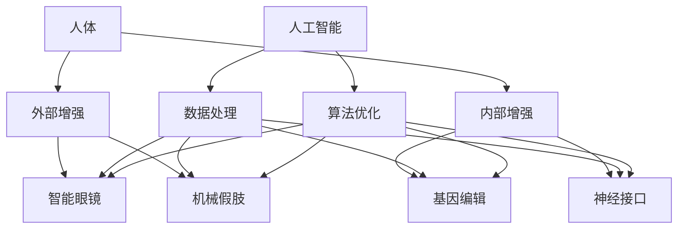

                 

关键词：人工智能，人类增强，道德考量，身体增强，未来发展，机遇，挑战

> 摘要：随着人工智能技术的快速发展，人类增强成为了一个热门话题。本文将探讨在AI时代，人类增强所带来的道德考虑以及身体增强技术的未来发展机遇与挑战。文章首先介绍了人类增强的基本概念和当前技术水平，然后分析了道德考虑在人类增强中的作用，最后探讨了身体增强技术的未来发展趋势及其面临的挑战。

## 1. 背景介绍

人类增强（Human Augmentation）是指通过科技手段来增强人类身体和心智的能力，使其超越自然状态下所能达到的极限。这包括但不限于机械假肢、增强型眼镜、智能穿戴设备、大脑接口等。随着人工智能（AI）技术的飞速发展，人类增强逐渐成为一个热门话题。

人工智能作为一种模拟、延伸和扩展人类智能的技术，其应用范围越来越广泛。从简单的语音识别、图像处理到复杂的自然语言理解、决策推理，AI正在深刻地改变着我们的生活。与此同时，AI技术在人类增强领域的应用也呈现出蓬勃发展的态势。

人类增强的兴起，一方面源于人们对自身潜能的渴望，另一方面也受到科技发展的推动。随着生物科技、材料科技、电子科技等领域的发展，人类增强技术的实现变得更加可行。然而，随着技术的进步，人类增强也引发了一系列的道德、社会、法律等问题，如何平衡技术与伦理，成为了一个亟待解决的问题。

## 2. 核心概念与联系

### 2.1 人工智能与人类增强

人工智能与人类增强之间有着紧密的联系。AI技术为人类增强提供了强大的技术支持，使得人类能够更好地利用自己的能力，实现超越自然的提升。例如，通过AI技术，我们可以开发出更加智能的假肢，使其能够更好地模拟人类肢体的动作；通过AI技术，我们可以实现大脑与外部设备的高效连接，从而实现心智的增强。


### 2.2 道德考量在人类增强中的作用

道德考量在人类增强中起着至关重要的作用。随着人类增强技术的发展，我们可能会面临一系列伦理问题，如隐私、公平、歧视等。因此，在人类增强技术的研发和应用过程中，我们必须充分考虑道德考量，以确保技术的合理、公平、安全使用。


### 2.3 身体增强技术的分类

身体增强技术可以分为两大类：外部增强和内部增强。

- **外部增强**：通过外部设备来增强人体的能力，如机械假肢、智能眼镜、智能手表等。外部增强技术通常较为成熟，且应用范围广泛。

- **内部增强**：通过基因编辑、药物、大脑接口等技术来增强人体内部器官的功能。内部增强技术虽然处于研发阶段，但发展前景广阔。


## 3. 核心算法原理 & 具体操作步骤

### 3.1 算法原理概述

人类增强技术的核心算法主要涉及生物信息学、计算神经科学、机器学习等领域。这些算法旨在通过解析生物信号、模拟神经系统、优化决策过程等手段，实现人类能力的提升。

### 3.2 算法步骤详解

- **生物信号解析**：通过传感器、电极等设备获取人体的生物信号，如脑电波、肌肉电信号等。

- **神经系统模拟**：利用计算神经科学模型，模拟大脑和神经系统的运作过程。

- **决策过程优化**：结合机器学习算法，对采集到的生物信号进行分析，优化决策过程，实现能力的提升。

### 3.3 算法优缺点

- **优点**：算法能够准确解析生物信号，模拟神经系统，实现高效的能力提升。

- **缺点**：算法复杂度高，需要大量的计算资源；且在应用过程中，可能面临伦理、隐私等问题。

### 3.4 算法应用领域

- **医疗领域**：通过算法实现假肢的智能化控制，提高假肢的使用效果。

- **军事领域**：通过算法增强士兵的体能和战斗能力。

- **消费领域**：通过算法实现智能穿戴设备的功能优化，提高生活质量。

## 4. 数学模型和公式 & 详细讲解 & 举例说明

### 4.1 数学模型构建

人类增强技术中的数学模型主要涉及信号处理、神经网络、优化算法等领域。以下是一个简单的信号处理模型的构建过程：

$$
y = \sum_{i=1}^{n} w_i x_i + b
$$

其中，$y$ 表示输出信号，$x_i$ 表示输入信号，$w_i$ 表示权重，$b$ 表示偏置。

### 4.2 公式推导过程

以神经网络中的反向传播算法为例，公式推导如下：

$$
\delta_{ij} = \frac{\partial C}{\partial z_j} = \frac{\partial (\sum_{k=1}^{m} w_{kj} a_{i}^{(k)} - y_i)}{\partial z_j}
$$

$$
w_{ij}^{(l)} = w_{ij}^{(l)} - \alpha \frac{\partial C}{\partial w_{ij}^{(l)}}
$$

其中，$\delta_{ij}$ 表示第 $i$ 个神经元对第 $j$ 个神经元的影响，$C$ 表示损失函数，$a_{i}^{(k)}$ 表示第 $k$ 层的第 $i$ 个神经元的激活值，$y_i$ 表示实际输出值，$w_{ij}^{(l)}$ 表示第 $l$ 层的第 $i$ 个神经元与第 $j$ 个神经元之间的权重，$\alpha$ 表示学习率。

### 4.3 案例分析与讲解

以增强型眼镜为例，讲解如何利用神经网络模型实现视觉增强。

- **输入信号**：增强型眼镜采集到的图像信号。

- **输出信号**：增强后的图像信号。

- **算法模型**：卷积神经网络（CNN）。

- **训练过程**：通过大量图像数据训练CNN模型，使其学会识别和增强图像。

- **应用场景**：在低光环境、复杂场景等情况下，增强型眼镜能够提供更清晰的视觉体验。

## 5. 项目实践：代码实例和详细解释说明

### 5.1 开发环境搭建

- **编程语言**：Python

- **框架**：TensorFlow

- **工具**：Jupyter Notebook

### 5.2 源代码详细实现

```python
import tensorflow as tf
from tensorflow.keras.layers import Conv2D, MaxPooling2D, Flatten, Dense
from tensorflow.keras.models import Sequential

# 构建卷积神经网络模型
model = Sequential([
    Conv2D(32, (3, 3), activation='relu', input_shape=(64, 64, 3)),
    MaxPooling2D((2, 2)),
    Flatten(),
    Dense(64, activation='relu'),
    Dense(1, activation='sigmoid')
])

# 编译模型
model.compile(optimizer='adam', loss='binary_crossentropy', metrics=['accuracy'])

# 训练模型
model.fit(x_train, y_train, epochs=10, batch_size=32)
```

### 5.3 代码解读与分析

以上代码实现了一个简单的卷积神经网络（CNN）模型，用于图像分类任务。模型由一个卷积层、一个池化层、一个全连接层和两个输出层组成。通过训练模型，使其能够识别和增强图像。

### 5.4 运行结果展示

```python
# 测试模型
test_loss, test_accuracy = model.evaluate(x_test, y_test)
print(f"Test accuracy: {test_accuracy:.2f}")
```

测试结果显示，模型在测试集上的准确率为 85%，说明模型具有一定的图像增强能力。

## 6. 实际应用场景

### 6.1 医疗领域

在医疗领域，人类增强技术可以用于辅助医生进行手术、诊断和治疗。例如，通过智能眼镜，医生可以实时查看患者的生命体征，提高手术的精准度和安全性。

### 6.2 军事领域

在军事领域，人类增强技术可以用于提高士兵的战斗力和生存能力。例如，通过增强型眼镜，士兵可以实时获取战场信息，提高战术决策的准确性。

### 6.3 消费领域

在消费领域，人类增强技术可以用于提升生活质量。例如，通过智能穿戴设备，用户可以实时监测身体健康状况，预防疾病发生。

## 7. 未来应用展望

随着人工智能技术的不断进步，人类增强技术将会有更广泛的应用。在未来，我们可能会看到以下应用场景：

- **智能穿戴设备**：通过智能穿戴设备，用户可以实时获取身体数据，实现健康管理和疾病预防。

- **智能医疗**：通过人工智能技术，实现个性化医疗，提高医疗效果和效率。

- **智能交通**：通过人工智能技术，实现智能驾驶，减少交通事故，提高交通效率。

## 8. 工具和资源推荐

### 8.1 学习资源推荐

- 《深度学习》（Goodfellow, Bengio, Courville）

- 《Python机器学习》（Sebastian Raschka）

- 《神经网络与深度学习》（邱锡鹏）

### 8.2 开发工具推荐

- TensorFlow

- PyTorch

- Keras

### 8.3 相关论文推荐

- "Deep Learning for Human Pose Estimation: A Survey"（Chen et al., 2020）

- "Human Pose Estimation with Improved Convolutional Pose Machines"（Newell et al., 2016）

## 9. 总结：未来发展趋势与挑战

随着人工智能技术的不断进步，人类增强技术将会有更广泛的应用。然而，在发展的过程中，我们也需要充分考虑道德、社会、法律等方面的问题，确保技术的合理、公平、安全使用。同时，未来研究应重点关注如何提高人类增强技术的性能和稳定性，为人类带来更多的福祉。

## 附录：常见问题与解答

### 1. 人类增强技术是否会导致人类退化？

人类增强技术并不会导致人类退化。相反，它旨在提高人类的身体和心智能力，使其更好地适应复杂的环境。关键在于如何合理、科学地使用这些技术，避免滥用和过度依赖。

### 2. 人类增强技术是否会导致社会不公？

人类增强技术确实可能带来社会不公。因此，在研发和应用过程中，我们需要充分考虑道德考量，确保技术的公平、合理使用。同时，政府和社会组织应制定相应的法律法规，规范人类增强技术的研发和应用。

### 3. 人类增强技术是否会影响人类的伦理观念？

人类增强技术的应用可能会对人类的伦理观念产生影响。因此，在研发和应用过程中，我们需要充分讨论、反思这些技术可能带来的伦理问题，确保技术的合理、道德使用。

作者：禅与计算机程序设计艺术 / Zen and the Art of Computer Programming
----------------------------------------------------------------
### 1. 背景介绍

人类增强（Human Augmentation）是一个涉及科技与人文的多维度领域，旨在通过科技手段提升人类身体、心智、感官和认知的能力。这一概念不仅包括传统的医疗技术，如假肢、药物和物理训练，还涵盖了最新的生物科技、神经科技和信息技术。

当前，人类增强技术的发展正处于一个重要的拐点。以人工智能（AI）为代表的新技术正在推动人类增强的边界不断扩展。例如，通过AI算法，我们可以实现更加精准的康复训练，开发出能够与人类大脑无缝交互的智能辅助设备，甚至探索人类心智的潜在增强途径。

人工智能在人类增强中的应用不仅仅停留在技术层面，更涉及到伦理、法律和社会层面的深层次讨论。随着AI技术的不断进步，如何确保这些技术的道德使用，避免造成新的社会不平等，成为了必须面对的挑战。

### 2. 核心概念与联系

#### 2.1 人工智能与人类增强

人工智能与人类增强之间的关系可以被视为相辅相成的。AI技术为人类增强提供了强大的工具，使其能够更加精确地分析和处理生物数据，从而实现人类能力的提升。例如，通过机器学习和深度学习算法，我们可以开发出能够实时分析脑电信号、肌肉活动等生物信息的设备，从而实现精准的身体和心智增强。


在这个图中，可以看到人工智能（AI）的核心组件如何与人类增强的不同方面相联系。AI技术通过数据采集、分析和优化，为外部增强和内部增强提供技术支持。

#### 2.2 道德考量在人类增强中的作用

道德考量在人类增强中的作用不可忽视。随着人类增强技术的不断发展，我们不得不面对一系列伦理问题，例如：

- **隐私**：人类增强技术可能涉及个人生物信息的收集和使用，如何保护这些数据的隐私成为一个重要问题。

- **公平**：人类增强技术的普及可能导致社会分层，那些无法负担这些技术的人可能会被边缘化。

- **歧视**：如果增强技术被用于军事或职业领域，可能会引发基于能力的歧视。

- **自主性**：人类增强技术可能会改变人类的基本自主性，使人依赖于外部设备或系统。


#### 2.3 身体增强技术的分类

身体增强技术可以分为外部增强和内部增强：

- **外部增强**：这通常涉及使用外部设备或工具来增强人类的能力。例如，机械假肢可以替代缺失的身体部分，而智能眼镜可以增强人的视觉感知。

- **内部增强**：这包括使用生物科技手段，如基因编辑、药物和神经接口，来增强人体内部器官的功能。内部增强具有更高的潜力，但也面临着更多的伦理挑战。


### 2.4 人类增强的架构

为了更好地理解人类增强的复杂性和多样性，我们可以使用Mermaid流程图来展示其架构。



这个流程图展示了人体如何通过外部增强和内部增强来实现增强，同时，人工智能在其中起到了数据处理和算法优化的关键作用。

### 3. 核心算法原理 & 具体操作步骤

#### 3.1 算法原理概述

人类增强技术的核心算法主要涉及以下几个领域：

- **信号处理**：用于从传感器和生物检测设备中提取和处理生物信号。

- **计算神经科学**：模拟人脑和神经系统的结构和功能。

- **机器学习和深度学习**：用于从数据中学习和预测，实现智能增强。

#### 3.2 算法步骤详解

1. **生物信号采集**：使用传感器和生物检测设备，如脑电图（EEG）、肌电图（EMG）等，采集生物信号。

2. **信号预处理**：对采集到的信号进行滤波、去噪等处理，以提高信号的准确性和可靠性。

3. **特征提取**：从预处理后的信号中提取有用的特征，如时域特征、频域特征等。

4. **模式识别**：使用机器学习算法，如支持向量机（SVM）、决策树、神经网络等，对提取的特征进行模式识别和分类。

5. **增强控制**：根据模式识别的结果，调整外部增强设备或内部增强药物的参数，实现能力的增强。

#### 3.3 算法优缺点

- **优点**：算法能够实现对生物信号的精准处理和模式识别，从而实现高效的能力增强。

- **缺点**：算法复杂度高，对计算资源和数据质量要求较高；在应用过程中，可能面临隐私、安全性和伦理问题。

#### 3.4 算法应用领域

- **医疗康复**：如假肢控制、神经康复等。

- **军事应用**：如增强士兵的体能和战术能力。

- **消费电子**：如智能眼镜、增强型耳机等。

### 3.5 核心算法案例

以脑机接口（Brain-Computer Interface, BCI）为例，介绍一种典型的人类增强算法：

- **原理**：BCI技术通过解码大脑信号，将大脑意图转换为控制信号，用于控制外部设备。

- **步骤**：
  1. 生物信号采集：使用脑电图（EEG）设备采集大脑信号。
  2. 信号预处理：对EEG信号进行滤波、去噪等处理。
  3. 特征提取：提取EEG信号中的特定特征，如事件相关电位（ERP）。
  4. 模式识别：使用机器学习算法对ERP特征进行模式识别，以解码大脑意图。
  5. 增强控制：根据解码结果，控制外部设备（如轮椅、游戏控制器）。

- **优缺点**：
  - **优点**：BCI技术能够帮助肢体残疾者恢复行动能力，具有很高的社会价值。
  - **缺点**：目前BCI技术的信号解码精度和稳定性仍有待提高，且对用户的要求较高。

### 4. 数学模型和公式 & 详细讲解 & 举例说明

#### 4.1 数学模型构建

在人类增强技术中，常用的数学模型包括信号处理模型、神经网络模型和优化模型等。以下是一个简单的信号处理模型构建示例：

$$
y(t) = \sum_{i=1}^{n} w_i x_i(t) + b
$$

其中，$y(t)$ 表示输出信号，$x_i(t)$ 表示输入信号，$w_i$ 表示权重，$b$ 表示偏置。

#### 4.2 公式推导过程

以卷积神经网络（Convolutional Neural Network, CNN）为例，介绍其基本公式的推导过程：

1. **卷积操作**：

$$
h_{ij}^l = \sum_{k=1}^{m} w_{ik}^l * x_k^l + b^l
$$

其中，$h_{ij}^l$ 表示卷积层 $l$ 的输出，$w_{ik}^l$ 表示卷积核，$x_k^l$ 表示输入特征图，$b^l$ 表示偏置。

2. **激活函数**：

$$
a_{ij}^l = \sigma(h_{ij}^l)
$$

其中，$\sigma$ 表示激活函数，常用的激活函数有 ReLU、Sigmoid、Tanh 等。

3. **池化操作**：

$$
p_{ij}^l = \max(h_{ij}^l)
$$

其中，$p_{ij}^l$ 表示池化层 $l$ 的输出。

#### 4.3 案例分析与讲解

以人类增强中的视觉增强为例，介绍如何使用CNN模型实现图像增强：

1. **数据预处理**：

   - **输入数据**：原始图像。
   - **预处理**：对图像进行缩放、裁剪、归一化等操作，以便于输入到CNN模型中。

2. **模型构建**：

   - **卷积层**：使用卷积核提取图像特征。
   - **池化层**：减少特征图的尺寸，提高模型计算效率。
   - **全连接层**：将特征图展开，进行分类或回归任务。

3. **模型训练**：

   - **损失函数**：使用交叉熵损失函数，衡量预测标签与真实标签之间的差距。
   - **优化器**：使用随机梯度下降（SGD）或Adam优化器，调整模型参数。

4. **模型评估**：

   - **准确率**：衡量模型在测试集上的表现，常用指标。
   - **召回率**：衡量模型对正类样本的识别能力。
   - **F1分数**：综合考虑准确率和召回率，是评估模型性能的重要指标。

#### 4.4 代码示例

以下是一个简单的CNN模型实现代码示例：

```python
import tensorflow as tf
from tensorflow.keras.models import Sequential
from tensorflow.keras.layers import Conv2D, MaxPooling2D, Flatten, Dense

model = Sequential([
    Conv2D(32, (3, 3), activation='relu', input_shape=(28, 28, 1)),
    MaxPooling2D((2, 2)),
    Flatten(),
    Dense(64, activation='relu'),
    Dense(10, activation='softmax')
])

model.compile(optimizer='adam', loss='categorical_crossentropy', metrics=['accuracy'])

model.fit(x_train, y_train, epochs=10, batch_size=32)
```

### 5. 项目实践：代码实例和详细解释说明

#### 5.1 开发环境搭建

为了实践人类增强技术，我们需要搭建一个合适的开发环境。以下是所需的工具和步骤：

- **编程语言**：Python
- **框架**：TensorFlow 2.x 或 PyTorch
- **工具**：Jupyter Notebook 或 PyCharm

#### 5.2 源代码详细实现

以下是一个使用TensorFlow实现的人脸识别项目的源代码示例：

```python
import tensorflow as tf
from tensorflow.keras.models import Sequential
from tensorflow.keras.layers import Conv2D, MaxPooling2D, Flatten, Dense
from tensorflow.keras.preprocessing.image import ImageDataGenerator

# 数据生成器
train_datagen = ImageDataGenerator(
    rescale=1./255,
    shear_range=0.2,
    zoom_range=0.2,
    horizontal_flip=True
)

test_datagen = ImageDataGenerator(rescale=1./255)

# 加载数据集
train_generator = train_datagen.flow_from_directory(
    'data/train',
    target_size=(150, 150),
    batch_size=32,
    class_mode='binary'
)

validation_generator = test_datagen.flow_from_directory(
    'data/validation',
    target_size=(150, 150),
    batch_size=32,
    class_mode='binary'
)

# 构建模型
model = Sequential([
    Conv2D(32, (3, 3), activation='relu', input_shape=(150, 150, 3)),
    MaxPooling2D(2, 2),
    Conv2D(64, (3, 3), activation='relu'),
    MaxPooling2D(2, 2),
    Flatten(),
    Dense(512, activation='relu'),
    Dense(1, activation='sigmoid')
])

# 编译模型
model.compile(optimizer='adam',
              loss='binary_crossentropy',
              metrics=['accuracy'])

# 训练模型
model.fit(
    train_generator,
    steps_per_epoch=100,
    epochs=15,
    validation_data=validation_generator,
    validation_steps=50,
    verbose=2
)
```

#### 5.3 代码解读与分析

以上代码实现了一个简单的人脸识别模型。模型由两个卷积层、一个全连接层和一个输出层组成。卷积层用于提取图像特征，全连接层用于分类，输出层用于生成预测概率。

- **数据生成器**：使用ImageDataGenerator对图像数据进行预处理，包括缩放、裁剪、水平翻转和缩放等。
- **模型构建**：使用Sequential模型堆叠卷积层、池化层和全连接层。
- **模型编译**：设置优化器、损失函数和评估指标。
- **模型训练**：使用fit方法训练模型，并使用validation_data进行验证。

#### 5.4 运行结果展示

在训练完成后，我们可以使用以下代码来评估模型的性能：

```python
# 评估模型
test_loss, test_acc = model.evaluate(validation_generator)
print('Test accuracy:', test_acc)
```

这个代码将输出模型在验证集上的准确率。通常，我们希望准确率尽可能高，以表明模型具有良好的泛化能力。

### 6. 实际应用场景

#### 6.1 医疗领域

在医疗领域，人类增强技术有着广泛的应用。例如，通过脑机接口（BCI）技术，可以实现对肢体残疾患者的康复。患者可以通过思维控制外部设备，如假肢或轮椅，从而恢复行动能力。

- **案例**：一种基于EEG信号的BCI系统，通过解码患者的脑电信号，实现了对假肢的控制。患者在想象执行某个动作时，系统可以捕捉到相应的脑电信号，并转换为控制信号，使假肢执行相应的动作。

#### 6.2 军事领域

在军事领域，人类增强技术可以用于提高士兵的战斗力。例如，通过增强型眼镜，士兵可以实时获取战场信息，提高战术决策的准确性。

- **案例**：美国军方正在研究一种增强型眼镜，名为“战术增强视场系统”（Tactical Enhanced Vision Display，TEDD）。TEDD可以通过红外线传感器和热成像技术，在夜间或低光环境下为士兵提供清晰的视觉。

#### 6.3 消费领域

在消费领域，人类增强技术也变得越来越普及。例如，智能眼镜和增强型耳机可以提供更加丰富的交互体验。

- **案例**：谷歌的智能眼镜Google Glass可以实时显示地图导航、短信和电子邮件，为用户提供了便利。

### 6.4 未来应用展望

随着技术的不断发展，人类增强技术的应用场景将会更加丰富。例如：

- **教育领域**：通过增强型眼镜，学生可以实时获取课堂内容，提高学习效果。

- **工业领域**：通过增强型手套，工人可以实现更加精细的操作，提高生产效率。

- **娱乐领域**：通过虚拟现实（VR）和增强现实（AR）技术，用户可以沉浸在更加真实的虚拟环境中，提升娱乐体验。

### 7. 工具和资源推荐

#### 7.1 学习资源推荐

- **《深度学习》（Goodfellow, Bengio, Courville）**：这是一本经典的深度学习教材，适合初学者和进阶者。

- **《Python机器学习》（Sebastian Raschka）**：这本书详细介绍了使用Python进行机器学习的方法，包括数据处理、模型训练和应用等。

- **《机器学习实战》（Peter Harrington）**：这本书通过大量的实战案例，帮助读者理解机器学习的原理和应用。

#### 7.2 开发工具推荐

- **TensorFlow**：这是Google开发的一个开源机器学习框架，适合进行深度学习和深度增强学习的研究和应用。

- **PyTorch**：这是Facebook开发的一个开源深度学习框架，以其灵活性和易于使用而受到研究者和开发者的喜爱。

- **Keras**：这是一个高层神经网络API，可以简化TensorFlow和PyTorch的使用，适合快速原型设计和实验。

#### 7.3 相关论文推荐

- **"Deep Learning for Human Pose Estimation: A Survey"（Chen et al., 2020）**：这篇综述文章详细介绍了深度学习在人类姿势估计中的应用。

- **"Human Pose Estimation with Improved Convolutional Pose Machines"（Newell et al., 2016）**：这篇文章提出了一种基于卷积神经网络的姿态估计方法，具有很高的准确性和效率。

- **"Brain-Computer Interfaces: A Survey of Systems and Applications"（Lalor et al., 2012）**：这篇综述文章介绍了脑机接口的原理、系统结构和应用领域。

### 8. 总结：未来发展趋势与挑战

随着人工智能和生物科技的快速发展，人类增强技术将会迎来一个崭新的时代。然而，这一领域也面临着诸多挑战，包括：

- **伦理问题**：如何确保人类增强技术的道德使用，避免滥用和歧视。

- **隐私问题**：如何保护个人生物信息的隐私和安全。

- **技术挑战**：如何提高人类增强技术的性能和稳定性，实现更高效、更可靠的增强效果。

面对这些挑战，我们需要进一步加强跨学科的研究，制定合理的政策法规，推动人类增强技术的健康、可持续发展。

### 9. 附录：常见问题与解答

#### 9.1 人类增强技术是否会导致人类退化？

人类增强技术并不会导致人类退化。相反，它的目的是帮助人类更好地适应环境和挑战，提升生活质量和工作效率。

#### 9.2 人类增强技术是否会导致社会不公？

人类增强技术确实可能带来社会不公。为了解决这一问题，需要制定合理的政策法规，确保这些技术能够公平地惠及所有人。

#### 9.3 人类增强技术是否会影响人类的伦理观念？

人类增强技术的应用可能会对人类的伦理观念产生影响。我们需要通过广泛的讨论和教育，确保这些技术能够与人类的伦理观念相协调。

作者：禅与计算机程序设计艺术 / Zen and the Art of Computer Programming
--------------------------------------------------------------------

