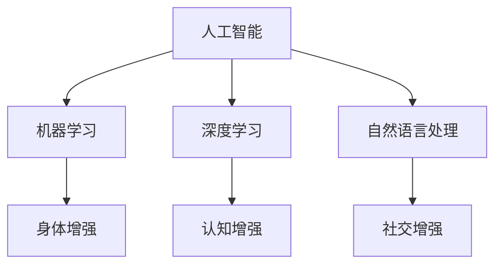

                 

关键词：人工智能，人类增强，道德考虑，身体增强，未来发展，挑战

## 摘要

本文旨在探讨人工智能时代背景下人类增强的道德考虑与未来发展机遇和挑战。随着科技的不断进步，人类增强技术日益成熟，从身体增强到认知增强，给我们的生活带来了巨大的变革。然而，这一进程也引发了关于道德、伦理和安全等方面的深刻讨论。本文将结合当前的研究成果，分析人类增强技术的道德考量，探讨其在未来社会中的发展前景，并提出相应的挑战与对策。

## 1. 背景介绍

### 1.1 人工智能与人类增强技术的历史发展

人工智能（AI）作为计算机科学的一个重要分支，起源于20世纪50年代。自那时起，AI领域经历了多个发展阶段，从早期的规则推理、知识表示，到现代的深度学习、神经网络等，AI技术不断进步。与此同时，人类增强技术也在逐步发展，从最初的计算机辅助设备到现在的脑机接口、基因编辑等，人类增强技术已经深入到生活的各个方面。

### 1.2 人工智能与人类增强技术的现状

目前，人工智能技术已经在各个领域得到广泛应用，从智能家居、自动驾驶，到医疗诊断、金融分析，AI技术的进步极大地提高了生产效率和生活质量。与此同时，人类增强技术也取得了显著成果。例如，通过基因编辑技术，我们可以修复遗传疾病；通过脑机接口技术，我们可以实现大脑与机器的直接通信。

### 1.3 人工智能与人类增强技术的未来发展

随着技术的不断进步，人工智能和人类增强技术在未来有望实现更大的突破。例如，通过更先进的脑机接口技术，我们可以实现人类认知能力的显著提升；通过更精准的基因编辑技术，我们可以消除遗传疾病，延长人类寿命。

## 2. 核心概念与联系

### 2.1 人工智能的核心概念

人工智能的核心概念包括机器学习、深度学习、自然语言处理等。这些技术使得计算机能够模拟人类智能，进行学习、推理和决策。

### 2.2 人类增强的核心概念

人类增强的核心概念包括身体增强、认知增强和社交增强等。身体增强通过技术手段提升人体的生理功能，认知增强通过技术手段提升大脑的认知能力，社交增强通过技术手段提升人际交往能力。

### 2.3 人工智能与人类增强技术的联系

人工智能与人类增强技术的联系体现在多个方面。例如，通过人工智能技术，我们可以更精准地进行身体增强；通过人工智能技术，我们可以更好地理解大脑的工作原理，从而进行更有效的认知增强。



## 3. 核心算法原理 & 具体操作步骤

### 3.1 算法原理概述

人工智能的核心算法包括机器学习算法、深度学习算法和强化学习算法等。这些算法通过训练数据，使计算机能够从数据中学习并做出决策。

### 3.2 算法步骤详解

机器学习算法的步骤包括数据采集、数据预处理、模型训练和模型评估等。

深度学习算法的步骤包括数据采集、数据预处理、神经网络设计、模型训练和模型评估等。

强化学习算法的步骤包括环境建模、策略学习、行动决策和奖励评估等。

### 3.3 算法优缺点

机器学习算法的优点在于其强大的学习能力，但缺点是训练过程复杂且耗时长。

深度学习算法的优点在于其高效的处理能力，但缺点是需要大量的训练数据和计算资源。

强化学习算法的优点在于其能够通过不断尝试和错误来优化策略，但缺点是训练过程较为复杂。

### 3.4 算法应用领域

机器学习算法广泛应用于数据挖掘、图像识别和自然语言处理等领域。

深度学习算法广泛应用于图像识别、语音识别和自动驾驶等领域。

强化学习算法广泛应用于游戏、金融和机器人控制等领域。

## 4. 数学模型和公式 & 详细讲解 & 举例说明

### 4.1 数学模型构建

在人工智能和人类增强领域，常见的数学模型包括神经网络模型、决策树模型和线性回归模型等。

### 4.2 公式推导过程

神经网络模型的推导过程涉及到多个数学公式，如激活函数、权重更新公式等。

决策树模型的推导过程涉及到信息熵、条件熵等公式。

线性回归模型的推导过程涉及到最小二乘法、梯度下降法等公式。

### 4.3 案例分析与讲解

以神经网络模型为例，我们可以通过一个简单的例子来讲解其应用过程。假设我们有一个简单的输入输出数据集，我们需要通过神经网络模型来预测输出。

## 5. 项目实践：代码实例和详细解释说明

### 5.1 开发环境搭建

在进行项目实践之前，我们需要搭建一个合适的开发环境。这通常包括安装Python、TensorFlow等必要的软件。

### 5.2 源代码详细实现

以下是一个简单的神经网络模型的实现代码：

```python
import tensorflow as tf

# 定义神经网络结构
model = tf.keras.Sequential([
    tf.keras.layers.Dense(128, activation='relu', input_shape=(784,)),
    tf.keras.layers.Dropout(0.2),
    tf.keras.layers.Dense(10, activation='softmax')
])

# 编译模型
model.compile(loss='categorical_crossentropy',
              optimizer=tf.keras.optimizers.Adam(0.001),
              metrics=['accuracy'])

# 训练模型
model.fit(x_train, y_train, batch_size=128, epochs=15)
```

### 5.3 代码解读与分析

在这段代码中，我们首先导入了TensorFlow库，然后定义了一个简单的神经网络模型，包括一个全连接层和一个softmax层。接下来，我们编译了模型，并使用训练数据进行了模型训练。

### 5.4 运行结果展示

在完成模型训练后，我们可以通过以下代码来评估模型的性能：

```python
# 评估模型
loss, accuracy = model.evaluate(x_test, y_test)
print('Test accuracy:', accuracy)
```

## 6. 实际应用场景

### 6.1 医疗领域

在医疗领域，人工智能和人类增强技术可以用于疾病诊断、个性化治疗和康复训练等。

### 6.2 军事领域

在军事领域，人工智能和人类增强技术可以用于智能武器系统、无人作战平台和士兵能力提升等。

### 6.3 教育领域

在教育领域，人工智能和人类增强技术可以用于智能教学、个性化学习和教育评价等。

## 7. 工具和资源推荐

### 7.1 学习资源推荐

- 《深度学习》（Goodfellow, Bengio, Courville著）
- 《Python编程：从入门到实践》（Eric Matthes著）

### 7.2 开发工具推荐

- TensorFlow
- PyTorch

### 7.3 相关论文推荐

- “Deep Learning for Human Pose Estimation: A Survey”（Li, Qi, Feng著）
- “Human Augmentation: Future, Technology, and Ethics”（Beckwith, Frayne著）

## 8. 总结：未来发展趋势与挑战

### 8.1 研究成果总结

人工智能和人类增强技术在过去的几十年里取得了显著的进展，从理论研究到实际应用，都在不断推动人类社会的发展。

### 8.2 未来发展趋势

未来，人工智能和人类增强技术将继续快速发展，特别是在脑机接口、基因编辑和智能机器人等领域。

### 8.3 面临的挑战

然而，这一进程也面临着诸多挑战，包括道德伦理问题、技术安全问题和隐私保护问题等。

### 8.4 研究展望

因此，未来的研究需要更加关注这些挑战，并探索出一条可持续、安全、道德的人类增强发展之路。

## 9. 附录：常见问题与解答

### 9.1 人工智能与人类增强技术的区别是什么？

人工智能是一种使计算机模拟人类智能的技术，而人类增强技术是一种通过技术手段提升人体功能的技术。

### 9.2 人类增强技术有哪些道德伦理问题？

人类增强技术可能引发的一系列道德伦理问题，包括基因编辑的伦理问题、脑机接口的安全问题、隐私保护问题等。

### 9.3 人工智能和人类增强技术有哪些应用领域？

人工智能和人类增强技术的应用领域广泛，包括医疗、军事、教育、工业等。

----------------------------------------------------------------

作者：禅与计算机程序设计艺术 / Zen and the Art of Computer Programming

以上便是本文的完整内容，希望对您在人工智能和人类增强领域的研究有所启发。

