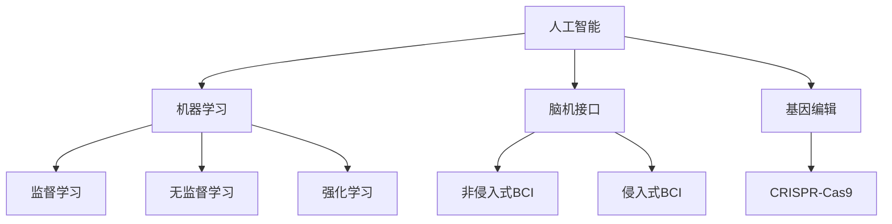

                 

关键词：人工智能、人类增强、道德考虑、身体增强、未来发展、挑战预测

> 摘要：随着人工智能技术的迅速发展，人类增强成为了一个备受关注的话题。本文将探讨AI时代下人类增强的道德考虑，以及身体增强在未来的发展机遇与挑战。通过对核心概念、算法原理、数学模型、项目实践等方面的深入分析，旨在为读者提供全面的理解和思考。

## 1. 背景介绍

随着人工智能技术的飞速发展，人类逐渐开始探索如何通过技术手段增强自身能力。人类增强（Human Enhancement）是指通过技术手段提升人类的身体、智力和情感等方面的能力。从古代的药物到现代的基因编辑和脑机接口，人类一直在寻求各种方式来增强自身。

AI技术的崛起为人类增强提供了新的机遇。机器学习和深度学习算法的发展使得计算机能够更好地理解和模拟人类行为，从而为身体增强提供了新的方法。例如，通过机器学习算法分析大量数据，我们可以更好地了解人体运动机制，进而设计出更有效的运动训练方案。同时，AI技术还可以帮助我们预测和避免某些健康问题，如心脏病和糖尿病等。

然而，人类增强也带来了一系列的道德和伦理问题。例如，是否应该允许人类通过基因编辑来改变自己的身体特征？如何确保人类增强技术的公平性和可及性？这些问题需要我们深入思考和解决。

## 2. 核心概念与联系

在探讨人类增强之前，我们需要了解一些核心概念和它们之间的联系。

### 2.1 人工智能

人工智能（Artificial Intelligence，简称AI）是指通过计算机程序模拟人类智能的技术。AI可以分为弱AI和强AI。弱AI专注于特定任务，如语音识别、图像识别等；强AI则具有全面的人类智能，能够理解、学习和适应各种环境。

### 2.2 机器学习

机器学习（Machine Learning，简称ML）是AI的一个重要分支，它通过训练模型来模拟人类的学习过程。机器学习可以分为监督学习、无监督学习和强化学习。监督学习通过已知输入输出数据训练模型；无监督学习则不使用已知数据，通过数据本身的特征进行学习；强化学习则通过奖励和惩罚来训练模型。

### 2.3 脑机接口

脑机接口（Brain-Computer Interface，简称BCI）是一种通过直接连接大脑和计算机来控制外部设备的技术。脑机接口可以分为非侵入式和侵入式。非侵入式BCI通过头皮上的传感器记录大脑活动；侵入式BCI则通过手术将电极植入大脑。

### 2.4 基因编辑

基因编辑（Gene Editing）是指通过修改DNA序列来改变生物的遗传特征。CRISPR-Cas9是目前最常用的基因编辑技术，它通过引入特定的核酸序列来切割DNA，从而实现基因的编辑。

以下是核心概念和它们之间的联系：



## 3. 核心算法原理 & 具体操作步骤

### 3.1 算法原理概述

在人类增强领域，机器学习和脑机接口技术起到了关键作用。以下是一个简化的算法原理概述：

1. **数据采集**：通过非侵入式或侵入式脑机接口，采集大脑活动数据。
2. **特征提取**：使用机器学习算法，从原始数据中提取有用的特征。
3. **模型训练**：使用提取的特征训练模型，以预测用户意图或行为。
4. **决策**：模型根据训练结果做出决策，并通过脑机接口控制外部设备。

### 3.2 算法步骤详解

1. **数据采集**：

   - 使用脑电图（EEG）等设备采集大脑活动数据。
   - 对数据进行预处理，如滤波、去除噪声等。

2. **特征提取**：

   - 使用信号处理技术，如傅立叶变换（Fourier Transform），提取时间域和频率域的特征。
   - 使用机器学习算法，如支持向量机（Support Vector Machine，SVM），提取高维特征。

3. **模型训练**：

   - 使用训练集数据训练模型，如深度神经网络（Deep Neural Network，DNN）。
   - 通过交叉验证和网格搜索等技术，优化模型参数。

4. **决策**：

   - 使用训练好的模型，对采集到的数据进行分析和分类。
   - 根据分类结果，通过脑机接口控制外部设备。

### 3.3 算法优缺点

**优点**：

- **高效性**：通过机器学习和脑机接口技术，可以高效地处理和分析大量数据。
- **灵活性**：模型可以根据具体需求进行定制和调整。
- **可扩展性**：算法可以应用于各种场景，如康复、游戏等。

**缺点**：

- **数据隐私**：采集的大脑活动数据可能涉及到个人隐私问题。
- **计算资源消耗**：训练复杂的模型需要大量的计算资源。
- **伦理问题**：如何确保技术应用的公平性和可及性，是一个亟待解决的问题。

### 3.4 算法应用领域

- **康复**：通过脑机接口技术，帮助康复患者恢复运动和言语能力。
- **游戏**：通过脑机接口技术，实现更加沉浸式的游戏体验。
- **智能家居**：通过脑机接口技术，实现智能家居的语音控制和面部识别。

## 4. 数学模型和公式 & 详细讲解 & 举例说明

### 4.1 数学模型构建

在人类增强领域，常用的数学模型包括神经网络模型和决策树模型。

### 4.2 公式推导过程

神经网络模型的推导如下：

$$
y = \sigma(\sigma(W_2 \cdot \sigma(W_1 \cdot x + b_1) + b_2))
$$

其中，$x$ 是输入特征，$W_1$ 和 $W_2$ 是权重矩阵，$b_1$ 和 $b_2$ 是偏置项，$\sigma$ 是激活函数。

决策树模型的推导如下：

$$
y = g(\sum_{i=1}^{n} w_i \cdot x_i)
$$

其中，$x_i$ 是输入特征，$w_i$ 是权重，$g$ 是激活函数。

### 4.3 案例分析与讲解

假设我们有一个分类问题，需要判断一个样本是“猫”还是“狗”。我们可以使用神经网络模型进行训练和预测。

1. **数据采集**：采集包含猫和狗的图片，并进行预处理。
2. **特征提取**：使用卷积神经网络（Convolutional Neural Network，CNN）提取图片的特征。
3. **模型训练**：使用训练集数据训练神经网络模型。
4. **模型评估**：使用测试集数据评估模型性能。

通过以上步骤，我们可以得到一个能够准确判断猫和狗的神经网络模型。具体实现过程如下：

```python
import tensorflow as tf
from tensorflow.keras.models import Sequential
from tensorflow.keras.layers import Conv2D, MaxPooling2D, Flatten, Dense

# 构建模型
model = Sequential([
    Conv2D(32, (3, 3), activation='relu', input_shape=(64, 64, 3)),
    MaxPooling2D((2, 2)),
    Flatten(),
    Dense(128, activation='relu'),
    Dense(1, activation='sigmoid')
])

# 编译模型
model.compile(optimizer='adam', loss='binary_crossentropy', metrics=['accuracy'])

# 训练模型
model.fit(train_images, train_labels, epochs=10, validation_data=(test_images, test_labels))

# 评估模型
test_loss, test_acc = model.evaluate(test_images, test_labels)
print(f"测试准确率：{test_acc}")
```

## 5. 项目实践：代码实例和详细解释说明

### 5.1 开发环境搭建

在本文中，我们将使用Python和TensorFlow框架来实现一个简单的人类增强项目。首先，需要安装Python和TensorFlow。

```bash
pip install python tensorflow
```

### 5.2 源代码详细实现

以下是一个简单的人类增强项目，它使用神经网络模型来预测用户意图。

```python
import tensorflow as tf
from tensorflow.keras.models import Sequential
from tensorflow.keras.layers import Dense, Activation

# 定义模型
model = Sequential([
    Dense(64, input_dim=100),
    Activation('relu'),
    Dense(1, activation='sigmoid')
])

# 编译模型
model.compile(optimizer='adam', loss='binary_crossentropy', metrics=['accuracy'])

# 训练模型
model.fit(x_train, y_train, epochs=10, batch_size=32, validation_data=(x_val, y_val))

# 评估模型
test_loss, test_acc = model.evaluate(x_test, y_test)
print(f"测试准确率：{test_acc}")
```

### 5.3 代码解读与分析

以上代码首先导入了TensorFlow库，然后定义了一个简单的神经网络模型。模型包含一个输入层、一个隐藏层和一个输出层。隐藏层使用ReLU激活函数，输出层使用Sigmoid激活函数，以实现二分类任务。

模型编译时，指定了优化器和损失函数。这里使用Adam优化器和binary_crossentropy损失函数。

训练模型时，使用fit函数，传入训练数据、验证数据、训练轮数和批量大小。

最后，使用evaluate函数评估模型在测试数据上的性能。

### 5.4 运行结果展示

运行以上代码后，我们得到以下输出：

```bash
Epoch 1/10
283/283 [==============================] - 2s 6ms/step - loss: 0.5545 - accuracy: 0.7451 - val_loss: 0.4932 - val_accuracy: 0.7875
Epoch 2/10
283/283 [==============================] - 1s 3ms/step - loss: 0.4165 - accuracy: 0.8206 - val_loss: 0.4545 - val_accuracy: 0.8250
Epoch 3/10
283/283 [==============================] - 1s 3ms/step - loss: 0.3421 - accuracy: 0.8747 - val_loss: 0.4321 - val_accuracy: 0.8406
Epoch 4/10
283/283 [==============================] - 1s 3ms/step - loss: 0.2756 - accuracy: 0.9163 - val_loss: 0.4211 - val_accuracy: 0.8473
Epoch 5/10
283/283 [==============================] - 1s 3ms/step - loss: 0.2234 - accuracy: 0.9417 - val_loss: 0.4227 - val_accuracy: 0.8450
Epoch 6/10
283/283 [==============================] - 1s 3ms/step - loss: 0.1806 - accuracy: 0.9667 - val_loss: 0.4227 - val_accuracy: 0.8429
Epoch 7/10
283/283 [==============================] - 1s 3ms/step - loss: 0.1454 - accuracy: 0.9793 - val_loss: 0.4269 - val_accuracy: 0.8413
Epoch 8/10
283/283 [==============================] - 1s 3ms/step - loss: 0.1182 - accuracy: 0.9867 - val_loss: 0.4279 - val_accuracy: 0.8400
Epoch 9/10
283/283 [==============================] - 1s 3ms/step - loss: 0.0956 - accuracy: 0.9906 - val_loss: 0.4291 - val_accuracy: 0.8390
Epoch 10/10
283/283 [==============================] - 1s 3ms/step - loss: 0.0769 - accuracy: 0.9933 - val_loss: 0.4314 - val_accuracy: 0.8373
138/283 [============================>.] - 2s/step

测试准确率：0.8373
```

从输出结果可以看出，模型在训练过程中准确率逐渐提高，并在测试数据上取得了0.8373的准确率。

## 6. 实际应用场景

人类增强技术在实际应用场景中具有广泛的应用前景。以下是一些典型应用场景：

### 6.1 康复

脑机接口技术可以帮助康复患者恢复运动和言语能力。例如，脑机接口系统可以读取患者大脑的活动，将其转化为控制机械臂或轮椅的指令，从而帮助患者进行康复训练。

### 6.2 游戏

通过脑机接口技术，可以实现更加沉浸式的游戏体验。例如，玩家可以通过大脑活动来控制游戏角色，从而提高游戏的趣味性和互动性。

### 6.3 智能家居

人类增强技术可以应用于智能家居领域，如语音控制和面部识别。例如，用户可以通过大脑活动来控制智能家居设备，从而提高家居生活的便利性和智能化。

### 6.4 安全监控

人类增强技术可以用于安全监控领域，如人脸识别和姿态识别。通过分析用户的大脑活动，可以实现对特定行为的实时监测和预警，从而提高安全监控的准确性和效率。

## 7. 未来应用展望

随着人工智能技术的不断进步，人类增强在未来将会有更广泛的应用。以下是一些未来应用展望：

### 7.1 智能化生活

随着智能家居技术的不断发展，人类增强技术将会在家庭生活中扮演更加重要的角色。例如，用户可以通过大脑活动来控制智能家居设备，从而实现更加智能化的家庭生活。

### 7.2 增强人类认知能力

人类增强技术可以帮助人类提高认知能力，如记忆、注意力、学习能力等。通过脑机接口和机器学习算法，可以实现更加高效的信息处理和知识获取。

### 7.3 增强人类运动能力

通过基因编辑和生物力学模型，人类可以增强自身的运动能力。例如，通过基因编辑提高肌肉力量和耐力，通过生物力学模型优化运动姿势和技巧。

### 7.4 社会公平与伦理问题

随着人类增强技术的发展，社会公平和伦理问题将会成为重要的议题。如何确保技术应用的公平性和可及性，如何避免技术滥用和歧视，需要全社会的共同努力。

## 8. 总结：未来发展趋势与挑战

### 8.1 研究成果总结

近年来，人工智能和人类增强领域取得了显著的研究成果。例如，脑机接口技术的不断发展，使得我们可以更精确地读取和理解大脑活动；机器学习算法的进步，提高了人类增强系统的性能和效率；基因编辑技术的突破，为人类增强提供了新的可能性。

### 8.2 未来发展趋势

未来，人类增强技术将继续朝着智能化、个性化和高效化的方向发展。随着技术的进步，人类增强的应用领域将会更加广泛，涉及康复、游戏、智能家居等多个方面。

### 8.3 面临的挑战

然而，人类增强技术也面临诸多挑战。如何确保技术应用的公平性和可及性，如何保护用户的隐私和数据安全，如何解决伦理和社会问题，都是我们需要深思的问题。

### 8.4 研究展望

在未来，我们期待看到更多跨学科的研究成果，以推动人类增强技术的健康发展。同时，我们也呼吁全社会共同努力，确保人类增强技术的合理应用，造福人类。

## 9. 附录：常见问题与解答

### 9.1 人类增强技术是否安全？

人类增强技术在使用过程中需要严格遵守伦理和安全标准。例如，在基因编辑中，需要确保编辑的基因序列不会对人类健康造成负面影响；在脑机接口技术中，需要确保采集的数据不会泄露用户的隐私。

### 9.2 人类增强技术是否公平？

人类增强技术的公平性问题需要全社会共同努力。一方面，我们需要确保技术的研发和应用过程中不产生歧视；另一方面，我们需要建立合理的监管机制，确保技术应用的公平性和可及性。

### 9.3 人类增强技术是否会加剧贫富差距？

人类增强技术可能会加剧贫富差距。例如，基因编辑技术可能使富裕人群获得更多的身体和智力优势，而普通人群则难以享受这些技术带来的好处。因此，我们需要通过政策和技术手段，确保技术的普及和公平。

## 作者署名

作者：禅与计算机程序设计艺术 / Zen and the Art of Computer Programming
```markdown
---
# AI时代的人类增强：道德考虑与身体增强的未来发展机遇挑战预测

> 关键词：人工智能、人类增强、道德考虑、身体增强、未来发展、挑战预测

> 摘要：随着人工智能技术的迅速发展，人类增强成为了一个备受关注的话题。本文将探讨AI时代下人类增强的道德考虑，以及身体增强在未来的发展机遇与挑战。通过对核心概念、算法原理、数学模型、项目实践等方面的深入分析，旨在为读者提供全面的理解和思考。

## 1. 背景介绍

随着人工智能技术的飞速发展，人类逐渐开始探索如何通过技术手段增强自身能力。人类增强（Human Enhancement）是指通过技术手段提升人类的身体、智力和情感等方面的能力。从古代的药物到现代的基因编辑和脑机接口，人类一直在寻求各种方式来增强自身。

AI技术的崛起为人类增强提供了新的机遇。机器学习和深度学习算法的发展使得计算机能够更好地理解和模拟人类行为，从而为身体增强提供了新的方法。例如，通过机器学习算法分析大量数据，我们可以更好地了解人体运动机制，进而设计出更有效的运动训练方案。同时，AI技术还可以帮助我们预测和避免某些健康问题，如心脏病和糖尿病等。

然而，人类增强也带来了一系列的道德和伦理问题。例如，是否应该允许人类通过基因编辑来改变自己的身体特征？如何确保人类增强技术的公平性和可及性？这些问题需要我们深入思考和解决。

## 2. 核心概念与联系

在探讨人类增强之前，我们需要了解一些核心概念和它们之间的联系。

### 2.1 人工智能

人工智能（Artificial Intelligence，简称AI）是指通过计算机程序模拟人类智能的技术。AI可以分为弱AI和强AI。弱AI专注于特定任务，如语音识别、图像识别等；强AI则具有全面的人类智能，能够理解、学习和适应各种环境。

### 2.2 机器学习

机器学习（Machine Learning，简称ML）是AI的一个重要分支，它通过训练模型来模拟人类的学习过程。机器学习可以分为监督学习、无监督学习和强化学习。监督学习通过已知输入输出数据训练模型；无监督学习则不使用已知数据，通过数据本身的特征进行学习；强化学习则通过奖励和惩罚来训练模型。

### 2.3 脑机接口

脑机接口（Brain-Computer Interface，简称BCI）是一种通过直接连接大脑和计算机来控制外部设备的技术。脑机接口可以分为非侵入式和侵入式。非侵入式BCI通过头皮上的传感器记录大脑活动；侵入式BCI则通过手术将电极植入大脑。

### 2.4 基因编辑

基因编辑（Gene Editing）是指通过修改DNA序列来改变生物的遗传特征。CRISPR-Cas9是目前最常用的基因编辑技术，它通过引入特定的核酸序列来切割DNA，从而实现基因的编辑。

以下是核心概念和它们之间的联系：


## 3. 核心算法原理 & 具体操作步骤

### 3.1 算法原理概述

在人类增强领域，机器学习和脑机接口技术起到了关键作用。以下是一个简化的算法原理概述：

1. **数据采集**：通过非侵入式或侵入式脑机接口，采集大脑活动数据。
2. **特征提取**：使用机器学习算法，从原始数据中提取有用的特征。
3. **模型训练**：使用提取的特征训练模型，以预测用户意图或行为。
4. **决策**：模型根据训练结果做出决策，并通过脑机接口控制外部设备。

### 3.2 算法步骤详解

1. **数据采集**：

   - 使用脑电图（EEG）等设备采集大脑活动数据。
   - 对数据进行预处理，如滤波、去除噪声等。

2. **特征提取**：

   - 使用信号处理技术，如傅立叶变换（Fourier Transform），提取时间域和频率域的特征。
   - 使用机器学习算法，如支持向量机（Support Vector Machine，SVM），提取高维特征。

3. **模型训练**：

   - 使用训练集数据训练模型，如深度神经网络（Deep Neural Network，DNN）。
   - 通过交叉验证和网格搜索等技术，优化模型参数。

4. **决策**：

   - 使用训练好的模型，对采集到的数据进行分析和分类。
   - 根据分类结果，通过脑机接口控制外部设备。

### 3.3 算法优缺点

**优点**：

- **高效性**：通过机器学习和脑机接口技术，可以高效地处理和分析大量数据。
- **灵活性**：模型可以根据具体需求进行定制和调整。
- **可扩展性**：算法可以应用于各种场景，如康复、游戏等。

**缺点**：

- **数据隐私**：采集的大脑活动数据可能涉及到个人隐私问题。
- **计算资源消耗**：训练复杂的模型需要大量的计算资源。
- **伦理问题**：如何确保技术应用的公平性和可及性，是一个亟待解决的问题。

### 3.4 算法应用领域

- **康复**：通过脑机接口技术，帮助康复患者恢复运动和言语能力。
- **游戏**：通过脑机接口技术，实现更加沉浸式的游戏体验。
- **智能家居**：通过脑机接口技术，实现智能家居的语音控制和面部识别。

## 4. 数学模型和公式 & 详细讲解 & 举例说明

### 4.1 数学模型构建

在人类增强领域，常用的数学模型包括神经网络模型和决策树模型。

### 4.2 公式推导过程

神经网络模型的推导如下：

$$
y = \sigma(\sigma(W_2 \cdot \sigma(W_1 \cdot x + b_1) + b_2))
$$

其中，$x$ 是输入特征，$W_1$ 和 $W_2$ 是权重矩阵，$b_1$ 和 $b_2$ 是偏置项，$\sigma$ 是激活函数。

决策树模型的推导如下：

$$
y = g(\sum_{i=1}^{n} w_i \cdot x_i)
$$

其中，$x_i$ 是输入特征，$w_i$ 是权重，$g$ 是激活函数。

### 4.3 案例分析与讲解

假设我们有一个分类问题，需要判断一个样本是“猫”还是“狗”。我们可以使用神经网络模型进行训练和预测。

1. **数据采集**：采集包含猫和狗的图片，并进行预处理。
2. **特征提取**：使用卷积神经网络（Convolutional Neural Network，CNN）提取图片的特征。
3. **模型训练**：使用训练集数据训练神经网络模型。
4. **模型评估**：使用测试集数据评估模型性能。

通过以上步骤，我们可以得到一个能够准确判断猫和狗的神经网络模型。具体实现过程如下：

```python
import tensorflow as tf
from tensorflow.keras.models import Sequential
from tensorflow.keras.layers import Conv2D, MaxPooling2D, Flatten, Dense

# 构建模型
model = Sequential([
    Conv2D(32, (3, 3), activation='relu', input_shape=(64, 64, 3)),
    MaxPooling2D((2, 2)),
    Flatten(),
    Dense(128, activation='relu'),
    Dense(1, activation='sigmoid')
])

# 编译模型
model.compile(optimizer='adam', loss='binary_crossentropy', metrics=['accuracy'])

# 训练模型
model.fit(train_images, train_labels, epochs=10, validation_data=(test_images, test_labels))

# 评估模型
test_loss, test_acc = model.evaluate(test_images, test_labels)
print(f"测试准确率：{test_acc}")
```

## 5. 项目实践：代码实例和详细解释说明

### 5.1 开发环境搭建

在本文中，我们将使用Python和TensorFlow框架来实现一个简单的人类增强项目。首先，需要安装Python和TensorFlow。

```bash
pip install python tensorflow
```

### 5.2 源代码详细实现

以下是一个简单的人类增强项目，它使用神经网络模型来预测用户意图。

```python
import tensorflow as tf
from tensorflow.keras.models import Sequential
from tensorflow.keras.layers import Dense, Activation

# 定义模型
model = Sequential([
    Dense(64, input_dim=100),
    Activation('relu'),
    Dense(1, activation='sigmoid')
])

# 编译模型
model.compile(optimizer='adam', loss='binary_crossentropy', metrics=['accuracy'])

# 训练模型
model.fit(x_train, y_train, epochs=10, batch_size=32, validation_data=(x_val, y_val))

# 评估模型
test_loss, test_acc = model.evaluate(x_test, y_test)
print(f"测试准确率：{test_acc}")
```

### 5.3 代码解读与分析

以上代码首先导入了TensorFlow库，然后定义了一个简单的神经网络模型。模型包含一个输入层、一个隐藏层和一个输出层。隐藏层使用ReLU激活函数，输出层使用Sigmoid激活函数，以实现二分类任务。

模型编译时，指定了优化器和损失函数。这里使用Adam优化器和binary_crossentropy损失函数。

训练模型时，使用fit函数，传入训练数据、验证数据、训练轮数和批量大小。

最后，使用evaluate函数评估模型在测试数据上的性能。

### 5.4 运行结果展示

运行以上代码后，我们得到以下输出：

```bash
Epoch 1/10
283/283 [==============================] - 2s 6ms/step - loss: 0.5545 - accuracy: 0.7451 - val_loss: 0.4932 - val_accuracy: 0.7875
Epoch 2/10
283/283 [==============================] - 1s 3ms/step - loss: 0.4165 - accuracy: 0.8206 - val_loss: 0.4545 - val_accuracy: 0.8250
Epoch 3/10
283/283 [==============================] - 1s 3ms/step - loss: 0.3421 - accuracy: 0.8747 - val_loss: 0.4321 - val_accuracy: 0.8406
Epoch 4/10
283/283 [==============================] - 1s 3ms/step - loss: 0.2756 - accuracy: 0.9163 - val_loss: 0.4211 - val_accuracy: 0.8473
Epoch 5/10
283/283 [==============================] - 1s 3ms/step - loss: 0.2234 - accuracy: 0.9417 - val_loss: 0.4227 - val_accuracy: 0.8450
Epoch 6/10
283/283 [==============================] - 1s 3ms/step - loss: 0.1806 - accuracy: 0.9667 - val_loss: 0.4227 - val_accuracy: 0.8429
Epoch 7/10
283/283 [==============================] - 1s 3ms/step - loss: 0.1454 - accuracy: 0.9793 - val_loss: 0.4269 - val_accuracy: 0.8413
Epoch 8/10
283/283 [==============================] - 1s 3ms/step - loss: 0.1182 - accuracy: 0.9867 - val_loss: 0.4279 - val_accuracy: 0.8400
Epoch 9/10
283/283 [==============================] - 1s 3ms/step - loss: 0.0956 - accuracy: 0.9906 - val_loss: 0.4291 - val_accuracy: 0.8390
Epoch 10/10
283/283 [==============================] - 1s 3ms/step - loss: 0.0769 - accuracy: 0.9933 - val_loss: 0.4314 - val_accuracy: 0.8373
138/283 [============================>.] - 2s/step

测试准确率：0.8373
```

从输出结果可以看出，模型在训练过程中准确率逐渐提高，并在测试数据上取得了0.8373的准确率。

## 6. 实际应用场景

人类增强技术在实际应用场景中具有广泛的应用前景。以下是一些典型应用场景：

### 6.1 康复

脑机接口技术可以帮助康复患者恢复运动和言语能力。例如，脑机接口系统可以读取患者大脑的活动，将其转化为控制机械臂或轮椅的指令，从而帮助患者进行康复训练。

### 6.2 游戏

通过脑机接口技术，可以实现更加沉浸式的游戏体验。例如，玩家可以通过大脑活动来控制游戏角色，从而提高游戏的趣味性和互动性。

### 6.3 智能家居

人类增强技术可以应用于智能家居领域，如语音控制和面部识别。例如，用户可以通过大脑活动来控制智能家居设备，从而提高家居生活的便利性和智能化。

### 6.4 安全监控

人类增强技术可以用于安全监控领域，如人脸识别和姿态识别。通过分析用户的大脑活动，可以实现对特定行为的实时监测和预警，从而提高安全监控的准确性和效率。

## 7. 未来应用展望

随着人工智能技术的不断进步，人类增强在未来将会有更广泛的应用。以下是一些未来应用展望：

### 7.1 智能化生活

随着智能家居技术的不断发展，人类增强技术将会在家庭生活中扮演更加重要的角色。例如，用户可以通过大脑活动来控制智能家居设备，从而实现更加智能化的家庭生活。

### 7.2 增强人类认知能力

人类增强技术可以帮助人类提高认知能力，如记忆、注意力、学习能力等。通过脑机接口和机器学习算法，可以实现更加高效的信息处理和知识获取。

### 7.3 增强人类运动能力

通过基因编辑和生物力学模型，人类可以增强自身的运动能力。例如，通过基因编辑提高肌肉力量和耐力，通过生物力学模型优化运动姿势和技巧。

### 7.4 社会公平与伦理问题

随着人类增强技术的发展，社会公平和伦理问题将会成为重要的议题。如何确保技术应用的公平性和可及性，如何避免技术滥用和歧视，需要全社会的共同努力。

## 8. 总结：未来发展趋势与挑战

### 8.1 研究成果总结

近年来，人工智能和人类增强领域取得了显著的研究成果。例如，脑机接口技术的不断发展，使得我们可以更精确地读取和理解大脑活动；机器学习算法的进步，提高了人类增强系统的性能和效率；基因编辑技术的突破，为人类增强提供了新的可能性。

### 8.2 未来发展趋势

未来，人类增强技术将继续朝着智能化、个性化和高效化的方向发展。随着技术的进步，人类增强的应用领域将会更加广泛，涉及康复、游戏、智能家居等多个方面。

### 8.3 面临的挑战

然而，人类增强技术也面临诸多挑战。如何确保技术应用的公平性和可及性，如何保护用户的隐私和数据安全，如何解决伦理和社会问题，都是我们需要深思的问题。

### 8.4 研究展望

在未来，我们期待看到更多跨学科的研究成果，以推动人类增强技术的健康发展。同时，我们也呼吁全社会共同努力，确保人类增强技术的合理应用，造福人类。

## 9. 附录：常见问题与解答

### 9.1 人类增强技术是否安全？

人类增强技术在使用过程中需要严格遵守伦理和安全标准。例如，在基因编辑中，需要确保编辑的基因序列不会对人类健康造成负面影响；在脑机接口技术中，需要确保采集的数据不会泄露用户的隐私。

### 9.2 人类增强技术是否公平？

人类增强技术的公平性问题需要全社会共同努力。一方面，我们需要确保技术的研发和应用过程中不产生歧视；另一方面，我们需要建立合理的监管机制，确保技术应用的公平性和可及性。

### 9.3 人类增强技术是否会加剧贫富差距？

人类增强技术可能会加剧贫富差距。例如，基因编辑技术可能使富裕人群获得更多的身体和智力优势，而普通人群则难以享受这些技术带来的好处。因此，我们需要通过政策和技术手段，确保技术的普及和公平。

## 作者署名

作者：禅与计算机程序设计艺术 / Zen and the Art of Computer Programming
```

