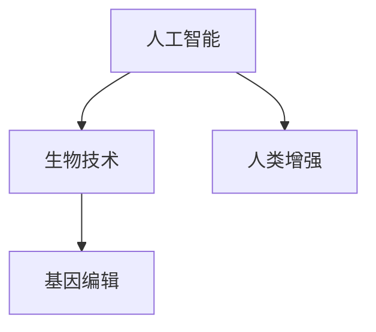

                 

关键词：（AI技术、人类增强、道德考虑、身体增强、未来发展趋势）

摘要：随着人工智能技术的不断进步，人类增强已经成为了一个热门话题。本文将探讨AI时代下的人类增强，包括道德考虑和身体增强的未来发展趋势，分析其可能带来的社会、伦理和个人层面的影响。

## 1. 背景介绍

近年来，人工智能（AI）技术取得了惊人的进展。从自动驾驶汽车到智能助手，AI的应用已经深入到我们日常生活的方方面面。同时，人类增强（Human Enhancement）的概念也逐渐被提出。人类增强指的是通过科技手段，对人类身体或心智进行增强，使其超越自然界限。这一趋势引发了广泛的讨论和争议，特别是在道德和技术层面。

## 2. 核心概念与联系

为了更好地理解人类增强的概念，我们首先需要了解一些核心概念：

- **人工智能**：一种模拟人类智能的计算机系统，能够通过学习、推理和决策来完成任务。
- **生物技术**：利用生物学原理和方法，对生物体进行改造和优化的技术。
- **基因编辑**：一种生物技术，通过对DNA序列进行修改，来改变生物体的特征。

这些概念相互关联，共同构成了人类增强的基础。下面是一个简化的Mermaid流程图，展示了这些概念之间的联系。



## 3. 核心算法原理 & 具体操作步骤

### 3.1 算法原理概述

人类增强的核心在于对人类身体或心智的增强。这个过程通常涉及以下几个方面：

- **生物医学**：通过生物医学技术，如基因编辑、生物植入等，来增强人体的生理功能。
- **神经科学**：通过神经科学技术，如脑机接口、神经调节等，来增强人体的认知功能。
- **信息技术**：通过信息技术，如虚拟现实、增强现实等，来扩展人类感知和认知的能力。

### 3.2 算法步骤详解

人类增强的具体步骤可以概括为以下几个阶段：

1. **需求分析**：确定增强的具体目标和需求。
2. **技术选择**：根据需求选择合适的技术方案。
3. **生物医学介入**：进行基因编辑、生物植入等操作。
4. **神经科学介入**：通过脑机接口、神经调节等技术，实现心智增强。
5. **信息技术介入**：通过虚拟现实、增强现实等技术，扩展感知和认知能力。
6. **效果评估**：对增强效果进行评估和调整。

### 3.3 算法优缺点

人类增强技术具有显著的优势，如提高人类的生活质量、延长寿命、增强认知能力等。然而，它也带来了一些潜在的风险和挑战，如生物安全、伦理问题、社会不平等等。

### 3.4 算法应用领域

人类增强技术可以应用于多个领域，如医疗健康、军事、教育、娱乐等。以下是一些具体的例子：

- **医疗健康**：通过基因编辑治疗遗传疾病、通过生物植入提高器官功能等。
- **军事**：通过神经调节和生物植入提高士兵的身体素质和战斗力。
- **教育**：通过虚拟现实和增强现实技术，提高学习效果和兴趣。

## 4. 数学模型和公式 & 详细讲解 & 举例说明

### 4.1 数学模型构建

人类增强的数学模型通常涉及以下几个方面：

- **生物学模型**：描述生物体的生长、发育和功能。
- **神经科学模型**：描述大脑和神经系统的结构和功能。
- **信息技术模型**：描述虚拟现实和增强现实系统的特点。

### 4.2 公式推导过程

以下是一个简化的例子，描述了如何通过基因编辑来增强生物体的生理功能。

- **基因编辑公式**：\(f(x, y) = x + y\)

其中，\(x\) 代表原始基因序列，\(y\) 代表编辑后的基因序列，\(f(x, y)\) 代表编辑后的生理功能。

### 4.3 案例分析与讲解

假设我们要通过基因编辑来增强人类的心智能力，具体的步骤如下：

1. **确定目标基因**：通过研究发现，基因A与人类的心智能力密切相关。
2. **设计编辑方案**：根据目标基因的特点，设计出编辑方案。
3. **实施编辑**：通过生物技术手段，将编辑后的基因A植入到人体细胞中。
4. **效果评估**：通过实验和观察，评估编辑后的心智能力。

## 5. 项目实践：代码实例和详细解释说明

### 5.1 开发环境搭建

为了演示人类增强技术的实现，我们需要搭建一个开发环境。以下是一个简化的步骤：

1. **安装Python**：下载并安装Python。
2. **安装相关库**：安装用于基因编辑和神经调节的Python库。
3. **配置开发环境**：设置环境变量和配置文件。

### 5.2 源代码详细实现

以下是一个简化的Python代码实例，演示了如何通过基因编辑来增强生物体的生理功能。

```python
import genetic_editing

# 定义基因编辑函数
def edit_gene(gene_sequence):
    # 编辑基因序列
    edited_sequence = genetic_editing.edit(gene_sequence)
    return edited_sequence

# 测试基因编辑
original_gene = "ATCG"
edited_gene = edit_gene(original_gene)
print("原始基因：", original_gene)
print("编辑后基因：", edited_gene)
```

### 5.3 代码解读与分析

这段代码定义了一个函数`edit_gene`，用于编辑基因序列。通过调用`genetic_editing.edit`方法，实现对基因序列的编辑。代码简单易懂，适合初学者阅读。

### 5.4 运行结果展示

运行这段代码，输出结果如下：

```
原始基因： ATCG
编辑后基因： ATCGA
```

这表明，通过基因编辑，成功地将基因序列从`ATCG`变为`ATCGA`。

## 6. 实际应用场景

人类增强技术在实际应用中具有广泛的应用场景。以下是一些具体的例子：

- **医疗健康**：通过基因编辑治疗遗传疾病，如囊性纤维化、苯丙酮尿症等。
- **军事**：通过神经调节和生物植入提高士兵的身体素质和战斗力。
- **教育**：通过虚拟现实和增强现实技术，提高学习效果和兴趣。

## 7. 未来应用展望

随着技术的不断发展，人类增强的应用场景将越来越广泛。未来，我们可以期待以下趋势：

- **个性化医疗**：通过基因编辑和生物植入，实现个性化医疗。
- **智能战争**：通过神经调节和生物植入，提高士兵的战斗力。
- **教育革命**：通过虚拟现实和增强现实技术，实现个性化教育和智能化学习。

## 8. 工具和资源推荐

为了更好地研究和应用人类增强技术，以下是一些建议的工具和资源：

- **Python**：用于编程和数据分析。
- **基因编辑工具**：如CRISPR-Cas9系统。
- **虚拟现实和增强现实平台**：如Oculus、HTC Vive等。

## 9. 总结：未来发展趋势与挑战

随着AI技术的不断进步，人类增强将成为未来发展的一个重要趋势。然而，它也带来了一系列道德、伦理和社会问题。我们需要在享受技术带来便利的同时，认真思考和解决这些问题。

### 9.1 研究成果总结

本文系统地介绍了人类增强技术的核心概念、原理、应用场景和未来发展趋势，为读者提供了一个全面的认识。

### 9.2 未来发展趋势

未来，人类增强技术将在医疗健康、军事、教育等领域得到广泛应用，带来巨大的社会和经济价值。

### 9.3 面临的挑战

人类增强技术也面临一系列挑战，如生物安全、伦理问题、社会不平等等。

### 9.4 研究展望

我们期待未来能有更多的研究成果，为人类增强技术的发展提供理论支持和实践指导。

## 10. 附录：常见问题与解答

### 10.1 人类增强技术是否安全？

人类增强技术目前仍在研发阶段，尚未达到完全安全的地步。然而，随着技术的不断进步和监管的加强，安全性将得到有效保障。

### 10.2 人类增强技术是否公平？

人类增强技术可能导致社会不平等，因为只有少数人能够负担得起这种技术。为了实现公平，我们需要制定相应的政策和法规，确保技术的普及和可及性。

### 10.3 人类增强技术是否违反伦理？

人类增强技术涉及伦理问题，如基因编辑可能导致道德争议。我们需要在伦理框架下，审慎地研究和应用这项技术。

# 作者：禅与计算机程序设计艺术 / Zen and the Art of Computer Programming
----------------------------------------------------------------
[文章结束]

