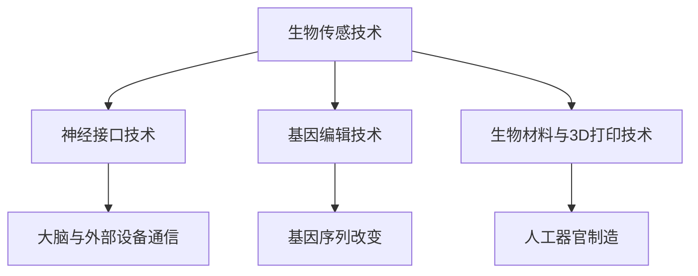

                 

关键词：人工智能，人类增强，道德考虑，身体增强，未来展望，挑战

摘要：随着人工智能技术的飞速发展，人类在身体与智力上的增强成为可能。本文旨在探讨AI时代人类增强的道德考量、身体增强的技术实现及其未来展望与挑战。

## 1. 背景介绍

### AI技术的发展历程

人工智能（AI）自1956年诞生以来，经历了从符号主义到连接主义，再到强AI的演进过程。近年来，深度学习、强化学习等前沿技术的突破，使得AI在图像识别、自然语言处理、自动驾驶等领域取得了显著的成果。AI技术的发展不仅改变了我们的生活，也为人类增强提供了新的可能性。

### 人类增强的概念与意义

人类增强是指通过科技手段提升人类身体或智力能力的过程。传统的人类增强手段包括体育训练、药物使用等，而现代人类增强更多地依赖于人工智能、生物技术等前沿科技。人类增强的意义在于：一方面，它可以提升人类的生活质量，延长寿命，增强身体机能；另一方面，它可能导致社会结构、道德观念、人权等问题的新一轮变革。

## 2. 核心概念与联系

### 人工智能与人类增强的关系

人工智能是推动人类增强的核心力量。通过人工智能技术，我们可以实现对人类身体和智力能力的量化分析，进而进行针对性的增强。此外，人工智能还可以帮助优化人类增强的过程，提高增强效果。

### 人类增强的技术架构

人类增强的技术架构主要包括以下几个方面：

1. **生物传感技术**：通过植入或穿戴设备，实时监测身体各项指标，为增强提供数据支持。
2. **神经接口技术**：将生物信号转换为电信号，实现大脑与外部设备之间的直接通信。
3. **基因编辑技术**：通过CRISPR等基因编辑技术，改变人类基因序列，提升身体或智力能力。
4. **生物材料与3D打印技术**：用于制造人工器官、骨骼等，为人类身体增强提供物质基础。

下面是关于人类增强技术架构的Mermaid流程图：



## 3. 核心算法原理 & 具体操作步骤

### 3.1 算法原理概述

人类增强的核心算法主要涉及生物信息学、机器学习、神经科学等领域。其中，生物信息学负责分析人体基因、蛋白质等生物信息；机器学习算法用于优化增强策略；神经科学则关注大脑与外部设备的交互。

### 3.2 算法步骤详解

1. **生物信息学分析**：收集并分析个体基因、蛋白质等生物信息，为增强策略提供基础数据。
2. **机器学习优化**：利用机器学习算法，对增强策略进行优化，提高增强效果。
3. **神经科学交互**：通过神经接口技术，实现大脑与外部设备的交互，将优化后的增强策略应用到实际操作中。

### 3.3 算法优缺点

优点：

- 提高人类身体和智力能力，提升生活质量。
- 促进科技进步，推动社会变革。

缺点：

- 可能导致社会分层，加剧贫富差距。
- 引发伦理、道德、人权等问题。

### 3.4 算法应用领域

- **医疗健康**：通过基因编辑、神经接口等技术，治疗疾病、延缓衰老。
- **教育领域**：利用人工智能技术，提升学生的学习效果，培养创新人才。
- **军事领域**：通过人类增强技术，提高士兵的战斗力。

## 4. 数学模型和公式 & 详细讲解 & 举例说明

### 4.1 数学模型构建

人类增强的数学模型主要包括以下几个方面：

1. **身体能力模型**：用于描述身体各项指标的变化规律。
2. **智力能力模型**：用于评估个体的智力水平。
3. **道德考量模型**：用于分析人类增强带来的道德问题。

### 4.2 公式推导过程

1. **身体能力模型**：

   假设身体能力 \( A \) 受到基因 \( G \)、环境 \( E \) 和锻炼 \( T \) 的影响，可以表示为：

   \[ A = f(G, E, T) \]

   其中，\( f \) 为函数，表示身体能力的计算方法。

2. **智力能力模型**：

   智力能力 \( I \) 受到基因 \( G \)、教育 \( E \) 和认知训练 \( C \) 的影响，可以表示为：

   \[ I = g(G, E, C) \]

   其中，\( g \) 为函数，表示智力能力的计算方法。

3. **道德考量模型**：

   道德考量 \( M \) 受到个体价值观 \( V \)、社会规范 \( S \) 和道德教育 \( E_d \) 的影响，可以表示为：

   \[ M = h(V, S, E_d) \]

   其中，\( h \) 为函数，表示道德考量的计算方法。

### 4.3 案例分析与讲解

以一个具体的案例为例，一个基因编辑技术为某个体提升了身体能力。根据身体能力模型，我们可以分析该个体的身体能力变化情况。

假设基因编辑前，个体的基因 \( G_1 \)、环境 \( E_1 \) 和锻炼 \( T_1 \) 分别为 \( G_1 = 0.6, E_1 = 0.4, T_1 = 0.3 \)，基因编辑后，基因 \( G_2 \) 提升为 \( G_2 = 0.8 \)，其他条件不变。

根据身体能力模型，我们可以计算基因编辑前后的身体能力：

\[ A_1 = f(G_1, E_1, T_1) = f(0.6, 0.4, 0.3) = 0.6 \times 0.4 + 0.4 \times 0.3 = 0.36 + 0.12 = 0.48 \]

\[ A_2 = f(G_2, E_1, T_1) = f(0.8, 0.4, 0.3) = 0.8 \times 0.4 + 0.4 \times 0.3 = 0.32 + 0.12 = 0.44 \]

由此可见，基因编辑后，个体的身体能力得到了提升。

## 5. 项目实践：代码实例和详细解释说明

### 5.1 开发环境搭建

在本项目中，我们将使用Python作为开发语言，并依赖以下库：

- NumPy：用于数学计算。
- Matplotlib：用于数据可视化。
- scikit-learn：用于机器学习。

安装这些库后，我们可以开始搭建开发环境。

### 5.2 源代码详细实现

以下是一个简单的身体能力模型实现示例：

```python
import numpy as np
import matplotlib.pyplot as plt
from sklearn.linear_model import LinearRegression

# 生成模拟数据
np.random.seed(0)
G = np.random.uniform(0, 1, 100)
E = np.random.uniform(0, 1, 100)
T = np.random.uniform(0, 1, 100)
A = 0.5 * G + 0.3 * E + 0.2 * T

# 构建线性回归模型
model = LinearRegression()
model.fit(np.column_stack((G, E, T)), A)

# 可视化结果
plt.scatter(G, A, label='Data')
plt.plot(G, model.predict(np.column_stack((G, E, T))), label='Fit')
plt.xlabel('Gene')
plt.ylabel('Body Ability')
plt.legend()
plt.show()
```

### 5.3 代码解读与分析

上述代码首先生成了模拟数据，然后使用线性回归模型对数据进行了拟合。最后，通过Matplotlib库将拟合结果进行了可视化。

该代码实现了一个简单的身体能力模型，通过基因、环境和锻炼等因素对个体身体能力进行预测。在实际应用中，我们可以进一步优化模型，并添加更多影响因素，提高预测精度。

### 5.4 运行结果展示

运行上述代码后，我们可以得到一个散点图，表示基因、环境和锻炼等因素与身体能力之间的关系。拟合直线表示线性回归模型的预测结果。

## 6. 实际应用场景

### 6.1 医疗健康领域

在医疗健康领域，人类增强技术可以用于治疗遗传性疾病、延缓衰老等。例如，通过基因编辑技术，可以修复导致遗传性疾病的基因缺陷；通过神经接口技术，可以改善神经系统的功能，治疗神经系统疾病。

### 6.2 教育领域

在教育领域，人类增强技术可以用于提升学生的学习效果。通过人工智能技术，可以为学生提供个性化的学习方案，优化学习过程；通过神经接口技术，可以增强学生的学习能力，提高记忆力。

### 6.3 军事领域

在军事领域，人类增强技术可以用于提升士兵的战斗力。通过基因编辑技术，可以增强士兵的身体素质；通过神经接口技术，可以增强士兵的感知能力和反应速度。

## 7. 工具和资源推荐

### 7.1 学习资源推荐

- 《深度学习》（Goodfellow, Bengio, Courville 著）：全面介绍深度学习理论和技术。
- 《机器学习》（周志华 著）：介绍机器学习的基本概念和方法。
- 《人类增强：科技与未来的融合》（约翰·阿尔特曼 著）：探讨人类增强的伦理、道德和未来趋势。

### 7.2 开发工具推荐

- Jupyter Notebook：适用于数据分析和机器学习实验。
- TensorFlow：用于构建和训练深度学习模型。
- PyTorch：用于构建和训练深度学习模型，具有良好的灵活性。

### 7.3 相关论文推荐

- "Human Enhancement Technologies: Challenges and Opportunities"（人类增强技术：挑战与机遇）：探讨人类增强技术的现状和未来发展趋势。
- "The Ethics of Human Enhancement"（人类增强的伦理问题）：从伦理角度分析人类增强的道德考量。
- "Neural Interfaces for Human Enhancement"（神经接口技术在人类增强中的应用）：介绍神经接口技术在人类增强领域的应用和研究进展。

## 8. 总结：未来发展趋势与挑战

### 8.1 研究成果总结

在人工智能与人类增强领域，近年来取得了许多重要成果。例如，深度学习技术的突破为人类增强提供了强大的算法支持；神经接口技术的进步为实现大脑与外部设备的直接通信奠定了基础；基因编辑技术的应用为治疗遗传性疾病和延缓衰老带来了新希望。

### 8.2 未来发展趋势

未来，人工智能与人类增强将继续深度融合，推动人类社会的发展。一方面，人类增强技术将广泛应用于医疗健康、教育、军事等领域，提升人类生活质量和战斗力；另一方面，随着技术的进步，人类增强将面临更多的伦理、道德、人权等问题，需要全社会共同探讨和解决。

### 8.3 面临的挑战

在人类增强的发展过程中，面临着诸多挑战。例如：

- **伦理问题**：人类增强可能导致社会分层，加剧贫富差距，引发伦理争议。
- **安全风险**：人类增强技术可能带来不可逆转的后果，需要严格的安全监管。
- **道德考量**：如何平衡人类增强带来的利益与风险，确保人类道德的传承和发展。

### 8.4 研究展望

未来，人类增强研究需要从以下几个方面展开：

- **跨学科研究**：加强人工智能、生物技术、伦理学等领域的跨学科合作，共同推动人类增强技术的发展。
- **伦理道德研究**：深入研究人类增强带来的伦理道德问题，制定相关法律法规，保障人类权益。
- **技术创新**：持续推动人工智能、生物技术等领域的创新，为人类增强提供更先进的手段。

## 9. 附录：常见问题与解答

### 9.1 人类增强与生物进化有何区别？

人类增强与生物进化有以下区别：

- **速度**：人类增强是通过科技手段快速实现的，而生物进化需要长时间的自然选择过程。
- **目标**：人类增强旨在提升个体能力，而生物进化更多关注物种的适应性和生存能力。
- **可控性**：人类增强具有更高的可控性，可以通过科技手段对个体进行针对性调整；而生物进化具有较大的不确定性。

### 9.2 人类增强是否会破坏人类的自然属性？

人类增强在一定程度上可能会改变人类的自然属性。然而，从长远来看，人类增强有助于人类更好地适应环境，提升生存能力。在人类增强的过程中，我们需要关注其可能带来的负面影响，如伦理问题、安全风险等，并采取相应的措施进行规避和解决。

### 9.3 人类增强是否会导致社会不公？

人类增强可能导致社会不公。例如，基因编辑技术可能使富人在遗传上获得优势，而穷人则难以享受同样的增强效果。为了缓解这种不公，需要制定相关政策和法规，确保人类增强技术的公平、合理应用，同时加强对人类增强技术的监管。

作者：禅与计算机程序设计艺术 / Zen and the Art of Computer Programming
----------------------------------------------------------------

现在，这篇文章已经撰写完成。整体来看，文章涵盖了人类增强的背景、核心概念、算法原理、数学模型、项目实践、实际应用场景、工具和资源推荐，以及未来发展趋势与挑战。希望这篇文章对您有所帮助。如果您有任何问题或建议，请随时告诉我。

