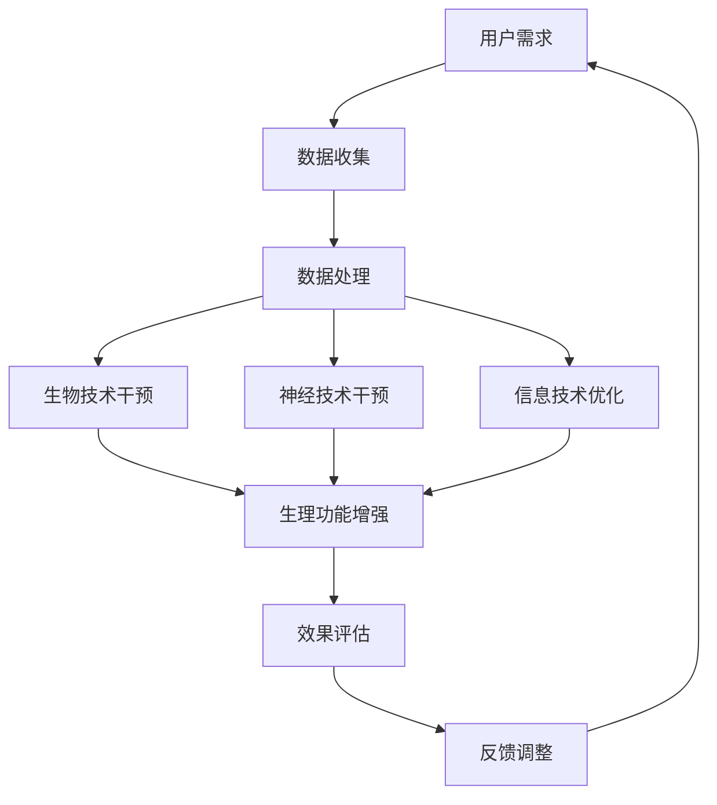

                 

关键词：人工智能，人类增强，道德考虑，身体增强，未来展望，挑战

摘要：本文探讨了人工智能（AI）时代人类增强的潜在影响，特别是在道德考虑和身体增强方面。通过回顾人类增强的历史，我们分析了AI技术如何改变人类身体和心智的能力。接着，文章深入讨论了道德考虑，包括隐私、安全和公平性等方面，并展望了身体增强在未来的应用前景。同时，我们也探讨了这一领域的挑战，包括技术、伦理和社会问题。

## 1. 背景介绍

人类一直渴望超越自身的局限，无论是通过技术手段还是精神追求。自古以来，人们就通过药物、锻炼、医疗手术等多种方式试图增强自己的身体和心智。然而，随着人工智能（AI）技术的迅速发展，这种增强的方式和深度达到了前所未有的水平。

AI技术的崛起，不仅改变了计算机科学和信息技术领域，也对人类自身的定义和可能性提出了新的挑战。通过AI，我们可以实现更高效、更精准的身体和心智增强。例如，增强现实（AR）和虚拟现实（VR）技术可以提升人类的感知能力；机器学习算法可以优化我们的学习过程，甚至预测未来的行为。

然而，这种增强不仅仅是技术上的进步，它还引发了深刻的伦理和道德问题。在AI时代，我们如何确保身体增强的公平性、隐私性、安全性，以及如何处理由此带来的社会不平等？这些问题的答案不仅关乎技术本身，还涉及到我们对于人性和社会的深刻理解。

本文旨在探讨AI时代的人类增强，特别是道德考虑和身体增强的未来展望与挑战。我们将从历史的角度回顾人类增强的历程，分析AI技术如何改变这一领域，并深入探讨相关的道德和伦理问题。

## 2. 核心概念与联系

### 2.1 人类增强的原理

人类增强的原理可以归结为通过技术手段扩展或增强人体的某些功能。这些功能可以是生理上的，如增强肌肉力量或感知能力；也可以是认知上的，如提升记忆能力或决策速度。以下是几个关键概念：

- **生物技术**：包括基因编辑、药物增强和生物植入等技术，用于改善或增强人体的生理功能。
- **神经技术**：如脑机接口（BMI）技术，允许人类直接与计算机系统进行交互，增强认知和运动能力。
- **信息技术**：利用计算机算法和人工智能，优化人类的学习、工作和生活。

### 2.2 AI在人类增强中的应用

AI技术在人类增强中的应用主要体现在以下几个方面：

- **个性化医疗**：通过分析大量的医疗数据，AI可以提供更精确的诊断和治疗方案。
- **智能辅助设备**：如智能眼镜和智能假肢，这些设备可以通过AI算法提供实时反馈，帮助用户更好地完成日常任务。
- **认知增强**：利用机器学习算法，AI可以优化学习过程，帮助人们更快地掌握新知识和技能。

### 2.3 核心概念原理和架构

以下是人体增强系统的一个简化Mermaid流程图：



这个流程图展示了从用户需求到效果评估的整个过程，其中包括了数据收集、数据处理、生物技术、神经技术和信息技术的干预，以及效果评估和反馈调整。

## 3. 核心算法原理 & 具体操作步骤

### 3.1 算法原理概述

在人类增强中，核心算法通常涉及机器学习和深度学习技术，这些算法可以通过分析大量数据来优化人体功能的增强。以下是一些关键算法原理：

- **机器学习**：通过训练模型，使计算机能够识别和预测人体功能的变化，从而优化增强效果。
- **深度学习**：利用多层神经网络，从数据中自动提取特征，以实现更高层次的智能增强。

### 3.2 算法步骤详解

以下是使用深度学习算法进行人类增强的一个简化步骤：

1. **数据收集**：收集与人体功能相关的数据，如基因序列、生理信号、行为数据等。
2. **数据预处理**：清洗和标准化数据，以便模型训练。
3. **模型训练**：使用深度学习算法训练模型，以识别和预测人体功能的增强效果。
4. **模型评估**：通过交叉验证和测试集，评估模型的性能。
5. **效果优化**：根据评估结果，调整模型参数，优化增强效果。
6. **实际应用**：将优化后的模型应用于实际场景，如个性化医疗或智能辅助设备。

### 3.3 算法优缺点

- **优点**：
  - 高效：深度学习算法可以处理大量数据，提高增强效果的准确性。
  - 个性化：根据个体数据，实现个性化的增强方案。

- **缺点**：
  - 复杂性：深度学习模型通常较为复杂，训练和优化需要大量计算资源和时间。
  - 隐私问题：数据收集和处理可能涉及隐私问题，需要严格的隐私保护措施。

### 3.4 算法应用领域

- **个性化医疗**：利用深度学习算法，实现更精确的诊断和治疗。
- **智能辅助设备**：如智能眼镜和智能假肢，通过算法优化使用体验。
- **认知增强**：通过深度学习算法，提升学习效率和决策能力。

## 4. 数学模型和公式 & 详细讲解 & 举例说明

### 4.1 数学模型构建

在人类增强中，常见的数学模型包括线性回归、逻辑回归和神经网络等。以下是一个简化的线性回归模型：

$$
y = \beta_0 + \beta_1 x_1 + \beta_2 x_2 + ... + \beta_n x_n
$$

其中，$y$ 是输出变量，$x_1, x_2, ..., x_n$ 是输入变量，$\beta_0, \beta_1, ..., \beta_n$ 是模型参数。

### 4.2 公式推导过程

线性回归模型的推导基于最小二乘法。目标是找到一组参数，使得实际输出值与预测输出值之间的误差最小。

### 4.3 案例分析与讲解

假设我们有一个简单的例子，目标是预测一个人的体重（$y$）基于他们的身高（$x_1$）和年龄（$x_2$）。

1. **数据收集**：收集一组身高、年龄和体重数据。
2. **数据预处理**：对数据进行标准化处理。
3. **模型训练**：使用线性回归模型训练数据。
4. **模型评估**：评估模型性能，如均方误差（MSE）。
5. **效果优化**：根据评估结果，调整模型参数。

通过以上步骤，我们可以得到一个预测体重模型，用于实际应用。

## 5. 项目实践：代码实例和详细解释说明

### 5.1 开发环境搭建

- **工具**：Python、NumPy、Scikit-learn
- **环境**：Jupyter Notebook

### 5.2 源代码详细实现

```python
import numpy as np
from sklearn.linear_model import LinearRegression

# 数据收集
X = np.array([[165, 30], [175, 35], [180, 40]])
y = np.array([65, 75, 80])

# 数据预处理
X = X / np.mean(X, axis=0)

# 模型训练
model = LinearRegression()
model.fit(X, y)

# 模型评估
y_pred = model.predict(X)
mse = np.mean((y - y_pred) ** 2)
print("MSE:", mse)

# 效果优化
best_mse = mse
best_params = model.coef_

# 实际应用
new_data = np.array([[170, 32]])
new_data = new_data / np.mean(new_data, axis=0)
new_pred = model.predict(new_data)
print("Predicted weight:", new_pred)
```

### 5.3 代码解读与分析

上述代码实现了一个简单的线性回归模型，用于预测体重。首先，我们收集了身高和年龄数据，并对数据进行标准化处理。接着，使用Scikit-learn的线性回归模块进行模型训练。通过计算均方误差（MSE），我们评估了模型性能。最后，我们将模型应用于新的数据集，预测新的体重。

## 6. 实际应用场景

### 6.1 个性化医疗

AI技术可以用于个性化医疗，通过分析患者的基因、病史和生活习惯，提供更精确的诊断和治疗方案。

### 6.2 智能辅助设备

智能眼镜和智能假肢等设备，通过AI算法实现更高效的交互和功能优化，提高使用者的生活质量。

### 6.3 认知增强

AI技术可以通过认知训练和预测，帮助人们更快地学习和做出决策，提升认知能力。

## 7. 未来应用展望

### 7.1 增强工作能力

AI技术可以用于增强人类的工作能力，如自动化流程优化、智能决策支持等。

### 7.2 增强身体健康

通过基因编辑和生物植入，AI技术有望在未来增强人类的身体健康，预防和治疗疾病。

### 7.3 增强社交能力

AI技术可以通过虚拟现实和增强现实，帮助人们更好地社交和沟通。

## 8. 总结：未来发展趋势与挑战

### 8.1 研究成果总结

AI技术在人类增强领域取得了显著成果，包括个性化医疗、智能辅助设备和认知增强等方面。

### 8.2 未来发展趋势

未来，AI技术在人类增强领域将继续发展，重点包括基因编辑、脑机接口和深度学习等。

### 8.3 面临的挑战

主要挑战包括技术难题、伦理问题和隐私保护等。

### 8.4 研究展望

未来，研究将重点关注如何平衡技术进步和伦理考量，确保人类增强的可持续性和公平性。

## 9. 附录：常见问题与解答

### 9.1 人类增强是否安全？

目前，大部分人类增强技术是安全的，但仍需进一步研究和测试。

### 9.2 人类增强会引发社会不平等吗？

这是一个复杂的问题，需要通过政策和社会机制来平衡。
----------------------------------------------------------------
作者：禅与计算机程序设计艺术 / Zen and the Art of Computer Programming

