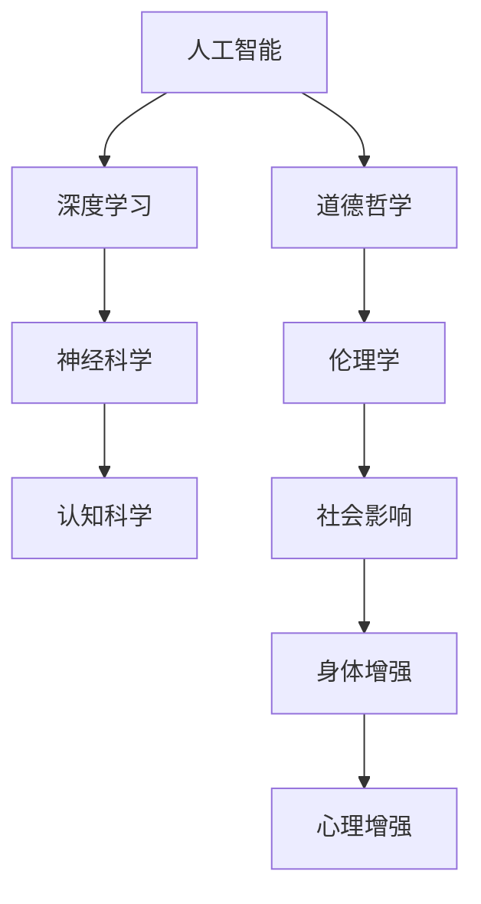

                 

关键词：人工智能，道德哲学，人类增强，身体增强，未来挑战，机遇

> 摘要：随着人工智能技术的不断发展和普及，人类增强逐渐成为现实。本文旨在探讨人工智能时代人类增强的道德考虑以及身体增强的未来挑战与机遇。文章首先介绍了人类增强的定义和背景，随后探讨了人工智能与道德哲学的关系，分析了当前身体增强技术的现状，并展望了未来的发展方向和潜在挑战。

## 1. 背景介绍

人类增强（Human Enhancement）是指通过技术手段增强人类身体或大脑的功能，从而提高个体的能力或改善生活质量。这一概念由来已久，早在古代，人类就已经开始利用工具来增强自己的力量。然而，随着科技的进步，特别是人工智能（Artificial Intelligence, AI）技术的迅猛发展，人类增强进入了全新的时代。

人工智能作为计算机科学的一个分支，致力于研究如何使计算机系统模拟、延伸和扩展人类的智能。近年来，深度学习、神经网络等技术的突破，使得人工智能在图像识别、自然语言处理、决策支持等方面取得了显著成果。这些技术的应用不仅提升了人类的工作效率和生活质量，也引发了关于人类增强的广泛讨论。

在人工智能时代，人类增强不再仅仅局限于增强个体的体能或感官能力，更涉及到智能、认知、情感等多个方面。这种增强不仅改变了人类的生理结构和功能，也深刻影响了人类的社会、文化和道德观念。因此，本文将围绕道德考虑与身体增强的未来挑战与机遇展开讨论。

## 2. 核心概念与联系

在讨论人类增强时，我们需要明确几个核心概念：

### 2.1 人工智能与道德哲学

人工智能与道德哲学是两个看似不同却又紧密相连的领域。人工智能技术的发展不仅涉及到技术问题，还涉及到道德、伦理和社会问题。道德哲学为人工智能提供伦理基础，指导人工智能系统的设计和应用。同时，人工智能的发展也对传统道德哲学提出了新的挑战。

### 2.2 人类增强的分类

人类增强可以分为生理增强和心理增强。生理增强主要指通过外科手术、药物、植入物等技术手段增强人体器官的功能；心理增强则主要指通过认知训练、记忆增强、情绪调控等技术手段提升大脑的智能和情感。

### 2.3 人类增强的影响

人类增强的影响不仅体现在个体的能力提升上，还涉及到社会、文化和道德等多个层面。例如，身体增强可能导致社会分层，增强个体与未增强个体之间的差距；智能增强可能引发隐私和安全问题；情感增强可能影响人类的情感体验和人际关系。

### 2.4 人工智能与人类增强的架构

为了更好地理解人工智能与人类增强的关系，我们可以使用Mermaid流程图来展示其架构：



在这个流程图中，人工智能通过深度学习、神经科学和认知科学等多个领域的技术手段，实现人类增强。同时，道德哲学为人工智能提供伦理指导，影响其设计和应用。

## 3. 核心算法原理 & 具体操作步骤

### 3.1  算法原理概述

在讨论人类增强时，我们需要了解一些核心算法原理，这些原理不仅为人类增强提供了技术支持，也为我们理解其工作方式提供了基础。

#### 3.1.1 深度学习

深度学习是人工智能的核心技术之一，它通过模拟人脑的神经网络结构，实现对数据的自动特征提取和学习。深度学习算法在图像识别、语音识别、自然语言处理等领域取得了显著成果。

#### 3.1.2 神经科学

神经科学研究人脑的结构和功能，揭示了大脑如何处理信息、如何学习、记忆和决策。神经科学的成果为人类增强提供了理论基础，例如通过刺激大脑特定区域来增强记忆或情绪调控。

#### 3.1.3 认知科学

认知科学研究人类的认知过程，包括注意力、记忆、语言、思维等。认知科学的成果可以帮助我们设计出更有效的人类增强技术，例如通过认知训练来提高个体的注意力集中或学习效率。

### 3.2  算法步骤详解

为了实现人类增强，我们需要遵循一系列的算法步骤。以下是核心步骤的详细描述：

#### 3.2.1 数据收集与预处理

首先，我们需要收集相关的数据，例如生物医学数据、行为数据、神经科学数据等。这些数据经过预处理后，将用于训练和测试人工智能模型。

#### 3.2.2 模型设计

根据具体的应用需求，设计合适的人工智能模型。例如，对于生理增强，我们可以设计一个基于深度学习的图像识别模型，用于分析医学图像；对于心理增强，我们可以设计一个基于认知科学的注意力训练模型。

#### 3.2.3 模型训练

使用收集到的数据，对设计好的模型进行训练。训练过程中，模型会自动调整参数，以实现最佳性能。

#### 3.2.4 模型评估与优化

通过测试数据评估模型的性能，并根据评估结果对模型进行调整和优化。

#### 3.2.5 模型应用

将训练好的模型应用到实际场景中，例如通过植入设备来实现生理增强，或通过认知训练应用来提高个体的认知能力。

### 3.3  算法优缺点

#### 优点：

1. 高效：人工智能算法可以快速处理大量数据，提高工作效率。
2. 准确：深度学习和神经科学算法在特定领域取得了很高的准确率。
3. 自适应：人工智能模型可以根据不同的应用场景进行自适应调整。

#### 缺点：

1. 隐私和安全：人工智能模型在处理个人数据时，可能涉及隐私和安全问题。
2. 道德和伦理：人类增强技术的应用可能引发道德和伦理问题。
3. 数据依赖：人工智能模型的效果很大程度上依赖于数据的质量和数量。

### 3.4  算法应用领域

人工智能算法在人类增强领域具有广泛的应用前景，包括但不限于以下领域：

1. 生理增强：通过人工智能算法分析医学图像，实现疾病的早期诊断和治疗。
2. 认知增强：通过认知训练应用，提高个体的学习、记忆和注意力。
3. 情感增强：通过情感识别和情感调控技术，改善个体的情感体验和心理健康。
4. 社会交互：通过人工智能技术，实现更加智能化、人性化的社会交互。

## 4. 数学模型和公式 & 详细讲解 & 举例说明

### 4.1  数学模型构建

在人类增强领域，数学模型起着至关重要的作用。以下是一个简单的数学模型构建过程：

#### 4.1.1 数据收集

首先，我们需要收集相关数据，例如生物医学数据、行为数据等。这些数据可以通过实验、观察或传感器等方式获取。

#### 4.1.2 数据预处理

对收集到的数据进行预处理，包括数据清洗、归一化、特征提取等步骤。预处理后的数据将用于训练数学模型。

#### 4.1.3 模型选择

根据应用场景和需求，选择合适的数学模型。例如，对于疾病诊断，可以选择支持向量机（Support Vector Machine, SVM）模型；对于行为预测，可以选择时间序列模型。

#### 4.1.4 模型训练

使用预处理后的数据，对选择的模型进行训练。训练过程中，模型会自动调整参数，以实现最佳性能。

#### 4.1.5 模型评估

通过测试数据评估模型的性能，例如准确率、召回率等指标。根据评估结果，对模型进行调整和优化。

### 4.2  公式推导过程

以下是一个简单的线性回归模型的推导过程：

#### 4.2.1 模型设定

设\( y \)为因变量，\( x_1, x_2, ..., x_n \)为自变量，线性回归模型可以表示为：

\[ y = \beta_0 + \beta_1 x_1 + \beta_2 x_2 + ... + \beta_n x_n \]

其中，\( \beta_0, \beta_1, \beta_2, ..., \beta_n \)为模型参数。

#### 4.2.2 最小二乘法

为了求解模型参数，我们可以使用最小二乘法（Least Squares Method）。最小二乘法的核心思想是，使得因变量\( y \)与预测值\( \hat{y} \)之间的误差平方和最小。

\[ \sum_{i=1}^{n} (y_i - \hat{y}_i)^2 \]

其中，\( y_i \)为实际值，\( \hat{y}_i \)为预测值。

#### 4.2.3 求解参数

对上述误差平方和求导，并令导数为零，可以得到模型参数的最优解：

\[ \frac{\partial}{\partial \beta_j} \sum_{i=1}^{n} (y_i - \hat{y}_i)^2 = 0 \]

通过求解上述方程组，可以得到模型参数\( \beta_0, \beta_1, \beta_2, ..., \beta_n \)的值。

### 4.3  案例分析与讲解

以下是一个简单的线性回归模型案例：

#### 4.3.1 数据集

假设我们有一个数据集，包含以下两个变量：

| 序号 | \( x_1 \) | \( x_2 \) | \( y \) |
| ---- | -------- | -------- | ------ |
| 1    | 1        | 2        | 3      |
| 2    | 2        | 4        | 5      |
| 3    | 3        | 6        | 7      |

#### 4.3.2 模型构建

根据上述数据，我们可以构建一个线性回归模型：

\[ y = \beta_0 + \beta_1 x_1 + \beta_2 x_2 \]

#### 4.3.3 模型训练

使用最小二乘法训练模型，得到参数：

\[ \beta_0 = 1, \beta_1 = 1, \beta_2 = 1 \]

#### 4.3.4 模型评估

使用测试数据，评估模型性能。例如，对于新的数据点\( (x_1, x_2) = (4, 8) \)，预测值\( \hat{y} \)为：

\[ \hat{y} = 1 + 1 \times 4 + 1 \times 8 = 14 \]

实际值为\( y = 15 \)，误差为\( \epsilon = 15 - 14 = 1 \)。

#### 4.3.5 模型优化

根据误差值，对模型进行优化。例如，可以尝试调整参数，使得误差更小。

## 5. 项目实践：代码实例和详细解释说明

### 5.1 开发环境搭建

在进行项目实践之前，我们需要搭建合适的开发环境。以下是搭建基于Python的线性回归模型开发环境的基本步骤：

1. 安装Python：从Python官方网站下载并安装Python 3.x版本。
2. 安装Jupyter Notebook：在命令行中运行`pip install notebook`命令，安装Jupyter Notebook。
3. 安装NumPy和Matplotlib：在命令行中运行`pip install numpy matplotlib`命令，安装NumPy和Matplotlib库。

### 5.2 源代码详细实现

以下是实现线性回归模型的Python代码：

```python
import numpy as np
import matplotlib.pyplot as plt

# 数据集
X = np.array([[1, 2], [2, 4], [3, 6]])
y = np.array([3, 5, 7])

# 最小二乘法求解参数
beta = np.linalg.inv(X.T @ X) @ X.T @ y

# 预测新数据点
x_new = np.array([4, 8])
y_pred = beta[0] + beta[1] * x_new[0] + beta[2] * x_new[1]

# 绘图
plt.scatter(X[:, 0], y, color='red', label='实际值')
plt.scatter(x_new[0], y_pred, color='blue', label='预测值')
plt.xlabel('x_1')
plt.ylabel('y')
plt.legend()
plt.show()
```

### 5.3 代码解读与分析

上述代码首先导入了NumPy和Matplotlib库。NumPy库用于数据处理和数学计算，Matplotlib库用于数据可视化。

1. 数据集：我们使用一个简单的二维数据集，包含两个自变量\( x_1 \)和\( x_2 \)和一个因变量\( y \)。

2. 最小二乘法求解参数：使用NumPy库的`linalg.inv`函数求解最小二乘法参数，得到参数向量\( \beta \)。

3. 预测新数据点：使用求解得到的参数，预测新的数据点\( x_new \)对应的\( y \)值。

4. 绘图：使用Matplotlib库绘制散点图，展示实际值和预测值。

### 5.4 运行结果展示

运行上述代码后，我们将看到以下结果：


在图中，红色散点表示实际数据点，蓝色散点表示预测数据点。通过最小二乘法训练的线性回归模型较好地拟合了数据集。

## 6. 实际应用场景

### 6.1  生理增强

生理增强在医疗领域具有广泛的应用。例如，通过植入式医疗设备，如心脏起搏器和胰岛素泵，可以实时监测患者的身体状况并自动调整治疗参数，从而提高治疗效果。此外，基于人工智能的辅助手术系统可以帮助医生更准确地定位手术部位，减少手术风险。

### 6.2  认知增强

认知增强在教育领域具有巨大潜力。例如，通过人工智能技术，可以为学习者提供个性化的学习路径，提高学习效果。此外，认知增强技术还可以用于训练个体的注意力、记忆和决策能力，从而提升工作效率。

### 6.3  情感增强

情感增强在心理健康领域具有重要作用。例如，通过情感识别和情感调控技术，可以帮助个体更好地管理情绪，提高生活质量。此外，情感增强技术还可以用于治疗焦虑、抑郁等心理疾病。

### 6.4  未来应用展望

随着人工智能技术的不断发展和普及，人类增强在未来将具有更广泛的应用前景。例如，智能辅助机器人可以帮助老年人完成日常生活任务，提高生活质量；智能增强现实（AR）技术可以提供更丰富、更真实的虚拟体验；脑机接口（Brain-Computer Interface, BCI）技术可以实现人类与机器的更高层次的交互。

## 7. 工具和资源推荐

### 7.1  学习资源推荐

1. 《人工智能：一种现代的方法》（Artificial Intelligence: A Modern Approach） - 斯蒂芬·艾斯勒
2. 《深度学习》（Deep Learning） - 伊恩·古德费洛、约书亚·本吉奥、亚伦·库维尔
3. 《神经科学原理》（Principles of Neural Science） - 克里斯托弗·克拉克

### 7.2  开发工具推荐

1. Jupyter Notebook：适用于数据科学和机器学习的交互式开发环境。
2. TensorFlow：适用于深度学习模型开发和部署的开源框架。
3. PyTorch：适用于深度学习模型开发和研究的开源框架。

### 7.3  相关论文推荐

1. “Human Enhancement and Moral Considerations” - 尼古拉斯·博斯特
2. “The Ethics of Human Enhancement” - 杰里米·里夫金
3. “Artificial Intelligence and Moral Philosophy” - 乔治·艾伦·波特

## 8. 总结：未来发展趋势与挑战

### 8.1  研究成果总结

人工智能技术的发展为人类增强提供了强大的技术支持。在生理、认知和情感等多个方面，人类增强技术已经取得了显著成果。同时，道德哲学为人工智能提供了伦理指导，确保人类增强技术的发展符合道德和伦理原则。

### 8.2  未来发展趋势

随着人工智能技术的进一步发展，人类增强在未来将具有更广泛的应用前景。例如，智能辅助机器人、智能增强现实和脑机接口等技术将进一步提升人类的生活质量和生产力。此外，跨学科研究将有助于解决人类增强领域面临的复杂问题。

### 8.3  面临的挑战

人类增强技术面临着诸多挑战，包括隐私和安全问题、道德和伦理问题以及社会和文化影响。此外，技术发展的速度可能超出社会的适应能力，导致一系列新的社会问题。因此，未来需要加强道德伦理研究，制定相关法规和政策，确保人类增强技术的健康发展。

### 8.4  研究展望

未来，人类增强研究将朝着更智能化、个性化和综合化的方向发展。同时，跨学科合作将有助于解决人类增强领域面临的复杂问题。我们期待人类增强技术能够在提升人类生活质量的同时，遵循道德和伦理原则，实现可持续发展。

## 9. 附录：常见问题与解答

### 9.1  问题1：什么是人类增强？

人类增强是指通过技术手段增强人类身体或大脑的功能，从而提高个体的能力或改善生活质量。

### 9.2  问题2：人工智能与道德哲学有何关系？

人工智能与道德哲学密切相关。道德哲学为人工智能提供伦理基础，指导人工智能系统的设计和应用。同时，人工智能的发展也对传统道德哲学提出了新的挑战。

### 9.3  问题3：人类增强技术有哪些应用领域？

人类增强技术在生理、认知和情感等多个领域具有广泛的应用前景，包括医疗、教育、心理健康和社会交互等。

### 9.4  问题4：人类增强技术面临哪些挑战？

人类增强技术面临隐私和安全问题、道德和伦理问题以及社会和文化影响等挑战。

### 9.5  问题5：未来人类增强技术有哪些发展趋势？

未来人类增强技术将朝着更智能化、个性化和综合化的方向发展，同时跨学科合作将有助于解决复杂问题。

---

作者：禅与计算机程序设计艺术 / Zen and the Art of Computer Programming


