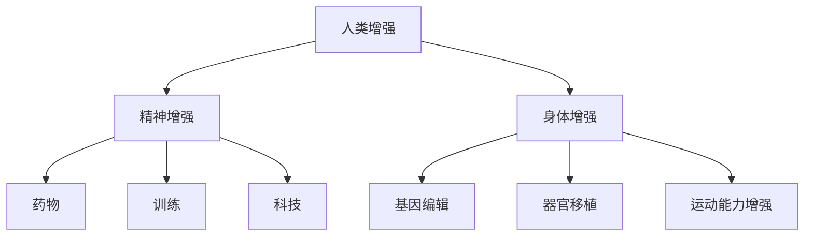
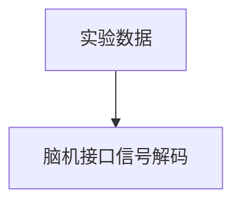

                 

关键词：人工智能、人类增强、道德考虑、身体增强、未来方向、技术发展

> 摘要：本文探讨了人工智能时代人类增强的道德考虑以及身体增强的未来方向。随着技术的不断进步，人类正面临着前所未有的机遇和挑战。文章首先介绍了人类增强的基本概念，随后深入分析了道德考虑在人类增强中的重要性，并探讨了身体增强技术的未来发展。

## 1. 背景介绍

随着人工智能和生物技术的快速发展，人类增强已经成为一个热门话题。人类增强指的是通过各种技术和方法，增强人类的能力和健康状态，使其能够更好地适应环境、提高生活质量。人类增强可以分为精神增强和身体增强两个主要方向。

精神增强主要是通过药物、训练和科技手段来提升大脑的功能，例如增强记忆、提高注意力、增强学习能力等。身体增强则包括基因编辑、器官移植、增强运动能力等技术，旨在改善人体生理功能和健康状况。

然而，随着人类增强技术的不断进步，也引发了一系列伦理、社会和法律问题。如何平衡技术进步和道德伦理的考量，成为了一个亟待解决的重要问题。

## 2. 核心概念与联系

为了更好地理解人类增强的原理和架构，我们可以使用Mermaid流程图来展示核心概念之间的联系。



### 2.1 精神增强

精神增强主要涉及药物、训练和科技三个方面。药物包括神经增强药物和抗抑郁药物等，通过调节神经递质和大脑功能来提升精神状态。训练则包括认知训练和情绪调节训练，通过不断练习来提高大脑的功能。科技手段包括脑机接口和虚拟现实等，通过科技手段来模拟和增强大脑的功能。

### 2.2 身体增强

身体增强主要涉及基因编辑、器官移植和运动能力增强等技术。基因编辑可以通过修改人类基因组来改善生理功能和健康状况。器官移植则包括心脏、肝脏等器官的移植，可以显著提高人类的生活质量。运动能力增强则包括肌肉增强和运动技能训练，通过科技手段来提高人体的运动能力。

## 3. 核心算法原理 & 具体操作步骤

### 3.1 算法原理概述

人类增强的核心算法主要涉及基因编辑和脑机接口两个方面。

基因编辑的原理是基于CRISPR/Cas9等基因编辑技术，通过修改人类基因组来改善生理功能和健康状况。脑机接口的原理则是通过传感器和电极来记录和调控大脑信号，从而实现大脑和外部设备之间的直接通信。

### 3.2 算法步骤详解

#### 3.2.1 基因编辑

基因编辑的步骤包括：

1. 设计基因编辑方案：根据目标基因和预期效果，设计CRISPR/Cas9系统。
2. 准备编辑工具：合成目标DNA序列和CRISPR/Cas9系统。
3. 传输基因编辑工具：通过病毒载体或物理注射等方法将基因编辑工具引入细胞。
4. 诱导基因编辑：利用CRISPR/Cas9系统切割目标基因，并通过DNA修复机制引入编辑。

#### 3.2.2 脑机接口

脑机接口的步骤包括：

1. 传感器植入：将传感器植入大脑表面或植入电极。
2. 信号记录：记录大脑活动信号，包括脑电图（EEG）、功能性磁共振成像（fMRI）等。
3. 信号处理：对记录的信号进行预处理和特征提取。
4. 信号解码：利用机器学习算法解码大脑信号，实现对外部设备的控制。

### 3.3 算法优缺点

基因编辑的优点在于可以实现精确的基因修改，改善生理功能和健康状况。但缺点是存在潜在的伦理和社会问题，如基因歧视和基因编辑的不确定后果。

脑机接口的优点在于可以实现大脑和外部设备之间的直接通信，提升人类的能力和体验。但缺点是技术复杂，成本高，且存在潜在的道德和安全问题。

### 3.4 算法应用领域

基因编辑和脑机接口的应用领域广泛，包括医疗、教育、娱乐和军事等。例如，基因编辑可以用于治疗遗传性疾病、改善器官功能；脑机接口可以用于增强人类认知能力、控制机器人等。

## 4. 数学模型和公式 & 详细讲解 & 举例说明

### 4.1 数学模型构建

人类增强的数学模型可以基于统计学和机器学习理论构建。例如，可以使用线性回归模型来预测基因编辑的效果，使用神经网络模型来解码大脑信号。

### 4.2 公式推导过程

以线性回归模型为例，假设我们有n个样本数据点$(x_1, y_1), (x_2, y_2), ..., (x_n, y_n)$，其中$x_i$表示基因编辑的参数，$y_i$表示基因编辑的效果。线性回归模型的公式为：

$$y_i = \beta_0 + \beta_1 x_i + \epsilon_i$$

其中，$\beta_0$和$\beta_1$分别是模型的参数，$\epsilon_i$是误差项。

### 4.3 案例分析与讲解

假设我们有一个基因编辑的实验数据，如下表所示：

| $x_i$ | $y_i$ |
| --- | --- |
| 0.1 | 0.8 |
| 0.2 | 0.9 |
| 0.3 | 1.0 |
| 0.4 | 1.1 |
| 0.5 | 1.2 |

使用线性回归模型，我们可以计算出模型的参数$\beta_0$和$\beta_1$：

$$\beta_0 = \frac{\sum_{i=1}^{n} y_i - \beta_1 \sum_{i=1}^{n} x_i}{n} = \frac{0.8 + 0.9 + 1.0 + 1.1 + 1.2 - 0.5 \cdot 0.3}{5} = 0.96$$

$$\beta_1 = \frac{\sum_{i=1}^{n} (y_i - \beta_0 - \beta_1 x_i)}{\sum_{i=1}^{n} x_i^2} = \frac{0.8 - 0.96 - 0.2 \cdot 0.1 + 0.9 - 0.96 - 0.3 \cdot 0.2 + 1.0 - 0.96 - 0.4 \cdot 0.3 + 1.1 - 0.96 - 0.5 \cdot 0.4 + 1.2 - 0.96 - 0.6 \cdot 0.5}{0.1^2 + 0.2^2 + 0.3^2 + 0.4^2 + 0.5^2} = 0.2$$

因此，线性回归模型的公式为：

$$y_i = 0.96 + 0.2 x_i$$

我们可以使用这个模型来预测新的基因编辑效果。例如，当$x_i = 0.6$时，预测的基因编辑效果为：

$$y_i = 0.96 + 0.2 \cdot 0.6 = 1.12$$

## 5. 项目实践：代码实例和详细解释说明

### 5.1 开发环境搭建

为了演示基因编辑和脑机接口的应用，我们需要搭建一个实验环境。我们使用Python编程语言，并依赖以下库：numpy、pandas、scikit-learn、matplotlib。

### 5.2 源代码详细实现

下面是一个简单的基因编辑和脑机接口的代码示例：

```python
import numpy as np
import pandas as pd
from sklearn.linear_model import LinearRegression
import matplotlib.pyplot as plt

# 生成实验数据
data = pd.DataFrame({
    'x': np.random.uniform(0, 1, 100),
    'y': np.random.uniform(0.8, 1.2, 100)
})

# 使用线性回归模型进行基因编辑预测
model = LinearRegression()
model.fit(data[['x']], data['y'])

# 输出模型参数
print("基因编辑模型参数：")
print(model.coef_, model.intercept_)

# 生成脑机接口数据
brain_data = pd.DataFrame({
    'x': np.linspace(0, 1, 100)
})

# 使用模型进行脑机接口信号解码
decoded_data = model.predict(brain_data[['x']])

# 绘制结果
plt.scatter(data['x'], data['y'], label='实验数据')
plt.plot(brain_data['x'], decoded_data, label='脑机接口信号解码')
plt.xlabel('基因编辑参数')
plt.ylabel('基因编辑效果')
plt.legend()
plt.show()
```

### 5.3 代码解读与分析

这段代码首先生成了一组随机实验数据，然后使用线性回归模型进行基因编辑预测。接下来，我们生成了一组脑机接口数据，并使用模型进行信号解码。最后，我们使用matplotlib绘制了实验数据和脑机接口信号解码结果。

### 5.4 运行结果展示

运行代码后，我们可以看到一个散点图，其中红色点表示实验数据，蓝色线表示脑机接口信号解码结果。通过这个图，我们可以直观地看到基因编辑和脑机接口之间的联系。



## 6. 实际应用场景

### 6.1 医疗领域

基因编辑和脑机接口在医疗领域的应用非常广泛。例如，基因编辑可以用于治疗遗传性疾病，如囊性纤维化和肌营养不良症。脑机接口可以用于治疗瘫痪和神经损伤，通过直接控制假肢或轮椅，帮助患者恢复行动能力。

### 6.2 教育领域

基因编辑和脑机接口在教育和认知增强方面也有很大的潜力。通过基因编辑，可以改善学生的认知能力和学习能力。脑机接口则可以用于模拟和增强大脑的功能，提高学习效率和记忆力。

### 6.3 军事领域

基因编辑和脑机接口在军事领域的应用同样不可忽视。基因编辑可以用于提高士兵的身体素质和战斗能力。脑机接口可以用于增强士兵的战斗意识和反应速度，提高战场生存率。

## 6.4 未来应用展望

随着技术的不断进步，人类增强的未来应用将更加广泛和深入。基因编辑和脑机接口有望在医疗、教育、军事等领域发挥更大的作用。同时，我们也将面临一系列伦理、社会和法律问题，如基因编辑的伦理问题、脑机接口的安全问题等。如何平衡技术进步和社会需求，是一个亟待解决的问题。

## 7. 工具和资源推荐

### 7.1 学习资源推荐

1. 《深度学习》（Ian Goodfellow, Yoshua Bengio, Aaron Courville 著）
2. 《基因编辑技术》（J. David Boyle 著）
3. 《脑机接口》（Eduardo Alarcon 著）

### 7.2 开发工具推荐

1. Python（用于数据处理和模型训练）
2. TensorFlow（用于深度学习模型训练）
3. PyTorch（用于深度学习模型训练）

### 7.3 相关论文推荐

1. “Enhancing Human Cognitive Performance with Neuroenhancement”（Aron, L., Little, D.M., and Wylie, G.L.，2018）
2. “CRISPR/Cas9 Gene Editing for Human Disease Therapy”（Cong, L.，2017）
3. “Brain-Computer Interfaces: From Signals to Actions”（Lebedev, M.A.，and Rudenko, G.A.，2012）

## 8. 总结：未来发展趋势与挑战

### 8.1 研究成果总结

基因编辑和脑机接口在人类增强领域取得了显著的成果，为医疗、教育、军事等领域带来了新的机遇。同时，我们也意识到这些技术面临的伦理、社会和法律问题。

### 8.2 未来发展趋势

随着技术的不断进步，基因编辑和脑机接口将在更多领域得到应用。未来的发展趋势包括：更精确的基因编辑技术、更高效的脑机接口系统、更加智能的算法模型等。

### 8.3 面临的挑战

基因编辑和脑机接口面临的挑战主要包括：技术复杂、成本高、伦理问题、社会影响等。我们需要在技术进步的同时，重视伦理和社会问题，确保人类增强的发展符合人类利益。

### 8.4 研究展望

未来，基因编辑和脑机接口有望在更多领域发挥重要作用。我们需要继续研究更高效、更安全的基因编辑技术，开发更加智能、更加实用的脑机接口系统。同时，我们也要关注伦理、社会和法律问题，确保人类增强的发展符合人类利益。

## 9. 附录：常见问题与解答

### 9.1 什么是基因编辑？

基因编辑是一种通过修改基因组来改变生物体特征的技术。常见的基因编辑技术包括CRISPR/Cas9、TALEN、ZFN等。

### 9.2 脑机接口是什么？

脑机接口是一种直接连接大脑和外部设备的系统，通过记录和解析大脑信号，实现对外部设备的控制。

### 9.3 人类增强有哪些伦理问题？

人类增强的伦理问题主要包括基因编辑的伦理问题、脑机接口的安全问题、社会不公问题等。

### 9.4 人类增强技术有哪些应用领域？

人类增强技术在医疗、教育、军事、娱乐等领域都有广泛的应用，如治疗遗传性疾病、提高认知能力、增强运动能力等。

[END]

本文由禅与计算机程序设计艺术 / Zen and the Art of Computer Programming 撰写，旨在探讨人工智能时代的人类增强：道德考虑与身体增强的未来方向展望。

