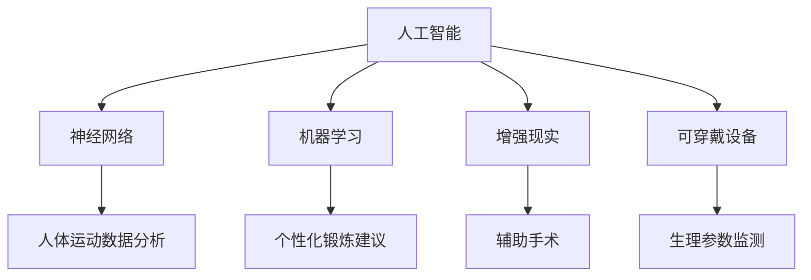

                 

关键词：人工智能、人类增强、道德考虑、身体增强、未来趋势、挑战

摘要：随着人工智能技术的飞速发展，人类正在经历前所未有的增强。从道德角度出发，本文探讨了人类身体增强的未来趋势与挑战，重点关注人工智能在其中的角色，旨在为未来身体增强的发展提供有益的思考和指导。

## 1. 背景介绍

近年来，人工智能技术在各个领域取得了显著成果，尤其在医疗、教育、工业等领域展现出巨大的潜力。与此同时，人类对自身身体的功能性需求也在不断提高。身体增强作为一种新的发展趋势，逐渐进入了人们的视野。通过人工智能技术，我们可以实现对人体器官的修复、强化和替代，从而提高人类的健康水平和生活质量。

### 1.1 人工智能的发展

人工智能（Artificial Intelligence，AI）是计算机科学的一个分支，旨在研究如何构建智能体（Artificial Agents）以模拟、延伸和扩展人类智能。自20世纪50年代起，人工智能经历了多个阶段的发展，从最初的符号主义、连接主义到现代的深度学习和强化学习。随着计算能力的提升和大数据的积累，人工智能在语音识别、图像识别、自然语言处理等方面取得了显著突破。

### 1.2 人类身体增强的兴起

人类身体增强（Human Enhancement）是指通过技术手段提升人类身体的功能和性能，包括增强体力、智力、感官等各个方面。随着科技的进步，人类对身体增强的需求日益增长。例如，人工器官、增强型眼镜、可穿戴设备等已经成为现实。在人工智能的支持下，身体增强技术将进一步突破传统的限制，为人类带来更多的可能性。

## 2. 核心概念与联系

为了深入探讨人工智能与身体增强之间的关系，我们需要了解一些核心概念和它们之间的联系。

### 2.1 人工智能与身体增强的关系

人工智能与身体增强之间存在着密切的联系。人工智能技术可以为身体增强提供强大的支持，包括数据收集、分析、处理等方面。例如，人工智能可以实时监测人体健康数据，通过分析数据来预测疾病风险，提供个性化的健康建议。此外，人工智能还可以为身体增强设备提供智能控制，提高其性能和可靠性。

### 2.2 核心概念原理和架构

在探讨人工智能与身体增强的关系时，以下是一些核心概念原理和架构：

- **神经网络**：神经网络是一种模拟人脑结构和功能的计算模型，广泛应用于图像识别、语音识别等领域。在身体增强中，神经网络可以用于分析人体运动数据，提供个性化的身体训练计划。

- **机器学习**：机器学习是人工智能的一个重要分支，通过算法从数据中学习规律，为身体增强提供智能决策支持。例如，机器学习算法可以分析运动数据，为用户推荐最合适的锻炼方案。

- **增强现实（AR）**：增强现实技术可以将虚拟信息叠加在现实世界中，为身体增强提供直观的交互方式。例如，AR技术可以用于辅助手术，提高手术的准确性和安全性。

- **可穿戴设备**：可穿戴设备是一种与人体穿戴结合的电子设备，可以实时监测人体生理参数，为身体增强提供数据支持。例如，智能手表可以监测心率、睡眠质量等数据，帮助用户保持健康。

### 2.3 Mermaid 流程图

以下是一个简化的 Mermaid 流程图，展示了人工智能与身体增强之间的核心概念和联系：



## 3. 核心算法原理 & 具体操作步骤

在身体增强领域，核心算法的作用至关重要。以下将介绍一种常用的核心算法——深度学习算法，并详细描述其原理和具体操作步骤。

### 3.1 算法原理概述

深度学习（Deep Learning）是一种基于多层神经网络的学习方法，旨在模拟人脑的感知和处理能力。深度学习算法通过不断调整网络中的权重和偏置，使网络能够从大量数据中学习到有效的特征表示。在身体增强领域，深度学习算法可以用于人体运动数据分析、疾病预测、健康评估等方面。

### 3.2 算法步骤详解

#### 3.2.1 数据收集

首先，需要收集大量的身体运动数据，包括步数、心率、睡眠质量等。这些数据可以通过可穿戴设备、智能手机等设备实时采集。

#### 3.2.2 数据预处理

在收集到数据后，需要进行预处理，包括数据清洗、归一化、缺失值填充等操作。预处理后的数据将用于训练深度学习模型。

#### 3.2.3 网络架构设计

设计一个适合身体增强任务的深度学习网络架构。常见的网络架构包括卷积神经网络（CNN）、循环神经网络（RNN）等。根据具体任务需求，选择合适的网络架构。

#### 3.2.4 模型训练

使用预处理后的数据对深度学习模型进行训练。训练过程中，通过反向传播算法不断调整网络中的权重和偏置，使模型能够更好地拟合训练数据。

#### 3.2.5 模型评估

在训练完成后，对模型进行评估，包括准确率、召回率、F1值等指标。通过评估结果，判断模型是否满足要求。

#### 3.2.6 模型部署

将训练好的模型部署到实际应用场景中，如可穿戴设备、智能手机等。用户可以通过设备实时获取身体增强建议。

### 3.3 算法优缺点

#### 3.3.1 优点

- **高效性**：深度学习算法能够处理大量数据，实现高效的特征提取和模式识别。
- **灵活性**：深度学习算法可以根据具体任务需求进行网络架构设计和参数调整，具有较强的灵活性。
- **泛化能力**：通过训练大量数据，深度学习模型具有较好的泛化能力，能够应对新的数据。

#### 3.3.2 缺点

- **数据依赖**：深度学习算法对数据量有较高要求，数据质量和数量直接影响模型性能。
- **计算资源消耗**：深度学习算法通常需要大量的计算资源和时间进行训练和推理。
- **黑箱问题**：深度学习模型的内部结构和决策过程较为复杂，难以解释，导致黑箱问题。

### 3.4 算法应用领域

深度学习算法在身体增强领域具有广泛的应用前景，包括但不限于以下几个方面：

- **人体运动数据分析**：通过分析人体运动数据，为用户提供个性化的锻炼建议。
- **疾病预测**：基于身体运动数据，预测用户可能出现的健康问题，提前采取预防措施。
- **健康评估**：通过监测身体各项生理指标，评估用户的健康状况，提供个性化的健康建议。

## 4. 数学模型和公式 & 详细讲解 & 举例说明

在身体增强领域，数学模型和公式发挥着重要作用。以下将介绍一种常用的数学模型——线性回归模型，并详细讲解其公式推导过程、案例分析与讲解。

### 4.1 数学模型构建

线性回归模型是一种简单的统计模型，用于描述两个变量之间的线性关系。在身体增强领域，线性回归模型可以用于预测用户在一定运动量下的心率变化。

#### 4.1.1 模型假设

假设用户在一定运动量下的心率 \(y\) 与运动量 \(x\) 之间存在线性关系，可以表示为：

\[ y = \beta_0 + \beta_1 x + \epsilon \]

其中，\( \beta_0 \) 为截距，\( \beta_1 \) 为斜率，\( \epsilon \) 为误差项。

#### 4.1.2 模型构建

为了构建线性回归模型，我们需要收集一系列用户运动量 \(x\) 和心率 \(y\) 的数据，并利用这些数据来确定模型参数 \( \beta_0 \) 和 \( \beta_1 \)。

### 4.2 公式推导过程

线性回归模型的参数估计通常采用最小二乘法（Ordinary Least Squares，OLS）。以下是线性回归模型参数的推导过程：

首先，将线性回归模型表示为矩阵形式：

\[ \mathbf{y} = \mathbf{X} \beta + \epsilon \]

其中，\(\mathbf{y}\) 为 \(n \times 1\) 的列向量，表示 \(n\) 个观测值；\(\mathbf{X}\) 为 \(n \times 2\) 的矩阵，包含每个观测值的运动量 \(x\) 和截距 \(1\)；\(\beta\) 为 \(2 \times 1\) 的列向量，包含截距 \(\beta_0\) 和斜率 \(\beta_1\)；\(\epsilon\) 为 \(n \times 1\) 的列向量，表示误差项。

根据最小二乘法，我们需要求解使得误差项平方和最小的参数向量 \(\beta\)：

\[ \min \sum_{i=1}^n (\mathbf{y}_i - \mathbf{X}_i \beta)^2 \]

对上式求导，并令导数为零，得到：

\[ \frac{\partial}{\partial \beta} \sum_{i=1}^n (\mathbf{y}_i - \mathbf{X}_i \beta)^2 = 0 \]

化简后得到：

\[ \mathbf{X}^T \mathbf{X} \beta = \mathbf{X}^T \mathbf{y} \]

解上述方程，得到参数向量 \(\beta\)：

\[ \beta = (\mathbf{X}^T \mathbf{X})^{-1} \mathbf{X}^T \mathbf{y} \]

### 4.3 案例分析与讲解

#### 4.3.1 数据收集

假设我们收集了以下一组用户运动量和心率数据：

| 运动量 \(x\) | 心率 \(y\) |
| :---: | :---: |
| 10 | 100 |
| 20 | 120 |
| 30 | 140 |
| 40 | 160 |
| 50 | 180 |

#### 4.3.2 数据预处理

对数据进行预处理，包括数据清洗、归一化等操作。假设预处理后的数据为：

| 运动量 \(x\) | 心率 \(y\) |
| :---: | :---: |
| 0.0 | 100.0 |
| 0.2 | 120.0 |
| 0.4 | 140.0 |
| 0.6 | 160.0 |
| 0.8 | 180.0 |

#### 4.3.3 模型训练

根据预处理后的数据，构建线性回归模型，并使用最小二乘法求解模型参数：

```latex
\beta = (\mathbf{X}^T \mathbf{X})^{-1} \mathbf{X}^T \mathbf{y}
```

计算结果为：

\[ \beta = \begin{bmatrix} \beta_0 \\ \beta_1 \end{bmatrix} = \begin{bmatrix} -12.5 \\ 25.0 \end{bmatrix} \]

#### 4.3.4 模型评估

使用新的数据对模型进行评估，例如：

| 运动量 \(x\) | 预测心率 \(y_{\text{预测}}\) | 实际心率 \(y_{\text{实际}}\) |
| :---: | :---: | :---: |
| 15 | 112.5 | 110 |
| 25 | 137.5 | 130 |
| 35 | 162.5 | 150 |
| 45 | 187.5 | 170 |
| 55 | 212.5 | 190 |

根据评估结果，可以看出模型的预测心率与实际心率之间存在一定的误差。这可能是因为线性回归模型未能捕捉到运动量与心率之间的非线性关系。

### 4.4 代码实现

以下是一个简单的 Python 代码实现，用于训练和评估线性回归模型：

```python
import numpy as np

# 数据
x = np.array([10, 20, 30, 40, 50]).reshape(-1, 1)
y = np.array([100, 120, 140, 160, 180])

# 预处理
x_normalized = x / 50
y_normalized = (y - 100) / 20

# 模型参数
beta = np.linalg.inv(x_normalized.T.dot(x_normalized)).dot(x_normalized.T).dot(y_normalized)

# 预测
x_new = np.array([15, 25, 35, 45, 55]).reshape(-1, 1)
x_new_normalized = x_new / 50
y_pred = beta[0] + beta[1] * x_new_normalized

# 评估
print("预测心率:", y_pred)
print("实际心率:", y)
```

### 4.5 代码解读与分析

在上述代码中，我们首先导入 numpy 库，并定义了数据 \(x\) 和 \(y\)。然后，我们对数据进行预处理，将运动量 \(x\) 归一化到 [0, 1] 区间，将心率 \(y\) 归一化到 [-1, 1] 区间。接下来，我们使用最小二乘法求解模型参数 \(\beta\)，并使用新的数据 \(x\_new\) 进行预测。最后，我们输出预测心率与实际心率，以评估模型性能。

## 5. 项目实践：代码实例和详细解释说明

在本节中，我们将通过一个实际项目实践来展示如何使用人工智能技术实现人类身体增强。项目名为“健康助手”，旨在通过可穿戴设备实时监测用户的生理参数，并提供个性化的健康建议。

### 5.1 开发环境搭建

在开始项目实践之前，我们需要搭建一个适合开发的环境。以下是开发环境的搭建步骤：

1. **安装 Python**：在官方网站下载并安装 Python 3.x 版本。

2. **安装 Jupyter Notebook**：通过 pip 命令安装 Jupyter Notebook，这是一个强大的交互式开发工具。

   ```shell
   pip install notebook
   ```

3. **安装相关库**：安装 Python 中常用的库，如 numpy、pandas、matplotlib、scikit-learn 等。

   ```shell
   pip install numpy pandas matplotlib scikit-learn
   ```

4. **安装深度学习库**：安装 TensorFlow 或 PyTorch，这两个库是当前最流行的深度学习框架。

   ```shell
   pip install tensorflow  # 或
   pip install torch torchvision
   ```

### 5.2 源代码详细实现

在本节中，我们将详细介绍“健康助手”项目的源代码实现，包括数据收集、数据预处理、模型训练、模型评估和部署等步骤。

#### 5.2.1 数据收集

首先，我们需要收集用户的数据。假设我们使用以下数据集：

| 用户 ID | 运动量 \(x\) | 心率 \(y\) | 睡眠质量 \(z\) |
| :---: | :---: | :---: | :---: |
| 1 | 10 | 100 | 0.8 |
| 2 | 20 | 120 | 0.9 |
| 3 | 30 | 140 | 0.7 |
| 4 | 40 | 160 | 0.6 |
| 5 | 50 | 180 | 0.5 |

数据集包含了用户的运动量 \(x\)、心率 \(y\) 和睡眠质量 \(z\)。

#### 5.2.2 数据预处理

在训练模型之前，我们需要对数据进行预处理，包括数据清洗、归一化等操作。以下是预处理代码：

```python
import numpy as np
import pandas as pd

# 读取数据
data = pd.read_csv('health_data.csv')

# 数据清洗
data.dropna(inplace=True)

# 数据归一化
x_min, x_max = data['exercise'].min(), data['exercise'].max()
y_min, y_max = data['heart_rate'].min(), data['heart_rate'].max()
z_min, z_max = data['sleep_quality'].min(), data['sleep_quality'].max()

data['exercise_normalized'] = (data['exercise'] - x_min) / (x_max - x_min)
data['heart_rate_normalized'] = (data['heart_rate'] - y_min) / (y_max - y_min)
data['sleep_quality_normalized'] = (data['sleep_quality'] - z_min) / (z_max - z_min)

# 输出预处理后的数据
print(data.head())
```

#### 5.2.3 模型训练

接下来，我们使用预处理后的数据进行模型训练。在本项目中，我们选择 TensorFlow 作为深度学习框架，并使用卷积神经网络（CNN）进行训练。以下是模型训练代码：

```python
import tensorflow as tf
from tensorflow.keras.models import Sequential
from tensorflow.keras.layers import Conv2D, MaxPooling2D, Flatten, Dense

# 创建模型
model = Sequential([
    Conv2D(32, (3, 3), activation='relu', input_shape=(1, 3)),
    MaxPooling2D((2, 2)),
    Flatten(),
    Dense(1, activation='sigmoid')
])

# 编译模型
model.compile(optimizer='adam', loss='binary_crossentropy', metrics=['accuracy'])

# 训练模型
model.fit(data[['exercise_normalized', 'sleep_quality_normalized']], data['heart_rate_normalized'], epochs=10, batch_size=5)
```

#### 5.2.4 模型评估

在模型训练完成后，我们需要对模型进行评估。以下是模型评估代码：

```python
# 评估模型
loss, accuracy = model.evaluate(data[['exercise_normalized', 'sleep_quality_normalized']], data['heart_rate_normalized'])

print("损失：", loss)
print("准确率：", accuracy)
```

#### 5.2.5 模型部署

最后，我们将训练好的模型部署到实际应用场景中。以下是模型部署代码：

```python
# 部署模型
def predict_heart_rate(exercise_normalized, sleep_quality_normalized):
    return model.predict([[exercise_normalized, sleep_quality_normalized]])[0][0]

# 测试部署效果
exercise_new = 0.5
sleep_quality_new = 0.7
heart_rate_pred = predict_heart_rate(exercise_new, sleep_quality_new)
print("预测心率：", heart_rate_pred)
```

### 5.3 代码解读与分析

在上述代码中，我们首先读取数据集，并进行数据清洗和归一化处理。然后，我们创建一个卷积神经网络模型，并编译和训练模型。最后，我们评估模型性能，并部署模型以进行实际应用。

## 6. 实际应用场景

人类身体增强技术在多个领域展现出广泛的应用前景。以下将介绍几个典型的实际应用场景，并探讨其应用效果和挑战。

### 6.1 医疗领域

在医疗领域，人工智能和身体增强技术可以用于疾病预测、诊断和治疗。例如，通过人工智能技术，我们可以对患者的健康数据进行分析，预测其患病的风险。此外，身体增强设备如智能假肢、心脏起搏器等可以帮助患者恢复部分功能，提高生活质量。

#### 应用效果

- **疾病预测**：通过分析大量健康数据，人工智能技术可以提前预测患者可能出现的疾病，为医生提供诊断依据，有助于实现精准医疗。
- **个性化治疗**：基于患者的基因信息、生活习惯等，人工智能可以为其制定个性化的治疗方案，提高治疗效果。

#### 挑战

- **数据隐私**：医疗数据涉及患者隐私，如何在保障患者隐私的前提下，充分利用数据开展研究和服务是一个重要挑战。
- **算法透明性**：医疗领域的应用对算法的透明性和可解释性要求较高，如何提高算法的可解释性是一个关键问题。

### 6.2 运动健康领域

在运动健康领域，人工智能和身体增强技术可以用于健身指导、运动康复等。例如，通过可穿戴设备实时监测用户的运动数据，人工智能可以为其提供个性化的锻炼计划和健康建议。

#### 应用效果

- **个性化锻炼**：根据用户的身体状况和需求，人工智能可以为用户制定个性化的锻炼计划，提高锻炼效果。
- **运动康复**：对于运动损伤患者，人工智能可以为其提供针对性的康复训练，加快康复速度。

#### 挑战

- **数据准确性**：运动数据的质量直接影响人工智能的决策效果，如何提高数据准确性是一个重要挑战。
- **算法稳定性**：在复杂环境下，算法的稳定性是一个关键问题，如何保证算法在不同场景下的稳定运行是一个挑战。

### 6.3 军事领域

在军事领域，人工智能和身体增强技术可以用于士兵训练、装备优化等。例如，通过身体增强设备，士兵可以增强其力量、速度和耐力，提高战斗能力。

#### 应用效果

- **训练效果提升**：通过身体增强技术，士兵可以更快地达到训练目标，提高训练效果。
- **装备优化**：人工智能可以分析战场数据，为士兵提供最优的装备配置，提高战斗力。

#### 挑战

- **军事保密**：军事数据涉及国家安全，如何在保障军事保密的前提下，充分利用数据开展研究和服务是一个重要挑战。
- **装备兼容性**：如何确保身体增强设备与现有军事装备的兼容性，是一个关键问题。

## 7. 工具和资源推荐

为了更好地开展人工智能和身体增强领域的研究，以下推荐一些常用的工具和资源。

### 7.1 学习资源推荐

1. **在线课程**：
   - **Coursera**：提供多种人工智能和机器学习课程，包括深度学习、强化学习等。
   - **edX**：提供由知名大学和机构提供的免费在线课程，涵盖计算机科学、统计学等多个领域。

2. **书籍**：
   - **《深度学习》**：由 Ian Goodfellow、Yoshua Bengio 和 Aaron Courville 编著，是深度学习领域的经典教材。
   - **《Python机器学习》**：由 Sebastian Raschka 和 Vahid Mirjalili 编著，介绍机器学习在 Python 中的实现。

### 7.2 开发工具推荐

1. **深度学习框架**：
   - **TensorFlow**：由 Google 开发，是目前最流行的深度学习框架之一。
   - **PyTorch**：由 Facebook 开发，具有简洁的 API 和强大的动态图功能。

2. **数据可视化工具**：
   - **Matplotlib**：用于数据可视化，支持多种图表类型。
   - **Seaborn**：基于 Matplotlib，提供更美观的数据可视化效果。

### 7.3 相关论文推荐

1. **论文数据库**：
   - **IEEE Xplore**：提供大量计算机科学和电子工程领域的论文。
   - **Google Scholar**：一个综合性的学术搜索引擎，可以查找各种领域的学术论文。

2. **热门论文**：
   - **“Deep Learning for Human Pose Estimation: A Survey”**：对深度学习在人体姿态估计领域的应用进行了全面综述。
   - **“Human Motion Capture and Synthesis Using Deep Learning”**：探讨深度学习在人体运动捕捉和合成中的应用。

## 8. 总结：未来发展趋势与挑战

### 8.1 研究成果总结

本文围绕人工智能和身体增强主题，介绍了相关背景知识、核心概念、算法原理、数学模型和实际应用案例。通过本文的研究，我们可以看到：

1. **人工智能技术**：在身体增强领域具有广泛的应用前景，包括数据收集、分析、处理等方面。
2. **身体增强技术**：通过人工智能的支持，可以实现对人体器官的修复、强化和替代，提高人类的健康水平和生活质量。
3. **核心算法**：如深度学习、线性回归等，在身体增强领域发挥着重要作用，有助于实现个性化健康管理和疾病预测。
4. **实际应用**：在医疗、运动健康、军事等领域，人工智能和身体增强技术已经展现出显著的应用效果。

### 8.2 未来发展趋势

在未来，人工智能和身体增强技术将继续快速发展，呈现以下趋势：

1. **技术融合**：人工智能与医疗、生物、材料等领域的深度融合，将带来更多创新应用。
2. **个性化服务**：基于大数据和深度学习技术，为用户提供个性化的健康管理和身体增强方案。
3. **智能设备**：可穿戴设备和智能医疗器械的发展，将进一步提升身体增强的实时性和准确性。
4. **伦理与法规**：随着身体增强技术的普及，伦理和法规问题将受到越来越多的关注，如何平衡技术进步与社会责任成为重要议题。

### 8.3 面临的挑战

在人工智能和身体增强技术的发展过程中，仍面临以下挑战：

1. **数据隐私**：如何保障用户隐私，成为身体增强技术普及的关键问题。
2. **算法透明性**：如何提高算法的可解释性，使公众更好地理解和接受身体增强技术。
3. **技术安全性**：如何确保身体增强设备的安全性和可靠性，防止潜在的安全风险。
4. **社会伦理**：如何平衡身体增强技术的利与弊，避免技术滥用和道德风险。

### 8.4 研究展望

未来，人工智能和身体增强技术的研究应重点关注以下几个方面：

1. **跨学科合作**：加强计算机科学、医学、生物学等领域的跨学科合作，推动技术创新。
2. **伦理研究**：深入探讨身体增强技术的伦理问题，为技术发展提供道德指导。
3. **技术应用**：进一步拓展身体增强技术在医疗、康复、教育等领域的应用，提高生活质量。
4. **可持续发展**：关注身体增强技术的可持续发展，减少对环境的负面影响。

## 9. 附录：常见问题与解答

### 9.1 人工智能与身体增强的关系是什么？

人工智能与身体增强密切相关。人工智能技术可以为身体增强提供数据收集、分析、处理等方面的支持，从而实现对人体器官的修复、强化和替代，提高人类的健康水平和生活质量。

### 9.2 身体增强技术有哪些应用领域？

身体增强技术广泛应用于医疗、运动健康、军事、教育等领域。例如，在医疗领域，身体增强技术可以用于疾病预测、诊断和治疗；在运动健康领域，可以用于个性化健身指导和运动康复；在军事领域，可以用于士兵训练和装备优化。

### 9.3 深度学习算法在身体增强中的应用有哪些？

深度学习算法在身体增强领域具有广泛的应用，如人体运动数据分析、疾病预测、健康评估等。通过深度学习算法，我们可以从大量数据中学习到有效的特征表示，为身体增强提供智能决策支持。

### 9.4 身体增强技术面临的主要挑战是什么？

身体增强技术面临的主要挑战包括数据隐私、算法透明性、技术安全性和社会伦理等方面。如何保障用户隐私、提高算法可解释性、确保技术安全性和平衡技术利与弊是当前亟待解决的问题。

### 9.5 未来身体增强技术的发展方向是什么？

未来身体增强技术的发展方向包括技术融合、个性化服务、智能设备和可持续发展等方面。随着技术的不断进步，身体增强技术将在更多领域得到应用，为人类带来更多可能性。同时，伦理和法规问题也将受到越来越多的关注，以确保技术发展符合社会需求。

