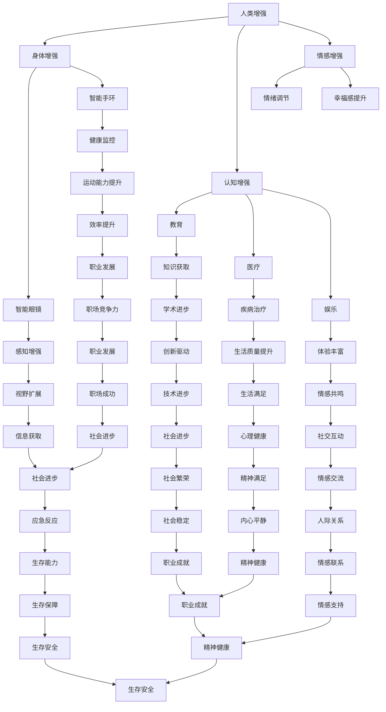

                 

关键词：人工智能，人类增强，道德考虑，身体增强，未来趋势

## 摘要

随着人工智能（AI）技术的飞速发展，人类增强的概念逐渐走进现实。本文将探讨AI时代人类增强的道德考虑和身体增强的未来。文章首先介绍人类增强的基本概念和背景，接着分析AI在人类增强中的应用，探讨其带来的道德挑战。随后，文章深入探讨身体增强的技术实现和潜在影响，以及未来可能的道德困境。最后，文章总结未来发展趋势，提出应对挑战的策略和建议。

## 1. 背景介绍

人类增强（Human Enhancement）是指通过技术手段提升人类身体或心智能力的过程。人类增强的历史可以追溯到古代，如古希腊和古罗马时期使用的药物和仪式，以及现代的体育训练和医学治疗。然而，随着科技的发展，人类增强的内涵和外延不断扩大，尤其是在人工智能（AI）领域的突破，使得人类增强进入了全新的阶段。

人工智能是一种模拟人类智能的计算机系统，具备学习、推理、规划和自然语言处理等能力。AI的发展为人类增强提供了强大的技术支持，使得身体和心智增强成为可能。从感知增强到运动能力提升，从认知扩展到情绪调节，AI在人类增强中的应用越来越广泛。

## 2. 核心概念与联系

### 2.1 人类增强的概念

人类增强可以理解为在人类生理和心理基础上，通过技术手段增加新的功能或提升现有功能的进程。它包括身体增强、认知增强、情感增强等多个方面。身体增强主要关注提升人体的物理能力，如力量、速度、耐力等；认知增强则着重于提高大脑的信息处理能力和学习能力；情感增强旨在改善人的情绪状态，提升幸福感。

### 2.2 人工智能的概念

人工智能是一种模拟人类智能的计算机系统，具有学习、推理、规划和自然语言处理等能力。AI的核心是算法，包括机器学习、深度学习、自然语言处理等。AI的发展使得计算机能够执行复杂任务，如图像识别、语音识别、机器翻译等。

### 2.3 人类增强与人工智能的联系

人工智能与人类增强有着紧密的联系。AI技术可以用来提升人类的能力，实现身体和心智的增强。例如，通过智能眼镜，人们可以获得更广阔的视野，增强感知能力；通过智能手环，人们可以实时监控健康状况，提升运动能力。同时，AI还可以用于教育、医疗、娱乐等领域，提升人类的生活质量和幸福感。

### 2.4 Mermaid流程图

下面是一个描述人类增强与人工智能联系的基本流程图。



## 3. 核心算法原理 & 具体操作步骤

### 3.1 算法原理概述

人类增强中的核心算法主要涉及机器学习和深度学习技术。这些算法通过学习大量数据，使计算机系统能够模拟人类智能，实现身体和心智的增强。具体来说，机器学习算法通过构建模型来分析数据，提取特征，并利用这些特征进行预测和决策。深度学习算法则通过构建多层神经网络，模拟人类大脑的学习过程，实现更复杂的任务。

### 3.2 算法步骤详解

1. **数据收集与预处理**：收集大量相关数据，如健康数据、行为数据等。对数据进行清洗、归一化等预处理，以便后续建模。

2. **模型构建**：选择合适的机器学习或深度学习算法，构建模型。常用的算法包括线性回归、决策树、支持向量机、神经网络等。

3. **模型训练**：使用预处理后的数据对模型进行训练，调整模型参数，使其能够更好地拟合数据。

4. **模型评估**：使用验证集或测试集对模型进行评估，判断其预测准确性。

5. **模型应用**：将训练好的模型应用于实际场景，如健康监控、行为预测等。

### 3.3 算法优缺点

**优点**：
- **高效性**：机器学习和深度学习算法能够处理大量数据，提高决策的准确性。
- **灵活性**：算法可以根据具体需求进行调整，实现个性化增强。
- **通用性**：算法可以应用于多种场景，如健康、教育、娱乐等。

**缺点**：
- **数据依赖性**：算法的性能依赖于数据的质量和数量，数据不足或质量差会导致算法失效。
- **计算成本**：训练复杂的深度学习模型需要大量的计算资源。

### 3.4 算法应用领域

- **健康监测**：通过智能手环、智能手表等设备收集健康数据，利用机器学习算法进行实时监测和预警。
- **运动辅助**：利用虚拟现实技术，结合机器学习算法，为运动员提供训练辅助。
- **教育辅助**：通过个性化推荐系统，结合机器学习算法，为学生提供定制化的学习方案。
- **娱乐体验**：利用虚拟现实和增强现实技术，结合机器学习算法，为用户提供沉浸式的娱乐体验。

## 4. 数学模型和公式 & 详细讲解 & 举例说明

### 4.1 数学模型构建

在人类增强中，常用的数学模型包括回归模型、分类模型、聚类模型等。以下是一个简单的线性回归模型的构建过程。

1. **假设**：假设我们想预测一个人的体重，给定其身高和年龄。
2. **数据收集**：收集大量身高、年龄和体重数据。
3. **特征提取**：将身高和年龄作为特征，体重作为目标变量。
4. **模型构建**：构建线性回归模型，公式为 $y = wx + b$，其中 $y$ 是体重，$w$ 是权重，$x$ 是特征（身高或年龄），$b$ 是偏置。

### 4.2 公式推导过程

线性回归模型的推导过程如下：

1. **损失函数**：选择均方误差（MSE）作为损失函数，公式为 $L = \frac{1}{2} \sum_{i=1}^{n} (y_i - wx_i - b)^2$。
2. **梯度下降**：使用梯度下降法优化模型参数，公式为 $\theta_{\text{new}} = \theta_{\text{old}} - \alpha \nabla_{\theta} L$，其中 $\theta$ 表示模型参数，$\alpha$ 是学习率。
3. **求解**：通过迭代更新参数，求解最优参数 $\theta^*$，使得损失函数最小。

### 4.3 案例分析与讲解

以下是一个简单的线性回归案例：

给定以下数据：

| 身高（cm）| 年龄（岁）| 体重（kg）|
| --- | --- | --- |
| 160 | 20 | 50 |
| 170 | 25 | 60 |
| 175 | 30 | 70 |
| 180 | 35 | 80 |
| 185 | 40 | 90 |

我们想预测一个人的体重，给定其身高和年龄。使用线性回归模型进行预测。

1. **数据预处理**：将身高和年龄作为特征，体重作为目标变量。
2. **模型构建**：构建线性回归模型，公式为 $y = wx + b$。
3. **模型训练**：使用梯度下降法训练模型。
4. **模型评估**：使用测试集评估模型性能。

假设训练得到的模型参数为 $w = 0.5$，$b = 10$。我们可以预测一个身高为 175cm，年龄为 30 岁的人的体重：

$$
y = 0.5 \times 175 + 10 = 82.5
$$

因此，预测体重为 82.5kg。

## 5. 项目实践：代码实例和详细解释说明

### 5.1 开发环境搭建

1. 安装 Python 解释器：从 [Python 官网](https://www.python.org/downloads/) 下载并安装 Python 3.x 版本。
2. 安装必要的库：使用 pip 工具安装 scikit-learn、numpy、matplotlib 等库。

```bash
pip install scikit-learn numpy matplotlib
```

### 5.2 源代码详细实现

以下是一个简单的线性回归模型实现：

```python
import numpy as np
from sklearn.linear_model import LinearRegression
import matplotlib.pyplot as plt

# 数据
X = np.array([[160], [170], [175], [180], [185]])
y = np.array([50, 60, 70, 80, 90])

# 模型
model = LinearRegression()

# 训练
model.fit(X, y)

# 预测
x_new = np.array([[175], [30]])
y_pred = model.predict(x_new)

print("预测体重：", y_pred)

# 绘图
plt.scatter(X, y, color='red', label='实际数据')
plt.plot(X, model.predict(X), color='blue', label='回归线')
plt.xlabel('身高')
plt.ylabel('体重')
plt.title('线性回归模型')
plt.legend()
plt.show()
```

### 5.3 代码解读与分析

- **数据导入**：使用 numpy 库导入数据。
- **模型构建**：使用 scikit-learn 库中的 LinearRegression 类构建线性回归模型。
- **模型训练**：使用 fit 方法训练模型。
- **模型预测**：使用 predict 方法进行预测。
- **绘图**：使用 matplotlib 库绘制散点图和回归线。

### 5.4 运行结果展示

运行代码后，会显示一个散点图，其中红色点表示实际数据，蓝色线表示回归线。同时，会在控制台输出预测体重。

## 6. 实际应用场景

### 6.1 健康监测

健康监测是人体增强的一个重要应用领域。通过佩戴智能手环、智能手表等设备，用户可以实时监控自己的健康状况，如心率、血压、睡眠质量等。结合机器学习算法，这些设备可以自动识别异常情况，如心率过快或过慢、血压异常等，并及时发出警报。

### 6.2 运动辅助

运动辅助利用虚拟现实（VR）和增强现实（AR）技术，为运动员提供个性化训练方案。通过分析运动员的动作数据，机器学习算法可以识别出动作中的不足之处，并给出改进建议。此外，虚拟现实技术还可以创建一个沉浸式的训练环境，让运动员在虚拟世界中模拟实际比赛场景，提高比赛适应能力。

### 6.3 教育辅助

教育辅助通过个性化推荐系统，根据学生的学习情况和兴趣，为学生提供定制化的学习方案。机器学习算法可以分析学生的学习数据，如作业完成情况、考试成绩等，识别出学生的弱点，并推荐相应的学习资源。同时，虚拟现实和增强现实技术可以为学生提供沉浸式的学习体验，提高学习兴趣和效果。

### 6.4 娱乐体验

娱乐体验是身体增强的一个重要应用领域。通过虚拟现实和增强现实技术，用户可以体验虚拟游戏、虚拟旅游等。机器学习算法可以为用户提供个性化的娱乐推荐，提高娱乐体验的满意度。此外，智能运动装备，如智能跑步鞋、智能健身器材等，可以为用户提供运动数据分析和反馈，提高运动效果。

## 7. 工具和资源推荐

### 7.1 学习资源推荐

1. **《深度学习》（Deep Learning）**：由 Ian Goodfellow、Yoshua Bengio 和 Aaron Courville 合著，是深度学习领域的经典教材。
2. **《机器学习实战》（Machine Learning in Action）**：由 Peter Harrington 编著，适合初学者快速上手机器学习。
3. **《Python机器学习》（Python Machine Learning）**：由 Sebastian Raschka 和 Vahid Mirjalili 编著，详细介绍如何在 Python 中实现机器学习算法。

### 7.2 开发工具推荐

1. **PyTorch**：是一个流行的深度学习框架，适合研究和开发。
2. **TensorFlow**：是一个强大的深度学习框架，支持多种编程语言。
3. **scikit-learn**：是一个用于机器学习的开源库，包含多种算法和工具。

### 7.3 相关论文推荐

1. **“Deep Learning”**：Ian Goodfellow、Yoshua Bengio 和 Aaron Courville 的论文，介绍了深度学习的基本概念和技术。
2. **“Machine Learning Year in Review”**：由 机器学习领域专家撰写的一系列综述论文，总结了每年的研究进展。
3. **“Human Enhancement”**：John H. Holland 的论文，探讨了人类增强的道德和社会影响。

## 8. 总结：未来发展趋势与挑战

### 8.1 研究成果总结

随着人工智能技术的发展，人类增强在多个领域取得了显著成果。健康监测、运动辅助、教育辅助和娱乐体验等领域都取得了重要的突破。机器学习和深度学习算法的应用，使得人体增强更加智能化和个性化。

### 8.2 未来发展趋势

1. **智能化与个性化**：随着算法和数据的不断优化，人体增强将更加智能化和个性化，满足不同用户的需求。
2. **多领域融合**：人工智能技术将与其他领域（如生物医学、教育、娱乐等）深度融合，推动人体增强的全面发展。
3. **伦理与法规**：随着人类增强技术的发展，伦理和法律问题日益凸显，未来将加强对人体增强技术的监管和规范。

### 8.3 面临的挑战

1. **技术挑战**：算法的优化、数据的安全性和隐私保护等仍然是人体增强领域的重要挑战。
2. **伦理挑战**：人类增强带来的道德和社会问题，如公平性、隐私权、身体完整性和人类尊严等，需要深入探讨。
3. **法律挑战**：随着技术的不断发展，现有法律体系可能无法完全适应人体增强的新情况，需要制定新的法规和政策。

### 8.4 研究展望

在未来，人体增强技术将继续快速发展，带来更多的机遇和挑战。研究人员和从业者需要密切关注技术发展，积极参与伦理和法律问题的讨论，共同推动人体增强技术的健康、可持续发展。

## 9. 附录：常见问题与解答

### 9.1 什么是人类增强？

人类增强是指通过技术手段提升人类身体或心智能力的过程。这包括身体增强（如增强力量、速度等）、认知增强（如提高学习能力、记忆等）和情感增强（如改善情绪状态、幸福感等）。

### 9.2 人工智能在人类增强中的应用有哪些？

人工智能在人类增强中的应用非常广泛，包括健康监测、运动辅助、教育辅助和娱乐体验等。通过智能设备、虚拟现实和增强现实技术，AI可以提供个性化的增强方案，提高人类的生活质量和幸福感。

### 9.3 人类增强是否具有道德风险？

是的，人类增强可能带来一系列道德风险。例如，身体和认知能力的增强可能导致社会不公平、隐私侵犯和人类尊严问题。因此，在推动人类增强技术的发展过程中，需要充分关注和解决这些道德问题。

### 9.4 人类增强的未来发展趋势是什么？

未来，人类增强将继续向智能化、个性化和多领域融合方向发展。随着算法和数据的不断优化，人体增强将更好地满足不同用户的需求。同时，伦理和法律问题的讨论和解决也将是未来人体增强技术发展的重要方向。作者：禅与计算机程序设计艺术 / Zen and the Art of Computer Programming
----------------------------------------------------------------

以上就是《AI时代的人类增强：道德考虑和身体增强的未来》的文章正文部分，希望能对您有所启发和帮助。如有需要修改或补充的地方，请随时告诉我。祝写作顺利！<|im_sep|>

