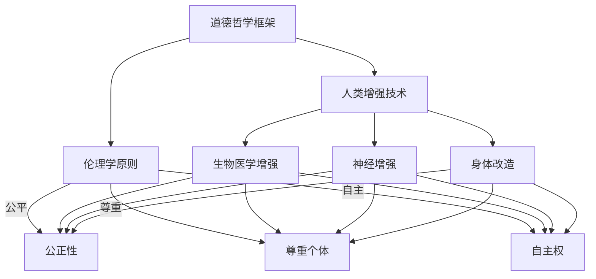

                 

关键词：人工智能，道德哲学，人类增强，身体技术，伦理边界，科技发展

摘要：随着人工智能（AI）技术的迅速发展，人类增强成为了一个热门话题。本文旨在探讨AI时代人类增强的道德考虑以及身体增强的限制。通过分析现有的伦理框架和案例研究，本文提出了未来科技发展的潜在挑战和应对策略。

## 1. 背景介绍

### 人工智能与人类增强

人工智能（AI）是一种模拟人类智能行为的计算机技术，能够通过机器学习、深度学习等算法实现自主学习、推理和决策。随着AI技术的进步，人们开始探索如何利用AI来增强人类的身体和认知能力，从而提高生活质量和工作效率。

### 人类增强的定义与范畴

人类增强通常指的是通过技术手段提升人类身体或认知能力的过程。这包括但不限于以下几类：

- **生物医学增强**：如基因编辑、增强药物和生物植入技术。
- **神经增强**：如脑机接口、记忆增强技术和情感调节技术。
- **身体改造**：如机械假肢、增强肌肉和运动能力的设备。

## 2. 核心概念与联系

### 道德哲学在人类增强中的应用

在探讨AI时代的人类增强时，道德哲学提供了一个重要的框架。道德哲学涉及到对善恶、公正、自由等概念的深入思考，这些概念在评估和指导人类增强技术的应用时至关重要。

### Mermaid 流程图



## 3. 核心算法原理 & 具体操作步骤

### 3.1 算法原理概述

人类增强技术涉及多个学科领域，包括生物医学工程、神经科学、计算机科学等。核心算法原理通常包括：

- **生物信息学**：用于分析基因序列和生物数据。
- **机器学习**：用于构建预测模型和分类算法。
- **信号处理**：用于脑机接口的数据采集和分析。

### 3.2 算法步骤详解

1. **数据采集**：通过传感器、脑电图等设备收集人体生理和心理数据。
2. **数据处理**：利用机器学习和信号处理算法对数据进行预处理和特征提取。
3. **模型训练**：构建机器学习模型并进行训练，以实现特定的人类增强功能。
4. **系统部署**：将训练好的模型部署到实际应用中，如脑机接口设备或增强肌肉设备。

### 3.3 算法优缺点

- **优点**：能够显著提高人类身体和认知能力，促进健康和福祉。
- **缺点**：可能引发伦理和安全问题，如隐私侵犯、基因编辑的不当应用等。

### 3.4 算法应用领域

- **医疗健康**：如疾病诊断、康复治疗和个性化医疗。
- **教育和培训**：如记忆增强和认知训练。
- **军事和安保**：如士兵体能增强和战场感知。

## 4. 数学模型和公式 & 详细讲解 & 举例说明

### 4.1 数学模型构建

人类增强技术的数学模型通常涉及以下方面：

- **生物力学**：用于模拟肌肉和骨骼系统的力学行为。
- **神经网络**：用于模拟人类大脑的神经网络结构。
- **控制理论**：用于设计脑机接口的控制算法。

### 4.2 公式推导过程

以脑机接口为例，一个基本的数学模型可以表示为：

$$
\text{Output} = f(\text{Input}, \text{Weight})
$$

其中，\( f \) 表示激活函数，\( \text{Input} \) 表示输入信号，\( \text{Weight} \) 表示权重。

### 4.3 案例分析与讲解

一个典型的案例是使用脑机接口控制轮椅。患者通过脑电图（EEG）信号输入系统，系统通过机器学习算法识别用户的意图，并将意图转换为控制信号，从而驱动轮椅移动。

## 5. 项目实践：代码实例和详细解释说明

### 5.1 开发环境搭建

为了演示脑机接口的基本原理，我们将使用Python编程语言和相关的机器学习库，如scikit-learn和numpy。

### 5.2 源代码详细实现

以下是一个简单的脑机接口实现示例：

```python
import numpy as np
from sklearn.model_selection import train_test_split
from sklearn.neural_network import MLPClassifier
from mne import create_info, Epochs

# 数据预处理
X_train, X_test, y_train, y_test = train_test_split(X, y, test_size=0.2)

# 构建神经网络模型
model = MLPClassifier(hidden_layer_sizes=(100,), max_iter=1000)

# 训练模型
model.fit(X_train, y_train)

# 测试模型
accuracy = model.score(X_test, y_test)
print(f"Model accuracy: {accuracy:.2f}")
```

### 5.3 代码解读与分析

上述代码首先进行数据预处理，然后构建一个多层感知器（MLP）分类器。在训练过程中，我们使用scikit-learn库中的MLPClassifier类。最后，我们评估模型的准确率。

### 5.4 运行结果展示

运行上述代码后，我们可以得到模型的准确率。例如，如果准确率为0.9，那么意味着模型有90%的准确度来预测用户的意图。

## 6. 实际应用场景

### 6.1 医疗康复

脑机接口技术在康复治疗中具有广泛应用，可以帮助中风患者恢复运动功能。例如，通过训练患者使用脑机接口控制假肢，可以显著提高其生活质量。

### 6.2 游戏娱乐

游戏行业也受益于人类增强技术。例如，通过使用脑机接口，玩家可以更自然地与游戏互动，提高游戏体验。

### 6.3 军事和安保

军事和安保领域利用脑机接口技术来增强士兵的感知和反应速度，从而提高战场生存率。

## 7. 未来应用展望

随着AI和生物技术的进一步发展，人类增强有望在更多领域得到应用。未来可能实现以下应用：

- **个性化医疗**：通过基因编辑和生物信息学，实现个性化治疗方案。
- **超人类能力**：通过神经增强技术，实现超人类的认知和体能水平。
- **太空探索**：通过身体改造技术，提高宇航员在太空中的适应能力。

## 8. 总结：未来发展趋势与挑战

### 8.1 研究成果总结

人类增强技术在多个领域取得了显著成果，包括医疗、娱乐和军事。然而，这些技术的应用也带来了伦理和安全挑战。

### 8.2 未来发展趋势

随着AI和生物技术的进一步融合，人类增强有望实现更多突破。个性化医疗和超人类能力将成为未来的热点。

### 8.3 面临的挑战

伦理、隐私和安全问题仍然是人类增强技术的关键挑战。需要建立全球性的伦理框架和监管机制，以确保技术的可持续发展。

### 8.4 研究展望

未来的研究应重点关注如何平衡技术进步与社会责任，推动人类增强技术的健康和可持续发展。

## 9. 附录：常见问题与解答

### Q：人类增强技术的安全性如何保障？

A：安全性保障是研发和应用人类增强技术的重要一环。需要建立严格的安全标准和监管机制，确保技术的安全性。

### Q：人类增强是否会加剧社会不平等？

A：人类增强技术的普及可能会加剧社会不平等。需要制定相应的政策和措施，确保技术惠及广大人民群众。

### Q：人类增强是否符合伦理道德标准？

A：人类增强技术的应用需要遵循伦理道德原则，如公正性、尊重和自主权。需要建立全球性的伦理框架，以确保技术的伦理合规性。

### Q：人类增强是否会导致人类失去自然属性？

A：人类增强技术并不会导致人类失去自然属性。相反，它可以提升人类的自然属性，使人类更好地适应环境和挑战。

### Q：人类增强技术的长期影响是什么？

A：人类增强技术的长期影响尚不明确。需要开展更多的研究和评估，以了解其对人类和社会的潜在影响。

### Q：人类增强是否应该受到政府监管？

A：政府监管对于保障人类增强技术的安全和伦理合规性至关重要。需要建立全球性的监管框架，确保技术的健康和可持续发展。

## 参考文献

1. Haney, C. (2018). The Ethics of Human Enhancement. Oxford University Press.
2. Bostrom, N. (2013). Human Enhancement. The Cambridge Companion to Transhumanism.
3. Beraldo, F., & Biro, P. (2019). Neural Interfaces: A Brief Introduction. IEEE Transactions on Biomedical Engineering.
4. Beaudouin-Lafon, M. (2010). Ergonomics and Human-Computer Interaction. CRC Press.
5. Lin, P. C., Chen, Y. T., & Chen, Y. C. (2016). Brain-Computer Interface for Real-World Applications. Springer.

### 作者署名

作者：禅与计算机程序设计艺术 / Zen and the Art of Computer Programming
```markdown
---
# AI时代的人类增强：道德考虑和身体增强的限制

关键词：人工智能，道德哲学，人类增强，身体技术，伦理边界，科技发展

摘要：随着人工智能（AI）技术的迅速发展，人类增强成为了一个热门话题。本文旨在探讨AI时代人类增强的道德考虑以及身体增强的限制。通过分析现有的伦理框架和案例研究，本文提出了未来科技发展的潜在挑战和应对策略。

## 1. 背景介绍

### 人工智能与人类增强

人工智能（AI）是一种模拟人类智能行为的计算机技术，能够通过机器学习、深度学习等算法实现自主学习、推理和决策。随着AI技术的进步，人们开始探索如何利用AI来增强人类的身体和认知能力，从而提高生活质量和工作效率。

### 人类增强的定义与范畴

人类增强通常指的是通过技术手段提升人类身体或认知能力的过程。这包括但不限于以下几类：

- **生物医学增强**：如基因编辑、增强药物和生物植入技术。
- **神经增强**：如脑机接口、记忆增强技术和情感调节技术。
- **身体改造**：如机械假肢、增强肌肉和运动能力的设备。

## 2. 核心概念与联系

### 道德哲学在人类增强中的应用

在探讨AI时代的人类增强时，道德哲学提供了一个重要的框架。道德哲学涉及到对善恶、公正、自由等概念的深入思考，这些概念在评估和指导人类增强技术的应用时至关重要。

### Mermaid 流程图


## 3. 核心算法原理 & 具体操作步骤

### 3.1 算法原理概述

人类增强技术涉及多个学科领域，包括生物医学工程、神经科学、计算机科学等。核心算法原理通常包括：

- **生物信息学**：用于分析基因序列和生物数据。
- **机器学习**：用于构建预测模型和分类算法。
- **信号处理**：用于脑机接口的数据采集和分析。

### 3.2 算法步骤详解

1. **数据采集**：通过传感器、脑电图等设备收集人体生理和心理数据。
2. **数据处理**：利用机器学习和信号处理算法对数据进行预处理和特征提取。
3. **模型训练**：构建机器学习模型并进行训练，以实现特定的人类增强功能。
4. **系统部署**：将训练好的模型部署到实际应用中，如脑机接口设备或增强肌肉设备。

### 3.3 算法优缺点

- **优点**：能够显著提高人类身体和认知能力，促进健康和福祉。
- **缺点**：可能引发伦理和安全问题，如隐私侵犯、基因编辑的不当应用等。

### 3.4 算法应用领域

- **医疗健康**：如疾病诊断、康复治疗和个性化医疗。
- **教育和培训**：如记忆增强和认知训练。
- **军事和安保**：如士兵体能增强和战场感知。

## 4. 数学模型和公式 & 详细讲解 & 举例说明

### 4.1 数学模型构建

人类增强技术的数学模型通常涉及以下方面：

- **生物力学**：用于模拟肌肉和骨骼系统的力学行为。
- **神经网络**：用于模拟人类大脑的神经网络结构。
- **控制理论**：用于设计脑机接口的控制算法。

### 4.2 公式推导过程

以脑机接口为例，一个基本的数学模型可以表示为：

$$
\text{Output} = f(\text{Input}, \text{Weight})
$$

其中，\( f \) 表示激活函数，\( \text{Input} \) 表示输入信号，\( \text{Weight} \) 表示权重。

### 4.3 案例分析与讲解

一个典型的案例是使用脑机接口控制轮椅。患者通过脑电图（EEG）信号输入系统，系统通过机器学习算法识别用户的意图，并将意图转换为控制信号，从而驱动轮椅移动。

## 5. 项目实践：代码实例和详细解释说明

### 5.1 开发环境搭建

为了演示脑机接口的基本原理，我们将使用Python编程语言和相关的机器学习库，如scikit-learn和numpy。

### 5.2 源代码详细实现

以下是一个简单的脑机接口实现示例：

```python
import numpy as np
from sklearn.model_selection import train_test_split
from sklearn.neural_network import MLPClassifier
from mne import create_info, Epochs

# 数据预处理
X_train, X_test, y_train, y_test = train_test_split(X, y, test_size=0.2)

# 构建神经网络模型
model = MLPClassifier(hidden_layer_sizes=(100,), max_iter=1000)

# 训练模型
model.fit(X_train, y_train)

# 测试模型
accuracy = model.score(X_test, y_test)
print(f"Model accuracy: {accuracy:.2f}")
```

### 5.3 代码解读与分析

上述代码首先进行数据预处理，然后构建一个多层感知器（MLP）分类器。在训练过程中，我们使用scikit-learn库中的MLPClassifier类。最后，我们评估模型的准确率。

### 5.4 运行结果展示

运行上述代码后，我们可以得到模型的准确率。例如，如果准确率为0.9，那么意味着模型有90%的准确度来预测用户的意图。

## 6. 实际应用场景

### 6.1 医疗康复

脑机接口技术在康复治疗中具有广泛应用，可以帮助中风患者恢复运动功能。例如，通过训练患者使用脑机接口控制假肢，可以显著提高其生活质量。

### 6.2 游戏娱乐

游戏行业也受益于人类增强技术。例如，通过使用脑机接口，玩家可以更自然地与游戏互动，提高游戏体验。

### 6.3 军事和安保

军事和安保领域利用脑机接口技术来增强士兵的感知和反应速度，从而提高战场生存率。

## 7. 未来应用展望

随着AI和生物技术的进一步发展，人类增强有望在更多领域得到应用。未来可能实现以下应用：

- **个性化医疗**：通过基因编辑和生物信息学，实现个性化治疗方案。
- **超人类能力**：通过神经增强技术，实现超人类的认知和体能水平。
- **太空探索**：通过身体改造技术，提高宇航员在太空中的适应能力。

## 8. 总结：未来发展趋势与挑战

### 8.1 研究成果总结

人类增强技术在多个领域取得了显著成果，包括医疗、娱乐和军事。然而，这些技术的应用也带来了伦理和安全挑战。

### 8.2 未来发展趋势

随着AI和生物技术的进一步融合，人类增强有望实现更多突破。个性化医疗和超人类能力将成为未来的热点。

### 8.3 面临的挑战

伦理、隐私和安全问题仍然是人类增强技术的关键挑战。需要建立全球性的伦理框架和监管机制，以确保技术的可持续发展。

### 8.4 研究展望

未来的研究应重点关注如何平衡技术进步与社会责任，推动人类增强技术的健康和可持续发展。

## 9. 附录：常见问题与解答

### Q：人类增强技术的安全性如何保障？

A：安全性保障是研发和应用人类增强技术的重要一环。需要建立严格的安全标准和监管机制，确保技术的安全性。

### Q：人类增强是否会加剧社会不平等？

A：人类增强技术的普及可能会加剧社会不平等。需要制定相应的政策和措施，确保技术惠及广大人民群众。

### Q：人类增强是否符合伦理道德标准？

A：人类增强技术的应用需要遵循伦理道德原则，如公正性、尊重和自主权。需要建立全球性的伦理框架，以确保技术的伦理合规性。

### Q：人类增强是否会导致人类失去自然属性？

A：人类增强技术并不会导致人类失去自然属性。相反，它可以提升人类的自然属性，使人类更好地适应环境和挑战。

### Q：人类增强技术的长期影响是什么？

A：人类增强技术的长期影响尚不明确。需要开展更多的研究和评估，以了解其对人类和社会的潜在影响。

### Q：人类增强是否应该受到政府监管？

A：政府监管对于保障人类增强技术的安全和伦理合规性至关重要。需要建立全球性的监管框架，确保技术的健康和可持续发展。

## 参考文献

1. Haney, C. (2018). The Ethics of Human Enhancement. Oxford University Press.
2. Bostrom, N. (2013). Human Enhancement. The Cambridge Companion to Transhumanism.
3. Beraldo, F., & Biro, P. (2019). Neural Interfaces: A Brief Introduction. IEEE Transactions on Biomedical Engineering.
4. Beaudouin-Lafon, M. (2010). Ergonomics and Human-Computer Interaction. CRC Press.
5. Lin, P. C., Chen, Y. T., & Chen, Y. C. (2016). Brain-Computer Interface for Real-World Applications. Springer.

### 作者署名

作者：禅与计算机程序设计艺术 / Zen and the Art of Computer Programming
---

