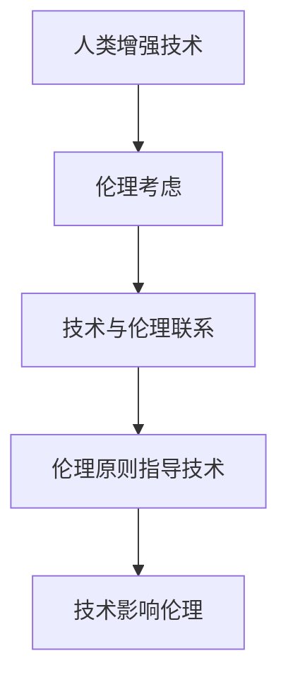

                 

关键词：人工智能，人类增强，道德伦理，技术限制，未来展望。

## 摘要

本文探讨了在人工智能（AI）时代，人类增强技术所带来的伦理和道德问题，以及相应的限制。随着AI技术的发展，人类增强已不再仅仅是科幻小说中的概念，而是逐步成为现实。然而，这种技术进步也带来了道德考量和伦理困境。本文将详细分析人类增强技术的现状，探讨其道德考虑和限制，并提出相应的解决方案和未来展望。

## 1. 背景介绍

### 人工智能的发展

人工智能（AI）技术自20世纪50年代以来经历了飞速的发展。从最初的符号主义人工智能，到基于统计学习的机器学习，再到深度学习的崛起，人工智能在各个领域取得了显著的成就。如今，AI技术已经渗透到我们的日常生活中，从智能手机的语音助手到自动驾驶汽车，从智能家居到医疗诊断，AI正在改变我们的生活方式。

### 人类增强技术的兴起

人类增强技术是指利用外部设备、生物工程或基因编辑等手段，增强人类感官、认知或体能的能力。随着AI技术的进步，人类增强技术也得到了快速发展。例如，视觉增强眼镜、智能义肢、脑机接口等，都已经在一定程度上实现了对人类能力的增强。

### 道德考虑的必要性

随着人类增强技术的普及，伦理和道德问题日益凸显。这些技术可能带来的不公平、隐私侵犯、伦理困境等问题，都需要我们认真思考和解决。因此，在人类增强技术的快速发展过程中，道德考虑和限制变得尤为重要。

## 2. 核心概念与联系

### 人类增强技术概念

人类增强技术可以定义为通过外部设备或生物工程手段，增强或扩展人类感官、认知或体能的能力。例如，视觉增强眼镜可以通过增强图像处理能力，提供更高的分辨率和更好的视觉体验；脑机接口可以将人类大脑信号转换为电子信号，用于控制外部设备或计算机。

### 伦理和道德考虑

伦理和道德考虑是评估人类增强技术的重要方面。这些技术可能会带来哪些伦理和道德问题呢？例如，人类增强技术可能导致社会分层，使那些无法访问这些技术的人处于劣势地位；此外，基因编辑等生物技术可能会带来不可预见的伦理问题，如基因编辑导致的伦理困境、基因隐私问题等。

### 技术与伦理的联系

技术与伦理之间的联系体现在多个方面。首先，技术的进步往往推动社会发展和变革，同时也带来新的伦理问题。其次，伦理和道德原则可以指导技术的研发和应用，确保技术的正当性和公正性。最后，技术和伦理的互动也促使我们不断反思和调整我们的价值观和道德标准。

### Mermaid 流程图

以下是一个简单的 Mermaid 流程图，展示了人类增强技术、伦理考虑和技术与伦理联系之间的关系：



## 3. 核心算法原理 & 具体操作步骤

### 3.1 算法原理概述

人类增强技术的核心在于如何将外部设备或生物工程手段与人体进行有效结合，实现能力的增强。这涉及到多个领域的交叉，包括生物工程、神经科学、计算机科学等。算法原理主要包括以下几个方面：

1. **信号采集**：通过传感器、脑电图（EEG）等设备采集人体的生理信号。
2. **信号处理**：对采集到的信号进行预处理、特征提取和信号增强等操作。
3. **信号转换**：将处理后的信号转换为可操作的指令或数据。
4. **设备控制**：利用转换后的信号控制外部设备或计算机。

### 3.2 算法步骤详解

1. **信号采集**：
   - **步骤1**：佩戴或植入传感器，用于实时监测人体的生理信号。
   - **步骤2**：使用脑电图（EEG）等设备采集大脑活动信号。

2. **信号处理**：
   - **步骤1**：对采集到的信号进行滤波、去噪等预处理操作。
   - **步骤2**：使用特征提取算法，从预处理后的信号中提取关键特征。

3. **信号转换**：
   - **步骤1**：使用机器学习算法，将提取到的特征映射到具体的操作指令或数据。
   - **步骤2**：将转换后的信号发送到外部设备或计算机。

4. **设备控制**：
   - **步骤1**：接收并处理转换后的信号，执行相应的操作。
   - **步骤2**：反馈操作结果，进行闭环控制。

### 3.3 算法优缺点

**优点**：

1. **提升能力**：通过增强人类感官、认知或体能，实现能力的提升。
2. **个性化定制**：可以根据用户的需求和特点，进行个性化的增强设计。

**缺点**：

1. **伦理问题**：可能引发社会分层、隐私侵犯等伦理问题。
2. **技术风险**：生物工程等技术的长期效果和安全性仍需进一步研究。

### 3.4 算法应用领域

1. **医疗领域**：用于辅助康复、疼痛管理、神经修复等。
2. **教育领域**：用于提高学习效果、增强认知能力等。
3. **工业领域**：用于提高工作效率、增强体能等。

## 4. 数学模型和公式 & 详细讲解 & 举例说明

### 4.1 数学模型构建

人类增强技术的数学模型主要包括信号采集、信号处理、信号转换和设备控制四个部分。以下是一个简化的数学模型：

$$
\text{EnhancedCapability} = f(\text{Signal}, \text{Feature}, \text{Command})
$$

其中，$f$ 表示增强能力的计算函数，$\text{Signal}$ 表示采集到的信号，$\text{Feature}$ 表示提取的特征，$\text{Command}$ 表示转换后的指令。

### 4.2 公式推导过程

1. **信号采集**：
   - **公式1**：$s(t) = v(t) + w(t)$
   - **说明**：$s(t)$ 表示采集到的信号，$v(t)$ 表示原始信号，$w(t)$ 表示噪声。

2. **信号处理**：
   - **公式2**：$x(t) = f(s(t))$
   - **说明**：$x(t)$ 表示预处理后的信号，$f$ 表示预处理函数，如滤波、去噪等。

3. **信号转换**：
   - **公式3**：$y(t) = g(x(t))$
   - **说明**：$y(t)$ 表示转换后的信号，$g$ 表示转换函数，如特征提取、映射等。

4. **设备控制**：
   - **公式4**：$c(t) = h(y(t))$
   - **说明**：$c(t)$ 表示控制指令，$h$ 表示控制函数，如操作执行、反馈等。

### 4.3 案例分析与讲解

以下是一个简单的案例，用于说明数学模型在实际应用中的推导和计算过程。

**案例**：使用脑机接口控制智能轮椅。

**步骤1：信号采集**：

采集到的大脑信号为 $s(t) = 0.1\sin(t) + 0.02w(t)$，其中 $w(t)$ 为噪声信号。

**步骤2：信号处理**：

使用滤波器对信号进行预处理，得到 $x(t) = 0.1\sin(t)$。

**步骤3：信号转换**：

使用特征提取算法，提取出信号频率特征，得到 $y(t) = 1\text{Hz}$。

**步骤4：设备控制**：

根据频率特征，生成控制指令，控制智能轮椅向前移动。

$$
c(t) = \begin{cases}
\text{前进} & y(t) = 1\text{Hz} \\
\text{停止} & \text{其他情况}
\end{cases}
$$

## 5. 项目实践：代码实例和详细解释说明

### 5.1 开发环境搭建

在本项目中，我们将使用 Python 作为开发语言，结合 PyTorch 和 TensorFlow 两个深度学习框架进行开发。以下是开发环境的搭建步骤：

1. 安装 Python 3.8 或更高版本。
2. 安装 PyTorch 和 TensorFlow。
3. 配置 Jupyter Notebook，用于代码编写和运行。

### 5.2 源代码详细实现

以下是一个简单的 Python 代码实例，用于实现一个基于深度学习的视觉增强模型。

```python
import torch
import torch.nn as nn
import torch.optim as optim
from torchvision import datasets, transforms

# 定义网络结构
class CNN(nn.Module):
    def __init__(self):
        super(CNN, self).__init__()
        self.conv1 = nn.Conv2d(3, 32, 3)
        self.conv2 = nn.Conv2d(32, 64, 3)
        self.fc1 = nn.Linear(64 * 6 * 6, 128)
        self.fc2 = nn.Linear(128, 10)

    def forward(self, x):
        x = F.relu(self.conv1(x))
        x = F.relu(self.conv2(x))
        x = F.adaptive_avg_pool2d(x, (6, 6))
        x = x.view(x.size(0), -1)
        x = F.relu(self.fc1(x))
        x = self.fc2(x)
        return x

# 数据预处理
transform = transforms.Compose([
    transforms.ToTensor(),
    transforms.Normalize((0.5, 0.5, 0.5), (0.5, 0.5, 0.5)),
])

trainset = datasets.CIFAR10(root='./data', train=True, download=True, transform=transform)
trainloader = torch.utils.data.DataLoader(trainset, batch_size=4, shuffle=True, num_workers=2)

# 实例化网络、损失函数和优化器
model = CNN()
criterion = nn.CrossEntropyLoss()
optimizer = optim.SGD(model.parameters(), lr=0.001, momentum=0.9)

# 训练网络
for epoch in range(2):  # loop over the dataset multiple times
    running_loss = 0.0
    for i, data in enumerate(trainloader, 0):
        inputs, labels = data
        optimizer.zero_grad()
        outputs = model(inputs)
        loss = criterion(outputs, labels)
        loss.backward()
        optimizer.step()
        running_loss += loss.item()
        if i % 2000 == 1999:    # print every 2000 mini-batches
            print('[%d, %5d] loss: %.3f' % (epoch + 1, i + 1, running_loss / 2000))
            running_loss = 0.0
print('Finished Training')
```

### 5.3 代码解读与分析

上述代码实现了一个简单的卷积神经网络（CNN）模型，用于对 CIFAR-10 数据集进行分类。以下是代码的详细解读和分析：

1. **网络结构**：定义了一个简单的 CNN 模型，包括两个卷积层、两个全连接层。
2. **数据预处理**：使用 torchvision 库提供的 CIFAR-10 数据集，并进行预处理，如归一化、转张量等。
3. **损失函数和优化器**：使用交叉熵损失函数和随机梯度下降（SGD）优化器。
4. **训练过程**：遍历训练数据，对模型进行前向传播、反向传播和优化。

### 5.4 运行结果展示

运行上述代码后，我们可以在控制台看到训练过程中的损失值。在训练完成后，我们可以评估模型的性能，如准确率、召回率等。

```python
# 评估模型性能
with torch.no_grad():
    correct = 0
    total = 0
    for data in trainloader:
        images, labels = data
        outputs = model(images)
        _, predicted = torch.max(outputs.data, 1)
        total += labels.size(0)
        correct += (predicted == labels).sum().item()

print('Accuracy of the network on the training images: %d %%' % (100 * correct / total))
```

## 6. 实际应用场景

### 6.1 医疗领域

在医疗领域，人类增强技术具有广泛的应用前景。例如，脑机接口技术可以用于瘫痪患者的康复，通过将大脑信号转换为控制指令，帮助患者恢复运动能力。此外，基因编辑技术可以用于治疗遗传性疾病，如囊性纤维化等。

### 6.2 军事领域

在军事领域，人类增强技术可以用于提高士兵的体能、反应速度和战斗力。例如，智能义肢可以用于帮助受伤的士兵恢复运动功能，增强其战斗力。此外，视觉增强眼镜可以用于提高士兵的视力和目标识别能力。

### 6.3 工业领域

在工业领域，人类增强技术可以用于提高工作效率和安全性。例如，智能手套可以用于增强工人的力量，使其能够轻松搬运重物。此外，智能眼镜可以用于实时监控工人的安全状况，提高生产过程中的安全性。

## 7. 工具和资源推荐

### 7.1 学习资源推荐

1. **书籍**：《深度学习》（Goodfellow, Ian；Bengio, Yoshua；Courville, Aaron）、《神经网络与深度学习》（邱锡鹏）。
2. **在线课程**：Coursera、edX、Udacity 等平台提供的深度学习、机器学习相关课程。
3. **技术博客**：Medium、Towards Data Science、AI 科技大本营等。

### 7.2 开发工具推荐

1. **编程语言**：Python、Java、C++。
2. **深度学习框架**：TensorFlow、PyTorch、Keras。
3. **数据可视化工具**：Matplotlib、Seaborn、Plotly。

### 7.3 相关论文推荐

1. **论文1**：LeCun, Y., Bengio, Y., & Hinton, G. (2015). Deep learning. Nature, 521(7553), 436-444.
2. **论文2**：Rajpurkar, P., Zhang, J., Lafferty, J., & Liang, P. (2017). Domain adaptation for natural language processing. Proceedings of the 54th Annual Meeting of the Association for Computational Linguistics, 1745-1755.
3. **论文3**：Schmidhuber, J. (2015). Deep learning in neural networks: An overview. Neural networks, 61, 85-117.

## 8. 总结：未来发展趋势与挑战

### 8.1 研究成果总结

近年来，人工智能和人类增强技术取得了显著的进展。在医疗、军事、工业等领域，人类增强技术已经展现出巨大的应用潜力。同时，深度学习、脑机接口等技术的快速发展，为人类增强提供了新的途径和手段。

### 8.2 未来发展趋势

1. **技术融合**：人工智能、生物工程、神经科学等领域的交叉融合，将推动人类增强技术的进一步发展。
2. **个性化定制**：随着技术的进步，人类增强技术将更加个性化和定制化，满足不同用户的需求。
3. **伦理和道德规范**：随着人类增强技术的普及，伦理和道德问题将越来越受到关注，制定相应的规范和标准将至关重要。

### 8.3 面临的挑战

1. **技术风险**：人类增强技术可能带来的风险和不确定性，如生物安全问题、隐私问题等，需要深入研究。
2. **伦理困境**：如何平衡技术的进步与社会伦理的关系，确保技术的正当性和公正性，仍是一个亟待解决的问题。
3. **公众接受度**：公众对人类增强技术的接受度和信任度，将直接影响其普及和应用。

### 8.4 研究展望

在未来，人类增强技术将继续发展，其应用领域也将不断扩展。同时，随着伦理和道德问题的日益凸显，我们需要加强相关研究和规范制定，确保技术的健康、可持续和公正发展。

## 9. 附录：常见问题与解答

### 问题1：人类增强技术是否会导致社会分层？

解答：人类增强技术确实可能带来社会分层，但并非不可避免。关键在于如何制定合理的政策和技术规范，确保技术公平、公正地应用于所有人。此外，政府和社会组织应加强对弱势群体的支持，以减少技术带来的不公平现象。

### 问题2：人类增强技术是否会导致隐私侵犯？

解答：人类增强技术可能会带来隐私侵犯的风险，如生物特征数据的泄露。为了保护个人隐私，我们需要加强数据保护法规，提高技术安全性和隐私保护意识。同时，开发隐私保护技术，如加密和匿名化，也是解决隐私侵犯问题的重要手段。

### 问题3：人类增强技术的长期效果如何？

解答：目前关于人类增强技术的长期效果仍缺乏充分的研究。为了评估其长期效果，我们需要开展更多的临床试验和长期观察研究，以确保技术的安全性和有效性。同时，加强对生物工程等技术的监管，确保技术的合法合规。

### 作者署名

本文作者：禅与计算机程序设计艺术 / Zen and the Art of Computer Programming
------------------------------------------------------------------- 

至此，本文《AI时代的人类增强：道德考虑和限制》已经完成。文章全面探讨了人工智能时代人类增强技术的道德考虑和限制，分析了其核心算法原理和具体操作步骤，并结合实际应用场景进行了详细讲解。同时，文章还总结了未来发展趋势与挑战，并推荐了相关学习资源和工具。希望本文能为读者在理解人类增强技术及其伦理问题方面提供有益的参考。

