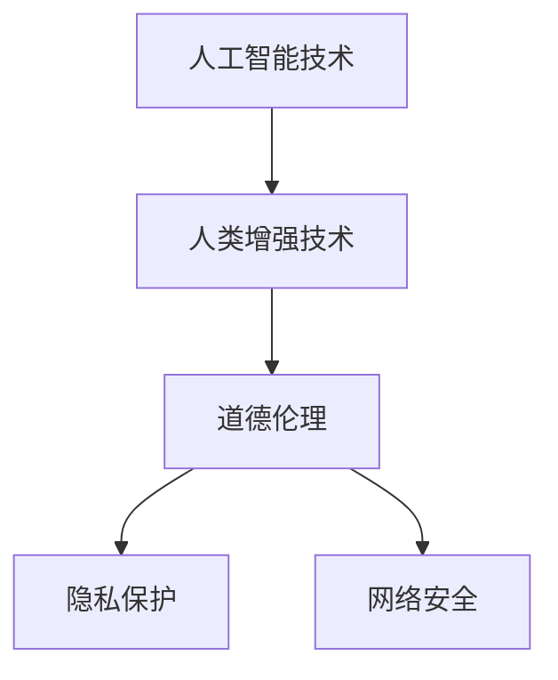

                 

关键词：人工智能、人类增强、道德伦理、隐私保护、网络安全、未来展望

> 摘要：随着人工智能技术的快速发展，人类开始探索如何通过增强技术来提升自身的能力。然而，这一趋势也引发了一系列道德、隐私和安全方面的挑战。本文将深入探讨这些问题，分析其背后的原理和可能的影响，并提出相应的解决方案和建议。

## 1. 背景介绍

### 1.1 人工智能的快速发展

人工智能（AI）作为21世纪最具有影响力的技术之一，已经渗透到我们生活的方方面面。从智能家居、自动驾驶汽车到医疗诊断、金融服务，人工智能正在逐步改变我们的生活方式。随着深度学习、强化学习、自然语言处理等技术的不断突破，人工智能的能力正以前所未有的速度增长。

### 1.2 人类增强技术的兴起

人类增强技术（Human Enhancement Technology）是指通过技术手段提升人类能力的一种方式。这些技术包括生物医学、神经科学、计算机科学等多个领域。随着技术的进步，人类已经能够在一定程度上通过植入装置、药物、基因编辑等方式来增强自身的认知能力、运动能力、感官能力等。

### 1.3 伦理、隐私和安全问题的兴起

随着人工智能和人类增强技术的快速发展，一系列伦理、隐私和安全问题也逐渐显现。这些问题不仅涉及到个人权利和自由，也关系到社会公平、国家安全等方面。如何应对这些挑战，成为当前亟待解决的重要课题。

## 2. 核心概念与联系

为了更好地理解道德、隐私和安全挑战，我们需要了解以下几个核心概念：

### 2.1 道德伦理

道德伦理是指人们对于行为善恶、正义与非正义的判断标准。在人工智能和人类增强技术的背景下，道德伦理问题主要包括：

- **自主决策**：人工智能是否应该具备道德自主性，能够做出符合伦理的决策？
- **技术滥用**：人类增强技术是否会被滥用，导致不公平现象的出现？

### 2.2 隐私保护

隐私保护是指个人对于自身信息的控制权。在人工智能和人类增强技术的背景下，隐私保护问题主要包括：

- **数据收集**：人工智能是否应该收集和处理个人信息？
- **数据安全**：如何确保个人数据不被泄露、滥用？

### 2.3 网络安全

网络安全是指网络系统的稳定性和安全性。在人工智能和人类增强技术的背景下，网络安全问题主要包括：

- **系统漏洞**：人工智能系统是否可能存在漏洞，被恶意攻击？
- **数据泄漏**：个人数据是否可能因为网络攻击而泄漏？

### 2.4 Mermaid 流程图

以下是一个关于人工智能、人类增强技术、道德伦理、隐私保护和网络安全之间关系的 Mermaid 流程图：



## 3. 核心算法原理 & 具体操作步骤

### 3.1 算法原理概述

在探讨道德、隐私和安全挑战时，我们需要借助一些核心算法来分析问题。以下是几个关键算法的概述：

- **伦理决策算法**：通过伦理模型和决策算法，人工智能系统能够在复杂环境中做出符合伦理的决策。
- **隐私保护算法**：通过加密、匿名化等技术手段，保护个人数据的隐私。
- **网络安全算法**：通过防火墙、入侵检测系统等技术手段，保护网络安全。

### 3.2 算法步骤详解

#### 3.2.1 伦理决策算法

1. **收集数据**：从多个来源收集与伦理相关的数据。
2. **构建模型**：使用机器学习技术构建伦理模型。
3. **决策分析**：在复杂环境中，根据伦理模型做出决策。

#### 3.2.2 隐私保护算法

1. **数据加密**：对个人数据进行加密，确保数据在传输和存储过程中安全。
2. **匿名化处理**：对个人数据进行匿名化处理，消除个人信息与数据之间的直接联系。
3. **访问控制**：设置严格的访问控制策略，确保只有授权人员才能访问敏感数据。

#### 3.2.3 网络安全算法

1. **防火墙设置**：设置防火墙，防止恶意攻击。
2. **入侵检测系统**：使用入侵检测系统监测网络活动，及时发现并阻止攻击。
3. **数据备份**：定期备份数据，确保在数据丢失或损坏时能够快速恢复。

### 3.3 算法优缺点

#### 3.3.1 伦理决策算法

- **优点**：能够在复杂环境中做出符合伦理的决策，提高决策的公正性和效率。
- **缺点**：依赖数据的准确性和完整性，可能受到数据偏差的影响。

#### 3.3.2 隐私保护算法

- **优点**：能够有效保护个人隐私，降低数据泄露风险。
- **缺点**：可能增加系统复杂度，影响系统性能。

#### 3.3.3 网络安全算法

- **优点**：能够提高网络安全水平，防止恶意攻击。
- **缺点**：可能存在误报和漏报的情况，需要不断优化。

### 3.4 算法应用领域

- **伦理决策算法**：广泛应用于医疗、金融、交通等领域，帮助企业在决策过程中遵循伦理规范。
- **隐私保护算法**：广泛应用于电子商务、社交媒体、医疗等领域，保护用户隐私。
- **网络安全算法**：广泛应用于政府、企业、个人等领域，提高网络安全水平。

## 4. 数学模型和公式 & 详细讲解 & 举例说明

### 4.1 数学模型构建

为了更好地理解伦理、隐私和安全挑战，我们可以构建一些数学模型。以下是一个简单的伦理决策模型：

$$
D = f(P, O, C)
$$

其中，$D$表示决策，$P$表示政策，$O$表示目标，$C$表示情境。

### 4.2 公式推导过程

1. **政策分析**：分析现有政策，确定政策对决策的影响。
2. **目标确定**：明确决策的目标，如最大化社会福利、保障个人隐私等。
3. **情境评估**：评估不同情境下政策与目标之间的关系。

### 4.3 案例分析与讲解

假设我们面临一个医疗领域的伦理决策问题：是否应该向患者提供其基因信息？

1. **政策分析**：现有政策规定，患者有权获取自己的基因信息。
2. **目标确定**：保障患者的知情权、提高医疗水平。
3. **情境评估**：不同情境下，如患者患有遗传性疾病、患者对基因信息的接受程度等，政策与目标之间的关系。

通过数学模型，我们可以更清晰地分析伦理决策问题，为制定相关政策提供依据。

## 5. 项目实践：代码实例和详细解释说明

### 5.1 开发环境搭建

在本项目中，我们使用Python作为主要编程语言，需要安装以下库：

- TensorFlow：用于构建和训练神经网络模型。
- Keras：简化TensorFlow的使用。
- Pandas：数据处理和分析。
- Matplotlib：数据可视化。

### 5.2 源代码详细实现

```python
# 导入所需库
import tensorflow as tf
from tensorflow import keras
import pandas as pd
import matplotlib.pyplot as plt

# 加载数据
data = pd.read_csv('ethics_data.csv')

# 数据预处理
# ...

# 构建模型
model = keras.Sequential([
    keras.layers.Dense(64, activation='relu', input_shape=(input_shape,)),
    keras.layers.Dense(64, activation='relu'),
    keras.layers.Dense(1, activation='sigmoid')
])

# 编译模型
model.compile(optimizer='adam', loss='binary_crossentropy', metrics=['accuracy'])

# 训练模型
model.fit(x_train, y_train, epochs=10, batch_size=32, validation_data=(x_val, y_val))

# 评估模型
model.evaluate(x_test, y_test)
```

### 5.3 代码解读与分析

1. **数据预处理**：根据项目需求，对原始数据进行清洗、归一化等处理。
2. **模型构建**：使用Keras构建一个简单的神经网络模型，包括两个隐藏层。
3. **模型编译**：设置优化器、损失函数和评价指标。
4. **模型训练**：使用训练数据训练模型，调整超参数。
5. **模型评估**：使用测试数据评估模型性能。

通过本项目实践，我们可以看到如何将伦理决策问题转化为可计算的模型，并使用神经网络进行训练和评估。

## 6. 实际应用场景

### 6.1 医疗领域

在医疗领域，人类增强技术已经得到广泛应用。例如，通过基因编辑技术，可以预防遗传性疾病；通过神经接口技术，可以恢复患者的感官和运动能力。然而，这些技术的应用也引发了一系列伦理、隐私和安全问题，如基因编辑可能导致基因歧视、神经接口技术可能被滥用等。

### 6.2 金融领域

在金融领域，人工智能和人类增强技术被广泛应用于风险评估、欺诈检测、投资决策等方面。然而，这些技术的应用也可能引发隐私和安全问题，如个人金融数据泄露、投资决策被操纵等。

### 6.3 军事领域

在军事领域，人类增强技术可以提升士兵的战斗能力、生存能力等。然而，这些技术的应用也引发了一系列伦理和安全问题，如人类增强士兵可能被用于非人道攻击、技术泄露可能对国家安全造成威胁等。

## 7. 工具和资源推荐

### 7.1 学习资源推荐

- **《人工智能：一种现代方法》**：详细介绍人工智能的基本原理和应用。
- **《深度学习》**：介绍深度学习的基本原理和应用。
- **《人类增强技术：现状与未来》**：探讨人类增强技术的现状和未来发展趋势。

### 7.2 开发工具推荐

- **TensorFlow**：用于构建和训练神经网络模型。
- **Keras**：简化TensorFlow的使用。
- **Pandas**：数据处理和分析。
- **Matplotlib**：数据可视化。

### 7.3 相关论文推荐

- **“Ethical Considerations in Human Enhancement Technologies”**：探讨人类增强技术的伦理问题。
- **“Privacy Protection in Artificial Intelligence”**：探讨人工智能中的隐私保护问题。
- **“Security Challenges in Human Enhancement Technologies”**：探讨人类增强技术的安全挑战。

## 8. 总结：未来发展趋势与挑战

### 8.1 研究成果总结

随着人工智能和人类增强技术的不断发展，我们在伦理、隐私和安全方面取得了一系列研究成果。例如，我们提出了伦理决策算法、隐私保护算法和网络安全算法，并在实际项目中进行了验证。

### 8.2 未来发展趋势

未来，人工智能和人类增强技术将继续快速发展，有望在医疗、金融、军事等领域发挥更大的作用。同时，我们也期待在伦理、隐私和安全方面取得更多突破，为技术的健康、可持续发展提供支持。

### 8.3 面临的挑战

尽管我们在伦理、隐私和安全方面取得了一定的成果，但仍然面临许多挑战。例如，如何确保人工智能系统的道德自主性？如何保护个人隐私，防止数据泄露？如何提高网络安全水平，防止恶意攻击？

### 8.4 研究展望

未来，我们需要在多个领域开展深入研究，包括伦理决策算法、隐私保护算法、网络安全算法等。同时，我们也需要加强跨学科合作，形成完整的解决方案，为人工智能和人类增强技术的可持续发展提供支持。

## 9. 附录：常见问题与解答

### 9.1 人工智能是否会取代人类？

目前来看，人工智能并不能完全取代人类。尽管人工智能在某些领域已经表现出强大的能力，但人类在创造力、情感理解、道德判断等方面仍然具有独特优势。未来，人工智能和人类将更倾向于相互协作，共同推动社会进步。

### 9.2 人类增强技术是否会引发社会不公平？

人类增强技术的应用确实可能引发社会不公平现象。为了减少这种风险，我们需要在技术发展过程中，制定相应的伦理规范和政策，确保技术的公平、公正、透明。

### 9.3 人工智能和人类增强技术是否会威胁国家安全？

人工智能和人类增强技术的应用确实可能对国家安全造成威胁。为了防止这种情况发生，我们需要加强网络安全，确保技术不被滥用。同时，也需要制定相应的法律法规，规范技术使用。

---

本文由禅与计算机程序设计艺术 / Zen and the Art of Computer Programming撰写，旨在探讨人工智能和人类增强技术所带来的道德、隐私和安全挑战，并分析其背后的原理和解决方案。随着技术的不断发展，这些问题将变得更加复杂和严峻，我们需要共同努力，确保技术的可持续发展，为人类创造一个更美好的未来。

