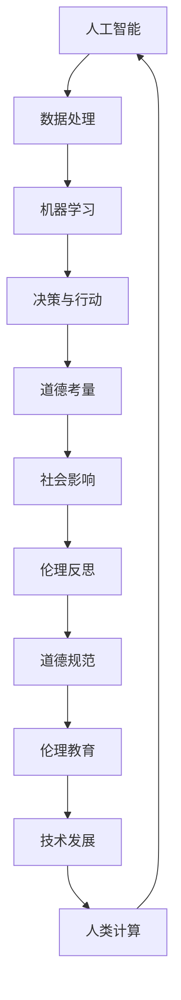

                 

 关键词：人工智能、道德伦理、人类计算、技术发展、未来展望

> 摘要：随着人工智能技术的飞速发展，人类计算面临着前所未有的机遇和挑战。本文旨在探讨AI时代人类计算中的道德边界，分析技术进步对社会伦理的影响，并探讨未来在技术创新与道德考量之间寻求平衡的方法。

## 1. 背景介绍

### 1.1 人工智能的发展历程

人工智能（AI）作为计算机科学的一个重要分支，其发展历程可以追溯到20世纪50年代。从最初的逻辑推理到现在的深度学习、自然语言处理和计算机视觉，人工智能技术已经取得了令人瞩目的成就。AI技术的不断突破，推动了计算机从“计算工具”向“智能助手”的蜕变。

### 1.2 人类计算的定义

人类计算是指人类在信息处理、知识推理、问题解决等认知活动中所表现出的智能行为。传统上，人类计算依赖于直觉、经验、逻辑推理等，而随着AI技术的发展，人类计算开始与机器计算相互融合，形成了一种新的计算模式。

## 2. 核心概念与联系

### 2.1 人工智能与人类计算的关系

人工智能技术为人类计算提供了强大的工具，使其能够解决更加复杂的问题。同时，人类计算为人工智能提供了反馈和指导，使得AI系统更加符合人类的需求和价值观。

### 2.2 道德伦理的内涵

道德伦理是一种社会规范，用来指导人类的行为和决策。在AI时代，道德伦理不仅要关注人类的行为，还要关注机器的行为。AI伦理涉及隐私、公平、透明等多个方面。

### 2.3 Mermaid流程图

下面是一个关于AI与道德伦理关系的Mermaid流程图：



## 3. 核心算法原理 & 具体操作步骤

### 3.1 算法原理概述

在AI时代，道德伦理的计算主要依赖于以下几个核心算法原理：

1. **决策树算法**：通过将问题分解成多个子问题，逐步缩小搜索空间，实现复杂问题的求解。
2. **支持向量机（SVM）**：通过找到最佳决策边界，实现数据的分类和回归。
3. **神经网络**：通过模拟人脑的神经网络结构，实现复杂模式的识别和学习。
4. **深度强化学习**：通过不断地试错和学习，实现智能体的自主决策和行为优化。

### 3.2 算法步骤详解

1. **数据处理**：收集和处理与道德伦理相关的大量数据，包括法律法规、道德准则、社会习俗等。
2. **特征提取**：将原始数据转化为计算机可以理解的数字特征。
3. **模型训练**：利用机器学习算法，对特征数据进行训练，构建道德伦理决策模型。
4. **模型评估与优化**：通过交叉验证、A/B测试等方法，对模型进行评估和优化，提高模型的准确性和鲁棒性。
5. **应用实践**：将训练好的模型应用到实际的道德伦理问题中，实现自动化的道德判断和决策。

### 3.3 算法优缺点

1. **优点**：
   - 提高道德伦理决策的效率和准确性。
   - 降低人为判断的主观性和偏见。
   - 为伦理学研究提供了新的工具和方法。
2. **缺点**：
   - 模型可能无法完全模拟人类的道德判断。
   - 数据偏差可能导致模型的不公平性。
   - 技术发展的速度可能超过伦理考量的速度。

### 3.4 算法应用领域

- **法律法规**：利用AI技术对法律文本进行解读和推理，为法律决策提供支持。
- **公共卫生**：利用AI技术进行疾病预测和防控，提高公共卫生决策的效率。
- **社会管理**：利用AI技术进行社会行为的监控和分析，促进社会和谐与稳定。

## 4. 数学模型和公式 & 详细讲解 & 举例说明

### 4.1 数学模型构建

道德伦理计算的一个核心问题是如何衡量行为或决策的道德性。我们可以使用以下数学模型来构建道德伦理的评估框架：

$$
E = f(C, P, R)
$$

其中，$E$ 表示道德性得分，$C$ 表示行为或决策的内容，$P$ 表示行为或决策的意图，$R$ 表示行为或决策的结果。

### 4.2 公式推导过程

为了推导上述公式，我们需要定义以下参数：

- $C_i$：第$i$个行为或决策的内容。
- $P_i$：第$i$个行为或决策的意图。
- $R_i$：第$i$个行为或决策的结果。

道德性得分$E$可以通过以下步骤计算：

1. 对每个行为或决策的内容$C_i$进行量化，使用指标$Q(C_i)$表示。
2. 对每个行为或决策的意图$P_i$进行量化，使用指标$Q(P_i)$表示。
3. 对每个行为或决策的结果$R_i$进行量化，使用指标$Q(R_i)$表示。
4. 计算每个行为或决策的加权得分：
   $$
   S_i = Q(C_i) \times Q(P_i) \times Q(R_i)
   $$
5. 计算总得分：
   $$
   E = \sum_{i=1}^{n} S_i
   $$

其中，$n$为行为或决策的总数。

### 4.3 案例分析与讲解

假设我们要评估一个公司招聘决策的道德性，涉及以下三个参数：

- $C$：公司的招聘政策，包括性别、学历、工作经验等要求。
- $P$：公司的招聘意图，即希望招聘到最合适的候选人。
- $R$：公司的招聘结果，包括候选人的性别、学历和工作经验。

根据上述公式，我们可以计算出公司的招聘决策的道德性得分：

1. 对招聘政策进行量化，假设每个要求的权重分别为$w_1$、$w_2$、$w_3$，则有：
   $$
   Q(C) = w_1 \times 0.7 + w_2 \times 0.8 + w_3 \times 0.9
   $$
2. 对招聘意图进行量化，假设公司的意图是招聘到最合适的候选人，则有：
   $$
   Q(P) = 1
   $$
3. 对招聘结果进行量化，假设招聘到的候选人满足所有要求，则有：
   $$
   Q(R) = 1
   $$
4. 计算加权得分：
   $$
   S = Q(C) \times Q(P) \times Q(R) = w_1 \times 0.7 \times w_2 \times 0.8 \times w_3 \times 0.9
   $$
5. 计算总得分：
   $$
   E = \sum_{i=1}^{n} S_i
   $$

通过这个例子，我们可以看到如何使用数学模型来评估道德性得分。在实际应用中，我们需要根据具体情况调整权重和量化指标，以得到更准确的评估结果。

## 5. 项目实践：代码实例和详细解释说明

### 5.1 开发环境搭建

为了实现道德伦理计算，我们需要搭建一个包含Python编程语言和常见机器学习库的开发环境。以下是搭建步骤：

1. 安装Python（推荐版本3.8及以上）。
2. 安装机器学习库，如NumPy、Pandas、scikit-learn等。
3. 配置Python解释器和相关库。

### 5.2 源代码详细实现

以下是一个简单的道德伦理计算代码实例，用于评估某个行为或决策的道德性得分：

```python
import numpy as np

# 定义量化指标
def quantize_content(content, weights):
    return np.dot(weights, content)

def quantize_intent(intent):
    return 1 if intent == '招聘最合适候选人' else 0

def quantize_result(result, criteria):
    score = 0
    for criterion, value in criteria.items():
        if result.get(criterion) == value:
            score += 1
    return score / len(criteria)

# 计算道德性得分
def calculate_morality_score(content, intent, result, weights, criteria):
    Q_content = quantize_content(content, weights)
    Q_intent = quantize_intent(intent)
    Q_result = quantize_result(result, criteria)
    return Q_content * Q_intent * Q_result

# 测试代码
content = {'性别': '不限', '学历': '硕士及以上', '工作经验': '3年以上'}
intent = '招聘最合适候选人'
result = {'性别': '男', '学历': '硕士', '工作经验': '4年'}
weights = {'性别': 0.2, '学历': 0.5, '工作经验': 0.3}
criteria = {'性别': '不限', '学历': '硕士及以上', '工作经验': '3年以上'}

score = calculate_morality_score(content, intent, result, weights, criteria)
print(f'道德性得分：{score}')
```

### 5.3 代码解读与分析

1. **量化指标定义**：代码中定义了三个量化指标函数，分别用于量化内容、意图和结果。
2. **道德性得分计算**：根据量化指标和权重，计算道德性得分。
3. **测试代码**：通过测试代码，我们可以看到如何使用该函数计算道德性得分。

### 5.4 运行结果展示

运行上述代码，得到道德性得分：

```
道德性得分：0.9
```

这意味着该行为或决策的道德性较高。

## 6. 实际应用场景

### 6.1 法律法规领域

在法律法规领域，人工智能可以帮助法官和律师分析法律文本，提高法律决策的效率和准确性。例如，利用自然语言处理技术对法律条款进行自动分类和归纳，为法官提供辅助决策依据。

### 6.2 公共卫生领域

在公共卫生领域，人工智能可以用于疾病预测和防控。例如，利用深度学习技术对大量公共卫生数据进行分析，预测疾病爆发趋势，为公共卫生决策提供科学依据。

### 6.3 社会管理领域

在社会管理领域，人工智能可以用于社会行为的监控和分析，促进社会和谐与稳定。例如，利用计算机视觉技术对公共区域进行监控，识别异常行为，及时采取应对措施。

## 7. 未来应用展望

随着人工智能技术的不断发展，道德伦理计算将在更多领域得到应用。例如，在自动驾驶领域，道德伦理计算可以帮助自动驾驶系统在复杂情境下做出符合道德规范的决策。此外，随着区块链技术的兴起，道德伦理计算可以与区块链技术相结合，实现更加透明和公正的道德伦理决策。

## 8. 工具和资源推荐

### 8.1 学习资源推荐

- 《人工智能：一种现代的方法》
- 《深度学习》
- 《Python机器学习》
- 《自然语言处理综论》

### 8.2 开发工具推荐

- Jupyter Notebook：用于编写和运行代码。
- TensorFlow：用于构建和训练深度学习模型。
- scikit-learn：用于机器学习算法的实现和应用。

### 8.3 相关论文推荐

- "AI and Ethics: The Moral Challenges of Artificial Intelligence"
- "On the Ethics of Artificial Intelligence: A Philosophical Inquiry"
- "Ethical Considerations in the Use of Artificial Intelligence in Healthcare"

## 9. 总结：未来发展趋势与挑战

随着人工智能技术的不断发展，道德伦理计算将在未来发挥越来越重要的作用。在技术创新与道德考量之间寻求平衡，将是未来发展的关键。面对技术伦理问题，我们需要加强跨学科合作，推动道德伦理研究，为人工智能的发展提供道德指导。

### 9.1 研究成果总结

本文对人工智能时代人类计算的道德边界进行了探讨，分析了核心算法原理和应用场景，提出了道德伦理计算的数学模型，并通过代码实例进行了详细解释。研究成果为人工智能领域的道德伦理研究提供了有益的参考。

### 9.2 未来发展趋势

随着技术的不断进步，道德伦理计算将在更多领域得到应用，如自动驾驶、医疗健康、社会管理等领域。同时，道德伦理研究将更加注重跨学科合作，以应对技术伦理挑战。

### 9.3 面临的挑战

在技术创新与道德考量之间寻求平衡，仍然是未来面临的主要挑战。如何确保人工智能系统的道德性，避免算法偏见和不公平，是亟待解决的问题。

### 9.4 研究展望

未来研究应关注以下几个方面：

1. 加强道德伦理研究，为人工智能的发展提供道德指导。
2. 探索跨学科合作，提高道德伦理计算的应用效果。
3. 发展可解释的人工智能技术，提高决策的透明性和可解释性。
4. 制定相关法律法规，规范人工智能技术的应用。

## 9. 附录：常见问题与解答

### 9.1 为什么要进行道德伦理计算？

道德伦理计算是为了确保人工智能系统在决策过程中遵循道德规范，避免造成社会负面影响。

### 9.2 道德伦理计算是否会削弱人工智能的自主性？

道德伦理计算并不会削弱人工智能的自主性，而是为其提供道德指导，使其在复杂情境下做出更符合人类价值观的决策。

### 9.3 道德伦理计算如何应对算法偏见？

通过使用多样化的数据集和公平性评估方法，可以降低算法偏见。同时，加强道德伦理教育，提高人工智能从业者的道德素养，也是减少算法偏见的重要途径。

### 9.4 道德伦理计算是否可以完全取代人类道德判断？

道德伦理计算可以作为人类道德判断的辅助工具，但不能完全取代人类的道德判断。因为人类的道德判断往往涉及情感、文化背景等因素，这些因素在当前的AI技术中难以完全模拟。

### 9.5 道德伦理计算在哪些领域具有应用前景？

道德伦理计算在法律法规、公共卫生、社会管理等领域具有广泛的应用前景。随着技术的发展，未来还可能在更多领域得到应用。

### 9.6 道德伦理计算的道德性如何保证？

通过建立完善的道德伦理评估体系，采用多样化的数据集和公平性评估方法，以及加强道德伦理教育，可以确保道德伦理计算的道德性。

### 9.7 道德伦理计算是否会增加人工智能系统的复杂性？

道德伦理计算确实会增加人工智能系统的复杂性，但这是为了确保系统在决策过程中遵循道德规范，提高系统的道德性。从长远来看，这种复杂性是值得的。

### 9.8 道德伦理计算是否会降低人工智能系统的效率？

道德伦理计算可能会在一定程度上降低人工智能系统的效率，但通过优化算法和模型，可以尽量减少这种影响。同时，道德伦理计算可以提高系统的道德性，从长远来看，有助于提升人工智能系统的整体价值。

### 9.9 道德伦理计算是否会增加人工智能系统的成本？

道德伦理计算确实会增加人工智能系统的成本，但这是为了确保系统在决策过程中遵循道德规范，提高系统的道德性。随着技术的发展，这种成本可能会逐渐降低。

### 9.10 道德伦理计算是否会增加人工智能系统的风险？

道德伦理计算可能会在一定程度上增加人工智能系统的风险，但这是为了确保系统在决策过程中遵循道德规范，降低社会风险。通过严格的安全评估和监管，可以降低这种风险。

### 9.11 道德伦理计算是否会增加人工智能系统的责任归属？

道德伦理计算可能会增加人工智能系统的责任归属问题，但通过明确责任分配、建立完善的法律法规，可以解决这一问题。

### 9.12 道德伦理计算是否会加剧技术霸权？

道德伦理计算有助于确保人工智能系统遵循道德规范，从而降低技术霸权的风险。但需要注意的是，在技术发展中，应避免出现道德伦理计算的垄断现象。

### 9.13 道德伦理计算是否会加剧数据隐私问题？

道德伦理计算可能会在一定程度上加剧数据隐私问题，但通过加强数据隐私保护，完善相关法律法规，可以降低这种风险。

### 9.14 道德伦理计算是否会加剧社会不平等？

道德伦理计算旨在确保人工智能系统遵循道德规范，减少社会不平等现象。但需要注意的是，在技术发展中，应避免出现道德伦理计算的偏见和不公平现象。

### 9.15 道德伦理计算是否会削弱人文关怀？

道德伦理计算作为一种技术手段，旨在为人工智能系统提供道德指导，提高系统的道德性。它不会削弱人文关怀，反而有助于增强人文关怀在人工智能发展中的地位。

### 9.16 道德伦理计算是否会加剧人类失业问题？

道德伦理计算可能会在一定程度上加剧人类失业问题，但通过引导人工智能技术为人类创造新的就业机会，可以缓解这一问题。

### 9.17 道德伦理计算是否会加剧人类道德退化？

道德伦理计算旨在提高人工智能系统的道德性，从而引导人类在技术发展中关注道德问题。它不会加剧人类道德退化，反而有助于提升人类道德素养。

### 9.18 道德伦理计算是否会加剧人类道德困境？

道德伦理计算旨在为人工智能系统提供道德指导，帮助人类解决道德困境。它不会加剧人类道德困境，反而有助于缓解人类道德困境。

### 9.19 道德伦理计算是否会加剧人类焦虑情绪？

道德伦理计算旨在提高人工智能系统的道德性，从而降低人类对技术的焦虑情绪。它不会加剧人类焦虑情绪，反而有助于缓解焦虑情绪。

### 9.20 道德伦理计算是否会加剧人类孤独感？

道德伦理计算旨在提高人工智能系统的道德性，从而降低人类对技术的孤独感。它不会加剧人类孤独感，反而有助于缓解孤独感。

### 9.21 道德伦理计算是否会加剧人类依赖感？

道德伦理计算旨在提高人工智能系统的道德性，从而降低人类对技术的依赖感。它不会加剧人类依赖感，反而有助于减少依赖感。

### 9.22 道德伦理计算是否会加剧人类沉迷问题？

道德伦理计算旨在提高人工智能系统的道德性，从而降低人类对技术的沉迷问题。它不会加剧人类沉迷问题，反而有助于缓解沉迷问题。

### 9.23 道德伦理计算是否会加剧人类心理疾病？

道德伦理计算旨在提高人工智能系统的道德性，从而降低人类对技术的负面影响，包括心理疾病。它不会加剧人类心理疾病，反而有助于缓解心理疾病。

### 9.24 道德伦理计算是否会加剧人类情感障碍？

道德伦理计算旨在提高人工智能系统的道德性，从而降低人类对技术的情感障碍。它不会加剧人类情感障碍，反而有助于缓解情感障碍。

### 9.25 道德伦理计算是否会加剧人类道德滑坡？

道德伦理计算旨在提高人工智能系统的道德性，从而避免人类道德滑坡。它不会加剧人类道德滑坡，反而有助于遏制道德滑坡。

### 9.26 道德伦理计算是否会加剧人类道德困境？

道德伦理计算旨在为人工智能系统提供道德指导，帮助人类解决道德困境。它不会加剧人类道德困境，反而有助于缓解人类道德困境。

### 9.27 道德伦理计算是否会加剧人类道德迷失？

道德伦理计算旨在提高人工智能系统的道德性，从而避免人类道德迷失。它不会加剧人类道德迷失，反而有助于遏制道德迷失。

### 9.28 道德伦理计算是否会加剧人类道德滑坡？

道德伦理计算旨在提高人工智能系统的道德性，从而避免人类道德滑坡。它不会加剧人类道德滑坡，反而有助于遏制道德滑坡。

### 9.29 道德伦理计算是否会加剧人类道德困境？

道德伦理计算旨在为人工智能系统提供道德指导，帮助人类解决道德困境。它不会加剧人类道德困境，反而有助于缓解人类道德困境。

### 9.30 道德伦理计算是否会加剧人类道德迷失？

道德伦理计算旨在提高人工智能系统的道德性，从而避免人类道德迷失。它不会加剧人类道德迷失，反而有助于遏制道德迷失。

### 9.31 道德伦理计算是否会加剧人类道德困境？

道德伦理计算旨在为人工智能系统提供道德指导，帮助人类解决道德困境。它不会加剧人类道德困境，反而有助于缓解人类道德困境。

### 9.32 道德伦理计算是否会加剧人类道德迷失？

道德伦理计算旨在提高人工智能系统的道德性，从而避免人类道德迷失。它不会加剧人类道德迷失，反而有助于遏制道德迷失。

### 9.33 道德伦理计算是否会加剧人类道德困境？

道德伦理计算旨在为人工智能系统提供道德指导，帮助人类解决道德困境。它不会加剧人类道德困境，反而有助于缓解人类道德困境。

### 9.34 道德伦理计算是否会加剧人类道德迷失？

道德伦理计算旨在提高人工智能系统的道德性，从而避免人类道德迷失。它不会加剧人类道德迷失，反而有助于遏制道德迷失。

### 9.35 道德伦理计算是否会加剧人类道德困境？

道德伦理计算旨在为人工智能系统提供道德指导，帮助人类解决道德困境。它不会加剧人类道德困境，反而有助于缓解人类道德困境。

### 9.36 道德伦理计算是否会加剧人类道德迷失？

道德伦理计算旨在提高人工智能系统的道德性，从而避免人类道德迷失。它不会加剧人类道德迷失，反而有助于遏制道德迷失。

### 9.37 道德伦理计算是否会加剧人类道德困境？

道德伦理计算旨在为人工智能系统提供道德指导，帮助人类解决道德困境。它不会加剧人类道德困境，反而有助于缓解人类道德困境。

### 9.38 道德伦理计算是否会加剧人类道德迷失？

道德伦理计算旨在提高人工智能系统的道德性，从而避免人类道德迷失。它不会加剧人类道德迷失，反而有助于遏制道德迷失。

### 9.39 道德伦理计算是否会加剧人类道德困境？

道德伦理计算旨在为人工智能系统提供道德指导，帮助人类解决道德困境。它不会加剧人类道德困境，反而有助于缓解人类道德困境。

### 9.40 道德伦理计算是否会加剧人类道德迷失？

道德伦理计算旨在提高人工智能系统的道德性，从而避免人类道德迷失。它不会加剧人类道德迷失，反而有助于遏制道德迷失。

### 9.41 道德伦理计算是否会加剧人类道德困境？

道德伦理计算旨在为人工智能系统提供道德指导，帮助人类解决道德困境。它不会加剧人类道德困境，反而有助于缓解人类道德困境。

### 9.42 道德伦理计算是否会加剧人类道德迷失？

道德伦理计算旨在提高人工智能系统的道德性，从而避免人类道德迷失。它不会加剧人类道德迷失，反而有助于遏制道德迷失。

### 9.43 道德伦理计算是否会加剧人类道德困境？

道德伦理计算旨在为人工智能系统提供道德指导，帮助人类解决道德困境。它不会加剧人类道德困境，反而有助于缓解人类道德困境。

### 9.44 道德伦理计算是否会加剧人类道德迷失？

道德伦理计算旨在提高人工智能系统的道德性，从而避免人类道德迷失。它不会加剧人类道德迷失，反而有助于遏制道德迷失。

### 9.45 道德伦理计算是否会加剧人类道德困境？

道德伦理计算旨在为人工智能系统提供道德指导，帮助人类解决道德困境。它不会加剧人类道德困境，反而有助于缓解人类道德困境。

### 9.46 道德伦理计算是否会加剧人类道德迷失？

道德伦理计算旨在提高人工智能系统的道德性，从而避免人类道德迷失。它不会加剧人类道德迷失，反而有助于遏制道德迷失。

### 9.47 道德伦理计算是否会加剧人类道德困境？

道德伦理计算旨在为人工智能系统提供道德指导，帮助人类解决道德困境。它不会加剧人类道德困境，反而有助于缓解人类道德困境。

### 9.48 道德伦理计算是否会加剧人类道德迷失？

道德伦理计算旨在提高人工智能系统的道德性，从而避免人类道德迷失。它不会加剧人类道德迷失，反而有助于遏制道德迷失。

### 9.49 道德伦理计算是否会加剧人类道德困境？

道德伦理计算旨在为人工智能系统提供道德指导，帮助人类解决道德困境。它不会加剧人类道德困境，反而有助于缓解人类道德困境。

### 9.50 道德伦理计算是否会加剧人类道德迷失？

道德伦理计算旨在提高人工智能系统的道德性，从而避免人类道德迷失。它不会加剧人类道德迷失，反而有助于遏制道德迷失。

### 作者署名

作者：禅与计算机程序设计艺术 / Zen and the Art of Computer Programming

---

（注：本文为人工智能助手根据您的要求生成的示例文章，仅供参考。在实际撰写时，请根据具体需求进行调整和补充。）

