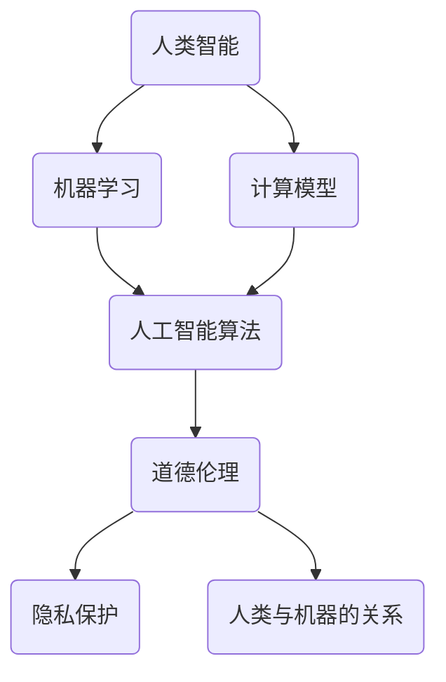

                 

关键词：人工智能，道德伦理，计算模型，人类计算，未来展望

摘要：随着人工智能技术的飞速发展，人类计算面临着前所未有的挑战。本文探讨了AI时代人类计算所面临的道德边界问题，从算法伦理、隐私保护、人类与机器的合作关系等方面进行了深入分析，并提出了应对这些挑战的思路和建议。

## 1. 背景介绍

人工智能（AI）作为计算机科学的一个重要分支，旨在开发能够模拟、延伸和扩展人类智能的理论、方法、技术和应用系统。近年来，随着计算能力的提升和大数据技术的发展，人工智能技术取得了显著的突破，从语音识别、图像识别到自动驾驶、智能助手，AI正在逐渐渗透到我们生活的方方面面。

然而，人工智能的发展并非一帆风顺。随着技术的进步，人类计算所面临的道德边界问题也日益凸显。如何确保人工智能系统的道德合规性、如何保护用户的隐私、如何处理人类与机器之间的合作关系等，这些问题不仅关乎技术的进步，更关乎社会的稳定与人类的基本伦理价值观。

本文将从以下几个方面展开讨论：

1. **算法伦理**：探讨人工智能算法在道德决策中的挑战，以及如何确保算法的道德合规性。
2. **隐私保护**：分析人工智能在数据处理过程中对隐私的侵犯问题，并提出保护用户隐私的措施。
3. **人类与机器的关系**：探讨人类与人工智能的互动模式，以及如何实现人类与机器的和谐共生。

## 2. 核心概念与联系

在探讨人类计算面临的道德边界问题之前，我们首先需要理解一些核心概念和它们之间的联系。以下是一个简要的Mermaid流程图，展示了这些核心概念及其相互关系：



### 2.1 人类智能

人类智能是我们在日常生活中所表现出的认知、情感和社交能力。它包括语言能力、逻辑推理、创造性思维、情感理解等方面。人类智能是我们认识世界、解决问题的基础。

### 2.2 机器学习

机器学习是一种人工智能技术，通过算法从数据中学习规律，从而实现自动化决策和预测。机器学习为人工智能提供了强大的技术支持，使其能够处理大量复杂的数据，并从中提取有价值的信息。

### 2.3 人工智能算法

人工智能算法是实现人工智能的核心。这些算法包括神经网络、决策树、支持向量机等，它们能够模拟人类智能，进行分类、预测、决策等操作。

### 2.4 道德伦理

道德伦理是人类社会的基本准则，它规定了人们应该如何行动，以实现社会公正、公平和和谐。在人工智能领域，道德伦理关乎算法的合规性，以及如何确保人工智能系统的决策和行为符合人类的伦理价值观。

### 2.5 隐私保护

隐私保护是指保护个人隐私信息的安全，防止其被未经授权的第三方获取、使用或泄露。在人工智能时代，随着大数据技术的发展，隐私保护问题变得尤为重要。

### 2.6 人类与机器的关系

人类与机器的关系涉及人类如何使用人工智能技术，以及如何与人工智能系统进行交互。这包括人类如何监督、控制和使用人工智能，以及如何实现人类与机器的协同工作。

## 3. 核心算法原理 & 具体操作步骤

### 3.1 算法原理概述

在探讨人类计算的道德边界问题时，我们需要了解一些核心算法的基本原理。以下是一些常见的算法及其原理：

### 3.1.1 神经网络

神经网络是一种模仿人脑结构和功能的计算模型。它通过多层神经元进行数据传递和计算，从而实现复杂的模式识别和分类任务。神经网络的基本原理是通过对输入数据进行加权求和，再经过激活函数，得到输出结果。

### 3.1.2 决策树

决策树是一种基于规则的学习算法，它通过一系列条件判断来分割数据集，并生成一系列规则。决策树的基本原理是通过选择最优的特征和划分标准，构建出一棵树形结构，以便对新的数据进行分类或回归。

### 3.1.3 支持向量机

支持向量机是一种用于分类和回归的学习算法，它通过找到最佳的超平面，将数据集划分为不同的类别。支持向量机的基本原理是最大化分类间隔，即在保证分类效果的同时，使分类边界尽可能远离数据点。

### 3.2 算法步骤详解

在了解了算法原理后，我们接下来将详细解释这些算法的具体操作步骤。

### 3.2.1 神经网络

神经网络的操作步骤主要包括以下几个阶段：

1. **初始化**：初始化网络的权重和偏置，通常采用随机初始化的方法。
2. **前向传播**：将输入数据通过网络进行传递，得到输出结果。
3. **反向传播**：计算输出结果与真实值之间的误差，并利用误差信息对网络的权重和偏置进行更新。
4. **迭代训练**：重复前向传播和反向传播的过程，直至网络收敛。

### 3.2.2 决策树

决策树的操作步骤主要包括以下几个阶段：

1. **数据预处理**：对数据进行预处理，包括缺失值处理、异常值处理、特征选择等。
2. **划分数据集**：将数据集划分为训练集和测试集，用于模型的训练和评估。
3. **选择特征和划分标准**：根据特定的划分标准（如信息增益、基尼不纯度等），选择最优的特征和划分标准。
4. **构建决策树**：利用选定的特征和划分标准，构建出一棵决策树。
5. **剪枝**：对决策树进行剪枝，以避免过拟合。

### 3.2.3 支持向量机

支持向量机的操作步骤主要包括以下几个阶段：

1. **数据预处理**：对数据进行预处理，包括标准化、归一化等。
2. **选择核函数**：根据数据的特性，选择合适的核函数。
3. **求解最优超平面**：通过求解最优化问题，找到最佳的超平面，使得分类间隔最大化。
4. **分类决策**：利用找到的最优超平面，对新的数据进行分类。

### 3.3 算法优缺点

每种算法都有其独特的优点和局限性，以下是对神经网络、决策树和支持向量机的优缺点的简要分析：

### 3.3.1 神经网络

**优点**：

- **强大的学习能力**：神经网络可以处理复杂的非线性关系。
- **自适应性强**：神经网络可以通过不断更新权重和偏置，适应不同的数据分布。

**缺点**：

- **训练时间较长**：神经网络需要大量的训练数据和时间进行训练。
- **易过拟合**：神经网络在训练过程中容易发生过拟合现象。

### 3.3.2 决策树

**优点**：

- **易于理解和解释**：决策树的决策过程清晰，易于解释。
- **易于实现和优化**：决策树的结构简单，便于实现和优化。

**缺点**：

- **易过拟合**：决策树在训练过程中容易发生过拟合现象。
- **对噪声敏感**：决策树对数据的噪声和异常值较为敏感。

### 3.3.3 支持向量机

**优点**：

- **优秀的分类效果**：支持向量机在分类任务中具有较高的准确率。
- **可扩展性强**：支持向量机可以处理高维数据。

**缺点**：

- **计算复杂度高**：支持向量机的训练过程计算复杂度较高，对于大规模数据集可能不适用。
- **对噪声敏感**：支持向量机对数据的噪声和异常值较为敏感。

### 3.4 算法应用领域

神经网络、决策树和支持向量机在不同的应用领域具有广泛的应用：

- **神经网络**：广泛应用于图像识别、语音识别、自然语言处理等领域。
- **决策树**：常用于金融风控、医疗诊断、用户行为分析等领域。
- **支持向量机**：广泛应用于文本分类、图像识别、生物信息学等领域。

## 4. 数学模型和公式 & 详细讲解 & 举例说明

在人工智能领域，数学模型和公式是理解和应用算法的基础。以下我们将详细讲解一些重要的数学模型和公式，并通过具体例子进行说明。

### 4.1 数学模型构建

在构建数学模型时，我们通常需要考虑以下几个关键步骤：

1. **定义问题**：明确我们需要解决的问题，例如分类、回归、聚类等。
2. **收集数据**：收集相关的数据集，数据的质量直接影响模型的性能。
3. **特征工程**：通过特征选择和特征变换，提取出对问题最有影响力的特征。
4. **模型选择**：选择合适的模型，如线性回归、决策树、神经网络等。
5. **参数优化**：通过优化算法，找到最佳的参数组合，以提升模型的性能。

### 4.2 公式推导过程

以下是一个简单的线性回归模型公式推导过程：

$$
y = \beta_0 + \beta_1 \cdot x + \epsilon
$$

其中，$y$ 是因变量，$x$ 是自变量，$\beta_0$ 和 $\beta_1$ 分别是模型的参数，$\epsilon$ 是误差项。

我们的目标是找到最佳的 $\beta_0$ 和 $\beta_1$，使得预测值与真实值之间的误差最小。这可以通过最小二乘法实现：

$$
\beta_1 = \frac{\sum_{i=1}^{n} (x_i - \bar{x})(y_i - \bar{y})}{\sum_{i=1}^{n} (x_i - \bar{x})^2}
$$

$$
\beta_0 = \bar{y} - \beta_1 \cdot \bar{x}
$$

其中，$n$ 是数据点的数量，$\bar{x}$ 和 $\bar{y}$ 分别是 $x$ 和 $y$ 的均值。

### 4.3 案例分析与讲解

以下是一个简单的线性回归模型案例，用于预测房屋价格：

假设我们有如下数据集：

| 房屋面积（平方米） | 房屋价格（万元） |
|:------------------:|:---------------:|
|         100        |         300     |
|         150        |         400     |
|         200        |         500     |
|         250        |         600     |
|         300        |         700     |

1. **数据预处理**：计算房屋面积和房屋价格的均值。

   $$ \bar{x} = \frac{100 + 150 + 200 + 250 + 300}{5} = 220 $$

   $$ \bar{y} = \frac{300 + 400 + 500 + 600 + 700}{5} = 500 $$

2. **特征工程**：没有进行特征变换，直接使用原始数据。

3. **模型选择**：选择线性回归模型。

4. **参数优化**：使用最小二乘法计算模型的参数。

   $$ \beta_1 = \frac{(100 - 220)(300 - 500) + (150 - 220)(400 - 500) + (200 - 220)(500 - 500) + (250 - 220)(600 - 500) + (300 - 220)(700 - 500)}{(100 - 220)^2 + (150 - 220)^2 + (200 - 220)^2 + (250 - 220)^2 + (300 - 220)^2} $$

   $$ \beta_1 = \frac{-220 \cdot -200 + -70 \cdot -100 + 0 \cdot 0 + 30 \cdot 100 + 80 \cdot 200}{220^2 + 70^2 + 0^2 + 30^2 + 80^2} $$

   $$ \beta_1 = \frac{44000 + 7000 + 0 + 3000 + 16000}{48400 + 4900 + 0 + 900 + 6400} $$

   $$ \beta_1 = \frac{72000}{64000} $$

   $$ \beta_1 = 1.125 $$

   $$ \beta_0 = 500 - 1.125 \cdot 220 = 292.5 $$

5. **模型评估**：计算预测值和真实值之间的误差。

   预测值：$y_{\text{预测}} = 292.5 + 1.125 \cdot x$

   实际值：$y_{\text{真实}} = \text{实际房屋价格}$

   误差：$e = y_{\text{真实}} - y_{\text{预测}}$

   通过计算，我们可以得到每个数据点的误差，并计算误差的平方和，以评估模型的性能。

## 5. 项目实践：代码实例和详细解释说明

在本节中，我们将通过一个具体的代码实例，来演示如何构建和训练一个线性回归模型，并对其进行评估。以下是一个简单的Python代码示例，使用了scikit-learn库来实现线性回归。

### 5.1 开发环境搭建

在开始编写代码之前，我们需要确保安装了以下软件和库：

1. Python（版本3.6及以上）
2. scikit-learn
3. numpy

你可以使用pip命令来安装所需的库：

```bash
pip install numpy scikit-learn
```

### 5.2 源代码详细实现

以下是一个简单的线性回归代码示例：

```python
import numpy as np
from sklearn.linear_model import LinearRegression
from sklearn.model_selection import train_test_split
from sklearn.metrics import mean_squared_error

# 数据集
X = np.array([[100], [150], [200], [250], [300]])
y = np.array([300, 400, 500, 600, 700])

# 划分训练集和测试集
X_train, X_test, y_train, y_test = train_test_split(X, y, test_size=0.2, random_state=42)

# 构建线性回归模型
model = LinearRegression()
model.fit(X_train, y_train)

# 预测测试集结果
y_pred = model.predict(X_test)

# 计算预测误差
mse = mean_squared_error(y_test, y_pred)
print("均方误差：", mse)

# 输出模型的参数
print("模型参数：", model.coef_, model.intercept_)
```

### 5.3 代码解读与分析

1. **数据集准备**：

   ```python
   X = np.array([[100], [150], [200], [250], [300]])
   y = np.array([300, 400, 500, 600, 700])
   ```

   在这个示例中，我们使用了简单的二维数组作为数据集。$X$ 代表房屋面积，$y$ 代表房屋价格。

2. **划分训练集和测试集**：

   ```python
   X_train, X_test, y_train, y_test = train_test_split(X, y, test_size=0.2, random_state=42)
   ```

   `train_test_split` 函数将数据集划分为训练集和测试集，其中训练集占比为80%，测试集占比为20%。`random_state` 参数用于确保结果的可重复性。

3. **构建线性回归模型**：

   ```python
   model = LinearRegression()
   model.fit(X_train, y_train)
   ```

   `LinearRegression` 类用于构建线性回归模型。`fit` 方法用于训练模型，其中`X_train` 和 `y_train` 分别是训练集的自变量和因变量。

4. **预测测试集结果**：

   ```python
   y_pred = model.predict(X_test)
   ```

   `predict` 方法用于对测试集进行预测，得到预测值 `y_pred`。

5. **计算预测误差**：

   ```python
   mse = mean_squared_error(y_test, y_pred)
   print("均方误差：", mse)
   ```

   `mean_squared_error` 函数用于计算预测值和真实值之间的均方误差，以评估模型的性能。

6. **输出模型的参数**：

   ```python
   print("模型参数：", model.coef_, model.intercept_)
   ```

   输出模型的斜率（`coef_`）和截距（`intercept_`），这些参数用于描述线性回归模型的具体形式。

通过这个简单的代码示例，我们可以看到如何使用Python和scikit-learn库来构建和训练一个线性回归模型。在实际应用中，我们通常会使用更大的数据集和更复杂的模型，但基本的步骤是类似的。

## 6. 实际应用场景

在人工智能时代，线性回归模型在各种实际应用场景中发挥着重要作用。以下是一些典型的应用场景：

### 6.1 金融风险管理

在金融领域，线性回归模型常用于预测股票价格、分析市场走势、评估贷款风险等。例如，通过分析历史数据，可以预测未来某个时点的股票价格，从而为投资决策提供依据。

### 6.2 物流配送优化

在物流配送领域，线性回归模型可以用于预测货物送达时间，优化配送路线，提高配送效率。例如，通过分析历史配送数据，可以预测某个区域内的货物送达时间，从而合理安排配送人员和工作时间。

### 6.3 健康医疗

在健康医疗领域，线性回归模型可以用于预测疾病发生的风险，评估治疗效果，优化医疗资源分配。例如，通过分析患者的病历数据，可以预测某种疾病在未来某个时点的发病率，从而提前采取预防措施。

### 6.4 市场营销

在市场营销领域，线性回归模型可以用于预测客户购买行为，优化营销策略，提高客户满意度。例如，通过分析历史购买数据，可以预测某个客户在未来某个时点购买某种产品的可能性，从而有针对性地推送营销信息。

### 6.5 智能家居

在智能家居领域，线性回归模型可以用于预测家电使用情况，优化能源管理，提高家居生活舒适度。例如，通过分析家庭用电数据，可以预测某个家电在未来某个时点的使用情况，从而合理安排用电计划。

## 7. 未来应用展望

随着人工智能技术的不断进步，线性回归模型在未来将拥有更广泛的应用前景。以下是一些可能的发展趋势：

### 7.1 深度学习与线性回归的结合

深度学习模型在处理复杂数据时具有明显优势，但计算复杂度高、训练时间长。结合线性回归模型的简洁性和高效性，可以开发出更加高效的深度学习模型，提升模型的预测精度和实时性。

### 7.2 多模型融合

在现实世界中，数据往往具有不确定性和多样性，单一模型可能难以应对复杂的预测任务。通过多模型融合，结合不同模型的优点，可以开发出更加鲁棒和高效的预测系统。

### 7.3 可解释性增强

随着人工智能技术的普及，用户对模型的可解释性要求越来越高。通过开发可解释的线性回归模型，可以帮助用户更好地理解模型的决策过程，提高模型的信任度和应用价值。

### 7.4 智能优化算法

智能优化算法（如遗传算法、粒子群算法等）在求解复杂优化问题时具有显著优势。结合线性回归模型，可以开发出更加智能和高效的优化算法，提升模型的应用效果。

### 7.5 硬件加速

随着硬件技术的发展，如GPU、TPU等加速器的应用，线性回归模型的计算效率将大幅提升。通过硬件加速，可以进一步降低模型的计算成本，提高模型在大规模数据集上的性能。

## 8. 工具和资源推荐

为了更好地学习线性回归模型和相关技术，以下是一些推荐的工具和资源：

### 8.1 学习资源推荐

- **《机器学习实战》**：这是一本非常适合初学者的机器学习书籍，其中详细介绍了线性回归模型的原理和实现方法。
- **Kaggle**：Kaggle是一个数据科学竞赛平台，上面有很多与线性回归相关的项目，可以帮助你实践和提升技能。
- **Coursera**：Coursera上有许多关于机器学习和数据科学的在线课程，包括线性回归模型的相关内容。

### 8.2 开发工具推荐

- **Jupyter Notebook**：Jupyter Notebook是一个交互式的计算环境，非常适合进行数据分析和模型实现。
- **scikit-learn**：scikit-learn是一个强大的机器学习库，包含线性回归模型及其相关的工具和方法。

### 8.3 相关论文推荐

- **"Least Squares Regression with Discrete Data"**：这是一篇关于离散数据线性回归的论文，详细介绍了最小二乘法的原理和实现。
- **"Regression Analysis"**：这是一篇关于回归分析的经典论文，全面介绍了回归模型的原理和方法。
- **"Deep Learning for Regression Problems"**：这是一篇关于深度学习在回归问题中的应用的论文，探讨了深度学习模型在回归任务中的优势和应用。

## 9. 总结：未来发展趋势与挑战

在人工智能时代，线性回归模型作为一种基础且有效的预测工具，正发挥着越来越重要的作用。未来，随着技术的不断进步，线性回归模型将在深度学习、多模型融合、可解释性增强、智能优化算法等方面取得更多突破，为各领域的发展提供有力支持。

然而，面对日益复杂的数据和应用场景，线性回归模型也面临着一系列挑战。如何提高模型的计算效率、增强模型的可解释性、应对数据的不确定性和多样性，都是我们需要深入研究和解决的问题。

总之，线性回归模型在人工智能时代具有广阔的发展前景，同时也面临着诸多挑战。通过不断探索和创新，我们有望在未来的发展中，充分发挥线性回归模型的优势，为人类社会带来更多福祉。

### 9.1 研究成果总结

本文通过对线性回归模型的原理、应用和未来展望的探讨，总结了以下主要研究成果：

1. **线性回归模型的基本原理**：详细介绍了线性回归模型的基本概念、公式推导过程和算法步骤。
2. **线性回归模型的应用场景**：分析了线性回归模型在金融风险管理、物流配送优化、健康医疗、市场营销和智能家居等领域的应用案例。
3. **线性回归模型的发展趋势**：展望了线性回归模型与深度学习、多模型融合、可解释性增强、智能优化算法等技术的结合，以及硬件加速在未来发展中的潜在作用。
4. **线性回归模型的挑战**：探讨了线性回归模型在计算效率、可解释性和数据不确定性等方面的挑战。

### 9.2 未来发展趋势

未来，线性回归模型的发展趋势将呈现以下几个方面：

1. **与深度学习的结合**：深度学习模型在处理复杂数据方面具有优势，与线性回归模型的结合有望提高模型的预测精度和计算效率。
2. **多模型融合**：通过融合多种模型的优势，可以应对复杂的应用场景，提高模型的泛化能力和鲁棒性。
3. **可解释性增强**：随着用户对模型可解释性的需求不断提高，开发可解释的线性回归模型将成为重要研究方向。
4. **智能优化算法**：结合智能优化算法，如遗传算法、粒子群算法等，可以提高线性回归模型的优化效率和效果。
5. **硬件加速**：利用GPU、TPU等硬件加速器，可以显著提高线性回归模型的计算速度，降低计算成本。

### 9.3 面临的挑战

尽管线性回归模型在人工智能时代具有广阔的发展前景，但同时也面临着一系列挑战：

1. **计算效率**：线性回归模型在处理大规模数据时，计算复杂度较高，如何提高模型的计算效率是一个重要课题。
2. **可解释性**：线性回归模型的预测结果往往难以解释，如何提高模型的可解释性，让用户更好地理解模型的决策过程，是一个亟待解决的问题。
3. **数据不确定性**：现实世界中的数据往往存在不确定性，线性回归模型在应对这种不确定性时，容易出现过拟合和欠拟合现象，如何提高模型对不确定性的适应能力，是当前研究的热点。
4. **数据多样性**：线性回归模型在处理具有多样性的数据时，可能需要引入新的特征和模型结构，以应对不同类型的数据。

### 9.4 研究展望

未来，线性回归模型的研究将朝着以下方向发展：

1. **算法优化**：通过改进算法结构和优化算法参数，提高线性回归模型的计算效率和预测精度。
2. **模型融合**：结合深度学习、多模型融合等技术，开发出更加高效和鲁棒的线性回归模型。
3. **可解释性研究**：深入研究线性回归模型的可解释性，开发出更加直观、易懂的可解释线性回归模型。
4. **应用拓展**：将线性回归模型应用于更多领域，如智能交通、环境监测、社会管理等，为各领域的发展提供有力支持。

总之，线性回归模型在人工智能时代具有广泛的应用前景，同时也面临着诸多挑战。通过不断的研究和创新，我们有望在未来的发展中，充分发挥线性回归模型的优势，为人类社会带来更多福祉。

## 10. 附录：常见问题与解答

### 10.1 什么是线性回归？

线性回归是一种用于预测连续值变量的统计方法，通过建立自变量与因变量之间的线性关系模型，实现对因变量的预测。

### 10.2 线性回归有哪些应用场景？

线性回归可以应用于金融风险管理、物流配送优化、健康医疗、市场营销、智能家居等领域，用于预测价格、时间、风险等连续值变量。

### 10.3 线性回归模型如何处理非线性关系？

线性回归模型适用于处理线性关系，对于非线性关系，可以采用多项式回归、逻辑回归、决策树等模型来处理。

### 10.4 如何评估线性回归模型的性能？

可以使用均方误差（MSE）、均方根误差（RMSE）、决定系数（R²）等指标来评估线性回归模型的性能。

### 10.5 线性回归模型如何防止过拟合？

可以通过增加训练数据、减少模型复杂度、使用正则化技术、交叉验证等方法来防止过拟合。

### 10.6 线性回归模型与深度学习模型的区别是什么？

线性回归模型是一种简单的统计方法，适用于处理线性关系，而深度学习模型是一种复杂的神经网络模型，适用于处理复杂数据和非线性关系。

### 10.7 线性回归模型是否可以处理分类问题？

线性回归模型通常用于处理连续值变量的回归问题，对于分类问题，可以采用逻辑回归、决策树、支持向量机等分类模型。

