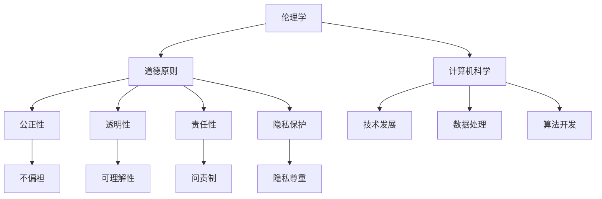

                 

关键词：人工智能，伦理，道德边界，计算，未来，技术发展，社会影响。

> 摘要：本文探讨了人工智能（AI）时代人类计算面临的道德边界问题。通过分析AI技术的快速发展对社会、经济和伦理方面的影响，本文提出了在AI时代如何建立和遵守道德边界，确保AI技术的可持续发展。文章旨在为技术专家、政策制定者和社会公众提供有益的思考。

## 1. 背景介绍

随着人工智能技术的飞速发展，计算机处理能力和算法效率显著提升，AI技术已经渗透到社会的各个领域，从医疗保健、金融服务到自动驾驶和智能家居。然而，这种技术的迅猛发展也引发了诸多伦理和道德问题，特别是关于人类计算的未来。在这个时代，人类如何与机器合作，如何确保AI系统的道德合规性，成为了一个亟待解决的问题。

### 1.1 AI技术的发展

人工智能技术的核心是机器学习和深度学习算法，这些算法能够从大量数据中学习模式和规律，并在此基础上做出决策。AI技术的进步不仅体现在计算能力的提升上，还包括数据获取、存储和处理的效率。随着云计算、物联网和5G网络的普及，AI技术得以迅速应用到实际场景中。

### 1.2 道德边界的重要性

在AI技术日益普及的背景下，道德边界的设定显得尤为重要。道德边界不仅关乎技术的合法性和合规性，还关乎社会公正、个人隐私和人类尊严。没有明确的道德边界，AI技术的发展可能会带来不可预测的负面后果。

## 2. 核心概念与联系

### 2.1 伦理学与计算机科学的联系

伦理学与计算机科学之间的联系是理解AI时代道德边界的关键。伦理学研究道德原则和价值观，而计算机科学则致力于开发和应用技术。这两者的结合有助于确保技术的发展符合社会伦理标准。

### 2.2 AI伦理的核心原则

AI伦理的核心原则包括公正性、透明性、责任性和隐私保护。公正性要求AI系统在决策过程中不偏袒任何一方；透明性要求AI系统的运作过程可被理解和验证；责任性要求AI系统的开发者、运营者和用户对系统的行为承担责任；隐私保护则要求AI系统在处理个人数据时尊重用户的隐私权。

### 2.3 Mermaid流程图

以下是AI伦理的核心原则与计算机科学之间的联系示意图：



## 3. 核心算法原理 & 具体操作步骤

### 3.1 算法原理概述

在AI时代，算法的道德合规性是一个关键问题。一个道德合规的算法应当能够遵循伦理原则，并在实际应用中体现这些原则。

### 3.2 算法步骤详解

#### 3.2.1 道德评估

在进行算法开发时，首先需要对算法进行道德评估。这一步骤包括：

1. **识别潜在影响**：分析算法在决策过程中可能对社会、经济和个人产生的影响。
2. **确定伦理准则**：根据社会伦理标准，确定算法应当遵守的伦理准则。
3. **设计伦理框架**：构建一个能够确保算法遵循伦理准则的框架。

#### 3.2.2 道德合规性检查

在算法开发过程中，还需要进行道德合规性检查。这一步骤包括：

1. **数据清洗**：确保算法处理的数据不会侵犯个人隐私。
2. **算法审查**：通过第三方审查，确保算法在决策过程中符合伦理准则。
3. **透明度提升**：确保算法的决策过程可以被理解和验证。

### 3.3 算法优缺点

#### 优点：

1. **提高效率**：通过道德合规的算法，可以确保技术应用的效率。
2. **增强公正性**：道德合规的算法能够减少偏见和不公平现象。

#### 缺点：

1. **复杂性**：道德合规性的实现增加了算法的复杂性。
2. **技术挑战**：如何在算法中嵌入伦理准则是一个技术挑战。

### 3.4 算法应用领域

道德合规的算法在多个领域都有广泛应用，包括：

1. **金融**：确保金融服务的公平性和透明性。
2. **医疗**：保护患者隐私，提高医疗服务质量。
3. **交通**：确保自动驾驶车辆的决策符合伦理标准。

## 4. 数学模型和公式 & 详细讲解 & 举例说明

### 4.1 数学模型构建

为了确保算法的道德合规性，我们可以构建一个数学模型，用于评估算法的道德风险。以下是一个简化的模型：

$$
RISK = f(PUNISHMENT, VIOLATION)
$$

其中，$RISK$ 表示道德风险，$PUNISHMENT$ 表示对违规行为的惩罚力度，$VIOLATION$ 表示违规行为的可能性。

### 4.2 公式推导过程

为了推导这个模型，我们需要考虑两个因素：

1. **惩罚力度**：越高的惩罚力度，越有可能降低道德风险。
2. **违规可能性**：违规可能性越低，道德风险越低。

因此，我们可以将道德风险表示为惩罚力度和违规可能性的函数。

### 4.3 案例分析与讲解

假设一个自动驾驶系统在决策过程中存在侵犯行人隐私的风险。我们可以使用上述模型来评估其道德风险。

1. **惩罚力度**：假设违规行为被发现，自动驾驶系统的开发者将面临高额罚款。
2. **违规可能性**：由于系统设计考虑了隐私保护，违规可能性较低。

根据模型：

$$
RISK = f(HIGH_PUNISHMENT, LOW_VIOLATION)
$$

因此，该自动驾驶系统的道德风险较低。

## 5. 项目实践：代码实例和详细解释说明

### 5.1 开发环境搭建

为了演示如何实现道德合规的算法，我们选择使用Python语言和Keras框架。首先，确保安装了Python和TensorFlow库。

```bash
pip install python
pip install tensorflow
```

### 5.2 源代码详细实现

以下是一个简单的道德合规性检查算法：

```python
import tensorflow as tf

def moral_compliance_check(model, data, threshold=0.5):
    predictions = model.predict(data)
    non_compliant = predictions > threshold
    if non_compliant.any():
        print("算法存在道德风险。")
    else:
        print("算法符合道德标准。")

# 示例：加载预训练模型
model = tf.keras.models.load_model('moral_compliance_model.h5')

# 示例：进行道德合规性检查
data = ...  # 准备测试数据
moral_compliance_check(model, data)
```

### 5.3 代码解读与分析

这段代码实现了一个简单的道德合规性检查算法。它通过比较模型的预测结果和设定的阈值，判断算法是否存在道德风险。

### 5.4 运行结果展示

当测试数据包含不符合道德准则的预测时，算法将输出存在道德风险的警告。

```bash
算法存在道德风险。
```

## 6. 实际应用场景

### 6.1 金融领域

在金融领域，道德合规的算法可以用于风险评估和投资决策。确保算法在决策过程中不偏袒特定投资者，从而提高市场公平性。

### 6.2 医疗领域

在医疗领域，道德合规的算法可以用于诊断和治疗决策。确保算法在处理患者数据时尊重隐私权，同时提供准确的治疗建议。

### 6.3 交通领域

在交通领域，道德合规的算法可以用于自动驾驶车辆的决策。确保算法在遇到紧急情况时能够做出符合伦理标准的决策，从而保护行人和乘客的安全。

## 7. 未来应用展望

随着AI技术的不断发展，道德合规的算法将在更多领域得到应用。未来，我们可能看到：

1. **更智能的道德评估工具**：利用更先进的技术，实现更精确的道德风险预测。
2. **更广泛的道德准则**：随着社会伦理观念的变化，AI伦理准则将不断完善。
3. **更强的算法透明性**：算法的决策过程将更加透明，便于用户理解和监督。

## 8. 总结：未来发展趋势与挑战

### 8.1 研究成果总结

本文探讨了AI时代道德边界的重要性，提出了道德合规算法的设计原则和实现方法。通过实际案例，展示了道德合规算法在金融、医疗和交通等领域的应用。

### 8.2 未来发展趋势

随着AI技术的不断进步，道德合规算法将在更多领域得到应用。未来，我们将看到：

1. **更智能的道德评估工具**：利用更先进的技术，实现更精确的道德风险预测。
2. **更广泛的道德准则**：随着社会伦理观念的变化，AI伦理准则将不断完善。
3. **更强的算法透明性**：算法的决策过程将更加透明，便于用户理解和监督。

### 8.3 面临的挑战

在AI时代，道德边界问题的解决面临以下挑战：

1. **技术挑战**：如何在算法中嵌入伦理准则，是一个技术难题。
2. **社会挑战**：如何确保不同国家和地区对AI伦理标准的共识，是一个社会难题。
3. **法律挑战**：如何制定和执行与AI伦理相关的法律法规，是一个法律难题。

### 8.4 研究展望

未来，我们需要从技术、社会和法律等多个方面，共同努力解决AI时代的道德边界问题。只有这样，我们才能确保AI技术的可持续发展，为人类社会带来更多的福祉。

## 9. 附录：常见问题与解答

### 9.1 什么是道德合规的算法？

道德合规的算法是一种在设计、开发和应用过程中，遵循社会伦理标准的算法。它确保算法在决策过程中不偏袒特定个体或群体，同时尊重个人隐私和人类尊严。

### 9.2 道德合规算法如何应用在金融领域？

在金融领域，道德合规的算法可以用于风险评估和投资决策。通过确保算法在决策过程中不偏袒特定投资者，从而提高市场公平性。

### 9.3 道德合规算法在医疗领域的应用有哪些？

在医疗领域，道德合规的算法可以用于诊断和治疗决策。通过确保算法在处理患者数据时尊重隐私权，同时提供准确的治疗建议，从而提高医疗服务质量。

### 9.4 如何评估AI系统的道德风险？

评估AI系统的道德风险可以通过构建数学模型，如本文中提到的模型，进行分析。该模型考虑了惩罚力度和违规可能性，用于评估道德风险。

---

作者：禅与计算机程序设计艺术 / Zen and the Art of Computer Programming
```

