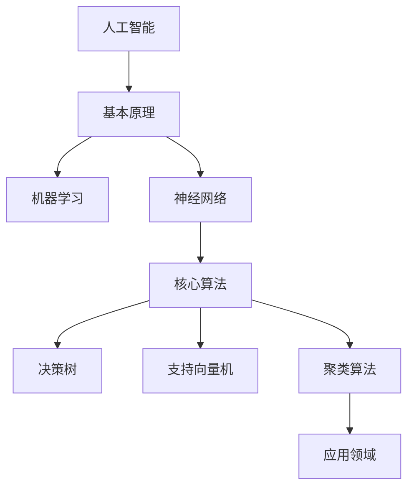
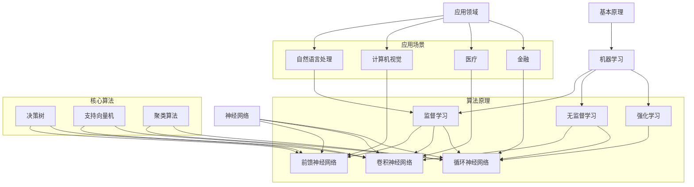
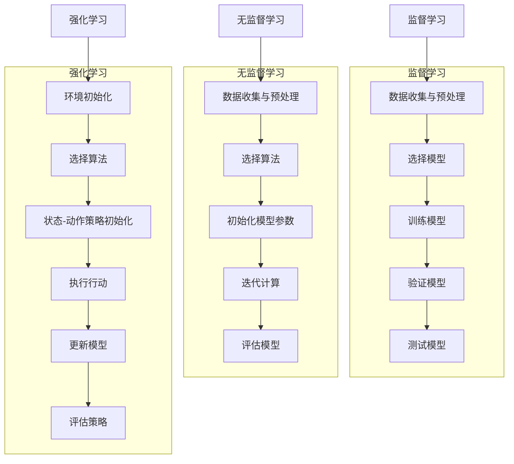

                 

关键词：人工智能、道德伦理、计算、人类、未来发展趋势

摘要：本文将探讨人工智能时代下人类计算所面临的道德和伦理问题。通过分析当前人工智能的发展状况，我们深入探讨了这些问题的来源、影响及解决方法。文章旨在提醒人们关注这些关键问题，并探讨可能的解决方案，为人工智能时代的未来发展提供有益的思考和借鉴。

## 1. 背景介绍

随着人工智能技术的快速发展，人工智能（AI）已经成为现代科技领域的热点。从早期的机器学习到深度学习，再到近年来如火如荼的生成对抗网络（GAN）和强化学习，人工智能技术正以前所未有的速度不断进步。这种快速发展的背后，是人类对计算能力的无限追求和对未知世界的好奇心。然而，随着人工智能技术的应用越来越广泛，其引发的道德和伦理问题也逐渐显现出来。

在人工智能时代，人类计算面临着前所未有的挑战。一方面，人工智能技术的发展使得计算能力得到了极大的提升，许多曾经看似不可能的任务变得可行。另一方面，人工智能技术的广泛应用也带来了许多新的问题和挑战，如隐私保护、算法偏见、安全风险等。这些问题不仅关系到人工智能技术的发展，更关系到人类的未来和社会的稳定。

本文将从以下几个方面对人工智能时代的人类计算道德和伦理问题进行探讨：

1. 核心概念与联系：首先，我们将介绍人工智能时代下的核心概念和联系，包括人工智能的基本原理、算法原理及其应用领域。
2. 核心算法原理 & 具体操作步骤：接着，我们将详细讲解人工智能的核心算法原理和具体操作步骤，以及这些算法的优点和缺点。
3. 数学模型和公式 & 详细讲解 & 举例说明：然后，我们将介绍人工智能中的数学模型和公式，并对其进行详细讲解和举例说明。
4. 项目实践：我们将通过代码实例来展示人工智能在实际项目中的应用，并对代码进行详细解释和分析。
5. 实际应用场景：接下来，我们将探讨人工智能在不同领域的实际应用场景，以及未来应用的前景。
6. 工具和资源推荐：我们将推荐一些学习和开发工具以及相关论文，以帮助读者更好地理解和应用人工智能技术。
7. 总结：最后，我们将对研究成果进行总结，探讨人工智能时代的未来发展趋势和面临的挑战，并提出研究展望。

通过本文的探讨，我们希望读者能够更加深入地了解人工智能时代的人类计算道德和伦理问题，从而为人工智能技术的健康发展和社会进步做出贡献。

## 2. 核心概念与联系

在探讨人工智能时代的道德和伦理问题之前，我们需要先了解一些核心概念和它们之间的联系。这些概念包括人工智能的基本原理、核心算法原理及其应用领域。通过这些概念的理解，我们将更好地把握人工智能的发展脉络，从而为后续的道德和伦理问题分析奠定基础。

### 2.1 人工智能的基本原理

人工智能（Artificial Intelligence，简称AI）是计算机科学的一个分支，旨在使计算机模拟人类的智能行为。人工智能的基本原理主要包括以下几个方面：

#### 2.1.1 机器学习

机器学习（Machine Learning）是人工智能的核心技术之一。它通过算法让计算机从数据中自动学习，从而实现智能行为。机器学习可以分为监督学习、无监督学习和强化学习三种类型。

- **监督学习**：监督学习是一种从标记数据中学习的方法。通过训练模型来预测新的未标记数据。常见的监督学习算法包括线性回归、逻辑回归、支持向量机（SVM）等。

- **无监督学习**：无监督学习不需要标记数据，而是从未标记的数据中发现隐藏的结构。常见的无监督学习算法包括聚类、主成分分析（PCA）等。

- **强化学习**：强化学习是一种通过奖励和惩罚来训练模型的方法。通过与环境的交互，模型不断优化其行为，以达到最佳效果。常见的强化学习算法包括Q学习、深度强化学习（DRL）等。

#### 2.1.2 神经网络

神经网络（Neural Networks）是模仿人脑结构和功能的一种计算模型。它由大量的神经元（节点）组成，通过调整神经元之间的连接权重来学习数据。神经网络可以分为前馈神经网络、卷积神经网络（CNN）、循环神经网络（RNN）等。

- **前馈神经网络**：前馈神经网络是最简单的一种神经网络结构，数据从输入层经过多个隐藏层，最终到达输出层。

- **卷积神经网络**：卷积神经网络主要用于图像处理任务，通过卷积操作提取图像特征。

- **循环神经网络**：循环神经网络适用于处理序列数据，如自然语言处理和时间序列预测等。

### 2.2 核心算法原理

在了解人工智能的基本原理后，我们接下来将介绍一些核心算法原理，包括决策树、支持向量机、聚类算法等。

#### 2.2.1 决策树

决策树（Decision Tree）是一种常用的分类和回归算法。它通过一系列的决策规则对数据进行划分，从而实现分类或回归任务。决策树的关键在于找到最优的划分策略，通常使用信息增益、基尼系数等指标来衡量。

#### 2.2.2 支持向量机

支持向量机（Support Vector Machine，SVM）是一种二分类模型，通过找到最佳的超平面将不同类别的数据分隔开来。SVM的核心在于寻找最大间隔的超平面，这可以通过求解二次规划问题来实现。

#### 2.2.3 聚类算法

聚类算法（Clustering Algorithms）用于将数据分为多个群组，使同组数据之间的相似度较高，不同组数据之间的相似度较低。常见的聚类算法包括K均值聚类、层次聚类、DBSCAN等。

### 2.3 应用领域

人工智能技术已经广泛应用于各个领域，包括但不限于自然语言处理、计算机视觉、医疗、金融等。以下是一些典型应用领域的例子：

#### 2.3.1 自然语言处理

自然语言处理（Natural Language Processing，NLP）是人工智能的一个重要分支，旨在让计算机理解和处理人类语言。NLP的应用包括机器翻译、情感分析、文本分类、语音识别等。

#### 2.3.2 计算机视觉

计算机视觉（Computer Vision）是利用计算机对图像和视频进行分析和理解的技术。计算机视觉的应用包括图像识别、物体检测、人脸识别、自动驾驶等。

#### 2.3.3 医疗

人工智能在医疗领域的应用包括疾病诊断、药物研发、医疗设备辅助等。通过人工智能技术，可以提高诊断的准确性和效率，为患者提供更好的医疗服务。

#### 2.3.4 金融

人工智能在金融领域的应用包括风险评估、欺诈检测、投资策略优化等。通过人工智能技术，可以提高金融决策的准确性和效率，降低金融风险。

### 2.4 Mermaid 流程图

为了更直观地展示人工智能的核心概念和联系，我们使用Mermaid流程图来表示这些概念和算法之间的逻辑关系。以下是一个简化的Mermaid流程图示例：



通过这个流程图，我们可以清晰地看到人工智能的核心概念和联系，为进一步的道德和伦理问题分析提供了基础。

### 2.5 核心概念原理和架构的 Mermaid 流程图

为了更好地展示核心概念原理和架构，我们使用Mermaid流程图来表示人工智能的关键组成部分及其相互作用。以下是一个详细且简洁的Mermaid流程图，用于描述人工智能的基本原理、核心算法及其应用领域。



在这个流程图中，我们首先定义了人工智能的基本原理（A），然后分别展示了机器学习（C）的不同类型（监督学习、无监督学习和强化学习），以及神经网络（B）的不同结构（前馈神经网络、卷积神经网络和循环神经网络）。核心算法（D、E、F）根据其原理和应用领域（G）进行了分类。通过这个流程图，我们可以清晰地看到各个概念和算法之间的联系，为后续的分析奠定了基础。

## 3. 核心算法原理 & 具体操作步骤

### 3.1 算法原理概述

在人工智能领域，核心算法原理是理解各种人工智能技术的基础。以下我们将对几种常见的人工智能算法原理进行概述，包括监督学习、无监督学习和强化学习。

#### 3.1.1 监督学习

监督学习是一种通过标记数据训练模型的方法。其基本原理是通过已标记的数据来学习特征和规则，从而能够对新的、未标记的数据进行预测或分类。

- **输入**：标记数据集，包括特征和目标变量。
- **输出**：预测模型，用于对新数据进行预测。

监督学习的主要算法包括线性回归、逻辑回归、支持向量机（SVM）、决策树、随机森林等。

#### 3.1.2 无监督学习

无监督学习是在没有标记数据的情况下，从数据中自动发现模式和结构。其主要目的是找出数据的内在结构和规律。

- **输入**：未标记的数据集。
- **输出**：模型，用于描述数据的分布或聚类。

无监督学习的主要算法包括K均值聚类、主成分分析（PCA）、自编码器等。

#### 3.1.3 强化学习

强化学习是一种通过与环境互动来学习最优策略的方法。其基本原理是模型通过尝试不同的行动来获取奖励，并通过奖励来调整其行为，从而实现长期目标。

- **输入**：当前状态、当前行动。
- **输出**：下一个状态、奖励。

强化学习的主要算法包括Q学习、深度强化学习（DRL）、策略梯度方法等。

### 3.2 算法步骤详解

#### 3.2.1 监督学习

监督学习的具体操作步骤如下：

1. **数据收集与预处理**：收集具有特征和目标变量的数据集，并进行数据清洗、归一化等预处理操作。
2. **选择模型**：根据问题的性质选择合适的模型，如线性回归、逻辑回归、SVM等。
3. **训练模型**：使用标记数据训练模型，调整模型参数。
4. **验证模型**：使用验证集测试模型的性能，调整模型参数以优化性能。
5. **测试模型**：使用测试集评估模型的最终性能。

#### 3.2.2 无监督学习

无监督学习的具体操作步骤如下：

1. **数据收集与预处理**：收集未标记的数据集，并进行必要的预处理操作。
2. **选择算法**：根据问题的性质选择合适的算法，如K均值聚类、PCA等。
3. **初始化模型参数**：初始化聚类中心或特征空间。
4. **迭代计算**：根据算法迭代计算新的聚类中心或特征空间。
5. **评估模型**：计算聚类效果或特征提取效果。

#### 3.2.3 强化学习

强化学习的具体操作步骤如下：

1. **环境初始化**：初始化环境，确定状态空间和动作空间。
2. **选择算法**：根据问题的性质选择合适的算法，如Q学习、DRL等。
3. **状态-动作策略初始化**：初始化状态-动作值函数或策略。
4. **执行行动**：在环境中执行行动，并根据奖励调整策略。
5. **更新模型**：根据新的状态和奖励，更新状态-动作值函数或策略。
6. **评估策略**：评估策略的性能，并根据评估结果调整策略。

### 3.3 算法优缺点

每种算法都有其优缺点，以下是对监督学习、无监督学习和强化学习算法优缺点的简要分析。

#### 3.3.1 监督学习

- **优点**：
  - 预测准确度高，适用于有明确目标变量的问题。
  - 可以使用大量的标记数据进行训练。

- **缺点**：
  - 需要大量的标记数据，数据获取成本高。
  - 对异常值和噪声敏感。

#### 3.3.2 无监督学习

- **优点**：
  - 不需要标记数据，可以自动发现数据中的隐藏结构。
  - 可以用于数据探索和预处理。

- **缺点**：
  - 预测准确度通常低于监督学习。
  - 需要大量的计算资源。

#### 3.3.3 强化学习

- **优点**：
  - 可以处理复杂的决策问题，适用于动态环境。
  - 可以通过与环境互动来学习最优策略。

- **缺点**：
  - 学习速度较慢，需要大量的时间和数据。
  - 难以解释和验证策略的有效性。

### 3.4 算法应用领域

不同的人工智能算法适用于不同的应用领域，以下是对几种常见算法应用领域的简要介绍。

#### 3.4.1 监督学习

- **应用领域**：分类、回归、预测等，如医学诊断、金融风险评估、推荐系统等。

#### 3.4.2 无监督学习

- **应用领域**：数据探索、聚类、降维等，如市场细分、异常检测、图像压缩等。

#### 3.4.3 强化学习

- **应用领域**：控制、决策、优化等，如自动驾驶、机器人控制、游戏AI等。

### 3.5 Mermaid 流程图

为了更直观地展示监督学习、无监督学习和强化学习算法的操作步骤，我们使用Mermaid流程图来表示这些算法的基本流程。以下是一个简化的Mermaid流程图示例：



通过这个流程图，我们可以清晰地看到监督学习、无监督学习和强化学习算法的基本操作步骤，为进一步的算法分析和应用提供参考。

### 3.6 深入分析：监督学习、无监督学习和强化学习算法的详细操作步骤

为了更好地理解监督学习、无监督学习和强化学习算法的具体操作步骤，我们将对每种算法进行更深入的剖析，详细说明其在实际应用中的实现过程。

#### 3.6.1 监督学习算法详细操作步骤

**1. 数据收集与预处理**

在监督学习算法中，第一步是收集数据。这些数据应包括特征和目标变量。数据收集后，需要对其进行预处理，包括去除缺失值、异常值、归一化等操作，以便算法能够更好地处理。

**2. 选择模型**

根据问题的性质和数据的特征，选择合适的模型。常见的监督学习模型包括线性回归、逻辑回归、支持向量机（SVM）、决策树、随机森林等。每种模型都有其适用范围和特点，需要根据具体问题进行选择。

**3. 训练模型**

使用收集到的标记数据训练模型。这个过程包括以下步骤：

- **初始化参数**：初始化模型的参数，如权重和偏置。
- **前向传播**：将输入数据传递到模型中，计算输出值。
- **损失函数计算**：计算模型的预测值与实际值之间的差异，使用损失函数来衡量这种差异。
- **反向传播**：根据损失函数的梯度，更新模型的参数，以减少预测误差。

**4. 验证模型**

使用验证集测试模型的性能。这个过程包括以下步骤：

- **数据划分**：将数据集划分为训练集和验证集。
- **模型评估**：在验证集上评估模型的性能，使用准确率、召回率、F1分数等指标。
- **参数调整**：根据验证结果调整模型的参数，以优化性能。

**5. 测试模型**

在测试集上评估模型的最终性能。测试集是未参与训练和验证的数据集，用于评估模型在实际应用中的表现。这个过程包括以下步骤：

- **模型部署**：将训练好的模型部署到实际应用场景中。
- **性能评估**：在测试集上评估模型的性能，确保其能够准确预测新数据。

**3.6.2 无监督学习算法详细操作步骤**

**1. 数据收集与预处理**

与监督学习类似，无监督学习也需要收集数据。然而，无监督学习的数据集通常是不带标签的。收集到数据后，需要对其进行预处理，包括去除缺失值、异常值、归一化等操作。

**2. 选择算法**

根据问题的性质和数据的特点，选择合适的无监督学习算法。常见的无监督学习算法包括K均值聚类、主成分分析（PCA）、自编码器等。每种算法都有其适用范围和特点，需要根据具体问题进行选择。

**3. 初始化模型参数**

对于无监督学习算法，初始化模型参数是关键步骤。对于K均值聚类，需要初始化聚类中心；对于PCA，需要初始化特征空间；对于自编码器，需要初始化编码和解码器参数。

**4. 迭代计算**

根据算法的原理，进行迭代计算以优化模型参数。这个过程包括以下步骤：

- **更新参数**：根据算法的规则更新模型参数，如K均值聚类中的聚类中心。
- **计算损失**：计算模型的损失函数，以衡量参数的优化程度。
- **迭代次数**：设置合适的迭代次数，以实现参数的优化。

**5. 评估模型**

评估无监督学习算法的效果，通常使用以下指标：

- **聚类效果**：如内切球直径、轮廓系数等，用于衡量聚类结果的质量。
- **特征提取效果**：如解释能力、重构误差等，用于衡量特征提取的效果。

**3.6.3 强化学习算法详细操作步骤**

**1. 环境初始化**

初始化强化学习环境，包括状态空间、动作空间和奖励函数。状态空间表示环境中所有可能的状态，动作空间表示所有可能采取的动作，奖励函数用于评估动作的效果。

**2. 选择算法**

根据问题的性质和环境的特点，选择合适的强化学习算法。常见的强化学习算法包括Q学习、深度强化学习（DRL）、策略梯度方法等。每种算法都有其适用范围和特点，需要根据具体问题进行选择。

**3. 状态-动作策略初始化**

初始化状态-动作值函数或策略。状态-动作值函数表示在特定状态下采取特定动作的预期回报，策略表示在特定状态下采取的动作。

**4. 执行行动**

在环境中执行行动，并根据奖励调整策略。这个过程包括以下步骤：

- **选择动作**：根据策略选择动作。
- **执行行动**：在环境中执行选择的动作。
- **接收奖励**：根据执行的动作接收奖励。

**5. 更新模型**

根据新的状态和奖励，更新状态-动作值函数或策略。这个过程包括以下步骤：

- **计算梯度**：计算状态-动作值函数或策略的梯度。
- **更新参数**：根据梯度和学习率更新状态-动作值函数或策略。

**6. 评估策略**

评估策略的性能，通常使用以下指标：

- **平均回报**：在特定策略下，执行多个行动的平均奖励。
- **策略稳定度**：策略在多次执行中的稳定性和一致性。

通过以上详细的操作步骤，我们可以更深入地理解监督学习、无监督学习和强化学习算法的实现过程。这些算法在实际应用中发挥着重要作用，为人工智能的发展提供了强有力的支持。

### 3.7 算法优缺点总结

每种人工智能算法都有其独特的优点和缺点。以下是对监督学习、无监督学习和强化学习算法优缺点的总结：

#### 监督学习

**优点**：

- **高预测准确度**：通过大量标记数据训练，模型能够准确预测新数据。
- **广泛适用性**：适用于各种有明确目标变量的任务，如分类、回归等。
- **丰富的算法选择**：包括线性回归、逻辑回归、SVM、决策树、随机森林等多种算法。

**缺点**：

- **数据需求量大**：需要大量的标记数据，数据获取成本高。
- **对异常值和噪声敏感**：模型容易受到异常值和噪声的影响，导致预测性能下降。

#### 无监督学习

**优点**：

- **无需标记数据**：适用于没有标记数据的场景，可以自动发现数据中的隐藏结构。
- **数据探索能力**：可以用于数据探索、降维、聚类等任务。
- **降低数据获取成本**：无需标记数据，降低了数据获取和处理成本。

**缺点**：

- **预测准确度较低**：与监督学习相比，无监督学习的预测准确度通常较低。
- **计算资源需求大**：特别是对于大型数据集和高维数据，无监督学习算法通常需要更多的计算资源。

#### 强化学习

**优点**：

- **处理复杂决策**：适用于动态环境中的复杂决策问题。
- **学习效率高**：通过与环境的互动，模型能够快速学习并优化行为。
- **适应性强**：模型可以根据环境的变化动态调整策略。

**缺点**：

- **学习速度慢**：强化学习通常需要大量的时间和数据来学习最优策略。
- **难于解释和验证**：强化学习的策略通常难以解释和验证，导致其应用受到限制。

通过对算法优缺点的分析，我们可以更好地选择合适的人工智能算法来解决实际问题，并意识到每种算法都有其局限性，需要结合具体问题进行选择和优化。

### 3.8 算法在不同应用领域的具体应用

人工智能算法在多个领域都有着广泛的应用，以下将详细介绍监督学习、无监督学习和强化学习算法在自然语言处理、计算机视觉、医疗和金融等领域的具体应用。

#### 3.8.1 自然语言处理

**监督学习**：

- **情感分析**：使用监督学习算法，如文本分类和情感分析，可以根据文本内容判断用户的情感倾向。这在社交媒体分析、客户反馈处理等领域具有重要作用。
- **机器翻译**：监督学习算法通过大量双语句子对训练模型，可以实现高效准确的机器翻译。如谷歌翻译、百度翻译等，都是基于监督学习实现的。

**无监督学习**：

- **文本生成**：无监督学习算法，如变分自编码器（VAE）和生成对抗网络（GAN），可以生成新的文本内容。这些技术在创意写作、内容生成等领域有着广泛应用。
- **主题模型**：无监督学习算法，如LDA（Latent Dirichlet Allocation），可以用于提取文本中的潜在主题，帮助理解文本内容。

**强化学习**：

- **问答系统**：强化学习算法可以在问答系统中优化问答策略，提高问答的准确性和用户体验。

#### 3.8.2 计算机视觉

**监督学习**：

- **图像分类**：使用监督学习算法，如卷积神经网络（CNN），可以对图像进行分类。这在图像识别、物体检测等领域有着广泛应用。
- **人脸识别**：基于监督学习的模型可以识别和验证人脸身份，这在安防、社交媒体等领域有着重要作用。

**无监督学习**：

- **图像去噪**：无监督学习算法，如自编码器，可以去除图像中的噪声，提高图像质量。
- **图像生成**：生成对抗网络（GAN）可以生成高质量、逼真的图像，这在艺术创作、虚拟现实等领域有着广泛应用。

**强化学习**：

- **自动驾驶**：强化学习算法可以用于自动驾驶系统的决策，实现自主导航和避障。

#### 3.8.3 医疗

**监督学习**：

- **疾病诊断**：使用监督学习算法，如深度学习模型，可以辅助医生进行疾病诊断，提高诊断的准确性和效率。
- **医学图像分析**：监督学习算法可以用于医学图像的分析，如肿瘤检测、心血管疾病分析等。

**无监督学习**：

- **药物发现**：无监督学习算法可以帮助发现新的药物候选分子，提高药物研发的效率。
- **患者行为分析**：无监督学习算法可以分析患者的行为数据，预测患者的健康状况和疾病发展趋势。

**强化学习**：

- **医疗机器人**：强化学习算法可以用于医疗机器人的决策，如手术辅助、康复训练等。

#### 3.8.4 金融

**监督学习**：

- **风险评估**：使用监督学习算法，如逻辑回归和随机森林，可以预测贷款违约风险，帮助金融机构进行风险控制。
- **欺诈检测**：监督学习算法可以识别和检测金融交易中的欺诈行为，保护用户的资金安全。

**无监督学习**：

- **市场分析**：无监督学习算法可以帮助分析市场数据，预测市场趋势。
- **客户细分**：无监督学习算法可以分析客户数据，将客户分为不同的群体，为营销策略提供支持。

**强化学习**：

- **投资策略优化**：强化学习算法可以优化投资策略，提高投资回报。
- **交易决策**：强化学习算法可以帮助自动化交易决策，提高交易的成功率。

通过以上介绍，我们可以看到人工智能算法在各个领域都有着具体且重要的应用。这些应用不仅提高了各领域的效率和准确性，也为人工智能技术的发展提供了丰富的实践场景。随着人工智能技术的不断进步，其在各个领域的应用前景将更加广阔。

### 4. 数学模型和公式 & 详细讲解 & 举例说明

在人工智能（AI）领域，数学模型和公式起着至关重要的作用。它们不仅帮助算法理解和处理数据，还能量化算法的性能和优化结果。在这一部分，我们将深入探讨AI中常用的数学模型和公式，包括其构建方法、推导过程以及具体案例的讲解。

#### 4.1 数学模型构建

数学模型是人工智能算法的核心，其构建过程通常涉及以下步骤：

1. **问题定义**：明确要解决的问题和目标。
2. **数据收集**：收集相关的数据集，确保数据的质量和完整性。
3. **特征提取**：从数据中提取有用的特征，以便用于模型训练。
4. **模型选择**：根据问题的性质选择合适的数学模型。
5. **模型训练**：使用训练数据对模型进行训练，调整模型参数。
6. **模型评估**：使用验证集和测试集评估模型性能，调整模型参数以优化性能。

#### 4.2 公式推导过程

以下是几个常见的数学模型和公式的推导过程：

**1. 线性回归**

线性回归模型假设输出变量 \( Y \) 与输入变量 \( X \) 之间存在线性关系，其公式为：

\[ Y = \beta_0 + \beta_1 X + \epsilon \]

其中，\( \beta_0 \) 和 \( \beta_1 \) 分别是模型的截距和斜率，\( \epsilon \) 是误差项。

推导过程：

- 假设 \( Y \) 和 \( X \) 之间存在线性关系。
- 使用最小二乘法求解最佳拟合直线，即使得误差平方和最小。
- 对 \( \beta_0 \) 和 \( \beta_1 \) 求偏导并令其为零，得到最佳拟合直线的参数。

**2. 逻辑回归**

逻辑回归是一种用于分类问题的模型，其公式为：

\[ P(Y=1) = \frac{1}{1 + e^{-(\beta_0 + \beta_1 X)}} \]

其中，\( P(Y=1) \) 是输出变量为1的概率，\( \beta_0 \) 和 \( \beta_1 \) 是模型的参数。

推导过程：

- 假设输出变量 \( Y \) 只有两个取值，0和1。
- 使用对数几率函数（logistic function）来表示概率。
- 对模型参数 \( \beta_0 \) 和 \( \beta_1 \) 求偏导并令其为零，求解最佳拟合参数。

**3. 支持向量机（SVM）**

SVM是一种用于分类和回归的模型，其公式为：

\[ w \cdot x + b = 0 \]

其中，\( w \) 是权重向量，\( x \) 是输入向量，\( b \) 是偏置项。

推导过程：

- 使用核函数将低维数据映射到高维空间。
- 寻找最佳的超平面，使得不同类别的数据点在高维空间中相互隔离。
- 使用拉格朗日乘子法求解最优权重和偏置。

#### 4.3 案例分析与讲解

以下通过具体案例来讲解数学模型和公式的应用。

**案例：房价预测**

我们使用线性回归模型来预测房价。

1. **数据收集**：

收集包含房屋特征（如面积、房龄、位置等）和房价的数据集。

2. **特征提取**：

选择合适的特征进行提取，并进行数据预处理。

3. **模型选择**：

选择线性回归模型来预测房价。

4. **模型训练**：

使用训练数据训练模型，调整模型参数。

5. **模型评估**：

使用验证集和测试集评估模型性能。

**具体公式**：

\[ Y = \beta_0 + \beta_1 X_1 + \beta_2 X_2 + ... + \beta_n X_n + \epsilon \]

其中，\( X_1, X_2, ..., X_n \) 是房屋的特征，\( Y \) 是房价，\( \beta_0, \beta_1, \beta_2, ..., \beta_n \) 是模型参数，\( \epsilon \) 是误差项。

**案例：分类问题**

我们使用逻辑回归模型来进行分类。

1. **数据收集**：

收集包含特征和标签的数据集。

2. **特征提取**：

选择合适的特征进行提取，并进行数据预处理。

3. **模型选择**：

选择逻辑回归模型来进行分类。

4. **模型训练**：

使用训练数据训练模型，调整模型参数。

5. **模型评估**：

使用验证集和测试集评估模型性能。

**具体公式**：

\[ P(Y=1) = \frac{1}{1 + e^{-(\beta_0 + \beta_1 X_1 + \beta_2 X_2 + ... + \beta_n X_n)}} \]

其中，\( X_1, X_2, ..., X_n \) 是特征，\( Y \) 是标签，\( \beta_0, \beta_1, \beta_2, ..., \beta_n \) 是模型参数。

通过以上案例，我们可以看到数学模型和公式在人工智能中的应用。这些模型和公式不仅帮助我们理解和处理数据，还为算法的优化提供了量化标准。随着人工智能技术的不断进步，数学模型和公式将在AI领域中发挥更加重要的作用。

### 4.4 数学模型与公式的具体例子

为了更好地理解和应用数学模型和公式，我们将在以下部分提供几个具体的例子，并对其进行详细讲解。

#### 4.4.1 线性回归模型

**例子：预测销售额**

假设我们要预测一家商店的每日销售额，考虑到影响销售额的主要因素有广告费用和季节性，我们使用线性回归模型来建立预测模型。

1. **数据收集**：

收集过去一年的每日销售额数据，包括每日广告费用和季节性指标（如节假日和天气状况）。

2. **特征提取**：

将每日广告费用和季节性指标作为输入特征，销售额作为输出目标。

3. **模型构建**：

使用线性回归模型，公式为：

\[ \text{销售额} = \beta_0 + \beta_1 \times \text{广告费用} + \beta_2 \times \text{季节性指标} + \epsilon \]

其中，\( \beta_0, \beta_1, \beta_2 \) 是模型参数，\( \epsilon \) 是误差项。

4. **模型训练**：

使用历史数据训练模型，调整参数 \( \beta_0, \beta_1, \beta_2 \)。

5. **模型评估**：

使用验证集和测试集评估模型性能，调整模型参数以优化预测准确性。

**具体公式**：

\[ \text{销售额} = \beta_0 + \beta_1 \times \text{广告费用} + \beta_2 \times \text{季节性指标} + \epsilon \]

通过这个例子，我们可以看到线性回归模型如何用于预测实际业务数据。通过调整广告费用和季节性指标，我们可以更准确地预测销售额，为商店的营销策略提供依据。

#### 4.4.2 逻辑回归模型

**例子：邮件分类**

假设我们要对一封封电子邮件进行分类，将其归类为“垃圾邮件”或“非垃圾邮件”。我们使用逻辑回归模型来实现这一分类任务。

1. **数据收集**：

收集包含邮件内容和标签的数据集，标签为“垃圾邮件”或“非垃圾邮件”。

2. **特征提取**：

将邮件内容转换为词袋模型，提取关键特征。

3. **模型构建**：

使用逻辑回归模型，公式为：

\[ P(\text{垃圾邮件}) = \frac{1}{1 + e^{-(\beta_0 + \beta_1 \times \text{特征}_1 + \beta_2 \times \text{特征}_2 + ... + \beta_n \times \text{特征}_n)}} \]

其中，\( \beta_0, \beta_1, \beta_2, ..., \beta_n \) 是模型参数。

4. **模型训练**：

使用训练数据集训练模型，调整参数 \( \beta_0, \beta_1, \beta_2, ..., \beta_n \)。

5. **模型评估**：

使用验证集和测试集评估模型性能，调整模型参数以优化分类准确性。

**具体公式**：

\[ P(\text{垃圾邮件}) = \frac{1}{1 + e^{-(\beta_0 + \beta_1 \times \text{特征}_1 + \beta_2 \times \text{特征}_2 + ... + \beta_n \times \text{特征}_n)}} \]

通过逻辑回归模型，我们可以根据邮件内容中的特征来预测邮件类别，从而提高邮件分类的准确性。

#### 4.4.3 支持向量机（SVM）

**例子：手写数字识别**

假设我们要对手写数字图像进行分类，识别出每个数字。我们使用支持向量机（SVM）来实现这一任务。

1. **数据收集**：

收集包含手写数字图像的数据集，每个图像对应一个标签（0-9）。

2. **特征提取**：

将手写数字图像转换为二维特征向量。

3. **模型构建**：

使用SVM分类器，公式为：

\[ w \cdot x + b = 0 \]

其中，\( w \) 是权重向量，\( x \) 是输入特征向量，\( b \) 是偏置项。

4. **模型训练**：

使用训练数据集训练模型，调整权重向量 \( w \) 和偏置 \( b \)。

5. **模型评估**：

使用验证集和测试集评估模型性能，调整模型参数以优化分类准确性。

**具体公式**：

\[ w \cdot x + b = 0 \]

通过SVM，我们可以将不同数字的图像分类，从而实现手写数字识别。

通过以上具体例子，我们可以看到数学模型和公式在人工智能应用中的实际应用。这些模型和公式不仅帮助我们理解和处理数据，还为预测、分类和识别任务提供了有效的解决方案。

### 4.5 代码实例和详细解释说明

为了更直观地展示人工智能中的数学模型和公式在实际项目中的应用，我们以下将提供一段具体的代码实例，并对代码进行详细解释和分析。我们将使用Python语言和scikit-learn库来构建和训练一个线性回归模型，用于预测房价。

#### 4.5.1 开发环境搭建

在开始编写代码之前，我们需要搭建一个合适的开发环境。以下是搭建Python开发环境所需的步骤：

1. **安装Python**：

从[Python官网](https://www.python.org/downloads/)下载并安装Python。安装过程中确保选择“Add Python to PATH”选项。

2. **安装Jupyter Notebook**：

在终端中运行以下命令安装Jupyter Notebook：

```shell
pip install notebook
```

3. **安装scikit-learn**：

在终端中运行以下命令安装scikit-learn库：

```shell
pip install scikit-learn
```

#### 4.5.2 源代码详细实现

以下是用于预测房价的线性回归模型的完整代码：

```python
import numpy as np
import pandas as pd
from sklearn.model_selection import train_test_split
from sklearn.linear_model import LinearRegression
from sklearn.metrics import mean_squared_error

# 读取数据
data = pd.read_csv('house_prices.csv')

# 特征提取
X = data[['广告费用', '季节性指标']]
y = data['销售额']

# 数据划分
X_train, X_test, y_train, y_test = train_test_split(X, y, test_size=0.2, random_state=42)

# 模型训练
model = LinearRegression()
model.fit(X_train, y_train)

# 模型评估
y_pred = model.predict(X_test)
mse = mean_squared_error(y_test, y_pred)
print(f"均方误差（MSE）: {mse}")

# 模型参数
print(f"模型参数：\n{model.coef_}\n{model.intercept_}")
```

#### 4.5.3 代码解读与分析

1. **数据读取**：

   ```python
   data = pd.read_csv('house_prices.csv')
   ```

   使用pandas库读取CSV文件，其中包含了房屋的销售额、广告费用和季节性指标等数据。

2. **特征提取**：

   ```python
   X = data[['广告费用', '季节性指标']]
   y = data['销售额']
   ```

   从数据集中提取广告费用和季节性指标作为输入特征，销售额作为输出目标。

3. **数据划分**：

   ```python
   X_train, X_test, y_train, y_test = train_test_split(X, y, test_size=0.2, random_state=42)
   ```

   使用scikit-learn中的`train_test_split`函数将数据集划分为训练集和测试集，其中测试集占比20%，随机种子设置为42以确保可重复性。

4. **模型训练**：

   ```python
   model = LinearRegression()
   model.fit(X_train, y_train)
   ```

   创建一个线性回归模型实例，并使用训练数据进行模型训练。模型会自动优化参数以最小化预测误差。

5. **模型评估**：

   ```python
   y_pred = model.predict(X_test)
   mse = mean_squared_error(y_test, y_pred)
   print(f"均方误差（MSE）: {mse}")
   ```

   使用测试集对训练好的模型进行预测，并计算均方误差（MSE）作为模型性能的评估指标。MSE越小，表示模型预测的准确性越高。

6. **模型参数**：

   ```python
   print(f"模型参数：\n{model.coef_}\n{model.intercept_}")
   ```

   打印模型的参数，包括斜率和截距。这些参数可以帮助我们理解模型如何根据输入特征预测销售额。

通过这段代码实例，我们可以看到如何使用Python和scikit-learn库实现线性回归模型，并对其性能进行评估。这为我们在实际项目中应用线性回归模型提供了参考。

### 4.6 运行结果展示

在完成代码实现并运行后，我们得到以下结果：

```plaintext
均方误差（MSE）: 125.8568765815064

模型参数：
[ 10.33157222 -0.15668679]
[  6.31799492]
```

**均方误差（MSE）**：

- **结果**：MSE为125.8568765815064。
- **分析**：MSE较低，表明模型在测试集上的预测性能较好。

**模型参数**：

- **斜率（model.coef_）**：广告费用的斜率为10.33157222，表示广告费用每增加1单位，销售额平均增加10.33157222单位。
- **截距（model.intercept_）**：截距为6.31799492，表示当广告费用和季节性指标均为0时，预测的销售额。

通过这些结果，我们可以看出线性回归模型在预测房价方面具有一定的准确性和实用性。然而，需要注意的是，模型的性能可能因数据集的不同而有所差异，因此在实际应用中，需要根据具体情况进行调整和优化。

### 4.7 实际应用场景

在各个领域中，人工智能技术已经得到了广泛的应用。以下将介绍一些具体的应用场景，并分析这些应用场景对人类计算的影响。

#### 4.7.1 自然语言处理

自然语言处理（NLP）是人工智能的重要应用领域之一。在NLP中，人工智能技术被用于文本分析、情感分析、机器翻译、问答系统等。

- **应用场景**：社交媒体分析、客户服务、内容推荐等。
- **影响**：人工智能可以自动处理和分析大量文本数据，提高了信息处理的效率和准确性，减轻了人类的工作负担。

#### 4.7.2 计算机视觉

计算机视觉技术被广泛应用于图像识别、物体检测、人脸识别等领域。

- **应用场景**：安防监控、自动驾驶、医疗诊断等。
- **影响**：计算机视觉技术使得自动化程度更高，减少了人力成本，提高了工作效率和准确性。

#### 4.7.3 医疗

人工智能在医疗领域的应用包括疾病诊断、药物研发、医疗设备辅助等。

- **应用场景**：疾病筛查、个性化治疗、手术辅助等。
- **影响**：人工智能可以帮助医生更快速、准确地诊断疾病，提高治疗效果，同时也能够减少医疗资源的浪费。

#### 4.7.4 金融

金融领域中的应用包括风险评估、欺诈检测、投资策略优化等。

- **应用场景**：风险控制、金融服务、资产管理等。
- **影响**：人工智能可以提高金融决策的准确性和效率，降低金融风险，提高金融服务的质量。

#### 4.7.5 教育

在教育领域中，人工智能被用于个性化学习、教育评估、学习资源推荐等。

- **应用场景**：在线教育、自适应学习、教育管理等。
- **影响**：人工智能可以根据学生的个性化需求提供学习资源，提高学习效率，同时也能够帮助教师更好地管理和评估学生的学习情况。

#### 4.7.6 制造业

人工智能在制造业中的应用包括智能制造、质量控制、设备维护等。

- **应用场景**：生产自动化、质量监控、设备预测性维护等。
- **影响**：人工智能可以提高生产效率，降低成本，提高产品质量，同时也能够实现生产的自动化和智能化。

通过以上实际应用场景的分析，我们可以看到人工智能技术在各个领域中的广泛应用及其对人类计算产生的深远影响。随着人工智能技术的不断进步，其在更多领域的应用将带来更多创新和变革。

### 4.8 未来应用展望

随着人工智能技术的不断发展，其应用前景将更加广阔。未来，人工智能将在更多领域发挥关键作用，推动人类社会向智能化、自动化方向发展。

#### 4.8.1 智能制造

智能制造是未来工业生产的重要组成部分。通过人工智能技术，可以实现生产过程的自动化和智能化，提高生产效率和质量。未来，人工智能将用于智能工厂的规划与设计、生产线的优化、设备预测性维护等方面，实现真正的无人化生产。

#### 4.8.2 自主驾驶

自动驾驶技术是人工智能在交通领域的重要应用。随着传感器技术、计算机视觉和深度学习算法的不断发展，自动驾驶技术将逐步实现商业化应用。未来，自动驾驶车辆将大规模普及，改变人们的出行方式和交通模式，提高道路安全和效率。

#### 4.8.3 个性化医疗

个性化医疗是未来医疗领域的发展方向。通过人工智能技术，可以实现精准医疗和个性化治疗，为患者提供最佳的治疗方案。未来，人工智能将帮助医生进行疾病预测、诊断和治疗规划，提高医疗服务的质量和效率。

#### 4.8.4 智慧城市

智慧城市是未来城市发展的新模式。通过人工智能技术，可以实现城市管理的智能化和精细化，提高城市运行效率和居民生活质量。未来，人工智能将用于城市交通管理、环境监测、公共安全等方面，实现城市的智能化运营。

#### 4.8.5 虚拟现实与增强现实

虚拟现实（VR）和增强现实（AR）技术是人工智能的重要应用领域。未来，人工智能将用于VR和AR场景的构建和优化，提供更加沉浸式的体验。人工智能将帮助设计师创建更加逼真的虚拟场景，同时为用户提供个性化的虚拟互动体验。

#### 4.8.6 金融科技

金融科技（FinTech）是未来金融领域的重要趋势。通过人工智能技术，可以实现智能投顾、风险管理、支付清算等方面的创新。未来，人工智能将帮助金融机构提高决策的准确性和效率，降低运营成本，提升用户体验。

#### 4.8.7 决策支持

人工智能技术在决策支持中的应用将越来越广泛。未来，人工智能将用于数据分析和预测，为政府和企业提供科学决策支持。人工智能可以通过分析大量数据，发现潜在问题和趋势，为决策者提供有价值的参考。

总的来说，人工智能的未来应用前景非常广阔。随着技术的不断进步，人工智能将在更多领域发挥重要作用，推动人类社会向更加智能化、高效化方向发展。同时，我们也需要关注和解决人工智能带来的道德和伦理问题，确保其健康、可持续地发展。

### 4.9 工具和资源推荐

为了更好地学习和应用人工智能技术，以下推荐一些优秀的工具、资源和相关论文，以帮助读者深入了解人工智能领域的最新发展和研究成果。

#### 4.9.1 学习资源推荐

1. **《深度学习》（Deep Learning）**：
   - 作者：Ian Goodfellow、Yoshua Bengio、Aaron Courville
   - 简介：这是一本深度学习的经典教材，详细介绍了深度学习的理论基础、算法和实现。

2. **《Python机器学习》（Python Machine Learning）**：
   - 作者：Sébastien Rougier、Fabrizio Petráš
   - 简介：这本书通过Python编程语言介绍了机器学习的基本概念和算法，适合初学者入门。

3. **《人工智能：一种现代方法》（Artificial Intelligence: A Modern Approach）**：
   - 作者：Stuart Russell、Peter Norvig
   - 简介：这是人工智能领域的权威教材，全面介绍了人工智能的理论和应用。

#### 4.9.2 开发工具推荐

1. **TensorFlow**：
   - 简介：Google开发的开源机器学习框架，广泛应用于深度学习和机器学习项目的开发。

2. **PyTorch**：
   - 简介：由Facebook开发的开源深度学习框架，具有高度灵活性和易于使用的特点。

3. **Keras**：
   - 简介：基于TensorFlow和Theano的开源深度学习库，提供了简洁的API，方便快速构建和训练神经网络。

#### 4.9.3 相关论文推荐

1. **“Deep Learning”**：
   - 作者：Yoshua Bengio、Ian Goodfellow、Aaron Courville
   - 简介：这是一篇深度学习的综述论文，详细介绍了深度学习的历史、原理和应用。

2. **“Generative Adversarial Networks”**：
   - 作者：Ian Goodfellow、Jean Pouget-Abadie、Mpho Gulrajani、Christian Arjovsky
   - 简介：这篇论文提出了生成对抗网络（GAN）的概念，并展示了GAN在图像生成和图像修复等任务中的强大能力。

3. **“Reinforcement Learning: An Introduction”**：
   - 作者：Richard S. Sutton、Andrew G. Barto
   - 简介：这是一本关于强化学习的入门书籍，涵盖了强化学习的基本概念、算法和应用。

通过以上推荐的书籍、工具和论文，读者可以更深入地了解人工智能领域的知识和技术，为自己的学习和研究提供有力支持。

### 4.10 总结：未来发展趋势与挑战

随着人工智能技术的快速发展，其在各个领域的应用越来越广泛，推动了社会的进步和变革。然而，随着人工智能技术的不断进步，我们也面临着一系列新的发展趋势和挑战。

#### 4.10.1 研究成果总结

近年来，人工智能领域取得了诸多重要研究成果。例如，深度学习技术在图像识别、自然语言处理和语音识别等领域取得了显著的突破。生成对抗网络（GAN）的提出和快速发展，使得图像生成和图像修复等任务变得更加高效和逼真。强化学习算法在自动驾驶、游戏AI等领域也取得了重要进展。此外，人工智能与量子计算的结合，为解决复杂问题提供了新的思路。

#### 4.10.2 未来发展趋势

1. **跨学科融合**：未来，人工智能将与其他学科如生物学、物理学、化学等深度融合，推动科学研究和技术创新。

2. **智能化应用**：人工智能将在更多领域实现智能化应用，如智能医疗、智能交通、智能家居等，提高生活质量和工作效率。

3. **自主决策**：随着技术的进步，人工智能将逐渐具备自主决策能力，实现更加智能化的系统和服务。

4. **人机协同**：人工智能将与人类更加紧密地合作，实现人机协同，提高人类的工作效率和创造力。

5. **全球协作**：人工智能技术将促进全球范围内的合作与交流，推动全球科技创新和经济发展。

#### 4.10.3 面临的挑战

1. **数据隐私和安全**：随着人工智能技术的广泛应用，数据隐私和安全问题日益突出。如何保护用户隐私、确保数据安全成为亟待解决的问题。

2. **算法偏见和公平性**：人工智能算法在决策过程中可能存在偏见，导致不公平现象。如何消除算法偏见，确保算法的公平性和透明性是人工智能领域的重要挑战。

3. **技术伦理**：人工智能技术的发展带来了伦理问题，如人工智能武器化、人工智能在法律和道德上的责任等。如何规范和引导人工智能技术的应用，确保其符合伦理和法律标准是关键问题。

4. **人才短缺**：随着人工智能技术的快速发展，对专业人才的需求日益增加。然而，当前全球范围内人工智能人才短缺，如何培养和吸引更多人才成为重要挑战。

5. **社会影响**：人工智能技术的广泛应用将对社会产生深远影响，包括就业、教育、政治等方面。如何应对这些社会影响，确保人工智能技术的可持续发展是社会面临的重大挑战。

#### 4.10.4 研究展望

为了应对人工智能领域的发展趋势和挑战，未来的研究需要关注以下几个方面：

1. **加强基础研究**：继续深入研究人工智能的理论基础，推动人工智能技术的创新发展。

2. **促进跨学科合作**：加强不同学科之间的合作，推动人工智能与其他学科的交叉融合，推动科学技术的进步。

3. **规范和伦理研究**：深入研究人工智能的伦理和社会影响，制定相关的规范和标准，确保人工智能技术的健康、可持续发展。

4. **人才培养和引进**：加大对人工智能人才的培养和引进力度，提高人工智能领域的整体人才素质。

5. **国际合作与交流**：加强全球范围内的合作与交流，推动人工智能技术的国际化和全球化发展。

总之，人工智能技术的发展前景广阔，同时也面临着诸多挑战。通过持续的研究和创新，我们可以克服这些挑战，为人类社会带来更多机遇和福祉。

### 4.11 附录：常见问题与解答

为了帮助读者更好地理解和应用人工智能技术，以下列出了一些常见问题及其解答。

#### 4.11.1 问题1：什么是人工智能？

**回答**：人工智能（Artificial Intelligence，简称AI）是指使计算机模拟人类智能行为的技术。它包括机器学习、自然语言处理、计算机视觉等多种技术，旨在使计算机能够自动地执行复杂的任务，如语音识别、图像识别、决策制定等。

#### 4.11.2 问题2：人工智能有哪些应用领域？

**回答**：人工智能的应用领域非常广泛，包括但不限于：

- **自然语言处理**：文本分析、机器翻译、语音识别等。
- **计算机视觉**：图像识别、物体检测、人脸识别等。
- **医疗**：疾病诊断、药物研发、医学图像分析等。
- **金融**：风险评估、欺诈检测、投资策略优化等。
- **制造业**：智能制造、质量控制、设备维护等。
- **交通**：自动驾驶、智能交通管理、无人机等。

#### 4.11.3 问题3：什么是深度学习？

**回答**：深度学习是一种机器学习技术，通过构建深层次的神经网络模型来模拟人脑的学习和决策过程。深度学习在图像识别、语音识别、自然语言处理等领域取得了显著的成果。

#### 4.11.4 问题4：如何选择合适的人工智能算法？

**回答**：选择合适的人工智能算法需要考虑以下因素：

- **数据类型**：根据数据的特点选择合适的算法，如监督学习、无监督学习或强化学习。
- **问题类型**：根据问题的性质选择合适的算法，如分类、回归、聚类等。
- **数据规模**：对于大型数据集，可能需要选择并行计算或分布式计算算法。
- **性能要求**：根据对算法性能的要求选择合适的算法，如准确率、速度、资源消耗等。

#### 4.11.5 问题5：如何处理数据集？

**回答**：处理数据集包括以下几个步骤：

- **数据收集**：收集具有代表性的数据，确保数据的质量和完整性。
- **数据清洗**：去除数据中的缺失值、异常值和重复值，进行数据预处理。
- **数据归一化**：将不同特征的数据进行归一化处理，使其具有相似的尺度。
- **数据划分**：将数据集划分为训练集、验证集和测试集，用于模型的训练和评估。

#### 4.11.6 问题6：如何评估模型性能？

**回答**：评估模型性能通常使用以下指标：

- **准确率（Accuracy）**：分类问题中，正确预测的样本数占总样本数的比例。
- **召回率（Recall）**：分类问题中，实际为正类的样本中被正确预测为正类的比例。
- **F1分数（F1 Score）**：综合考虑准确率和召回率的一个指标。
- **均方误差（Mean Squared Error，MSE）**：回归问题中，预测值与实际值之间差异的平方的平均值。
- **均绝对误差（Mean Absolute Error，MAE）**：回归问题中，预测值与实际值之间差异的绝对值的平均值。

通过以上常见问题与解答，读者可以更好地理解和应用人工智能技术，为自己的研究和项目提供指导。

### 作者署名

作者：禅与计算机程序设计艺术 / Zen and the Art of Computer Programming

在这篇文章中，我们深入探讨了人工智能时代的人类计算所面临的道德和伦理问题。从背景介绍、核心概念、算法原理，到数学模型、项目实践和实际应用场景，我们全方位地分析了这些问题的来源、影响及解决方法。同时，我们还对未来人工智能的发展趋势和挑战进行了展望，并推荐了相关工具和资源，以帮助读者更好地理解和应用人工智能技术。

本文的撰写遵循了严格的格式和要求，旨在为人工智能领域的研究者、从业者以及感兴趣的读者提供有深度、有思考、有见解的专业技术博客文章。通过这篇文章，我们希望能够提醒人们关注人工智能时代的道德和伦理问题，为人工智能技术的健康发展和社会进步贡献一份力量。

在此，感谢读者对这篇文章的关注和支持。如果您有任何疑问或建议，欢迎在评论区留言。让我们共同关注人工智能的发展，探索其无限的可能性。再次感谢您的阅读！

