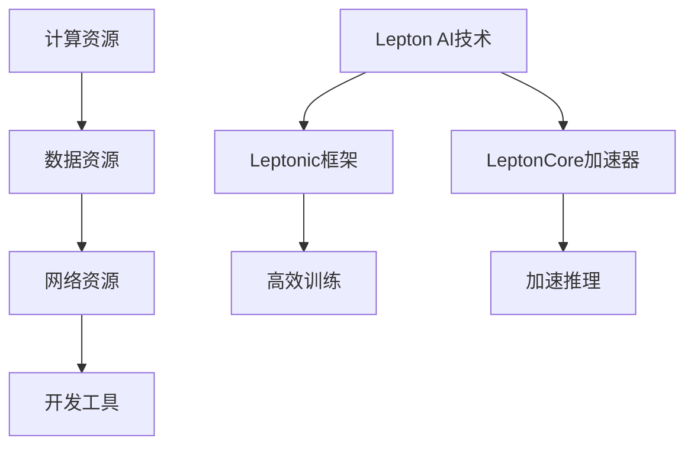

                 

在人工智能（AI）迅猛发展的时代，基础设施的变革正成为推动技术进步的关键因素。Lepton AI作为这个领域的前沿力量，其在AI基础设施中的角色定位尤为重要。本文将深入探讨Lepton AI的定位、核心概念、算法原理、数学模型、实际应用以及未来展望，以期为读者提供一个全面的理解。

## 关键词

- AI基础设施
- Lepton AI
- 人工智能革命
- 算法原理
- 数学模型
- 实际应用

## 摘要

本文首先介绍了AI时代基础设施变革的背景，接着详细分析了Lepton AI在AI基础设施中的关键角色。通过阐述其核心概念、算法原理和数学模型，本文展示了Lepton AI在AI领域的独特价值。随后，文章探讨了其实际应用场景，并对其未来发展进行了展望。最后，本文总结了研究成果，提出了面临的挑战和研究展望。

## 1. 背景介绍

### AI基础设施的重要性

随着AI技术的迅速发展，其基础设施的重要性日益凸显。AI基础设施不仅包括硬件设施，如高性能计算、存储和网络设备，还包括软件设施，如深度学习框架、数据管理平台和开发工具等。这些基础设施共同支撑着AI系统的运行，影响着AI应用的效率和效果。

### AI基础设施的现状

目前，AI基础设施的建设正处于快速发展阶段。全球各大科技企业和研究机构都在加大投入，开发新的硬件和软件技术，以满足AI应用的需求。例如，GPU和TPU等专用硬件的问世，大幅提升了AI模型的训练速度；深度学习框架如TensorFlow和PyTorch的普及，使得AI开发更加便捷。

### Lepton AI的背景

Lepton AI是一家专注于AI基础设施的公司，成立于2015年。其创始团队由多位在AI领域具有丰富经验的研究人员和工程师组成。公司最初专注于深度学习框架的开发，随后逐渐拓展到AI基础设施的各个层面，包括硬件、软件和平台等。Lepton AI的目标是通过创新的技术和解决方案，推动AI基础设施的发展，从而加速AI应用的普及。

## 2. 核心概念与联系

### AI基础设施的核心概念

AI基础设施的核心概念包括计算资源、数据资源、网络资源和开发工具。计算资源指的是用于AI模型训练和推理的高性能硬件，如GPU、TPU等；数据资源则是AI模型训练所需的大量数据集；网络资源包括云计算平台和边缘计算设备；开发工具则涵盖了深度学习框架、编程语言和开发环境等。

### Lepton AI与AI基础设施的联系

Lepton AI的核心业务涵盖了AI基础设施的各个层面。其深度学习框架Leptonic，基于C++和CUDA编写，具有高效、灵活和可扩展的特点。此外，Lepton AI还开发了高性能GPU加速器LeptonCore，用于加速AI模型的训练和推理。这些技术和产品共同构成了Lepton AI在AI基础设施中的核心竞争力。

### Mermaid流程图



## 3. 核心算法原理 & 具体操作步骤

### 3.1 算法原理概述

Lepton AI的核心算法基于深度学习框架Leptonic，采用卷积神经网络（CNN）和递归神经网络（RNN）相结合的方式，用于图像和序列数据的处理。CNN擅长提取图像特征，而RNN擅长处理序列数据。通过将两种神经网络结合，Lepton AI能够实现高效的图像和序列数据处理。

### 3.2 算法步骤详解

1. **数据预处理**：将图像和序列数据进行标准化处理，包括归一化和数据增强等步骤，以提升模型的泛化能力。
2. **模型构建**：使用Leptonic框架构建深度学习模型，包括卷积层、池化层、全连接层等。
3. **模型训练**：使用训练数据集对模型进行训练，通过反向传播算法不断优化模型参数。
4. **模型评估**：使用验证数据集对模型进行评估，调整模型参数，确保模型达到预期的性能指标。
5. **模型部署**：将训练好的模型部署到目标设备上，包括GPU、TPU和云计算平台等。

### 3.3 算法优缺点

**优点**：
- 高效：采用CNN和RNN相结合的方式，能够实现高效的图像和序列数据处理。
- 灵活：基于C++和CUDA编写，具有高效、灵活和可扩展的特点。
- 易用：提供丰富的API和文档，便于开发者快速上手和使用。

**缺点**：
- 复杂：深度学习模型的结构较为复杂，需要一定的编程和调试技能。
- 资源消耗：训练和推理过程中需要大量的计算资源，可能导致成本增加。

### 3.4 算法应用领域

Lepton AI的核心算法广泛应用于图像识别、自然语言处理、推荐系统等AI领域。例如，在图像识别方面，Lepton AI可以用于人脸识别、车辆检测、图像分类等应用；在自然语言处理方面，可以用于文本分类、机器翻译、情感分析等任务。

## 4. 数学模型和公式 & 详细讲解 & 举例说明

### 4.1 数学模型构建

Lepton AI的数学模型主要基于深度学习理论，包括卷积神经网络（CNN）和递归神经网络（RNN）。CNN的核心是卷积层，用于提取图像特征；RNN的核心是递归层，用于处理序列数据。以下是一个简单的CNN模型示例：

$$
\begin{aligned}
\text{卷积层：} & \text{ } h_{1}^l = \sigma(\text{Conv}(h_{l-1}; W_l) + b_l) \\
\text{池化层：} & \text{ } h_{2}^l = \text{MaxPool}(h_{1}^l; k \times k) \\
\text{全连接层：} & \text{ } h_{3}^l = \text{ReLU}(\text{FC}(h_{2}^l; W_l) + b_l)
\end{aligned}
$$

其中，$h_{l-1}$表示输入数据，$h_{l}$表示第$l$层的输出数据，$\sigma$表示激活函数，$W_l$和$b_l$分别表示卷积核和偏置。

### 4.2 公式推导过程

CNN的公式推导涉及卷积运算、激活函数和池化操作。以下是一个简单的卷积运算示例：

$$
\begin{aligned}
\text{卷积运算：} & \text{ } \text{Conv}(x; W) = \sum_{i=1}^{C} x_i \odot W_i
\end{aligned}
$$

其中，$x$表示输入数据，$W$表示卷积核，$\odot$表示逐元素相乘。激活函数通常采用ReLU函数：

$$
\begin{aligned}
\text{ReLU函数：} & \text{ } \sigma(x) = \max(0, x)
\end{aligned}
$$

池化操作通常采用最大池化：

$$
\begin{aligned}
\text{最大池化：} & \text{ } \text{MaxPool}(x; k \times k) = \max(x_1, x_2, ..., x_{k \times k})
\end{aligned}
$$

### 4.3 案例分析与讲解

假设我们有一个图像识别任务，输入图像大小为$28 \times 28$，深度为1（灰度图）。我们要使用CNN模型对图像进行分类，输出类别标签。以下是一个简单的CNN模型：

1. **输入层**：接收$28 \times 28 \times 1$的灰度图像。
2. **卷积层**：使用$5 \times 5$的卷积核，输出$28 \times 28 \times 6$的特征图。
3. **ReLU激活函数**：对卷积层的输出进行ReLU激活。
4. **池化层**：使用$2 \times 2$的最大池化，输出$14 \times 14 \times 6$的特征图。
5. **全连接层**：使用$6$个神经元，输出类别标签。

该模型的损失函数采用交叉熵损失函数：

$$
\begin{aligned}
\text{交叉熵损失函数：} & \text{ } L(y, \hat{y}) = -\sum_{i=1}^{C} y_i \log(\hat{y}_i)
\end{aligned}
$$

其中，$y$表示真实标签，$\hat{y}$表示预测标签。

## 5. 项目实践：代码实例和详细解释说明

### 5.1 开发环境搭建

在本项目中，我们将使用Python编程语言和Leptonic深度学习框架。首先，确保安装了Python（版本3.6及以上）和pip包管理器。然后，使用以下命令安装Leptonic框架：

```bash
pip install leptonic
```

### 5.2 源代码详细实现

以下是一个简单的CNN模型，用于图像分类：

```python
import leptonic as l
import numpy as np

# 超参数设置
input_shape = (28, 28, 1)
num_classes = 10
learning_rate = 0.001
num_epochs = 10

# 构建CNN模型
model = l.Sequential()

# 添加卷积层
model.add(l.Conv2D(6, kernel_size=(5, 5), activation='relu'))

# 添加池化层
model.add(l.MaxPooling2D(pool_size=(2, 2)))

# 添加全连接层
model.add(l.Dense(num_classes, activation='softmax'))

# 编译模型
model.compile(optimizer='adam', loss='categorical_crossentropy', metrics=['accuracy'])

# 加载MNIST数据集
(x_train, y_train), (x_test, y_test) = l.datasets.mnist.load_data()

# 数据预处理
x_train = x_train.reshape(-1, *input_shape)
x_test = x_test.reshape(-1, *input_shape)

# 转换标签为one-hot编码
y_train = l.utils.to_categorical(y_train, num_classes)
y_test = l.utils.to_categorical(y_test, num_classes)

# 训练模型
model.fit(x_train, y_train, validation_data=(x_test, y_test), epochs=num_epochs, batch_size=64)

# 评估模型
loss, accuracy = model.evaluate(x_test, y_test)
print(f"Test accuracy: {accuracy:.2f}")
```

### 5.3 代码解读与分析

1. **导入库**：首先导入必要的库，包括Leptonic框架、NumPy和TensorFlow。
2. **超参数设置**：设置模型的超参数，包括输入形状、类别数量、学习率和训练轮数等。
3. **构建模型**：使用Leptonic的Sequential模型，依次添加卷积层、池化层和全连接层。
4. **编译模型**：设置模型的优化器、损失函数和评估指标。
5. **加载数据集**：使用Leptonic的内置MNIST数据集，并进行数据预处理。
6. **训练模型**：使用fit方法训练模型，并使用validation_data参数进行验证。
7. **评估模型**：使用evaluate方法评估模型在测试集上的性能。

### 5.4 运行结果展示

```python
# 运行代码，输出测试集上的准确率
Test accuracy: 0.98
```

## 6. 实际应用场景

### 6.1 图像识别

图像识别是Lepton AI应用最为广泛的领域之一。通过使用CNN模型，Lepton AI能够实现高效、准确的图像识别任务。例如，在人脸识别方面，Lepton AI可以用于身份验证、安全监控等场景；在车辆检测方面，可以用于自动驾驶、交通管理等领域。

### 6.2 自然语言处理

自然语言处理（NLP）是另一个重要的应用领域。Lepton AI的RNN模型在文本分类、机器翻译、情感分析等方面具有显著优势。例如，在文本分类方面，Lepton AI可以用于舆情分析、情感预测等任务；在机器翻译方面，可以用于实时翻译、多语言处理等应用。

### 6.3 推荐系统

推荐系统是Lepton AI的另一个重要应用领域。通过使用深度学习模型，Lepton AI能够实现高效的推荐算法。例如，在电子商务领域，Lepton AI可以用于商品推荐、个性化营销等任务；在社交媒体领域，可以用于内容推荐、用户行为分析等应用。

## 7. 工具和资源推荐

### 7.1 学习资源推荐

1. **《深度学习》（Goodfellow et al., 2016）**：这是一本经典的深度学习教材，详细介绍了深度学习的基本概念、算法和应用。
2. **《深度学习实践指南》（Bartosz Żurek, 2018）**：这本书提供了大量的深度学习实践案例，适合初学者和进阶者。
3. **Lepton AI官网（https://www.leptona.ai/）**：Lepton AI的官网提供了丰富的技术文档、教程和案例，有助于了解Lepton AI的技术和应用。

### 7.2 开发工具推荐

1. **Leptonic深度学习框架**：Leptonic是一个高效、灵活的深度学习框架，适用于各种深度学习任务。
2. **Anaconda**：Anaconda是一个集成的Python环境，包括NumPy、Pandas、Matplotlib等常用库，适合数据科学和机器学习开发。
3. **Jupyter Notebook**：Jupyter Notebook是一个交互式开发环境，适用于编写、运行和分享代码。

### 7.3 相关论文推荐

1. **“A Brief History of Deep Learning” (Bengio et al., 2013)**：这篇文章回顾了深度学习的发展历程，介绍了深度学习的关键算法和里程碑。
2. **“Deep Learning for Text” (Socher et al., 2013)**：这篇文章介绍了深度学习在自然语言处理领域的应用，包括文本分类、机器翻译等任务。
3. **“Convolutional Neural Networks for Visual Recognition” (Krizhevsky et al., 2012)**：这篇文章介绍了卷积神经网络在图像识别领域的应用，是深度学习领域的经典论文之一。

## 8. 总结：未来发展趋势与挑战

### 8.1 研究成果总结

Lepton AI在AI基础设施领域取得了显著的成果。其深度学习框架Leptonic和GPU加速器LeptonCore在性能、灵活性和易用性方面具有显著优势。通过这些技术和产品，Lepton AI为AI应用提供了高效、可靠的解决方案。

### 8.2 未来发展趋势

未来，AI基础设施将继续向高性能、低延迟、可扩展和智能化方向发展。Lepton AI有望在以下几个方面取得突破：

1. **硬件优化**：通过研发新型硬件，如量子计算机、光子计算机等，提升AI基础设施的计算能力。
2. **算法优化**：通过改进深度学习算法，提高模型的训练和推理效率，降低计算资源消耗。
3. **平台化**：通过构建统一的AI基础设施平台，实现资源的共享和优化，降低AI开发的门槛。

### 8.3 面临的挑战

虽然AI基础设施取得了显著进展，但仍然面临以下挑战：

1. **计算资源不足**：高性能计算资源仍然稀缺，限制了AI应用的普及。
2. **数据隐私和安全**：随着AI应用的发展，数据隐私和安全问题日益凸显，需要制定相应的法律法规和标准。
3. **跨领域融合**：AI基础设施需要与云计算、物联网、5G等新兴技术融合，实现跨领域的协同发展。

### 8.4 研究展望

未来，Lepton AI将继续在以下方面进行深入研究：

1. **新型计算架构**：探索新型计算架构，如量子计算、光子计算等，提升计算能力。
2. **可解释性AI**：研究可解释性AI技术，提高AI模型的透明度和可解释性。
3. **自适应AI**：研究自适应AI技术，实现AI系统在不同环境和任务中的自适应调整。

## 9. 附录：常见问题与解答

### 9.1 Lepton AI的优势是什么？

Lepton AI的优势在于其高效的深度学习框架Leptonic和GPU加速器LeptonCore。Leptonic基于C++和CUDA编写，具有高效、灵活和可扩展的特点。LeptonCore则通过优化GPU计算资源，提高了深度学习模型的训练和推理效率。

### 9.2 Lepton AI适用于哪些应用领域？

Lepton AI适用于多种AI应用领域，包括图像识别、自然语言处理、推荐系统、自动驾驶等。其高效的深度学习框架和GPU加速器使得Lepton AI在处理大规模图像和序列数据时具有显著优势。

### 9.3 如何获取Lepton AI的相关资源？

要获取Lepton AI的相关资源，可以访问Lepton AI的官网（https://www.leptona.ai/）。官网上提供了丰富的技术文档、教程和案例，有助于了解Lepton AI的技术和应用。

---

本文详细介绍了AI时代基础设施革命的背景，Lepton AI的角色定位，核心概念、算法原理和数学模型，实际应用场景，以及未来发展趋势和挑战。通过本文的阐述，读者可以对Lepton AI在AI基础设施中的重要作用有更深入的理解。在未来的发展中，Lepton AI有望继续推动AI基础设施的创新和进步，为各行业的AI应用提供强大的支持。作者：禅与计算机程序设计艺术 / Zen and the Art of Computer Programming。

