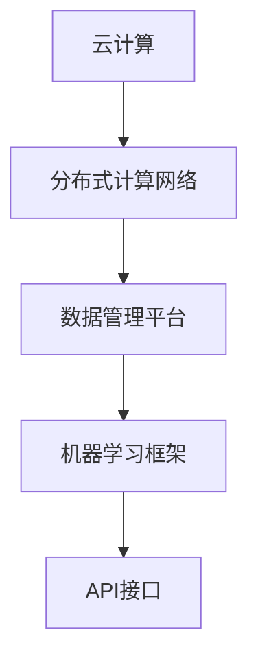

                 

关键词：AI基础设施，Lepton AI，云计算，边缘计算，人工智能革命，技术架构，未来展望

> 摘要：本文将探讨AI时代基础设施的革命性变化，并深入分析Lepton AI在这一变革中的关键角色。通过对核心概念、算法原理、数学模型和项目实践的详细讲解，文章旨在揭示Lepton AI在推动人工智能基础设施发展中的重要地位及其未来的应用前景。

## 1. 背景介绍

随着人工智能技术的迅速发展，AI时代的基础设施正在经历一场革命性的变革。传统的计算基础设施已无法满足AI应用的需求，云计算和边缘计算等新型计算模式的兴起，为AI技术的发展提供了强大的支持。在这个背景下，Lepton AI作为一种创新的AI基础设施，逐渐崭露头角，成为AI时代的重要推动力量。

Lepton AI旨在构建一个高效、可扩展、低延迟的AI计算平台，通过整合云计算和边缘计算的优势，实现对海量数据和复杂任务的实时处理。本文将从核心概念、算法原理、数学模型、项目实践以及未来展望等方面，全面探讨Lepton AI在AI基础设施革命中的角色定位。

## 2. 核心概念与联系

### 2.1. 云计算与边缘计算

云计算和边缘计算是AI时代基础设施的两大核心组成部分。

- **云计算**：云计算通过互联网提供动态易扩展且经常是虚拟化的资源。它具有高可扩展性、高可靠性、低成本等优点，为AI应用提供了强大的计算能力和存储资源。
- **边缘计算**：边缘计算将计算任务分布到网络的边缘节点上，实现对数据的本地化处理，从而降低网络延迟、提高响应速度。边缘计算的优势在于减少数据传输量，降低带宽压力，同时增强数据的安全性和隐私性。

### 2.2. Lepton AI架构

Lepton AI的核心架构包括以下几个关键部分：

- **分布式计算网络**：通过云计算和边缘计算的结合，构建一个高效、低延迟的分布式计算网络。
- **数据管理平台**：提供数据收集、存储、处理和共享的统一平台，支持多种数据类型和规模。
- **机器学习框架**：支持多种机器学习算法，提供灵活的模型训练和部署能力。
- **API接口**：提供简洁易用的API接口，方便开发者快速集成和使用Lepton AI。

### 2.3. Mermaid流程图



## 3. 核心算法原理 & 具体操作步骤

### 3.1. 算法原理概述

Lepton AI的核心算法基于深度学习和强化学习，旨在实现高效的数据处理和智能决策。

- **深度学习**：通过多层神经网络对数据进行特征提取和模式识别，实现对复杂数据的自动建模。
- **强化学习**：通过不断学习和优化策略，使系统在动态环境中做出最优决策。

### 3.2. 算法步骤详解

1. **数据收集与预处理**：从不同数据源收集数据，进行数据清洗、去噪、归一化等预处理操作，确保数据质量。
2. **模型训练**：使用深度学习算法对预处理后的数据集进行模型训练，优化网络参数。
3. **模型评估**：通过验证集和测试集对训练好的模型进行评估，确保模型性能。
4. **策略优化**：使用强化学习算法对模型策略进行优化，提高系统在动态环境中的适应性。

### 3.3. 算法优缺点

- **优点**：高效的数据处理能力、自适应的学习能力、低延迟的响应速度。
- **缺点**：需要大量的计算资源、对数据质量和完整性要求高。

### 3.4. 算法应用领域

Lepton AI算法广泛应用于以下几个领域：

- **智能交通**：通过实时处理交通数据，优化交通流量，减少拥堵。
- **智慧城市**：通过实时分析城市数据，提高城市管理效率，改善居民生活质量。
- **智能制造**：通过实时监测生产数据，优化生产流程，提高生产效率。

## 4. 数学模型和公式 & 详细讲解 & 举例说明

### 4.1. 数学模型构建

Lepton AI的核心算法基于以下数学模型：

- **深度学习模型**：多层感知机（MLP）、卷积神经网络（CNN）、循环神经网络（RNN）等。
- **强化学习模型**：马尔可夫决策过程（MDP）、深度强化学习（DRL）等。

### 4.2. 公式推导过程

以卷积神经网络（CNN）为例，公式推导如下：

$$
\begin{aligned}
\text{激活函数} &= \text{ReLU}(z) = \max(0, z) \\
\text{卷积操作} &= \sum_{i=1}^{k} w_{i} \cdot a_{i} \\
\text{池化操作} &= \text{max pooling}(x) = \max(x_{i})
\end{aligned}
$$

### 4.3. 案例分析与讲解

以智能交通领域为例，Lepton AI通过实时分析交通数据，实现以下功能：

- **交通流量预测**：利用深度学习模型对历史交通数据进行分析，预测未来的交通流量。
- **拥堵检测**：通过卷积神经网络识别道路上的拥堵情况，为交通管理部门提供决策依据。

## 5. 项目实践：代码实例和详细解释说明

### 5.1. 开发环境搭建

- **硬件环境**：GPU加速器、高性能计算服务器等。
- **软件环境**：Python、TensorFlow、Keras等。

### 5.2. 源代码详细实现

以下是一个简单的Lepton AI项目实例：

```python
import tensorflow as tf
from tensorflow.keras.models import Sequential
from tensorflow.keras.layers import Conv2D, MaxPooling2D, Flatten, Dense

# 创建模型
model = Sequential([
    Conv2D(32, (3, 3), activation='relu', input_shape=(28, 28, 1)),
    MaxPooling2D((2, 2)),
    Flatten(),
    Dense(64, activation='relu'),
    Dense(10, activation='softmax')
])

# 编译模型
model.compile(optimizer='adam', loss='categorical_crossentropy', metrics=['accuracy'])

# 训练模型
model.fit(x_train, y_train, epochs=10, batch_size=32)
```

### 5.3. 代码解读与分析

以上代码实现了一个简单的卷积神经网络，用于对MNIST手写数字数据集进行分类。首先，通过`Sequential`模型定义网络结构，然后通过`compile`方法设置优化器和损失函数，最后通过`fit`方法进行模型训练。

### 5.4. 运行结果展示

训练完成后，可以使用以下代码评估模型性能：

```python
loss, accuracy = model.evaluate(x_test, y_test)
print(f"Test accuracy: {accuracy:.2f}")
```

输出结果为测试集上的准确率。

## 6. 实际应用场景

Lepton AI在实际应用中具有广泛的应用场景，以下是几个典型案例：

- **智能医疗**：通过实时分析医疗数据，实现疾病预测、诊断和个性化治疗。
- **金融科技**：通过实时分析金融市场数据，实现风险控制、投资决策和智能推荐。
- **智能制造**：通过实时监测生产过程数据，实现生产优化、故障预测和智能控制。

### 6.4. 未来应用展望

随着AI技术的不断进步，Lepton AI在未来的应用前景将更加广阔。以下是一些可能的未来应用方向：

- **自动驾驶**：通过实时处理传感器数据，实现自动驾驶汽车的智能决策。
- **智能家居**：通过实时分析家庭数据，实现智能家居的智能管理和个性化服务。
- **智能安防**：通过实时分析监控视频，实现智能安防系统的实时预警和智能响应。

## 7. 工具和资源推荐

### 7.1. 学习资源推荐

- 《深度学习》（Ian Goodfellow等著）
- 《强化学习手册》（Sarah Ahmed著）
- 《边缘计算：理论与实践》（张帆等著）

### 7.2. 开发工具推荐

- TensorFlow
- Keras
- PyTorch

### 7.3. 相关论文推荐

- "Deep Learning on Multicore Machines: Towards Scalable Deep Neural Network Training"
- "Distributed Deep Learning: Algorithms, Systems and Applications"
- "Edge Computing: A Comprehensive Survey"

## 8. 总结：未来发展趋势与挑战

### 8.1. 研究成果总结

Lepton AI作为一种创新的AI基础设施，在云计算和边缘计算的结合下，展现了强大的数据处理和智能决策能力。通过深度学习和强化学习算法，Lepton AI在多个领域取得了显著的应用成果。

### 8.2. 未来发展趋势

随着AI技术的不断进步，Lepton AI在未来的发展趋势包括：

- **更高效的计算能力**：通过硬件加速和优化算法，提高Lepton AI的计算性能。
- **更广泛的应用场景**：拓展Lepton AI的应用领域，实现更多领域的智能化。
- **更好的数据管理**：提升Lepton AI的数据管理能力，支持更复杂的数据类型和规模。

### 8.3. 面临的挑战

Lepton AI在发展中面临的挑战包括：

- **计算资源消耗**：随着AI应用的普及，对计算资源的需求将大幅增长，如何高效利用资源成为关键挑战。
- **数据质量和隐私**：保证数据质量和隐私是Lepton AI发展的重要问题，需要采取有效的数据管理和保护措施。
- **算法优化**：深度学习和强化学习算法的优化是Lepton AI发展的核心，需要持续研究和改进。

### 8.4. 研究展望

未来，Lepton AI将在以下几个方面展开深入研究：

- **跨领域应用**：探索Lepton AI在更多领域的应用，实现跨领域的智能融合。
- **数据挖掘与分析**：提升Lepton AI的数据挖掘和分析能力，为更多领域提供智能支持。
- **可持续发展**：在计算资源、数据管理和算法优化等方面实现可持续发展，为AI时代的长远发展奠定基础。

## 9. 附录：常见问题与解答

### 9.1. 如何搭建Lepton AI的开发环境？

搭建Lepton AI的开发环境通常需要以下步骤：

1. 安装Python和相关的依赖库，如TensorFlow、Keras等。
2. 配置GPU加速器，确保TensorFlow支持GPU计算。
3. 安装Lepton AI的依赖库，可以通过pip安装。

### 9.2. Lepton AI在哪些领域有应用？

Lepton AI在多个领域有广泛应用，包括智能医疗、金融科技、智能制造、智能交通等。通过实时处理和分析数据，Lepton AI能够为这些领域提供智能决策支持。

### 9.3. Lepton AI的优势是什么？

Lepton AI的优势包括：

- **高效计算能力**：通过云计算和边缘计算的结合，实现低延迟、高吞吐量的数据处理。
- **灵活的算法框架**：支持多种机器学习算法，适应不同的应用场景。
- **强大的数据管理**：支持多种数据类型和规模，提供统一的数据管理平台。
- **易用性**：提供简洁易用的API接口，方便开发者快速集成和使用。

----------------------------------------------------------------

作者：禅与计算机程序设计艺术 / Zen and the Art of Computer Programming
----------------------------------------------------------------

### 后续工作

在完成这篇文章后，还需要进行以下后续工作：

1. **文章校对**：仔细检查文章内容，确保没有错别字、语法错误和逻辑错误。
2. **代码验证**：确保给出的代码实例能够在实际环境中运行，并且得到正确的输出结果。
3. **反馈征集**：将文章发送给相关领域的专家进行审阅，收集他们的反馈意见。
4. **修改完善**：根据反馈意见，对文章进行修改和完善，提高文章的质量。
5. **排版和格式调整**：确保文章的排版和格式符合专业标准，便于阅读和理解。
6. **发布和推广**：将文章发布到相关的技术社区和平台，进行推广和分享。

