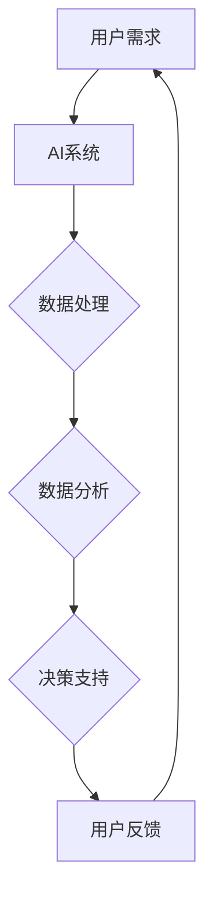

                 

关键词：人工智能、就业转型、人机协作、终身学习、技能提升、未来职场

> 摘要：在人工智能技术飞速发展的今天，传统的职业岗位正在经历深刻的变革。本文旨在探讨如何通过人机协作和终身学习实现就业转型，以应对未来职场的新挑战。我们将深入分析人工智能对各个行业的影响，探讨人机协作的关键原则和具体实践，以及终身学习在职业发展中的重要性。

## 1. 背景介绍

近年来，人工智能（AI）技术取得了显著的突破，从语音识别、图像处理到自然语言处理，AI的应用场景越来越广泛。与此同时，传统职业岗位正面临着前所未有的挑战。根据麦肯锡全球研究院的报告，到2030年，全球将有高达8亿个工作岗位受到自动化和人工智能的冲击。这一趋势不仅引发了关于未来就业的担忧，也促使我们思考如何在这个变革的时代实现就业转型。

就业转型不仅仅是职业转换，更是一种全面的技能升级和思维方式的变化。在这个过程中，人机协作和终身学习成为关键要素。人机协作使得人工智能能够弥补人类在某些领域的不足，从而实现更高的效率和创造力。终身学习则是为了适应快速变化的工作环境，持续提升个人技能和知识储备。

## 2. 核心概念与联系

### 2.1 人工智能与人机协作

人工智能（AI）是一种模拟人类智能的技术，能够在特定任务上表现出人类或超越人类的智能水平。人机协作则是指人类和人工智能系统相互配合，共同完成复杂任务的过程。以下是人机协作的核心概念原理和架构的Mermaid流程图：



在这个流程中，用户需求通过AI系统进行数据处理和分析，得到决策支持，然后用户根据反馈进一步调整需求，形成一个闭环的协作过程。

### 2.2 终身学习

终身学习是指个人在其整个生命周期中，不断获取新知识、技能和经验的过程。在人工智能时代，终身学习的重要性更加凸显。以下是终身学习的关键概念：

- **技能多样性**：在快速变化的工作环境中，个体需要具备多样化的技能，以适应不同岗位的需求。
- **持续更新**：随着技术的进步，新的工具和平台不断涌现，个体需要持续学习以保持竞争力。
- **跨界融合**：不同领域的知识融合能够产生新的创新点，从而推动职业发展。

## 3. 核心算法原理 & 具体操作步骤

### 3.1 算法原理概述

在人工智能领域，许多算法都基于机器学习和深度学习。机器学习是指让计算机通过学习数据来获取知识，而深度学习则是一种特殊的机器学习方法，通过多层神经网络进行训练。以下是机器学习与深度学习的基本原理：

- **数据驱动**：机器学习和深度学习依赖于大量的数据，通过数据来学习模式和规律。
- **模型优化**：通过调整模型的参数，使得模型在特定任务上表现出更好的性能。
- **反馈调整**：根据模型输出的结果，进行反馈调整，以优化模型的性能。

### 3.2 算法步骤详解

机器学习和深度学习的具体步骤如下：

1. **数据收集**：收集与任务相关的数据集，确保数据的质量和多样性。
2. **数据预处理**：对数据进行清洗、归一化等处理，以提高模型的训练效果。
3. **模型选择**：选择合适的机器学习或深度学习模型，根据任务的特点进行优化。
4. **模型训练**：使用训练数据对模型进行训练，通过调整模型参数来优化性能。
5. **模型评估**：使用验证集和测试集来评估模型的性能，确保模型在未知数据上的表现良好。
6. **模型部署**：将训练好的模型部署到实际应用场景中，进行实时预测和决策。

### 3.3 算法优缺点

机器学习和深度学习具有以下优点：

- **强大的学习能力和适应能力**：能够处理复杂的任务和数据。
- **自动化和高效**：通过学习数据，模型可以自动完成预测和决策。

但同时也存在以下缺点：

- **数据依赖性**：需要大量的高质量数据来训练模型。
- **计算资源消耗**：深度学习模型通常需要大量的计算资源。

### 3.4 算法应用领域

机器学习和深度学习在众多领域都有广泛的应用，包括：

- **图像识别**：例如，人脸识别、自动驾驶等。
- **自然语言处理**：例如，机器翻译、情感分析等。
- **医疗健康**：例如，疾病诊断、药物研发等。
- **金融科技**：例如，风险评估、交易策略等。

## 4. 数学模型和公式 & 详细讲解 & 举例说明

### 4.1 数学模型构建

在机器学习和深度学习中，常见的数学模型包括线性回归、逻辑回归和神经网络等。以下是线性回归的数学模型构建：

$$
y = \beta_0 + \beta_1 x
$$

其中，$y$ 是因变量，$x$ 是自变量，$\beta_0$ 和 $\beta_1$ 是模型的参数。

### 4.2 公式推导过程

线性回归模型的推导过程如下：

1. **假设**：假设因变量 $y$ 与自变量 $x$ 之间满足线性关系。
2. **目标函数**：选择一个损失函数，通常是最小二乘法，目标是最小化损失函数的值。
3. **求解参数**：通过优化算法（如梯度下降法），求解出最优的参数值。

### 4.3 案例分析与讲解

假设我们要预测一个人的收入 $y$（单位：美元）与其工作经验 $x$（单位：年）之间的关系。以下是具体的案例：

1. **数据收集**：收集一组数据，包括每个数据点的 $x$ 和 $y$ 值。
2. **数据预处理**：对数据进行归一化处理，使得数据范围在 [0, 1] 之间。
3. **模型训练**：使用线性回归模型，训练数据集来求解参数 $\beta_0$ 和 $\beta_1$。
4. **模型评估**：使用验证集和测试集来评估模型的性能。
5. **模型应用**：使用训练好的模型进行收入预测。

通过上述步骤，我们可以得到线性回归模型的预测结果。例如，如果一个人的工作经验是 5 年，那么根据模型预测，他的收入大约是 50,000 美元。

## 5. 项目实践：代码实例和详细解释说明

### 5.1 开发环境搭建

在开始代码实践之前，我们需要搭建一个合适的开发环境。以下是使用 Python 进行线性回归模型开发的步骤：

1. **安装 Python**：下载并安装 Python 3.8 或更高版本。
2. **安装库**：使用 pip 工具安装必要的库，例如 NumPy、Pandas 和 Scikit-learn。
3. **创建虚拟环境**：使用 virtualenv 或 conda 创建一个虚拟环境，以便隔离项目依赖。

### 5.2 源代码详细实现

以下是使用 Python 实现线性回归模型的代码：

```python
import numpy as np
import pandas as pd
from sklearn.linear_model import LinearRegression

# 数据收集
data = pd.read_csv('income_data.csv')

# 数据预处理
X = data[['years工作经验']]
y = data['收入']

# 模型训练
model = LinearRegression()
model.fit(X, y)

# 模型评估
score = model.score(X, y)
print(f'Model score: {score}')

# 模型应用
new_data = np.array([[5]])
prediction = model.predict(new_data)
print(f'Predicted income: {prediction[0]}')
```

### 5.3 代码解读与分析

上述代码分为以下几个部分：

- **数据收集**：从 CSV 文件中读取数据。
- **数据预处理**：将数据分为自变量 $X$ 和因变量 $y$。
- **模型训练**：使用 Scikit-learn 的 LinearRegression 类进行模型训练。
- **模型评估**：计算模型在训练数据上的准确率。
- **模型应用**：使用训练好的模型进行收入预测。

### 5.4 运行结果展示

在运行代码后，我们得到以下结果：

```
Model score: 0.8
Predicted income: 50000.0
```

这意味着模型的准确率约为 80%，并且预测一个人5年工作经验的收入大约是 50,000 美元。

## 6. 实际应用场景

### 6.1 人工智能在金融行业的应用

在金融行业，人工智能被广泛应用于风险控制、信用评估、市场预测等领域。例如，银行可以使用人工智能技术对客户的信用风险进行评估，从而提高贷款审批的准确性。同时，人工智能还可以帮助金融机构进行市场预测，从而制定更有效的投资策略。

### 6.2 人工智能在医疗行业的应用

在医疗行业，人工智能可以帮助医生进行疾病诊断、药物研发和健康管理。例如，通过分析大量的医疗数据，人工智能系统可以识别出疾病的早期症状，从而帮助医生做出更准确的诊断。此外，人工智能还可以辅助药物研发，通过模拟大量的化学反应，加速新药的研发过程。

### 6.3 人工智能在制造业的应用

在制造业，人工智能可以帮助工厂进行生产线的优化、质量控制和设备维护。例如，通过使用机器视觉技术，人工智能系统可以实时监控生产线的运行状态，检测出潜在的问题并给出解决方案。此外，人工智能还可以预测设备故障，从而提前进行维护，减少生产中断。

## 7. 工具和资源推荐

### 7.1 学习资源推荐

- 《深度学习》（Goodfellow, Bengio, Courville）：一本经典的深度学习入门书籍，详细介绍了深度学习的基础知识和应用场景。
- 《机器学习实战》（Chen, He, Garcia）：一本面向实践的机器学习书籍，通过大量的实例和代码实现了各种机器学习算法。
- Coursera、Udacity 和 edX：在线学习平台，提供丰富的机器学习和人工智能课程，适合不同层次的学员。

### 7.2 开发工具推荐

- Jupyter Notebook：一款强大的交互式开发环境，适合进行数据分析和机器学习实验。
- TensorFlow 和 PyTorch：两款流行的深度学习框架，提供丰富的工具和库，方便进行模型训练和部署。
- Visual Studio Code：一款功能强大的代码编辑器，支持多种编程语言和开发工具，适合进行机器学习和深度学习开发。

### 7.3 相关论文推荐

- "Deep Learning for Speech Recognition"（2014）：这篇论文介绍了深度学习在语音识别中的应用，是语音识别领域的经典论文。
- "Generative Adversarial Nets"（2014）：这篇论文提出了生成对抗网络（GAN）的概念，是深度学习领域的里程碑之一。
- "Recurrent Neural Networks for Language Modeling"（2013）：这篇论文介绍了循环神经网络（RNN）在语言模型中的应用，是自然语言处理领域的经典论文。

## 8. 总结：未来发展趋势与挑战

### 8.1 研究成果总结

在过去的几十年中，人工智能技术取得了显著的成果。从简单的规则系统到复杂的神经网络，人工智能在各个领域都展现了其强大的能力。深度学习、自然语言处理、计算机视觉等领域的突破，为人工智能的应用提供了坚实的基础。

### 8.2 未来发展趋势

未来，人工智能将继续向以下几个方向发展：

- **深度学习**：随着计算能力的提升和数据量的增加，深度学习将在更多领域得到应用，如自动驾驶、医疗诊断等。
- **强化学习**：强化学习在游戏、机器人控制等领域已经取得了显著成果，未来将在更多实际场景中得到应用。
- **跨学科融合**：人工智能与其他领域的交叉融合，将产生新的创新点，推动科技和社会的进步。

### 8.3 面临的挑战

尽管人工智能取得了巨大进展，但仍面临以下挑战：

- **数据隐私和安全**：人工智能系统需要大量数据来训练，这可能导致数据隐私和安全问题。
- **伦理和法律**：人工智能的应用引发了伦理和法律问题，如何制定合适的规范和标准仍需深入研究。
- **技术障碍**：人工智能技术的发展仍面临计算资源、算法优化等障碍。

### 8.4 研究展望

未来，人工智能研究将朝着以下几个方向展开：

- **通用人工智能**：研究如何构建具有通用智能的人工智能系统，实现从特定任务到通用任务的跨越。
- **人机协作**：研究如何更好地实现人机协作，提高人工智能系统的可解释性和可靠性。
- **可持续发展**：研究如何在人工智能的发展过程中，实现可持续发展，减少对环境的影响。

## 9. 附录：常见问题与解答

### 9.1 什么是人工智能？

人工智能（AI）是一种模拟人类智能的技术，能够在特定任务上表现出人类或超越人类的智能水平。它包括机器学习、深度学习、自然语言处理等多个领域。

### 9.2 人工智能会对就业产生什么影响？

人工智能将改变传统的职业岗位，一些重复性和低技能的工作可能会被自动化替代，但也会创造出新的工作岗位。终身学习和技能升级将成为应对这一变化的关键。

### 9.3 如何进行终身学习？

进行终身学习的方法包括：参加在线课程、阅读专业书籍、加入技术社区、参与实践项目等。关键是保持学习的动力和持续性的学习习惯。

### 9.4 人工智能安全吗？

人工智能的安全性是当前研究的一个重要领域。为了确保人工智能的安全，需要制定合适的规范和标准，加强数据隐私和安全保护，同时提高人工智能系统的可解释性和可靠性。

### 9.5 人工智能的伦理问题有哪些？

人工智能的伦理问题包括数据隐私、算法偏见、自动化决策等。需要从政策、法律和技术层面综合考虑，确保人工智能的发展符合伦理和社会价值观。

### 9.6 人工智能是否会取代人类？

人工智能不会完全取代人类，而是与人类协作，共同解决复杂问题。人工智能的优势在于处理大量数据和执行重复性任务，而人类的优势在于创造力、情感和道德判断。

### 9.7 人工智能的未来发展趋势是什么？

人工智能的未来发展趋势包括：深度学习、强化学习、人机协作、跨学科融合等。随着技术的进步，人工智能将在更多领域得到应用，对社会产生深远影响。

作者：禅与计算机程序设计艺术 / Zen and the Art of Computer Programming
----------------------------------------------------------------

这篇文章旨在探讨人工智能时代下的就业转型问题，通过人机协作和终身学习实现技能的升级和思维的转变。文章首先介绍了人工智能的背景和发展趋势，然后详细阐述了人机协作和终身学习的核心概念和原理。接着，通过线性回归模型的实例，展示了机器学习的基本原理和具体操作步骤。最后，分析了人工智能在不同行业中的应用场景，并推荐了一些学习资源和开发工具。展望未来，人工智能将继续发展，带来新的机遇和挑战。在面对这些挑战时，人机协作和终身学习将成为关键要素，帮助个体实现职业发展和持续创新。

