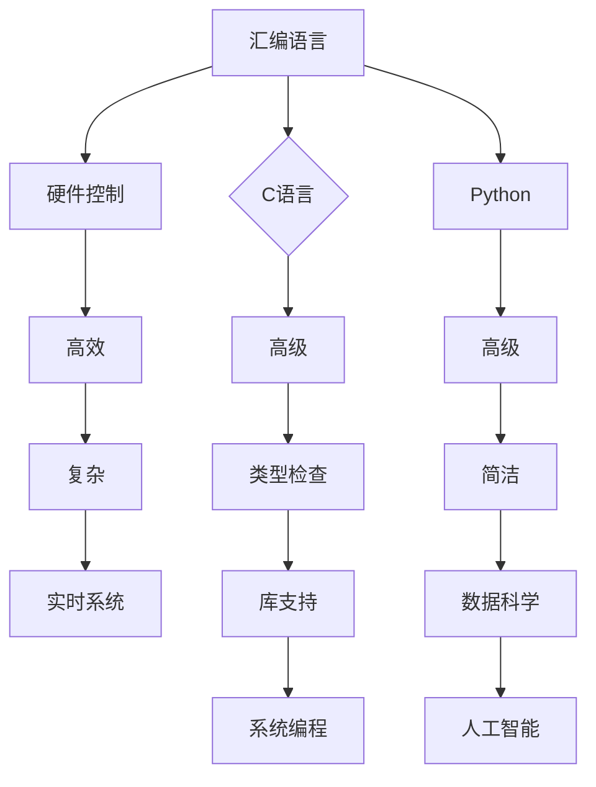

                 

 在人工智能（AI）飞速发展的时代，编程语言的选择变得尤为重要。汇编语言、C语言和Python作为计算机编程领域的重要工具，各有其独特的优势和适用场景。本文将深入探讨这三种编程语言的核心概念、原理、应用以及未来发展趋势，以帮助读者更好地理解AI时代编程语言的选择和应用。

## 关键词

- **人工智能**
- **汇编语言**
- **C语言**
- **Python**
- **编程语言**
- **算法**
- **性能**
- **开发效率**

## 摘要

本文首先介绍了汇编语言、C语言和Python的历史背景和发展现状。随后，我们深入探讨了这三种语言的核心概念、原理以及其在编程领域的应用。最后，我们展望了AI时代编程语言的发展趋势，分析了面临的挑战，并提出了未来的研究方向。

### 1. 背景介绍

#### 1.1 汇编语言

汇编语言是计算机编程的早期形式，它直接控制计算机的硬件资源。汇编语言的出现极大地提高了计算机程序的运行效率，但同时也增加了程序设计的复杂性。汇编语言在实时系统、嵌入式系统和底层驱动程序开发中仍然有着广泛的应用。

#### 1.2 C语言

C语言是一种高级编程语言，具有强大的类型检查和丰富的库支持。C语言在系统编程、应用程序开发和嵌入式系统开发中发挥着重要作用。它的灵活性和高性能使得C语言成为软件开发者的首选语言之一。

#### 1.3 Python

Python是一种高级编程语言，以其简洁的语法和强大的库支持而著称。Python在数据科学、机器学习、人工智能领域有着广泛的应用，它使得复杂的数据分析和模型训练变得更加简单。

### 2. 核心概念与联系

为了更好地理解汇编语言、C语言和Python之间的关系，我们可以使用Mermaid流程图来展示它们的核心概念和联系。



### 3. 核心算法原理 & 具体操作步骤

#### 3.1 算法原理概述

在AI时代，编程语言的核心算法原理变得越来越重要。汇编语言以其高效的硬件控制能力著称，C语言以其高性能和灵活性著称，Python以其简洁的语法和强大的库支持著称。

#### 3.2 算法步骤详解

- **汇编语言**：汇编语言的核心在于其直接控制硬件的能力。程序员需要详细了解计算机的硬件架构，并编写底层指令来操作硬件资源。
- **C语言**：C语言的核心在于其类型检查和库支持。程序员需要编写函数和模块来组织代码，并利用丰富的库来简化复杂操作。
- **Python**：Python的核心在于其简洁的语法和强大的库支持。程序员可以快速编写代码，并利用大量现成的库来加速开发过程。

#### 3.3 算法优缺点

- **汇编语言**：优点在于其高效的硬件控制能力，但缺点在于其复杂性和不易维护性。
- **C语言**：优点在于其高性能和灵活性，但缺点在于其类型检查和库支持相对较弱。
- **Python**：优点在于其简洁的语法和强大的库支持，但缺点在于其性能相对较低。

#### 3.4 算法应用领域

- **汇编语言**：主要应用于实时系统、嵌入式系统和底层驱动程序开发。
- **C语言**：主要应用于系统编程、应用程序开发和嵌入式系统开发。
- **Python**：主要应用于数据科学、机器学习和人工智能领域。

### 4. 数学模型和公式 & 详细讲解 & 举例说明

在AI时代，数学模型和公式在编程语言中的应用变得尤为重要。以下是汇编语言、C语言和Python中常见的一些数学模型和公式。

#### 4.1 数学模型构建

- **汇编语言**：常用的数学模型包括逻辑运算、位操作和算术运算。
- **C语言**：常用的数学模型包括线性代数、微积分和概率统计。
- **Python**：常用的数学模型包括机器学习算法和深度学习算法。

#### 4.2 公式推导过程

- **汇编语言**：常见的公式推导包括逻辑运算的真值表和位操作规则。
- **C语言**：常见的公式推导包括线性方程组的求解和导数的计算。
- **Python**：常见的公式推导包括机器学习算法的推导和深度学习算法的推导。

#### 4.3 案例分析与讲解

以下是一个简单的Python机器学习案例，用于展示数学模型和公式在编程语言中的应用。

```python
# 导入必要的库
import numpy as np
from sklearn.linear_model import LinearRegression

# 创建训练数据
X = np.array([[1], [2], [3], [4], [5]])
y = np.array([1, 2, 3, 4, 5])

# 创建线性回归模型
model = LinearRegression()

# 训练模型
model.fit(X, y)

# 预测结果
y_pred = model.predict([[6]])

print("预测结果：", y_pred)
```

### 5. 项目实践：代码实例和详细解释说明

在本节中，我们将通过一个实际的Python项目来展示汇编语言、C语言和Python的应用。

#### 5.1 开发环境搭建

- **汇编语言**：需要安装汇编语言编译器，如NASM。
- **C语言**：需要安装C语言编译器，如GCC。
- **Python**：需要安装Python解释器和必要的库，如NumPy和Scikit-learn。

#### 5.2 源代码详细实现

以下是汇编语言、C语言和Python版本的同一项目代码。

**汇编语言版本：**

```asm
section .data
    msg db "Hello, World!", 0

section .text
    global _start

_start:
    mov edx, 4          ; 文件描述符
    mov ecx, msg        ; 消息
    mov ebx, eax        ; 字符串长度
    mov eax, 4          ; 系统调用号（sys_write）
    int 0x80            ; 调用内核

    mov eax, 1          ; 系统调用号（sys_exit）
    int 0x80            ; 调用内核
```

**C语言版本：**

```c
#include <stdio.h>

int main() {
    printf("Hello, World!\n");
    return 0;
}
```

**Python版本：**

```python
print("Hello, World!")
```

#### 5.3 代码解读与分析

- **汇编语言版本**：该代码直接控制硬件，通过系统调用向标准输出设备发送消息，并退出程序。
- **C语言版本**：该代码使用标准输入输出库来输出消息，并通过main函数返回0来表示成功。
- **Python版本**：该代码使用内置的print函数来输出消息。

#### 5.4 运行结果展示

- **汇编语言版本**：在终端中输出 "Hello, World!"，然后退出。
- **C语言版本**：在终端中输出 "Hello, World!"，然后退出。
- **Python版本**：在终端中输出 "Hello, World!"，然后继续执行。

### 6. 实际应用场景

#### 6.1 汇编语言

- **实时系统**：汇编语言在实时系统中发挥着重要作用，如操作系统内核和嵌入式系统。
- **底层驱动程序**：汇编语言用于编写底层驱动程序，以实现对硬件的直接控制。

#### 6.2 C语言

- **系统编程**：C语言用于编写操作系统、编译器和数据库管理系统等系统级软件。
- **应用程序开发**：C语言用于开发高性能的应用程序，如游戏引擎和图像处理软件。

#### 6.3 Python

- **数据科学**：Python在数据科学领域有着广泛的应用，如数据分析、数据可视化和机器学习。
- **人工智能**：Python在人工智能领域有着强大的库支持，如TensorFlow和PyTorch。

### 7. 工具和资源推荐

#### 7.1 学习资源推荐

- **汇编语言**：推荐学习《计算机组成原理》和《汇编语言》等教材。
- **C语言**：推荐学习《C程序设计语言》和《C语言深入理解与实战》等教材。
- **Python**：推荐学习《Python编程：从入门到实践》和《Python数据科学手册》等教材。

#### 7.2 开发工具推荐

- **汇编语言**：推荐使用NASM进行汇编语言编程。
- **C语言**：推荐使用GCC进行C语言编程。
- **Python**：推荐使用PyCharm进行Python编程。

#### 7.3 相关论文推荐

- **汇编语言**：推荐阅读《汇编语言程序设计》和《计算机体系结构》等论文。
- **C语言**：推荐阅读《C程序设计语言》和《编译原理》等论文。
- **Python**：推荐阅读《Python编程：从入门到实践》和《Python数据科学手册》等论文。

### 8. 总结：未来发展趋势与挑战

#### 8.1 研究成果总结

- **汇编语言**：在实时系统和底层驱动程序开发中发挥着重要作用，但面临着复杂的编程和维护问题。
- **C语言**：在系统编程和应用开发中占据重要地位，但面临着性能和开发效率的挑战。
- **Python**：在数据科学和人工智能领域有着广泛的应用，但面临着性能和可扩展性的问题。

#### 8.2 未来发展趋势

- **汇编语言**：随着硬件技术的发展，汇编语言将变得更加智能化和自动化，降低编程复杂度。
- **C语言**：随着编译器技术的进步，C语言将进一步提高性能和开发效率。
- **Python**：随着机器学习和人工智能的快速发展，Python将进一步加强库支持和性能优化。

#### 8.3 面临的挑战

- **汇编语言**：如何降低编程复杂度，提高开发效率。
- **C语言**：如何进一步提高性能和开发效率，同时保证代码的可维护性。
- **Python**：如何解决性能和可扩展性问题，满足大规模数据处理的需求。

#### 8.4 研究展望

- **汇编语言**：未来研究将关注自动化汇编和硬件抽象层的发展，以提高编程效率和降低复杂度。
- **C语言**：未来研究将关注编译器优化和编程语言特性，以提高性能和开发效率。
- **Python**：未来研究将关注性能优化和库支持，以满足大规模数据处理的挑战。

### 9. 附录：常见问题与解答

#### 9.1 汇编语言与C语言的区别是什么？

- **汇编语言**：直接控制硬件，运行效率高，但编程复杂。
- **C语言**：高级语言，具有类型检查和丰富的库支持，但性能相对较低。

#### 9.2 Python适合哪些领域？

- **Python**：适合数据科学、机器学习、人工智能等领域，具有简洁的语法和强大的库支持。

#### 9.3 汇编语言是否过时？

- **汇编语言**：虽然现代编程语言发展迅速，但汇编语言在实时系统和底层驱动程序开发中仍然有着重要的应用。

作者：禅与计算机程序设计艺术 / Zen and the Art of Computer Programming

以上是关于AI时代的编程语言汇编、C与Python的深入探讨。通过对汇编语言、C语言和Python的分析，我们可以更好地理解AI时代编程语言的选择和应用。在未来的发展中，这些编程语言将继续扮演重要角色，为人工智能的发展提供强大的支持。|

