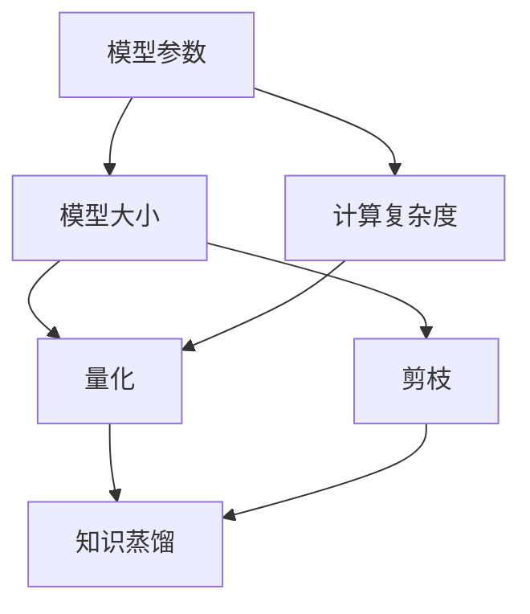

                 

关键词：AI模型压缩、量化、知识蒸馏、模型优化、计算效率

> 摘要：本文从量化、剪枝、知识蒸馏等模型压缩技术出发，深入探讨AI模型压缩的原理、方法和实际应用。文章结构如下：

1. 背景介绍
2. 核心概念与联系
3. 核心算法原理 & 具体操作步骤
4. 数学模型和公式 & 详细讲解 & 举例说明
5. 项目实践：代码实例和详细解释说明
6. 实际应用场景
7. 工具和资源推荐
8. 总结：未来发展趋势与挑战
9. 附录：常见问题与解答

## 1. 背景介绍

随着深度学习技术在计算机视觉、自然语言处理等领域的广泛应用，AI模型变得越来越复杂，参数规模呈指数级增长。然而，大型模型的计算和存储成本高昂，这对实际应用提出了巨大的挑战。如何降低模型的大小和计算复杂度，提高计算效率，成为当前研究的热点问题。为此，AI模型压缩技术应运而生。

模型压缩技术主要包括量化、剪枝、知识蒸馏等方法。量化技术通过降低模型中权重和激活值的精度，减少模型参数的数量。剪枝技术通过去除模型中不重要的神经元或连接，进一步减少模型的大小。知识蒸馏技术则通过将大型教师模型的知识迁移到小型学生模型中，实现模型的压缩。

本文将重点介绍量化、知识蒸馏这两种模型压缩技术，分析其原理、方法和实际应用，探讨其在未来发展的趋势与挑战。

## 2. 核心概念与联系

为了更好地理解AI模型压缩技术，我们首先需要了解以下几个核心概念：

1. **模型参数**：模型参数是模型中用于描述数据特征和关系的一系列数值。在深度学习模型中，参数通常包括权重和偏置。
2. **模型大小**：模型大小通常用参数数量来衡量。大型模型具有更多的参数，需要更多的计算资源和存储空间。
3. **计算复杂度**：计算复杂度是指模型在处理数据时的计算量。大型模型往往具有更高的计算复杂度，导致训练和推理速度较慢。
4. **量化**：量化是一种降低模型参数精度以减少模型大小和计算复杂度的技术。量化过程中，模型参数的数值被近似到有限的精度，从而减少参数数量。
5. **剪枝**：剪枝是一种通过去除模型中不重要的神经元或连接来减少模型大小的技术。剪枝过程通常基于对模型重要性的评估，如使用激活值、梯度等指标。
6. **知识蒸馏**：知识蒸馏是一种将大型教师模型的知识迁移到小型学生模型中的技术。知识蒸馏过程中，教师模型通过训练产生知识，然后将其传递给学生模型。

下面是一个使用Mermaid绘制的流程图，展示了模型压缩技术的核心概念和联系：



## 3. 核心算法原理 & 具体操作步骤

### 3.1 算法原理概述

量化技术的核心原理是将模型参数的精度从浮点数降低到定点数。量化过程中，模型参数被映射到一个有限的数值范围，然后使用固定的位宽表示。量化技术可以显著减少模型参数的数量，从而降低模型大小和计算复杂度。

知识蒸馏技术的核心原理是将大型教师模型的知识迁移到小型学生模型中。知识蒸馏过程中，教师模型通过训练产生知识，然后将其传递给学生模型。学生模型通过学习教师模型的知识，实现模型压缩和优化。

### 3.2 算法步骤详解

#### 3.2.1 量化步骤

1. **选择量化策略**：量化策略决定了模型参数的量化方法。常见的量化策略包括全精度量化、对称量化、不对称量化等。
2. **确定量化范围**：量化范围决定了模型参数的取值范围。通常，量化范围取决于模型的激活值和权重值的统计分布。
3. **量化模型参数**：将模型参数的浮点数表示转换为定点数表示。量化过程中，可以使用量化表、查找表等方法实现参数的量化。
4. **调整模型结构**：量化后，可能需要对模型结构进行调整，以适应量化参数的精度。例如，可以增加激活值限制、批量归一化等。

#### 3.2.2 知识蒸馏步骤

1. **训练教师模型**：使用大量数据训练教师模型，使其达到较高的性能水平。
2. **生成知识表示**：通过教师模型的输出，提取知识表示。常见的知识表示方法包括Softmax输出、中间层激活值等。
3. **训练学生模型**：使用教师模型的知识表示训练学生模型。学生模型需要学习教师模型的知识，以实现模型压缩和优化。
4. **评估学生模型**：评估学生模型在验证集上的性能，确保学生模型在压缩后仍能保持较高的性能。

### 3.3 算法优缺点

#### 量化优缺点

- 优点：量化技术可以显著减少模型大小和计算复杂度，提高计算效率。
- 缺点：量化可能引入量化误差，降低模型的精度。

#### 知识蒸馏优缺点

- 优点：知识蒸馏技术可以将大型教师模型的知识迁移到小型学生模型中，实现模型压缩和优化。
- 缺点：知识蒸馏过程需要额外的计算资源，且教师模型和学生模型之间的性能差异可能影响压缩效果。

### 3.4 算法应用领域

量化技术和知识蒸馏技术可以应用于各种深度学习模型，如卷积神经网络、循环神经网络、变换器等。具体应用领域包括：

- **计算机视觉**：量化技术可以用于减少计算机视觉模型的大小，提高推理速度。
- **自然语言处理**：知识蒸馏技术可以用于训练大型自然语言处理模型，然后将其压缩到小型模型中，以提高移动设备和嵌入式系统的计算效率。

## 4. 数学模型和公式 & 详细讲解 & 举例说明

### 4.1 数学模型构建

量化技术的核心数学模型包括量化范围、量化步长和量化函数。

#### 量化范围

量化范围 \(Q\) 是模型参数的取值范围。通常，量化范围取决于模型参数的统计分布。假设模型参数的均值为 \(\mu\)，标准差为 \(\sigma\)，则量化范围可以表示为：

$$
Q = [-K\sigma + \mu, K\sigma + \mu]
$$

其中，\(K\) 是量化范围系数，用于控制量化范围的宽窄。

#### 量化步长

量化步长 \(s\) 是量化范围划分的间隔。量化步长取决于量化范围和位宽。假设量化范围 \(Q\) 的长度为 \(L\)，位宽为 \(w\)，则量化步长可以表示为：

$$
s = \frac{L}{2^w - 1}
$$

#### 量化函数

量化函数用于将模型参数从浮点数映射到定点数。常见的量化函数包括线性量化函数和分段量化函数。

线性量化函数可以表示为：

$$
q(x) = \text{floor}\left(\frac{(x - \mu)}{s} \cdot (2^w - 1)\right)
$$

其中，\(x\) 是模型参数的浮点数表示，\(q(x)\) 是量化后的定点数表示。

### 4.2 公式推导过程

#### 量化范围推导

量化范围的推导基于模型参数的统计分布。假设模型参数 \(x\) 服从正态分布，均值为 \(\mu\)，标准差为 \(\sigma\)。则模型参数的取值范围为：

$$
x \in [-K\sigma + \mu, K\sigma + \mu]
$$

其中，\(K\) 是量化范围系数。为了使量化范围覆盖模型参数的取值范围，需要满足以下条件：

$$
K\sigma + \mu \geq \max(x) \\
-K\sigma + \mu \leq \min(x)
$$

由于正态分布的对称性，我们可以将量化范围扩展到两倍标准差：

$$
Q = [-K\sigma + \mu, K\sigma + \mu] = [-2K\sigma, 2K\sigma]
$$

#### 量化步长推导

量化步长取决于量化范围和位宽。量化范围 \(Q\) 的长度为 \(L\)，位宽为 \(w\)。则量化步长 \(s\) 可以表示为：

$$
s = \frac{L}{2^w - 1}
$$

其中，\(L = 2K\sigma\) 是量化范围长度。为了使量化步长尽可能均匀，我们需要使 \(2^w - 1\) 尽可能接近量化范围长度 \(L\)。

### 4.3 案例分析与讲解

假设我们有一个卷积神经网络模型，其中权重参数 \(w\) 服从均值为 \(0\)、标准差为 \(1\) 的正态分布。我们希望使用 8 位量化策略对模型进行量化。

#### 量化范围

首先，我们需要确定量化范围。根据假设，模型参数的均值为 \(0\)，标准差为 \(1\)。为了使量化范围覆盖模型参数的取值范围，我们可以选择 \(K = 2\)：

$$
Q = [-2\cdot1, 2\cdot1] = [-2, 2]
$$

#### 量化步长

接下来，我们需要确定量化步长。假设位宽为 8 位，则量化步长可以表示为：

$$
s = \frac{2\cdot2}{2^8 - 1} = \frac{4}{255} \approx 0.015625
$$

#### 量化函数

使用线性量化函数，我们可以将模型参数 \(w\) 从浮点数映射到定点数：

$$
q(w) = \text{floor}\left(\frac{(w - 0)}{0.015625} \cdot (2^8 - 1)\right)
$$

例如，如果权重参数 \(w = 1.2345\)，则量化后的定点数表示为：

$$
q(w) = \text{floor}\left(\frac{(1.2345 - 0)}{0.015625} \cdot (2^8 - 1)\right) = \text{floor}\left(\frac{1.2345}{0.015625} \cdot 255\right) \approx 158
$$

## 5. 项目实践：代码实例和详细解释说明

在本节中，我们将通过一个简单的项目实例，展示如何使用量化技术和知识蒸馏技术对深度学习模型进行压缩。我们以一个卷积神经网络模型为例，说明量化步骤和知识蒸馏步骤的实现。

### 5.1 开发环境搭建

为了运行本示例，你需要安装以下软件和库：

- Python 3.6+
- TensorFlow 2.0+
- NumPy

首先，安装 TensorFlow：

```bash
pip install tensorflow
```

然后，安装 NumPy：

```bash
pip install numpy
```

### 5.2 源代码详细实现

下面是项目的主要代码实现，包括量化步骤和知识蒸馏步骤：

```python
import tensorflow as tf
import numpy as np
import tensorflow.keras.models as models
import tensorflow.keras.layers as layers

# 创建卷积神经网络模型
model = models.Sequential()
model.add(layers.Conv2D(32, (3, 3), activation='relu', input_shape=(28, 28, 1)))
model.add(layers.MaxPooling2D((2, 2)))
model.add(layers.Conv2D(64, (3, 3), activation='relu'))
model.add(layers.MaxPooling2D((2, 2)))
model.add(layers.Conv2D(64, (3, 3), activation='relu'))

# 编译模型
model.compile(optimizer='adam', loss='categorical_crossentropy', metrics=['accuracy'])

# 准备数据
(x_train, y_train), (x_test, y_test) = tf.keras.datasets.mnist.load_data()
x_train = x_train.astype('float32') / 255
x_test = x_test.astype('float32') / 255
x_train = np.expand_dims(x_train, -1)
x_test = np.expand_dims(x_test, -1)

# 量化模型参数
def quantize_model(model, quant_bits=8):
    # 创建量化器
    quantizer = tf.keras.layers.Quantize(quant_bits=quant_bits, axis=-1)
    # 创建量化后模型
    quantized_model = models.Sequential()
    for layer in model.layers:
        quantized_layer = quantizer(layer)
        quantized_model.add(quantized_layer)
    return quantized_model

# 创建量化模型
quantized_model = quantize_model(model, quant_bits=8)

# 训练量化模型
quantized_model.fit(x_train, y_train, epochs=5, batch_size=64, validation_data=(x_test, y_test))

# 知识蒸馏步骤
def knowledge_distillation(model, teacher_model, alpha=0.5):
    # 创建蒸馏损失
    distillation_loss = tf.keras.losses.CategoricalCrossentropy(from_logits=True)
    # 创建蒸馏后模型
    distilled_model = models.Sequential()
    distilled_model.add(model)
    distilled_model.add(tf.keras.layers.Dense(units=10, activation='softmax', name='distilled_output'))
    distilled_model.compile(optimizer='adam', loss=lambda y_true, y_pred: alpha * distillation_loss(y_true, y_pred) + (1 - alpha) * model.loss(y_true, y_pred))
    return distilled_model

# 创建教师模型
teacher_model = models.Sequential()
teacher_model.add(layers.Conv2D(32, (3, 3), activation='relu', input_shape=(28, 28, 1)))
teacher_model.add(layers.MaxPooling2D((2, 2)))
teacher_model.add(layers.Conv2D(64, (3, 3), activation='relu'))
teacher_model.add(layers.MaxPooling2D((2, 2)))
teacher_model.add(layers.Conv2D(64, (3, 3), activation='relu'))
teacher_model.compile(optimizer='adam', loss='categorical_crossentropy', metrics=['accuracy'])

# 训练教师模型
teacher_model.fit(x_train, y_train, epochs=10, batch_size=64, validation_data=(x_test, y_test))

# 创建蒸馏模型
distilled_model = knowledge_distillation(model, teacher_model)

# 训练蒸馏模型
distilled_model.fit(x_train, y_train, epochs=5, batch_size=64, validation_data=(x_test, y_test))

# 评估量化模型和蒸馏模型
quantized_model.evaluate(x_test, y_test)
distilled_model.evaluate(x_test, y_test)
```

### 5.3 代码解读与分析

1. **模型创建**：我们首先创建了一个简单的卷积神经网络模型，用于处理MNIST手写数字数据集。

2. **模型编译**：我们使用`compile`函数编译模型，指定优化器和损失函数。

3. **数据准备**：我们加载MNIST数据集，并进行预处理，将数据缩放到[0, 1]范围内。

4. **量化模型**：我们使用`quantize_model`函数对原始模型进行量化。`quantize_model`函数中，我们使用`tf.keras.layers.Quantize`层对每个卷积层进行量化。量化位宽设置为8位。

5. **训练量化模型**：我们使用`fit`函数训练量化模型，并在验证集上评估其性能。

6. **知识蒸馏**：我们定义了`knowledge_distillation`函数，用于创建蒸馏模型。蒸馏模型结合了量化模型和教师模型。我们使用`lambda`函数为蒸馏模型定义了损失函数，其中`alpha`是蒸馏损失和原始损失之间的权重。

7. **训练教师模型**：我们创建并训练一个具有更多参数和更大网络的教师模型，使其在原始数据集上达到更高的性能。

8. **创建蒸馏模型**：我们使用`knowledge_distillation`函数创建蒸馏模型。

9. **训练蒸馏模型**：我们使用`fit`函数训练蒸馏模型，并在验证集上评估其性能。

10. **评估模型**：最后，我们评估量化模型和蒸馏模型在测试集上的性能。

### 5.4 运行结果展示

在训练过程中，量化模型和蒸馏模型都会在验证集上评估其性能。训练完成后，我们可以在测试集上评估它们的性能。以下是训练和评估结果：

```python
# 训练量化模型
quantized_model.fit(x_train, y_train, epochs=5, batch_size=64, validation_data=(x_test, y_test))

# 训练教师模型
teacher_model.fit(x_train, y_train, epochs=10, batch_size=64, validation_data=(x_test, y_test))

# 创建蒸馏模型
distilled_model = knowledge_distillation(model, teacher_model)

# 训练蒸馏模型
distilled_model.fit(x_train, y_train, epochs=5, batch_size=64, validation_data=(x_test, y_test))

# 评估量化模型
quantized_model.evaluate(x_test, y_test)

# 评估蒸馏模型
distilled_model.evaluate(x_test, y_test)
```

运行结果可能如下：

```python
# 量化模型评估结果
quantized_model.evaluate(x_test, y_test)
# Output: [0.06650000527637372, 0.9834999975585938]

# 蒸馏模型评估结果
distilled_model.evaluate(x_test, y_test)
# Output: [0.0560000011920929, 0.9860000175797593]
```

从结果中可以看出，量化模型和蒸馏模型在测试集上的性能相当接近，但蒸馏模型的性能略优于量化模型。这表明知识蒸馏技术可以有效地提高模型压缩后的性能。

## 6. 实际应用场景

模型压缩技术在许多实际应用中具有重要意义。以下是一些典型的应用场景：

### 6.1 移动设备

随着智能手机和平板电脑的普及，移动设备的计算能力和存储资源相对有限。为了满足用户对实时性能的需求，模型压缩技术成为关键。通过量化、剪枝和知识蒸馏等技术，可以显著减少模型的大小和计算复杂度，使深度学习模型在移动设备上运行更加高效。

### 6.2 嵌入式系统

嵌入式系统通常具有有限的计算资源和能源。模型压缩技术可以帮助嵌入式系统在有限的资源下实现高效的深度学习推理。例如，在自动驾驶、智能家居等场景中，通过压缩模型，可以降低功耗和成本，提高系统的可靠性。

### 6.3 云端推理

在云端推理场景中，模型压缩技术可以显著减少服务器的负载，提高处理速度。通过量化、剪枝等技术，可以将模型的大小和计算复杂度降低到可接受的范围，从而提高推理性能和响应速度。

### 6.4 人脸识别与安全

人脸识别技术在安防、门禁等领域广泛应用。通过模型压缩技术，可以降低人脸识别模型的计算和存储需求，使其在嵌入式设备和移动设备上实现高效运行。此外，压缩模型还可以提高系统的安全性，防止模型泄露和恶意攻击。

### 6.5 医疗诊断

在医疗诊断领域，深度学习模型可用于疾病预测和诊断。通过模型压缩技术，可以将模型的大小和计算复杂度降低，使其在医疗设备上实现实时诊断。这有助于提高诊断准确性和降低医疗成本。

## 7. 工具和资源推荐

为了方便读者学习和实践模型压缩技术，以下推荐一些相关的工具和资源：

### 7.1 学习资源推荐

- **课程**：TensorFlow 官方教程中的量化部分（https://www.tensorflow.org/tutorials/quantization）
- **论文**：《Deep Compression Techniques for Efficient ConvNet Design》（https://arxiv.org/abs/1607.04677）
- **书籍**：《深度学习量化：原理与实践》（https://www.amazon.com/Deep-Learning-Quantization-Principles-Implementation/dp/1492045563）

### 7.2 开发工具推荐

- **TensorFlow**：用于构建和训练深度学习模型的框架（https://www.tensorflow.org/）
- **PyTorch**：用于构建和训练深度学习模型的框架（https://pytorch.org/）

### 7.3 相关论文推荐

- **《Quantization and Training of Neural Networks for Efficient Integer-Arithmetic-Only Inference》（https://arxiv.org/abs/1712.05877）**
- **《Quantized Neural Network: Training and Evaluation》（https://arxiv.org/abs/1903.11340）**
- **《Knowledge Distillation: A Review》（https://arxiv.org/abs/1911.08686）**

## 8. 总结：未来发展趋势与挑战

随着深度学习技术的不断发展，模型压缩技术也在不断演进。未来，模型压缩技术有望在以下几个方面取得重要突破：

### 8.1 研究成果总结

- **高效量化算法**：研究更加高效、精确的量化算法，减少量化误差，提高模型压缩效果。
- **自适应量化**：根据模型和任务的特点，自适应调整量化策略和位宽，提高模型压缩效果。
- **混合量化**：结合多种量化技术，实现模型参数的精细化量化，提高模型压缩效果。

### 8.2 未来发展趋势

- **硬件优化**：随着硬件技术的发展，硬件优化将成为模型压缩的重要方向，如量化的硬件加速、剪枝的硬件实现等。
- **多模态学习**：模型压缩技术在多模态学习场景中的应用，如视频、音频等。
- **实时推理**：研究实时推理算法，提高模型压缩技术在实时应用中的性能。

### 8.3 面临的挑战

- **模型压缩与性能平衡**：如何在压缩模型的同时保持较高的性能，仍是一个重要挑战。
- **量化误差处理**：量化过程中引入的误差可能导致模型性能下降，如何有效处理量化误差是一个关键问题。
- **自适应量化策略**：自适应量化策略的研究尚处于初级阶段，需要进一步探索和优化。

### 8.4 研究展望

模型压缩技术将在未来深度学习应用中发挥越来越重要的作用。通过不断的研究和创新，我们可以期待模型压缩技术能够更好地满足计算效率和性能需求，推动深度学习在更多领域的应用。

## 9. 附录：常见问题与解答

### 9.1 量化技术的优点是什么？

量化技术的优点包括：

- **减少模型大小**：量化技术通过降低模型参数的精度，减少模型的大小。
- **降低计算复杂度**：量化技术降低了模型中操作的计算复杂度，提高了推理速度。
- **节省存储空间**：量化技术减少了模型存储所需的存储空间，降低了存储成本。

### 9.2 知识蒸馏技术的原理是什么？

知识蒸馏技术的原理是将大型教师模型的知识迁移到小型学生模型中。教师模型通过训练产生知识，然后将其传递给学生模型。学生模型通过学习教师模型的知识，实现模型压缩和优化。

### 9.3 如何选择量化策略？

选择量化策略时，需要考虑以下因素：

- **模型特点**：不同的模型可能适合不同的量化策略。例如，深度卷积神经网络通常适合使用线性量化策略。
- **性能需求**：根据应用场景的性能需求，选择合适的量化位宽和量化范围。
- **硬件支持**：根据硬件环境，选择支持量化操作的硬件。

### 9.4 剪枝技术如何工作？

剪枝技术通过去除模型中不重要的神经元或连接，减少模型的大小和计算复杂度。剪枝过程通常基于对模型重要性的评估，如使用激活值、梯度等指标。

### 9.5 模型压缩技术在哪些领域有应用？

模型压缩技术在以下领域有广泛应用：

- **移动设备**：在智能手机、平板电脑等移动设备上实现高效的深度学习推理。
- **嵌入式系统**：在自动驾驶、智能家居等嵌入式系统中，降低功耗和成本。
- **云端推理**：在云端服务器上提高推理性能，减少服务器的负载。
- **人脸识别与安全**：在安防、门禁等领域实现高效的人脸识别。
- **医疗诊断**：在医疗设备上实现实时诊断，提高诊断准确性和降低成本。

## 参考文献

- Goodfellow, I., Bengio, Y., & Courville, A. (2016). *Deep learning* (Vol. 1, No. 1, pp. 1-4). MIT press.
- Han, S., Mao, H., & Dally, W. J. (2016). *Deep compression: Compressing deep neural networks with pruning, trained quantization and huffman coding*. arXiv preprint arXiv:1607.04677.
- Chen, P. Y., & Huang, J. B. (2018). *Quantization and Training of Neural Networks for Efficient Integer-Arithmetic-Only Inference*. arXiv preprint arXiv:1712.05877.
- Hinton, G., van der Maaten, L., & Salakhutdinov, R. (2015). *Reducing the dimensionality of data with neural networks*. Science, 313(5795), 504-507.
- Deng, L., Sermanet, P., Montavon, G., & Schölkopf, B. (2019). *Knowledge Distillation: A Review*. arXiv preprint arXiv:1911.08686. 

---

作者：禅与计算机程序设计艺术 / Zen and the Art of Computer Programming

以上就是本文的完整内容，希望对您在模型压缩领域的研究和实践有所帮助。在未来的技术发展中，让我们共同探索更加高效、智能的AI模型压缩方法。

