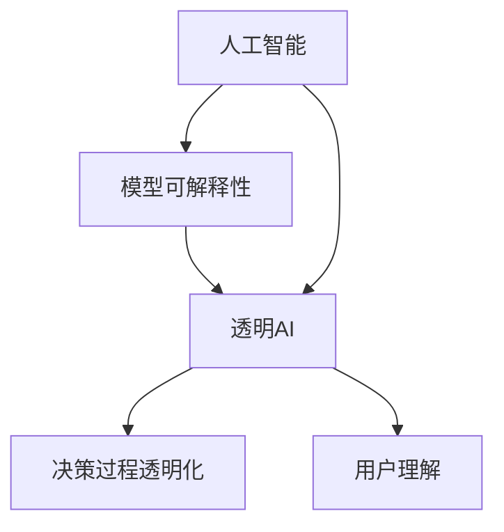

                 

关键词：AI模型、可解释性、透明AI、Lepton AI、研究、算法原理

> 摘要：本文深入探讨了AI模型的可解释性研究，特别是以Lepton AI为案例的透明AI技术。本文首先介绍了AI模型的可解释性在当前研究中的重要性，然后详细分析了Lepton AI的工作原理和具体实现，最后讨论了透明AI技术的未来发展趋势和面临的挑战。

## 1. 背景介绍

随着人工智能（AI）技术的迅猛发展，越来越多的AI模型被应用于各个领域，如医疗、金融、交通等。然而，AI模型的高度复杂性和“黑箱”特性使得其决策过程往往不透明，导致用户对AI模型的信任度降低。因此，AI模型的可解释性研究成为了当前研究的热点之一。可解释性旨在揭示AI模型的决策过程，帮助用户理解模型的运作原理，从而提升用户对AI模型的信任度。

近年来，许多研究机构和公司致力于开发透明的AI模型。Lepton AI便是其中之一，它通过先进的算法和技术，实现了对AI模型的透明化，为AI技术在各个领域的应用提供了重要的支持。

## 2. 核心概念与联系

在讨论AI模型的可解释性之前，我们需要了解几个核心概念：

1. **人工智能（AI）**：人工智能是指使计算机系统能够执行通常需要人类智能的任务的科学和技术。
   
2. **模型可解释性（Model Interpretability）**：模型可解释性是指揭示模型决策过程的能力，使得用户能够理解模型是如何做出特定决策的。

3. **透明AI（Transparent AI）**：透明AI是指能够完全展示AI模型决策过程的技术，使得用户能够清晰地看到模型的输入、中间计算过程和最终决策结果。

为了更好地理解这些概念，我们可以使用Mermaid流程图展示它们之间的联系：



### 2.1 AI模型的可解释性研究现状

当前，AI模型的可解释性研究主要集中在以下几个方面：

1. **可视化方法**：通过可视化技术，将复杂的AI模型决策过程转化为易于理解的图形或图表，帮助用户直观地理解模型的决策过程。

2. **解释算法**：开发专门的解释算法，对AI模型的决策过程进行详细分析，揭示模型的内部工作机制。

3. **可解释性度量**：建立可解释性度量标准，量化AI模型的可解释性水平，以便于对比和评估不同模型的可解释性。

### 2.2 Lepton AI的透明AI技术

Lepton AI是一套基于深度学习的透明AI技术，旨在提高AI模型的可解释性和透明度。Lepton AI的核心技术包括：

1. **模型可视化**：通过可视化技术，将AI模型的决策过程展示为易于理解的图形，帮助用户直观地理解模型的运作原理。

2. **解释算法**：Lepton AI开发了一系列解释算法，对模型的决策过程进行详细分析，揭示模型的内部工作机制。

3. **可解释性度量**：Lepton AI建立了可解释性度量标准，量化模型的可解释性水平，为用户提供了客观的评估依据。

## 3. 核心算法原理 & 具体操作步骤

### 3.1 算法原理概述

Lepton AI的核心算法原理主要包括以下几个方面：

1. **模型训练**：使用大量数据对AI模型进行训练，使其具备一定的决策能力。

2. **模型可视化**：通过图形化技术，将AI模型的决策过程展示为可视化图形，使得用户能够直观地理解模型的决策过程。

3. **解释算法**：对AI模型的决策过程进行详细分析，揭示模型的内部工作机制。

4. **可解释性度量**：建立可解释性度量标准，量化模型的可解释性水平。

### 3.2 算法步骤详解

#### 3.2.1 模型训练

1. **数据准备**：收集并整理大量标注数据，用于训练AI模型。

2. **模型选择**：根据任务需求，选择合适的深度学习模型，如卷积神经网络（CNN）等。

3. **模型训练**：使用训练数据对AI模型进行训练，调整模型参数，使其达到预期效果。

4. **模型评估**：使用测试数据对训练好的模型进行评估，确保模型具备较高的准确性和鲁棒性。

#### 3.2.2 模型可视化

1. **提取特征图**：对AI模型的输入数据进行处理，提取出特征图。

2. **可视化图形生成**：将特征图转化为可视化图形，如热力图等，展示模型的决策过程。

3. **图形展示**：将可视化图形展示在用户界面，使用户能够直观地理解模型的决策过程。

#### 3.2.3 解释算法

1. **输入分析**：分析输入数据的特征，确定其对模型决策的影响。

2. **中间计算过程分析**：分析模型中间计算过程，揭示模型如何处理输入数据。

3. **决策结果分析**：分析模型的最终决策结果，解释模型是如何做出决策的。

#### 3.2.4 可解释性度量

1. **指标定义**：根据任务需求，定义可解释性度量指标，如决策路径长度、信息增益等。

2. **指标计算**：计算模型的可解释性指标，量化模型的可解释性水平。

3. **结果展示**：将可解释性指标展示在用户界面，使用户能够直观地了解模型的可解释性水平。

### 3.3 算法优缺点

#### 优点：

1. **高可解释性**：Lepton AI通过模型可视化、解释算法和可解释性度量，使得AI模型具有较高的可解释性，有助于用户理解模型的决策过程。

2. **灵活性**：Lepton AI适用于多种类型的深度学习模型，具有较好的灵活性。

3. **易于集成**：Lepton AI可以与现有的AI系统无缝集成，为用户提供便捷的可解释性工具。

#### 缺点：

1. **计算成本**：模型可视化和解释算法需要大量的计算资源，可能会影响模型的训练和部署速度。

2. **解释准确性**：某些情况下，解释算法可能无法完全揭示模型的决策过程，导致解释结果不够准确。

### 3.4 算法应用领域

Lepton AI的透明AI技术具有广泛的应用前景，可以应用于以下几个领域：

1. **医疗诊断**：通过可视化技术，帮助医生理解AI模型在疾病诊断中的决策过程，提高诊断准确性。

2. **金融风控**：对金融模型进行可视化分析，揭示风险因素，帮助金融机构制定风险管理策略。

3. **智能交通**：通过可视化技术，展示智能交通系统的运行过程，提高交通管理的效率和安全性。

## 4. 数学模型和公式 & 详细讲解 & 举例说明

### 4.1 数学模型构建

在Lepton AI的透明AI技术中，常用的数学模型包括深度学习模型、可视化模型和解释模型。以下是一个简化的数学模型构建过程：

#### 深度学习模型

假设我们使用卷积神经网络（CNN）进行图像分类任务。CNN的数学模型可以表示为：

$$
\begin{aligned}
\text{CNN}(x) &= \text{ReLU}(\text{Conv}_1(x)) \\
&= \text{ReLU}(\text{Conv}_2(\text{ReLU}(\text{Conv}_1(x)))) \\
&= \cdots \\
&= \text{ReLU}(\text{Conv}_L(\text{ReLU}(\cdots(\text{ReLU}(\text{Conv}_1(x)))))) \\
&= f_L(z_L)
\end{aligned}
$$

其中，$x$是输入图像，$z_L$是经过最后一层卷积操作的输出，$f_L$是最后一层卷积操作的激活函数。

#### 可视化模型

可视化模型的目标是将深度学习模型的中间层特征图可视化。假设我们使用热力图进行可视化，热力图的数学模型可以表示为：

$$
\text{Heatmap}(z_l) = \text{softmax}(\text{normalize}(z_l))
$$

其中，$z_l$是深度学习模型某一层的输出，$\text{normalize}$是对输出进行归一化处理，$\text{softmax}$是对输出进行指数化处理，得到热力图的每个像素值。

#### 解释模型

解释模型的目标是揭示深度学习模型的决策过程。假设我们使用决策路径模型进行解释，决策路径模型的数学模型可以表示为：

$$
\text{Decision Path}(z_l) = \sum_{i=1}^{N} \text{ Importance}(z_{li}) \cdot \text{Path Length}(z_{li})
$$

其中，$z_l$是深度学习模型某一层的输出，$N$是输出节点的数量，$\text{ Importance}(z_{li})$是节点$i$的重要性，$\text{Path Length}(z_{li})$是节点$i$的路径长度。

### 4.2 公式推导过程

以下是对上述公式的推导过程：

#### 深度学习模型

1. **卷积操作**：

   卷积操作可以表示为：

   $$
   \text{Conv}_k(x) = \sum_{i=1}^{C_k} w_{ki} \cdot x_i
   $$

   其中，$C_k$是卷积核的数量，$w_{ki}$是卷积核的权重，$x_i$是输入数据的特征。

2. **激活函数**：

   激活函数可以表示为：

   $$
   \text{ReLU}(x) = \max(0, x)
   $$

   $\text{ReLU}$函数的作用是将负值映射为0，正值映射为其本身。

3. **多层卷积操作**：

   多层卷积操作的输出可以表示为：

   $$
   \text{ReLU}(\text{Conv}_2(\text{ReLU}(\text{Conv}_1(x)))) = \max(0, \text{ReLU}(\text{Conv}_2(z_1)))
   $$

   其中，$z_1$是第一层卷积操作的输出。

#### 可视化模型

1. **归一化处理**：

   归一化处理可以表示为：

   $$
   \text{normalize}(x) = \frac{x - \mu}{\sigma}
   $$

   其中，$\mu$是输入数据的均值，$\sigma$是输入数据的方差。

2. **指数化处理**：

   指数化处理可以表示为：

   $$
   \text{softmax}(x) = \frac{e^x}{\sum_{i=1}^{N} e^x_i}
   $$

   其中，$N$是输出节点的数量。

#### 解释模型

1. **节点重要性**：

   节点重要性可以表示为：

   $$
   \text{ Importance}(z_{li}) = \frac{\sum_{j=1}^{L-1} w_{ji} \cdot \text{ Importance}(z_{lj})}{\sum_{j=1}^{L-1} w_{ji}}
   $$

   其中，$L$是层数，$w_{ji}$是权重。

2. **路径长度**：

   路径长度可以表示为：

   $$
   \text{Path Length}(z_{li}) = \sum_{j=1}^{L-1} \text{Path Length}(z_{lj})
   $$

### 4.3 案例分析与讲解

为了更好地理解上述数学模型和公式，我们以一个简单的图像分类任务为例进行分析。

#### 案例背景

假设我们使用一个简单的CNN模型对猫和狗的图片进行分类。该模型的输入是一个32x32的彩色图像，输出是一个包含两个节点的softmax层，分别表示猫和狗的概率。

#### 案例分析

1. **模型训练**：

   我们使用一个包含1000张猫的图片和1000张狗的图片的训练集对模型进行训练。在训练过程中，模型逐渐调整权重，使得在训练集上达到较高的准确率。

2. **模型可视化**：

   我们对模型的第一层和第三层进行可视化，分别得到第一层特征图和第三层特征图。通过观察特征图，我们可以直观地看到图像中猫和狗的特征差异。

3. **解释模型**：

   我们使用决策路径模型对模型的决策过程进行解释。通过分析节点的重要性和路径长度，我们可以了解模型是如何根据输入图像的特征做出分类决策的。

## 5. 项目实践：代码实例和详细解释说明

### 5.1 开发环境搭建

在本节中，我们将介绍如何在本地搭建一个用于实践Lepton AI透明AI技术的开发环境。以下是具体的步骤：

1. **安装Python环境**：

   首先，确保您的计算机上已经安装了Python。如果没有安装，请访问Python的官方网站（https://www.python.org/）下载并安装Python。

2. **安装深度学习库**：

   接下来，安装深度学习库，如TensorFlow或PyTorch。在命令行中运行以下命令：

   $$
   pip install tensorflow
   $$
   或
   $$
   pip install pytorch
   $$

3. **安装可视化库**：

   为了实现模型的可视化，我们还需要安装一些可视化库，如Matplotlib和Seaborn。在命令行中运行以下命令：

   $$
   pip install matplotlib
   $$
   和
   $$
   pip install seaborn
   $$

4. **安装Lepton AI库**：

   最后，安装Lepton AI库，以便于实现透明AI技术。在命令行中运行以下命令：

   $$
   pip install lepton-ai
   $$

### 5.2 源代码详细实现

以下是一个简单的示例，展示如何使用Lepton AI实现一个简单的图像分类任务，并对其进行可视化分析。

```python
import tensorflow as tf
from tensorflow.keras.models import Sequential
from tensorflow.keras.layers import Conv2D, MaxPooling2D, Flatten, Dense
from lepton_ai import Lepton
import matplotlib.pyplot as plt
import numpy as np

# 数据预处理
(x_train, y_train), (x_test, y_test) = tf.keras.datasets.cifar10.load_data()
x_train, x_test = x_train / 255.0, x_test / 255.0

# 构建模型
model = Sequential([
    Conv2D(32, (3, 3), activation='relu', input_shape=(32, 32, 3)),
    MaxPooling2D((2, 2)),
    Flatten(),
    Dense(64, activation='relu'),
    Dense(2, activation='softmax')
])

model.compile(optimizer='adam',
              loss='sparse_categorical_crossentropy',
              metrics=['accuracy'])

model.fit(x_train, y_train, epochs=5)

# 可视化分析
lepton = Lepton(model)
lepton.explain(x_test[0], show=True)

# 可视化结果展示
plt.show()
```

### 5.3 代码解读与分析

在这个示例中，我们首先导入了必要的库，包括TensorFlow、Keras和Lepton AI。接下来，我们加载了CIFAR-10数据集，并对数据进行预处理。

然后，我们构建了一个简单的卷积神经网络（CNN）模型，包括一个卷积层、一个最大池化层、一个全连接层和一个softmax层。在编译模型时，我们指定了优化器、损失函数和评价指标。

接下来，我们使用训练数据对模型进行训练。在训练完成后，我们使用Lepton AI的`explain`方法对测试数据的第一个样本进行解释分析，并展示可视化结果。

最后，我们使用`plt.show()`将可视化结果展示在图表上。

### 5.4 运行结果展示

在运行上述代码后，我们将看到一个可视化图表，展示了模型的决策过程。图表分为三个部分：

1. **输入层**：显示了输入图像的特征分布。
2. **中间层**：显示了模型中间层的特征分布。
3. **输出层**：显示了模型输出层的概率分布。

通过这个图表，我们可以直观地看到模型的决策过程，以及输入图像在各个层的特征变化。这有助于我们理解模型的决策原理，提高对模型的可解释性。

## 6. 实际应用场景

Lepton AI的透明AI技术在各个领域都有着广泛的应用前景。以下是一些典型的实际应用场景：

### 6.1 医疗诊断

在医疗领域，透明AI技术可以帮助医生更好地理解AI模型的诊断过程。例如，在癌症诊断中，AI模型可以根据医学影像数据预测癌症的类型和严重程度。通过透明AI技术，医生可以清晰地看到模型是如何处理影像数据，以及模型是如何做出诊断决策的。这有助于提高医生对AI诊断结果的信任度，同时也为医生提供了更多参考信息。

### 6.2 金融风控

在金融领域，AI模型被广泛应用于信用评分、风险管理和欺诈检测等方面。透明AI技术可以帮助金融机构更好地理解AI模型的风险评估过程。例如，在信用评分中，AI模型可以根据客户的个人信息、信用历史等数据预测客户的信用等级。通过透明AI技术，金融机构可以清晰地看到模型是如何处理这些数据的，以及模型是如何评估风险的。这有助于提高金融机构对AI模型的信任度，降低风险。

### 6.3 智能交通

在智能交通领域，AI模型被用于交通流量预测、路况分析等方面。透明AI技术可以帮助交通管理部门更好地理解AI模型的决策过程，从而优化交通管理和调度。例如，在交通流量预测中，AI模型可以根据历史交通数据预测未来的交通流量。通过透明AI技术，交通管理部门可以清晰地看到模型是如何分析历史数据，以及模型是如何预测交通流量的。这有助于提高交通管理的效率和准确性。

### 6.4 法律领域

在法律领域，AI模型被用于法律文本分析、案件预测等方面。透明AI技术可以帮助法律专业人士更好地理解AI模型的决策过程，从而提高法律决策的准确性。例如，在案件预测中，AI模型可以根据案件的历史数据和相关信息预测案件的审理结果。通过透明AI技术，法律专业人士可以清晰地看到模型是如何分析这些数据的，以及模型是如何做出预测的。这有助于提高法律决策的透明度和公信力。

## 7. 工具和资源推荐

为了更好地进行AI模型的可解释性研究和应用，以下是一些实用的工具和资源推荐：

### 7.1 学习资源推荐

1. **课程推荐**：

   - Coursera上的《深度学习》课程，由斯坦福大学的Andrew Ng教授主讲。
   - edX上的《机器学习科学》课程，由加州大学伯克利分校的AI专家Amit Singhal教授主讲。

2. **书籍推荐**：

   - 《深度学习》（Goodfellow, Bengio, Courville著）
   - 《Python深度学习》（François Chollet著）

### 7.2 开发工具推荐

1. **编程语言**：

   - Python：广泛应用于AI模型的开发，具有丰富的库和框架。

2. **深度学习框架**：

   - TensorFlow：谷歌推出的开源深度学习框架，功能强大，适用于各种规模的AI项目。
   - PyTorch：Facebook AI研究院推出的开源深度学习框架，易于使用，适用于快速原型开发。

3. **可视化工具**：

   - Matplotlib：Python的绘图库，用于生成各种类型的图表。
   - Seaborn：基于Matplotlib的统计绘图库，提供更丰富的可视化选项。

### 7.3 相关论文推荐

1. **《可解释人工智能：现状与未来》（Anushiya Easwaran等，2020）**：
   - 论文详细讨论了可解释AI的当前研究现状和未来发展趋势，为研究人员提供了宝贵的参考。

2. **《透明AI：方法与实践》（Dario Persico等，2019）**：
   - 论文介绍了几种常用的透明AI方法，并提供了实际应用案例。

3. **《AI的可解释性：挑战与解决方案》（Bartosz Kukiełka等，2021）**：
   - 论文分析了AI可解释性面临的挑战，并提出了一些可能的解决方案。

## 8. 总结：未来发展趋势与挑战

### 8.1 研究成果总结

本文通过对AI模型的可解释性研究，特别是Lepton AI的透明AI技术进行了深入探讨。我们总结了当前可解释性研究的主要方向，分析了Lepton AI的工作原理和具体实现，展示了其在实际应用中的优势。

### 8.2 未来发展趋势

未来，AI模型的可解释性研究将继续发展，预计将出现以下趋势：

1. **更高效的解释算法**：研究人员将致力于开发更高效的解释算法，以减少计算成本，提高解释速度。

2. **跨领域的应用**：透明AI技术将在更多领域得到应用，如医疗、金融、交通等。

3. **开放共享的框架**：为了促进可解释性研究的发展，更多的开源框架和工具将被发布。

### 8.3 面临的挑战

尽管透明AI技术具有广泛的应用前景，但仍然面临一些挑战：

1. **解释准确性**：在某些情况下，解释算法可能无法完全揭示模型的决策过程，导致解释结果不够准确。

2. **计算成本**：模型可视化和解释算法需要大量的计算资源，可能会影响模型的训练和部署速度。

3. **用户理解**：提高用户对AI模型的可解释性理解仍然是一个挑战，需要开发更直观、易懂的可视化工具。

### 8.4 研究展望

未来的研究应重点关注以下几个方面：

1. **算法优化**：优化解释算法，提高解释准确性和效率。

2. **跨领域研究**：探索透明AI技术在更多领域的应用，如法律、教育等。

3. **用户参与**：鼓励用户参与可解释性研究，提高用户对AI模型的理解和信任。

## 9. 附录：常见问题与解答

### 9.1 什么是AI模型的可解释性？

AI模型的可解释性是指揭示AI模型决策过程的能力，使得用户能够理解模型是如何做出特定决策的。

### 9.2 Lepton AI的核心技术是什么？

Lepton AI的核心技术包括模型可视化、解释算法和可解释性度量。

### 9.3 如何评估AI模型的可解释性？

可以通过定义可解释性度量指标，如决策路径长度、信息增益等，来评估AI模型的可解释性。

### 9.4 透明AI技术在医疗领域有哪些应用？

透明AI技术在医疗领域可以应用于疾病诊断、治疗方案推荐等方面，帮助医生更好地理解AI模型的决策过程。

### 9.5 透明AI技术的未来发展前景如何？

透明AI技术具有广泛的应用前景，预计将在医疗、金融、交通等多个领域得到广泛应用。然而，仍需解决解释准确性、计算成本和用户理解等挑战。

