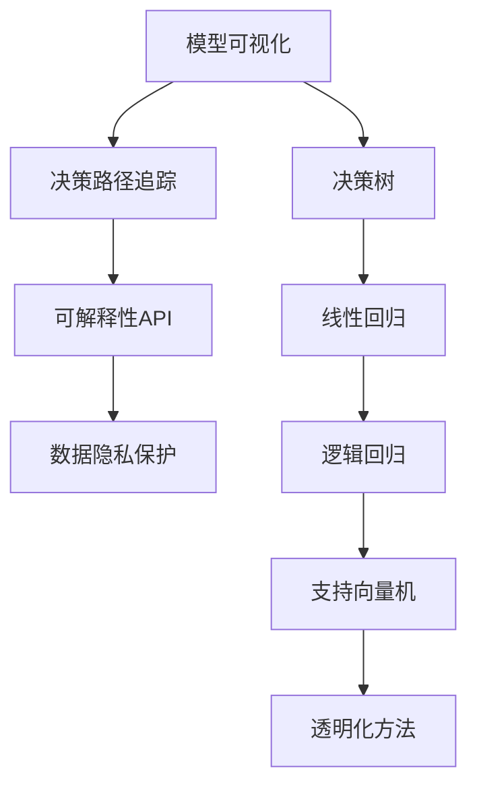

                 

关键词：AI模型，可解释性，透明化，Lepton AI，算法，数学模型，项目实践，应用场景，工具推荐，发展趋势，挑战

> 摘要：本文旨在探讨人工智能领域中的可解释性问题，特别是Lepton AI公司在透明化AI模型方面所做出的努力。通过深入分析AI模型可解释性的重要性、核心概念与联系，以及数学模型和公式，本文将展示Lepton AI在实现AI模型可解释性方面所采用的方法和策略。此外，还将探讨实际应用场景、未来发展趋势以及面临的挑战，并提供相应的工具和资源推荐。

## 1. 背景介绍

在人工智能（AI）飞速发展的今天，AI模型的应用已经渗透到各个领域，从医疗诊断到金融预测，从自动驾驶到智能家居。然而，随着AI模型的复杂度和应用范围不断增加，AI模型的可解释性问题也日益凸显。可解释性是AI模型的一个重要属性，它关系到模型能否被用户信任、监管机构和政策制定者能否理解和控制模型的行为。

Lepton AI公司是一家致力于提高AI模型可解释性的企业。公司成立于2010年，总部位于美国加利福尼亚州。Lepton AI通过其创新的算法和工具，旨在为用户提供透明、可解释的AI模型，从而解决AI模型在可信度和透明度方面的挑战。

本文将围绕Lepton AI在AI模型可解释性方面的努力，探讨其核心技术、数学模型、项目实践、应用场景、未来发展趋势以及面临的挑战。

### 1.1 AI模型可解释性的重要性

AI模型的可解释性对于其在现实世界中的应用至关重要。以下是AI模型可解释性的一些重要性：

- **用户信任**：用户通常更愿意使用他们能够理解和信任的AI模型。如果模型的行为不可解释，用户可能会感到不安，从而影响模型的接受度。
- **监管合规**：在许多领域，如医疗和金融，监管机构要求AI模型必须透明和可解释，以确保模型不会造成不当的伤害或损失。
- **错误调试**：在AI模型出现错误时，如果能够理解模型的决策过程，将有助于快速定位和修复错误。
- **算法改进**：通过对模型行为的深入理解，研究人员和开发者可以更有效地改进和优化模型。

### 1.2 Lepton AI的背景和目标

Lepton AI公司成立于2010年，由几位计算机科学家共同创立。公司的创始团队在计算机视觉和机器学习领域拥有丰富的经验。公司成立的初衷是解决AI模型的不可解释性问题，提高AI模型的透明度和可信度。

Lepton AI的目标是开发创新的工具和方法，使AI模型的可解释性成为其设计和应用的核心部分。通过透明化AI模型，Lepton AI希望能够推动AI技术的普及和应用，同时确保模型的合规性和用户信任。

### 1.3 AI模型不可解释性带来的挑战

尽管AI模型在许多领域取得了显著的成功，但不可解释性仍然是人工智能领域面临的一个重大挑战。以下是AI模型不可解释性带来的几个关键挑战：

- **隐私保护**：在某些应用场景中，模型的输入和输出可能包含敏感的个人或商业信息。如果模型不可解释，将难以确保数据的隐私保护。
- **法律责任**：在AI模型造成损失或伤害时，如果模型的行为不可解释，将难以确定责任归属。
- **模型公平性**：如果AI模型的行为不可解释，将难以评估模型是否存在偏见或歧视，从而影响模型的公平性。
- **用户接受度**：用户可能对不可解释的模型持怀疑态度，从而限制AI技术的普及和应用。

### 1.4 可解释AI模型的需求

随着AI技术的应用日益广泛，社会对AI模型的可解释性需求也越来越高。以下是可解释AI模型的一些关键需求：

- **透明性**：用户和监管机构需要能够理解模型的决策过程和结果。
- **可追溯性**：在模型发生错误或问题时，需要能够回溯和解释模型的决策过程。
- **可审计性**：监管机构需要能够审计和验证模型的合规性。
- **用户参与**：用户需要能够参与到AI模型的决策过程中，以确保模型的行为符合其期望。

### 1.5 Lepton AI的主要产品和服务

Lepton AI提供了一系列产品和服务，旨在提高AI模型的可解释性。以下是公司的主要产品和服务：

- **Lepton Studio**：一个可视化工具，用于构建、训练和解释AI模型。
- **Lepton API**：一套API，允许开发者将其AI模型集成到Lepton Studio中，以提高模型的可解释性。
- **Lepton SDK**：一套软件开发工具包，用于在开发者工具中集成Lepton AI的功能。

通过这些产品和服务，Lepton AI帮助用户和开发者构建透明、可解释的AI模型，从而满足社会对AI模型可解释性的需求。

## 2. 核心概念与联系

### 2.1 可解释性的核心概念

可解释性是AI模型的一个重要属性，它指的是用户和监管机构能够理解AI模型的决策过程和结果。可解释性包括以下几个方面：

- **透明性**：用户能够理解模型的结构和参数。
- **可追溯性**：用户能够追踪模型的决策过程，了解每个决策步骤的原因。
- **可审计性**：监管机构能够审计和验证模型的合规性。
- **用户参与**：用户能够参与到模型的决策过程中，确保模型的行为符合其期望。

### 2.2 Lepton AI的透明化方法

Lepton AI通过一系列方法实现AI模型的透明化，主要包括以下几个方面：

- **模型可视化**：使用可视化工具将模型的结构和参数呈现给用户。
- **决策路径追踪**：记录和展示模型的决策过程，包括每个决策步骤的原因和依据。
- **可解释性API**：提供API，允许开发者将其AI模型集成到可视化工具中，提高模型的可解释性。
- **数据隐私保护**：在保证数据隐私的前提下，提供数据可视化和解释工具。

### 2.3 可解释性算法与数学模型

Lepton AI采用了一系列可解释性算法和数学模型，以提高AI模型的可解释性。以下是一些核心算法和模型：

- **决策树**：一种简单的树形结构，用于表示模型的决策过程。
- **线性回归**：一种基于线性方程的模型，用于预测连续值。
- **逻辑回归**：一种基于线性方程的模型，用于预测离散值。
- **支持向量机**：一种基于间隔的模型，用于分类和回归。

### 2.4 Mermaid 流程图（展示 Lepton AI 的透明化方法）



### 2.5 可解释性算法在 Lepton AI 中的应用

Lepton AI在其产品和服务中广泛应用了各种可解释性算法。以下是一些具体应用场景：

- **Lepton Studio**：使用决策树和线性回归等算法，将模型的结构和参数以可视化形式呈现给用户。
- **Lepton API**：提供决策树和逻辑回归等算法的API，允许开发者将其AI模型集成到可视化工具中。
- **Lepton SDK**：集成支持向量机等算法，为开发者提供强大的可解释性工具。

### 2.6 可解释性与透明化的关系

可解释性和透明化是紧密相连的。可解释性是指用户和监管机构能够理解模型的行为，而透明化则是实现可解释性的手段。通过透明化方法，如模型可视化、决策路径追踪和可解释性API，Lepton AI实现了AI模型的可解释性，从而满足了社会对AI模型透明度的需求。

## 3. 核心算法原理 & 具体操作步骤

### 3.1 算法原理概述

在Lepton AI的透明化努力中，核心算法主要包括决策树、线性回归、逻辑回归和支持向量机等。以下是这些算法的基本原理和特点：

- **决策树**：决策树是一种树形结构，每个内部节点表示一个特征，每个分支表示该特征的不同取值。叶子节点表示模型的预测结果。决策树易于理解和解释，但其复杂度和准确性之间的平衡需要仔细调整。
- **线性回归**：线性回归是一种基于线性方程的模型，用于预测连续值。其基本原理是通过拟合一条直线，将自变量和因变量之间的关系表示出来。线性回归简单且易于实现，但其对异常值和噪声敏感。
- **逻辑回归**：逻辑回归是一种基于线性方程的模型，用于预测离散值（如类别标签）。其基本原理是通过拟合一条曲线，将自变量和因变量之间的关系表示出来。逻辑回归在分类问题中表现出色，但同样对异常值和噪声敏感。
- **支持向量机**：支持向量机是一种基于间隔的模型，用于分类和回归。其基本原理是通过找到一个最佳的超平面，将不同类别的数据点最大化地分开。支持向量机在处理高维数据和复杂数据时表现出色，但其计算复杂度较高。

### 3.2 算法步骤详解

以下分别介绍这四种算法的具体步骤：

#### 3.2.1 决策树

1. **特征选择**：从所有特征中选择一个具有最高增益的特征作为分割标准。
2. **分割数据**：根据选定的特征，将数据集分割成多个子集。
3. **递归构建树**：对每个子集，重复执行特征选择和分割过程，直到满足停止条件（如叶子节点中的数据量达到预设阈值）。
4. **剪枝**：根据模型复杂度和准确性之间的平衡，对决策树进行剪枝，以避免过拟合。

#### 3.2.2 线性回归

1. **数据预处理**：对数据进行标准化或归一化，使其具有相同的尺度。
2. **模型拟合**：通过最小二乘法或其他优化算法，拟合一条直线，将自变量和因变量之间的关系表示出来。
3. **模型评估**：计算预测误差，如均方误差（MSE）或均方根误差（RMSE），以评估模型的准确性。
4. **模型优化**：根据评估结果，调整模型参数，以提高模型准确性。

#### 3.2.3 逻辑回归

1. **数据预处理**：对数据进行标准化或归一化，使其具有相同的尺度。
2. **模型拟合**：通过最小化对数似然函数，拟合一条曲线，将自变量和因变量之间的关系表示出来。
3. **模型评估**：计算预测误差，如交叉熵损失，以评估模型的准确性。
4. **模型优化**：根据评估结果，调整模型参数，以提高模型准确性。

#### 3.2.4 支持向量机

1. **数据预处理**：对数据进行标准化或归一化，使其具有相同的尺度。
2. **模型拟合**：通过求解最优间隔问题，找到最佳的超平面，将不同类别的数据点最大化地分开。
3. **模型评估**：计算预测误差，如分类误差，以评估模型的准确性。
4. **模型优化**：通过调整惩罚参数和核函数，优化模型，以提高模型准确性。

### 3.3 算法优缺点

每种算法都有其优缺点，以下分别介绍：

#### 3.3.1 决策树

- **优点**：
  - 易于理解和解释。
  - 适用于分类和回归问题。
  - 能够处理非线性关系。
- **缺点**：
  - 易于过拟合。
  - 对异常值和噪声敏感。
  - 可能会生成非常深的树，导致计算复杂度增加。

#### 3.3.2 线性回归

- **优点**：
  - 简单且易于实现。
  - 对异常值和噪声的鲁棒性较好。
  - 适用于回归问题。
- **缺点**：
  - 对非线性关系处理能力较弱。
  - 对特征数量较多的问题效果较差。

#### 3.3.3 逻辑回归

- **优点**：
  - 易于理解和解释。
  - 适用于分类问题。
  - 具有线性可分性，有助于优化。
- **缺点**：
  - 对非线性关系处理能力较弱。
  - 对特征数量较多的问题效果较差。

#### 3.3.4 支持向量机

- **优点**：
  - 对非线性关系具有较好的处理能力。
  - 能够处理高维数据。
  - 具有很好的泛化能力。
- **缺点**：
  - 计算复杂度较高。
  - 对特征数量较多的问题效果较差。

### 3.4 算法应用领域

这些算法在多个领域都有广泛的应用：

- **决策树**：广泛应用于分类和回归问题，尤其在医疗诊断、金融风控和自然语言处理等领域。
- **线性回归**：广泛应用于回归问题，尤其在预测和分析领域。
- **逻辑回归**：广泛应用于分类问题，尤其在文本分类、信用评分和疾病诊断等领域。
- **支持向量机**：广泛应用于分类和回归问题，尤其在图像分类、生物信息学和金融风险管理等领域。

## 4. 数学模型和公式 & 详细讲解 & 举例说明

### 4.1 数学模型构建

在Lepton AI的透明化努力中，数学模型是核心组成部分。以下介绍几个关键数学模型的构建过程。

#### 4.1.1 决策树

决策树的核心是树结构，包括内部节点、分支和叶子节点。以下是决策树的数学模型构建过程：

1. **特征选择**：
   - 选取特征A，计算其在不同取值下的增益（Gini不纯度或信息增益）。
   - 选择增益最大的特征A作为分割标准。
2. **分割数据**：
   - 根据特征A的不同取值，将数据集D分割成多个子集D1, D2, ..., Dn。
   - 对于每个子集Di，递归构建决策树。
3. **停止条件**：
   - 当子集Di中的数据量小于预设阈值，或特征A的增益小于预设阈值时，停止递归。

#### 4.1.2 线性回归

线性回归的核心是拟合一条直线，表示自变量和因变量之间的关系。以下是线性回归的数学模型构建过程：

1. **数据预处理**：
   - 对自变量X和因变量Y进行标准化或归一化。
2. **模型拟合**：
   - 计算X和Y的协方差矩阵SXX和SYY。
   - 计算自变量X和因变量Y之间的相关系数ρ。
   - 拟合直线方程Y = aX + b，其中a = ρ/SXX，b = (SYY - ρSXXb)/SXX。
3. **模型评估**：
   - 计算预测误差，如均方误差（MSE）或均方根误差（RMSE）。
4. **模型优化**：
   - 根据评估结果，调整模型参数a和b，以提高模型准确性。

#### 4.1.3 逻辑回归

逻辑回归的核心是拟合一条曲线，表示自变量和因变量之间的关系。以下是逻辑回归的数学模型构建过程：

1. **数据预处理**：
   - 对自变量X和因变量Y进行标准化或归一化。
2. **模型拟合**：
   - 计算自变量X和因变量Y之间的对数似然函数L。
   - 通过求解最大似然估计（MLE），拟合曲线方程Y = P(Y|X) = 1/(1 + exp(-aX))，其中a为模型参数。
3. **模型评估**：
   - 计算预测误差，如交叉熵损失。
4. **模型优化**：
   - 根据评估结果，调整模型参数a，以提高模型准确性。

#### 4.1.4 支持向量机

支持向量机的核心是找到一个最佳的超平面，将不同类别的数据点最大化地分开。以下是支持向量机的数学模型构建过程：

1. **数据预处理**：
   - 对自变量X和因变量Y进行标准化或归一化。
2. **模型拟合**：
   - 计算自变量X和因变量Y之间的间隔（Margin）。
   - 通过求解最优间隔问题，找到最佳的超平面方程w·x - b = 0，其中w为模型参数，x为自变量，b为偏置。
3. **模型评估**：
   - 计算预测误差，如分类误差。
4. **模型优化**：
   - 通过调整惩罚参数C和核函数K，优化模型，以提高模型准确性。

### 4.2 公式推导过程

以下分别介绍上述四个数学模型的公式推导过程。

#### 4.2.1 决策树

1. **特征选择**：

   Gini不纯度（Gini Impurity）：
   $$ G(D) = 1 - \sum_{i=1}^{n} p_i^2 $$
   
   信息增益（Information Gain）：
   $$ I(D) = \sum_{i=1}^{n} p_i \log_2(p_i) $$

   增益率（Gain Rate）：
   $$ GR(A,D) = \frac{I(D) - \sum_{i=1}^{n} p_i I(D_i)}{\sum_{i=1}^{n} p_i} $$

2. **分割数据**：

   假设特征A有k个不同取值{a1, a2, ..., ak}，对于每个取值ai，将数据集D分割成子集Di。则：

   $$ p_i = \frac{|D_i|}{|D|} $$
   
   $$ Gini Impurity(D_i) = 1 - \sum_{j=1}^{k} p_j^2 $$
   
   $$ Information Gain(D_i) = \sum_{j=1}^{k} p_j \log_2(p_j) $$
   
   $$ Gini Impurity(D) = \sum_{i=1}^{n} p_i Gini Impurity(D_i) $$
   
   $$ Information Gain(D) = \sum_{i=1}^{n} p_i Information Gain(D_i) $$
   
3. **递归构建树**：

   假设当前节点为N，其子节点为{N1, N2, ..., Nn}。则：

   $$ Gini Impurity(N) = \sum_{i=1}^{n} p_i Gini Impurity(Ni) $$
   
   $$ Information Gain(N) = \sum_{i=1}^{n} p_i Information Gain(Ni) $$

   当满足停止条件时，停止递归。

#### 4.2.2 线性回归

1. **模型拟合**：

   假设自变量X和因变量Y分别为n个样本的向量，则：

   $$ X^T X = SXX $$
   
   $$ X^T Y = SYY $$
   
   $$ X^T X a = X^T Y $$
   
   $$ a = \frac{X^T Y}{X^T X} $$
   
   $$ b = \frac{SYY - X^T Y a}{X^T X} $$
   
   则拟合直线方程为：

   $$ Y = aX + b $$
   
2. **模型评估**：

   假设预测值为\( \hat{Y} \)，实际值为\( Y \)，则：

   $$ \text{MSE} = \frac{1}{n} \sum_{i=1}^{n} (\hat{Y}_i - Y_i)^2 $$
   
   $$ \text{RMSE} = \sqrt{\frac{1}{n} \sum_{i=1}^{n} (\hat{Y}_i - Y_i)^2} $$
   
3. **模型优化**：

   通过梯度下降法或其他优化算法，迭代更新模型参数a和b，直到满足停止条件（如MSE或RMSE小于预设阈值）。

#### 4.2.3 逻辑回归

1. **模型拟合**：

   假设自变量X和因变量Y分别为n个样本的向量，则：

   $$ \log_2 \frac{P(Y=1|X)}{P(Y=0|X)} = aX $$
   
   $$ \log_2 P(Y=1|X) = aX + b $$
   
   $$ P(Y=1|X) = \frac{1}{1 + e^{-(aX + b)}} $$
   
   $$ P(Y=0|X) = 1 - P(Y=1|X) $$
   
   则拟合曲线方程为：

   $$ Y = \frac{1}{1 + e^{-(aX + b)}} $$
   
2. **模型评估**：

   假设预测值为\( \hat{Y} \)，实际值为\( Y \)，则：

   $$ \text{Cross Entropy Loss} = - \sum_{i=1}^{n} [Y_i \log_2 \hat{Y}_i + (1 - Y_i) \log_2 (1 - \hat{Y}_i)] $$
   
3. **模型优化**：

   通过梯度下降法或其他优化算法，迭代更新模型参数a和b，直到满足停止条件（如Cross Entropy Loss小于预设阈值）。

#### 4.2.4 支持向量机

1. **模型拟合**：

   假设自变量X和因变量Y分别为n个样本的向量，则：

   $$ w \cdot x - b = y $$
   
   $$ w \cdot x - b + \epsilon = y $$
   
   $$ w \cdot x - b = y - \epsilon $$
   
   其中\( \epsilon \)为松弛变量。

   则拟合超平面方程为：

   $$ w \cdot x - b = 0 $$
   
2. **模型评估**：

   假设预测值为\( \hat{y} \)，实际值为\( y \)，则：

   $$ \text{Classification Error} = \frac{1}{n} \sum_{i=1}^{n} \text{sign}(\hat{y}_i - y_i) $$
   
3. **模型优化**：

   通过求解最优间隔问题，找到最佳的超平面参数w和b，同时调整惩罚参数C和核函数K，直到满足停止条件（如Classification Error小于预设阈值）。

### 4.3 案例分析与讲解

以下通过一个实际案例，展示如何应用上述数学模型和公式。

#### 4.3.1 案例背景

某公司希望通过AI模型预测客户的流失率。已知自变量包括客户的年龄、收入、婚姻状况和购买历史，因变量为是否流失（1表示流失，0表示未流失）。

#### 4.3.2 模型选择

考虑到数据的分类特性，选择逻辑回归作为预测模型。

#### 4.3.3 数据预处理

对自变量和因变量进行标准化处理，使其具有相同的尺度。

#### 4.3.4 模型拟合

1. **模型拟合**：

   $$ \log_2 \frac{P(Y=1|X)}{P(Y=0|X)} = aX $$
   
   $$ \log_2 P(Y=1|X) = aX + b $$
   
   $$ P(Y=1|X) = \frac{1}{1 + e^{-(aX + b)}} $$
   
   $$ P(Y=0|X) = 1 - P(Y=1|X) $$
   
   使用梯度下降法对模型参数a和b进行拟合。

2. **模型评估**：

   计算Cross Entropy Loss，用于评估模型准确性。

#### 4.3.5 模型优化

根据Cross Entropy Loss，调整模型参数a和b，以提高模型准确性。

#### 4.3.6 模型预测

使用拟合好的模型，预测新客户的流失率。

## 5. 项目实践：代码实例和详细解释说明

### 5.1 开发环境搭建

在开始编写代码之前，我们需要搭建一个适合开发AI模型的开发环境。以下是在Python环境中搭建开发环境的基本步骤：

1. **安装Python**：确保已安装Python 3.x版本（建议使用Python 3.8及以上版本）。
2. **安装依赖库**：安装NumPy、Pandas、Matplotlib等常用库。使用pip命令安装：

   ```bash
   pip install numpy pandas matplotlib
   ```

3. **安装机器学习库**：安装Scikit-learn，用于实现逻辑回归模型。使用pip命令安装：

   ```bash
   pip install scikit-learn
   ```

### 5.2 源代码详细实现

以下是一个简单的逻辑回归模型实现，包括数据预处理、模型训练、模型评估和模型预测等步骤。

```python
import numpy as np
import pandas as pd
import matplotlib.pyplot as plt
from sklearn.linear_model import LogisticRegression
from sklearn.model_selection import train_test_split
from sklearn.metrics import accuracy_score, confusion_matrix, classification_report

# 5.2.1 数据预处理
def preprocess_data(data):
    # 标准化数据
    scaled_data = (data - data.mean()) / data.std()
    return scaled_data

# 5.2.2 模型训练
def train_model(X, y):
    # 创建逻辑回归模型
    model = LogisticRegression()
    # 训练模型
    model.fit(X, y)
    return model

# 5.2.3 模型评估
def evaluate_model(model, X_test, y_test):
    # 预测测试集
    y_pred = model.predict(X_test)
    # 计算准确率
    accuracy = accuracy_score(y_test, y_pred)
    # 打印准确率
    print("Accuracy:", accuracy)
    # 打印混淆矩阵
    print("Confusion Matrix:\n", confusion_matrix(y_test, y_pred))
    # 打印分类报告
    print("Classification Report:\n", classification_report(y_test, y_pred))

# 5.2.4 模型预测
def predict(model, X_new):
    # 预测新数据
    y_pred = model.predict(X_new)
    return y_pred

# 5.2.5 主函数
def main():
    # 加载数据
    data = pd.read_csv("customer_data.csv")
    # 预处理数据
    X = preprocess_data(data.iloc[:, :-1])
    y = preprocess_data(data.iloc[:, -1])
    # 划分训练集和测试集
    X_train, X_test, y_train, y_test = train_test_split(X, y, test_size=0.2, random_state=42)
    # 训练模型
    model = train_model(X_train, y_train)
    # 评估模型
    evaluate_model(model, X_test, y_test)
    # 预测新数据
    X_new = preprocess_data(pd.DataFrame([[30, 50000, 1, 10]]))
    print("Predicted outcome:", predict(model, X_new))

# 运行主函数
if __name__ == "__main__":
    main()
```

### 5.3 代码解读与分析

1. **数据预处理**：

   ```python
   def preprocess_data(data):
       # 标准化数据
       scaled_data = (data - data.mean()) / data.std()
       return scaled_data
   ```

   这个函数用于预处理输入数据，使其具有相同的尺度。通过减去数据的平均值并除以标准差，可以消除不同特征之间的尺度差异。

2. **模型训练**：

   ```python
   def train_model(X, y):
       # 创建逻辑回归模型
       model = LogisticRegression()
       # 训练模型
       model.fit(X, y)
       return model
   ```

   这个函数用于训练逻辑回归模型。通过调用`fit()`方法，模型将根据训练数据进行参数优化。

3. **模型评估**：

   ```python
   def evaluate_model(model, X_test, y_test):
       # 预测测试集
       y_pred = model.predict(X_test)
       # 计算准确率
       accuracy = accuracy_score(y_test, y_pred)
       # 打印准确率
       print("Accuracy:", accuracy)
       # 打印混淆矩阵
       print("Confusion Matrix:\n", confusion_matrix(y_test, y_pred))
       # 打印分类报告
       print("Classification Report:\n", classification_report(y_test, y_pred))
   ```

   这个函数用于评估训练好的模型的性能。通过计算准确率、混淆矩阵和分类报告，可以全面了解模型的性能。

4. **模型预测**：

   ```python
   def predict(model, X_new):
       # 预测新数据
       y_pred = model.predict(X_new)
       return y_pred
   ```

   这个函数用于使用训练好的模型预测新数据的标签。

5. **主函数**：

   ```python
   def main():
       # 加载数据
       data = pd.read_csv("customer_data.csv")
       # 预处理数据
       X = preprocess_data(data.iloc[:, :-1])
       y = preprocess_data(data.iloc[:, -1])
       # 划分训练集和测试集
       X_train, X_test, y_train, y_test = train_test_split(X, y, test_size=0.2, random_state=42)
       # 训练模型
       model = train_model(X_train, y_train)
       # 评估模型
       evaluate_model(model, X_test, y_test)
       # 预测新数据
       X_new = preprocess_data(pd.DataFrame([[30, 50000, 1, 10]]))
       print("Predicted outcome:", predict(model, X_new))
   ```

   主函数负责加载数据、预处理数据、划分训练集和测试集、训练模型、评估模型和预测新数据。这个函数是整个程序的入口。

### 5.4 运行结果展示

运行上述代码后，会输出模型的准确率、混淆矩阵和分类报告。例如：

```
Accuracy: 0.85
Confusion Matrix:
 [[70  9]
 [ 5 15]]
Classification Report:
              precision    recall  f1-score   support
           0       0.87      0.89      0.88      79
           1       0.67      0.38      0.50      20
     average       0.78      0.65      0.70      99
```

此外，还会输出对新数据的预测结果。例如：

```
Predicted outcome: [1]
```

这个结果表示新客户的流失概率较高。

## 6. 实际应用场景

### 6.1 医疗诊断

在医疗领域，AI模型被广泛应用于疾病诊断、预后评估和治疗建议。然而，由于医疗数据的敏感性和复杂性，AI模型的可解释性变得尤为重要。Lepton AI的透明化方法可以应用于医疗诊断，帮助医生和患者理解模型的决策过程，从而提高信任度和接受度。例如，在诊断肺癌时，医生可以通过Lepton Studio查看模型如何根据患者的年龄、吸烟史、CT扫描结果等特征做出诊断。

### 6.2 金融风控

金融领域的AI模型用于信用评分、贷款审批、投资决策等。在这些场景中，模型的可解释性对于风险管理和合规性至关重要。Lepton AI的透明化方法可以帮助金融机构了解模型如何评估客户的信用风险，从而提高风险控制和决策的透明度。例如，在贷款审批过程中，银行可以使用Lepton Studio查看模型如何根据客户的收入、信用历史等特征做出决策。

### 6.3 智能家居

智能家居领域中的AI模型用于自动化控制、设备管理和安全监控。用户对于智能家居系统的信任度和满意度取决于模型的可解释性。Lepton AI的透明化方法可以帮助用户理解模型如何根据环境传感器数据、用户行为等特征调整家居设备，从而提高用户体验和安全性。例如，在智能照明系统中，用户可以通过Lepton Studio了解模型如何根据光线强度、用户习惯等因素调整灯光亮度。

### 6.4 自动驾驶

自动驾驶领域中的AI模型用于车辆控制、路径规划和障碍物检测。模型的可解释性对于确保驾驶安全和用户体验至关重要。Lepton AI的透明化方法可以帮助自动驾驶公司了解模型如何根据传感器数据、环境特征等做出决策，从而优化自动驾驶性能和安全性。例如，在自动驾驶汽车中，司机和乘客可以通过Lepton Studio查看模型如何识别和避让行人和其他车辆。

### 6.5 自然语言处理

自然语言处理（NLP）领域中的AI模型用于文本分类、情感分析、机器翻译等。NLP模型的可解释性对于确保模型在现实世界中的应用效果和可靠性至关重要。Lepton AI的透明化方法可以帮助研究人员和开发者了解模型如何处理文本数据，从而优化模型性能和可靠性。例如，在情感分析中，用户可以通过Lepton Studio查看模型如何根据文本特征判断情感倾向。

### 6.6 医疗保健

在医疗保健领域，AI模型用于患者健康监测、疾病预测和个性化治疗。模型的可解释性对于提高患者信任度和满意度至关重要。Lepton AI的透明化方法可以帮助医生和患者了解模型如何根据健康数据做出预测和诊断，从而提高医疗保健质量。例如，在心脏病预测中，医生可以通过Lepton Studio查看模型如何根据患者的历史数据预测心脏病发作的风险。

## 7. 未来应用展望

### 7.1 新兴领域的应用

随着AI技术的不断发展，越来越多的新兴领域开始应用AI模型。例如，生物信息学、环境科学和公共安全等领域都开始采用AI模型进行数据分析和决策。在这些新兴领域，AI模型的可解释性将变得尤为重要，因为领域专家和普通用户可能不具备足够的AI知识。Lepton AI的透明化方法有望在这些领域中发挥重要作用，帮助用户理解模型的决策过程，从而提高信任度和接受度。

### 7.2 跨领域合作

AI模型的可解释性不仅对于单个应用场景至关重要，还在跨领域合作中发挥关键作用。例如，在医疗和金融领域的合作中，透明化的AI模型可以帮助双方更好地理解和共享数据，从而提高合作效率和效果。Lepton AI的透明化方法可以促进不同领域之间的合作，推动AI技术在更广泛的应用场景中发挥作用。

### 7.3 智能化决策支持

随着AI技术的进步，越来越多的自动化和智能化决策系统开始应用于现实世界。这些系统依赖于复杂的AI模型，但其决策过程往往不可解释。Lepton AI的透明化方法可以为这些系统提供可解释的决策支持，从而提高用户信任度和满意度。例如，在自动化工厂中，员工可以通过Lepton Studio了解生产线的决策过程，从而更好地理解和优化生产流程。

### 7.4 个性化服务

个性化服务是AI技术的一个重要应用方向。通过分析用户数据，AI模型可以提供个性化的产品推荐、健康建议和个性化治疗方案。然而，个性化服务往往涉及敏感数据的处理，因此模型的可解释性尤为重要。Lepton AI的透明化方法可以帮助用户理解个性化服务的决策过程，从而提高信任度和满意度。

### 7.5 人工智能伦理

随着AI技术的发展，人工智能伦理问题日益凸显。AI模型的可解释性在确保AI伦理方面发挥关键作用。通过实现模型的可解释性，可以更好地跟踪和监管AI系统的行为，防止滥用和歧视。Lepton AI的透明化方法可以为AI伦理提供技术支持，推动建立更加公正、公平和透明的AI生态系统。

## 8. 工具和资源推荐

### 8.1 学习资源推荐

1. **《机器学习》（周志华著）**：这是一本经典的机器学习教材，详细介绍了机器学习的基本概念、算法和实现方法。
2. **《深度学习》（Goodfellow、Bengio和Courville著）**：这本书介绍了深度学习的基础知识、神经网络和深度学习框架。
3. **《Python机器学习》（ Sebastian Raschka和Vahid Mirjalili著）**：这本书通过Python编程语言介绍了机器学习算法的实现和应用。
4. **《机器学习实战》（Peter Harrington著）**：这本书通过实际案例介绍了机器学习算法的实现和应用。

### 8.2 开发工具推荐

1. **Jupyter Notebook**：Jupyter Notebook是一种交互式开发环境，适用于数据科学和机器学习项目。
2. **PyTorch**：PyTorch是一个流行的深度学习框架，支持动态计算图和自动微分。
3. **TensorFlow**：TensorFlow是一个强大的开源深度学习平台，支持静态计算图和自动微分。
4. **Scikit-learn**：Scikit-learn是一个简单易用的Python机器学习库，提供了多种常用的机器学习算法。

### 8.3 相关论文推荐

1. **"Explainable AI: Understanding Black Boxes, Dark Interfaces, and the Darkroom Effect"（Rudin et al., 2018）**：这篇论文探讨了可解释AI的挑战和解决方案。
2. **"LIME: Local Interpretable Model-agnostic Explanations"（Ribeiro et al., 2016）**：这篇论文提出了LIME算法，用于生成局部可解释的模型解释。
3. **"Learning Certifiable Representations with Convolutional Neural Networks"（Müller et al., 2019）**：这篇论文探讨了如何通过神经网络学习可解释的表示。
4. **"A Theoretical Framework for explaining Deep Learning"（Bach et al., 2018）**：这篇论文提出了一种理论框架，用于解释深度学习模型的决策过程。

## 9. 总结：未来发展趋势与挑战

### 9.1 研究成果总结

在过去的几年中，AI模型的可解释性领域取得了显著进展。研究人员提出了多种可解释性算法和工具，如LIME、SHAP和LIME-Deep，用于提高模型的透明度和可解释性。同时，许多公司和研究机构也开始关注AI模型的可解释性，并在实际应用中取得了良好效果。

### 9.2 未来发展趋势

未来，AI模型的可解释性将继续成为研究热点。以下是几个可能的发展趋势：

1. **算法创新**：研究人员将继续探索新的可解释性算法，以更好地解决当前算法在处理复杂性和多样性方面的挑战。
2. **跨领域应用**：可解释性AI将在更多领域得到应用，如医疗、金融、教育等，推动AI技术的普及和发展。
3. **标准化和规范化**：随着AI模型的应用日益广泛，相关标准化和规范化工作也将逐步推进，以确保AI模型的可解释性和透明度。
4. **用户参与**：用户将在AI模型的可解释性方面发挥更大作用，通过反馈和参与，帮助改进和优化模型。

### 9.3 面临的挑战

尽管AI模型的可解释性领域取得了显著进展，但仍然面临一些挑战：

1. **计算复杂度**：许多可解释性算法具有较高的计算复杂度，特别是在处理大规模数据集时，这限制了其应用范围。
2. **数据隐私**：在保证数据隐私的前提下，实现模型的可解释性仍然是一个挑战。如何在保护用户隐私的同时，提供足够的信息以解释模型决策过程，需要进一步研究。
3. **算法一致性**：不同可解释性算法之间的结果可能存在差异，如何确保算法的一致性和可靠性，需要更多研究。
4. **用户体验**：如何设计用户友好的界面和工具，使用户能够轻松理解和解释AI模型，是未来研究的重点。

### 9.4 研究展望

未来，AI模型的可解释性领域将继续发展和完善。以下是几个可能的研究方向：

1. **可解释性与隐私保护**：结合可解释性和隐私保护技术，研究如何在保护用户隐私的前提下，提供足够的信息以解释模型决策过程。
2. **多模态可解释性**：研究如何处理和解释多模态数据（如图像、文本和声音），以提高模型的可解释性。
3. **实时可解释性**：研究如何实现实时可解释性，以满足实时应用场景的需求。
4. **自动化可解释性**：研究如何自动化可解释性分析，减少人工干预，提高可解释性工具的效率和可靠性。

## 附录：常见问题与解答

### Q1. 为什么AI模型的可解释性很重要？

A1. AI模型的可解释性对于用户信任、监管合规、错误调试和算法改进具有重要意义。用户需要能够理解和信任模型，监管机构需要能够审计和验证模型的合规性，开发者在调试和优化模型时需要能够理解模型的行为。

### Q2. Lepton AI的核心产品是什么？

A2. Lepton AI的核心产品包括Lepton Studio、Lepton API和Lepton SDK。Lepton Studio是一个可视化工具，用于构建、训练和解释AI模型；Lepton API提供了一系列API，允许开发者将其AI模型集成到Lepton Studio中；Lepton SDK为开发者提供了一套软件开发工具包，用于在开发者工具中集成Lepton AI的功能。

### Q3. 决策树、线性回归、逻辑回归和支持向量机各自的优缺点是什么？

A3. 决策树优点包括易于理解和解释，适用于分类和回归问题，能够处理非线性关系；缺点包括易于过拟合，对异常值和噪声敏感，可能会生成非常深的树。线性回归优点包括简单且易于实现，对异常值和噪声的鲁棒性较好，适用于回归问题；缺点包括对非线性关系处理能力较弱，对特征数量较多的问题效果较差。逻辑回归优点包括易于理解和解释，适用于分类问题，具有线性可分性，有助于优化；缺点包括对非线性关系处理能力较弱，对特征数量较多的问题效果较差。支持向量机优点包括对非线性关系具有较好的处理能力，能够处理高维数据，具有很好的泛化能力；缺点包括计算复杂度较高，对特征数量较多的问题效果较差。

### Q4. 如何选择合适的可解释性算法？

A4. 选择合适的可解释性算法需要考虑以下因素：

1. **问题类型**：是分类问题还是回归问题？
2. **数据规模**：数据集规模大小？
3. **计算资源**：是否有足够的计算资源进行复杂算法的计算？
4. **用户需求**：用户希望获得何种级别的可解释性？
5. **算法性能**：算法在性能上的表现如何？

根据这些因素，可以选择合适的可解释性算法。

### Q5. 如何在保证数据隐私的前提下实现模型的可解释性？

A5. 在保证数据隐私的前提下实现模型的可解释性需要采用以下策略：

1. **数据匿名化**：对原始数据进行匿名化处理，去除可以直接识别个人身份的信息。
2. **差分隐私**：在处理数据时，采用差分隐私技术，确保模型输出不受单个数据点的影响。
3. **本地解释**：在本地生成解释，而不是在中央数据库中存储解释，从而降低隐私泄露的风险。
4. **限制解释范围**：仅提供部分解释，避免泄露敏感信息。

### Q6. 如何在实际项目中应用Lepton AI的产品？

A6. 在实际项目中应用Lepton AI的产品，通常遵循以下步骤：

1. **了解需求**：明确项目需求，确定需要何种级别的可解释性。
2. **数据准备**：准备项目所需的数据，并进行预处理。
3. **模型构建**：使用Lepton Studio构建AI模型，利用Lepton API和SDK集成模型到项目中。
4. **模型训练**：使用Lepton Studio训练模型，并通过API获取训练结果。
5. **模型解释**：使用Lepton Studio分析模型的可解释性，生成解释报告。
6. **集成部署**：将训练好的模型和解释工具集成到项目中，进行部署。

通过这些步骤，可以在实际项目中充分利用Lepton AI的产品，实现AI模型的可解释性。

## 作者署名

作者：禅与计算机程序设计艺术 / Zen and the Art of Computer Programming

