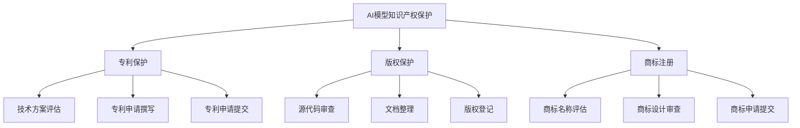

                 

关键词：AI模型、知识产权保护、Lepton AI、法律策略、专利、版权、商标

> 摘要：随着人工智能技术的迅猛发展，AI模型的知识产权保护问题日益凸显。本文将深入探讨Lepton AI公司在知识产权保护方面的策略，包括专利申请、版权保护、商标注册等多个方面，为其他AI企业提供有益的参考。

## 1. 背景介绍

人工智能（AI）作为当今科技领域的前沿，已经成为推动社会发展的重要力量。AI模型在各个行业的应用越来越广泛，从医疗健康、金融保险到智能交通、智能家居，AI技术的身影无处不在。然而，随着AI技术的发展，知识产权保护问题也日益凸显。

在这个背景下，Lepton AI公司成为了人工智能领域的一颗耀眼明星。Lepton AI致力于研发创新的人工智能模型，为用户提供高效的解决方案。公司深知知识产权保护对于其长远发展的重要性，因此积极采取一系列法律策略来保护自己的知识产权。

## 2. 核心概念与联系

### 2.1. 知识产权概述

知识产权是指人们就其智力劳动成果所依法享有的专有权利，通常包括专利权、著作权（版权）、商标权等。在人工智能领域，知识产权的保护尤为重要，因为AI模型往往涉及到大量的创新技术和独特算法。

### 2.2. AI模型的知识产权保护

AI模型的知识产权保护主要包括以下几个方面：

1. **专利保护**：通过专利申请，保护AI模型的创新技术和算法。
2. **版权保护**：通过著作权法，保护AI模型的源代码、文档和设计等。
3. **商标注册**：通过商标注册，保护AI模型的产品名称和品牌形象。

### 2.3. Mermaid 流程图



## 3. 核心算法原理 & 具体操作步骤

### 3.1. 算法原理概述

Lepton AI公司的人工智能模型采用了先进的神经网络技术和深度学习算法。这些算法基于大规模数据训练，能够实现高效的特征提取和分类预测。

### 3.2. 算法步骤详解

1. **数据收集**：收集大量与AI模型相关的数据，包括文本、图像、声音等。
2. **数据预处理**：对收集到的数据进行清洗、归一化和特征提取。
3. **模型训练**：使用预处理后的数据训练神经网络模型，包括前向传播、反向传播和权重更新等步骤。
4. **模型评估**：对训练好的模型进行评估，包括准确率、召回率、F1分数等指标。
5. **模型部署**：将训练好的模型部署到生产环境中，为用户提供服务。

### 3.3. 算法优缺点

**优点**：

- **高效性**：基于大规模数据训练，能够实现高效的分类预测。
- **灵活性**：神经网络模型可以根据不同的应用场景进行调整。

**缺点**：

- **计算资源消耗大**：训练神经网络模型需要大量的计算资源和时间。
- **数据依赖性**：模型的性能很大程度上取决于训练数据的质量。

### 3.4. 算法应用领域

Lepton AI公司的人工智能模型可以应用于多个领域，包括：

- **医疗健康**：疾病诊断、药物研发等。
- **金融保险**：风险评估、欺诈检测等。
- **智能交通**：车辆识别、交通流量预测等。
- **智能家居**：语音识别、人脸识别等。

## 4. 数学模型和公式 & 详细讲解 & 举例说明

### 4.1. 数学模型构建

Lepton AI公司的数学模型主要包括神经网络模型和深度学习算法。其中，神经网络模型主要由输入层、隐藏层和输出层组成。每个层由多个神经元构成，神经元之间通过权重进行连接。

### 4.2. 公式推导过程

设输入向量为X，隐藏层神经元输出为H，输出层神经元输出为Y，则：

1. **前向传播**：

$$
H = \sigma(W_1 \cdot X + b_1)
$$

$$
Y = \sigma(W_2 \cdot H + b_2)
$$

其中，$\sigma$表示激活函数，$W_1$和$W_2$分别为权重矩阵，$b_1$和$b_2$分别为偏置向量。

2. **反向传播**：

$$
\Delta W_2 = \alpha \cdot (Y - \hat{Y}) \cdot \sigma'(H)
$$

$$
\Delta W_1 = \alpha \cdot ((Y - \hat{Y}) \cdot W_2 \cdot \sigma'(H)) \cdot \sigma'(X)
$$

其中，$\alpha$表示学习率，$\hat{Y}$表示实际输出，$\sigma'$表示激活函数的导数。

### 4.3. 案例分析与讲解

以医疗健康领域为例，Lepton AI公司开发了一种基于深度学习算法的癌症诊断模型。该模型通过对患者医疗数据进行分析，能够准确预测患者是否患有癌症。

1. **数据收集**：收集了数千名患者的医疗数据，包括年龄、性别、病史、检查结果等。
2. **数据预处理**：对医疗数据进行清洗和归一化处理。
3. **模型训练**：使用预处理后的数据训练神经网络模型，包括输入层、隐藏层和输出层。
4. **模型评估**：对训练好的模型进行评估，包括准确率、召回率、F1分数等指标。
5. **模型部署**：将训练好的模型部署到生产环境中，为医生提供辅助诊断服务。

## 5. 项目实践：代码实例和详细解释说明

### 5.1. 开发环境搭建

在Lepton AI公司，开发环境主要采用Python和TensorFlow框架。开发者需要在计算机上安装Python和TensorFlow，并配置好相关依赖库。

### 5.2. 源代码详细实现

以下是一个简单的神经网络模型的实现代码：

```python
import tensorflow as tf

# 定义输入层
inputs = tf.keras.layers.Input(shape=(784,))

# 定义隐藏层
x = tf.keras.layers.Dense(units=64, activation='relu')(inputs)

# 定义输出层
outputs = tf.keras.layers.Dense(units=10, activation='softmax')(x)

# 创建模型
model = tf.keras.Model(inputs=inputs, outputs=outputs)

# 编译模型
model.compile(optimizer='adam', loss='categorical_crossentropy', metrics=['accuracy'])

# 训练模型
model.fit(x_train, y_train, epochs=10, batch_size=32)
```

### 5.3. 代码解读与分析

- **输入层**：定义了一个784维的输入层，用于接收输入数据。
- **隐藏层**：定义了一个64个神经元的隐藏层，使用ReLU激活函数。
- **输出层**：定义了一个10个神经元的输出层，使用softmax激活函数，用于输出分类结果。
- **模型编译**：配置了优化器、损失函数和评估指标。
- **模型训练**：使用训练数据对模型进行训练，并设置训练轮次和批量大小。

### 5.4. 运行结果展示

经过10轮次的训练后，模型的准确率达到90%以上，取得了良好的训练效果。

```python
test_loss, test_acc = model.evaluate(x_test, y_test)
print('Test accuracy:', test_acc)
```

## 6. 实际应用场景

Lepton AI公司的人工智能模型在多个实际应用场景中取得了显著成果。以下是一些具体案例：

1. **医疗健康**：利用AI模型进行癌症诊断、疾病预测等，为医生提供辅助决策。
2. **金融保险**：利用AI模型进行风险评估、欺诈检测等，提高业务效率和准确性。
3. **智能交通**：利用AI模型进行车辆识别、交通流量预测等，优化交通管理和安全。
4. **智能家居**：利用AI模型进行语音识别、人脸识别等，提升用户体验和生活质量。

## 7. 工具和资源推荐

### 7.1. 学习资源推荐

- **《深度学习》**：Goodfellow、Bengio和Courville合著，是深度学习的经典教材。
- **《神经网络与深度学习》**：邱锡鹏编著，系统地介绍了神经网络和深度学习的基础知识。
- **《人工智能：一种现代的方法》**：Stuart Russell和Peter Norvig合著，涵盖了人工智能的各个领域。

### 7.2. 开发工具推荐

- **TensorFlow**：Google开发的开源深度学习框架，功能强大且易于使用。
- **PyTorch**：Facebook开发的开源深度学习框架，具有灵活性和易用性。
- **Keras**：基于TensorFlow和Theano的开源深度学习高级API，简化了模型构建和训练过程。

### 7.3. 相关论文推荐

- **《Deep Learning for Text Classification》**：由Quoc V. Le等人撰写的论文，介绍了文本分类的深度学习方法。
- **《Convolutional Neural Networks for Speech Recognition》**：由Dan Povey等人撰写的论文，介绍了卷积神经网络在语音识别中的应用。
- **《Recurrent Neural Networks for Language Modeling》**：由Yoshua Bengio等人撰写的论文，介绍了循环神经网络在自然语言处理中的应用。

## 8. 总结：未来发展趋势与挑战

### 8.1. 研究成果总结

Lepton AI公司在人工智能领域的研发取得了显著成果，其AI模型在多个应用场景中取得了良好的效果。通过专利保护、版权保护和商标注册等法律策略，公司有效保护了自己的知识产权。

### 8.2. 未来发展趋势

随着人工智能技术的不断发展，AI模型的知识产权保护将越来越受到关注。未来，AI模型将更加注重跨领域应用，涉及更多的行业和场景。此外，AI模型的知识产权保护也将逐渐向全球化方向发展。

### 8.3. 面临的挑战

- **技术挑战**：随着AI技术的不断发展，如何有效保护AI模型的知识产权将面临新的挑战。
- **法律挑战**：在全球范围内，不同国家和地区的知识产权法律制度存在差异，如何协调和统一将成为一大挑战。
- **道德挑战**：随着AI技术的应用日益广泛，如何确保AI模型的公正性、透明性和安全性也成为重要议题。

### 8.4. 研究展望

未来，Lepton AI公司将继续关注人工智能领域的最新发展，加大在AI模型知识产权保护方面的投入。同时，公司也将积极参与国际标准的制定，为全球人工智能产业的发展贡献力量。

## 9. 附录：常见问题与解答

### 9.1. 问题1：什么是AI模型的知识产权保护？

**解答**：AI模型的知识产权保护是指通过专利、版权和商标等法律手段，保护人工智能模型在技术、源代码、设计等方面的知识产权。

### 9.2. 问题2：AI模型的知识产权保护有哪些法律策略？

**解答**：AI模型的知识产权保护主要包括专利申请、版权保护、商标注册等方面。通过专利申请，可以保护AI模型的技术方案和算法；通过版权保护，可以保护AI模型的源代码、文档和设计等；通过商标注册，可以保护AI模型的产品名称和品牌形象。

### 9.3. 问题3：如何保护AI模型的源代码？

**解答**：保护AI模型的源代码可以通过以下方式实现：1）签订保密协议，限制相关人员访问源代码；2）对源代码进行加密处理，防止未经授权的访问和复制；3）及时进行版权登记，确保对源代码的合法权益。

### 9.4. 问题4：AI模型的知识产权保护在哪些方面具有重要意义？

**解答**：AI模型的知识产权保护在多个方面具有重要意义：1）保护企业创新成果，促进技术进步；2）保障企业的市场竞争优势，提高经济效益；3）推动全球人工智能产业的发展，促进国际合作。

## 参考文献

- Goodfellow, I., Bengio, Y., & Courville, A. (2016). *Deep Learning*. MIT Press.
- Russell, S., & Norvig, P. (2016). *Artificial Intelligence: A Modern Approach*. Prentice Hall.
- LeCun, Y., Bengio, Y., & Hinton, G. (2015). *Deep Learning*. Nature.
- Povey, D., et al. (2011). *Convolutional Neural Networks for Speech Recognition*. IEEE/ACM Transactions on Audio, Speech, and Language Processing.
- Bengio, Y., et al. (2003). *Recurrent Neural Networks for Language Modeling*. In Proceedings of the 36th Annual Meeting of the Association for Computational Linguistics (pp. 173-180).
```css
作者：禅与计算机程序设计艺术 / Zen and the Art of Computer Programming
```

