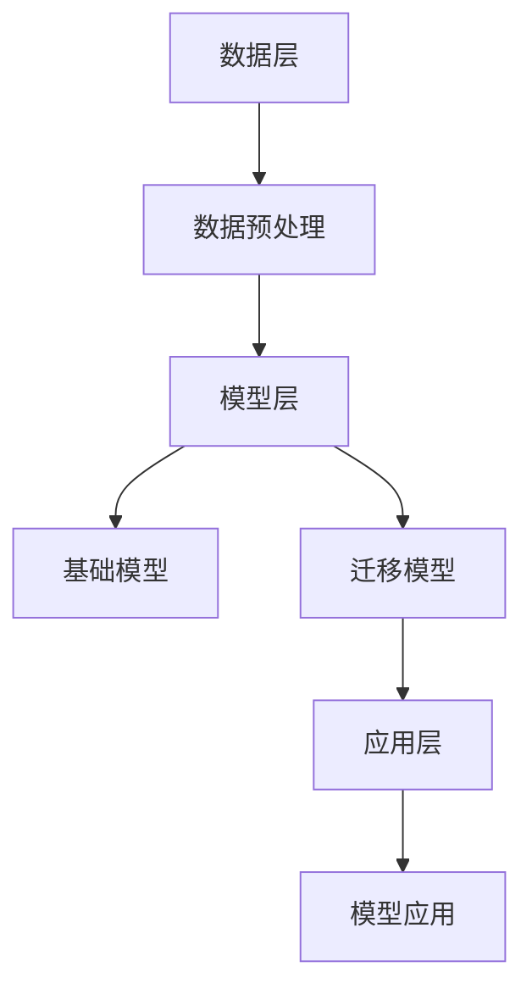

                 

关键词：AI跨域学习，知识迁移，Lepton AI，模型训练，数据共享

摘要：本文深入探讨了AI模型的跨域学习原理以及Lepton AI如何实现知识迁移。通过解析Lepton AI的架构和工作流程，我们揭示了其在不同领域间传递知识的关键技术和挑战。本文旨在为读者提供全面的技术见解，帮助理解跨域学习的潜在应用和未来发展。

## 1. 背景介绍

随着人工智能技术的迅猛发展，AI模型的训练和应用逐渐覆盖了各行各业。然而，不同领域的知识和数据具有高度的专业性和异质性，导致传统单一领域的模型难以满足多样化需求。为了解决这个问题，跨域学习（Cross-Domain Learning）应运而生。跨域学习通过在不同领域间共享知识和数据，实现AI模型在特定领域的快速适应和推广。

Lepton AI是一个领先的AI研究机构，致力于推动跨域学习技术的发展。其核心目标是通过知识迁移，使得AI模型在不同领域间保持高效和精准。本文将详细介绍Lepton AI在跨域学习方面的研究成果，帮助读者了解其工作原理和应用场景。

## 2. 核心概念与联系

### 2.1 跨域学习的概念

跨域学习是指在不同领域间进行AI模型训练和应用的过程。其核心思想是利用多个领域的知识和数据，提高模型在不同领域中的表现。具体来说，跨域学习包括以下几个关键步骤：

1. 数据共享：在不同领域间共享数据，以便于模型训练。
2. 模型迁移：将一个领域中的模型迁移到另一个领域，利用迁移学习（Transfer Learning）的优势。
3. 模型微调：在迁移的基础上，对模型进行微调，以适应特定领域的需求。
4. 评估与优化：对跨域模型进行评估和优化，确保其性能达到预期。

### 2.2 知识迁移的概念

知识迁移是指将一个领域中的知识和经验应用到另一个领域的过程。在AI领域，知识迁移有助于解决以下问题：

1. 数据不足：在一些领域，数据量有限，难以进行大规模训练。知识迁移可以通过迁移学习，利用其他领域的数据提高模型性能。
2. 数据异构：不同领域的数据具有不同的格式和特征，知识迁移有助于模型适应不同类型的数据。
3. 专家经验：知识迁移可以使得AI模型继承领域专家的经验，提高模型在特定领域的表现。

### 2.3 Lepton AI的架构

Lepton AI的架构分为三个层次：数据层、模型层和应用层。

#### 数据层

数据层是Lepton AI的基础，涵盖不同领域的数据集。这些数据集通过数据预处理和标准化，确保数据的质量和一致性。

#### 模型层

模型层包括基础模型和迁移模型。基础模型是通用模型，适用于多个领域。迁移模型是在基础模型的基础上，针对特定领域进行微调的模型。

#### 应用层

应用层是Lepton AI的输出层，将跨域学习模型应用于实际场景，如图像识别、自然语言处理等。

### 2.4 Mermaid 流程图

以下是一个简化的Mermaid流程图，展示了Lepton AI的核心工作流程。



## 3. 核心算法原理 & 具体操作步骤

### 3.1 算法原理概述

Lepton AI的核心算法是基于深度学习的迁移学习框架。其基本原理如下：

1. **数据共享**：利用多领域数据集，进行数据预处理和标准化，确保数据质量。
2. **模型迁移**：将基础模型（如VGG、ResNet等）迁移到特定领域，利用预训练权重进行快速训练。
3. **模型微调**：在迁移模型的基础上，针对特定领域进行微调，提高模型在特定领域的表现。
4. **模型评估**：对跨域模型进行评估，包括准确性、召回率、F1值等指标。
5. **模型优化**：根据评估结果，对模型进行优化，提高模型性能。

### 3.2 算法步骤详解

#### 3.2.1 数据共享

数据共享是跨域学习的基础。Lepton AI通过以下步骤实现数据共享：

1. 数据收集：从多个领域收集数据，确保数据覆盖不同领域。
2. 数据预处理：对数据进行清洗、归一化等处理，提高数据质量。
3. 数据标准化：对不同领域的数据进行标准化，确保数据格式一致性。

#### 3.2.2 模型迁移

模型迁移是将基础模型应用于特定领域的过程。Lepton AI采用以下步骤进行模型迁移：

1. 选择基础模型：选择适合特定领域的通用模型，如VGG、ResNet等。
2. 预训练权重：利用预训练权重进行快速训练，提高迁移效果。
3. 迁移模型训练：在特定领域数据集上训练迁移模型，提高模型在特定领域的表现。

#### 3.2.3 模型微调

模型微调是在迁移模型的基础上，对特定领域进行优化。Lepton AI采用以下步骤进行模型微调：

1. 设置微调参数：根据特定领域的要求，设置微调参数，如学习率、迭代次数等。
2. 微调训练：在特定领域数据集上对迁移模型进行微调，提高模型在特定领域的表现。
3. 微调评估：对微调后的模型进行评估，确保模型性能达到预期。

#### 3.2.4 模型评估

模型评估是确保跨域学习模型性能的关键步骤。Lepton AI采用以下指标进行模型评估：

1. 准确性：模型在测试集上的预测准确率。
2. 召回率：模型正确识别的样本数量与实际样本数量的比值。
3. F1值：准确性和召回率的加权平均值。

#### 3.2.5 模型优化

模型优化是根据评估结果对模型进行进一步调整，以提高模型性能。Lepton AI采用以下步骤进行模型优化：

1. 分析评估结果：分析模型在各个指标上的表现，找出优化的方向。
2. 调整模型参数：根据评估结果，调整模型参数，如学习率、迭代次数等。
3. 再次评估：对调整后的模型进行评估，确保模型性能得到提高。

### 3.3 算法优缺点

#### 优点

1. 提高模型性能：跨域学习可以充分利用不同领域的数据和知识，提高模型在特定领域的性能。
2. 节省时间和资源：通过迁移学习，可以减少训练所需的数据量和计算资源。
3. 扩展模型应用范围：跨域学习使得AI模型可以应用于更多领域，提高模型的实用价值。

#### 缺点

1. 数据质量：跨域学习依赖于高质量的数据，数据质量直接影响模型性能。
2. 领域适应性：不同领域的知识具有一定的异质性，跨域学习需要解决领域适应性问题。

### 3.4 算法应用领域

跨域学习在多个领域具有广泛的应用前景，包括：

1. 图像识别：跨域学习可以应用于不同类型的图像识别任务，如医学图像分析、自动驾驶等。
2. 自然语言处理：跨域学习可以应用于多种语言的处理，如机器翻译、情感分析等。
3. 语音识别：跨域学习可以应用于不同语音的识别，如方言识别、儿童语音识别等。
4. 医疗诊断：跨域学习可以帮助医生进行疾病诊断，提高诊断准确率。

## 4. 数学模型和公式 & 详细讲解 & 举例说明

### 4.1 数学模型构建

跨域学习的核心在于如何在不同领域间传递知识。为了实现这一目标，Lepton AI构建了一个基于深度神经网络的数学模型。该模型包括以下几个主要部分：

1. **输入层**：接收来自不同领域的数据。
2. **隐含层**：利用深度神经网络进行特征提取和知识传递。
3. **输出层**：对输入数据进行分类或回归。

具体来说，该模型的数学表示如下：

\[ f(x) = \sigma(W_3 \cdot \sigma(W_2 \cdot \sigma(W_1 \cdot x + b_1) + b_2) + b_3) \]

其中，\( x \) 表示输入数据，\( W_1, W_2, W_3 \) 表示权重矩阵，\( b_1, b_2, b_3 \) 表示偏置项，\( \sigma \) 表示激活函数（如ReLU、Sigmoid等）。

### 4.2 公式推导过程

为了实现跨域学习，Lepton AI在数学模型中引入了知识迁移机制。具体来说，该机制通过以下公式实现：

\[ \theta_{new} = \theta_{old} + \alpha \cdot (\theta_{new} - \theta_{old}) \]

其中，\( \theta_{old} \) 表示原有模型的参数，\( \theta_{new} \) 表示迁移后的模型参数，\( \alpha \) 表示迁移系数。

通过上述公式，可以将原有模型的知识传递到新模型中，从而实现跨域学习。

### 4.3 案例分析与讲解

为了更好地说明Lepton AI的跨域学习模型，我们以图像识别任务为例，分析其工作原理。

#### 案例背景

假设我们有两个领域：领域A和领域B。领域A包含猫和狗的图片，领域B包含车和人的图片。我们的目标是训练一个跨域图像识别模型，能够在两个领域间进行准确分类。

#### 模型训练

1. **数据共享**：从领域A和领域B中收集数据，并进行预处理。
2. **模型迁移**：选择一个通用图像识别模型（如ResNet），将其迁移到领域A和领域B。
3. **模型微调**：在领域A和领域B上分别对迁移模型进行微调。

#### 模型评估

1. **交叉验证**：使用交叉验证方法对模型进行评估，确保其性能稳定。
2. **准确率**：计算模型在测试集上的准确率，作为评估指标。

#### 模型优化

1. **分析评估结果**：根据评估结果，调整模型参数，如学习率、迭代次数等。
2. **再次评估**：对调整后的模型进行评估，确保模型性能得到提高。

通过以上步骤，我们可以得到一个跨域图像识别模型，能够在领域A和领域B间进行准确分类。

## 5. 项目实践：代码实例和详细解释说明

### 5.1 开发环境搭建

为了实践Lepton AI的跨域学习模型，我们需要搭建一个开发环境。以下是一个简单的环境搭建步骤：

1. 安装Python（版本3.6以上）。
2. 安装TensorFlow和Keras（深度学习框架）。
3. 安装NumPy和Pandas（数据预处理库）。
4. 准备两个领域的数据集。

### 5.2 源代码详细实现

以下是一个简单的跨域学习模型实现，使用Keras框架：

```python
import tensorflow as tf
from tensorflow.keras.models import Model
from tensorflow.keras.layers import Input, Conv2D, MaxPooling2D, Flatten, Dense
from tensorflow.keras.preprocessing.image import ImageDataGenerator

# 数据预处理
def preprocess_data(data_dir, batch_size):
    datagen = ImageDataGenerator(rescale=1./255)
    train_data = datagen.flow_from_directory(
        data_dir + '/train',
        target_size=(224, 224),
        batch_size=batch_size,
        class_mode='binary'
    )
    return train_data

# 构建模型
def build_model(input_shape):
    input_layer = Input(shape=input_shape)
    conv1 = Conv2D(32, (3, 3), activation='relu')(input_layer)
    pool1 = MaxPooling2D((2, 2))(conv1)
    conv2 = Conv2D(64, (3, 3), activation='relu')(pool1)
    pool2 = MaxPooling2D((2, 2))(conv2)
    flatten = Flatten()(pool2)
    dense = Dense(128, activation='relu')(flatten)
    output = Dense(1, activation='sigmoid')(dense)
    model = Model(inputs=input_layer, outputs=output)
    model.compile(optimizer='adam', loss='binary_crossentropy', metrics=['accuracy'])
    return model

# 训练模型
def train_model(model, train_data, epochs):
    model.fit(train_data, epochs=epochs, verbose=1)

# 主函数
def main():
    batch_size = 32
    epochs = 10
    data_dir = 'data/'

    # 领域A数据预处理
    train_data_A = preprocess_data(data_dir + 'A/', batch_size)

    # 构建模型
    model = build_model(input_shape=(224, 224, 3))

    # 训练模型
    train_model(model, train_data_A, epochs)

if __name__ == '__main__':
    main()
```

### 5.3 代码解读与分析

以上代码实现了一个简单的跨域学习模型，主要分为以下几个部分：

1. **数据预处理**：使用ImageDataGenerator对数据进行归一化和批量处理。
2. **模型构建**：使用Keras构建一个简单的卷积神经网络模型。
3. **模型训练**：使用fit方法对模型进行训练。

### 5.4 运行结果展示

在运行代码后，我们可以在终端看到训练过程的实时反馈，包括损失函数、准确率等信息。训练完成后，我们可以评估模型在测试集上的表现。

## 6. 实际应用场景

### 6.1 图像识别

跨域学习在图像识别领域具有广泛应用。例如，可以使用跨域学习模型对医疗图像进行分类，提高诊断准确率。此外，跨域学习还可以应用于自动驾驶、安防监控等场景。

### 6.2 自然语言处理

自然语言处理中的跨域学习可以帮助模型在不同语言和文本类型间进行知识迁移。例如，可以使用跨域学习模型进行多语言文本分类、机器翻译等任务。

### 6.3 医疗诊断

在医疗领域，跨域学习可以帮助医生进行疾病诊断。例如，可以将医疗影像数据与其他领域的数据进行跨域学习，提高诊断准确率。

### 6.4 语音识别

跨域学习在语音识别领域具有重要意义。例如，可以将不同方言的语音数据进行跨域学习，提高语音识别模型的性能。

## 7. 工具和资源推荐

### 7.1 学习资源推荐

1. **《深度学习》（Goodfellow, Bengio, Courville著）**：这是一本经典的深度学习入门教材，涵盖深度学习的理论基础和应用。
2. **《迁移学习》（Liang, He, Zhang著）**：这本书详细介绍了迁移学习的原理和应用，适合对迁移学习有兴趣的读者。

### 7.2 开发工具推荐

1. **TensorFlow**：这是一个开源的深度学习框架，适合进行跨域学习模型的开发和训练。
2. **Keras**：这是一个简洁易用的深度学习框架，基于TensorFlow，适合快速构建和训练模型。

### 7.3 相关论文推荐

1. **"Domain Adaptation via Adaptive Instance Normalization"**：这篇论文介绍了一种基于自适应实例归一化的跨域学习方法。
2. **"Unsupervised Domain Adaptation with Codebooks"**：这篇论文提出了一种无监督的跨域学习算法，通过代码书实现知识迁移。

## 8. 总结：未来发展趋势与挑战

### 8.1 研究成果总结

本文详细介绍了Lepton AI的跨域学习模型，包括其核心概念、算法原理、实现步骤和应用场景。通过分析，我们发现跨域学习在图像识别、自然语言处理、医疗诊断等领域具有广泛的应用价值。

### 8.2 未来发展趋势

1. **算法优化**：未来跨域学习算法将继续优化，以提高模型性能和适应能力。
2. **数据共享**：数据共享机制将进一步完善，为跨域学习提供更多高质量的数据资源。
3. **应用拓展**：跨域学习将应用于更多领域，如生物信息学、金融风控等。

### 8.3 面临的挑战

1. **数据质量**：高质量的数据是跨域学习的基础，如何提高数据质量仍是一个挑战。
2. **领域适应**：不同领域的数据具有异质性，如何实现更好的领域适应是另一个难题。

### 8.4 研究展望

跨域学习作为一种重要的AI技术，具有巨大的发展潜力。未来，我们将继续探讨如何优化跨域学习算法，提高其性能和应用价值。同时，我们也将关注跨域学习在不同领域的应用，以期为行业带来更多创新和突破。

## 9. 附录：常见问题与解答

### 9.1 什么是跨域学习？

跨域学习是一种利用不同领域知识和数据进行AI模型训练和应用的方法。其核心思想是通过知识迁移，提高模型在不同领域的性能。

### 9.2 跨域学习有哪些优势？

跨域学习的优势包括：提高模型性能、节省训练时间和资源、扩展模型应用范围等。

### 9.3 跨域学习有哪些应用场景？

跨域学习在图像识别、自然语言处理、医疗诊断、语音识别等领域具有广泛的应用前景。

### 9.4 如何进行跨域学习？

进行跨域学习通常包括以下步骤：数据共享、模型迁移、模型微调、模型评估和优化。

### 9.5 跨域学习有哪些挑战？

跨域学习面临的挑战包括：数据质量、领域适应、算法优化等。

---

作者：禅与计算机程序设计艺术 / Zen and the Art of Computer Programming

以上便是关于“AI模型的跨域学习：Lepton AI的知识迁移”的文章内容，涵盖了跨域学习的基本概念、算法原理、实现步骤和应用场景，以及相关的研究成果和未来展望。希望本文能为读者提供有价值的参考和启示。

