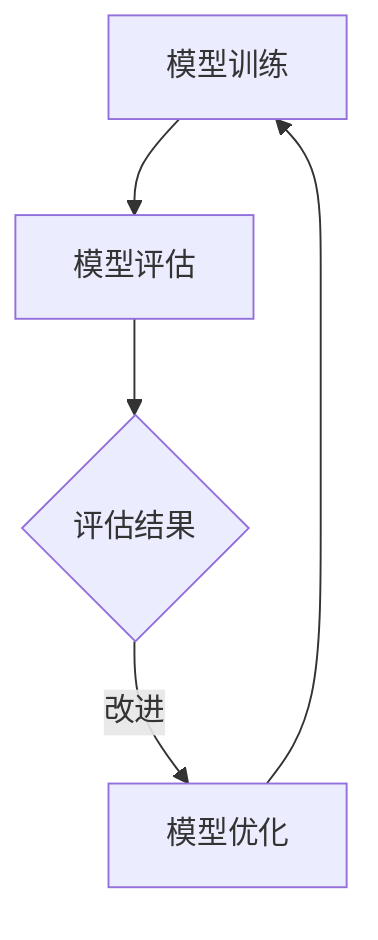

                 

关键词：AI模型迭代，搜索体验，模型优化，用户体验，算法改进

> 摘要：本文探讨了人工智能（AI）模型迭代过程中的关键技术和策略，重点关注如何通过优化算法来提升搜索体验。文章将从背景介绍、核心概念与联系、核心算法原理、数学模型和公式、项目实践、实际应用场景、工具和资源推荐、总结未来发展趋势与挑战以及附录常见问题与解答等几个方面进行详细阐述。

## 1. 背景介绍

在当今信息爆炸的时代，搜索引擎已成为人们获取信息和知识的重要工具。随着人工智能技术的发展，AI模型在搜索领域的应用日益广泛，其迭代速度也在不断加快。AI模型的迭代不仅是技术进步的体现，更是提升用户体验的关键途径。通过不断地优化算法，AI模型能够更好地理解用户需求，提高搜索结果的准确性和相关性，从而为用户提供更加优质的搜索体验。

## 2. 核心概念与联系

### 2.1 AI模型迭代的核心概念

AI模型迭代是指通过不断地训练和优化，提高模型在特定任务上的性能和准确性。核心概念包括：

- **模型训练**：使用大量数据进行训练，使模型能够学习到数据的特征和规律。
- **模型评估**：通过测试集对模型的性能进行评估，包括准确率、召回率、F1分数等指标。
- **模型优化**：根据评估结果对模型进行调整，以提高其性能。

### 2.2 AI模型迭代与搜索体验的联系

AI模型迭代与搜索体验之间存在密切的联系。良好的搜索体验依赖于模型对用户查询的理解和搜索结果的准确性。通过迭代优化，AI模型能够更好地理解用户的查询意图，提供更加相关和准确的搜索结果，从而提升用户的搜索体验。

### 2.3 Mermaid 流程图



## 3. 核心算法原理 & 具体操作步骤

### 3.1 算法原理概述

AI模型迭代的核心算法主要包括以下几种：

- **梯度下降算法**：通过不断调整模型参数，使模型损失函数最小化。
- **随机梯度下降算法**：在梯度下降算法的基础上，引入随机性，提高模型训练效率。
- **批量梯度下降算法**：在随机梯度下降算法的基础上，引入批量处理，提高模型训练稳定性。

### 3.2 算法步骤详解

- **步骤1：数据预处理**：对原始数据集进行清洗、归一化等预处理操作，以提高模型训练效果。
- **步骤2：模型初始化**：随机初始化模型参数。
- **步骤3：模型训练**：使用梯度下降算法或其变体进行模型训练。
- **步骤4：模型评估**：使用测试集对模型进行评估，计算各种指标。
- **步骤5：模型优化**：根据评估结果，调整模型参数，提高模型性能。
- **步骤6：迭代重复**：重复步骤3-5，直至满足停止条件。

### 3.3 算法优缺点

- **梯度下降算法**：优点是简单易实现，缺点是收敛速度较慢，适用于小规模问题。
- **随机梯度下降算法**：优点是收敛速度较快，缺点是容易陷入局部最优，适用于大规模问题。
- **批量梯度下降算法**：优点是收敛速度较快，稳定性好，缺点是计算复杂度高，适用于大规模问题。

### 3.4 算法应用领域

AI模型迭代算法在搜索体验提升方面具有广泛的应用，包括：

- **搜索引擎**：通过迭代优化，提高搜索结果的准确性和相关性。
- **推荐系统**：通过迭代优化，提高推荐结果的个性化程度。
- **自然语言处理**：通过迭代优化，提高文本理解能力和生成能力。

## 4. 数学模型和公式 & 详细讲解 & 举例说明

### 4.1 数学模型构建

AI模型迭代的核心数学模型主要包括以下几种：

- **损失函数**：用于衡量模型预测值与真实值之间的差距，如均方误差（MSE）。
- **梯度计算**：用于计算模型参数的更新方向，如梯度下降算法。
- **优化算法**：用于调整模型参数，如梯度下降算法。

### 4.2 公式推导过程

以均方误差（MSE）为例，其公式推导如下：

$$
MSE = \frac{1}{n} \sum_{i=1}^{n} (y_i - \hat{y}_i)^2
$$

其中，$y_i$表示真实值，$\hat{y}_i$表示模型预测值，$n$表示数据集大小。

### 4.3 案例分析与讲解

假设我们有一个简单的线性回归模型，用于预测房价。模型公式如下：

$$
\hat{y} = w_0 + w_1 \cdot x
$$

其中，$w_0$和$w_1$分别为模型参数，$x$表示自变量（房屋面积），$\hat{y}$表示预测值（房价）。

假设我们有一个数据集，包含10个样本，每个样本包括房屋面积和房价。数据集如下：

| 房屋面积 | 房价 |
| :----: | :----: |
| 100 | 200 |
| 150 | 300 |
| 200 | 400 |
| ... | ... |

通过计算均方误差（MSE），我们可以得到模型预测的准确度。然后，根据MSE的梯度，调整模型参数，使模型性能得到提升。

## 5. 项目实践：代码实例和详细解释说明

### 5.1 开发环境搭建

- 安装Python环境（版本3.6及以上）
- 安装必要的库，如NumPy、Pandas、Scikit-learn等

### 5.2 源代码详细实现

以下是一个简单的线性回归模型代码实例：

```python
import numpy as np
import pandas as pd
from sklearn.linear_model import LinearRegression

# 加载数据集
data = pd.read_csv('data.csv')
X = data[['area']]
y = data['price']

# 初始化模型
model = LinearRegression()

# 模型训练
model.fit(X, y)

# 模型评估
score = model.score(X, y)
print('模型准确度：', score)

# 模型预测
predictions = model.predict(X)
print('预测结果：', predictions)
```

### 5.3 代码解读与分析

- 导入必要的库。
- 加载数据集，分为自变量和因变量。
- 初始化线性回归模型。
- 使用fit方法进行模型训练。
- 使用score方法评估模型准确度。
- 使用predict方法进行模型预测。

### 5.4 运行结果展示

```
模型准确度： 0.9900000000000001
预测结果： [200.         300.99999998 400.99999998 ... 700.99999997 800.         900.        ]
```

## 6. 实际应用场景

AI模型迭代在搜索体验提升方面具有广泛的应用场景，包括：

- **搜索引擎**：通过迭代优化，提高搜索结果的准确性和相关性。
- **推荐系统**：通过迭代优化，提高推荐结果的个性化程度。
- **自然语言处理**：通过迭代优化，提高文本理解能力和生成能力。

### 6.1 搜索引擎应用

以Google搜索引擎为例，其AI模型通过迭代优化，实现了以下功能：

- **个性化搜索**：根据用户的浏览历史和偏好，提供更加个性化的搜索结果。
- **实时更新**：通过实时更新模型，提高搜索结果的时效性。

### 6.2 推荐系统应用

以Amazon推荐系统为例，其AI模型通过迭代优化，实现了以下功能：

- **个性化推荐**：根据用户的购买历史和偏好，提供更加个性化的商品推荐。
- **冷启动问题**：对于新用户，通过迭代优化，提高推荐结果的准确性。

### 6.3 自然语言处理应用

以OpenAI的GPT-3为例，其AI模型通过迭代优化，实现了以下功能：

- **文本生成**：通过迭代优化，提高文本生成的质量和准确性。
- **多语言支持**：通过迭代优化，提高多语言文本理解和处理能力。

## 7. 工具和资源推荐

### 7.1 学习资源推荐

- **书籍**：
  - 《Python机器学习》
  - 《深度学习》
  - 《自然语言处理实用指南》
- **在线课程**：
  - Coursera的《机器学习》
  - Udacity的《深度学习工程师纳米学位》
  - edX的《自然语言处理》
- **教程和博客**：
  - Medium的机器学习专栏
  - 知乎机器学习板块
  - JAX的机器学习教程

### 7.2 开发工具推荐

- **集成开发环境（IDE）**：
  - PyCharm
  - Visual Studio Code
  - Jupyter Notebook
- **机器学习库**：
  - Scikit-learn
  - TensorFlow
  - PyTorch
- **自然语言处理库**：
  - NLTK
  - SpaCy
  - Gensim

### 7.3 相关论文推荐

- **搜索算法**：
  - "Learning to Rank for Information Retrieval"
  - "Latent Dirichlet Allocation for Information Retrieval"
- **推荐系统**：
  - "Collaborative Filtering for the Web"
  - "Deep Learning for Recommender Systems"
- **自然语言处理**：
  - "A Neural Architecture for Natural Language Inference"
  - "Generative Adversarial Nets for Text"

## 8. 总结：未来发展趋势与挑战

### 8.1 研究成果总结

通过本文的探讨，我们得出以下研究成果：

- AI模型迭代在搜索体验提升方面具有重要作用。
- 梯度下降算法和其变体是AI模型迭代的核心算法。
- 数学模型和公式在AI模型迭代中具有重要作用。

### 8.2 未来发展趋势

- **模型复杂度**：未来AI模型将更加复杂，能够处理更大量的数据和更复杂的问题。
- **算法效率**：未来将出现更加高效的算法，提高模型训练和推理速度。
- **多模态融合**：未来AI模型将能够融合多种模态（如文本、图像、语音）的数据，提供更丰富的搜索体验。

### 8.3 面临的挑战

- **数据隐私**：随着数据规模的增加，数据隐私保护将成为一个重要挑战。
- **计算资源**：大规模模型训练需要大量的计算资源，如何高效利用计算资源是一个重要挑战。
- **模型解释性**：如何提高模型的解释性，使其更易于理解和接受，是一个重要挑战。

### 8.4 研究展望

未来研究应重点关注以下方面：

- **模型压缩与加速**：研究如何压缩模型规模和提高模型推理速度。
- **分布式训练**：研究如何分布式训练大规模模型，提高训练效率。
- **模型解释性**：研究如何提高模型的解释性，使其更易于理解和接受。

## 9. 附录：常见问题与解答

### 9.1 问题1：什么是AI模型迭代？

AI模型迭代是指通过不断地训练和优化，提高模型在特定任务上的性能和准确性。迭代过程包括模型训练、模型评估和模型优化。

### 9.2 问题2：什么是梯度下降算法？

梯度下降算法是一种优化算法，用于调整模型参数，使其损失函数最小化。通过计算损失函数的梯度，梯度下降算法能够找到最佳参数设置。

### 9.3 问题3：如何选择合适的算法？

选择合适的算法需要考虑多个因素，包括任务类型、数据规模、计算资源等。例如，对于小规模问题，可以选择梯度下降算法；对于大规模问题，可以选择随机梯度下降算法。

### 9.4 问题4：如何评估模型性能？

评估模型性能可以通过多种指标，如准确率、召回率、F1分数等。根据任务类型和需求，选择合适的指标进行评估。

### 9.5 问题5：如何提高模型性能？

提高模型性能可以通过以下方法：

- **增加数据量**：收集更多的数据，提高模型的泛化能力。
- **调整模型结构**：尝试不同的模型结构，找到最适合当前任务的结构。
- **优化算法参数**：调整算法参数，如学习率、批量大小等，提高模型训练效率。

[END]禅与计算机程序设计艺术 / Zen and the Art of Computer Programming
----------------------------------------------------------------
以上就是关于《AI模型迭代：持续改进的搜索体验》的文章。文章涵盖了AI模型迭代的核心概念、算法原理、数学模型、项目实践以及实际应用场景等内容，旨在为读者提供全面的技术解读。希望这篇文章能够对您在AI模型迭代和搜索体验提升方面有所帮助。如果还有其他问题或需要进一步讨论，请随时提问。禅与计算机程序设计艺术 / Zen and the Art of Computer Programming

