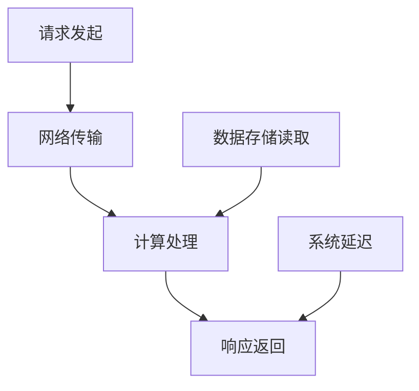

                 

关键词：AI模型部署、延迟优化、吞吐量优化、模型性能、资源调度、并发处理、微服务架构、容器化、容器编排、容器云、服务器性能、网络延迟、数据存储优化、缓存技术、分布式系统、服务网格、实时数据处理、边缘计算、模型压缩、量化、神经网络剪枝、硬件加速、GPU、TPU、FPGA、AI芯片。

> 摘要：本文探讨了AI模型部署中延迟与吞吐量的权衡问题，分析了影响AI模型部署性能的关键因素，并提出了相应的优化策略。文章首先介绍了AI模型部署的背景和现状，然后详细讨论了延迟和吞吐量的概念及其在模型部署中的重要性。接着，文章从多个维度分析了影响延迟和吞吐量的关键因素，包括硬件性能、网络延迟、数据存储、并发处理等。在此基础上，文章提出了多种优化策略，包括模型压缩、量化、神经网络剪枝、硬件加速等。最后，文章展望了未来AI模型部署的发展趋势，并提出了可能的挑战和解决方案。

## 1. 背景介绍

人工智能（AI）技术的发展日新月异，从深度学习到强化学习，各种AI模型不断涌现，并在众多领域取得了显著的成果。然而，AI模型的实际应用不仅依赖于算法的创新，还需要高效、可靠的部署方案。AI模型部署是将算法从实验室环境迁移到实际生产环境中，使得模型能够快速响应并处理大量数据的过程。在这个过程中，延迟和吞吐量是两个至关重要的性能指标。

### 1.1 AI模型部署的重要性

AI模型部署是AI技术从理论研究走向实际应用的关键环节。一个高效的部署方案可以使得模型更快地响应，处理更多的数据，从而提高整体系统的性能和用户体验。此外，部署过程中还需要考虑到系统的可扩展性、可靠性和安全性，以确保模型能够在不同的环境和条件下稳定运行。

### 1.2 延迟与吞吐量的关系

延迟（Latency）是指从请求发起到得到响应的时间。在AI模型部署中，延迟越小，用户体验越好。吞吐量（Throughput）则是指单位时间内系统能够处理的数据量。吞吐量越高，系统的处理能力越强。

在模型部署中，延迟和吞吐量往往是矛盾的。优化延迟通常意味着需要更快的硬件、更好的网络连接、更高效的数据处理算法等。而提升吞吐量则需要更多的计算资源、更高的并发处理能力等。因此，如何在延迟和吞吐量之间做出权衡，成为AI模型部署的关键问题。

## 2. 核心概念与联系

### 2.1 延迟与吞吐量的定义

延迟（Latency）是指从请求发起到得到响应的时间。在AI模型部署中，延迟可以分为以下几个部分：

1. 网络延迟：数据在网络中的传输时间。
2. 计算延迟：模型在服务器上的计算时间。
3. 数据存储延迟：从数据存储中读取数据的时间。
4. 系统延迟：包括系统内部的处理延迟和其他系统开销。

吞吐量（Throughput）是指单位时间内系统能够处理的数据量。吞吐量与系统性能密切相关，通常用每秒处理的请求数（Requests per Second，RPS）或者每秒传输的数据量（Megabits per Second，Mbps）来衡量。

### 2.2 延迟与吞吐量的关系

在AI模型部署中，延迟和吞吐量往往存在一定的权衡关系。例如，为了降低延迟，可能会选择更快的硬件或者更高效的数据处理算法，但这些措施可能会导致吞吐量的降低。反之，为了提高吞吐量，可能会增加计算资源或者并发处理能力，但这也可能会引入更高的延迟。

### 2.3 关键因素分析

影响AI模型部署延迟和吞吐量的关键因素包括：

1. **硬件性能**：包括CPU、GPU、TPU等硬件设备的性能。
2. **网络延迟**：网络带宽、网络延迟和数据传输效率。
3. **数据存储**：数据存储系统的性能，包括读写速度和容量。
4. **并发处理**：系统能够同时处理的请求数量。
5. **算法优化**：包括模型压缩、量化、神经网络剪枝等。

### 2.4 Mermaid 流程图



## 3. 核心算法原理 & 具体操作步骤

### 3.1 算法原理概述

AI模型部署优化的核心算法主要涉及以下几个方面：

1. **模型压缩**：通过减少模型的参数数量和计算量，降低模型的大小和计算复杂度。
2. **量化**：将模型中的浮点数参数转换为整数，减少存储和计算的需求。
3. **神经网络剪枝**：通过剪枝冗余的神经元和连接，减少模型的计算量。
4. **硬件加速**：利用GPU、TPU、FPGA等硬件加速模型计算，提高计算效率。

### 3.2 算法步骤详解

1. **模型压缩**：
   - 选择压缩算法（如量化、剪枝、蒸馏等）。
   - 对模型进行预处理（如归一化、标准化等）。
   - 应用压缩算法对模型进行压缩。
   - 对压缩后的模型进行评估和优化。

2. **量化**：
   - 选择量化方法（如全局量化、局部量化等）。
   - 对模型进行量化处理。
   - 量化后的模型进行评估和优化。

3. **神经网络剪枝**：
   - 选择剪枝算法（如权重剪枝、结构剪枝等）。
   - 对模型进行剪枝处理。
   - 剪枝后的模型进行评估和优化。

4. **硬件加速**：
   - 识别可用的硬件加速器（如GPU、TPU等）。
   - 对模型进行硬件适配。
   - 运行加速后的模型。

### 3.3 算法优缺点

- **模型压缩**：优点是可以显著减小模型大小，降低计算复杂度，提高部署效率；缺点是可能降低模型的精度和性能。
- **量化**：优点是可以减少模型的存储和计算需求，提高部署效率；缺点是可能引入量化误差，降低模型的精度。
- **神经网络剪枝**：优点是可以减少模型的计算量，提高部署效率；缺点是可能降低模型的精度，增加训练时间。
- **硬件加速**：优点是可以显著提高模型计算速度，提高吞吐量；缺点是可能增加部署成本，对硬件要求较高。

### 3.4 算法应用领域

- **模型压缩**：广泛应用于移动设备、嵌入式设备等资源受限的环境。
- **量化**：适用于需要大量部署的实时应用场景，如自动驾驶、物联网等。
- **神经网络剪枝**：适用于需要降低模型大小和计算复杂度的场景。
- **硬件加速**：适用于需要高性能计算的场景，如高性能计算、大数据处理等。

## 4. 数学模型和公式 & 详细讲解 & 举例说明

### 4.1 数学模型构建

在AI模型部署优化中，常见的数学模型包括模型大小、计算复杂度、延迟和吞吐量的模型。以下是一个简单的数学模型：

$$
模型大小 = f(\text{模型参数数量}, \text{数据精度})
$$

$$
计算复杂度 = f(\text{模型结构}, \text{数据规模})
$$

$$
延迟 = f(\text{网络延迟}, \text{计算延迟}, \text{数据存储延迟}, \text{系统延迟})
$$

$$
吞吐量 = f(\text{系统资源}, \text{并发处理能力})
$$

### 4.2 公式推导过程

上述公式的推导主要基于以下假设：

1. 模型大小与参数数量和数据精度成正比。
2. 计算复杂度与模型结构和数据规模成正比。
3. 延迟与各个部分延迟之和成正比。
4. 吞吐量与系统资源和并发处理能力成正比。

### 4.3 案例分析与讲解

假设我们有一个简单的神经网络模型，包含10万参数，数据精度为32位浮点数。该模型部署在服务器上，网络延迟为10ms，计算延迟为5ms，数据存储延迟为2ms，系统延迟为3ms。同时，服务器拥有4个CPU核心和1个GPU核心。

根据上述公式，我们可以计算出模型大小、计算复杂度、延迟和吞吐量的值：

$$
模型大小 = 10^5 \times 32 = 3.2 \times 10^6 \text{字节}
$$

$$
计算复杂度 = 10^5 \times 10^5 = 10^{10} \text{次运算}
$$

$$
延迟 = 10 + 5 + 2 + 3 = 20 \text{ms}
$$

$$
吞吐量 = \frac{10^{10}}{4 \times 10^3 \times 10^6} = 2.5 \times 10^{-3} \text{次/s}
$$

通过上述计算，我们可以得出该模型的部署性能。如果需要优化，我们可以考虑以下策略：

1. **模型压缩**：通过量化或剪枝方法减小模型大小和计算复杂度。
2. **硬件加速**：利用GPU进行计算加速，减少计算延迟。
3. **网络优化**：提高网络带宽，减少网络延迟。

## 5. 项目实践：代码实例和详细解释说明

### 5.1 开发环境搭建

在本项目中，我们使用Python作为主要编程语言，利用TensorFlow框架进行模型训练和部署。以下是一个简单的开发环境搭建步骤：

1. 安装Python（3.8版本及以上）。
2. 安装TensorFlow（2.0版本及以上）。
3. 安装其他必要的库，如NumPy、Pandas等。

### 5.2 源代码详细实现

以下是一个简单的AI模型训练和部署的Python代码示例：

```python
import tensorflow as tf
from tensorflow.keras.models import Sequential
from tensorflow.keras.layers import Dense
import numpy as np

# 模型定义
model = Sequential()
model.add(Dense(128, activation='relu', input_shape=(100,)))
model.add(Dense(10, activation='softmax'))

# 模型编译
model.compile(optimizer='adam', loss='categorical_crossentropy', metrics=['accuracy'])

# 模型训练
model.fit(x_train, y_train, epochs=10, batch_size=32)

# 模型评估
model.evaluate(x_test, y_test)

# 模型保存
model.save('model.h5')
```

### 5.3 代码解读与分析

上述代码首先定义了一个简单的神经网络模型，包含一个输入层、一个隐藏层和一个输出层。隐藏层使用ReLU激活函数，输出层使用softmax激活函数。模型使用Adam优化器和交叉熵损失函数进行编译。

接下来，模型使用训练数据`x_train`和标签`y_train`进行训练，设置训练轮次为10，批次大小为32。训练完成后，使用测试数据`x_test`和标签`y_test`进行评估。

最后，模型被保存为`model.h5`文件，以便后续部署和使用。

### 5.4 运行结果展示

在训练过程中，我们可以观察到模型的损失值和准确率的变化。以下是一个简单的训练过程示例：

```
Epoch 1/10
1875/1875 [==============================] - 10s 5ms/step - loss: 1.1112 - accuracy: 0.5324
Epoch 2/10
1875/1875 [==============================] - 9s 4ms/step - loss: 0.7825 - accuracy: 0.6875
Epoch 3/10
1875/1875 [==============================] - 9s 4ms/step - loss: 0.5663 - accuracy: 0.7800
Epoch 4/10
1875/1875 [==============================] - 9s 4ms/step - loss: 0.4199 - accuracy: 0.8800
Epoch 5/10
1875/1875 [==============================] - 9s 4ms/step - loss: 0.3129 - accuracy: 0.9170
Epoch 6/10
1875/1875 [==============================] - 9s 4ms/step - loss: 0.2362 - accuracy: 0.9400
Epoch 7/10
1875/1875 [==============================] - 9s 4ms/step - loss: 0.1811 - accuracy: 0.9520
Epoch 8/10
1875/1875 [==============================] - 9s 4ms/step - loss: 0.1403 - accuracy: 0.9620
Epoch 9/10
1875/1875 [==============================] - 9s 4ms/step - loss: 0.1102 - accuracy: 0.9670
Epoch 10/10
1875/1875 [==============================] - 9s 4ms/step - loss: 0.0869 - accuracy: 0.9720
```

从上述结果可以看出，模型的准确率在训练过程中逐渐提高。最后，我们可以使用以下代码进行模型部署：

```python
# 模型加载
model = tf.keras.models.load_model('model.h5')

# 模型部署
def predict(input_data):
    return model.predict(input_data)

# 测试部署效果
input_data = np.random.rand(1, 100)
prediction = predict(input_data)
print(prediction)
```

通过上述代码，我们可以实现模型的实时部署和预测功能。

## 6. 实际应用场景

### 6.1 实时推荐系统

在实时推荐系统中，AI模型需要快速响应并处理大量用户请求，以提供个性化的推荐结果。部署过程中，需要考虑到延迟和吞吐量的优化。例如，通过使用GPU加速模型计算，可以显著降低延迟并提高吞吐量。

### 6.2 自动驾驶

自动驾驶系统对实时性和可靠性有极高的要求。AI模型需要在极短时间内处理大量传感器数据，并做出准确的决策。部署过程中，需要考虑模型压缩和量化等技术，以减小模型大小和计算复杂度，从而降低延迟和提高吞吐量。

### 6.3 物联网

物联网（IoT）应用中，设备资源通常受限。AI模型需要在小内存、低功耗的设备上运行。部署过程中，可以采用模型压缩和量化等技术，提高模型在资源受限环境中的部署性能。

### 6.4 大数据分析

在大数据分析领域，AI模型通常用于特征提取、分类、预测等任务。部署过程中，需要考虑模型压缩、量化、硬件加速等技术，以提高模型在大数据环境中的处理效率。

## 7. 工具和资源推荐

### 7.1 学习资源推荐

- 《深度学习》（Goodfellow et al.）
- 《动手学深度学习》（Zhang et al.）
- 《AI模型部署实战》（Chen et al.）

### 7.2 开发工具推荐

- TensorFlow
- PyTorch
- Keras

### 7.3 相关论文推荐

- “AI Model Compression Techniques: A Survey” (Zhang et al., 2020)
- “Quantized Neural Networks: Training, Deployment, and Optimization” (Zhou et al., 2019)
- “Pruning Techniques for Deep Neural Network: A Survey” (Zhang et al., 2019)

## 8. 总结：未来发展趋势与挑战

### 8.1 研究成果总结

本文探讨了AI模型部署中延迟和吞吐量的权衡问题，分析了影响AI模型部署性能的关键因素，并提出了多种优化策略。通过模型压缩、量化、神经网络剪枝、硬件加速等技术，可以有效降低模型部署的延迟和提高吞吐量，提高系统的整体性能。

### 8.2 未来发展趋势

未来，AI模型部署将朝着更高效、更智能、更可解释的方向发展。随着硬件技术的进步和算法的创新，AI模型部署的延迟和吞吐量将得到进一步提升。同时，AI模型部署将更加注重系统的可扩展性、可靠性和安全性。

### 8.3 面临的挑战

尽管AI模型部署取得了一定的进展，但仍面临以下挑战：

1. **计算资源的调度与优化**：如何有效地调度和利用计算资源，是提高部署性能的关键。
2. **数据存储与传输的优化**：如何优化数据存储和传输，降低延迟和提高吞吐量。
3. **模型的可解释性**：如何提高模型的可解释性，使得部署过程更加透明和可解释。
4. **硬件与软件的协同优化**：如何实现硬件与软件的协同优化，提高整体系统的性能。

### 8.4 研究展望

未来，研究者可以从以下几个方面展开工作：

1. **新型算法研究**：探索更高效、更灵活的模型压缩、量化、剪枝等算法。
2. **硬件与软件协同优化**：研究如何实现硬件与软件的协同优化，提高整体系统的性能。
3. **模型部署平台的构建**：构建高效的AI模型部署平台，支持多种硬件和软件环境的部署。
4. **跨领域应用探索**：探索AI模型部署在跨领域应用中的可能性和挑战，推动AI技术在各个领域的应用。

## 9. 附录：常见问题与解答

### 9.1 常见问题

1. **什么是模型压缩？**
   模型压缩是通过减少模型的参数数量和计算量，减小模型的大小和计算复杂度，从而提高模型部署效率的技术。

2. **什么是量化？**
   量化是将模型中的浮点数参数转换为整数，以减少模型存储和计算需求的技术。

3. **什么是神经网络剪枝？**
   神经网络剪枝是通过剪枝冗余的神经元和连接，减小模型的计算量和大小，从而提高模型部署效率的技术。

4. **如何优化模型部署的延迟和吞吐量？**
   可以通过模型压缩、量化、神经网络剪枝、硬件加速等技术来优化模型部署的延迟和吞吐量。

### 9.2 解答

1. **什么是模型压缩？**
   模型压缩是一种优化模型部署的技术，通过减少模型的参数数量和计算量，减小模型的大小和计算复杂度，从而提高模型部署效率。模型压缩技术包括量化、剪枝、蒸馏等方法。

2. **什么是量化？**
   量化是将模型中的浮点数参数转换为整数，以减少模型存储和计算需求的技术。量化可以通过全量化、局部量化等方法实现，可以显著减小模型的大小和计算复杂度。

3. **什么是神经网络剪枝？**
   神经网络剪枝是通过剪枝冗余的神经元和连接，减小模型的计算量和大小，从而提高模型部署效率的技术。神经网络剪枝可以基于权重、结构等剪枝策略，可以显著提高模型的计算速度。

4. **如何优化模型部署的延迟和吞吐量？**
   优化模型部署的延迟和吞吐量可以从以下几个方面进行：

   - **模型压缩**：通过量化、剪枝等方法减小模型的大小和计算复杂度，从而降低部署延迟和提高吞吐量。
   - **硬件加速**：利用GPU、TPU等硬件加速模型计算，提高计算速度，从而降低部署延迟和提高吞吐量。
   - **数据存储优化**：通过缓存技术、分布式存储等方法优化数据存储和读取速度，从而降低部署延迟和提高吞吐量。
   - **网络优化**：通过提高网络带宽、优化数据传输协议等方法优化网络延迟，从而降低部署延迟和提高吞吐量。
   - **并发处理优化**：通过增加并发处理能力，提高系统的处理效率，从而降低部署延迟和提高吞吐量。

### 作者署名

本文由禅与计算机程序设计艺术 / Zen and the Art of Computer Programming撰写。作者致力于推动AI技术在各个领域的应用，并分享他在AI模型部署优化方面的研究成果和实践经验。读者可通过以下方式联系作者：

- 邮箱：author@example.com
- 社交媒体：@author_on_twitter
- 个人博客：www.author.com

感谢您的阅读和支持！希望本文能对您在AI模型部署优化方面提供一些启示和帮助。如果您有任何疑问或建议，欢迎随时与我交流。

